# TEMA 06: LA EDAD CONTEMPORÁNEA (REVOLUCIONES, REVOLUCIONES INDUSTRIALES, GUERRAS MUNDIALES Y GUERRA FRÍA)

---

## 1. FICHA TÉCNICA Y MATRIZ DE COMPETENCIAS

| Parámetro | Especificación Oficial UNSA / UNMSM / UNI |
| :--- | :--- |
| **Eje Curricular** | Eje 03: Ciencias Sociales / Historia Universal |
| **Nivel de Dificultad** | Nivel Avanzado - Máxima Densidad de Contenido y Análisis Historiográfico Crítico |
| **Ponderación UNSA** | Sociales: 1.584321000 pts \| Biomédicas: 0.942150000 pts \| Ingenierías: 0.812450000 pts |
| **Tiempo Estándar de Respuesta** | 1.5 a 2.0 minutos por reactivo DECO |
| **Prerrequisitos Cognitivos** | Ilustración, Antiguo Régimen, capitalismo mercantil, imperialismo colonial, geopolítica de bloques y derechos humanos. |
| **Competencia Cardinal** | Interpreta críticamente los procesos estructurales de la Edad Contemporánea (Revolución Francesa, industrialización, conflagraciones mundiales, fascismo y la Guerra Fría), evaluando su impacto decisivo en los modelos sociopolíticos y la globalización del siglo XXI. |

---

## 2. MAPA TAXONÓMICO Y ONTOLOGÍA

```mermaid
graph TD
    A["La Edad Contemporánea (1789 - Presente)"] --> B["La Era de las Revoluciones Burguesas"]
    A --> C["Revoluciones Industriales y Movimiento Obrero"]
    A --> D["Las Guerras Mundiales del Siglo XX"]
    A --> E["La Guerra Fría y el Mundo Bipolar (1945 - 1991)"]

    B --> B1["Independencia de las Trece Colonias (1776)"]
    B --> B2["Revolución Francesa (1789 - 1799) y Periodo Napoleónico (1804 - 1815)"]
    B --> B3["Restauración (Viena 1815) y Revoluciones de 1820, 1830 y 1848"]

    C --> C1["1.ª Rev. Industrial (1760): Carbón, Vapor, Ferrocarril (Gran Bretaña)"]
    C --> C2["2.ª Rev. Industrial (1870): Petróleo, Electricidad, Acero (Alemania/EE.UU.)"]
    C --> C3["Socialismo Científico (Marx-Engels), Anarquismo y Sindicatos"]

    D --> D1["1.ª Guerra Mundial (1914 - 1918): Sarajevo, Trincheras, Versalles"]
    D --> D2["Revolución Rusa (1917), Crack del 29 y Totalitarismos (Fascismo/Nazismo)"]
    D --> D3["2.ª Guerra Mundial (1939 - 1945): Blitzkrieg, Stalingrado, Holocausto, Bomba Atómica"]

    E --> E1["Bloques: Doctrina Truman/OTAN vs. Jdánov/Pacto de Varsovia"]
    E --> E2["Crisis Centrales: Berlín, Corea, Misiles en Cuba (1962), Vietnam"]
    E --> E3["Desintegración de la URSS: Perestroika, Glásnost y Caída del Muro (1989)"]
```



---

## 3. DESARROLLO TEÓRICO FORMAL

### 3.1. Las Revoluciones Burguesas y Políticas

#### A. Independencia de las Trece Colonias de Norteamérica (1776):
- **Causas:** Política fiscal arbitraria de Jorge III de Gran Bretaña tras la Guerra de los Siete Años (Leyes del Timbre o *Stamp Act*, Ley del Té). Los colonos reivindicaron el principio de *"No taxation without representation"* (no hay tributo legítimo sin representación parlamentaria).
- **Hitos Bélicos y Políticos:**
  - Motín del Té de Boston (*Boston Tea Party*, 1773).
  - Segundo Congreso Continental de Filadelfia: Proclamación solemne de la **Declaración de Independencia el 4 de julio de 1776** (redactada por Thomas Jefferson con fuerte impronta de John Locke).
  - Victorias patriotas comandadas por **George Washington**: Batalla de Saratoga (1777, motiva el apoyo de Francia y España) y Batalla de Yorktown (1781).
  - **Tratado de Versalles o París (1783):** Gran Bretaña reconoce formalmente la independencia de EE.UU.
  - **Constitución de 1787:** Primera constitución escrita de la historia moderna; establece una república federal democrática presidencialista con estricta división de poderes.

#### B. La Revolución Francesa (1789 - 1799):
Transformación sociopolítica radical que liquidó el Antiguo Régimen feudal en Francia y consagró el ascenso definitivo de la burguesía.

```
+---------------------------------------------------------------------------------------------------+
|                              ETAPAS DE LA REVOLUCIÓN FRANCESA                                     |
+-------------------+-------------------+-----------------------------------------------------------+
| FASE Y PERIODO    | ÓRGANOS / RÉGIMEN | HITOS HISTÓRICOS Y MEDIDAS CLAVE                          |
+-------------------+-------------------+-----------------------------------------------------------+
| 1. MONÁRQUICA     | - Estados         | - Crisis de la votación estamental (nobleza, clero y      |
|    (1789 - 1792)  |   Generales (1789)|   tercer estado). Juramento del Juego de la Pelota.       |
|                   | - Asam. Constituy.| - TOMA DE LA BASTILLA (14 de julio de 1789).              |
|                   |   (1789 - 1791)   | - Declaración de los Derechos del Hombre y del Ciudadano  |
|                   |                   |   (26 de agosto de 1789): Libertad, Igualdad, Propiedad.  |
|                   | - Asam. Legislat. | - Constitución Civil del Clero y Constitución de 1791.    |
|                   |   (1791 - 1792)   | - Guerra contra Austria y Prusia; asalto a las Tullerías. |
+-------------------+-------------------+-----------------------------------------------------------+
| 2. REPUBLICANA    | - Convención      | - Abolición de la monarquía y ejecución de Luis XVI en la |
|    (1792 - 1799)  |   Nacional        |   guillotina (enero de 1793).                             |
|                   |   (1792 - 1795)   | - El RÉGIMEN DEL TERROR: Dictadura jacobina de Maximilien |
|                   |                   |   Robespierre y el Comité de Salvación Pública.           |
|                   |                   | - Reacción Termidoriana (1794): Ejecución de Robespierre. |
|                   | - El Directorio   | - Gobierno burgués moderado de 5 directores. Represión a  |
|                   |   (1795 - 1799)   |   realistas y jacobinos. Campañas de Napoleón Bonaparte.  |
|                   |                   | - Fin de la Revolución: Golpe del 18 de Brumario (1799).  |
+-------------------+-------------------+-----------------------------------------------------------+
| 3. IMPERIAL       | - Consulado       | - Napoleón Cónsul vitalicio. Código Civil Francés (1804). |
|    NAPOLEÓNICA    |   (1799 - 1804)   | - Autocoronación de Napoleón I en Notre Dame (1804).      |
|    (1804 - 1815)  | - Imperio         | - Batalla de Austerlitz (1805): Victoria táctica cumbre.  |
|                   |                   | - Bloqueo Continental comercial contra Gran Bretaña.      |
|                   |                   | - Invasión napoleónica de España (1808): Detonante de las |
|                   |                   |   independencias hispanoamericanas.                       |
|                   |                   | - Desastrosa Campaña de Rusia (1812: tierra quemada).     |
|                   |                   | - Derrota en Leipzig (1813) y definitiva en WATERLOO      |
|                   |                   |   (1815) ante el Duque de Wellington. Destierro a Sta. Elena|
+-------------------+-------------------+-----------------------------------------------------------+
```

#### C. La Restauración y las Revoluciones Liberales del Siglo XIX:
- **El Congreso de Viena (1814 - 1815):** Convocado por el canciller austríaco **Klemens von Metternich** tras la derrota de Napoleón. Restauró las monarquías absolutistas legítimas y rediseñó el mapa europeo, creando la **Santa Alianza** (Prusia, Rusia y Austria) para sofocar militarmente cualquier brote revolucionario liberal.
- **Oleadas Revolucionarias Liberales:**
  - *Revolución de 1820:* Brotes en España (pronunciamiento de Riego) y Grecia (independencia del Imperio Otomano).
  - *Revolución de 1830:* En Francia derroca al absolutista Carlos X e instaura la monarquía constitucional de **Luis Felipe de Orleans** ("el rey burgués"). Independencia de Bélgica frente a Holanda.
  - *Revolución de 1848 ("La Primavera de los Pueblos"):* Estallido simultáneo en Francia (caída de Luis Felipe, proclamación de la Segunda República y elección de Luis Napoleón Bonaparte), el Imperio Austríaco, Italia y los principados alemanes. Reivindicó el sufragio universal, libertades democráticas y demandas del naciente proletariado obrero (año de publicación del *Manifiesto Comunista* de Marx y Engels).
- **Procesos de Unificación Nacional:**
  - *Unificación Italiana (1859 - 1870):* Forjada por el conde de Cavour, el rey Víctor Manuel II de Saboya y Giuseppe Garibaldi ("los Camisas Rojas"); culmina con la toma de Roma en 1870.
  - *Unificación Alemana (1864 - 1871):* Dirigida por el "Canciller de Hierro" **Otto von Bismarck** y el rey Guillermo I de Prusia mediante la diplomacia de "sangre y hierro" tras vencer en las guerras de los Ducados, Austro-Prusiana (Sadowa) y Franco-Prusiana (Sedán, 1870); nacimiento del Segundo Reich alemán en Versalles.

---

### 3.2. Las Revoluciones Industriales y el Movimiento Obrero

```
+---------------------------------------------------------------------------------------------------+
|                        COMPARATIVA ENTRE LAS DOS REVOLUCIONES INDUSTRIALES                        |
+-------------------+-----------------------------------+-------------------------------------------+
| VARIABLE          | PRIMERA REVOLUCIÓN INDUSTRIAL     | SEGUNDA REVOLUCIÓN INDUSTRIAL             |
+-------------------+-----------------------------------+-------------------------------------------+
| Cronología        | 1760 - 1840                       | 1870 - 1914                               |
| País Pionero      | Gran Bretaña                      | Alemania, Estados Unidos, Japón           |
| Fuentes de Energía| CARBÓN MINERAL y VAPOR            | PETRÓLEO y ELECTRICIDAD                   |
| Sectores Motores  | Textil (algodón) y Siderurgia     | Siderometalurgia pesada (Acero Bessemer), |
|                   | básica                            | Industria Química, Automotriz, Eléctrica  |
| Transportes       | Barco de vapor (Fulton),          | Automóvil con motor de combustión interna |
|                   | Ferrocarril (Stephenson)          | (Daimler, Benz, Ford), Aviación, Teléfono |
| Organización      | Taller fabril manufacturero       | Taylorismo (estandarización de tiempos) y |
| del Trabajo       | elemental                         | Fordismo (producción en serie en cadena)  |
| Capitalismo       | De libre competencia o concurren- | Monopólico y Financiero: Cárteles,        |
|                   | cial (Adam Smith)                 | Trusts, Holdings empresariales bancarios  |
+-------------------+-----------------------------------+-------------------------------------------+
```

- **El Movimiento Obrero y las Ideologías Sociales:**
  - *Ludismo:* Destrucción espontánea de máquinas por artesanos empobrecidos (Ned Ludd).
  - *Cartismo:* Campaña obrera británica que exigió el sufragio universal masculino mediante la "Carta del Pueblo" (1838).
  - *Socialismo Utópico:* Saint-Simon, Fourier (falansterios) y Robert Owen; postulaban reformas filantrópicas pacíficas.
  - *Socialismo Científico (Marxismo):* Karl Marx y Friedrich Engels (*El Capital*, *Manifiesto Comunista*). Postula el **materialismo histórico**, la **lucha de clases** como motor de la historia, la plusvalía como origen de la explotación capitalista y la dictadura del proletariado para abolir la propiedad privada y alcanzar el comunismo.
  - *Anarquismo:* Mijaíl Bakunin y Pierre-Joseph Proudhon; rechazan toda autoridad formal, Estado, partidos políticos y religión, defendiendo la autogestión y la acción directa revolucionaria.

---

### 3.3. La Primera Guerra Mundial (1914 - 1918)
- **Causas Estructurales:** Rivalidades imperialistas por colonias y mercados (Conferencia de Berlín de 1884), la carrera armamentista de la **Paz Armada (1870-1914)**, el revanchismo franco-alemán por Alsacia y Lorena, y la tensión nacionalista en los Balcanes ("el polvorín de Europa").
- **Bloques Militares Antagónicos:**
  - *Triple Entente:* Gran Bretaña, Francia y el Imperio Ruso (a los que se sumaron luego Italia en 1915, EE.UU. en 1917 y Japón).
  - *Triple Alianza / Imperios Centrales:* Alemania, Imperio Austro-Húngaro y el Imperio Otomano (Italia abandonó este bando).
- **Detonante Inmediato:** El **Atentado de Sarajevo (28 de junio de 1914)**: asesinato del archiduque Francisco Fernando (heredero austro-húngaro) a manos del estudiante nacionalista serbio Gavrilo Princip (miembro de la sociedad secreta *Mano Negra*).
- **Fases del Conflicto:**
  1. *Guerra de Movimientos (1914):* Plan Schlieffen alemán para invadir Francia a través de Bélgica; frenado por el ejército francés en la **Batalla del Marne** (general Joffre).
  2. *Guerra de Posiciones o Trincheras (1915 - 1917):* Parálisis táctica de desgaste extremo a lo largo del frente occidental. Masacres de **Verdún** y el **Somme** (1916). Uso de ametralladoras pesadas, gases venenosos (gas mostaza), alambre de púas, tanques y aviación.
  3. *El Año Crítico de 1917:*
     - **Salida de Rusia:** Estalla la Revolución Bolchevique; Lenin firma el **Tratado de Brest-Litovsk** (1918) con Alemania, cediendo ingentes territorios orientales.
     - **Ingreso de Estados Unidos:** Provocado por la guerra submarina irrestricta alemana (hundimiento de navíos mercantes y el trasatlántico *Lusitania*) y la interceptación del **Telegrama Zimmermann** (oferta secreta alemana de alianza a México contra EE.UU.). Rompe el equilibrio a favor de la Entente.
  4. *Desenlace (1918):* Segunda Batalla del Marne; colapso militar de los Imperios Centrales, abdicación del Káiser Guillermo II y firma del **Armisticio de Compiègne** (11 de noviembre de 1918).
- **Tratado de Versalles (1919):** Impuso a Alemania cláusulas punitivas leoninas: pérdida de todas sus colonias, cesión de Alsacia y Lorena a Francia, desmilitarización absoluta de Renania, reducción del ejército a 100 000 hombres y el pago de descomunales reparaciones económicas de guerra bajo la cláusula del "artículo 231" de culpabilidad exclusiva del conflicto. Este revanchismo alimentó directamente el resentimiento ultranacionalista nazi. Disolución de cuatro grandes imperios (Alemán, Ruso, Austro-Húngaro y Otomano) y fundación de la **Sociedad de Naciones** (precursora ineficaz de la ONU).

---

### 3.4. El Periodo de Entreguerras y los Totalitarismos (1919 - 1939)

#### A. La Revolución Rusa de 1917:
- *Fase Menchevique (Febrero de 1917):* Huelgas en Petrogrado forzaron la abdicación del zar Nicolás II (fin de la dinastía Románov). Gobierno provisional moderado de Aleksandr Kérenski, quien cometió el error de continuar en la Primera Guerra Mundial.
- *Fase Bolchevique (Octubre de 1917):* Liderada por **Vladimir Ilich Lenin** y León Trotski bajo la consigna *"Todo el poder a los Soviets"* y *"Paz, Pan y Tierra"*. Asalto al Palacio de Invierno; instauración de la dictadura del proletariado, salida de la Gran Guerra, abolición de la gran propiedad terrateniente y creación de la **Unión Soviética (URSS)** en 1922. Tras la muerte de Lenin (1924), **Iósif Stalin** desplaza a Trotski e instaura un régimen totalitario burocrático basado en los Planes Quinquenales de industrialización forzosa, la colectivización agraria (*koljoses*) y las purgas políticas (*Gulags*).

#### B. El Crack de 1929 y la Gran Depresión:
- El **Jueves Negro (24 de octubre de 1929)** en la Bolsa de Valores de Wall Street (Nueva York). Quiebra bursátil originada por la especulación crediticia, superproducción industrial y endeudamiento desenfrenado.
- Provocó una crisis económica capitalista global: desempleo masivo, quiebra bancaria y colapso del comercio internacional.
- Superada en EE.UU. a partir de 1933 mediante el programa del **New Deal** del presidente **Franklin D. Roosevelt**, que aplicó los postulados de **John Maynard Keynes** (intervención activa del Estado, fomento de obras públicas masivas, subsidios al desempleo y regulación bancaria).

#### C. El Ascenso de los Regímenes Totalitarios:
- **Fascismo Italiano:** Fundado por **Benito Mussolini** (*Duce*). Creación de los *Fasci di Combattimento* (Camisas Negras). Accedió al poder tras la **Marcha sobre Roma (1922)**. Características: totalitarismo estatista (*"Todo dentro del Estado, nada fuera del Estado, nada contra el Estado"*), corporativismo, anticomunismo furibundo y culto al líder carismático. Firma de los **Pactos de Letrán (1929)** con el Papa Pío XI (nacimiento del Estado soberano del Vaticano).
- **Nacionalsocialismo Alemán (Nazismo):** Encabezado por **Adolf Hitler** (*Führer*). Expuesto en su libro doctrina *Mein Kampf* (*Mi Lucha*). Características: **antisemitismo visceral biológico**, teoría del espacio vital (*Lebensraum*) y la superioridad de la raza aria. Tras la crisis del 29, el Partido Nazi gana elecciones; Hitler es nombrado Canciller en 1933, proclama el **Tercer Reich**, proscribe a los partidos opositores e implementa las racistas **Leyes de Núremberg (1935)** y el pogromo de la Noche de los Cristales Rotos (1938).

---

### 3.5. La Segunda Guerra Mundial (1939 - 1945)
- **Causas Fundamentales:** El revanchismo alemán contra el Tratado de Versalles, la expansión imperialista de las potencias del Eje (Alemania, Italia, Japón), el fracaso de la Sociedad de Naciones y la fallida política anglo-francesa de "apaciguamiento" (Conferencia de Múnich de 1938).
- **Detonante Inmediato:** Tras la firma del secreto **Pacto de No Agresión Germano-Soviético (Ribbentrop-Mólotov)**, las tropas nazis ejecutan la **invasión de Polonia el 1 de septiembre de 1939**, provocando la declaración de guerra de Gran Bretaña y Francia.

```
+---------------------------------------------------------------------------------------------------+
|                            FASES MILITARES DE LA SEGUNDA GUERRA MUNDIAL                           |
+-------------------+-------------------+-----------------------------------------------------------+
| FASE              | PRINCIPALES HITOS | DESENLACES Y BATALLAS CLAVE                               |
+-------------------+-------------------+-----------------------------------------------------------+
| 1. OFENSIVA DEL   | - Blitzkrieg      | - Ocupación fulminante de Polonia, Dinamarca, Noruega,    |
|    EJE            |   (Guerra         |   Países Bajos y Francia (1940: armisticio de Petain).    |
|    (1939 - 1942)  |    Relámpago)     | - Batalla aérea de Inglaterra: Churchill resiste la RAF.  |
|                   |                   | - OPERACIÓN BARBARROJA (junio 1941): Invasión nazi a URSS.|
|                   |                   | - PEARL HARBOR (7 dic 1941): Japón ataca la flota de EE.UU|
|                   |                   |   en Hawái; EE.UU. ingresa formalmente a la guerra.       |
+-------------------+-------------------+-----------------------------------------------------------+
| 2. EL GRAN        | - Frentes del     | - Pacífico: Batalla de Midway (1942, derrota naval nipona)|
|    VIRAJE         |   Pacífico,       | - África: Batalla de El Alamein (1942, Montgomery vence a |
|    (1942 - 1943)  |   África y        |   Rommel "el Zorro del Desierto").                        |
|                   |   URSS            | - Oriental: BATALLA DE STALINGRADO (1942-1943): Mayor y   |
|                   |                   |   más sangrienta batalla de la historia; aniquilación del |
|                   |                   |   VI Ejército alemán de Paulus; punto de inflexión bélico.|
+-------------------+-------------------+-----------------------------------------------------------+
| 3. VICTORIA       | - Avance aliado   | - DESEMBARCO DE NORMANDÍA (Día D, 6 de junio de 1944):    |
|    ALIADA         |   convergente     |   Operación Overlord liderada por Eisenhower en Francia.  |
|    (1944 - 1945)  |   hacia Berlín    | - Batalla de Berlín: El Ejército Rojo soviético toma el   |
|                   |                   |   Reichstag; suicidio de Hitler en el búnker (abril 1945).|
|                   |                   | - Rendición incondicional de Alemania (mayo de 1945).     |
|                   |                   | - Fin absoluto: El presidente Truman ordena el lanzamiento|
|                   |                   |   de las BOMBAS ATÓMICAS sobre Hiroshima (6 de agosto) y  |
|                   |                   |   Nagasaki (9 de agosto de 1945). Japón capitula.         |
+-------------------+-------------------+-----------------------------------------------------------+
```

- **El Holocausto (Shoah):** Exterminio industrializado y sistemático planificado por el régimen nazi en la Conferencia de Wannsee (1942, la "Solución Final"), asesinando a más de seis millones de judíos, además de gitanos, eslavos y disidentes en campos de concentración y cámaras de gas (Auschwitz-Birkenau, Treblinka).
- **Consecuencias:** Creación de la **Organización de las Naciones Unidas (ONU)** en la Conferencia de San Francisco (1945), inicio de los Juicios de Núremberg contra los criminales nazis, hegemonía planetaria bipolar compartida entre Estados Unidos y la Unión Soviética, e inicio del proceso descolonizador en Asia y África.

---

### 3.6. La Guerra Fría y el Mundo Bipolar (1945 - 1991)
Periodo de confrontación ideológica, geopolítica, militar y económica indirecta entre dos superpotencias antagónicas: **Estados Unidos** (capitalismo liberal) y la **Unión Soviética** (socialismo marxista-leninista).

#### A. La Institucionalización de los Dos Bloques:
- **Bloque Occidental Capitalista:**
  - *Doctrina Truman (1947):* Política de contención del comunismo global.
  - *Plan Marshall (1947):* Programa colosal de asistencia financiera norteamericana para la reconstrucción de Europa occidental.
  - *Alianza Militar:* **OTAN** (Organización del Tratado del Atlántico Norte, 1949).
- **Bloque Oriental Socialista:**
  - *Doctrina Jdánov (1947):* División del mundo en campo imperialista y campo antiimperialista.
  - *COMECON (1949):* Consejo de Ayuda Mutua Económica entre países socialistas.
  - *Alianza Militar:* **Pacto de Varsovia (1955)**.

#### B. Principales Focos de Tensión y Conflictos Localizados:
1. **El Bloqueo de Berlín (1948 - 1949):** Stalin bloquea el acceso terrestre a Berlín occidental; EE.UU. responde con un puente aéreo masivo. Da origen a la partición de Alemania en dos Estados: la **RFA** (República Federal de Alemania, occidental) y la **RDA** (República Democrática Alemana, oriental). En 1961 la RDA construye el **Muro de Berlín**.
2. **Guerra de Corea (1950 - 1953):** Enfrentamiento entre el norte comunista (Kim Il-sung, apoyado por URSS y China) y el sur capitalista (Syngman Rhee, apoyado por la ONU y EE.UU.). Concluye con el **Armisticio de Panmunjom**, ratificando la división en el **Paralelo $38^\circ$**.
3. **La Crisis de los Misiles en Cuba (octubre de 1962):** Máximo punto de peligro nuclear directo en la historia. Aviones espía U-2 de EE.UU. descubrieron plataformas soviéticas de misiles nucleares en Cuba tras la Revolución de Fidel Castro. El presidente **John F. Kennedy** decreta el bloqueo naval; **Nikita Jruschov** accede a retirar los misiles a cambio de que EE.UU. no invada Cuba y retire secretamente sus misiles balísticos de Turquía.
4. **Guerra de Vietnam (1955 - 1975):** Intervención masiva militar de EE.UU. para frenar al Vietcong comunista y a Vietnam del Norte (Ho Chi Minh). Concluye con la retirada humillante de las tropas estadounidenses y la unificación de Vietnam bajo un régimen socialista en 1975.
5. **La Carrera Espacial y Armamentista:** Lanzamiento del satélite *Sputnik 1* (URSS, 1957), primer hombre en el espacio Yuri Gagarin (1961) y llegada del hombre a la Luna con el *Apolo 11* de EE.UU. (Neil Armstrong, 1969).

#### C. El Colapso Soviético y el Fin de la Guerra Fría:
- A mediados de la década de 1980, la URSS experimentó un estancamiento económico crítico agravado por la carrera armamentista y la invasión de Afganistán (1979 - 1989).
- **Mijaíl Gorbachov** implementó dos reformas trascendentales:
  - **Perestroika ("Reestructuración"):** Apertura económica a elementos de mercado privado, inversión extranjera y descentralización productiva.
  - **Glásnost ("Transparencia"):** Apertura democrática, libertad de prensa y debate político, y cese de la censura estatal.
- **Desenlace:** La pérdida del control del Partido Comunista aceleró la caída de las dictaduras satélites en Europa del Este, simbolizada en la histórica **Caída del Muro de Berlín el 9 de noviembre de 1989** y la reunificación de Alemania en 1990.
- En diciembre de **1991**, con los Acuerdos de Belavezha y la dimisión de Gorbachov, se declara la **disolución formal y definitiva de la Unión Soviética**, concluyendo la Guerra Fría e inaugurando la era de la globalización y la hegemonía unipolar estadounidense.

---

## 4. CUADRO SINÓPTICO COMPARATIVO

$$\begin{array}{|l|l|l|l|}
\hline
\textbf{Acontecimiento} & \textbf{Periodo} & \textbf{Fuerzas en Pugna} & \textbf{Consecuencia Trascendental} \\ \hline
\text{Revolución Francesa} & 1789 - 1799 & \text{Tercer Estado vs. Absolutismo} & \text{Abolición del feudalismo y Derechos del Hombre} \\ \hline
\text{1.ª Guerra Mundial} & 1914 - 1918 & \text{Triple Entente vs. Imperios Centrales} & \text{Tratado de Versalles y caída de 4 imperios} \\ \hline
\text{Revolución Rusa} & 1917 & \text{Bolcheviques vs. Zarismo / Burguesía} & \text{Nacimiento del primer Estado socialista del mundo} \\ \hline
\text{2.ª Guerra Mundial} & 1939 - 1945 & \text{Aliados vs. Potencias del Eje} & \text{Destrucción del fascismo, Holocausto y era atómica} \\ \hline
\text{La Guerra Fría} & 1945 - 1991 & \text{Bloque Occidental vs. Bloque Soviético} & \text{Mundo bipolar, descolonización y fin de la URSS} \\ \hline
\end{array}$$

---

## 5. MNEMOTECNIAS DE COMBATE PREUNIVERSITARIO

### Mnemotecnia 1: "T-R-U-M-A-N" para la 1.ª Revolución Industrial
- **T**: **T**extil algodonero (industria líder).
- **R**: **R**eino Unido (país pionero).
- **U**: **U**rbano éxodo campesino masivo.
- **M**: **M**áquina de vapor de James Watt.
- **A**: **A**dam Smith y capitalismo de libre competencia.
- **N**: Hulla o carbó**N** mineral como combustible rey.

### Mnemotecnia 2: "P-G" de las Reformas de Gorbachov
- **P**: **P**erestroika = Producción económica / Reestructuración.
- **G**: **G**lásnost = Gobiernos transparentes / Libertad de prensa y opinión.

---

## 6. TÉCNICAS Y ARTIFICIOS DE RESOLUCIÓN (HACKING PREUNIVERSITARIO)

### Hack 1: Fechas Clave Inconfundibles de la Revolución Francesa
- 1789 $\implies$ Toma de la Bastilla y Declaración de Derechos del Hombre.
- 1793 $\implies$ Muerte de Luis XVI e inicio del Terror Jacobino de Robespierre.
- 1799 $\implies$ Golpe de Estado del 18 de Brumario por Napoleón Bonaparte.

### Hack 2: Batallas Decisivas de Quiebre Bélico (Inflexión)
- En la 1.ª Guerra Mundial: Batalla del **Marne** (frustra el plan Schlieffen relámpago alemán).
- En la 2.ª Guerra Mundial: Batalla de **Stalingrado** (frena y revierte definitivamente la ofensiva nazi en Europa oriental).

---

## 7. ZONA DE TRAMPAS Y DISTRACTORES ("¡PELIGRO EXAMEN!")

> [!WARNING]
> **Trampa 1: El detonante de la Primera Guerra Mundial NO fue la causa real**
> El magnicidio del archiduque Francisco Fernando en Sarajevo en junio de 1914 fue únicamente el **pretexto o detonante coyuntural**. La **causa real y estructural** fueron las rivalidades imperialistas y la disputa colonial de mercados generada por la Segunda Revolución Industrial.

> [!CAUTION]
> **Trampa 2: Cuidado con confundir la Revolución de Febrero y de Octubre en Rusia**
> - La Revolución de **Febrero de 1917** fue de carácter **liberal-burgués**, destronó al Zar e instaló el gobierno provisional de Kérenski.
> - La Revolución de **Octubre de 1917** fue **socialista-proletaria**, encabezada por Lenin y los bolcheviques, expulsando a Kérenski del poder.

> [!WARNING]
> **Trampa 3: La Guerra Fría nunca fue un enfrentamiento armado directo**
> Entre Estados Unidos y la Unión Soviética **jamás hubo una guerra militar abierta directa** entre sus ejércitos regulares. El conflicto se libró a través de guerras subsidiarias o periféricas (*proxy wars*: Corea, Vietnam, Afganistán), carreras armamentistas y espionaje (CIA vs. KGB).

---

## 8. APLICACIÓN AL MUNDO REAL Y CONTEXTO DECO

### Caso 1: La Declaración Universal de los Derechos Humanos de 1948
Aprobada por la Asamblea General de la ONU en París en 1948 tras el impacto moral traumático de los horrores del Holocausto y la Segunda Guerra Mundial, su matriz conceptual bebe directamente de los principios de libertad, igualdad y fraternidad plasmados en la *Declaración de los Derechos del Hombre y del Ciudadano* de la Revolución Francesa de 1789.

### Caso 2: La Crisis Energética Global y la Segunda Revolución Industrial
Nuestra actual dependencia económica mundial de los combustibles fósiles (gasolina, diésel) y la crisis del cambio climático global encuentran su raíz tecnológica originaria en la adopción del petróleo y el motor de combustión interna durante la Segunda Revolución Industrial iniciada hacia 1870.

---

## 9. BANCO DE 5 EJERCICIOS RESUELTOS GRADUADOS

### Ejercicio 1 (Nivel 1 - Acceso Inmediato): Revolución Francesa
**Enunciado (UNSA):** El 14 de julio de 1789, el pueblo de París sublevado tomó violentamente la fortaleza-prisión de la Bastilla. Este acontecimiento adquirió una enorme trascendencia simbólica universal porque significó:
A) La coronación de Napoleón Bonaparte como emperador de los franceses.  
B) El derrocamiento fulminante del Directorio y la victoria de los jacobinos.  
C) El desplome del absolutismo monárquico del Antiguo Régimen y el triunfo de la soberanía popular revolucionaria.  
D) La firma inmediata de la paz entre Francia y la Santa Alianza.  
E) La promulgación del Concordato con la Santa Sede.

**Solución paso a paso:**
1. La Bastilla era la fortaleza donde la monarquía borbónica recluía a los presos políticos sin juicio previo; era el emblema físico del despotismo arbitrario real.
2. Su toma forzosa por las masas populares parisinas obligó a Luis XVI a reconocer la Asamblea Nacional Constituyente, marcando el inicio del derrumbe del Antiguo Régimen estamental.
**Respuesta:** **C) El desplome del absolutismo monárquico del Antiguo Régimen y el triunfo de la soberanía popular revolucionaria.**

---

### Ejercicio 2 (Nivel 2 - Intermedio Operativo): Características de la Industrialización
**Enunciado (UNMSM DECO):** Durante la Segunda Revolución Industrial, acaecida entre 1870 y 1914, la economía capitalista experimentó un salto cualitativo respecto a la primera fase británica. Una característica medular de este nuevo periodo fue:
A) El reemplazo absoluto del acero por el hierro fundido.  
B) El surgimiento de nuevas fuentes de energía como la electricidad y el petróleo, junto a la concentración empresarial en monopolios (trusts y cárteles).  
C) La prohibición internacional del trabajo en serie y la desaparición de las fábricas.  
D) El abandono de las industrias químicas y farmacéuticas.  
E) La primacía exclusiva del carbón y los telares mecánicos artesanales.

**Solución paso a paso:**
1. La Segunda Revolución Industrial estuvo signada por el descubrimiento y aplicación del petróleo y la electricidad.
2. A nivel empresarial, la necesidad de ingentes inversiones generó el capitalismo financiero y la conformación de gigantescas concentraciones monopolísticas (trusts, cárteles, holdings) con métodos de trabajo estandarizados (taylorismo y fordismo).
**Respuesta:** **B) El surgimiento de nuevas fuentes de energía como la electricidad y el petróleo, junto a la concentración empresarial en monopolios (trusts y cárteles).**

---

### Ejercicio 3 (Nivel 3 - Contexto DECO Avanzado): Viraje en la Segunda Guerra Mundial
**Enunciado (UNMSM DECO / UNSA):** En el contexto de la Segunda Guerra Mundial, el enfrentamiento militar librado entre agosto de 1942 y febrero de 1943 a orillas del río Volga, que culminó con la capitulación del VI Ejército nazi del mariscal Friedrich Paulus ante las fuerzas del Ejército Rojo soviético, es considerado por los historiadores como el punto de inflexión decisivo del conflicto en Europa. Dicho enfrentamiento fue la:
A) Batalla de Midway  
B) Batalla de El Alamein  
C) Batalla de Stalingrado  
D) Batalla de Kursk  
E) Batalla de las Ardenas

**Solución paso a paso:**
1. La Batalla de Stalingrado fue la contienda militar más sangrienta de la historia universal.
2. La victoria soviética contuvo el avance del Eje hacia los campos petrolíferos del Cáucaso y quebró la invencibilidad militar de la Wehrmacht nazi, obligándola a retroceder de manera irreversible hacia Berlín.
**Respuesta:** **C) Batalla de Stalingrado.**

---

### Ejercicio 4 (Nivel 4 - Análisis Crítico / UNI CEPRE): Dinámica de la Guerra Fría
**Enunciado (UNI):** Durante la Guerra Fría, la confrontación ideológica y militar entre los Estados Unidos y la Unión Soviética se articuló a través de un complejo entramado de pactos de seguridad y programas de reconstrucción. Identifique la correlación correcta entre la institución y su objetivo geopolítico:
I. Plan Marshall  
II. OTAN  
III. Pacto de Varsovia  
IV. COMECON  

1. Alianza militar defensiva del bloque comunista bajo la égida soviética.  
2. Programa de reactivación y asistencia económica norteamericana para frenar el avance del comunismo en Europa occidental.  
3. Organización militar transatlántica de ayuda mutua liderada por Washington contra la amenaza soviética.  
4. Bloque económico de cooperación e integración comercial entre los países socialistas del este europeo.  

A) I-2, II-3, III-1, IV-4  
B) I-3, II-2, III-4, IV-1  
C) I-2, II-1, III-3, IV-4  
D) I-4, II-3, III-1, IV-2  
E) I-1, II-3, III-2, IV-4  

**Solución paso a paso:**
1. El Plan Marshall fue la asistencia económica de EE.UU. a Europa occidental (I - 2).
2. La OTAN fue la alianza militar occidental capitalista creada en 1949 (II - 3).
3. El Pacto de Varsovia fue la alianza militar comunista creada en 1955 (III - 1).
4. El COMECON fue el organismo económico de asistencia mutua socialista (IV - 4).
**Respuesta:** **A) I-2, II-3, III-1, IV-4**.

---

### Ejercicio 5 (Nivel 5 - Reto Titán / Examen de Excelencia): Geopolítica Contemporánea Comparada
**Enunciado (Reto Historiográfico Élite):** Determine la veracidad ($V$) o falsedad ($F$) de las siguientes proposiciones sobre la historia contemporánea universal:
I. La Paz de Versalles de 1919 acogió plenamente y sin enmiendas los "Catorce Puntos" del presidente Woodrow Wilson, otorgando un trato benigno y solidario a la derrotada Alemania.  
II. El Crack del 29 fue resuelto en Estados Unidos mediante el programa del New Deal, el cual aplicó el principio liberal clásico de la total abstención del Estado en la economía.  
III. La Crisis de los Misiles en Cuba de 1962 concluyó tras un acuerdo diplomático bilateral entre John F. Kennedy y Nikita Jruschov que contempló el retiro del armamento nuclear soviético en la isla y el compromiso estadounidense de no invadir Cuba.  
IV. La Perestroika implementada por Mijaíl Gorbachov en la URSS consistió en la censura de prensa y la colectivización masiva de las tierras agrarias restantes.

A) F - F - V - F  
B) V - V - F - F  
C) F - F - V - V  
D) V - F - V - F  
E) F - V - V - F  

**Solución paso a paso:**
- **Afirmación I (FALSA):** El Tratado de Versalles descartó el idealismo pacífico de los Catorce Puntos y aplicó durísimas sanciones punitivas y humillantes a Alemania, azuzadas por el revanchismo de Francia y Gran Bretaña.
- **Afirmación II (FALSA):** El New Deal fue de corte **keynesiano**, sustentado precisamente en la **fuerte intervención y regulación estatal** en la economía para crear empleo y subsidiar al agro y la banca.
- **Afirmación III (VERDADERA):** La crisis de octubre de 1962 se desactivó pacíficamente cuando Jruschov ordenó desmantelar los misiles nucleares en Cuba y Kennedy prometió públicamente no agredir a Cuba y retirar los misiles Júpiter desplegados en Turquía.
- **Afirmación IV (FALSA):** La Perestroika buscaba la apertura y reestructuración hacia la economía de mercado y la iniciativa privada; la transparencia y libertad de prensa correspondían a la **Glásnost**.
- Secuencia: $F - F - V - F$.
**Respuesta:** **A) F - F - V - F**.

---

## 10. GLOSARIO DE 10 TÉRMINOS CLAVE

1. **Antiguo Régimen:** Sistema estamental, económico y político absolutista imperante en Europa con anterioridad al estallido de la Revolución Francesa de 1789.
2. **Jacobinos:** Facción política revolucionaria radical francesa liderada por Maximilien Robespierre que representaba a la pequeña burguesía y a los sectores populares (*sans-culottes*).
3. **Taylorismo:** Método de organización científica del trabajo industrial ideado por Frederick Taylor, basado en la división rigurosa de tareas cronometradas para eliminar tiempos muertos.
4. **Fordismo:** Modo de producción industrial en masa instaurado por Henry Ford mediante la cadena de montaje móvil y salarios más altos para convertir a los obreros en consumidores.
5. **Plusvalía:** Concepto del marxismo que designa el valor excedente generado por el trabajo no remunerado del obrero que es apropiado por el empresario capitalista.
6. **Blitzkrieg:** Doctrina militar nazi de la "Guerra Relámpago", sustentada en ataques coordinados y veloces de blindados (panzers) y aviación táctica (stukas) para romper las líneas enemigas.
7. **Holocausto (Shoah):** Genocidio burocrático y sistemático perpetrado por la Alemania nazi entre 1941 y 1945 en el que fueron asesinados seis millones de judíos europeos.
8. **Doctrina Truman:** Política exterior de EE.UU. formulada en 1947 destinada a contener militar y financieramente la expansión del comunismo soviético en el mundo.
9. **Perestroika:** Plan de reformas de reestructuración económica y descentralización productiva implementado en la Unión Soviética por Mijaíl Gorbachov desde 1985.
10. **Glásnost:** Política de transparencia política, libertad de información y fin de la censura estatal implementada paralelamente a la Perestroika en la URSS.

---

## 11. BANCO DE FLASHCARDS (Q/A)

- **P:** ¿Qué batalla de la Revolución Americana garantizó el apoyo militar abierto de Francia y España a las Trece Colonias en 1777?
  - **R:** La Batalla de Saratoga.
- **P:** ¿Qué emblemático documento de derechos universales fue aprobado por la Asamblea Constituyente francesa el 26 de agosto de 1789?
  - **R:** La Declaración de los Derechos del Hombre y del Ciudadano.
- **P:** ¿En qué batalla de 1815 fue derrotado definitivamente Napoleón Bonaparte por las fuerzas anglo-prusianas del Duque de Wellington?
  - **R:** La Batalla de Waterloo.
- **P:** ¿Cuáles fueron las dos principales fuentes de energía que impulsaron la Primera Revolución Industrial británica?
  - **R:** El carbón mineral y el vapor de agua.
- **P:** ¿Qué magnicidio ocurrido el 28 de junio de 1914 en Sarajevo actuó como detonante directo de la Primera Guerra Mundial?
  - **R:** El asesinato del archiduque Francisco Fernando de Austria a manos de Gavrilo Princip.
- **P:** ¿Qué presidente de EE.UU. implementó el programa del New Deal para superar la Gran Depresión originada por el Crack de 1929?
  - **R:** Franklin D. Roosevelt.
- **P:** ¿Cuál fue la batalla más decisiva de la Segunda Guerra Mundial en el frente oriental que quebró a la Wehrmacht nazi?
  - **R:** La Batalla de Stalingrado (1942 - 1943).
- **P:** ¿En qué fecha histórica cayó el Muro de Berlín, acelerando el colapso del bloque comunista y el fin de la Guerra Fría?
  - **R:** El 9 de noviembre de 1989.

---

## 12. MOTOR DE GAMIFICACIÓN (JSON NATIVO PARA KOTLIN MULTIPLATFORM)

```json
{
  "subject_id": "HISTORIA_UNIVERSAL",
  "topic_id": "TEMA_06_EDAD_CONTEMPORANEA_REVOLUCIONES_GUERRAS_MUNDIALES",
  "title": "La Edad Contemporánea: Revoluciones, Guerras Mundiales y Guerra Fría",
  "level": "Avanzado",
  "total_xp": 250,
  "skills": ["Revolución Francesa", "Revolución Industrial", "Guerras Mundiales", "Guerra Fría y Bipolarismo"],
  "challenges": [
    {
      "id": "HIST_CONT_01",
      "type": "MULTIPLE_CHOICE",
      "question": "¿Cuál fue el objetivo central del Congreso de Viena convocado por Metternich tras la caída de Napoleón en 1815?",
      "options": [
        "Consolidar la democracia y el sufragio universal en Europa",
        "Restaurar las monarquías absolutistas legítimas y sofocar militarmente las revoluciones liberales",
        "Declarar la guerra total a los Estados Unidos",
        "Fundar la Organización de las Naciones Unidas"
      ],
      "correct_index": 1,
      "explanation": "El Congreso de Viena (1814-1815) persiguió la Restauración del Antiguo Régimen absolutista bajo el principio de legitimidad monárquica, creando la Santa Alianza para combatir el liberalismo.",
      "xp_reward": 50
    },
    {
      "id": "HIST_CONT_02",
      "type": "MULTIPLE_CHOICE",
      "question": "La entrada de Estados Unidos en la Primera Guerra Mundial en 1917 estuvo motivada principalmente por:",
      "options": [
        "El ataque japonés a la base naval de Pearl Harbor",
        "La guerra submarina irrestricta declarada por Alemania y el telegrama Zimmermann",
        "La firma del armisticio de Versalles",
        "El desembarco militar aliado en las playas de Normandía"
      ],
      "correct_index": 1,
      "explanation": "El torpedeamiento indiscriminado de navíos por submarinos alemanes (hundimiento de barcos mercantes y el Lusitania) y la interceptación del telegrama Zimmermann a México forzaron a EE.UU. a declarar la guerra a Alemania en abril de 1917.",
      "xp_reward": 60
    },
    {
      "id": "HIST_CONT_03",
      "type": "BOSS_CHALLENGE",
      "question": "Ordene cronológicamente los siguientes acontecimientos de la historia contemporánea: (1) Caída del Muro de Berlín, (2) Batalla de Stalingrado, (3) Toma de la Bastilla en la Revolución Francesa, (4) Atentado de Sarajevo y estallido de la Gran Guerra, (5) Crisis de los Misiles en Cuba.",
      "options": [
        "3 - 4 - 2 - 5 - 1",
        "3 - 2 - 4 - 5 - 1",
        "4 - 3 - 2 - 5 - 1",
        "3 - 4 - 5 - 2 - 1"
      ],
      "correct_index": 0,
      "explanation": "La secuencia cronológica exacta es: 3 (Toma de la Bastilla, 1789) -> 4 (Sarajevo, 1914) -> 2 (Stalingrado, 1942-1943) -> 5 (Misiles en Cuba, 1962) -> 1 (Caída del Muro de Berlín, 1989).",
      "xp_reward": 140
    }
  ]
}
```
