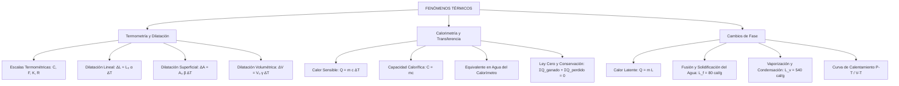

# TEMA 07: FENÓMENOS TÉRMICOS

---

## 1. PORTADA Y FICHA TÉCNICA

```
========================================================================================
CURSO: FÍSICA PREUNIVERSITARIA
EJE: 04 - CIENCIA Y TECNOLOGÍA
TEMA: 07 - FENÓMENOS TÉRMICOS (CALORIMETRÍA, TERMOMETRÍA Y DILATACIÓN)
NIVEL: PREUNIVERSITARIO AVANZADO (UNSA - UNMSM - UNI)
DURACIÓN ESTIMADA: 4 HORAS ACADÉMICAS
SISTEMA DE EVALUACIÓN: DESTREZAS COGNITIVAS (DECO), DEMOSTRACIONES Y CÁLCULO
========================================================================================
```

---

## 2. MAPA CONCEPTUAL SINTÉTICO (MERMAID)



---

## 3. MARCO TEÓRICO EXHAUSTIVO

### 3.1. Naturaleza Microscópica de la Temperatura y el Calor
- **Temperatura ($T$):** Magnitud física escalar fundamental del SI (medida en Kelvin, $\text{K}$) que cuantifica la energía cinética media de traslación por molécula de un sistema en equilibrio térmico:
  $$\langle E_k \rangle = \frac{3}{2} k_B T$$
  donde $k_B = 1.380649 \times 10^{-23} \text{ J/K}$ es la constante de Boltzmann. La temperatura no representa la energía total del cuerpo, sino el nivel de agitación molecular promedio.
- **Calor ($Q$):** Energía térmica transitoria en tránsito a través del límite de un sistema termodinámico como consecuencia exclusiva de una diferencia de temperatura. No se "posee" calor; los cuerpos poseen *energía interna* ($U$).

### 3.2. Escalas Termométricas
Para relacionar dos escalas lineales arbitrarias $X$ e $Y$ con puntos de referencia fijos (fusión y ebullición del agua a $1 \text{ atm}$):
$$\frac{T_X - T_{\text{fusión}, X}}{T_{\text{ebullición}, X} - T_{\text{fusión}, X}} = \frac{T_Y - T_{\text{fusión}, Y}}{T_{\text{ebullición}, Y} - T_{\text{fusión}, Y}}$$

Para las escalas convencionales:
- **Celsius ($^\circ\text{C}$):** $0^\circ\text{C}$ a $100^\circ\text{C}$ (100 divisiones).
- **Fahrenheit ($^\circ\text{F}$):** $32^\circ\text{F}$ a $212^\circ\text{F}$ (180 divisiones).
- **Kelvin ($\text{K}$):** $273.15 \text{ K}$ a $373.15 \text{ K}$ (escala absoluta, cero absoluto $0 \text{ K}$).
- **Rankine ($\text{R}$):** $491.67 \text{ R}$ a $671.67 \text{ R}$ (escala absoluta inglesa).

Relación matemática fundamental:
$$\frac{C}{5} = \frac{F - 32}{9} = \frac{K - 273}{5} = \frac{R - 492}{9}$$

Variaciones térmicas relativas ($\Delta T$):
$$\Delta C = \Delta K, \quad \Delta F = \Delta R, \quad \frac{\Delta C}{5} = \frac{\Delta F}{9} \implies \Delta F = 1.8 \Delta C$$

### 3.3. Dilatación Térmica
El aumento de agitación molecular distorsiona el pozo de potencial intermolecular asimétrico (potencial de Lennard-Jones), incrementando la distancia media interatómica con el aumento de temperatura.

1. **Dilatación Lineal:**
   $$\Delta L = L_0 \alpha \Delta T \implies L_f = L_0 (1 + \alpha \Delta T)$$
   Donde $\alpha$ es el coeficiente de dilatación lineal $[^\circ\text{C}^{-1} \text{ o } \text{K}^{-1}]$.
2. **Dilatación Superficial:**
   $$\Delta A = A_0 \beta \Delta T \implies A_f = A_0 (1 + \beta \Delta T)$$
   Para sólidos isotrópicos: $\beta \approx 2\alpha$.
3. **Dilatación Volumétrica:**
   $$\Delta V = V_0 \gamma \Delta T \implies V_f = V_0 (1 + \gamma \Delta T)$$
   Para sólidos isotrópicos: $\gamma \approx 3\alpha$.
4. **Variación de la Densidad con la Temperatura:**
   Dado que la masa se conserva ($m = \rho_0 V_0 = \rho_f V_f$):
   $$\rho_f = \frac{\rho_0}{1 + \gamma \Delta T} \approx \rho_0 (1 - \gamma \Delta T)$$
5. **Comportamiento Anómalo del Agua:**
   Entre $0^\circ\text{C}$ y $4^\circ\text{C}$, el agua disminuye su volumen al calentarse ($\gamma < 0$), alcanzando su máxima densidad a $3.98^\circ\text{C} \approx 4^\circ\text{C}$ ($\rho_{\max} \approx 1000 \text{ kg/m}^3$). Esto permite la vida acuática en lagos congelados en la superficie.

---

## 4. LEYES, ECUACIONES Y MODELOS MATEMÁTICOS

### 4.1. Calorimetría
1. **Calor Sensible ($Q_s$):** Transferencia de calor que produce exclusivamente variación de temperatura sin cambio de estado:
   $$Q_s = m c_e \Delta T = C \Delta T$$
   - $m$: masa del cuerpo $[\text{g} \text{ o } \text{kg}]$.
   - $c_e$: calor específico $\left[\frac{\text{cal}}{\text{g}^\circ\text{C}} \text{ o } \frac{\text{J}}{\text{kg}\cdot\text{K}}\right]$. Para agua líquida: $c_{\text{agua}} = 1.00 \frac{\text{cal}}{\text{g}^\circ\text{C}} = 4186 \frac{\text{J}}{\text{kg}\cdot\text{K}}$.
   - Para hielo: $c_{\text{hielo}} \approx 0.50 \frac{\text{cal}}{\text{g}^\circ\text{C}}$. Para vapor: $c_{\text{vapor}} \approx 0.50 \frac{\text{cal}}{\text{g}^\circ\text{C}}$.
   - $C = m c_e$: capacidad calorífica del sistema $[\text{cal}/^\circ\text{C} \text{ o } \text{J/K}]$.

2. **Equivalente Mecánico del Calor (Experimento de Joule):**
   $$1 \text{ cal} = 4.186 \text{ J}$$

3. **Equivalente en Agua de un Calorímetro ($M_{\text{eq}}$):**
   Masa ficticia de agua pura que absorbería o cedería la misma cantidad de calor que el recipiente y sus accesorios ante una misma variación de temperatura:
   $$C_{\text{cal}} = M_{\text{eq}} \cdot c_{\text{agua}} \implies M_{\text{eq}} = \frac{m_{\text{cal}} c_{\text{cal}}}{c_{\text{agua}}}$$

4. **Principio de Conservación de la Energía Térmica (Ley Cero):**
   En un sistema adiabáticamente aislado:
   $$\sum Q_{\text{ganados}} + \sum Q_{\text{perdidos}} = 0 \iff \sum Q_{\text{ganados}} = \sum |Q_{\text{perdidos}}|$$

### 4.2. Cambio de Fase y Calor Latente
Durante un cambio de fase de una sustancia pura a presión constante, la temperatura permanece estrictamente invariante:
$$Q_L = \pm m L$$
- $L_f$ (calor latente de fusión del hielo a $1\text{ atm}$, $0^\circ\text{C}$):
  $$L_f = 80 \text{ cal/g} = 3.34 \times 10^5 \text{ J/kg}$$
- $L_v$ (calor latente de vaporización del agua a $1\text{ atm}$, $100^\circ\text{C}$):
  $$L_v = 540 \text{ cal/g} = 2.26 \times 10^6 \text{ J/kg}$$

---

## 5. NEMOTECNIAS PREUNIVERSITARIAS

1. **Fórmula del Calor Sensible:**
   > **"QUÉ MA-CE-TA"** $\implies Q = m \cdot c_e \cdot \Delta T$
2. **Fórmula del Calor Latente:**
   > **"QUÉ MA-LA"** $\implies Q = m \cdot L$
3. **Escalas Termométricas:**
   > **"Cinco Fríos Restan Nueve"** $\implies \frac{C}{5} = \frac{F-32}{9}$
4. **Relación entre coeficientes de dilatación:**
   > **$\alpha : \beta : \gamma = 1 : 2 : 3$** (Lineal $\to$ 1D, Superficie $\to$ 2D, Volumen $\to$ 3D).

---

## 6. HACKING DE ADMISIÓN Y ERRORES TRAMPA FRECUENTES

- **Trampa 1 (Mezclas con Hielo y Agua):** Nunca asumas a priori que todo el hielo se derrite o que la temperatura de equilibrio es $> 0^\circ\text{C}$. Primero calcula el calor necesario para llevar todo el hielo a $0^\circ\text{C}$ y fundirlo:
  $$Q_{\text{req}} = m_h c_h (0 - T_h) + m_h L_f$$
  Calcula el calor máximo que el agua caliente puede ceder enfriándose hasta $0^\circ\text{C}$:
  $$Q_{\text{disp}} = m_a c_a (T_a - 0)$$
  Si $Q_{\text{disp}} < Q_{\text{req}}$, la temperatura final es **obligatoriamente $0^\circ\text{C}$** y solo se funde una fracción de hielo.
- **Trampa 2 (Orificios en Placas Metálicas):** Cuando una placa metálica con un orificio central se calienta, **el orificio se expande exactamente con el mismo coeficiente de dilatación que si estuviera lleno del mismo material**. ¡Jamás se encoge!
- **Trampa 3 (Confundir $\Delta T$ con $T$):** Una elevación de $20^\circ\text{C}$ equivale a una elevación de $20 \text{ K}$, pero una temperatura de $20^\circ\text{C}$ equivale a $293 \text{ K}$.

---

## 7. 5 PROBLEMAS RESUELTOS Y GRADUADOS

### Problema 1: Conversión de Escalas (Nivel Básico)
**Enunciado:** Un termómetro graduado en una escala arbitraria $^\circ\text{X}$ marca $-20^\circ\text{X}$ para el punto de fusión del hielo y $140^\circ\text{X}$ para la ebullición del agua a $1\text{ atm}$. ¿A qué temperatura en $^\circ\text{C}$ coinciden numéricamente ambas escalas ($T_X = T_C$)?

**Solución paso a paso:**
1. Planteamos la relación de linealidad entre la escala $X$ y Celsius:
   $$\frac{T_X - (-20)}{140 - (-20)} = \frac{T_C - 0}{100 - 0} \implies \frac{T_X + 20}{160} = \frac{T_C}{100} \implies \frac{T_X + 20}{8} = \frac{T_C}{5}$$
2. Imponemos la condición de coincidencia numérica: $T_X = T_C = \theta$:
   $$5(\theta + 20) = 8\theta \implies 5\theta + 100 = 8\theta \implies 3\theta = 100 \implies \theta = \frac{100}{3} \approx 33.33^\circ\text{C}$$

**Respuesta:** Coinciden a $33.33^\circ\text{C}$ ($33.33^\circ\text{X}$).

---

### Problema 2: Dilatación Diferencial (Nivel Intermedio)
**Enunciado:** Una varilla de cobre ($\alpha_{\text{Cu}} = 1.7 \times 10^{-5}\ ^\circ\text{C}^{-1}$) y una de hierro ($\alpha_{\text{Fe}} = 1.2 \times 10^{-5}\ ^\circ\text{C}^{-1}$) tienen una diferencia de longitud de $5\text{ cm}$ a cualquier temperatura. Halle la longitud inicial de cada varilla a $0^\circ\text{C}$.

**Solución paso a paso:**
1. La condición "la diferencia de longitudes se mantiene constante para cualquier $\Delta T$" implica:
   $$(L_{\text{Fe}} - L_{\text{Cu}})_T = (L_{0,\text{Fe}} - L_{0,\text{Cu}}) \implies \Delta L_{\text{Fe}} = \Delta L_{\text{Cu}}$$
2. Aplicando dilatación lineal:
   $$L_{0,\text{Fe}} \alpha_{\text{Fe}} \Delta T = L_{0,\text{Cu}} \alpha_{\text{Cu}} \Delta T \implies L_{0,\text{Fe}} \alpha_{\text{Fe}} = L_{0,\text{Cu}} \alpha_{\text{Cu}}$$
3. Sustituyendo valores:
   $$\frac{L_{0,\text{Fe}}}{L_{0,\text{Cu}}} = \frac{\alpha_{\text{Cu}}}{\alpha_{\text{Fe}}} = \frac{1.7 \times 10^{-5}}{1.2 \times 10^{-5}} = \frac{17}{12}$$
4. Dado que $L_{0,\text{Fe}} - L_{0,\text{Cu}} = 5\text{ cm}$:
   $$\frac{17}{12} L_{0,\text{Cu}} - L_{0,\text{Cu}} = 5 \implies \frac{5}{12} L_{0,\text{Cu}} = 5 \implies L_{0,\text{Cu}} = 12\text{ cm}$$
   $$L_{0,\text{Fe}} = 12 + 5 = 17\text{ cm}$$

**Respuesta:** $L_{0,\text{Cu}} = 12\text{ cm}$ y $L_{0,\text{Fe}} = 17\text{ cm}$.

---

### Problema 3: Equilibrio Térmico con Calorímetro Real (Nivel Intermedio-Avanzado)
**Enunciado:** Un calorímetro de aluminio de $200\text{ g}$ ($c_{\text{Al}} = 0.22\ \text{cal/g}^\circ\text{C}$) contiene $300\text{ g}$ de agua a $20^\circ\text{C}$. Se introduce un bloque metálico de $500\text{ g}$ a $100^\circ\text{C}$. La temperatura final de equilibrio es de $30^\circ\text{C}$. Determine el calor específico del bloque metálico desconocido.

**Solución paso a paso:**
1. Calculamos el equivalente en agua del calorímetro:
   $$M_{\text{eq}} = m_{\text{Al}} \frac{c_{\text{Al}}}{c_{\text{agua}}} = 200 \times \frac{0.22}{1.0} = 44\text{ g}$$
2. Masa total efectiva de agua que absorbe calor:
   $$m_{\text{efectiva}} = 300 + 44 = 344\text{ g}$$
3. Calor absorbido por el sistema agua-calorímetro:
   $$Q_{\text{ganado}} = m_{\text{efectiva}} c_{\text{agua}} (T_{\text{eq}} - T_0) = 344 \times 1.0 \times (30 - 20) = 3440\text{ cal}$$
4. Calor cedido por el bloque metálico:
   $$Q_{\text{cedido}} = m_x c_x (T_{0,x} - T_{\text{eq}}) = 500 \times c_x \times (100 - 30) = 35000 c_x$$
5. Por conservación de energía:
   $$35000 c_x = 3440 \implies c_x = \frac{3440}{35000} \approx 0.0983\ \frac{\text{cal}}{\text{g}^\circ\text{C}}$$

**Respuesta:** $c_x \approx 0.098\ \text{cal/g}^\circ\text{C}$ (compatible con latón o bronce).

---

### Problema 4: Mezcla con Cambio de Fase Parcial (Nivel Avanzado)
**Enunciado:** En un recipiente de capacidad calorífica despreciable se colocan $100\text{ g}$ de hielo a $-10^\circ\text{C}$ y se vierten $200\text{ g}$ de agua a $25^\circ\text{C}$. Determine la temperatura final del sistema y la masa final de hielo y agua presentes. ($c_h = 0.5\ \text{cal/g}^\circ\text{C}$, $L_f = 80\ \text{cal/g}$, $c_a = 1.0\ \text{cal/g}^\circ\text{C}$).

**Solución paso a paso:**
1. Calor para calentar el hielo de $-10^\circ\text{C}$ a $0^\circ\text{C}$:
   $$Q_1 = m_h c_h (0 - (-10)) = 100 \times 0.5 \times 10 = 500\text{ cal}$$
2. Calor para fundir TODO el hielo a $0^\circ\text{C}$:
   $$Q_2 = m_h L_f = 100 \times 80 = 8000\text{ cal}$$
   $$Q_{\text{total necesario}} = 500 + 8000 = 8500\text{ cal}$$
3. Calor máximo cedido por el agua caliente al enfriarse hasta $0^\circ\text{C}$:
   $$Q_{\text{cedido max}} = m_a c_a (25 - 0) = 200 \times 1.0 \times 25 = 5000\text{ cal}$$
4. Análisis termodinámico:
   Como $Q_1 = 500\text{ cal} < 5000\text{ cal} < 8500\text{ cal}$, el calor del agua alcanza para calentar todo el hielo hasta $0^\circ\text{C}$ y fundir una parte, pero NO todo.
   Por lo tanto, el sistema queda en coexistencia bifásica a:
   $$T_{\text{equilibrio}} = 0^\circ\text{C}$$
5. Cálculo de la masa de hielo fundida ($m_f$):
   Calor remanente para fusión:
   $$Q_{\text{remanente}} = 5000 - 500 = 4500\text{ cal}$$
   $$Q_{\text{remanente}} = m_f L_f \implies 4500 = m_f \times 80 \implies m_f = \frac{4500}{80} = 56.25\text{ g}$$
6. Composición final:
   - Masa de hielo remanente: $100 - 56.25 = 43.75\text{ g}$
   - Masa total de agua líquida: $200 + 56.25 = 256.25\text{ g}$

**Respuesta:** $T_{\text{eq}} = 0^\circ\text{C}$; Hielo: $43.75\text{ g}$, Agua: $256.25\text{ g}$.

---

### Problema 5: Inyección de Vapor y Balance Integral (Boss Challenge)
**Enunciado:** Un calorímetro adiabático de capacidad calorífica $C_{\text{cal}} = 50\ \text{cal/}^\circ\text{C}$ contiene $400\text{ g}$ de agua y $100\text{ g}$ de hielo a $0^\circ\text{C}$. Se inyecta vapor de agua a $100^\circ\text{C}$ hasta que todo el hielo se funde y la temperatura final de todo el sistema alcanza $40^\circ\text{C}$. Calcule la masa de vapor de agua condensada. ($L_v = 540\ \text{cal/g}$, $L_f = 80\ \text{cal/g}$, $c_a = 1.0\ \text{cal/g}^\circ\text{C}$).

**Solución paso a paso:**
1. Identificación de procesos que absorben calor ($Q_{\text{ganado}}$):
   - Fusión del hielo a $0^\circ\text{C}$:
     $$Q_A = m_h L_f = 100 \times 80 = 8000\text{ cal}$$
   - Calentamiento del agua proveniente del hielo fundido ($100\text{ g}$) de $0^\circ\text{C}$ a $40^\circ\text{C}$:
     $$Q_B = 100 \times 1.0 \times (40 - 0) = 4000\text{ cal}$$
   - Calentamiento del agua inicial ($400\text{ g}$) de $0^\circ\text{C}$ a $40^\circ\text{C}$:
     $$Q_C = 400 \times 1.0 \times (40 - 0) = 16000\text{ cal}$$
   - Calentamiento del calorímetro de $0^\circ\text{C}$ a $40^\circ\text{C}$:
     $$Q_D = C_{\text{cal}} \Delta T = 50 \times (40 - 0) = 2000\text{ cal}$$
   $$Q_{\text{ganado total}} = 8000 + 4000 + 16000 + 2000 = 30000\text{ cal}$$

2. Identificación de procesos que liberan calor ($Q_{\text{cedido}}$ por la masa $m_v$ de vapor):
   - Condensación del vapor a $100^\circ\text{C}$:
     $$Q_E = m_v L_v = m_v \times 540$$
   - Enfriamiento del agua condensada de $100^\circ\text{C}$ a $40^\circ\text{C}$:
     $$Q_F = m_v c_a (100 - 40) = m_v \times 1.0 \times 60 = 60 m_v$$
   $$Q_{\text{cedido total}} = 540 m_v + 60 m_v = 600 m_v$$

3. Balance térmico adiabático:
   $$600 m_v = 30000 \implies m_v = \frac{30000}{600} = 50\text{ g}$$

**Respuesta:** Se condensaron exactamente $50\text{ g}$ de vapor.

---

## 8. 5 PROBLEMAS PROPUESTOS

1. Un anillo de acero tiene un diámetro interior de $4.990\text{ cm}$ a $20^\circ\text{C}$. Se desea encajarlo sobre un eje cilíndrico de acero de $5.000\text{ cm}$ de diámetro a $20^\circ\text{C}$. Sabiendo que $\alpha_{\text{acero}} = 1.2 \times 10^{-5}\ ^\circ\text{C}^{-1}$, ¿hasta qué temperatura mínima debe calentarse el anillo?
   - *Pista:* $\Delta D = D_0 \alpha \Delta T$, con $\Delta D = 0.010\text{ cm}$.
   - *Clave:* $186.7^\circ\text{C}$.

2. Se mezclan $500\text{ g}$ de agua a $80^\circ\text{C}$ con $300\text{ g}$ de alcohol etílico a $20^\circ\text{C}$ ($c_e = 0.6\ \text{cal/g}^\circ\text{C}$) en un recipiente adiabático. Calcule la temperatura final de equilibrio térmico.
   - *Pista:* $500(1)(80 - T) = 300(0.6)(T - 20)$.
   - *Clave:* $64.1^\circ\text{C}$.

3. Se deja caer un proyectil de plomo ($c_e = 0.03\ \text{cal/g}^\circ\text{C}$) de $100\text{ g}$ a $20^\circ\text{C}$ desde una altura $H$. Si el $60\%$ de la energía mecánica disipada en el choque contra el suelo se transforma en energía térmica absorbida por el proyectil y este se calienta hasta fundirse ($T_f = 327^\circ\text{C}$, $L_f = 6\ \text{cal/g}$), halle la altura mínima $H$ ($1\text{ cal} = 4.186\text{ J}$, $g = 9.8\text{ m/s}^2$).
   - *Pista:* $0.60 \times m g H = m [c \Delta T + L_f] \times 4186$.
   - *Clave:* $10834\text{ m} \approx 10.83\text{ km}$.

4. Una esfera hueca de vidrio pyrex ($\gamma = 1.0 \times 10^{-5}\ ^\circ\text{C}^{-1}$) contiene mercurio ($\gamma_{\text{Hg}} = 1.8 \times 10^{-4}\ ^\circ\text{C}^{-1}$) llenando exactamente su volumen de $100\text{ cm}^3$ a $0^\circ\text{C}$. Si se calienta el conjunto a $100^\circ\text{C}$, ¿cuánto volumen de mercurio se derrama?
   - *Pista:* $\Delta V_{\text{derramado}} = V_0 (\gamma_{\text{liq}} - \gamma_{\text{rec}})\Delta T$.
   - *Clave:* $1.70\text{ cm}^3$.

5. En un calorímetro ideal hay $20\text{ g}$ de hielo a $-20^\circ\text{C}$. Se introducen $10\text{ g}$ de vapor a $100^\circ\text{C}$. Calcule la temperatura de equilibrio y el estado final.
   - *Pista:* Compare el calor de condensación del vapor con el calor para fundir y calentar el hielo.
   - *Clave:* $T_{\text{eq}} = 100^\circ\text{C}$, quedan $24.4\text{ g}$ de agua líquida y $5.6\text{ g}$ de vapor.

---

## 9. GLOSARIO TÉCNICO ESPECIALIZADO

1. **Capacidad Calorífica ($C$):** Cociente entre la cantidad de calor transferida a un cuerpo y la correspondiente elevación de su temperatura ($C = dQ/dT$).
2. **Calor Específico ($c_e$):** Capacidad calorífica por unidad de masa, característica intrínseca del material y de su fase.
3. **Calor Latente ($L$):** Cantidad de calor requerida por unidad de masa de una sustancia pura para cambiar de fase a presión constante.
4. **Equivalente Mecánico del Calor:** Factor de conversión entre energía mecánica y térmica ($1\text{ cal} = 4.186\text{ J}$).
5. **Cero Absoluto:** Temperatura termodinámica a la cual la entropía de un cristal perfecto es cero y la energía cinética molecular alcanza su valor mínimo mecánico-cuántico ($0\text{ K} = -273.15^\circ\text{C}$).
6. **Equilibrio Térmico:** Estado macroscópico en el cual dos o más sistemas en contacto térmico tienen la misma temperatura y el flujo neto de calor se anula.
7. **Pared Adiabática:** Límite que no permite la transferencia de energía en forma de calor entre el sistema y sus alrededores.
8. **Anomalía del Agua:** Comportamiento térmico por el cual el agua se contrae al calentarse entre $0^\circ\text{C}$ y $4^\circ\text{C}$ debido a la ruptura gradual de la estructura cristalina tetraédrica de los puentes de hidrógeno.
9. **Tira Bimetálica:** Dispositivo formado por dos láminas de metales con diferente $\alpha$ unidas rígidamente; al variar la temperatura se flexiona hacia el metal de menor dilatación.
10. **Punto Triple:** Estado termodinámico único de presión y temperatura donde coexisten en equilibrio termodinámico las tres fases de una sustancia pura (para el agua: $0.01^\circ\text{C}$ y $611.65\text{ Pa}$).

---

## 10. FLASHCARDS DE REPASO RÁPIDO

- **P: ¿Qué ocurre con la temperatura durante una transición de fase de una sustancia pura?**
  *R: Permanece constante ($Q = mL$), ya que la energía suministrada rompe o debilita los enlaces intermoleculares sin aumentar la energía cinética media.*
- **P: ¿Cuál es el calor latente de fusión y de vaporización del agua a $1\text{ atm}$?**
  *R: Fusión: $L_f = 80\ \text{cal/g}$; Vaporización: $L_v = 540\ \text{cal/g}$.*
- **P: ¿Cómo varía la densidad de un sólido isotrópico con el aumento de temperatura?**
  *R: Disminuye según $\rho_f \approx \rho_0(1 - \gamma \Delta T)$, debido al incremento volumétrico manteniendo la masa constante.*
- **P: ¿A qué temperatura coinciden las lecturas en Celsius y Fahrenheit?**
  *R: A $-40^\circ\text{C} = -40^\circ\text{F}$.*
- **P: ¿Qué es el equivalente en agua de un calorímetro?**
  *R: La masa de agua pura ($M_{\text{eq}} = m_{\text{cal}} c_{\text{cal}} / c_a$) que absorbería la misma cantidad de calor que el calorímetro para el mismo $\Delta T$.*

---

## 11. CONEXIONES INTERDISCIPLINARIAS Y APLICACIÓN REAL

- **Geología y Meteorología:** La elevada capacidad calorífica del agua ($c = 1.0\ \text{cal/g}^\circ\text{C}$) actúa como un amortiguador térmico planetario, regulando el clima costero e impidiendo oscilaciones térmicas extremas como las observadas en la Luna o en Marte.
- **Ingeniería Civil e Industrial:** Juntas de dilatación en puentes, rieles de ferrocarril y pavimentos de concreto evitan esfuerzos mecánicos catastróficos causados por la expansión térmica estacional.
- **Biología Marina:** La máxima densidad del agua a $4^\circ\text{C}$ asegura que los lagos se congelen de arriba hacia abajo, formando una capa superficial aislante de hielo que preserva el agua líquida en el fondo y sostiene la vida acuática durante el invierno.

---

## 12. BLOQUE DE GAMIFICACIÓN KMP (JSON)

```json
{
  "curso": "Fisica",
  "tema": "Fenomenos_Termicos",
  "xp_recompensa": 220,
  "insignia": "Maestro_del_Calor_y_la_Entropia",
  "desafios": [
    {
      "id": "TERM_01",
      "tipo": "opcion_multiple",
      "pregunta": "¿A qué temperatura la lectura en Fahrenheit duplica la lectura en Celsius?",
      "opciones": ["160 °C", "320 °C", "80 °C", "240 °C"],
      "respuesta_correcta": 0,
      "explicacion": "F = 2C. Usando C/5 = (F-32)/9 -> C/5 = (2C-32)/9 -> 9C = 10C - 160 -> C = 160 °C."
    },
    {
      "id": "TERM_02",
      "tipo": "opcion_multiple",
      "pregunta": "Si un orificio circular de radio R en una placa metálica se calienta, el radio del orificio:",
      "opciones": ["Aumenta proporcionalmente a α", "Disminuye porque el metal se expande hacia adentro", "Permanece rigurosamente constante", "Depende del grosor de la placa"],
      "respuesta_correcta": 0,
      "explicacion": "Cualquier cavidad en un cuerpo en dilatación se expande como si estuviera llena del mismo material constituyente."
    },
    {
      "id": "TERM_03",
      "tipo": "calculo_numerico",
      "pregunta": "Calcule la cantidad de calor en kcal necesaria para transformar 50 g de hielo a -20 °C en vapor de agua a 100 °C.",
      "respuesta_correcta": 36.5,
      "tolerancia": 0.1,
      "explicacion": "Q = m[c_h(20) + L_f + c_a(100) + L_v] = 50[10 + 80 + 100 + 540] = 50(730) = 36500 cal = 36.5 kcal."
    }
  ]
}
```
