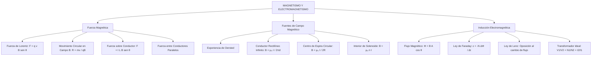

# TEMA 10: MAGNETISMO Y ELECTROMAGNETISMO

---

## 1. PORTADA Y FICHA TÉCNICA

```
========================================================================================
CURSO: FÍSICA PREUNIVERSITARIA
EJE: 04 - CIENCIA Y TECNOLOGÍA
TEMA: 10 - MAGNETISMO Y ELECTROMAGNETISMO
NIVEL: PREUNIVERSITARIO AVANZADO (UNSA - UNMSM - UNI)
DURACIÓN ESTIMADA: 5 HORAS ACADÉMICAS
SISTEMA DE EVALUACIÓN: DESTREZAS COGNITIVAS (DECO), REGLA DE LA MANO DERECHA E INDUCCIÓN
========================================================================================
```

---

## 2. MAPA CONCEPTUAL SINTÉTICO (MERMAID)



---

## 3. MARCO TEÓRICO EXHAUSTIVO

### 3.1. Naturaleza del Magnetismo e Interacción Magnética
- **Polos Magnéticos:** Los imanes presentan dos polos inseparables (Norte y Sur). No existen monopolos magnéticos aislados en la naturaleza clásica ($\nabla \cdot \vec{B} = 0$). Polos del mismo nombre se repelen; de nombres opuestos se atraen.
- **Campo Magnético ($\vec{B}$):** Campo vectorial generado por cargas eléctricas en movimiento o corrientes. Unidad SI: Tesla ($\text{T} = \frac{\text{N}}{\text{A}\cdot\text{m}}$). En el sistema CGS: Gauss ($1\text{ T} = 10^4\text{ G}$). Las líneas de inducción magnética son continuas y cerradas sobre sí mismas (salen del polo norte y entran por el sur en el exterior del imán).

### 3.2. Fuerza Magnética sobre Cargas en Movimiento (Fuerza de Lorentz)
Una partícula cargada con velocidad $\vec{v}$ inmersa en un campo magnético $\vec{B}$ experimenta una fuerza magnética dada por:
$$\vec{F}_B = q (\vec{v} \times \vec{B})$$
- **Módulo:**
  $$F_B = |q| v B \sin\theta$$
  ($\theta$ es el ángulo entre $\vec{v}$ y $\vec{B}$).
- **Dirección y Sentido:** Determinada por la *Regla de la Mano Derecha* (o regla de la palma). Si la carga es negativa ($q < 0$), el sentido resultante se invierte $180^\circ$.
- **Trabajo Nulo de la Fuerza Magnética:**
  Como $\vec{F}_B \perp \vec{v}$ en todo instante:
  $$P_B = \vec{F}_B \cdot \vec{v} = 0 \implies W_B = \int \vec{F}_B \cdot d\vec{r} = 0$$
  La fuerza magnética pura **no realiza trabajo**, no modifica la rapidez ni la energía cinética de la partícula, solo altera la dirección de su velocidad.
- **Trayectoria en Campo Magnético Uniforme ($\vec{v} \perp \vec{B}$):**
  La fuerza magnética actúa como fuerza centrípeta:
  $$F_B = F_c \implies |q| v B = \frac{m v^2}{R} \implies R = \frac{m v}{|q| B} = \frac{p}{|q| B}$$
  - **Periodo del Movimiento Ciclotrónico ($T$):**
    $$T = \frac{2\pi R}{v} = \frac{2\pi m}{|q| B} \quad (\text{Independiente del radio y de la velocidad})$$
  - Si $\vec{v}$ forma un ángulo $0^\circ < \theta < 90^\circ$ con $\vec{B}$, la trayectoria es una **hélice circular** de paso:
    $$p = v_\parallel \cdot T = (v \cos\theta) \frac{2\pi m}{|q| B}$$

### 3.3. Fuerza Magnética sobre Conductores con Corriente
Para un conductor rectilíneo de longitud $\vec{L}$ que transporta una corriente continua $I$ en un campo $\vec{B}$ uniforme:
$$\vec{F}_B = I (\vec{L} \times \vec{B}) \implies F_B = I L B \sin\theta$$
- **Fuerza entre dos conductores paralelos largos:**
  Dos conductores paralelos separados una distancia $d$ que transportan corrientes $I_1$ e $I_2$:
  $$\frac{F}{L} = \frac{\mu_0 I_1 I_2}{2\pi d}$$
  - Si las corrientes circulan en el **mismo sentido**: se **atraen**.
  - Si las corrientes circulan en **sentidos contrarios**: se **repelen**.
  (Definición oficial del Amperio en el SI histórico).

---

## 4. LEYES, ECUACIONES Y MODELOS MATEMÁTICOS

### 4.1. Generación de Campo Magnético (Ley de Biot-Savart y Ampère)
Constante de permeabilidad magnética del vacío:
$$\mu_0 = 4\pi \times 10^{-7}\ \frac{\text{T}\cdot\text{m}}{\text{A}} \approx 1.2566 \times 10^{-6}\ \frac{\text{T}\cdot\text{m}}{\text{A}}$$

1. **Conductor Rectilíneo Muy Largo (Infinito):**
   A una distancia perpendicular $d$ del conductor:
   $$B = \frac{\mu_0 I}{2\pi d}$$
   (Las líneas de campo son circunferencias concéntricas orientadas según la regla del pulgar derecho).
2. **Espira Circular Plana de Radio $R$:**
   En el centro geométrico de la espira:
   $$B = \frac{\mu_0 I}{2 R}$$
   Para una bobina plana corta de $N$ espiras: $B = \frac{\mu_0 N I}{2R}$.
3. **Solenoide Ideal (Bobina Larga de Longitud $L$ con $N$ vueltas):**
   En el interior del solenoide ($L \gg R$):
   $$B = \mu_0 \left(\frac{N}{L}\right) I = \mu_0 n I$$
   ($n = N/L$ es la densidad de espiras por metro).
4. **Toroide:**
   $$B = \frac{\mu_0 N I}{2\pi r}$$

### 4.2. Inducción Electromagnética
1. **Flujo Magnético ($\Phi$):** Medida del número de líneas de campo magnético que atraviesan una superficie de área $A$:
   $$\Phi = \vec{B} \cdot \vec{A} = B A \cos\theta \quad [\text{Weber, } \text{Wb} = \text{T}\cdot\text{m}^2]$$
   ($\theta$ es el ángulo formado entre $\vec{B}$ y el vector normal unitario $\hat{n}$ a la superficie).
2. **Ley de Faraday:** La magnitud de la fuerza electromotriz inducida ($\mathcal{E}_{\text{ind}}$) en un circuito cerrado es proporcional a la tasa de variación temporal del flujo magnético:
   $$\mathcal{E}_{\text{ind}} = -N \frac{\Delta\Phi}{\Delta t} = -N \frac{d\Phi}{dt} \quad [\text{Voltios, V}]$$
3. **Ley de Lenz (el signo negativo en Faraday):**
   "La corriente inducida fluye en un sentido tal que su propio campo magnético inducido se opone estrictamente a la variación del flujo magnético que la origina."
   - Si $\Phi$ aumenta $\implies \vec{B}_{\text{ind}}$ se opone a $\vec{B}_{\text{externo}}$.
   - Si $\Phi$ disminuye $\implies \vec{B}_{\text{ind}}$ refuerza a $\vec{B}_{\text{externo}}$.
4. **F.E.M. de Movimiento (Barra Conductora Móvil en Campo Magnético):**
   Para una varilla de longitud $L$ que se desliza perpendicularmente a una velocidad $v$ sobre rieles conductores en presencia de un campo $\vec{B}$ constante:
   $$\mathcal{E} = B L v$$
5. **Transformador Ideal:**
   Máquina eléctrica estática basada en inducción mutua que eleva o reduce voltajes alternos sin pérdidas de potencia ($P_1 = P_2$):
   $$\frac{V_1}{V_2} = \frac{N_1}{N_2} = \frac{I_2}{I_1}$$
   - $N_1, N_2$: Número de espiras en el devanado primario y secundario.

---

## 5. NEMOTECNIAS PREUNIVERSITARIAS

1. **Fuerza sobre Carga Móvil:**
   > **"F-Q-V-B"** $\implies$ **"Física: Qué Viva Bacán"** ($F = q \cdot v \cdot B \cdot \sin\theta$).
2. **Fuerza sobre Conductor:**
   > **"F = B-I-L"** $\implies$ **"BILlete"** ($F = B \cdot I \cdot L \cdot \sin\theta$).
3. **Radio de Giro Ciclotrón:**
   > **"R = M-V / Q-B"** $\implies$ **"Rojo: Mi Vaca Quema Basura"** ($R = \frac{mv}{qB}$).
4. **Campo del Conductor Rectilíneo:**
   > **"B = μ I / (2 π d)"** $\implies$ *"Dos píos de distancia"*.
5. **Campo de la Espira en el Centro:**
   > **"B = μ I / (2 R)"** $\implies$ *"Dos radios sin pi"*.

---

## 6. HACKING DE ADMISIÓN Y ERRORES TRAMPA FRECUENTES

- **Trampa 1 (Trabajo de la Fuerza Magnética):** En cualquier examen tipo admisión, si te preguntan "¿cuánto trabajo realiza el campo magnético sobre un protón en órbita circular?", la respuesta es **siempre CERO JOULES**. La fuerza magnética no acelera linealmente la partícula ni cambia su energía cinética.
- **Trampa 2 (Cargas Negativas en la Mano Derecha):** Al aplicar la regla de la mano derecha a un electrón o ion negativo, recuerda **invertir el sentido del pulgar o de la palma**.
- **Trampa 3 (Ángulo en el Flujo Magnético):** Si el problema dice "el plano de la espira forma un ángulo de $30^\circ$ con el campo magnético", el ángulo $\theta$ con el vector normal es **$60^\circ$** ($90^\circ - 30^\circ$). ¡Error clásico en UNMSM/UNI!
- **Trampa 4 (Corrientes Paralelas):** En electrostática, cargas del mismo signo se repelen; en magnetismo, **corrientes del mismo sentido se ATRAEN**.

---

## 7. 5 PROBLEMAS RESUELTOS Y GRADUADOS

### Problema 1: Fuerza de Lorentz sobre Partícula en Campo Uniforme (Nivel Básico)
**Enunciado:** Un protón ($q = 1.6 \times 10^{-19}\text{ C}$, $m = 1.67 \times 10^{-27}\text{ kg}$) penetra perpendicularmente en un campo magnético uniforme de $0.5\text{ T}$ con una rapidez de $4 \times 10^6\text{ m/s}$.
a) Calcule la magnitud de la fuerza magnética que experimenta.
b) Calcule el radio de su trayectoria circular.

**Solución paso a paso:**
1. Fuerza de Lorentz ($\theta = 90^\circ \implies \sin 90^\circ = 1$):
   $$F_B = q v B = (1.6 \times 10^{-19}\text{ C})(4 \times 10^6\text{ m/s})(0.5\text{ T}) = 3.2 \times 10^{-13}\text{ N}$$
2. Radio de la trayectoria circular ($R = \frac{mv}{qB}$):
   $$R = \frac{(1.67 \times 10^{-27}\text{ kg})(4 \times 10^6\text{ m/s})}{(1.6 \times 10^{-19}\text{ C})(0.5\text{ T})} = \frac{6.68 \times 10^{-21}}{0.8 \times 10^{-19}} = 8.35 \times 10^{-2}\text{ m} = 8.35\text{ cm}$$

**Respuesta:** a) $F_B = 3.2 \times 10^{-13}\text{ N}$; b) $R = 8.35\text{ cm}$.

---

### Problema 2: Campo Magnético Resultante por Dos Conductores (Nivel Intermedio)
**Enunciado:** Dos conductores rectilíneos y paralelos muy largos están separados una distancia de $20\text{ cm}$ en el plano horizontal. Conducen corrientes en el mismo sentido: $I_1 = 15\text{ A}$ e $I_2 = 25\text{ A}$. Halle el campo magnético neto en un punto intermedio situado sobre la recta de unión a $5\text{ cm}$ del primer conductor. ($\mu_0 = 4\pi \times 10^{-7}\text{ T}\cdot\text{m/A}$).

**Solución paso a paso:**
1. Determinación de distancias:
   - Distancia al conductor 1: $d_1 = 5\text{ cm} = 0.05\text{ m}$.
   - Distancia al conductor 2: $d_2 = 20\text{ cm} - 5\text{ cm} = 15\text{ cm} = 0.15\text{ m}$.
2. Aplicación de la regla de la mano derecha en el punto intermedio:
   - Las corrientes van hacia arriba.
   - En el punto intermedio, el campo $\vec{B}_1$ producido por $I_1$ entra al plano ($\otimes$).
   - El campo $\vec{B}_2$ producido por $I_2$ sale del plano ($\odot$).
3. Cálculo de magnitudes:
   $$B_1 = \frac{\mu_0 I_1}{2\pi d_1} = \frac{(4\pi \times 10^{-7})(15)}{2\pi (0.05)} = \frac{2 \times 10^{-7} \times 15}{0.05} = 6 \times 10^{-5}\text{ T} \quad (\otimes)$$
   $$B_2 = \frac{\mu_0 I_2}{2\pi d_2} = \frac{(4\pi \times 10^{-7})(25)}{2\pi (0.15)} = \frac{2 \times 10^{-7} \times 25}{0.15} = 3.33 \times 10^{-5}\text{ T} \quad (\odot)$$
4. Campo resultante:
   $$B_{\text{neto}} = B_1 - B_2 = (6 - 3.33) \times 10^{-5}\text{ T} = 2.67 \times 10^{-5}\text{ T} \quad (\otimes \text{ entrando al plano})$$

**Respuesta:** $B_{\text{neto}} \approx 2.67 \times 10^{-5}\text{ T}$ (hacia adentro).

---

### Problema 3: Barra Móvil e Inducción de Faraday (Nivel Intermedio-Avanzado)
**Enunciado:** Una varilla conductora de $50\text{ cm}$ de longitud y resistencia $R = 2\ \Omega$ se desliza con velocidad constante $v = 4\text{ m/s}$ sobre dos rieles horizontales conductores paralelos de resistencia despreciable, inmersos en un campo magnético perpendicular uniforme $B = 0.8\text{ T}$ que apunta hacia el interior de la página.
a) Determine la f.e.m. inducida.
b) Calcule la corriente inducida y su sentido.
c) Halle la fuerza mecánica externa requerida para mantener constante la velocidad.

**Solución paso a paso:**
1. F.E.M. de movimiento:
   $$\mathcal{E} = B L v = (0.8\text{ T})(0.5\text{ m})(4\text{ m/s}) = 1.6\text{ V}$$
2. Corriente inducida:
   $$I_{\text{ind}} = \frac{\mathcal{E}}{R} = \frac{1.6\text{ V}}{2\ \Omega} = 0.8\text{ A}$$
   Sentido (Ley de Lenz): Al moverse hacia la derecha, el área del circuito aumenta $\implies$ el flujo entrante aumenta. Para oponerse, la espira induce un campo magnético que debe salir de la página ($\odot$). Por la regla de la mano derecha, la corriente inducida circula en **sentido antihorario** (hacia arriba a través de la varilla).
3. Fuerza magnética retardadora sobre la varilla:
   $$F_B = I L B = (0.8\text{ A})(0.5\text{ m})(0.8\text{ T}) = 0.32\text{ N}$$
   Por la regla de la mano derecha, $\vec{F}_B$ apunta hacia la izquierda.
4. Fuerza externa para mantener velocidad constante ($\sum F_x = 0$):
   $$F_{\text{ext}} = F_B = 0.32\text{ N} \quad (\text{hacia la derecha})$$
   (Potencia mecánica entregada: $P = F v = 0.32 \times 4 = 1.28\text{ W}$; coincide exactamente con la disipación térmica Joule: $P_J = I^2 R = (0.8)^2 \times 2 = 1.28\text{ W}$).

**Respuesta:** a) $\mathcal{E} = 1.6\text{ V}$; b) $I = 0.8\text{ A}$ (antihorario); c) $F_{\text{ext}} = 0.32\text{ N}$.

---

### Problema 4: Selector de Velocidades y Espectrómetro de Masas (Nivel Avanzado)
**Enunciado:** Un haz de iones monovalentes positivos ($q = +e = 1.6 \times 10^{-19}\text{ C}$) atraviesa sin desviarse un selector de velocidades formado por un campo eléctrico $E = 4 \times 10^4\text{ V/m}$ y un campo magnético $B_1 = 0.2\text{ T}$ perpendiculares entre sí. Luego penetran en una cámara de deflexión donde existe un campo magnético uniforme $B_2 = 0.5\text{ T}$ perpendicular a la velocidad de los iones, describiendo una trayectoria semicircular de diámetro $D = 16.7\text{ cm}$. Calcule:
a) La velocidad de los iones filtrados.
b) La masa de los iones y su masa atómica aproximada en $\text{u}$ ($1\text{ u} = 1.66 \times 10^{-27}\text{ kg}$).

**Solución paso a paso:**
1. Condición de paso sin desviación en el selector:
   $$F_e = F_B \implies q E = q v B_1 \implies v = \frac{E}{B_1}$$
   $$v = \frac{4 \times 10^4\text{ V/m}}{0.2\text{ T}} = 2 \times 10^5\text{ m/s}$$
2. Movimiento circular en la cámara de deflexión:
   El radio de la trayectoria es $R = \frac{D}{2} = \frac{16.7\text{ cm}}{2} = 8.35\text{ cm} = 0.0835\text{ m}$.
   $$R = \frac{m v}{q B_2} \implies m = \frac{q B_2 R}{v}$$
3. Cálculo de la masa del ion:
   $$m = \frac{(1.6 \times 10^{-19}\text{ C})(0.5\text{ T})(0.0835\text{ m})}{2 \times 10^5\text{ m/s}} = \frac{6.68 \times 10^{-21}}{2 \times 10^5} = 3.34 \times 10^{-26}\text{ kg}$$
4. Expresión en unidades de masa atómica ($\text{u}$):
   $$A = \frac{3.34 \times 10^{-26}\text{ kg}}{1.66 \times 10^{-27}\text{ kg/u}} \approx 20.12\text{ u} \approx 20\text{ u}$$

**Respuesta:** a) $v = 2 \times 10^5\text{ m/s}$; b) $m \approx 3.34 \times 10^{-26}\text{ kg}$ (corresponde al isótopo Neón-20, $^{20}\text{Ne}^+$).

---

### Problema 5: Flujo Variable y Corriente Autoinducida (Boss Challenge)
**Enunciado:** Una espira circular plana de alambre de cobre de radio $r = 10\text{ cm}$ y resistencia total $R = 0.5\ \Omega$ se coloca perpendicularmente a un campo magnético uniforme dependiente del tiempo según la función:
$$B(t) = 0.4 t^2 + 0.2 t + 0.05 \quad (\text{en Teslas y segundos})$$
a) Obtenga la expresión analítica del flujo magnético $\Phi(t)$ a través de la espira.
b) Determine la f.e.m. inducida instantánea en $t = 3\text{ s}$.
c) Calcule la corriente inducida y la potencia disipada por efecto Joule en dicho instante.

**Solución paso a paso:**
1. Área de la espira circular:
   $$A = \pi r^2 = \pi (0.1\text{ m})^2 = 0.01 \pi\text{ m}^2$$
2. Expresión del flujo magnético ($\theta = 0^\circ \implies \cos 0^\circ = 1$):
   $$\Phi(t) = B(t) \cdot A = (0.4 t^2 + 0.2 t + 0.05)(0.01 \pi)\text{ Wb}$$
   $$\Phi(t) = \pi (4 \times 10^{-3} t^2 + 2 \times 10^{-3} t + 5 \times 10^{-4})\text{ Wb}$$
3. F.E.M. inducida instantánea por Ley de Faraday:
   $$\mathcal{E}(t) = -\frac{d\Phi}{dt} = -A \frac{dB}{dt} = -(0.01 \pi)(0.8 t + 0.2)$$
   Evaluando en $t = 3\text{ s}$:
   $$\left.\frac{dB}{dt}\right|_{t=3} = 0.8(3) + 0.2 = 2.4 + 0.2 = 2.6\text{ T/s}$$
   $$|\mathcal{E}| = (0.01 \pi)(2.6) = 0.026 \pi\text{ V} \approx 0.08168\text{ V} \approx 81.68\text{ mV}$$
4. Corriente inducida:
   $$I = \frac{|\mathcal{E}|}{R} = \frac{0.026 \pi}{0.5} = 0.052 \pi\text{ A} \approx 0.1634\text{ A} = 163.4\text{ mA}$$
5. Potencia disipada instantánea:
   $$P = I^2 R = (0.052 \pi)^2 \times 0.5 = (0.002704 \pi^2)(0.5) \approx 0.001352 \times 9.8696 \approx 0.01334\text{ W} \approx 13.34\text{ mW}$$

**Respuesta:** a) $\Phi(t) = 0.01\pi(0.4t^2 + 0.2t + 0.05)\text{ Wb}$; b) $|\mathcal{E}| \approx 81.7\text{ mV}$; c) $I \approx 163.4\text{ mA}$ y $P \approx 13.3\text{ mW}$.

---

## 8. 5 PROBLEMAS PROPUESTOS

1. Un electrón penetra en un campo magnético de $0.02\text{ T}$ describiendo una circunferencia con una frecuencia de $5.6 \times 10^8\text{ Hz}$. Calcule el periodo de revolución.
   - *Pista:* $T = 1/f = \frac{2\pi m}{qB}$.
   - *Clave:* $1.79 \times 10^{-9}\text{ s} \approx 1.79\text{ ns}$.

2. Una bobina de $200$ espiras cuadradas de $5\text{ cm}$ de lado rota en un campo magnético uniforme de $0.1\text{ T}$ a una velocidad de $1200\text{ rpm}$. Calcule la f.e.m. máxima inducida.
   - *Pista:* $\mathcal{E}_{\max} = N B A \omega$, con $\omega = 1200 \times \frac{2\pi}{60} = 40\pi\text{ rad/s}$.
   - *Clave:* $6.28\text{ V} = 2\pi\text{ V}$.

3. Se tiene un solenoide de $40\text{ cm}$ de longitud formado por $800$ espiras. Si por él circula una corriente de $3\text{ A}$, determine el campo magnético en el centro de su eje interior.
   - *Pista:* $B = \mu_0 (N/L) I$.
   - *Clave:* $7.54 \times 10^{-3}\text{ T} = 7.54\text{ mT}$.

4. Un transformador reductor ideal conectado a $220\text{ V}$ suministra $12\text{ V}$ en el secundario para encender una lámpara de $24\text{ W}$. Calcule la corriente en el primario.
   - *Pista:* $P_1 = P_2 = 24\text{ W} \implies I_1 = P_1 / V_1$.
   - *Clave:* $0.109\text{ A} \approx 109\text{ mA}$.

5. Dos conductores paralelos muy largos separados $10\text{ cm}$ transportan corrientes en sentidos opuestos de $20\text{ A}$ y $30\text{ A}$. Calcule la fuerza por unidad de longitud entre ellos e indique si se atraen o repelen.
   - *Pista:* $F/L = \frac{\mu_0 I_1 I_2}{2\pi d}$; corrientes opuestas repelen.
   - *Clave:* $1.2 \times 10^{-3}\text{ N/m}$ (repulsión).

---

## 9. GLOSARIO TÉCNICO ESPECIALIZADO

1. **Tesla ($\text{T}$):** Unidad de inducción magnética en el SI; equivale a la intensidad de un campo que ejerce una fuerza de $1\text{ N}$ sobre una carga de $1\text{ C}$ que se desplaza a $1\text{ m/s}$ en dirección perpendicular al campo.
2. **Fuerza de Lorentz:** Fuerza electromagnética total experimentada por una partícula cargada en presencia de campos eléctricos y magnéticos combinados ($\vec{F} = q[\vec{E} + \vec{v}\times\vec{B}]$).
3. **Flujo Magnético ($\Phi$):** Integral de superficie del producto escalar del vector campo magnético por el diferencial de área vectorial ($\Phi = \iint \vec{B}\cdot d\vec{A}$).
4. **Ley de Lenz:** Principio termodinámico-electromagnético que impone el principio de acción y reacción y conservación de la energía en la inducción mutua y autoinducción.
5. **Corrientes de Foucault (Eddy currents):** Corrientes parásitas inducidas en el seno de masas conductoras masivas sometidas a flujos magnéticos variables, que producen calentamiento por Joule y frenado electromagnético.
6. **Selector de Velocidades:** Dispositivo con campos $\vec{E}$ y $\vec{B}$ cruzados ortogonalmente que solo permite el paso en línea recta de partículas con velocidad exacta $v = E/B$.
7. **Permeabilidad Magnética ($\mu_0$):** Capacidad intrínseca del medio material o del vacío para permitir el establecimiento de líneas de flujo magnético.
8. **Diamagnetismo, Paramagnetismo y Ferromagnetismo:** Clasificación de los materiales según su respuesta magnética molecular ($\mu_r < 1$ débil repulsión, $\mu_r > 1$ débil atracción, y $\mu_r \gg 1$ con dominios magnéticos permanentes y ciclo de histéresis).
9. **Inductancia Propia ($L$):** Constante de proporcionalidad entre la f.e.m. autoinducida en un circuito y la rapidez de cambio temporal de la corriente que fluye por él ($\mathcal{E}_L = -L \frac{dI}{dt}$, medida en Henrios, $\text{H}$).
10. **Ciclotrón:** Acelerador de partículas que utiliza un campo magnético uniforme para curvar las trayectorias en espiral y un campo eléctrico oscilante de alta frecuencia para acelerarlas en cada semiciclo.

---

## 10. FLASHCARDS DE REPASO RÁPIDO

- **P: ¿Realiza trabajo mecánico la fuerza magnética sobre una carga móvil?**
  *R: No, el trabajo es estrictamente cero porque la fuerza es siempre perpendicular al vector velocidad ($\vec{F}_B \cdot \vec{v} = 0$).*
- **P: ¿Qué trayectoria describe una carga que ingresa a un campo magnético formando un ángulo oblicuo ($0^\circ < \theta < 90^\circ$)?**
  *R: Una hélice cilíndrica de paso constante.*
- **P: ¿Qué afirma la Ley de Lenz?**
  *R: Que la corriente inducida se opone siempre a la variación del flujo magnético que la generó.*
- **P: ¿Se atraen o se repelen dos alambres paralelos con corrientes en el mismo sentido?**
  *R: Se atraen mutuamente.*
- **P: ¿Cuál es la relación de transformación en un transformador ideal de voltajes, espiras y corrientes?**
  *R: $V_1 / V_2 = N_1 / N_2 = I_2 / I_1$.*

---

## 11. CONEXIONES INTERDISCIPLINARIAS Y APLICACIÓN REAL

- **Medicina Diagnóstica (Resonancia Magnética Nuclear - RMN):** Utiliza campos magnéticos superconductores intensos (de $1.5$ a $3\text{ Tesla}$) para alinear el espín nuclear de los protones de hidrógeno corporales; pulsos de radiofrecuencia generan señales detectadas por inducción de Faraday para reconstruir imágenes anatómicas de alta resolución.
- **Geofísica y Paleomagnetismo:** El efecto dínamo en el núcleo externo de hierro líquido fundido de la Tierra produce el campo geomagnético planetario, el cual desvía el viento solar (cinturones de Van Allen) y genera las auroras polares por fuerza de Lorentz.
- **Transporte de Levitación Magnética (Maglev):** Emplea la repulsión electrodinámica entre electroimanes superconductores en el tren y bobinas en la vía para levitar a $15\text{ cm}$ del suelo y eliminar el rozamiento mecánico, alcanzando velocidades superiores a $600\text{ km/h}$.

---

## 12. BLOQUE DE GAMIFICACIÓN KMP (JSON)

```json
{
  "curso": "Fisica",
  "tema": "Magnetismo_y_Electromagnetismo",
  "xp_recompensa": 230,
  "insignia": "Senor_del_Ciclotron_y_la_Induccion",
  "desafios": [
    {
      "id": "MAG_01",
      "tipo": "opcion_multiple",
      "pregunta": "¿Qué ocurre con el periodo de giro de una partícula cargada en un ciclotrón si se duplica su velocidad de entrada?",
      "opciones": [
        "Permanece idéntico porque T = 2πm / (qB)",
        "Se duplica",
        "Se reduce a la mitad",
        "Se cuadruplica"
      ],
      "respuesta_correcta": 0,
      "explicacion": "El periodo ciclotrónico depende exclusivamente de la masa, carga y campo magnético; al aumentar la velocidad, el radio se agranda en la misma proporción, manteniendo el tiempo por vuelta constante."
    },
    {
      "id": "MAG_02",
      "tipo": "opcion_multiple",
      "pregunta": "Un imán cae libremente a través de un tubo largo vertical de cobre. ¿Cómo es su aceleración comparada con g?",
      "opciones": [
        "Menor que g debido a las corrientes de Foucault inducidas en el cobre que frenan el imán",
        "Igual a g porque el cobre no es ferromagnético",
        "Mayor que g por atracción gravitacional magnética",
        "Cero en todo momento"
      ],
      "respuesta_correcta": 0,
      "explicacion": "El cobre es un conductor excelente; el imán en caída genera variaciones de flujo que inducen corrientes parásitas (Lenz) que producen una fuerza magnética opuesta hacia arriba."
    },
    {
      "id": "MAG_03",
      "tipo": "calculo_numerico",
      "pregunta": "Calcule la fuerza magnética en Newtons sobre un conductor rectilíneo de 2 m por el que circulan 5 A perpendicularmente a un campo de 0.3 T.",
      "respuesta_correcta": 3.0,
      "tolerancia": 0.05,
      "explicacion": "F = I * L * B * sen(90°) = 5 * 2 * 0.3 * 1 = 3.0 N."
    }
  ]
}
```
