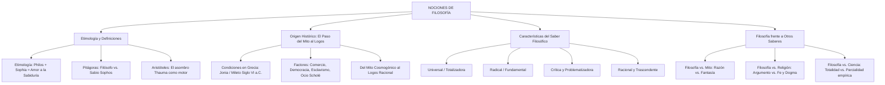

# TEMA 01: NOCIONES PRELIMINARES DE FILOSOFÍA

---

## 1. PORTADA Y FICHA TÉCNICA

```
========================================================================================
CURSO: FILOSOFÍA PREUNIVERSITARIA
EJE: 05 - PERSONA Y FAMILIA
TEMA: 01 - NOCIONES PRELIMINARES DE FILOSOFÍA (ORIGEN, ETIMOLOGÍA, CARACTERÍSTICAS Y ACTITUD)
NIVEL: PREUNIVERSITARIO AVANZADO (UNSA - UNMSM - UNI)
DURACIÓN ESTIMADA: 3 HORAS ACADÉMICAS
SISTEMA DE EVALUACIÓN: DESTREZAS COGNITIVAS (DECO), EPISTEMOLOGÍA Y ANÁLISIS CONCEPTUAL
========================================================================================
```

---

## 2. MAPA CONCEPTUAL SINTÉTICO (MERMAID)



---

## 3. MARCO TEÓRICO EXHAUSTIVO

### 3.1. Etimología y Definición de la Filosofía
- **Etimología Griega:** Formada por las raíces *philos* (amante, amigo, buscador apasionado) y *sophia* (sabiduría, conocimiento supremo). Literalmente: **"Amor a la sabiduría"**.
- **La Tradición Pitagórica:** Según testimonios de Cicerón y Heráclides Póntico, fue **Pitágoras de Samos** (siglo VI a.C.) quien utilizó por primera vez el término *philosophos* al ser interrogado por el tirano Leonte de Fliunte sobre su profesión. Pitágoras respondió que no era un sabio (*sophos*), pues la sabiduría absoluta solo pertenece a los dioses, sino un humilde amante o buscador de la sabiduría (*philosophos*), comparando la vida con los juegos olímpicos donde unos van a competir por gloria, otros por dinero y los mejores solo van como espectadores atentos a contemplar la verdad.
- **Definiciones Históricas Clásicas:**
  - *Sócrates:* La filosofía es un examen constante de uno mismo y de los demás a través de la mayéutica; es el reconocimiento de los propios límites cognitivos (*"Solo sé que nada sé"*).
  - *Platón:* La filosofía es la dialéctica del alma para ascender del mundo sensible (apariencias, *doxa*) al mundo inteligible de las Ideas eternas (*episteme*).
  - *Aristóteles:* La filosofía es la "ciencia teórica de los primeros principios y de las primeras causas de todas las cosas en tanto que son" (Metafísica).
  - *René Descartes:* La filosofía es como un árbol cuyas raíces son la metafísica, el tronco es la física y las ramas son la medicina, la mecánica y la moral.
  - *Karl Marx:* *"Los filósofos no han hecho más que interpretar de diversos modos el mundo, pero de lo que se trata es de transformarlo"* (Tesis XI sobre Feuerbach).

### 3.2. El Origen Histórico: Del Mito al Logos
La filosofía surge en las colonias griegas del Asia Menor (Jonia, específicamente la ciudad puerto de **Mileto**) durante el **siglo VI a.C.** con **Tales de Mileto**.
- **El Tránsito del Mito al Logos:**
  - **El Mito (*Mythos*):** Relato tradicional fantástico y antropomórfico que explicaba el origen del cosmos mediante la voluntad arbitraria de divinidades mitológicas (Homero en la *Ilíada* y Hesíodo en la *Teogonía*).
  - **El Logos:** Discurso racional, argumentativo y demostrativo que busca el principio intrínseco o ley natural de la realidad sin apelar a caprichos sobrenaturales.
- **Condiciones que hicieron posible el milagro griego:**
  1. **Geográfica y Comercial:** Mileto era un puerto cosmopolita que permitía el intercambio mercantil y cultural con Egipto, Babilonia y Persia, relativizando las creencias locales.
  2. **Política (La Polis y la Democracia incipiente):** El debate público en el ágora, la ausencia de una casta sacerdotal teocrática dominante y la igualdad ante la ley (*isonomía*) favorecieron la libre argumentación.
  3. **Socioeconómica (El Esclavismo y el Ocio - *Scholé*):** La existencia de una clase social liberada del trabajo manual pesado permitió el desarrollo del ocio creador y la contemplación teórica desinteresada.
  4. **Psicológica (El Asombro - *Thauma*):** Tanto Platón como Aristóteles señalaron que el **asombro o admiración** ante lo desconocido y ante la regularidad del universo es la chispa originaria que despierta el filosofar.

---

## 4. LEYES, ECUACIONES Y MODELOS MATEMÁTICOS

### 4.1. Características Esenciales del Saber Filosófico
1. **Universal o Totalizadora:** No se restringe a un sector específico de la realidad (como la física o la botánica), sino que abarca la totalidad del ser, del conocimiento, de la existencia y del cosmos en su conjunto.
2. **Radical:** Busca la "raíz" (*radix*), el fundamento último y los primeros principios que sostienen todas las cosas.
3. **Crítica:** Cuestiona todo supuesto, dogma o certeza preconcebida. No admite ninguna verdad por mera tradición o autoridad; somete todo juicio al tamiz de la razón.
4. **Problematizadora:** Formula preguntas permanentes e inquietantes; prefiere mantener abierta la duda antes que conformarse con respuestas dogmáticas superficiales.
5. **Racional y Metódica:** Utiliza el pensamiento lógico, conceptos rigurosos, argumentos demostrativos y coherencia deductiva e inductiva, descartando la fe ciega o la intuición esotérica.
6. **Trascendente:** Va más allá de la experiencia sensorial inmediata física; indaga por los fundamentos metafísicos, éticos y epistemológicos de la realidad.

### 4.2. Filosofía Frente a Otros Tipos de Saberes
| Criterio | Saber Mítico | Saber Religioso | Saber Científico | Saber Filosófico |
| :--- | :--- | :--- | :--- | :--- |
| **Fuente** | Tradición oral, imaginación poética. | Revelación divina, fe, textos sagrados. | Observación empírica, experimentación, método científico. | Razón reflexiva, crítica conceptual y argumentación lógica. |
| **Objeto** | Explicación personificada del origen del cosmos. | Salvación espiritual, relación con lo trascendente. | Parcial: parcelas delimitadas de la realidad (átomos, células, astros). | **Universal:** La totalidad del ser, el sentido, el valor y el conocimiento. |
| **Actitud** | Aceptación acrítica de narraciones fantásticas. | Dogmática (verdades inmutables por fe). | Metódica, verificable, cuantitativa y predictiva. | **Crítica, radical, problematizadora y emancipadora.** |

---

## 5. NEMOTECNIAS PREUNIVERSITARIAS

1. **Las 5 Características del Saber Filosófico:**
   > **"U-R-C-P-R"** $\implies$ **U**niversal, **R**adical, **C**rítica, **P**roblematizadora, **R**acional.
2. **Cuna de la Filosofía:**
   > **"Jonia y Mileto en el Siglo VI"** $\implies$ Con Tales de Mileto nació el Logos.
3. **El Motor del Filosofar:**
   > **"Thauma"** $\implies$ Asombro ante el Cosmos.

---

## 6. HACKING DE ADMISIÓN Y ERRORES TRAMPA FRECUENTES

- **Trampa 1 (¿Quién creó el término vs. quién es el primer filósofo?):**
  - **Pitágoras:** Fue quien inventó la palabra y se autodenominó por primera vez "filósofo".
  - **Tales de Mileto:** Es considerado unánimemente por la historia y por Aristóteles como el **primer filósofo de Occidente** al buscar el principio material racional (*arjé*) de la naturaleza.
- **Trampa 2 (Diferencia entre Ciencia y Filosofía):** La ciencia es **regional o particular** (estudia un fragmento de la realidad: la biología a los seres vivos; la geología a la corteza terrestre); la filosofía es **universal o totalizadora** (se pregunta qué es la realidad en sí, qué es el ser).
- **Trampa 3 (Radical no es ser extremista político):** En el examen de admisión, el rasgo de **radicalidad** significa estrictamente **"ir a la raíz o a los primeros principios y causas fundamentales"** del problema.

---

## 7. 5 PROBLEMAS RESUELTOS Y GRADUADOS

### Problema 1: Origen del Término Filósofo (Nivel Básico)
**Enunciado:** Según la tradición clásica transmitida por Cicerón, ¿qué sabio de la Antigüedad utilizó por primera vez el término *filósofo* al compararse modestamente con un observador desinteresado en los juegos olímpicos que busca la verdad por amor al saber?
A) Sócrates  
B) Tales de Mileto  
C) Pitágoras de Samos  
D) Aristóteles  
E) Heráclito de Éfeso  

**Solución paso a paso:**
1. Aunque Tales fue el primer filósofo en la práctica, fue **Pitágoras de Samos** quien acuñó la palabra y se definió a sí mismo como *philosophos* (amante de la sabiduría) frente al tirano Leonte.

**Respuesta:** C) Pitágoras de Samos.

---

### Problema 2: Características del Saber Filosófico (Nivel Intermedio)
**Enunciado:** Mientras que un botánico estudia la anatomía celular de las plantas y un astrónomo analiza la composición estelar de las galaxias, el filósofo se pregunta: *"¿Qué es la realidad en su conjunto?", "¿Qué significa que las cosas existan?"* y *"¿Cuál es el fundamento ontológico del ser?"*. Esta distinción resalta que, a diferencia del carácter particular de las ciencias, la filosofía posee un carácter esencialmente:
A) Dogmático y hermético  
B) Universal y totalizador  
C) Parcial y empírico  
D) Utilitario e instrumental  
E) Sensorial y descriptivo  

**Solución paso a paso:**
1. Las ciencias positivas delimitan parcelas o regiones específicas de la realidad (objeto regional o fragmentario).
2. La filosofía aborda la realidad como una totalidad omnicomprensiva sin parcelar el ser, lo que define su rasgo de **universalidad o totalización**.

**Respuesta:** B) Universal y totalizador.

---

### Problema 3: El Paso del Mito al Logos (Nivel Intermedio-Avanzado)
**Enunciado:** En la antigua Grecia del siglo VI a.C., la explicación de las tempestades marinas dejó de atribuirse a la furia caprichosa y antropomórfica del dios Poseidón blandiendo su tridente, para ser explicada por filósofos jonios como producto del calentamiento desigual de los vientos y la evaporación del agua. Esta transición epistémica fundamental en la historia del pensamiento humano se conoce como:
A) La escatología homérica  
B) El paso del mito al logos  
C) La revolución escolástica  
D) El método mayéutico platónico  
E) La dialéctica hegeliana  

**Solución paso a paso:**
1. Sustituir las explicaciones mítico-religiosas arbitrarias basadas en seres sobrenaturales antropomórficos por explicaciones causales racionales, naturales e inmanentes constituye el hito fundacional denominado **el paso del mito al logos**.

**Respuesta:** B) El paso del mito al logos.

---

### Problema 4: La Actitud Radical y Crítica en Casos DECO (Nivel Avanzado)
**Enunciado:** Un destacado abogado afirma en televisión que una ley debe acatarse ciegamente *"porque emana de la costumbre ancestral y la autoridad del gobernante"*. Un filósofo del derecho interviene y objeta: *"Ninguna costumbre ni mandato de poder es sagrado en sí mismo; debemos preguntarnos: ¿cuál es el fundamento último de la justicia?, ¿qué hace que una ley sea legítima o tiránica?"*. En esta intervención, el filósofo manifiesta con vigor las características del saber filosófico denominadas:
A) Empírica y utilitaria.  
B) Crítica y radical.  
C) Dogmática y axiomática.  
D) Tradicionalista y contingente.  
E) Inmanente y descriptiva.  

**Solución paso a paso:**
1. Cuestionar el principio de autoridad y no aceptar como dogma la costumbre revela la actitud **Crítica**.
2. Buscar la raíz profunda, la justificación última y el fundamento esencial de la legitimidad de la ley revela la actitud **Radical**.

**Respuesta:** B) Crítica y radical.

---

### Problema 5: Epistemología y Definiciones Filosóficas en Debate (Boss Challenge)
**Enunciado:** Analice las siguientes tres tesis sobre la naturaleza de la filosofía:
I. Para Aristóteles, la filosofía es la ciencia teórica de los primeros principios y de las causas supremas del ser en tanto que ser.  
II. Para Karl Marx, la filosofía tradicional ha pecado de contemplativa y especulativa, por lo que su auténtico valor reside en convertirse en praxis revolucionaria emancipadora para transformar las estructuras sociales.  
III. La filosofía y la ciencia se diferencian en que la ciencia prescinde de la demostración racional mientras que la filosofía utiliza la experimentación en laboratorios.  
¿Cuáles de las afirmaciones formuladas son filosófica e históricamente verdaderas?
A) Solo I  
B) Solo II  
C) I y II  
D) II y III  
E) I, II y III  

**Solución paso a paso:**
1. Tesis I: **Verdadera.** Coincide literalmente con la definición aristotélica de la Metafísica o Filosofía Primera.
2. Tesis II: **Verdadera.** Corresponde a la célebre Tesis XI sobre Feuerbach: *"Los filósofos no han hecho más que interpretar de diversos modos el mundo, pero de lo que se trata es de transformarlo"*.
3. Tesis III: **Falsa.** La ciencia sí utiliza la demostración racional y el laboratorio; la filosofía no opera con instrumental de laboratorio físico, sino con el análisis conceptual, la argumentación lógica y la crítica de fundamentos.

**Respuesta:** C) I y II.

---

## 8. 5 PROBLEMAS PROPUESTOS

1. ¿En qué región geográfica de la cuenca del mar Egeo surgió la filosofía occidental durante el siglo VI a.C.?
   - *Pista:* Colonias griegas en las costas del Asia Menor.
   - *Clave:* Jonia (específicamente en la ciudad de Mileto).

2. ¿Qué pensador griego es considerado por la tradición y por Aristóteles como el primer filósofo de la historia al proponer al agua como el primer principio (*arjé*) de la naturaleza?
   - *Pista:* Sabio de Mileto.
   - *Clave:* Tales de Mileto.

3. ¿Cuál es la característica del saber filosófico que consiste en formular preguntas incisivas y problematizar permanentemente lo que el sentido común considera obvio o resuelto?
   - *Pista:* Condición de problema abierto.
   - *Clave:* Problematizadora.

4. ¿Qué actitud psicológica o vivencial señalaron Platón y Aristóteles como el verdadero motor y punto de partida que despierta el asombro y el deseo de filosofar?
   - *Pista:* Palabra griega *Thauma*.
   - *Clave:* El asombro (o admiración).

5. ¿Cuál es la diferencia medular entre la actitud religiosa y la actitud filosófica frente a los enigmas de la existencia?
   - *Pista:* Una descansa en la fe y el dogma sagrado; la otra en la razón y la duda crítica.
   - *Clave:* La religión se basa en la fe y la revelación dogmática; la filosofía se basa en la argumentación racional y el cuestionamiento crítico.

---

## 9. GLOSARIO TÉCNICO ESPECIALIZADO

1. **Logos:** Razón, discurso inteligible, argumento racional y principio universal que ordena el cosmos.
2. **Mito (*Mythos*):** Narración fantástica, sagrada y simbólica que explica el origen del mundo mediante la intervención de deidades sobrenaturales.
3. **Radicalidad:** Cualidad del pensar filosófico de descender hasta la raíz última y los fundamentos constitutivos de la realidad.
4. **Totalidad:** Carácter omniabarcante de la filosofía que persigue una visión holística y comprehensiva del ser en su conjunto.
5. **Asombro (*Thauma*):** Estado anímico de perplejidad y deslumbramiento ante la existencia del mundo que detona la interrogación filosófica.
6. **Arjé (*Arché*):** Principio material, origen y causa primordial de la cual proceden y en la cual se resuelven todas las cosas de la naturaleza.
7. **Scholé:** Término griego para el ocio creador y el tiempo libre consagrado al estudio desinteresado y a la contemplación intelectual.
8. **Mayéutica:** Método socrático dialógico de preguntas y respuestas orientadas a "hacer parir" la verdad latente en la mente del interlocutor.
9. **Doxa:** Opinión común, creencia subjetiva, no fundamentada rigurosamente; contrapuesta a la *episteme* (conocimiento científico seguro).
10. **Praxis:** Acción social transformadora orientada a la modificación real y material de las condiciones del mundo (marxismo).

---

## 10. FLASHCARDS DE REPASO RÁPIDO

- **P: ¿Cuál es el significado etimológico de la palabra Filosofía?**
  *R: Amor a la sabiduría (*Philos* = amor/amistad, *Sophia* = sabiduría).*
- **P: ¿Quién acuñó el término y quién es considerado el primer filósofo?**
  *R: Pitágoras de Samos acuñó el término; Tales de Mileto fue el primer filósofo práctico de la historia.*
- **P: ¿Qué significa "el paso del mito al logos"?**
  *R: La sustitución de explicaciones poético-mágicas y sobrenaturales arbitrarias por explicaciones racionales, demostrativas y basadas en leyes naturales.*
- **P: ¿Por qué la filosofía es un saber "radical"?**
  *R: Porque indaga por los primeros principios, causas y fundamentos últimos de todas las cosas (va a la raíz del problema).*
- **P: ¿Cuál es la diferencia de enfoque entre la ciencia y la filosofía?**
  *R: La ciencia parceliza la realidad en objetos regionales concretos; la filosofía estudia la realidad como una totalidad unificada y reflexiona sobre el fundamento de las ciencias.*

---

## 11. CONEXIONES INTERDISCIPLINARIAS Y APLICACIÓN REAL

- **Epistemología de la Inteligencia Artificial:** La pregunta filosófica fundamental sobre qué es la mente, la conciencia y si un algoritmo puede pensar de verdad (*test de Turing*, habitación china de Searle) es un debate plenamente filosófico que define la arquitectura de la computación contemporánea.
- **Bioética y Biotecnología:** La edición genética mediante CRISPR-Cas9 y la clonación exigen el examen crítico filosófico de la dignidad de la vida, límites éticos del progreso y responsabilidad con las generaciones futuras.
- **Democracia y Filosofía Política:** La noción de derechos humanos, ciudadanía y separación de poderes surgió de la crítica filosófica contra el absolutismo teocrático monárquico durante la Ilustración.

---

## 12. BLOQUE DE GAMIFICACIÓN KMP (JSON)

```json
{
  "curso": "Filosofia",
  "tema": "Nociones_Preliminares_de_Filosofia",
  "xp_recompensa": 200,
  "insignia": "Amante_del_Logos_y_la_Sabiduria",
  "desafios": [
    {
      "id": "FIL_01_01",
      "tipo": "opcion_multiple",
      "pregunta": "¿Cuál de las siguientes condiciones sociohistóricas favoreció directamente el surgimiento de la filosofía en la Grecia del siglo VI a.C.?",
      "opciones": [
        "El intercambio comercial marítimo y el desarrollo de la democracia en las polis",
        "La imposición de un dogma religioso teocrático obligatorio",
        "El aislamiento geográfico continental sin contacto exterior",
        "La sumisión ciega a las narraciones homéricas"
      ],
      "respuesta_correcta": 0,
      "explicacion": "El comercio cosmopolita en Jonia y el debate en el ágora de las polis permitieron contrastar saberes y desarrollar el pensamiento racional."
    },
    {
      "id": "FIL_01_02",
      "tipo": "opcion_multiple",
      "pregunta": "La característica del saber filosófico que consiste en no admitir dogmas preestablecidos y cuestionar los fundamentos de todo saber se denomina:",
      "opciones": [
        "Crítica",
        "Dogmática",
        "Particular",
        "Sensorial"
      ],
      "respuesta_correcta": 0,
      "explicacion": "El carácter crítico de la filosofía radica en someter todo juicio y creencia al tribunal riguroso de la razón."
    },
    {
      "id": "FIL_01_03",
      "tipo": "completar",
      "pregunta": "El concepto de 'amor a la sabiduría' proviene de las raíces griegas philos y:",
      "respuesta_correcta": "Sophia",
      "explicacion": "Sophia significa sabiduría o conocimiento superior."
    }
  ]
}
```
