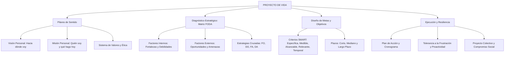

# TEMA 02: PROYECTO DE VIDA

---

## 1. PORTADA Y FICHA TÉCNICA

```
========================================================================================
CURSO: PSICOLOGÍA PREUNIVERSITARIA
EJE: 05 - PERSONA Y FAMILIA
TEMA: 02 - PROYECTO DE VIDA (VISIÓN, MISIÓN, MATRIZ FODA, METAS SMART Y ESTRATEGIAS)
NIVEL: PREUNIVERSITARIO AVANZADO (UNSA - UNMSM - UNI)
DURACIÓN ESTIMADA: 3 HORAS ACADÉMICAS
SISTEMA DE EVALUACIÓN: DESTREZAS COGNITIVAS (DECO), PLANIFICACIÓN ESTRATÉGICA Y AUTOLIDERAZGO
========================================================================================
```

---

## 2. MAPA CONCEPTUAL SINTÉTICO (MERMAID)



---

## 3. MARCO TEÓRICO EXHAUSTIVO

### 3.1. Concepto e Importancia Psicológica del Proyecto de Vida
- **Definición:** Modelo o esquema estructurado y coherente que una persona diseña de manera reflexiva y deliberada para orientar su desarrollo vital en distintas dimensiones (académica, profesional, afectiva, familiar, comunitaria y trascendente), articulando su autoconocimiento presente con metas futuras.
- **Fundamento Psicológico:**
  - Según la **Logoterapia de Viktor Frankl** (*El hombre en busca de sentido*), la motivación primordial del ser humano es la "voluntad de sentido". Quien posee un "porqué" claro para vivir puede soportar casi cualquier "cómo".
  - Previene conductas de riesgo (drogadicción, delincuencia, deserción escolar), atenúa el vacío existencial, mitiga la ansiedad desadaptativa y fomenta el desarrollo de un *locus de control interno* (Julian Rotter).

### 3.2. Visión y Misión Personal
1. **Visión Personal:** Imagen proyectada a futuro del estado deseado al que aspira llegar el individuo a largo plazo (ej. "En 10 años seré un médico cirujano reconocido por mi aporte a la salud comunitaria en Arequipa"). Es inspiradora, ambiciosa y orientadora.
2. **Misión Personal:** Declaración del propósito fundamental presente que define la razón de ser, las acciones cotidianas, los principios éticos y las competencias que se ejercen hoy para aproximarse a la visión (ej. "Estudio con disciplina y vocación de servicio diariamente para alcanzar el dominio conceptual y ético preuniversitario").
3. **Valores Rectores:** Principios axiológicos innegociables (honestidad, perseverancia, solidaridad, justicia) que delimitan los medios legítimos para alcanzar los fines.

---

## 4. LEYES, ECUACIONES Y MODELOS MATEMÁTICOS

### 4.1. Diagnóstico Personal y Matriz FODA
Herramienta de análisis estratégico adaptada de la administración a la psicología personal:

| Origen / Naturaleza | Positivos (Favorecen el éxito) | Negativos (Dificultan el éxito) |
| :--- | :--- | :--- |
| **Factores Internos** *(Controlables por el sujeto)* | **FORTALEZAS ($F$):**<br>- Hábitos de estudio consolidados.<br>- Alta capacidad de concentración.<br>- Autodisciplina y perseverancia.<br>- Habilidades lógico-matemáticas. | **DEBILIDADES ($D$):**<br>- Procrastinación frecuente.<br>- Baja tolerancia a la frustración.<br>- Dificultad para gestionar el tiempo.<br>- Inseguridad ante simulacros. |
| **Factores Externos** *(Entorno, no controlables directamente)* | **OPORTUNIDADES ($O$):**<br>- Acceso a becas académicas (PRONABEC).<br>- Apoyo económico y afectivo familiar.<br>- Bibliotecas y recursos digitales abiertos.<br>- Nuevas vacantes universitarias. | **AMENAZAS ($A$):**<br>- Alta competencia y ratio de postulantes.<br>- Inestabilidad socioeconómica del entorno.<br>- Crisis familiar o emergencias de salud.<br>- Oferta educativa informal o desregulada. |

#### Estrategias Cruzadas en la Matriz FODA:
1. **Estrategia FO (Maxi-Maxi):** Usar las fortalezas internas para aprovechar al máximo las oportunidades externas.
2. **Estrategia DO (Mini-Maxi):** Superar o compensar las debilidades internas aprovechando las oportunidades externas.
3. **Estrategia FA (Maxi-Mini):** Usar las fortalezas internas para neutralizar, amortiguar o enfrentar las amenazas externas.
4. **Estrategia DA (Mini-Mini):** Reducir al mínimo las debilidades internas y eludir o mitigar el impacto de las amenazas externas (estrategia de supervivencia/crisis).

### 4.2. Formulación de Metas SMART
Para que una meta sea psicológicamente eficaz y accionable, debe satisfacer los cinco criterios del modelo SMART:
- **S (Specific - Específica):** Definida con absoluta claridad y sin ambigüedad (no "quiero mejorar", sino "aprobar el simulacro con más de 75 puntos").
- **M (Measurable - Medible):** Debe contar con un indicador cuantitativo verificable para evaluar el progreso.
- **A (Achievable - Alcanzable):** Realista, coherente con las capacidades y recursos del sujeto, retadora pero no ilusoria.
- **R (Relevant - Relevante):** Conectada directamente con la visión y los valores centrales del proyecto de vida.
- **T (Time-bound - Temporalizada):** Con una fecha límite (*deadline*) rigurosa para evitar la dilación.

### 4.3. Temporalidad de las Metas
- **Corto Plazo:** Desde el presente inmediato hasta 6 meses (ej. terminar el banco de preguntas de Física y Química antes de fin de mes).
- **Mediano Plazo:** De 6 meses a 2 o 3 años (ej. ingresar a la Facultad de Medicina de la UNSA y aprobar el primer año lectivo invicto).
- **Largo Plazo:** De 3 a 5 o más años (ej. graduarse con honores, obtener la titulación profesional y cursar una especialización de posgrado).

---

## 5. NEMOTECNIAS PREUNIVERSITARIAS

1. **Cuadrantes del FODA:**
   > **"In-Fort-Deb"** (Internos: Fortalezas y Debilidades; bajo mi control).  
   > **"Ex-Opor-Am"** (Externos: Oportunidades y Amenazas; vienen del entorno).
2. **Criterios de una Meta SMART:**
   > **"E-M-A-R-T"** $\implies$ **E**specífica, **M**edible, **A**lcanzable, **R**elevante, **T**emporalizada.
3. **El Sentido de Viktor Frankl:**
   > *"Quien tiene un porqué, vence cualquier cómo."*

---

## 6. HACKING DE ADMISIÓN Y ERRORES TRAMPA FRECUENTES

- **Trampa 1 (Confundir Debilidad con Amenaza):** La pregunta clásica describe una situación: "Mariana no domina el curso de trigonometría". ¿Es debilidad o amenaza? Al ser un rasgo interno y corregible por Mariana, es una **DEBILIDAD**. Si la pregunta dice "el examen de admisión aumentó el número de preguntas de trigonometría", eso es una **AMENAZA** (externa).
- **Trampa 2 (Confundir Oportunidad con Fortaleza):** "Contar con una biblioteca especializada en el colegio" es una **OPORTUNIDAD** (está en el entorno exterior); "la afición por la lectura y la disciplina diaria de estudio" es una **FORTALEZA** (está en la persona).
- **Trampa 3 (Metas vagas vs. Metas SMART):** Un enunciado que dice "estudiar más duro para ser un profesional exitoso" **NO** es una meta SMART porque carece de especificidad, métrica y fecha límite temporal.

---

## 7. 5 PROBLEMAS RESUELTOS Y GRADUADOS

### Problema 1: Diferenciación de Factores FODA (Nivel Básico)
**Enunciado:** Carlos es un postulante a Ingeniería Civil que analiza su situación académica. Reconoce que tiene gran facilidad para resolver problemas de álgebra y física, pero se distrae con suma facilidad cuando estudia cerca de su teléfono móvil. Asimismo, sus padres le han ofrecido financiarle una academia de idiomas al concluir la secundaria. En este análisis, la distracción con el teléfono y el ofrecimiento de sus padres corresponden respectivamente a:
A) Fortaleza y oportunidad.  
B) Debilidad y oportunidad.  
C) Amenaza y fortaleza.  
D) Debilidad y fortaleza.  
E) Amenaza y oportunidad.  

**Solución paso a paso:**
1. La distracción con el teléfono móvil es una conducta desadaptativa propia del sujeto (interna y modificable): representa una **Debilidad**.
2. El financiamiento de la academia de idiomas proviene de sus progenitores (medio familiar externo que brinda una condición propicia): representa una **Oportunidad**.
3. Relación ordenada: Debilidad y oportunidad.

**Respuesta:** B) Debilidad y oportunidad.

---

### Problema 2: Clasificación de Estrategias FODA (Nivel Intermedio)
**Enunciado:** El Centro Preuniversitario ha implementado un programa intensivo de simulacros semanales gratuitos con retroalimentación en línea (Oportunidad). Juan, consciente de que le cuesta organizar su tiempo de repaso individual (Debilidad), decide inscribirse en el programa para estructurar obligatoriamente sus fines de semana de estudio y superar su indisciplina. ¿Qué tipo de estrategia de la matriz FODA está aplicando Juan?
A) Estrategia FO (Fortaleza - Oportunidad)  
B) Estrategia FA (Fortaleza - Amenaza)  
C) Estrategia DO (Debilidad - Oportunidad)  
D) Estrategia DA (Debilidad - Amenaza)  
E) Estrategia de conservación pasiva  

**Solución paso a paso:**
1. Juan reconoce una debilidad interna: dificultad para organizar su tiempo de forma autónoma.
2. Identifica una oportunidad del entorno: programa gratuito de simulacros estructurados.
3. Al aprovechar la oportunidad exterior para corregir o neutralizar su debilidad interna, aplica una **Estrategia DO (Mini-Maxi)**.

**Respuesta:** C) Estrategia DO (Debilidad - Oportunidad).

---

### Problema 3: Evaluación de Criterios SMART (Nivel Intermedio-Avanzado)
**Enunciado:** Analice las siguientes formulaciones de objetivos elaboradas por postulantes preuniversitarios:
I. "Quiero ingresar a la universidad lo más pronto posible para hacer orgullosa a mi familia".  
II. "Resolveré 40 ejercicios diarios de geometría y física de lunes a sábado entre las 3:00 p.m. y las 6:00 p.m., hasta el 15 de diciembre de 2026, evaluando mis aciertos semanales".  
III. "Seré el mejor estudiante de medicina de toda la historia del país".  
¿Cuál o cuáles de los enunciados cumplen rigurosamente con los criterios de una meta SMART?
A) Solo I  
B) Solo II  
C) Solo III  
D) I y II  
E) II y III  

**Solución paso a paso:**
1. Enunciado I: Es vago, no es medible numéricamente, no define una fecha límite exacta ("lo más pronto posible" no es SMART).
2. Enunciado II: Es **Específico** (40 ejercicios diarios de cursos definidos), **Medible** (conteo de aciertos semanales), **Alcanzable** y **Relevante**, y está claramente **Temporalizado** (de lunes a sábado, con hora fija y fecha límite 15 de diciembre). Cumple 100% el estándar SMART.
3. Enunciado III: Es una aspiración idealizada subjetiva, no operacionalizada ni medible de forma objetiva; roza lo inalcanzable.

**Respuesta:** B) Solo II.

---

### Problema 4: Logoterapia y Locus de Control (Nivel Avanzado)
**Enunciado:** Luego de no alcanzar una vacante en su primer intento de admisión por solo dos puntos, Rodrigo cae en un estado de desánimo. Sin embargo, recuerda que su anhelo vocacional es convertirse en ingeniero agrónomo para tecnificar el riego en el valle donde nacieron sus abuelos. Reflexiona, reconoce que falló en no repasar química orgánica, reestructura su horario diario y asume que su ingreso depende enteramente de su dedicación y autodisciplina en los próximos meses, sin culpar a los examinadores. En este caso, Rodrigo demuestra:
A) Un locus de control externo y resignación pasiva.  
B) Una conducta de indefensión aprendida y conformismo.  
C) Voluntad de sentido y predominio de locus de control interno.  
D) Dependencia afectiva e introyección neurótica.  
E) Desplazamiento reactivo de metas a corto plazo.  

**Solución paso a paso:**
1. Rodrigo se reconecta con su propósito trascendente vital (la meta vocacional de transformar el valle de sus abuelos), lo que en términos de Viktor Frankl constituye **voluntad de sentido**.
2. Al atribuir los resultados a sus propias acciones, hábitos de estudio y disciplina modificable, en lugar de culpar al azar o a factores externos incontrolables, evidencia un **locus de control interno** (Rotter).

**Respuesta:** C) Voluntad de sentido y predominio de locus de control interno.

---

### Problema 5: Proyecto Individual vs. Proyecto Colectivo (Boss Challenge)
**Enunciado:** Sofía postula a la carrera de Derecho. Al diseñar su proyecto de vida, establece que al graduarse creará una consultoría jurídica comunitaria para asesorar legalmente a comunidades campesinas en la defensa de sus recursos hídricos y derechos fundamentales. Ella afirma: *"Mi éxito profesional carecería de valor si no contribuye activamente a la reducción de las brechas de injusticia social en mi región"*. Desde la psicología del desarrollo moral y de la autorrealización, la postura de Sofía ilustra:
A) Una visión egocéntrica del éxito profesional basada en el prestigio.  
B) La subordinación del proyecto individual en un proyecto colectivo con sentido ético y social.  
C) Un conflicto de identidad personal no resuelto que genera culpa moral.  
D) Una proyección ilusoria incompatible con la viabilidad económica individual.  
E) La primacía de metas de corto plazo sobre metas de largo plazo.  

**Solución paso a paso:**
1. Un proyecto de vida no es un plan meramente individualista o utilitarista; en su nivel más maduro, se articula con el **proyecto colectivo**, es decir, el bienestar de la comunidad, la ética cívica y la transformación solidaria del entorno social.
2. Sofía integra sus talentos individuales con las necesidades de su entorno, reflejando autorrealización con sentido social y moral postconvencional (Kohlberg).

**Respuesta:** B) La subordinación del proyecto individual en un proyecto colectivo con sentido ético y social.

---

## 8. 5 PROBLEMAS PROPUESTOS

1. En la matriz FODA personal, ¿cuáles son los dos cuadrantes que corresponden a factores endógenos o internos bajo el control de la persona?
   - *Pista:* No dependen del ambiente exterior.
   - *Clave:* Fortalezas y Debilidades.

2. ¿Cuál es el componente de una meta SMART que exige determinar una métrica cuantificable para saber con certeza si se logró el objetivo?
   - *Pista:* Letra M en el acrónimo.
   - *Clave:* Medible (Measurable).

3. Una institución educativa ofrece becas integrales de pregrado para los primeros puestos del examen de admisión. Para un estudiante destacado de escasos recursos económicos, esta condición del entorno constituye una:
   - *Pista:* Factor externo favorable.
   - *Clave:* Oportunidad.

4. Un estudiante que suspende un simulacro afirma: "El examen estuvo mal elaborado y los profesores me tienen mala fe". ¿Qué tipo de locus de control manifiesta prioritariamente?
   - *Pista:* Atribuye la causalidad al exterior.
   - *Clave:* Locus de control externo.

5. ¿Qué autor y psiquiatra austríaco fundó la Logoterapia, postulando que el hallazgo de un sentido vital es el motor principal del desarrollo humano?
   - *Pista:* Autor de *El hombre en busca de sentido*.
   - *Clave:* Viktor Frankl.

---

## 9. GLOSARIO TÉCNICO ESPECIALIZADO

1. **Proyecto de Vida:** Plan anticipatorio integral que una persona elabora conscientemente para dar coherencia, dirección y trascendencia a su existencia.
2. **Visión Personal:** Proyección futura deseable y aspiracional de lo que el individuo busca llegar a ser a largo plazo.
3. **Misión Personal:** Formulación del propósito fundamental actual que guía la toma de decisiones y acciones en el presente.
4. **Matriz FODA:** Cuadrante analítico que cruza factores internos (Fortalezas y Debilidades) con factores externos (Oportunidades y Amenazas).
5. **Metas SMART:** Metodología de fijación de objetivos caracterizados por ser Específicos, Medibles, Alcanzables, Relevantes y Temporalizados.
6. **Locus de Control Interno:** Creencia psicológica de que los éxitos o fracasos propios dependen principalmente de los propios esfuerzos, decisiones y capacidades.
7. **Locus de Control Externo:** Atribución de los resultados personales a fuerzas ajenas incontrolables como la suerte, el destino o la voluntad de terceros.
8. **Resiliencia:** Capacidad psicológica para sobreponerse a situaciones adversas, traumas o fracasos, saliendo fortalecido y con un aprendizaje transformador.
9. **Logoterapia:** Escuela psicoterapéutica humanista-existencial orientada al descubrimiento del sentido fundamental de la vida.
10. **Proactividad:** Actitud conductual de anticipación y toma de iniciativa basada en la libertad de elección frente a los estímulos del medio.

---

## 10. FLASHCARDS DE REPASO RÁPIDO

- **P: ¿Cuáles son los cuadrantes internos y controlables en la matriz FODA?**
  *R: Las Fortalezas y las Debilidades.*
- **P: ¿Cuáles son los cuadrantes externos y no controlables directamente en la matriz FODA?**
  *R: Las Oportunidades y las Amenazas.*
- **P: ¿Qué significa cada letra del acrónimo SMART?**
  *R: S = Específica, M = Medible, A = Alcanzable, R = Relevante, T = Temporalizada.*
- **P: ¿Qué distingue a la visión personal de la misión personal?**
  *R: La visión es la meta aspiracional hacia dónde se quiere llegar en el futuro; la misión es quién se es y qué se hace hoy en el presente para alcanzarla.*
- **P: ¿Cuál es la diferencia entre locus de control interno y externo?**
  *R: El interno asume la responsabilidad y el control personal de los resultados; el externo culpa a la suerte, al azar o a factores fuera del propio alcance.*

---

## 11. CONEXIONES INTERDISCIPLINARIAS Y APLICACIÓN REAL

- **Psicología Positiva y Coaching de Vida:** El diseño sistemático del proyecto de vida fomenta el bienestar subjetivo (modelo PERMA de Martin Seligman), impulsando emociones positivas, compromiso (*flow*) y sentido vital.
- **Gestión Empresarial y Administración Estratégica:** Las corporaciones globales (como Google o Apple) utilizan la misma lógica de Visión, Misión, FODA y metas SMART para definir planes de expansión y supervivencia en mercados competitivos.
- **Desarrollo Comunitario:** Los proyectos de vida con sentido colectivo transforman el capital social de regiones vulnerables mediante el voluntariado, la innovación social y el emprendimiento ético.

---

## 12. BLOQUE DE GAMIFICACIÓN KMP (JSON)

```json
{
  "curso": "Psicologia",
  "tema": "Proyecto_de_Vida",
  "xp_recompensa": 200,
  "insignia": "Estratega_del_Destino_Propio",
  "desafios": [
    {
      "id": "PROY_01",
      "tipo": "opcion_multiple",
      "pregunta": "¿Cuál de las siguientes situaciones representa una AMENAZA en la matriz FODA de un postulante?",
      "opciones": [
        "El incremento inesperado de la tasa de postulantes por vacante en su carrera",
        "Su dificultad para concentrarse por las tardes",
        "El apoyo económico incondicional que recibe de su familia",
        "Su elevado puntaje en razonamiento verbal"
      ],
      "respuesta_correcta": 0,
      "explicacion": "El aumento de la competencia por vacante es un factor desfavorable proveniente del entorno externo que escapa al control directo del postulante."
    },
    {
      "id": "PROY_02",
      "tipo": "opcion_multiple",
      "pregunta": "Un objetivo formulado como: 'Voy a leer 15 páginas diarias de biología a las 7:00 a.m. de lunes a viernes durante este mes' cumple prioritariamente con ser:",
      "opciones": [
        "Una meta SMART estructurada con parámetros de tiempo y medición",
        "Un deseo abstracto no operacionalizado",
        "Una visión filosófica de largo plazo",
        "Una debilidad actitudinal"
      ],
      "respuesta_correcta": 0,
      "explicacion": "Define cantidad exacta (15 páginas), momento (7:00 a.m.), frecuencia (lunes a viernes) y plazo definido (este mes)."
    },
    {
      "id": "PROY_03",
      "tipo": "completar",
      "pregunta": "El autor de 'El hombre en busca de sentido' y creador de la logoterapia es:",
      "respuesta_correcta": "Viktor Frankl",
      "explicacion": "Frankl desarrolló la logoterapia fundamentada en la voluntad de sentido."
    }
  ]
}
```
