# TEMA 03: ORIENTACIÓN VOCACIONAL

---

## 1. PORTADA Y FICHA TÉCNICA

```
========================================================================================
CURSO: PSICOLOGÍA PREUNIVERSITARIA
EJE: 05 - PERSONA Y FAMILIA
TEMA: 03 - ORIENTACIÓN VOCACIONAL (VOCACIÓN, APTITUDES, INTERESES, PERSONALIDAD Y TEORÍAS)
NIVEL: PREUNIVERSITARIO AVANZADO (UNSA - UNMSM - UNI)
DURACIÓN ESTIMADA: 3 HORAS ACADÉMICAS
SISTEMA DE EVALUACIÓN: DESTREZAS COGNITIVAS (DECO), TEST RIASEC Y TOMA DE DECISIONES
========================================================================================
```

---

## 2. MAPA CONCEPTUAL SINTÉTICO (MERMAID)

```mermaid
graph TD
    A[ORIENTACIÓN VOCACIONAL] --> B[Diferenciación Conceptual]
    A --> C[Pilares de la Elección Vocacional]
    A --> D[Modelos y Teorías Vocacionales]
    A --> E[Factores de Distorsión y Sesgos]

    B --> B1[Vocación: Llamado interno de vida]
    B --> B2[Profesión: Formación universitaria/técnica]
    B --> B3[Ocupación y Oficio: Práctica laboral concreta]

    C --> C1[Aptitudes y Habilidades: Qué sé y puedo hacer]
    C --> C2[Intereses Vocacionales: Qué me apasiona hacer]
    C --> C3[Personalidad y Valores: Quién soy y qué valoro]
    C --> C4[Realidad Socioeconómica y Mercado Laboral]

    D --> D1[Tipología RIASEC de John Holland]
    D --> D2[Teoría del Desarrollo de Donald Super]
    D --> D3[Teoría de Necesidades de Anne Roe]

    E --> E1[Presión Familiar e Imposición de Linaje]
    E --> E2[Mito del Prestigio y la Remuneración Rápida]
    E --> E3[Estereotipos y Sesgos de Género]
```



---

## 3. MARCO TEÓRICO EXHAUSTIVO

### 3.1. Diferenciación Conceptual Fundamental
- **Vocación:** Proviene del latín *vocatio* (llamado, invocación). Es la inclinación profunda, sostenida e intrínseca de una persona hacia determinadas actividades, formas de vida y servicios a la sociedad, fundamentada en la congruencia entre sus valores, intereses y personalidad. No se nace con ella prefabricada; se descubre y construye a lo largo de la vida.
- **Profesión:** Conjunto organizado de conocimientos científicos, técnicos o humanísticos avanzados, adquiridos formalmente en una institución de educación superior (universidad o instituto tecnológico), que faculta legal y éticamente para el ejercicio de una actividad especializada (ej. Médico Cirujano, Ingeniero Civil, Licenciado en Derecho).
- **Ocupación:** Actividad laboral concreta y remunerada que una persona desempeña en un determinado puesto de trabajo en la sociedad (ej. Gerente de proyectos, Analista de datos, Docente de aula).
- **Oficio:** Actividad laboral manual, artesanal o técnica especializada que no requiere necesariamente formación universitaria de grado académico, aprendida por experiencia o entrenamiento técnico práctico (ej. electricista, carpintero, orfebre).

### 3.2. Los Cuatro Pilares de la Decisión Vocacional
Para una elección vocacional madura y congruente, deben converger cuatro componentes:
1. **Aptitudes (¿Qué puedo hacer bien?):** Potencialidades biológicas y cognitivas para adquirir habilidades y desempeñarse eficazmente en determinadas áreas con rapidez y exactitud (verbal, numérica, espacial, mecánica, musical, psicomotriz).
2. **Intereses Vocacionales (¿Qué me gusta hacer?):** Preferencias afectivas y atencionales espontáneas hacia ciertas áreas del conocimiento o actividades ocupacionales, independientes de la recompensa inmediata.
3. **Rasgos de Personalidad (¿Cómo soy?):** Patrones estables de pensamiento, temperamento y conducta (introversión vs. extroversión, estabilidad emocional, meticulosidad, liderazgo, autonomía).
4. **Contexto Ocupacional y Mercado Laboral (¿Qué necesita la sociedad y qué ofrece el entorno?):** Demanda ocupacional real, campos de acción, remuneración media, instituciones formadoras y posibilidades de emprendimiento e investigación.

---

## 4. LEYES, ECUACIONES Y MODELOS MATEMÁTICOS

### 4.1. Tipología Ocupacional RIASEC de John Holland
El modelo de Holland es el marco psicométrico más validado en orientación vocacional. Postula que las personas y los ambientes laborales se agrupan en **seis tipos de personalidad**:

```
           [R] Realista  ------  [I] Investigador
              /                      \
             /                        \
    [C] Convencional               [A] Artístico
             \                        /
              \                      /
         [E] Emprendedor ----- [S] Social
```

| Tipo | Rasgos Predominantes | Actividades Preferidas | Profesiones Típicas |
| :--- | :--- | :--- | :--- |
| **R - Realista** | Práctico, mecánico, concreto, físico, directo. Prefiere trabajar con objetos, máquinas, plantas y animales antes que con personas. | Manipulación de herramientas, ensamblaje, trabajo al aire libre. | Ingeniería mecánica, Agronomía, Arquitectura de obra, Veterinaria. |
| **I - Investigador** | Analítico, curioso, teórico, introspectivo, científico. Le gusta resolver problemas intelectuales complejos mediante la razón. | Observación, investigación empírica, análisis de datos, matemáticas. | Física, Química, Biología molecular, Matemática pura, Filosofía. |
| **A - Artístico** | Creativo, expresivo, intuitivo, original, inconformista. Valora la libertad estética y rehúye la rutina rígida. | Pintura, música, diseño gráfico, literatura, actuación, artes plásticas. | Artes visuales, Literatura, Cine, Música, Diseño de modas. |
| **S - Social** | Empático, comunicativo, cooperativo, servicial, ético. Prefiere interactuar con personas para orientarlas, educarlas o cuidarlas. | Enseñanza, terapia, trabajo comunitario, consejería, asistencia médica. | Psicología, Medicina humana, Enfermería, Educación, Trabajo social. |
| **E - Emprendedor** | Líder, persuasivo, ambicioso, asertivo, competitivo. Busca influir en los demás para alcanzar metas organizacionales o económicas. | Negociación, gestión de equipos, venta persuasiva, política, dirección. | Administración, Negocios internacionales, Derecho corporativo, Marketing. |
| **C - Convencional** | Metódico, ordenado, preciso, detallista, apegado a normas. Se desempeña con excelencia en tareas estructuradas con datos y registros. | Contabilidad, estadística aplicada, archivística, control de calidad. | Contabilidad pública, Auditoría, Finanzas, Archivología, Notaría. |

- **Principio de Congruencia de Holland:** A mayor grado de coincidencia entre la personalidad del individuo y el ambiente de trabajo (ej. una persona de tipo Social trabajando en un entorno Social), mayor será la satisfacción laboral, la estabilidad ocupacional y el rendimiento profesional.
- **Modelo Hexagonal:** Tipos adyacentes en el hexágono comparten similitudes psicológicas (ej. R e I); tipos opuestos son los más disímiles (ej. R y S, o I y E).

### 4.2. Teorías del Desarrollo Vocacional
1. **Teoría del Desarrollo de Donald Super:** Concibe la elección vocacional como un proceso continuo de desarrollo y puesta a prueba del *autoconcepto* a lo largo de cinco etapas vitales:
   - Crecimiento (0 - 14 años): fantasías y primeras nociones de aptitud.
   - **Exploración (15 - 24 años):** cristalización y especificación vocacional (etapa preuniversitaria).
   - Establecimiento (25 - 44 años): consolidación profesional.
   - Mantenimiento (45 - 64 años): actualización y liderazgo.
   - Declinación (65+ años): retiro y jubilación.
2. **Teoría Psicodinámica de Anne Roe:** Plantea que las pautas de crianza infantil (clima familiar cálido vs. frío o exigente) generan necesidades inconscientes que orientan la elección hacia profesiones enfocadas en personas o en objetos inanimados.

---

## 5. NEMOTECNIAS PREUNIVERSITARIAS

1. **Acrónimo del Modelo de Holland:**
   > **"R-I-A-S-E-C"** $\implies$ **R**ealista, **I**nvestigador, **A**rtístico, **S**ocial, **E**mprendedor, **C**onvencional.
2. **Los Tres Elementos del Triángulo Vocacional:**
   > **"P-A-I"** $\implies$ **P**ersonalidad, **A**ptitudes, **I**ntereses.
3. **Vocación vs. Profesión:**
   > *"La vocación es el motor del alma; la profesión es la herramienta técnica del cerebro."*

---

## 6. HACKING DE ADMISIÓN Y ERRORES TRAMPA FRECUENTES

- **Trampa 1 (Confundir Interés con Aptitud):** A una persona le puede encantar la música y escuchar conciertos diariamente (**Interés**), pero carecer de sentido rítmico o afinación tonal (**Aptitud**). En el examen de admisión, preguntas DECO suelen presentar casos de jóvenes fascinados por los videojuegos (interés lúdico) que fracasan rotundamente en programación o cálculo porque carecen de la aptitud lógico-matemática requerida.
- **Trampa 2 (Holland y Tipos Adyacentes):** Recuerda que en el hexágono RIASEC los opuestos son:
  - Realista $\leftrightarrow$ Social
  - Investigador $\leftrightarrow$ Emprendedor
  - Artístico $\leftrightarrow$ Convencional
- **Trampa 3 (Presión Familiar):** Cuando un estudiante postula a una carrera "porque toda mi familia son abogados y esperan que herede el bufete", se produce una elección por *introyección* o presión externa, no por madurez vocacional intrínseca.

---

## 7. 5 PROBLEMAS RESUELTOS Y GRADUADOS

### Problema 1: Diferenciación de Conceptos Vocacionales (Nivel Básico)
**Enunciado:** Pedro tiene una profunda inclinación solidaria por aliviar el dolor ajeno y salvar vidas desde niño. Por ello, tras cinco años de estudio en la Facultad de Medicina, obtuvo el título que lo acredita para ejercer en el sistema de salud del Perú. Actualmente, labora como jefe de la unidad de emergencias en un hospital público de Arequipa. En este relato, la inclinación solidaria, el título universitario y el cargo de jefe de emergencias corresponden respectivamente a:
A) Ocupación, oficio y profesión.  
B) Vocación, profesión y ocupación.  
C) Aptitud, vocación y empleo.  
D) Interés, oficio y profesión.  
E) Vocación, ocupación y oficio.  

**Solución paso a paso:**
1. La inclinación profunda y desinteresada hacia el auxilio ajeno es la **Vocación**.
2. El grado académico y título profesional universitario de médico es la **Profesión**.
3. El puesto de trabajo concreto y remunerado que desempeña activamente en el hospital es su **Ocupación**.

**Respuesta:** B) Vocación, profesión y ocupación.

---

### Problema 2: Tipología de Holland en Casos DECO (Nivel Intermedio)
**Enunciado:** Gabriela disfruta enormemente trabajar en laboratorios químicos, analizar muestras microscópicas desconocidas, formular hipótesis complejas y deducir leyes a partir de experimentos sistemáticos. Sin embargo, se incomoda cuando tiene que dirigir reuniones sociales, persuadir clientes o participar en debates políticos. De acuerdo con el modelo tipológico de John Holland, ¿qué perfiles de personalidad representan respectivamente sus mayores fortalezas y su mayor aversión?
A) Artístico y Realista  
B) Investigador y Emprendedor  
C) Convencional y Social  
D) Social e Investigador  
E) Emprendedor y Convencional  

**Solución paso a paso:**
1. Gabriela se destaca por el pensamiento abstracto, la formulación de hipótesis, el análisis de laboratorio y la curiosidad científica: este es el perfil puro **Investigador ($I$)**.
2. Rehúye el liderazgo persuasivo, la política, la venta y la dirección de personas: este es el perfil **Emprendedor ($E$)**.
3. En el hexágono de Holland, el tipo Investigador es exactamente el polo opuesto al Emprendedor.

**Respuesta:** B) Investigador y Emprendedor.

---

### Problema 3: Aptitud vs. Interés (Nivel Intermedio-Avanzado)
**Enunciado:** Matías pasa más de diez horas al día jugando videojuegos de estrategia en su computadora y comenta con entusiasmo a sus amigos que postulará a Ingeniería de Sistemas porque "le apasiona la computación". No obstante, en la academia preuniversitaria presenta notas deficientes en álgebra, lógica proposicional y física, y manifiesta fastidio cuando tiene que resolver problemas de algoritmos matemáticos en papel. Desde la orientación vocacional contemporánea, el asesor psicopedagógico debería advertir a Matías que:
A) Su alta aptitud tecnológica compensará sus dificultades matemáticas.  
B) Está confundiendo un interés de consumo lúdico con una verdadera aptitud profesional e interés intrínseco por las ciencias de la computación.  
C) Pertenece al tipo Artístico de Holland y debe dedicarse al teatro.  
D) Presenta un conflicto psicopatológico severo en su identidad personal.  
E) Debe cambiar de carrera hacia la Educación Física inmediatamente.  

**Solución paso a paso:**
1. Jugar videojuegos es una actividad recreativa pasiva o de consumo (afición lúdica). La carrera de Ingeniería de Sistemas requiere aptitudes para el razonamiento lógico formal, cálculo diferencial, estructuras de datos y resolución abstracta de problemas.
2. Al carecer del gusto y de la capacidad para el rigor matemático subyacente, Matías confunde el placer de jugar con el ejercicio profesional de la ingeniería.

**Respuesta:** B) Está confundiendo un interés de consumo lúdico con una verdadera aptitud profesional e interés intrínseco por las ciencias de la computación.

---

### Problema 4: Etapas del Desarrollo Vocacional de Super (Nivel Avanzado)
**Enunciado:** Andrea tiene 17 años, está cursando el quinto de secundaria y asiste semanalmente a talleres de orientación vocacional, ferias universitarias y visitas a laboratorios de biotecnología. Está comparando las mallas curriculares de distintas universidades y evaluando sus propias habilidades experimentales para decidir si postula a Biología o a Farmacia y Bioquímica. Según la teoría del desarrollo vocacional de Donald Super, ¿en qué etapa y subetapa del ciclo vital se encuentra Andrea?
A) Etapa de Crecimiento - subetapa de fantasía.  
B) Etapa de Mantenimiento - subetapa de actualización.  
C) Etapa de Exploración - subetapa de especificación o cristalización.  
D) Etapa de Establecimiento - subetapa de consolidación.  
E) Etapa de Declinación - subetapa de retiro.  

**Solución paso a paso:**
1. La teoría de Donald Super establece que el periodo entre los 15 y los 24 años corresponde a la **Etapa de Exploración**.
2. En esta etapa, el joven recolecta información ocupacional, examina sus habilidades y autoconcepto, y reduce el abanico de opciones para fijar una elección definitiva (subetapa de cristalización y especificación de una preferencia vocacional).

**Respuesta:** C) Etapa de Exploración - subetapa de especificación o cristalización.

---

### Problema 5: Sesgos y Toma de Decisiones Vocacionales (Boss Challenge)
**Enunciado:** Luis es un estudiante de alto rendimiento en humanidades y literatura, con destacada empatía y vocación por la docencia. Sin embargo, su padre, un acaudalado empresario metalúrgico, le advierte tajantemente: *"Si no postulas a Ingeniería de Minas para encargarte de los yacimientos mineros de la familia, no te apoyaré con un solo sol para tus estudios, porque los profesores en este país mueren de hambre"*. Angustiado, Luis renuncia a su vocación pedagógica y se inscribe en la carrera de minas para no generar conflicto familiar. Desde la perspectiva de la psicología vocacional y el autoliderazgo ético, este caso ilustra:
A) Una decisión vocacional madura basada en el principio de realidad económica.  
B) Una elección forzada por introyección y coacción parental que sacrifica la autorrealización personal.  
C) La congruencia perfecta entre el tipo Social de Luis y el ambiente Realista de la minería.  
D) La consolidación del autoconcepto vocacional según la teoría de Holland.  
E) Un conflicto exclusivo de aptitud técnica no resuelto.  

**Solución paso a paso:**
1. La elección de Luis no emana de su libertad, autoconocimiento ni autenticidad, sino de la manipulación económica y la imposición narcisista familiar (mandato o linaje parental).
2. Forzar a un perfil predominantemente Social y Humanístico a estudiar un ambiente Realista/Mecánico suele conducir al fracaso académico, deserción, frustración existencial o depresión profesional en la adultez temprana.

**Respuesta:** B) Una elección forzada por introyección y coacción parental que sacrifica la autorrealización personal.

---

## 8. 5 PROBLEMAS PROPUESTOS

1. ¿Qué letra del modelo RIASEC de John Holland describe a las personas que destacan en la organización metódica de datos, archivos contables y tareas de oficina estandarizadas?
   - *Pista:* Letra C del hexágono.
   - *Clave:* Convencional.

2. ¿Cuál es la diferencia fundamental entre aptitud e interés vocacional?
   - *Pista:* Uno es potencial de rendimiento objetivo; el otro es inclinación o gusto afectivo.
   - *Clave:* La aptitud es la capacidad potencial para desempeñarse con éxito; el interés es la preferencia o agrado emocional hacia una actividad.

3. Según el modelo hexagonal de Holland, ¿cuál es el tipo de personalidad opuesto diametralmente al tipo Artístico?
   - *Pista:* Es estructurado, ordenado y apegado a reglas.
   - *Clave:* Convencional.

4. ¿Qué teórico postuló que la elección vocacional es el reflejo de la maduración del autoconcepto a lo largo de etapas del ciclo vital (Crecimiento, Exploración, Establecimiento, Mantenimiento, Declinación)?
   - *Pista:* Psicólogo vocacional norteamericano de apellido Super.
   - *Clave:* Donald Super.

5. Un estudiante afirma que postulará a cierta carrera únicamente porque "un amigo le dijo que los egresados ganan diez mil soles al primer mes de graduarse", sin haber revisado la malla curricular ni sus propias habilidades. ¿Qué factor de riesgo o sesgo se evidencia?
   - *Pista:* Mito o falacia del prestigio y dinero rápido por desinformación.
   - *Clave:* Desinformación y mito de la remuneración económica inmediata.

---

## 9. GLOSARIO TÉCNICO ESPECIALIZADO

1. **Vocación:** Inclinación intrínseca y vital que orienta los intereses, valores y aptitudes de una persona hacia un quehacer con sentido y servicio a la comunidad.
2. **Aptitud:** Capacidad potencial innata o aprendida para realizar con destreza, rapidez y precisión una tarea cognitiva, psicomotora o técnica.
3. **Interés Vocacional:** Atracción y compromiso afectivo duradero que experimenta una persona hacia determinados campos del saber o actividades ocupacionales.
4. **Tipología RIASEC:** Modelo psicométrico de John Holland que clasifica personalidades y ambientes laborales en seis dimensiones hexagonales.
5. **Autoconcepto Vocacional:** Percepción y evaluación que el sujeto tiene de sus propias habilidades, valores y roles profesionales futuros (Donald Super).
6. **Congruencia Ocupacional:** Grado de armonía o coincidencia entre el patrón de personalidad de un sujeto y las demandas del entorno de trabajo.
7. **Consistencia Vocacional:** Grado de cercanía o afinidad interna entre las dos o tres áreas prioritarias del perfil de una persona dentro del hexágono de Holland.
8. **Introyección Parental:** Adopción acrítica y pasiva de mandatos, expectativas o profesiones deseadas por los padres en detrimento de la propia vocación.
9. **Malla Curricular:** Estructura organizada de asignaturas, competencias y prácticas profesionales que componen un plan de estudios universitarios.
10. **Mercado Ocupacional:** Ámbito socioeconómico donde interactúan la oferta de profesionales graduados y la demanda de competencias por parte del sector público y privado.

---

## 10. FLASHCARDS DE REPASO RÁPIDO

- **P: ¿Cuáles son los seis tipos de personalidad en el modelo de John Holland?**
  *R: Realista (R), Investigador (I), Artístico (A), Social (S), Emprendedor (E) y Convencional (C).*
- **P: ¿Qué ocurre si existe congruencia entre la personalidad y el ambiente laboral según Holland?**
  *R: Se incrementa la satisfacción laboral, la productividad, la estabilidad en el puesto y el bienestar psicológico.*
- **P: ¿Cuál es la diferencia entre profesión y oficio?**
  *R: La profesión exige formación académica universitaria de grado con base teórica y marco regulatorio; el oficio es de naturaleza técnico-manual o práctica.*
- **P: ¿Tener un gran interés en una carrera garantiza el éxito en ella?**
  *R: No, se requiere además poseer las aptitudes cognitivas o psicomotoras necesarias y rasgos de personalidad afines.*
- **P: ¿Qué etapa vital corresponde a la preparación y elección universitaria según Donald Super?**
  *R: La Etapa de Exploración (15 a 24 años).*

---

## 11. CONEXIONES INTERDISCIPLINARIAS Y APLICACIÓN REAL

- **Economía Laboral y Sociología de la Educación:** La discrepancia entre la oferta de graduados universitarios en ciertas carreras tradicionales y las demandas de la matriz productiva nacional (transformación digital, transición energética, biotecnología) genera subempleo y frustración vocacional.
- **Psicología Organizacional y Selección de Personal:** Los departamentos de recursos humanos de las empresas globales aplican el test de Holland y pruebas de competencias para el diseño de puestos de trabajo y retención de talento.
- **Neurociencia del Autocontrol:** La maduración tardía de la corteza prefrontal dorsolateral (que concluye hacia los 23-25 años) explica por qué los adolescentes requieren acompañamiento psicopedagógico estructurado para tomar decisiones vocacionales de largo plazo.

---

## 12. BLOQUE DE GAMIFICACIÓN KMP (JSON)

```json
{
  "curso": "Psicologia",
  "tema": "Orientacion_Vocacional",
  "xp_recompensa": 200,
  "insignia": "Brujula_de_la_Vocacion_y_el_Futuro",
  "desafios": [
    {
      "id": "VOC_01",
      "tipo": "opcion_multiple",
      "pregunta": "¿Cuál de los siguientes pares representa tipos diametralmente opuestos en el hexágono de Holland?",
      "opciones": [
        "Investigador y Emprendedor",
        "Social y Artístico",
        "Realista e Investigador",
        "Convencional y Realista"
      ],
      "respuesta_correcta": 0,
      "explicacion": "En el modelo hexagonal RIASEC, los tipos opuestos son: Realista-Social, Investigador-Emprendedor y Artístico-Convencional."
    },
    {
      "id": "VOC_02",
      "tipo": "opcion_multiple",
      "pregunta": "Un estudiante de alto talento en redacción, debate y persuasión que disfruta de liderar equipos y negociar acuerdos se asocia prioritariamente al tipo:",
      "opciones": [
        "Emprendedor (E)",
        "Realista (R)",
        "Convencional (C)",
        "Investigador (I)"
      ],
      "respuesta_correcta": 0,
      "explicacion": "El perfil Emprendedor destaca por el liderazgo, la asertividad, la persuasión comercial o política y el logro de metas organizacionales."
    },
    {
      "id": "VOC_03",
      "tipo": "completar",
      "pregunta": "La teoría del desarrollo vocacional a lo largo del ciclo vital y del autoconcepto fue formulada por:",
      "respuesta_correcta": "Donald Super",
      "explicacion": "Donald Super estructuró las etapas del desarrollo vocacional (crecimiento, exploración, etc.)."
    }
  ]
}
```
