# TEMA 04: HÁBITOS DE ESTUDIO Y GESTIÓN DEL APRENDIZAJE

---

## 1. PORTADA Y FICHA TÉCNICA

```
========================================================================================
CURSO: PSICOLOGÍA PREUNIVERSITARIA
EJE: 05 - PERSONA Y FAMILIA
TEMA: 04 - HÁBITOS DE ESTUDIO, GESTIÓN DEL TIEMPO Y TÉCNICAS DE APRENDIZAJE
NIVEL: PREUNIVERSITARIO AVANZADO (UNSA - UNMSM - UNI)
DURACIÓN ESTIMADA: 3 HORAS ACADÉMICAS
SISTEMA DE EVALUACIÓN: DESTREZAS COGNITIVAS (DECO), METACOGNICIÓN Y RENDIMIENTO ACADÉMICO
========================================================================================
```

---

## 2. MAPA CONCEPTUAL SINTÉTICO (MERMAID)

```mermaid
graph TD
    A[HÁBITOS DE ESTUDIO] --> B[Psicología del Hábito]
    A --> C[Gestión del Tiempo y Planificación]
    A --> D[Técnicas de Procesamiento Cognitivo]
    A --> E[Condiciones Ambientales e Higiene del Aprendizaje]

    B --> B1[Definición: Automatización por repetición]
    B --> B2[Bucle del Hábito: Señal - Rutina - Recompensa]

    C --> C1[Matriz de Eisenhower: Urgente vs. Importante]
    C --> C2[Técnica Pomodoro: Bloques de foco e hiperfoco]
    C --> C3[Curva del Olvido de Ebbinghaus y Repaso Espaciado]

    D --> D1[Método Cornell de Toma de Apuntes]
    D --> D2[Técnica Feynman: Explicación simple y metacognición]
    D --> D3[Organizadores Visuales: Mapas Conceptuales y Mentales]
    D --> D4[Método EPLERR / SQ3R de Lectura Comprensiva]

    E --> E1[Ergonomía, Iluminación y Ventilación]
    E --> E2[Sueño MOR/No MOR y Consolidación de Memoria]
    E --> E3[Control de Estímulos y Distractores Digitales]
```



---

## 3. MARCO TEÓRICO EXHAUSTIVO

### 3.1. Naturaleza Psicológica del Hábito de Estudio
- **Definición:** Pauta conductual adquirida por la repetición constante y deliberada de actos de estudio en condiciones espaciotemporales regulares, que llega a automatizarse requiriendo progresivamente menor esfuerzo volitivo consciente.
- **Bucle Neuroconductual del Hábito (Duhigg - Clear):**
  1. **Señal (Disparador):** Estímulo ambiental o temporal que activa la conducta (ej. sentarse en el escritorio ordenado a las 3:00 p.m.).
  2. **Rutina:** La acción o conducta de estudio en sí misma (resolver problemas, repasar fichas).
  3. **Recompensa:** Satisfacción neuroquímica (dopamina) o gratificación por el deber cumplido (descanso, logro en el simulacro).
  4. **Anhelo (*Craving*):** Expectativa anticipatoria de la recompensa que consolida el circuito neuronal en los ganglios basales.

### 3.2. Gestión Estratégica del Tiempo
1. **Matriz de Eisenhower (Gestión de Prioridades):**
   Clasifica las tareas cruzando dos dimensiones: **Importancia** (impacto a largo plazo en las metas vitales) y **Urgencia** (presión temporal inmediata):
   - **Cuadrante I (Urgente e Importante - Crisis):** Exámenes inmediatos, tareas con plazo que vence hoy. Se debe *HACER YA*.
   - **Cuadrante II (No Urgente pero Importante - Planificación y Calidad):** Estudio regular con anticipación, salud física, elaboración de resúmenes, prevención. Es el **cuadrante del éxito preuniversitario**. Se debe *DECIDIR Y AGENDAR*.
   - **Cuadrante III (Urgente pero No Importante - Interrupciones):** Notificaciones innecesarias, llamadas no prioritarias, favores de última hora. Se debe *DELEGAR o MINIMIZAR*.
   - **Cuadrante IV (Ni Urgente ni Importante - Pérdida de tiempo):** *Scroll* infinito en redes sociales, procrastinación pasiva. Se debe *ELIMINAR*.

2. **Técnica Pomodoro (Francesco Cirillo):**
   Estructuración del trabajo en intervalos de concentración absoluta (*hiperfoco*) de 25 minutos seguidos de 5 minutos de pausa activa; tras cuatro ciclos, se toma un descanso prolongado de 15 a 30 minutos. Previene la fatiga mental y evita la saturación cognitiva.

3. **Curva del Olvido de Hermann Ebbinghaus y Repaso Espaciado (*Spaced Repetition*):**
   - Sin repaso, la memoria humana olvida hasta el $50\%$ de la información aprendida a las 24 horas y cerca del $80\%$ a la semana.
   - El **repaso espaciado** combate activamente la curva: al repasar a las 24 horas, a los 3 días, a la semana y al mes, la tasa de decaimiento se aplana progresivamente, consolidando la memoria a largo plazo en las redes corticohipocámpicas.

---

## 4. LEYES, ECUACIONES Y MODELOS MATEMÁTICOS

### 4.1. Técnicas Avanzadas de Procesamiento Cognitivo
1. **Método Cornell de Toma de Apuntes (Walter Pauk):**
   División de la hoja de apuntes en tres zonas estratégicas:
   - **Columna derecha (Notas de clase, $70\%$ del ancho):** Información sustantiva, esquemas, fórmulas, ideas principales en tiempo real.
   - **Columna izquierda (Palabras clave / Preguntas, $30\%$):** Formulación de preguntas guía y conceptos detonantes para autoevaluación (*active recall*).
   - **Franja inferior (Resumen, $5\text{ cm}$):** Breve síntesis de dos o tres oraciones con las conclusiones fundamentales.
2. **Técnica Feynman de Aprendizaje Profundo:**
   Consta de cuatro pasos para verificar la comprensión conceptual genuina:
   - Paso 1: Elegir el concepto y escribir su título en una hoja en blanco.
   - Paso 2: Explicar el concepto con palabras propias sencillas, como si se enseñara a un niño de 10 años, sin tecnicismos memorísticos.
   - Paso 3: Identificar las lagunas de comprensión (*gaps*) donde la explicación se trabe o recurra a jerga vacía.
   - Paso 4: Volver a la fuente teórica original, aclarar la duda y simplificar la analogía.
3. **Método de Lectura Comprensiva EPLERR (o SQ3R):**
   - **E**xaminar (Survey): Vistazo global a títulos, subtítulos y gráficos.
   - **P**reguntar (Question): Formularse preguntas sobre el contenido.
   - **L**eer (Read): Lectura analítica activa buscando respuestas.
   - **E**squematizar / Recitar (Recite): Sintetizar y verbalizar con palabras propias.
   - **R**esumir / Repasar (Review): Contrastar lo aprendido y repasar periódicamente.

### 4.2. Higiene del Aprendizaje y Factores Fisiológicos
- **Consolidación de la Memoria en el Sueño:** Durante las fases de sueño profundo (ondas lentas Delta) y sueño MOR (Movimientos Oculares Rápidos), el hipocampo transfiere la información aprendida hacia la neocorteza cerebral. Privarse de sueño antes de un examen deteriora drásticamente la memoria operativa, la atención sostenida y el razonamiento lógico.
- **Ergonomía y Ambiente de Estudio:**
  - Iluminación adecuada (preferentemente natural o blanca indirecta sin reflejos).
  - Temperatura templada ($18^\circ\text{C} - 22^\circ\text{C}$) y ventilación continua (el exceso de dióxido de carbono produce somnolencia).
  - Postura ergonómica (espalda recta a $90^\circ$, pies apoyados en el suelo).

---

## 5. NEMOTECNIAS PREUNIVERSITARIAS

1. **Pasos de la Técnica Feynman:**
   > **"E-E-I-S"** $\implies$ **E**legir, **E**xplicar, **I**dentificar lagunas, **S**implificar.
2. **Método Cornell de Apuntes:**
   > **"N-C-R"** $\implies$ **N**otas (derecha), **C**laves (izquierda), **R**esumen (abajo).
3. **Cuadrante de Eisenhower del Postulante Exitoso:**
   > **"El Cuadrante II es el Rey":** Importante pero No Urgente (la prevención y el estudio diario con anticipación).

---

## 6. HACKING DE ADMISIÓN Y ERRORES TRAMPA FRECUENTES

- **Trampa 1 (Relectura pasiva vs. Evocación activa):** Releer un texto cinco veces crea la "ilusión de competencia" (reconocimiento pasivo), pero rinde muy poco en el examen. El método más eficiente según la ciencia cognitiva es el **recuerdo activo (*active recall*)**: cerrar el libro y forzarse a recuperar y explicar la información desde la memoria.
- **Trampa 2 (El mito del amanecida antes del examen):** Estudiar toda la noche previa privándose del sueño inhibe la sinaptogénesis y la consolidación de la memoria a largo plazo en el hipocampo, aumentando los bloqueos mentales ("quedarse en blanco") por sobrecarga de cortisol.
- **Trampa 3 (Multitarea o Multitasking):** La neurociencia demuestra que el cerebro humano no procesa dos tareas cognitivas complejas en paralelo, sino que realiza una alternancia rápida y costosa de atención (*task switching*), incrementando la tasa de errores en un $50\%$ y duplicando el tiempo requerido.

---

## 7. 5 PROBLEMAS RESUELTOS Y GRADUADOS

### Problema 1: Identificación de Cuadrantes de Eisenhower (Nivel Básico)
**Enunciado:** Daniel elabora su cronograma preuniversitario. Dedica dos horas cada tarde a resolver simulacros temáticos y elaborar mapas conceptuales de temas que vendrán dentro de dos meses en el examen de admisión, evitando así acumular dudas a última hora. Según la Matriz de Gestión del Tiempo de Eisenhower, ¿en qué cuadrante está operando prioritariamente Daniel?
A) Cuadrante I: Urgente e Importante  
B) Cuadrante II: No urgente pero Importante  
C) Cuadrante III: Urgente pero No importante  
D) Cuadrante IV: Ni urgente ni Importante  
E) Cuadrante de la procrastinación  

**Solución paso a paso:**
1. Las actividades de Daniel tienen un altísimo impacto en su objetivo de ingresar (son **Importantes**).
2. Sin embargo, no tienen una fecha límite inmediata de entrega para el mismo día (son **No Urgentes** en el corto plazo; se realizan con anticipación planificada).
3. Este es el perfil distintivo del **Cuadrante II**, base de la efectividad personal y el alto rendimiento.

**Respuesta:** B) Cuadrante II: No urgente pero Importante.

---

### Problema 2: Aplicación del Método Cornell (Nivel Intermedio)
**Enunciado:** Durante la clase de Biología Celular, Lucía divide su cuaderno según el método Cornell. En la columna lateral izquierda anota: *"¿Cuál es la función del complejo de Golgi?"* y *"¿Qué diferencia hay entre retículo endoplasmático liso y rugoso?"*. Al día siguiente, cubre la columna derecha de sus notas e intenta responder en voz alta a esas preguntas sin mirar los apuntes. ¿Qué principio pedagógico y cognitivo está aplicando Lucía?
A) Memoria mecánica eidética  
B) Repetición subvocal pasiva  
C) Evocación activa (Active Recall) guiada por claves  
D) Condicionamiento instrumental de escape  
E) Aprendizaje por imitación vicaria  

**Solución paso a paso:**
1. El método Cornell utiliza la columna izquierda para formular preguntas detonantes o palabras clave.
2. Al tapar las notas y esforzarse conscientemente por recuperar la respuesta almacenada en la memoria, se ejecuta la **evocación activa (*active recall*)**, fortaleciendo las huellas mnémicas neuronales mucho más que la simple lectura pasiva.

**Respuesta:** C) Evocación activa (Active Recall) guiada por claves.

---

### Problema 3: Curva del Olvido y Programación de Repasos (Nivel Intermedio-Avanzado)
**Enunciado:** Marcos estudió con gran dedicación las 15 leyes de la estequiometría el día lunes y resolvió todos los problemas correctamente. Confiado, no volvió a revisar el tema hasta tres semanas después, descubriendo con angustia que no recordaba los procedimientos básicos en un simulacro. ¿Qué fenómeno de la psicología cognitiva explica la situación de Marcos y cuál era la estrategia preventiva adecuada?
A) Amnesia retrógrada traumática; debía consumir estimulantes farmacéuticos.  
B) Interferencia proactiva; debía estudiar más cursos simultáneamente.  
C) Decaimiento por la curva del olvido de Ebbinghaus; debía aplicar repaso espaciado sistemático.  
D) Extinción conductual pavloviana; debía aplicar refuerzos tangibles.  
E) Distracción sensorial periférica; debía cambiar de escritorio.  

**Solución paso a paso:**
1. Hermann Ebbinghaus demostró que los contenidos recién adquiridos sufren una pérdida rápida y exponencial si no se reactivan (curva del olvido).
2. Para frenar el decaimiento de la huella de memoria, la estrategia científicamente demostrada es el **repaso espaciado** en intervalos crecientes (ej. a las 24 horas, a los 7 días y a los 21 días).

**Respuesta:** C) Decaimiento por la curva del olvido de Ebbinghaus; debía aplicar repaso espaciado sistemático.

---

### Problema 4: Neurobiología del Sueño y Consolidación Mnémica (Nivel Avanzado)
**Enunciado:** Faltando 24 horas para su examen final, Esteban decide tomar cinco tazas de café y estudiar de corrido toda la madrugada sin dormir un solo minuto, acumulando 18 horas seguidas de lectura. Al recibir su prueba al día siguiente, experimenta fatiga visual, lentitud psicomotora, fallas para recordar fórmulas elementales y una intensa sensación de "mente en blanco". Desde la neurobiología del aprendizaje, ¿por qué fracasó la estrategia de Esteban?
A) Porque el exceso de cafeína destruyó instantáneamente las sinapsis de la médula espinal.  
B) Porque durante el sueño se produce la consolidación de la memoria en la neocorteza; la privación impidió fijar lo aprendido y saturó la corteza prefrontal de cortisol y adenosina.  
C) Porque la memoria humana solo funciona mediante el sistema somatosensorial periférico.  
D) Porque el café induce un estado de trance hipnótico incompatible con el lenguaje.  
E) Porque debió haber tomado bebidas energéticas en lugar de café.  

**Solución paso a paso:**
1. El sueño no es un estado pasivo; durante las fases de sueño profundo (Delta) y MOR, el hipocampo realiza la consolidación y transferencia sináptica de memorias hacia la corteza cerebral de largo plazo.
2. La privación de sueño acumula adenosina (fatiga cerebral), incrementa el cortisol (estrés que bloquea el hipocampo) y colapsa las funciones ejecutivas de la corteza prefrontal (atención sostenida, memoria operativa y toma de decisiones).

**Respuesta:** B) Porque durante el sueño se produce la consolidación de la memoria en la neocorteza; la privación impidió fijar lo aprendido y saturó la corteza prefrontal de cortisol y adenosina.

---

### Problema 5: Metacognición y Técnica Feynman (Boss Challenge)
**Enunciado:** Valeria está estudiando el principio de Arquímedes y la fuerza de empuje. Decide sentarse con su hermano menor de 11 años y le explica el tema con una metáfora sobre un barco de juguete en una tina de agua. En medio de la explicación, su hermano le pregunta: *"¿Pero por qué el agua empuja hacia arriba y no hacia abajo?"*. Valeria se da cuenta de que no puede explicarlo con palabras sencillas y recurre a decir *"porque la fórmula lo dice"*. Reconociendo su falta de dominio conceptual profundo, detiene la sesión, regresa al libro de física, comprende que la diferencia de presiones hidrostáticas entre la base inferior y superior genera la fuerza neta vertical, y vuelve a explicárselo a su hermano con éxito. Este procedimiento ilustra con precisión:
A) Un condicionamiento clásico aversivo frente a preguntas infantiles.  
B) La aplicación de la técnica Feynman como estrategia de autorregulación metacognitiva.  
C) Un proceso de memoria implícita no declarativa.  
D) El método de asociación libre de Sigmund Freud.  
E) La ley del efecto de Thorndike en el aprendizaje motor.  

**Solución paso a paso:**
1. La **Técnica Feynman** consiste exactamente en: 1) explicar un tema en lenguaje llano; 2) identificar el punto ciego o laguna conceptual cuando la explicación se traba o se refugia en tecnicismos; 3) volver a la teoría original para comprender la causa física real; y 4) reformular la explicación simplificada.
2. Este acto de monitorear y evaluar el propio nivel de comprensión real es la esencia de la **metacognición** (el conocimiento y control sobre los propios procesos de conocimiento).

**Respuesta:** B) La aplicación de la técnica Feynman como estrategia de autorregulación metacognitiva.

---

## 8. 5 PROBLEMAS PROPUESTOS

1. ¿Cómo se denomina el cuadrante de la matriz de Eisenhower que reúne actividades de alto valor formativo y preventivo, pero que carecen de una urgencia inmediata impuesta por terceros?
   - *Pista:* Cuadrante II.
   - *Clave:* Cuadrante de la Importancia no urgente (planificación y desarrollo).

2. ¿Cuál es la proporción temporal clásica de trabajo ininterrumpido y descanso en un ciclo de la técnica Pomodoro?
   - *Pista:* Veinticinco minutos de trabajo por cinco de pausa.
   - *Clave:* 25 minutos de estudio concentrado por 5 minutos de descanso.

3. ¿Qué psicólogo alemán investigó rigurosamente la memoria mediante sílabas sin sentido, graficando por primera vez la curva del olvido?
   - *Pista:* Autor de la curva del olvido en el siglo XIX.
   - *Clave:* Hermann Ebbinghaus.

4. ¿Cuáles son los tres componentes del método de toma de apuntes diseñado por Walter Pauk en la Universidad de Cornell?
   - *Pista:* Dos columnas verticales (notas y preguntas) y una sección inferior.
   - *Clave:* Columna de notas de clase, columna de claves/preguntas y sección de resumen.

5. En la formación neuroconductual de hábitos, ¿cuáles son los tres elementos que componen el bucle del hábito descrito por Charles Duhigg?
   - *Pista:* Disparador, conducta y gratificación.
   - *Clave:* Señal, rutina y recompensa.

---

## 9. GLOSARIO TÉCNICO ESPECIALIZADO

1. **Hábito de Estudio:** Conducta recurrente y automatizada orientada a la adquisición, retención y aplicación de conocimientos con economía de esfuerzo mental.
2. **Metacognición:** Capacidad de autorregular, monitorear y evaluar los propios procesos cognitivos y estrategias de aprendizaje (John Flavell).
3. **Evocación Activa (*Active Recall*):** Estrategia de aprendizaje consistente en recuperar activamente información de la memoria sin apoyos visuales directos.
4. **Repaso Espaciado (*Spaced Repetition*):** Distribución estratégica de las sesiones de revisión en intervalos temporales crecientes para mitigar el decaimiento de la curva del olvido.
5. **Matriz de Eisenhower:** Marco de toma de decisiones que jerarquiza tareas cruzando los criterios de urgencia e importancia.
6. **Técnica Pomodoro:** Método de administración del tiempo que divide el trabajo en intervalos cronometrados de foco absoluto y descansos breves.
7. **Técnica Feynman:** Método de aprendizaje fundamentado en la explicación simple y la detección reflexiva de lagunas conceptuales.
8. **Método Cornell:** Sistema estandarizado de toma y organización de notas que integra registro, formulación de preguntas y síntesis.
9. **Sueño MOR:** Fase del sueño caracterizada por movimientos oculares rápidos y alta actividad cerebral, crucial para la consolidación de la memoria procedimental y declarativa.
10. **Curva del Olvido:** Representación matemática del decaimiento logarítmico de la retención de información en la memoria a lo largo del tiempo en ausencia de repaso.

---

## 10. FLASHCARDS DE REPASO RÁPIDO

- **P: ¿Por qué la relectura pasiva reiterada es ineficiente para el estudio preuniversitario?**
  *R: Porque genera la falsa sensación de dominio por familiaridad visual, sin ejercitar las vías neuronales de recuperación activa requeridas en el examen.*
- **P: ¿Qué cuadrante de la matriz de Eisenhower asegura el alto rendimiento académico a largo plazo?**
  *R: El Cuadrante II (Importante pero No Urgente: planificación, estudio anticipado y prevención).*
- **P: ¿Cuáles son las fases de la técnica Feynman?**
  *R: Elegir el tema, explicarlo con lenguaje simple y sin jerga, identificar lagunas de comprensión y volver a la fuente teórica para simplificar.*
- **P: ¿Qué función cumple el sueño profundo en el aprendizaje?**
  *R: Permite la consolidación y transferencia de la información del hipocampo a la corteza cerebral a largo plazo.*
- **P: ¿En qué consiste el repaso espaciado?**
  *R: En revisar la información en intervalos temporales crecientes (1 día, 3 días, 1 semana, 1 mes) para aplanar la curva del olvido de Ebbinghaus.*

---

## 11. CONEXIONES INTERDISCIPLINARIAS Y APLICACIÓN REAL

- **Neurobiología del Aprendizaje:** La potenciación a largo plazo (LTP) en las sinapsis glutamatérgicas del hipocampo requiere periodos de descanso e intervalos espaciados para sintetizar proteínas estructurales y fijar memorias duraderas.
- **Ingeniería de Software y Productividad:** Metodologías ágiles de trabajo como *Scrum* y *Timeboxing* derivan directamente de los principios psicológicos de la técnica Pomodoro y la matriz de prioridades.
- **Medicina del Trabajo y Salud Ocupacional:** El síndrome de desgaste profesional (*burnout*) se previene implementando pausas activas sistemáticas, límites estrictos a la multitarea y respeto por los ritmos circadianos de sueño.

---

## 12. BLOQUE DE GAMIFICACIÓN KMP (JSON)

```json
{
  "curso": "Psicologia",
  "tema": "Habitos_de_Estudio",
  "xp_recompensa": 200,
  "insignia": "Maestro_del_Enfoque_y_la_Memoria",
  "desafios": [
    {
      "id": "HAB_01",
      "tipo": "opcion_multiple",
      "pregunta": "¿Cuál de las siguientes acciones pertenece genuinamente al Cuadrante II de Eisenhower?",
      "opciones": [
        "Elaborar resúmenes y resolver bancos de preguntas de temas que se evaluarán en dos meses",
        "Responder de inmediato un mensaje de WhatsApp mientras se atiende la clase",
        "Estudiar toda la noche previa al examen porque el plazo vence al amanecer",
        "Mirar videos aleatorios en TikTok durante tres horas consecutivas"
      ],
      "respuesta_correcta": 0,
      "explicacion": "El Cuadrante II reúne actividades importantes con impacto a largo plazo que no son urgentes hoy, permitiendo prevenir crisis y consolidar el aprendizaje."
    },
    {
      "id": "HAB_02",
      "tipo": "opcion_multiple",
      "pregunta": "La técnica que consiste en explicar un tema complejo en términos tan simples que un niño de diez años pueda entenderlo se denomina:",
      "opciones": [
        "Técnica Feynman",
        "Método Cornell",
        "Técnica Pomodoro",
        "Método de Ebbinghaus"
      ],
      "respuesta_correcta": 0,
      "explicacion": "Richard Feynman formuló este método para asegurar la comprensión profunda libre de memorización mecánica."
    },
    {
      "id": "HAB_03",
      "tipo": "completar",
      "pregunta": "La fase del sueño durante la cual se producen movimientos oculares rápidos y se consolida la memoria de forma intensiva se abrevia como sueño:",
      "respuesta_correcta": "MOR",
      "explicacion": "Fase MOR (o REM por sus siglas en inglés), fundamental para la integración de memorias."
    }
  ]
}
```
