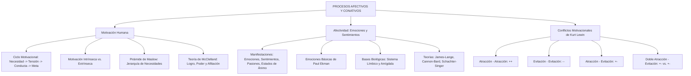

# TEMA 06: MOTIVACIÓN Y AFECTIVIDAD HUMANA

---

## 1. PORTADA Y FICHA TÉCNICA

```
========================================================================================
CURSO: PSICOLOGÍA PREUNIVERSITARIA
EJE: 05 - PERSONA Y FAMILIA
TEMA: 06 - MOTIVACIÓN Y AFECTIVIDAD HUMANA (PROCESO CONATIVO-AFECTIVO)
NIVEL: PREUNIVERSITARIO AVANZADO (UNSA - UNMSM - UNI)
DURACIÓN ESTIMADA: 4 HORAS ACADÉMICAS
SISTEMA DE EVALUACIÓN: DESTREZAS COGNITIVAS (DECO), TEORÍAS EMOCIONALES Y JERARQUÍAS
========================================================================================
```

---

## 2. MAPA CONCEPTUAL SINTÉTICO (MERMAID)



---

## 3. MARCO TEÓRICO EXHAUSTIVO

### 3.1. Naturaleza y Ciclo de la Motivación
- **Motivación:** Proceso psicológico conativo-volitivo que energiza, orienta, dirige y sostiene la conducta de un individuo hacia la consecución de una meta u objetivo que satisface una necesidad.
- **El Ciclo Motivacional:**
  1. **Homeostasis:** Estado de equilibrio biopsicosocial basal del organismo.
  2. **Estímulo / Carencia:** Aparición de un requerimiento interno (fisiológico o psicológico) o incitación ambiental.
  3. **Necesidad:** Estado de carencia o desequilibrio orgánico o psicológico consciente o inconsciente.
  4. **Estado de Tensión:** Activación psicofisiológica displacentera que moviliza energía.
  5. **Comportamiento / Conducta Motivada:** Acciones deliberadas e instrumentales dirigidas a la meta.
  6. **Satisfacción:** Consecución del incentivo o meta, restableciendo el equilibrio homeostático. Si se frustra, genera agresión, resignación o mecanismos de defensa.

### 3.2. Tipos de Motivación
1. **Según su Origen y Naturaleza:**
   - **Biológicas o Primarias:** Innatas, homeostáticas, ligadas a la supervivencia orgánica de la especie (hambre, sed, sueño, regulación térmica, evitación del dolor, sexo).
   - **Psicosociales o Secundarias:** Adquiridas en el proceso de socialización cultural (necesidad de logro, filiación, poder, autorrealización, justicia).
2. **Según el Locus de Control de la Recompensa:**
   - **Motivación Intrínseca:** La conducta se realiza por el placer inherente, la curiosidad, el desafío intelectual o la satisfacción interna que genera la propia actividad (*"Estudio física porque me fascina entender las leyes del universo"*).
   - **Motivación Extrínseca:** La conducta es un medio instrumental para obtener una recompensa externa tangible o evitar un castigo (*"Estudio para que mis padres me compren un automóvil si ingreso"*).

### 3.3. Afectividad Humana: Formas de Manifestación
Conjunto de vivencias y resonancias internas que reflejan la relación de agrado o desagrado, valoración o rechazo que el sujeto experimenta ante la realidad:

| Forma Afectiva | Intensidad | Duración | Origen / Características | Ejemplos |
| :--- | :--- | :--- | :--- | :--- |
| **Emociones** | Muy alta (violenta) | Muy breve (minutos) | Reacción psicofisiológica súbita ante estímulos externos o internos; cambios vegetativos intensos. | Miedo súbito ante un temblor, ira, sorpresa. |
| **Sentimientos** | Moderada o suave | Prolongada (meses, años) | Proceso afectivo secundario, estructurado por la corteza cerebral y la cultura; mayor componente consciente. | Amor a la madre, patriotismo, gratitud, rencor. |
| **Pasiones** | Muy alta (absorbente) | Muy prolongada | Vivencia profunda que polariza y monopoliza la actividad vital del sujeto. Pueden ser superiores (arte, ciencia) o inferiores (ludopatía, fanatismo). | La pasión de Marie Curie por la física nuclear; la ludopatía. |
| **Estados de Ánimo (Humor)** | Baja | Moderada o prolongada (días) | Fondo afectivo basal difuso y persistente; colorea la percepción general del entorno. | Sentirse optimista, melancólico, irritable en una semana. |

---

## 4. LEYES, ECUACIONES Y MODELOS MATEMÁTICOS

### 4.1. Teorías de la Motivación
1. **Jerarquía de las Necesidades de Abraham Maslow (Pirámide Humanista):**
   Las necesidades humanas se estructuran piramidalmente; las necesidades inferiores (deficitarias o de deficiencia) deben ser satisfechas razonablemente antes de que emerjan las necesidades superiores (de desarrollo o ser):
   - **Nivel 1 (Fisiológicas):** Respirar, alimentarse, hidratarse, dormir, homeostasis.
   - **Nivel 2 (Seguridad):** Seguridad física, empleo, recursos, salud, propiedad.
   - **Nivel 3 (Afiliación / Sociales):** Amistad, afecto, intimidad sexual, sentido de pertenencia.
   - **Nivel 4 (Reconocimiento / Estima):** Confianza, autorrespeto, éxito profesional, reputación.
   - **Nivel 5 (Autorrealización / Trascendencia):** Moralidad, creatividad, espontaneidad, resolución de problemas; actualización plena del potencial del *self*.
2. **Teoría de las Tres Necesidades de David McClelland:**
   - **Necesidad de Logro ($nLog$):** Deseo de superar desafíos difíciles, alcanzar estándares de excelencia y asumir responsabilidad personal del resultado.
   - **Necesidad de Poder ($nPod$):** Deseo de influir, liderar, controlar e impactar en la conducta de los demás.
   - **Necesidad de Afiliación ($nAfi$):** Deseo de establecer relaciones interpersonales cálidas, de aceptación y pertenencia grupal.

### 4.2. Teorías Clásicas de la Emoción
1. **Teoría de James-Lange:** *"Lloramos porque estamos tristes, o estamos tristes porque lloramos"*. Sostiene que el estímulo desencadena primero cambios viscerales y fisiológicos periféricos, y la percepción cerebral consciente de dichos cambios corporales constituye la emoción ($Estímulo \to Respuesta\ Fisiológica \to Emoción$).
2. **Teoría de Cannon-Bard:** Sostiene que la respuesta fisiológica y la vivencia subjetiva emocional ocurren de manera **simultánea e independiente**, mediadas por el tálamo y el sistema límbico ($Estímulo \to Activación\ Talámica \to Fisiología + Emoción\ a\ la\ vez$).
3. **Teoría Bifactorial de Schachter-Singer:** La emoción es el resultado interactivo de dos factores: una **activación fisiológica indiferenciada** (*arousal*) y una **interpretación o etiquetado cognitivo** basado en el contexto ambiental ($Estímulo \to Arousal + Evaluación\ Cognitiva \to Emoción$).

### 4.3. Tipología de Conflictos Motivacionales de Kurt Lewin
Cuando coexisten tendencias motivacionales incompatibles:
1. **Atracción - Atracción ($++$):** El sujeto se encuentra ante dos metas igualmente atractivas y deseables, pero mutuamente excluyentes (ej. ser admitido simultáneamente en dos universidades de gran prestigio).
2. **Evitación - Evitación ($--$):** El sujeto debe elegir entre dos alternativas desagradables, temidas o aversivas (ej. someterse a una dolorosa cirugía dental o sufrir una infección crónica).
3. **Atracción - Evitación ($+-$):** Una **misma meta u objeto** posee simultáneamente aspectos sumamente atractivos y aspectos aversivos o costos elevados (ej. postular a la carrera de sus sueños sabiendo que exige un internado hospitalario extenuante de guardias nocturnas).
4. **Doble Atracción - Evitación ($+-$ vs. $+-$):** El sujeto debe elegir entre dos o más opciones, y cada una de ellas contiene ventajas apetecibles y desventajas notables.

---

## 5. NEMOTECNIAS PREUNIVERSITARIAS

1. **Jerarquía de Maslow (de la base a la cima):**
   > **"FISI-SEGU-AFI-RECO-AUTO"** $\implies$ **Fisi**ológicas, **Segu**ridad, **Afi**liación, **Reco**nocimiento, **Auto**rrealización.
2. **Necesidades de McClelland:**
   > **"L-P-A"** $\implies$ **L**ogro, **P**oder, **A**filiación.
3. **Teoría de James-Lange:**
   > *"Primero corre el cuerpo, luego se asusta la mente"*.
4. **Conflictos de Lewin:**
   > $++$ = Dos premios; $--$ = Dos castigos; $+-$ = Un premio con espinas.

---

## 6. HACKING DE ADMISIÓN Y ERRORES TRAMPA FRECUENTES

- **Trampa 1 (Emoción vs. Sentimiento):** Las emociones son biológicas, súbitas, intensas, con marcadas alteraciones autonómicas (sudoración, taquicardia) y comunes a los animales mamíferos (Paul Ekman: alegría, tristeza, ira, asco, miedo, sorpresa). Los sentimientos son exclusivamente humanos, estables, duraderos, de intensidad moderada y estructurados por el lenguaje y la cultura (amor, gratitud, patriotismo).
- **Trampa 2 (Conflicto Atracción-Evitación):** En el examen, muchos confunden atracción-evitación con tener dos opciones. Si hay **un solo objeto o situación** con doble cara (ej. comerse un pastel delicioso sabiendo que romperá la dieta médica estricta), es **Atracción - Evitación simple**.
- **Trampa 3 (El orden en Maslow):** No se puede buscar la autorrealización plena si las necesidades de seguridad y supervivencia no están previamente estabilizadas en lo fundamental.

---

## 7. 5 PROBLEMAS RESUELTOS Y GRADUADOS

### Problema 1: Identificación de la Forma Afectiva (Nivel Básico)
**Enunciado:** Mientras camina por una calle solitaria, Andrés escucha el frenazo intempestivo de un automóvil a pocos centímetros de él. De inmediato, su ritmo cardíaco se acelera a 130 latidos por minuto, se dilatan sus pupilas, palidece y da un salto hacia la acera. Esta reacción inmediata, intensa y de corta duración constituye un claro ejemplo de:
A) Sentimiento superior  
B) Estado de ánimo  
C) Emoción primaria o básica  
D) Pasión creadora  
E) Conflicto conativo  

**Solución paso a paso:**
1. El cuadro describe una respuesta automática súbita ante un peligro inminente (estímulo amenazante).
2. Se caracteriza por alta intensidad, brevedad temporal y una violenta activación del sistema nervioso simpático (taquicardia, midriasis, palidez periférica).
3. Estas propiedades definen a la **Emoción** (específicamente, el miedo reactivo).

**Respuesta:** C) Emoción primaria o básica.

---

### Problema 2: Clasificación de Motivación según Origen y Locus (Nivel Intermedio)
**Enunciado:** Rocío se prepara con esmero para el examen de admisión. Afirma que se apasiona resolviendo problemas de cálculo integral porque disfruta el reto intelectual y la sensación de descubrimiento. Su compañero Manuel, en cambio, postula a la misma carrera exclusivamente porque su padre le prometió entregarle la cuota inicial de un departamento moderno si obtiene una vacante. Las motivaciones de Rocío y Manuel son respectivamente:
A) Extrínseca y biológica.  
B) Extrínseca e intrínseca.  
C) Intrínseca y extrínseca.  
D) Psicosocial e innata.  
E) Trascendente y autorrealizada.  

**Solución paso a paso:**
1. Rocío realiza la acción por el disfrute interno, la curiosidad y la satisfacción intrínseca del aprendizaje: **Motivación Intrínseca**.
2. Manuel ejecuta la conducta como un mero instrumento para obtener un incentivo material exterior (el departamento ofrecido por su padre): **Motivación Extrínseca**.

**Respuesta:** C) Intrínseca y extrínseca.

---

### Problema 3: Jerarquía de Maslow en Casos Sociales (Nivel Intermedio-Avanzado)
**Enunciado:** En una zona rural afectada por un devastador huaico, los pobladores han perdido sus viviendas, agua potable y reservas de alimentos. Un grupo de voluntarios llega ofreciendo talleres de apreciación artística, poesía y meditación trascendental para mejorar la autoestima de los damnificados, pero la comunidad rechaza airadamente los talleres exigiendo maquinaria para encauzar el río, carpas, víveres y medicinas. Desde la teoría jerárquica de Abraham Maslow, la reacción de la comunidad se fundamenta en que:
A) Carecen de inteligencia emocional intrapersonal.  
B) Las necesidades de autorrealización y desarrollo estético solo emergen cuando las necesidades fisiológicas y de seguridad física están satisfechas.  
C) Presentan una fijación anal regresiva según el psicoanálisis.  
D) Su necesidad predominante es la de poder y dominancia social.  
E) Manifiestan un conflicto de atracción-atracción no resuelto.  

**Solución paso a paso:**
1. En la pirámide de Maslow, las necesidades fisiológicas (comida, agua) y de seguridad (refugio, protección contra el desastre natural) constituyen la base deficitaria indispensable.
2. Nadie puede enfocar su energía psíquica en la creatividad, la estética o la autorrealización si su propia supervivencia biológica y su integridad física están amenazadas.

**Respuesta:** B) Las necesidades de autorrealización y desarrollo estético solo emergen cuando las necesidades fisiológicas y de seguridad física están satisfechas.

---

### Problema 4: Teorías de la Emoción en Escenarios Experimentales (Nivel Avanzado)
**Enunciado:** En un experimento clásico de psicología social, dos grupos de participantes reciben una inyección de epinefrina (adrenalina) que les produce activación fisiológica (taquicardia, sudoración y temblor). A los miembros del Grupo A no se les informa de los efectos de la sustancia y se les coloca en una sala junto a un actor que finge estar sumamente eufórico y feliz; los participantes reportan sentirse eufóricos y alegres. A los miembros del Grupo B tampoco se les informa, pero se les coloca junto a un actor que simula estar furioso y hostil; estos participantes reportan sentir profunda rabia e indignación. ¿Qué teoría de la emoción queda validada por este experimento?
A) Teoría evolucionista pura de Charles Darwin  
B) Teoría fisiológica periférica de James-Lange  
C) Teoría talámica de Cannon-Bard  
D) Teoría bifactorial cognitiva de Schachter y Singer  
E) Teoría psicoanalítica de la catarsis afectiva  

**Solución paso a paso:**
1. Los sujetos de ambos grupos experimentaron exactamente la misma activación fisiológica inducida por la adrenalina (*arousal* neutro).
2. Sin embargo, la vivencia emocional subjetiva resultante (euforia vs. rabia) dependió enteramente de la **interpretación cognitiva** que hicieron del ambiente social en el que estaban situados.
3. Esto confirma la **Teoría Bifactorial de Schachter y Singer**: Emoción = Activación fisiológica + Etiquetado cognitivo contextual.

**Respuesta:** D) Teoría bifactorial cognitiva de Schachter y Singer.

---

### Problema 5: Conflictos Motivacionales de Kurt Lewin (Boss Challenge)
**Enunciado:** Identifique el tipo de conflicto motivacional de Kurt Lewin que se presenta en las siguientes situaciones:
1. Carlos debe elegir entre pasar un fin de semana en un campamento de playa con sus mejores amigos o asistir a un concierto VIP de su banda de rock favorita, ambas opciones con todos los gastos pagados.
2. Gabriela detesta estudiar física cuántica, pero si no la estudia reprobará el semestre y perderá su condición de becaria en la universidad.
3. Felipe tiene un intenso deseo de postular a una beca de posgrado en el extranjero que le garantizará éxito profesional, pero siente un inmenso temor al desarraigo, la soledad y la barrera idiomática de vivir solo en un país lejano.
La secuencia correcta de tipos de conflicto es:
A) Atracción-Atracción / Evitación-Evitación / Atracción-Evitación  
B) Evitación-Evitación / Atracción-Atracción / Doble Atracción-Evitación  
C) Atracción-Evitación / Evitación-Evitación / Atracción-Atracción  
D) Atracción-Atracción / Atracción-Evitación / Evitación-Evitación  
E) Doble Atracción-Evitación / Evitación-Evitación / Atracción-Atracción  

**Solución paso a paso:**
1. Situación 1: Dos metas deseadas y apetecibles (campamento o concierto VIP): **Atracción - Atracción ($++$)**.
2. Situación 2: Dos opciones temidas o indeseables (estudiar algo que detesta o perder la beca): **Evitación - Evitación ($--$)**.
3. Situación 3: Un mismo objetivo (la beca en el extranjero) que atrae poderosamente por el éxito pero asusta por el desarraigo: **Atracción - Evitación ($+-$)**.
4. Secuencia ordenada: Atracción-Atracción / Evitación-Evitación / Atracción-Evitación.

**Respuesta:** A) Atracción-Atracción / Evitación-Evitación / Atracción-Evitación.

---

## 8. 5 PROBLEMAS PROPUESTOS

1. ¿Cómo se denomina el estado afectivo absorbente y de gran intensidad que canaliza y monopoliza todas las energías vitales de una persona hacia una meta exclusiva durante años?
   - *Pista:* Puede ser superior (arte/ciencia) o inferior (ludopatía).
   - *Clave:* Pasión.

2. Según Paul Ekman, ¿cuáles son las seis emociones básicas primarias universales reconocibles transculturalmente por las expresiones faciales?
   - *Pista:* Alegría, tristeza, ira, asco, sorpresa y...
   - *Clave:* Alegría, tristeza, ira, asco, miedo y sorpresa.

3. En la teoría de David McClelland, ¿qué tipo de necesidad domina en una persona que busca permanentemente dirigir equipos, asumir el mando y determinar las reglas de un colectivo?
   - *Pista:* Letra P en el modelo LPA.
   - *Clave:* Necesidad de poder.

4. ¿Qué estructura subcortical del sistema límbico desempeña un papel central en el procesamiento y memoria del miedo y la agresividad?
   - *Pista:* Estructura con forma de almendra en el lóbulo temporal.
   - *Clave:* Amígdala cerebral.

5. Un estudiante se debate entre dos ofertas de trabajo: el empleo A paga un excelente sueldo pero el clima laboral es tóxico; el empleo B tiene un ambiente laboral extraordinario pero el sueldo es muy modesto. ¿Qué tipo de conflicto de Lewin experimenta?
   - *Pista:* Ambas opciones tienen aspectos positivos y negativos a la vez.
   - *Clave:* Doble atracción - evitación.

---

## 9. GLOSARIO TÉCNICO ESPECIALIZADO

1. **Motivación:** Proceso dinámico orientador que activa y dirige la conducta humana hacia la satisfacción de necesidades.
2. **Homeostasis:** Tendencia del organismo a mantener la estabilidad interna y el equilibrio psicofisiológico.
3. **Emoción:** Reacción psicofisiológica aguda y transitoria provocada por estímulos significativos, con componentes autonómicos, motores y subjetivos.
4. **Sentimiento:** Estado afectivo duradero, consciente y estable, modelado por procesos cognitivos y socioculturales.
5. **Amígdala Cerebral:** Núcleo límbico subcortical especializado en el condicionamiento del miedo, la detección de amenazas y la reactividad emocional.
6. **Autorrealización (Maslow):** Cúspide de la pirámide motivacional caracterizada por el pleno despliegue creativo de las capacidades humanas.
7. **Motivación Intrínseca:** Impulso a actuar generado por el interés directo y la gratificación inherente de la propia tarea.
8. **Motivación Extrínseca:** Impulso a actuar subordinado a incentivos, recompensas o castigos externos ajenos a la tarea en sí.
9. **Conflicto Atracción-Evitación:** Estado motivacional dilemático generado por una meta única que presenta simultáneamente atributos deseables e indeseables.
10. **Arousal:** Grado de activación fisiológica, cortical y del sistema nervioso vegetativo ante situaciones ambientales o internas.

---

## 10. FLASHCARDS DE REPASO RÁPIDO

- **P: ¿Qué distingue a una emoción de un sentimiento?**
  *R: La emoción es súbita, intensa, biológica y de corta duración; el sentimiento es prolongado, de intensidad moderada, consciente y cultural.*
- **P: ¿Qué postula la teoría de James-Lange sobre las emociones?**
  *R: Que la vivencia emocional consciente es la percepción cerebral de los cambios fisiológicos y viscerales previos del cuerpo ($Fisiología \to Emoción$).*
- **P: ¿Cuáles son los cinco niveles de la pirámide de Maslow en orden ascendente?**
  *R: Fisiológicas, Seguridad, Afiliación, Reconocimiento y Autorrealización.*
- **P: ¿Cuáles son las tres necesidades según David McClelland?**
  *R: Necesidad de Logro, Necesidad de Poder y Necesidad de Afiliación.*
- **P: ¿Qué es un conflicto de doble atracción-evitación?**
  *R: Una elección entre dos o más opciones donde cada una de ellas posee aspectos ventajosos y desventajas simultáneamente.*

---

## 11. CONEXIONES INTERDISCIPLINARIAS Y APLICACIÓN REAL

- **Neuroeconomía y Neuromarketing:** Los anunciantes y diseñadores de interfaces activan el circuito dopaminérgico mesolímbico para generar compras impulsivas asociando productos comerciales a necesidades de pertenencia social o estatus (Maslow).
- **Psicoterapia Cognitivo-Conductual (TCC):** La teoría bifactorial de Schachter-Singer y la terapia racional emotiva de Albert Ellis demuestran que modificando la interpretación cognitiva del estímulo se regula el pánico y la fobia social.
- **Liderazgo y Recursos Humanos:** Los perfiles de McClelland se emplean para ubicar a profesionales orientados al logro en investigación y desarrollo, a perfiles de poder en la gerencia general y a perfiles de afiliación en relaciones humanas.

---

## 12. BLOQUE DE GAMIFICACIÓN KMP (JSON)

```json
{
  "curso": "Psicologia",
  "tema": "Motivacion_y_Afectividad_Humana",
  "xp_recompensa": 220,
  "insignia": "Conquistador_de_la_Pasion_y_el_Límbico",
  "desafios": [
    {
      "id": "MOT_01",
      "tipo": "opcion_multiple",
      "pregunta": "¿Qué teoría sostiene que primero experimentamos los cambios fisiológicos corporales y que la emoción es la consecuencia de percibir esos cambios?",
      "opciones": [
        "Teoría de James-Lange",
        "Teoría de Cannon-Bard",
        "Teoría bifactorial de Schachter-Singer",
        "Teoría humanista de Maslow"
      ],
      "respuesta_correcta": 0,
      "explicacion": "William James y Carl Lange postularon que el estímulo genera la respuesta fisiológica y la corteza interpreta esa reacción como emoción ('estoy triste porque lloro')."
    },
    {
      "id": "MOT_02",
      "tipo": "opcion_multiple",
      "pregunta": "Un postulante debe elegir entre dos carreras igualmente prestigiosas y deseadas por él (Medicina o Ingeniería Genética). Este conflicto es de tipo:",
      "opciones": [
        "Atracción - Atracción (++)",
        "Evitación - Evitación (--)",
        "Atracción - Evitación (+-)",
        "Doble evitación"
      ],
      "respuesta_correcta": 0,
      "explicacion": "El conflicto Atracción-Atracción se produce ante dos alternativas simultáneamente positivas y atrayentes."
    },
    {
      "id": "MOT_03",
      "tipo": "completar",
      "pregunta": "En la jerarquía piramidal de Abraham Maslow, la necesidad que se sitúa en la cúspide suprema se denomina:",
      "respuesta_correcta": "Autorrealizacion",
      "explicacion": "La autorrealización es la necesidad de orden superior de actualización del potencial humano."
    }
  ]
}
```
