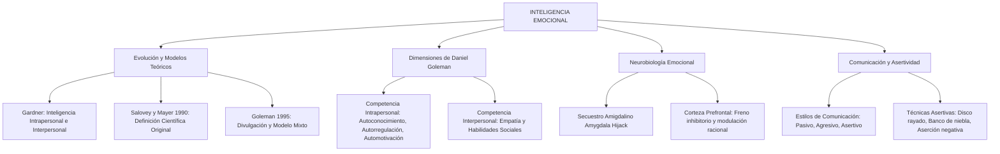

# TEMA 07: INTELIGENCIA EMOCIONAL

---

## 1. PORTADA Y FICHA TÉCNICA

```
========================================================================================
CURSO: PSICOLOGÍA PREUNIVERSITARIA
EJE: 05 - PERSONA Y FAMILIA
TEMA: 07 - INTELIGENCIA EMOCIONAL (MODELOS DE GOLEMAN, SALOVEY-MAYER Y ASERTIVIDAD)
NIVEL: PREUNIVERSITARIO AVANZADO (UNSA - UNMSM - UNI)
DURACIÓN ESTIMADA: 3 HORAS ACADÉMICAS
SISTEMA DE EVALUACIÓN: DESTREZAS COGNITIVAS (DECO), AUTORREGULACIÓN Y HABILIDADES SOCIALES
========================================================================================
```

---

## 2. MAPA CONCEPTUAL SINTÉTICO (MERMAID)



---

## 3. MARCO TEÓRICO EXHAUSTIVO

### 3.1. Origen y Definición de la Inteligencia Emocional (IE)
- **Antecedentes:**
  - Edward Thorndike (1920) introduce el concepto de **inteligencia social** como la habilidad para comprender y dirigir a los hombres y mujeres, y actuar sabiamente en las relaciones humanas.
  - Howard Gardner (1983) en su teoría de las Inteligencias Múltiples formula dos inteligencias personales:
    - *Inteligencia Intrapersonal:* Capacidad de construir una percepción precisa de uno mismo y utilizar dicho conocimiento para organizar la propia vida.
    - *Inteligencia Interpersonal:* Capacidad de discernir y responder adecuadamente a los estados de ánimo, temperamentos, motivaciones y deseos de los demás.
- **Definición de Salovey y Mayer (1990):** Capacidad para supervisar y monitorear las emociones propias y ajenas, discriminar entre ellas y utilizar esta información para guiar el pensamiento y la acción.
- **Modelo de Daniel Goleman (1995):** Conjunto de habilidades que permiten reconocer y regular los estados emocionales propios y los de los demás, tolerar las frustraciones, diferir la gratificación, motivarse a uno mismo y manejar eficazmente las relaciones interpersonales.

---

## 4. LEYES, ECUACIONES Y MODELOS MATEMÁTICOS

### 4.1. Las Cinco Dimensiones de Daniel Goleman
Goleman estructura la Inteligencia Emocional en dos grandes bloques de competencias:

#### A. Competencias Intrapersonales (Hacia uno mismo):
1. **Autoconocimiento Emocional (Autoconciencia):** Reconocer una emoción en el mismo momento en que aparece y comprender su causa e impacto en nuestra conducta y decisiones.
2. **Autorregulación Emocional (Autocontrol):** Capacidad de manejar los impulsos emocionales perturbadores (ira, pánico, ansiedad), adaptándose a circunstancias cambiantes sin desbordarse.
3. **Automotivación:** Capacidad de canalizar las emociones al servicio de una meta a largo plazo, tolerando la frustración y practicando la postergación de la gratificación inmediata (famoso *experimento del malvavisco* de Walter Mischel).

#### B. Competencias Interpersonales (Hacia los demás):
4. **Empatía:** Capacidad de sintonizar, percibir y comprender las emociones, necesidades y perspectivas ajenas desde el marco de referencia del otro ("ponerse en los zapatos del otro"), sin juzgarlo.
5. **Habilidades Sociales:** Manejo constructivo de las relaciones interpersonales, persuasión positiva, liderazgo inspirador, resolución pacífica de conflictos, trabajo cooperativo y comunicación asertiva.

### 4.2. Neurobiología de la Inteligencia Emocional: El Secuestro Amigdalino
- **El Secuestro Amigdalino (*Amygdala Hijack* - Goleman):**
  - La información sensorial ingresa a través del **tálamo**.
  - Desde el tálamo existen dos vías de procesamiento:
    1. **La vía corta (inconsciente, rápida y primitiva):** Conexión directa del tálamo a la **amígdala cerebral**, que dispara una reacción emocional de lucha o huida en milisegundos, antes de que la corteza cerebral haya analizado la situación.
    2. **La vía larga (consciente, reflexiva y moduladora):** Conexión del tálamo a la **corteza prefrontal** (área dorsolateral y ventromedial), que analiza lógicamente el estímulo, evalúa consecuencias y envía señales inhibitorias (freno prefrontal) hacia la amígdala.
  - La madurez de la Inteligencia Emocional consiste neurológicamente en el fortalecimiento de las conexiones inhibitorias prefrontales sobre la amígdala.

### 4.3. Estilos de Comunicación y Técnicas Asertivas
1. **Estilo Pasivo (Inhibido):** La persona no defiende sus derechos legítimos, calla ante el abuso, antepone los deseos ajenos por miedo al rechazo o conflicto, acumulando resentimiento.
2. **Estilo Agresivo:** Se imponen los puntos de vista propios vulnerando y avasallando los derechos, sentimientos y opiniones de los demás mediante gritos, intimidación o sarcasmo.
3. **Estilo Asertivo:** Comunicación firme, honesta y respetuosa en la que el sujeto defiende sus derechos, expresa sus emociones y expone sus ideas sin agredir a los demás ni someterse pasivamente.

#### Técnicas de Comunicación Asertiva:
- **Disco Rayado:** Repetición calmada, serena y persistente del propio punto de vista o negativa legítima sin alterarse ni caer en trampas verbales.
- **Banco de Niebla (*Fogging*):** Dar parcialmente la razón a la crítica de la otra persona en lo que pueda tener de cierto, pero manteniendo con firmeza la propia postura o decisión final.
- **Aserción Negativa:** Aceptar un error propio de manera natural y sin justificaciones excesivas ni humillación ("Efectivamente, cometí un error al olvidar ese informe, lo corregiré ahora mismo").
- **Técnica del Mensaje en Primera Persona ("Mensaje Yo"):** Describir el hecho objetivo, el sentimiento propio y el cambio deseado sin descalificar al interlocutor (*"Cuando tú llegas tarde, yo siento que no valoras mi tiempo; te pido que me avises con anticipación"*).

---

## 5. NEMOTECNIAS PREUNIVERSITARIAS

1. **Las Cinco Dimensiones de Goleman:**
   > **"CON-REG-MOT-EMP-SOC"** $\implies$ Auto**con**ocimiento, Auto**reg**ulación, Auto**mot**ivación, **Emp**atía, Habilidades **Soc**iales.
2. **Vía Corta vs. Vía Larga Emocional:**
   > **Vía Corta:** Tálamo $\to$ Amígdala (*"Dispara primero, piensa después"*).  
   > **Vía Larga:** Tálamo $\to$ Corteza Prefrontal $\to$ Amígdala (*"Evalúa, razona y modula"*).
3. **El Triángulo de la Asertividad:**
   > Ni felpudo (pasivo), ni fiera (agresivo): ser humano digno y firme (asertivo).

---

## 6. HACKING DE ADMISIÓN Y ERRORES TRAMPA FRECUENTES

- **Trampa 1 (¿Quién creó el término vs. quién lo popularizó?):** Si la pregunta pide los psicólogos científicos que formularon el concepto original de IE en 1990, son **Peter Salovey y John Mayer**; si pide el autor del libro de 1995 que lo difundió mundialmente y estructuró las 5 dimensiones, es **Daniel Goleman**.
- **Trampa 2 (Confundir Empatía con Simpatía):** La empatía no significa estar de acuerdo ni aprobar la conducta del otro, ni tampoco llorar junto a él (eso es simpatía o contagio emocional); la empatía es la **comprensión cognitiva y afectiva de su estado subjetivo**.
- **Trampa 3 (El Experimento del Malvavisco):** Se vincula prioritariamente a la **autorregulación y postergación de la gratificación** (automotivación), prediciendo éxito académico y menor vulnerabilidad a adicciones en la adultez.

---

## 7. 5 PROBLEMAS RESUELTOS Y GRADUADOS

### Problema 1: Identificación de Dimensiones de Goleman (Nivel Básico)
**Enunciado:** Durante un simulacro de admisión, Laura siente que la respiración se le agita y que sus manos comienzan a temblar ante un ejercicio difícil. Inmediatamente se dice a sí misma: *"Estoy experimentando ansiedad porque me preocupa el tiempo; voy a cerrar los ojos tres segundos, respirar hondo con el diafragma y continuar con la siguiente pregunta sin desesperarme"*. ¿Qué competencias de la inteligencia emocional de Daniel Goleman manifiesta prioritariamente Laura?
A) Habilidad social y liderazgo  
B) Autoconocimiento y autorregulación emocional  
C) Empatía y extrospección  
D) Inteligencia musical y asertividad  
E) Secuestro límbico y catarsis  

**Solución paso a paso:**
1. Laura detecta e identifica con claridad su propio estado emocional y sus causas corporales en el momento presente: **Autoconocimiento emocional**.
2. Aplica una técnica deliberada de respiración y modulación cognitiva para calmarse y no dejarse dominar por el pánico: **Autorregulación emocional**.

**Respuesta:** B) Autoconocimiento y autorregulación emocional.

---

### Problema 2: Identificación de Estilos de Comunicación (Nivel Intermedio)
**Enunciado:** En un trabajo grupal universitario, uno de los integrantes no cumplió con entregar su parte asignada. Ante esto, tres compañeros reaccionan de forma distinta:
- Bruno guarda silencio, asume la carga del compañero incumplido y se queda hasta el amanecer trabajando sin decir nada para evitar pelear.
- Tomás lo insulta a gritos por el grupo de WhatsApp, amenazándolo con golpearlo si se presenta a clases.
- Elena se reúne calmadamente con él y le expresa: *"Entendemos que tuviste un inconveniente, pero tu falta de entrega afecta el promedio de todo el equipo; no podemos incluir tu nombre en esta ocasión, salvo que presentes un justificativo a la coordinación"*.
Los estilos de comunicación manifestados por Bruno, Tomás y Elena son respectivamente:
A) Asertivo, agresivo y pasivo.  
B) Pasivo, agresivo y asertivo.  
C) Pasivo-agresivo, agresivo y empático.  
D) Asertivo, pasivo y agresivo.  
E) Inhibido, asertivo y pasivo.  

**Solución paso a paso:**
1. Bruno se somete y no defiende sus derechos ni los del grupo: **Estilo Pasivo**.
2. Tomás recurre a la violencia verbal y la amenaza intimidatoria: **Estilo Agresivo**.
3. Elena expresa con respeto, firmeza y claridad los hechos y los límites sin insultar: **Estilo Asertivo**.

**Respuesta:** B) Pasivo, agresivo y asertivo.

---

### Problema 3: Técnica Asertiva en Casos Prácticos (Nivel Intermedio-Avanzado)
**Enunciado:** Un vendedor insiste agresivamente para que un joven compre una membresía costosa que no necesita. El joven responde con calma: *"Comprendo que su producto tenga excelentes beneficios, pero en este momento no lo voy a comprar"*. El vendedor insiste con argumentos técnicos y el joven vuelve a responder con serenidad: *"Entiendo su postura, pero no lo voy a comprar"*. Al reiterarse la negativa tranquila una y otra vez con la misma frase, el joven está aplicando la técnica asertiva de:
A) Banco de niebla  
B) Aserción negativa  
C) Disco rayado  
D) Mensaje Yo  
E) Catarsis cognitiva  

**Solución paso a paso:**
1. La técnica del **Disco Rayado** consiste en repetir serenamente la misma frase de negativa o petición tantas veces como sea necesario, sin levantar la voz ni entrar en discusiones periféricas.

**Respuesta:** C) Disco rayado.

---

### Problema 4: Neurobiología y Secuestro Amigdalino (Nivel Avanzado)
**Enunciado:** Un conductor de transporte público es rozado accidentalmente por una motocicleta. En cuestión de segundos, el conductor baja del vehículo con un fierro en la mano, ciego de cólera, y destruye la moto sin escuchar los pedidos de disculpas del motociclista. Minutos después, al ser detenido por la policía, el conductor rompe en llanto y afirma: *"No sé qué me pasó, me cegué por completo, no pude pensar en mis hijos ni en las consecuencias"*. Desde la neuropsicología de Daniel Goleman, este evento ilustra:
A) Una falla en la memoria semántica del hipocampo.  
B) Un secuestro amigdalino donde la vía rápida subcortical anuló el control inhibitorio de la corteza prefrontal.  
C) Un condicionamiento vicario operante de castigo positivo.  
D) Una respuesta adaptativa gobernada exclusivamente por el cerebelo.  
E) Un conflicto motivacional de evitación-evitación.  

**Solución paso a paso:**
1. El **secuestro amigdalino (*amygdala hijack*)** ocurre cuando un estímulo percibido como agresión activa directamente la amígdala antes de que la corteza prefrontal pueda evaluar racionalmente la situación.
2. La amígdala inunda el sistema de adrenalina y desata una respuesta violenta arcaica, bloqueando temporalmente el juicio moral y el pensamiento reflexivo superior.

**Respuesta:** B) Un secuestro amigdalino donde la vía rápida subcortical anuló el control inhibitorio de la corteza prefrontal.

---

### Problema 5: Autocontrol y Gratificación Diferida (Boss Challenge)
**Enunciado:** En el célebre "Experimento del Malvavisco" (*Marshmallow Test*) de Walter Mischel en Stanford, niños de cuatro años fueron colocados frente a un dulce con la instrucción de que, si esperaban 15 minutos sin comerlo mientras el adulto salía de la sala, recibirían dos dulces como recompensa. En el seguimiento longitudinal de varias décadas a estos mismos sujetos:
A) Los niños que comieron el dulce de inmediato demostraron mayor creatividad y espíritu artístico en la adultez.  
B) Aquellos que lograron postergar la gratificación inmediata demostraron mayores puntajes académicos preuniversitarios (SAT), mejor salud mental, menor índice de masa corporal y menor tasa de divorcios y conductas adictivas en la adultez.  
C) Se comprobó que el autocontrol infantil depende exclusivamente de la herencia cromosómica ligada al sexo.  
D) No se halló correlación alguna entre el autocontrol a los cuatro años y el rendimiento en la vida adulta.  
E) Los niños que esperaron sufrieron de trastornos obsesivo-compulsivos en la juventud.  

**Solución paso a paso:**
1. El experimento demostró que la capacidad de **demorar la gratificación inmediata** al servicio de una meta futura superior es un predictor fundamental de la Inteligencia Emocional y de las funciones ejecutivas de la corteza prefrontal.
2. Los niños que desarrollaron estrategias de autorregulación atencional tuvieron trayectorias vitales significativamente más exitosas y saludables en todas las dimensiones psicosociales.

**Respuesta:** B) Aquellos que lograron postergar la gratificación inmediata demostraron mayores puntajes académicos preuniversitarios (SAT), mejor salud mental, menor índice de masa corporal y menor tasa de divorcios y conductas adictivas en la adultez.

---

## 8. 5 PROBLEMAS PROPUESTOS

1. ¿Qué psicólogo estadounidense publicó en 1995 el libro *Inteligencia Emocional*, popularizando las competencias socioemocionales a nivel mundial?
   - *Pista:* Autor de las 5 dimensiones.
   - *Clave:* Daniel Goleman.

2. ¿Cuál es la estructura cerebral del sistema límbico que desencadena el llamado "secuestro amigdalino" al responder con furia o pánico sin mediación reflexiva previa?
   - *Pista:* Estructura temporal con forma de almendra.
   - *Clave:* Amígdala cerebral.

3. Una técnica asertiva que consiste en aceptar parcialmente las críticas de un interlocutor para desactivar su agresividad sin ceder en la postura esencial se denomina:
   - *Pista:* Metáfora del fenómeno meteorológico.
   - *Clave:* Banco de niebla (*Fogging*).

4. En la teoría de las Inteligencias Múltiples de Howard Gardner, ¿qué dos inteligencias constituyen los pilares precursores de la Inteligencia Emocional?
   - *Pista:* Inteligencias personales.
   - *Clave:* Inteligencia intrapersonal e inteligencia interpersonal.

5. ¿Cómo se denomina el estilo de comunicación de quien no expresa sus discrepancias, tolera humillaciones por miedo al abandono y antepone las demandas ajenas a las propias?
   - *Pista:* Estilo sumiso o inhibido.
   - *Clave:* Estilo pasivo.

---

## 9. GLOSARIO TÉCNICO ESPECIALIZADO

1. **Inteligencia Emocional:** Habilidad para reconocer, comprender, regular y utilizar las emociones propias y ajenas de manera adaptativa.
2. **Autorregulación Emocional:** Capacidad de modular la intensidad y duración de los impulsos afectivos para mantener el equilibrio y la eficacia conductual.
3. **Empatía:** Comprensión cognitiva y sintonía afectiva con la experiencia interna y las emociones de otra persona sin perder los propios límites.
4. **Secuestro Amigdalino:** Respuesta emocional reactiva inmediata y desproporcionada que evade el procesamiento inhibitorio de la corteza prefrontal.
5. **Postergación de la Gratificación:** Capacidad voluntaria de renunciar a un placer inmediato en favor de una meta u objetivo superior a largo plazo.
6. **Asertividad:** Habilidad social de comunicar ideas, deseos y límites legítimos de forma directa, firme y respetuosa sin agredir ni someterse.
7. **Disco Rayado:** Técnica asertiva consistente en reiterar tranquilamente una negativa o argumento sin desviarse del objetivo.
8. **Banco de Niebla:** Técnica asertiva mediante la cual se reconoce parte de verdad en la crítica ajena para amortiguar el conflicto manteniendo la propia postura.
9. **Corteza Prefrontal:** Región cerebral responsable de las funciones ejecutivas, la planificación, el razonamiento ético y el control inhibitorio emocional.
10. **Automotivación:** Capacidad de dirigir las emociones y la fuerza de voluntad hacia metas elevadas, sobreponiéndose a la apatía y el desánimo.

---

## 10. FLASHCARDS DE REPASO RÁPIDO

- **P: ¿Quiénes formularon científicamente el concepto de Inteligencia Emocional en 1990?**
  *R: Peter Salovey y John Mayer.*
- **P: ¿Cuáles son las cinco dimensiones del modelo de Daniel Goleman?**
  *R: Autoconocimiento, Autorregulación, Automotivación, Empatía y Habilidades Sociales.*
- **P: ¿Qué es el "secuestro amigdalino"?**
  *R: Un desborde emocional impulsivo donde la amígdala responde ante una amenaza percibida antes de que la corteza prefrontal pueda razonar.*
- **P: ¿En qué se diferencia el estilo asertivo del agresivo y pasivo?**
  *R: El asertivo defiende sus derechos respetando los ajenos; el agresivo vulnera los derechos ajenos; el pasivo renuncia a sus propios derechos.*
- **P: ¿Qué demostró el experimento del malvavisco de Walter Mischel?**
  *R: Que la capacidad de postergar la gratificación inmediata en la infancia predice éxito académico, salud y autorregulación en la vida adulta.*

---

## 11. CONEXIONES INTERDISCIPLINARIAS Y APLICACIÓN REAL

- **Psicología Organizacional y Liderazgo:** Estudios de consultoras globales (como McKinsey y Harvard Business Review) demuestran que el $85\%$ de las competencias que diferencian a los líderes extraordinarios frente a profesionales promedio residen en la Inteligencia Emocional, y no en el coeficiente intelectual técnico.
- **Educación Emocional y Convivencia Escolar:** Programas escolares de aprendizaje socioemocional (SEL) reducen drásticamente el acoso escolar (*bullying*), mejoran el rendimiento en matemáticas y disminuyen la deserción estudiantil.
- **Salud Cardiovascular:** La incapacidad crónica para autorregular la hostilidad y la ira desencadena hiperactivación simpática sostenida, hipertensión arterial y mayor incidencia de infartos de miocardio.

---

## 12. BLOQUE DE GAMIFICACIÓN KMP (JSON)

```json
{
  "curso": "Psicologia",
  "tema": "Inteligencia_Emocional",
  "xp_recompensa": 200,
  "insignia": "Maestro_de_la_Asertividad_y_el_Autocontrol",
  "desafios": [
    {
      "id": "EMO_01",
      "tipo": "opcion_multiple",
      "pregunta": "¿Cuál de las siguientes conductas evidencia un estilo de comunicación genuinamente ASERTIVO?",
      "opciones": [
        "Expresar con serenidad y respeto una discrepancia sin insultar ni callar por miedo al rechazo",
        "Insultar a quien opine distinto para dejar en claro quién tiene la autoridad",
        "Callar la molestia y aceptar condiciones abusivas para evitar conflictos",
        "Hablar mal de los compañeros a sus espaldas fingiendo amabilidad de frente"
      ],
      "respuesta_correcta": 0,
      "explicacion": "La asertividad es la capacidad de expresar derechos y opiniones con firmeza y respeto sin caer en la sumisión (pasividad) ni en el ataque (agresividad)."
    },
    {
      "id": "EMO_02",
      "tipo": "opcion_multiple",
      "pregunta": "La capacidad de percibir, comprender y resonar con el estado emocional de otra persona desde su propia perspectiva se denomina:",
      "opciones": [
        "Empatía",
        "Autocontrol",
        "Apatía",
        "Locus de control externo"
      ],
      "respuesta_correcta": 0,
      "explicacion": "La empatía es la competencia interpersonal fundamental de conectar y comprender el mundo afectivo ajeno."
    },
    {
      "id": "EMO_03",
      "tipo": "completar",
      "pregunta": "El autor que popularizó mundialmente el concepto de Inteligencia Emocional en 1995 es:",
      "respuesta_correcta": "Daniel Goleman",
      "explicacion": "Daniel Goleman escribió la obra 'Inteligencia Emocional'."
    }
  ]
}
```
