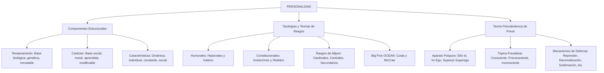

# TEMA 08: PERSONALIDAD, TEMPERAMENTO Y CARÁCTER

---

## 1. PORTADA Y FICHA TÉCNICA

```
========================================================================================
CURSO: PSICOLOGÍA PREUNIVERSITARIA
EJE: 05 - PERSONA Y FAMILIA
TEMA: 08 - PERSONALIDAD (ESTRUCTURA, TEMPERAMENTO, CARÁCTER Y TEORÍAS CLÁSICAS)
NIVEL: PREUNIVERSITARIO AVANZADO (UNSA - UNMSM - UNI)
DURACIÓN ESTIMADA: 4 HORAS ACADÉMICAS
SISTEMA DE EVALUACIÓN: DESTREZAS COGNITIVAS (DECO), TIPOLOGÍAS Y MECANISMOS DE DEFENSA
========================================================================================
```

---

## 2. MAPA CONCEPTUAL SINTÉTICO (MERMAID)



---

## 3. MARCO TEÓRICO EXHAUSTIVO

### 3.1. Definición y Características de la Personalidad
- **Etimología:** Proviene del latín *persona* (máscara teatral usada en la tragedia grecorromana para proyectar la voz y caracterizar a un personaje).
- **Definición Psicológica:** Organización dinámica e integrada de los sistemas psicofisiológicos en el interior del individuo que determina sus patrones únicos y consistentes de pensar, sentir y actuar en su adaptación al entorno (Gordon Allport).
- **Características Fundamentales:**
  1. **Estructurada y Sistémica:** No es una suma caótica de rasgos, sino una totalidad organizada coherentemente.
  2. **Dinámica:** Evoluciona, se enriquece y se transforma a lo largo del ciclo vital en interacción continua con el medio.
  3. **Individual (Singular):** Es única e irrepetible; cada ser humano posee un sello propio de personalidad.
  4. **Constante (Estable):** Manifiesta regularidad temporal; los patrones básicos tienden a perdurar en el tiempo y a través de situaciones diversas.
  5. **Social:** Se forja y modula prioritariamente a través de los agentes de socialización (familia, escuela, comunidad).

### 3.2. Temperamento vs. Carácter: La Dualidad Constitutiva
| Criterio Comparativo | Temperamento | Carácter |
| :--- | :--- | :--- |
| **Origen / Naturaleza** | **Biológico, genético e innato.** Depende del sistema nervioso y endocrino. | **Social, cultural y adquirido.** Producto del aprendizaje y la educación. |
| **Modificabilidad** | Difícilmente modificable; base reactiva estable. | **Altamente modificable** y educable mediante la voluntad y la moral. |
| **Componente Ético** | Carece de juicio moral (no es "bueno" ni "malo"). | **Posee valoración ética y moral** (responsable, honesto, leal, vil). |
| **Manifestación** | Nivel de energía, velocidad de reacción, umbral emocional, excitabilidad. | Hábitos éticos, disciplina, respeto por normas, compromiso social. |

---

## 4. LEYES, ECUACIONES Y MODELOS MATEMÁTICOS

### 4.1. Tipologías Clásicas de la Personalidad
1. **Tipología Humoral de Hipócrates y Galeno:**
   - **Sanguíneo (Sangre):** Entusiasta, alegre, sociable, comunicativo, optimista.
   - **Colérico (Bilis amarilla):** Enérgico, impulsivo, irritable, impaciente, dominante.
   - **Flemático (Flema):** Tranquilo, sereno, imperturbable, frío, reflexivo, parsimonioso.
   - **Melancólico (Bilis negra):** Triste, reflexivo, introvertido, susceptible, perfeccionista.
2. **Tipología Constitucional de Ernst Kretschmer:**
   - **Pícnico (Gordito, bajo, tórax redondo):** Temperamento *Ciclotímico* (afable, sociable, oscila entre alegría y melancolía). Predisposición a psicosis maniaco-depresiva (trastorno bipolar).
   - **Asténico o Leptosómico (Alto, delgado, hombros estrechos):** Temperamento *Esquizotímico* (reservado, tímido, intelectual, frío). Predisposición a esquizofrenia.
   - **Atlético (Musculoso, huesos fuertes, hombros anchos):** Temperamento *Viscoso* (enérgico, tenaz, rígido, agresivo). Predisposición a epilepsia.
   - **Displásico:** Malformaciones corporales asimétricas.
3. **Tipología Somatofisiológica de William Sheldon:**
   - **Endomorfo (viscerotónico):** Sociable, amante del confort y la comida.
   - **Mesomorfo (somatotónico):** Enérgico, aventurero, competitivo y dominante.
   - **Ectomorfo (cerebrotónico):** Tímido, intelectual, sensible y retraído.

### 4.2. Teorías de Rasgos
1. **Teoría de Gordon Allport:**
   - **Rasgos Cardinales:** Rasgos dominantes absolutos que tiñen la totalidad de la vida de una persona (ej. la ambición maquiavélica, la caridad de la Madre Teresa). Muy pocas personas los tienen.
   - **Rasgos Centrales:** Características generales y representativas que definen la personalidad cotidiana de alguien (ej. honestidad, alegría, timidez, lealtad; suelen ser de 5 a 10).
   - **Rasgos Secundarios:** Preferencias o disposiciones situacionales periféricas observables solo en contextos específicos (ej. ponerse irritable cuando hace frío, gusto por las corbatas rojas).
2. **Modelo de los Cinco Grandes (*Big Five* - Costa y McCrae - OCEAN):**
   - **O (Openness - Apertura a la experiencia):** Curiosidad intelectual, imaginación, creatividad vs. convencionalismo.
   - **C (Conscientiousness - Responsabilidad / Conciencia):** Autodisciplina, orden, meticulosidad, orientación al logro vs. desorganización.
   - **E (Extraversion - Extraversión):** Sociabilidad, asertividad, búsqueda de sensaciones vs. introversión.
   - **A (Agreeableness - Amabilidad / Afabilidad):** Empatía, cooperación, altruismo, confianza vs. hostilidad y escepticismo.
   - **N (Neuroticism - Neuroticismo / Inestabilidad Emocional):** Ansiedad, vulnerabilidad al estrés, rumiación negativa vs. estabilidad emocional.

### 4.3. Teoría Psicoanalítica de Sigmund Freud
1. **Estructura Dinámica de la Personalidad (Segunda Tópica):**
   - **Ello (*Id*):** Completamente inconsciente, presente desde el nacimiento. Reservorio de pulsiones de vida (*Eros*) y pulsiones de muerte (*Thanatos*). Se rige por el **principio del placer** (demanda satisfacción inmediata sin considerar la moral o la realidad).
   - **Yo (*Ego*):** Surge del contacto con la realidad externa; es en parte consciente, preconsciente e inconsciente. Mediador entre las demandas del Ello, los imperativos del Superyó y las restricciones del mundo real. Se rige por el **principio de realidad**.
   - **Superyó (*Superego*):** Instancia moral internalizada a través de la crianza y la cultura (ideal del yo y conciencia moral). Castiga al Yo con culpa y autorreproche. Se rige por el **principio del deber y la perfección**.
2. **Mecanismos de Defensa del Yo (Inconscientes y distorsionadores de la realidad):**
   - **Represión:** Mecanismo básico; expulsa de la conciencia pensamientos, deseos o recuerdos intolerables enviándolos al inconsciente.
   - **Racionalización:** Justificación lógica y aceptable para una conducta o fracaso motivado por impulsos inaceptables (*"No ingresé porque esa universidad ya no tiene nivel"*).
   - **Proyección:** Atribuir inconscientemente a los demás los propios impulsos, defectos o deseos inaceptables (*"Un estudiante tramposo acusa a todos de ser deshonestos"*).
   - **Sublimación:** Canalización de pulsiones sexuales o agresivas inaceptables hacia fines constructivos social y culturalmente valorados (ej. arte, cirugía, deporte).
   - **Regresión:** Retorno a patrones de conducta propios de etapas infantiles previas ante situaciones de angustia (ej. un adolescente que hace berrinches o se chupa el pulgar).
   - **Formación Reactiva:** Expresión consciente de una conducta o sentimiento exactamente opuesto al deseo inconsciente inaceptable (ej. tratar con extrema y falsa amabilidad a quien se detesta profundamente).
   - **Desplazamiento:** Redirección de una emoción violenta desde su objeto original amenazante hacia un sustituto más débil o seguro (ej. el empleado regañado por su jefe llega a casa a patear a su mascota).

---

## 5. NEMOTECNIAS PREUNIVERSITARIAS

1. **Acrónimo del Big Five:**
   > **"O-C-E-A-N"** $\implies$ **O**penness (Apertura), **C**onscientiousness (Responsabilidad), **E**xtraversion (Extraversión), **A**greeableness (Amabilidad), **N**euroticism (Neuroticismo).
2. **Rasgos de Allport:**
   > **"C-C-S"** $\implies$ **C**ardinales (obsesión total), **C**entrales (comunes), **S**ecundarios (gustos y manías).
3. **Instancias de Freud:**
   > **Ello:** El niño salvaje (*Placer*).  
   > **Yo:** El juez prudente (*Realidad*).  
   > **Superyó:** El sacerdote estricto (*Moral*).

---

## 6. HACKING DE ADMISIÓN Y ERRORES TRAMPA FRECUENTES

- **Trampa 1 (¿Temperamento o Carácter?):** Si el rasgo es genético, hormonal, reflejo o fisiológico (ej. irritabilidad inmediata, lentitud motora innata) $\implies$ **TEMPERAMENTO**. Si involucra educación, valores éticos, fuerza de voluntad o juicios morales (ej. puntualidad, honestidad, perseverancia) $\implies$ **CARÁCTER**.
- **Trampa 2 (Sublimación vs. Formación Reactiva):** La **sublimación** es el único mecanismo de defensa plenamente adaptativo y maduro en el psicoanálisis, pues transforma el impulso en arte, ciencia o deporte. La **formación reactiva** genera una conducta rígida y neurótica opuesta a la pulsión reprimida.
- **Trampa 3 (Rasgos Cardinales):** Son extremadamente raros. En preguntas de admisión, personajes históricos arquetípicos (ej. el sadismo en el Marqués de Sade, la avaricia en Harpagón de Molière) se emplean para ejemplificar un rasgo cardinal.

---

## 7. 5 PROBLEMAS RESUELTOS Y GRADUADOS

### Problema 1: Diferenciación entre Temperamento y Carácter (Nivel Básico)
**Enunciado:** Desde que era un bebé de pocos meses, Matías reaccionaba con sobresaltos intensos ante ruidos leves y manifestaba un llanto vigoroso y persistente ante cualquier molestia física. Hoy, a sus 17 años, gracias a la educación recibida en su hogar y colegio, ha aprendido a controlar sus impulsos, es un joven sumamente solidario, puntual y respetuoso de las normas cívicas. En este relato, los sobresaltos innatos de su infancia y sus virtudes de solidaridad y puntualidad corresponden respectivamente a:
A) Carácter y temperamento.  
B) Personalidad y arquetipo.  
C) Temperamento y carácter.  
D) Rasgo secundario y rasgo cardinal.  
E) Superyó y Ello.  

**Solución paso a paso:**
1. Los sobresaltos tempranos y la reactividad psicofisiológica innata provienen de su base neurobiológica: constituyen el **Temperamento**.
2. Las normas internalizadas, la solidaridad, la puntualidad y el autodominio moral forjado por la socialización y la voluntad constituyen el **Carácter**.
3. El orden correcto es: Temperamento y carácter.

**Respuesta:** C) Temperamento y carácter.

---

### Problema 2: Clasificación de Rasgos de Allport (Nivel Intermedio)
**Enunciado:** Rodrigo es reconocido por todos sus compañeros como una persona empática, responsable, alegre y tolerante (5 rasgos representativos que lo describen en su vida cotidiana). Sin embargo, cuando se encuentra en un salón con aire acondicionado muy frío, se vuelve inusualmente gruñón y exige apagar el aparato. Según la teoría de los rasgos de Gordon Allport, las cuatro primeras cualidades y su disgusto específico ante el frío constituyen respectivamente:
A) Rasgos cardinales y rasgos centrales.  
B) Rasgos centrales y rasgos secundarios.  
C) Rasgos secundarios y rasgos cardinales.  
D) Rasgos cardinales y rasgos secundarios.  
E) Rasgos colectivos y rasgos fenotípicos.  

**Solución paso a paso:**
1. Los rasgos representativos, consistentes y observables en la vida diaria (responsabilidad, empatía, alegría, tolerancia) son **Rasgos Centrales** (el núcleo de la personalidad cotidiana).
2. La preferencia particular, situacional y poco frecuente ligada al frío es un **Rasgo Secundario**.

**Respuesta:** B) Rasgos centrales y rasgos secundarios.

---

### Problema 3: Modelo de los Cinco Grandes (Big Five) (Nivel Intermedio-Avanzado)
**Enunciado:** Un postulante a una plaza en el cuerpo diplomático destaca en sus evaluaciones psicométricas por ser sumamente cooperativo, confiado en la bondad humana, compasivo y altruista en el trabajo de campo. En cambio, obtiene puntuaciones muy bajas en orden meticuloso, tiende a perder sus documentos con facilidad y posterga la entrega de reportes formales. De acuerdo con el modelo del Big Five (Costa y McCrae), este postulante presenta:
A) Alta Apertura a la experiencia y bajo Neuroticismo.  
B) Alta Amabilidad (Afabilidad) y baja Responsabilidad (Conciencia).  
C) Alta Extraversión y baja Amabilidad.  
D) Alto Neuroticismo y alta Extraversión.  
E) Baja Apertura y alta Responsabilidad.  

**Solución paso a paso:**
1. Las cualidades de cooperación, empatía, bondad y altruismo definen el polo positivo de **Amabilidad (*Agreeableness*)**.
2. El desorden, la falta de meticulosidad y la desorganización con los reportes definen el polo negativo de la **Responsabilidad o Conciencia (*Conscientiousness*)**.

**Respuesta:** B) Alta Amabilidad (Afabilidad) y baja Responsabilidad (Conciencia).

---

### Problema 4: Mecanismos de Defensa Psicoanalíticos (Nivel Avanzado)
**Enunciado:** Luego de ser reprobado en un examen oral por no haber estudiado el balotario, Jorge sale del salón de clases indignado y le grita a sus amigos: *"Ese profesor me tiene envidia y se ensaña conmigo porque le caigo mal, además las preguntas que hizo no tienen ninguna utilidad práctica para la vida real"*. ¿Qué mecanismos de defensa del Yo según Sigmund Freud están operando simultáneamente en la conducta de Jorge?
A) Regresión y sublimación.  
B) Proyección y racionalización.  
C) Formación reactiva y desplazamiento.  
D) Represión pura y fijación.  
E) Introyección y conversión somática.  

**Solución paso a paso:**
1. Al atribuir al profesor su propio resentimiento y hostilidad (*"me tiene envidia y le caigo mal"*), externaliza su culpa inaceptable mediante la **Proyección**.
2. Al inventar argumentos lógicos ficticios para disculpar su falta de preparación académica (*"las preguntas no tienen utilidad para la vida"*), aplica la **Racionalización**.

**Respuesta:** B) Proyección y racionalización.

---

### Problema 5: Interacción Dinámica de las Instancias Psíquicas (Boss Challenge)
**Enunciado:** En un concurrido centro comercial, Sergio encuentra una billetera con tres mil soles en efectivo y los documentos de identidad de un anciano jubilado. Inmediatamente se desata un conflicto interno:
- Una parte de él siente el impulso imperioso de guardarse el dinero para comprarse un teléfono celular de alta gama sin que nadie lo note.
- Otra parte le genera una intensa sensación de remordimiento y culpa, recordándole que robar es un pecado abominable y que ese dinero representa la subsistencia del anciano.
- Finalmente, Sergio evalúa con serenidad la situación, comprende que quedarse con el dinero dañaría a una persona indefensa y le acarrearía problemas legales, por lo que acude a la caseta de seguridad y devuelve la billetera intacta.
Las tres instancias que actuaron en el conflicto de Sergio corresponden, en el orden de aparición de los sucesos, a:
A) Yo, Ello y Superyó.  
B) Superyó, Ello y Yo.  
C) Ello, Superyó y Yo.  
D) Ello, Yo y Superyó.  
E) Inconsciente, Consciente y Preconsciente.  

**Solución paso a paso:**
1. El primer impulso primitivo que busca la gratificación inmediata del placer sin importar la ética es el **Ello (*Id*)**.
2. La segunda instancia moralizadora que activa la culpa, las normas internalizadas y el ideal ético es el **Superyó (*Superego*)**.
3. La instancia mediadora que evalúa la realidad, toma la decisión final y ejecuta la conducta adaptativa y racional es el **Yo (*Ego*)**.
4. Secuencia: Ello, Superyó y Yo.

**Respuesta:** C) Ello, Superyó y Yo.

---

## 8. 5 PROBLEMAS PROPUESTOS

1. ¿Cómo se denomina el componente de la personalidad que se basa en la herencia biológica y el sistema neuroendocrino, siendo prácticamente inmodificable por el aprendizaje?
   - *Pista:* No es el carácter.
   - *Clave:* Temperamento.

2. ¿Qué tipo somático de Ernst Kretschmer describe a una persona de baja estatura, cuerpo redondeado y tendencia a la gordura, asociado al temperamento ciclotímico?
   - *Pista:* Pícnico.
   - *Clave:* Tipo Pícnico.

3. Según Gordon Allport, ¿qué tipo de rasgos definen una pasión o vocación tan dominante que absorbe la vida entera de una persona histórica o literaria?
   - *Pista:* Rasgo más poderoso y raro.
   - *Clave:* Rasgo cardinal.

4. Un joven con intensos impulsos agresivos inconscientes decide canalizar su energía practicando boxeo profesional o convirtiéndose en un destacado cirujano de traumatología. ¿Qué mecanismo de defensa está utilizando?
   - *Pista:* Canalización hacia fines socialmente valorados.
   - *Clave:* Sublimación.

5. En el modelo Big Five (*OCEAN*), ¿cuál es el rasgo que evalúa la estabilidad emocional frente a la tendencia a experimentar ansiedad, tristeza e hipersensibilidad al estrés?
   - *Pista:* Letra N del acrónimo.
   - *Clave:* Neuroticismo (o Inestabilidad Emocional).

---

## 9. GLOSARIO TÉCNICO ESPECIALIZADO

1. **Personalidad:** Organización dinámica de los sistemas psicofísicos que determina el patrón distintivo de conducta y pensamiento de un individuo.
2. **Temperamento:** Base biológica e innata de la personalidad vinculada a la excitabilidad neuroquímica y al sistema endocrino.
3. **Carácter:** Estructura axiológica y moral de la personalidad adquirida mediante la socialización, la educación y la voluntad.
4. **Ello (*Id*):** Instancia inconsciente freudiana regida por el principio del placer y sede de las pulsiones primitivas (*Eros* y *Thanatos*).
5. **Yo (*Ego*):** Instancia psíquica mediadora guiada por el principio de realidad, encargada de la adaptación y las defensas conscientes e inconscientes.
6. **Superyó (*Superego*):** Instancia moral que internaliza las normas culturales, el ideal del yo y los juicios de censura moral.
7. **Sublimación:** Mecanismo de defensa maduro que redirige impulsos instintivos inaceptables hacia creaciones culturales, científicas o artísticas elevadas.
8. **Proyección:** Mecanismo inconsciente mediante el cual se atribuyen a otras personas deseos, impulsos o defectos propios inconfesables.
9. **Racionalización:** Fabricación inconsciente de justificaciones lógicas plausibles para encubrir la verdadera motivación inaceptable de una conducta.
10. **Neuroticismo:** Dimensión del *Big Five* que cuantifica la propensión a la inestabilidad emocional, la angustia y la rumiación pesimista.

---

## 10. FLASHCARDS DE REPASO RÁPIDO

- **P: ¿Cuál es la diferencia medular entre temperamento y carácter?**
  *R: El temperamento es innato, biológico e inmodificable; el carácter es aprendido, social, moral y educable.*
- **P: ¿Cuáles son las cinco dimensiones del modelo Big Five (OCEAN)?**
  *R: Apertura a la experiencia (O), Responsabilidad (C), Extraversión (E), Amabilidad (A) y Neuroticismo (N).*
- **P: ¿Qué principio rige a cada una de las tres instancias del aparato psíquico de Freud?**
  *R: Ello = Principio del placer; Yo = Principio de realidad; Superyó = Principio del deber/moral.*
- **P: ¿Qué es el mecanismo de defensa de la sublimación?**
  *R: La canalización de impulsos inaceptables (sexuales o agresivos) hacia actividades social y culturalmente útiles (arte, ciencia, deporte).*
- **P: ¿Cuáles son los cuatro humores de Hipócrates y sus temperamentos asociados?**
  *R: Sangre (Sanguíneo), Bilis amarilla (Colérico), Flema (Flemático) y Bilis negra (Melancólico).*

---

## 11. CONEXIONES INTERDISCIPLINARIAS Y APLICACIÓN REAL

- **Psicología Forense y Criminología:** La evaluación de rasgos psicopáticos (bajo Neuroticismo, baja Amabilidad y nula actividad del Superyó) permite evaluar la imputabilidad penal y el riesgo de reincidencia delictiva en agresores seriales.
- **Genética de la Conducta:** Estudios en gemelos monocigóticos criados por separado revelan que entre el $40\%$ y el $50\%$ de la variabilidad en los rasgos del *Big Five* posee base hereditaria poligénica.
- **Psiquiatría Clínica:** La clasificación de los Trastornos de la Personalidad en el DSM-5 (Grupo A: raros/excéntricos, Grupo B: dramáticos/impulsivos, Grupo C: ansiosos/temerosos) se apoya en desequilibrios severos entre temperamento y autorregulación del carácter.

---

## 12. BLOQUE DE GAMIFICACIÓN KMP (JSON)

```json
{
  "curso": "Psicologia",
  "tema": "Personalidad_Temperamento_y_Caracter",
  "xp_recompensa": 220,
  "insignia": "Descifrador_del_Ego_y_los_Cinco_Grandes",
  "desafios": [
    {
      "id": "PER_01",
      "tipo": "opcion_multiple",
      "pregunta": "¿Cuál de los siguientes componentes de la personalidad es innato, tiene base genética y neuroendocrina y no posee calificación moral?",
      "opciones": [
        "Temperamento",
        "Carácter",
        "Superyó",
        "Rasgo cardinal"
      ],
      "respuesta_correcta": 0,
      "explicacion": "El temperamento depende de la fisiología del sistema nervioso y endocrino, es congénito y no se juzga como bueno o malo moralmente."
    },
    {
      "id": "PER_02",
      "tipo": "opcion_multiple",
      "pregunta": "Un hombre con impulsos violentos inconfesables se inscribe en un club de artes marciales mixtas y se convierte en campeón deportivo. Según el psicoanálisis, aplicó:",
      "opciones": [
        "Sublimación",
        "Proyección",
        "Regresión",
        "Racionalización"
      ],
      "respuesta_correcta": 0,
      "explicacion": "La sublimación canaliza la energía pulsional inaceptable hacia metas constructivas socialmente valoradas como el deporte de alta competencia."
    },
    {
      "id": "PER_03",
      "tipo": "completar",
      "pregunta": "La instancia moral del aparato psíquico de Freud que se rige por el principio del deber e inflige culpa al Yo se denomina:",
      "respuesta_correcta": "Superyo",
      "explicacion": "El Superyó (o Superego) es el juez moral internalizado."
    }
  ]
}
```
