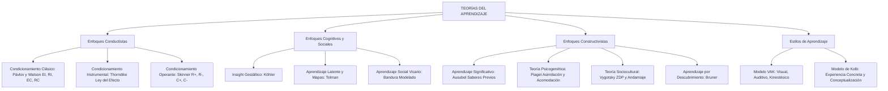

# TEMA 09: APRENDIZAJE: TEORÍAS Y ESTILOS

---

## 1. PORTADA Y FICHA TÉCNICA

```
========================================================================================
CURSO: PSICOLOGÍA PREUNIVERSITARIA
EJE: 05 - PERSONA Y FAMILIA
TEMA: 09 - APRENDIZAJE (CONDUCTISMO, COGNITIVISMO, CONSTRUCTIVISMO Y ESTILOS)
NIVEL: PREUNIVERSITARIO AVANZADO (UNSA - UNMSM - UNI)
DURACIÓN ESTIMADA: 4 HORAS ACADÉMICAS
SISTEMA DE EVALUACIÓN: DESTREZAS COGNITIVAS (DECO), MATRICES DE CONTINGENCIA Y MODELOS
========================================================================================
```

---

## 2. MAPA CONCEPTUAL SINTÉTICO (MERMAID)



---

## 3. MARCO TEÓRICO EXHAUSTIVO

### 3.1. Definición y Características del Aprendizaje
- **Definición Psicológica:** Proceso de cambio relativamente permanente en la conducta, en los procesos cognitivos o en el potencial conductual de un organismo, resultante de la práctica, la experiencia o la interacción con el ambiente.
- **Lo que NO es Aprendizaje:**
  - Cambios debidos a la **maduración biológica** (ej. aprender a caminar a los 12 meses por mielinización neuronal).
  - Respuestas causadas por **reflejos innatos** o instintos biológicos (ej. parpadeo corneal, reflejo rotuliano).
  - Modificaciones temporales por **fatiga**, ingestión de sustancias químicas (drogas, alcohol) o adaptación sensorial (ej. acostumbrarse a un olor fuerte).

---

## 4. LEYES, ECUACIONES Y MODELOS MATEMÁTICOS

### 4.1. Condicionamiento Clásico o Respondiente (Pávlov y Watson)
Se basa en la asociación por contigüidad temporal entre dos estímulos ($E \to E$):
1. **Fórmula del Proceso:**
   - **Antes del condicionamiento:**
     $$\text{Estímulo Incondicionado (EI: comida)} \longrightarrow \text{Respuesta Incondicionada (RI: salivación)}$$
     $$\text{Estímulo Neutro (EN: campana)} \longrightarrow \text{Respuesta de Orientación (No salivación)}$$
   - **Durante el condicionamiento:**
     $$\text{EN (campana)} + \text{EI (comida)} \longrightarrow \text{RI (salivación)}$$
   - **Después del condicionamiento:**
     $$\text{Estímulo Condicionado (EC: campana)} \longrightarrow \text{Respuesta Condicionada (RC: salivación)}$$
2. **Fenómenos del Condicionamiento Clásico:**
   - **Extinción:** Presentación reiterada del EC sin el EI; la RC se debilita gradualmente hasta desaparecer.
   - **Recuperación Espontánea:** Reaparición de la RC extinguida tras un periodo de descanso temporal.
   - **Generalización de Estímulos:** La RC se dispara ante estímulos similares al EC original (ej. campanas de distinto tono).
   - **Discriminación o Diferenciación:** El sujeto aprende a responder exclusivamente al EC específico y no a variantes.

### 4.2. Condicionamiento Operante o Instrumental (Thorndike y Skinner)
La conducta está en función de sus consecuencias ambientales ($R \to C$):
1. **Ley del Efecto de Edward Thorndike:** Las conductas seguidas de consecuencias satisfactorias tienden a repetirse; las seguidas de consecuencias displacenteras tienden a extinguirse.
2. **Triple Relación de Contingencia de B. F. Skinner:**
   $$E^D \ (\text{Estímulo Discriminativo}) \longrightarrow R \ (\text{Respuesta Operante}) \longrightarrow E^C \ (\text{Estímulo Consecuente})$$
3. **Matriz de Contingencias Operantes:**

| Naturaleza del Procedimiento | Consecuencia Apetecible / Agradable | Consecuencia Aversiva / Desagradable |
| :--- | :--- | :--- |
| **Se entrega o administra (Añadir estímulo, $+$)** | **REFUERZO POSITIVO ($R^+$):**<br>Incrementa la frecuencia de la conducta.<br>*(Ej. elogio, diploma, premio por sacar 20).* | **CASTIGO POSITIVO ($C^+$):**<br>Disminuye la frecuencia de la conducta.<br>*(Ej. llamada de atención, planas, multa).* |
| **Se retira o elimina (Quitar estímulo, $-$)** | **CASTIGO NEGATIVO ($C^-$ o Costo de Respuesta):**<br>Disminuye la frecuencia de la conducta.<br>*(Ej. quitar el celular por desaprobar).* | **REFUERZO NEGATIVO ($R^-$):**<br>Incrementa la frecuencia de la conducta.<br>- *Escape:* Quita un dolor presente.<br>- *Evitación:* Previene un dolor futuro. |

4. **Programas de Reforzamiento Intermitente:**
   - **Razón Fija (RF):** Refuerzo tras un número fijo constante de conductas (ej. comisión tras vender 5 libros).
   - **Razón Variable (RV):** Refuerzo tras un número impredecible y variable de conductas (ej. máquinas tragamonedas de casino). Es el más resistente a la extinción.
   - **Intervalo Fijo (IF):** Refuerzo a la primera conducta tras cumplirse un tiempo fijo exacto (ej. cobrar sueldo cada 30 días, examen cada viernes).
   - **Intervalo Variable (IV):** Refuerzo a la primera conducta tras intervalos temporales imprevistos (ej. simulacros sorpresa del docente).

### 4.3. Teorías Cognitivas y Constructivistas
1. **Aprendizaje Social o Vicario (Albert Bandura):**
   Aprendizaje por observación e imitación de modelos conductuales sin necesidad de ejecutar directamente la conducta ni recibir refuerzo inmediato. Requiere cuatro fases secuenciales:
   $$\text{Atención} \longrightarrow \text{Retención (Memoria)} \longrightarrow \text{Reproducción Motora} \longrightarrow \text{Motivación / Refuerzo Vicario}$$
2. **Aprendizaje Significativo (David Ausubel):**
   Ocurre cuando la nueva información se conecta de manera sustantiva y no arbitraria con los **saberes previos** (*subsumidores*) ya existentes en la estructura cognitiva del aprendiz.
   - Empleo de **organizadores previos** (puentes cognitivos entre lo que el alumno ya sabe y lo que necesita aprender).
   - Se opone frontalmente al *aprendizaje memorístico o repetitivo mecánico*.
3. **Teoría Sociocultural (Lev Vygotsky):**
   - El aprendizaje precede al desarrollo y es mediado por herramientas e instrumentos semióticos (el lenguaje).
   - **Zona de Desarrollo Real (ZDR):** Lo que el estudiante es capaz de resolver por sí mismo de forma autónoma.
   - **Zona de Desarrollo Próximo (ZDP):** Distancia entre la ZDR y el nivel de desarrollo potencial alcanzable con la guía de un adulto o mediador experto.
   - **Andamiaje (*Scaffolding* - Jerome Bruner):** Apoyo temporal y ajustable que brinda el docente o tutor en la ZDP y que se retira progresivamente a medida que el aprendiz gana autonomía.

### 4.4. Estilos de Aprendizaje
- **Modelo VAK:**
  - **Visual:** Recuerda mejor con imágenes, diagramas, esquemas, colores y lectura de textos.
  - **Auditivo:** Aprende escuchando explicaciones, debates orales, audiolibros y repetición en voz alta.
  - **Kinestésico:** Aprende mediante la acción física, manipulación de objetos, dramatización y experimentos de laboratorio.
- **Modelo de David Kolb (Ciclo Experiencial):**
  - Cruza dos ejes: Percepción (Experiencia Concreta vs. Conceptualización Abstracta) y Procesamiento (Experimentación Activa vs. Observación Reflexiva), generando cuatro estilos: *Convergente*, *Divergente*, *Asimilador* y *Acomodador*.

---

## 5. NEMOTECNIAS PREUNIVERSITARIAS

1. **Regla de Oro de Skinner:**
   > **"Refuerzo siempre SUMA conducta (aumenta)"**  
   > **"Castigo siempre RESTA conducta (disminuye)"**  
   > **"Positivo = Dar (+)"** / **"Negativo = Quitar (-)"**
2. **Fases del Modelado de Bandura:**
   > **"A-RE-MO"** $\implies$ **A**tención, **Re**tención, **Re**producción motora, **Mo**tivación.
3. **Las Zonas de Vygotsky:**
   > **ZDR:** *"Lo que hago solo"*.  
   > **ZDP:** *"El puente de aprendizaje con ayuda"*.  
   > **ZDPotencial:** *"Lo que haré mañana con autonomía"*.

---

## 6. HACKING DE ADMISIÓN Y ERRORES TRAMPA FRECUENTES

- **Trampa 1 (Confundir Refuerzo Negativo con Castigo):** ¡El error número 1 en admisión!
  - El **Refuerzo Negativo** elimina un estímulo aversivo para **AUMENTAR** la conducta deseada (ej. tomar una pastilla para quitarse el dolor de cabeza aumenta el hábito de tomarla; ponerse el cinturón para callar la alarma ruidosa del auto).
  - El **Castigo** siempre busca **DISMINUIR** o extinguir la conducta (positivo si da dolor, negativo si quita un privilegio).
- **Trampa 2 (Condicionamiento Clásico vs. Operante):** En el clásico la conducta es **involuntaria y refleja** (sistema nervioso autónomo: salivar, asustarse, taquicardia); en el operante la conducta es **voluntaria y motora** (sistema esquelético: apretar una palanca, estudiar, comprar).
- **Trampa 3 (Aprendizaje Significativo):** Para que haya aprendizaje significativo según Ausubel, es condición indispensable que el estudiante cuente con **ideas o saberes previos pertinentes** en su estructura cognitiva.

---

## 7. 5 PROBLEMAS RESUELTOS Y GRADUADOS

### Problema 1: Análisis de Contingencias Operantes de Skinner (Nivel Básico)
**Enunciado:** Cada vez que el perro de Pamela ladra de madrugada para subirse a la cama, Pamela le retira el juguete interactivo que más le gusta y lo guarda en un cajón con llave hasta el mediodía siguiente. Con este procedimiento, los ladridos nocturnos del perro disminuyen drásticamente en dos semanas. ¿Qué principio del condicionamiento operante aplicó Pamela?
A) Refuerzo positivo  
B) Refuerzo negativo  
C) Castigo positivo  
D) Castigo negativo (costo de respuesta)  
E) Extinción clásica  

**Solución paso a paso:**
1. Evaluamos el efecto sobre la conducta: los ladridos *disminuyeron* en frecuencia $\implies$ se trata de un **Castigo**.
2. Evaluamos la acción del estímulo: se le *retiró o quitó* un estímulo apetecible (su juguete favorito) $\implies$ es de naturaleza **Negativa**.
3. Por lo tanto, el procedimiento aplicado es un **Castigo Negativo** (o costo de respuesta).

**Respuesta:** D) Castigo negativo (costo de respuesta).

---

### Problema 2: Elementos del Condicionamiento Clásico (Nivel Intermedio)
**Enunciado:** De pequeño, Raúl sufrió una dolorosa quemadura tras escuchar el silbido estridente de una tetera hirviendo. Hoy en día, a sus 18 años, cada vez que escucha el silbido agudo de una tetera o de un pito similar, su ritmo cardíaco se acelera y retira la mano de forma refleja con angustia. En este caso de condicionamiento clásico, el dolor físico de la quemadura y el silbido de la tetera actúan respectivamente como:
A) Estímulo condicionado y respuesta incondicionada.  
B) Estímulo incondicionado y estímulo condicionado.  
C) Estímulo neutro y estímulo discriminativo.  
D) Respuesta condicionada y refuerzo aversivo.  
E) Estímulo incondicionado y respuesta condicionada.  

**Solución paso a paso:**
1. El dolor físico de la quemadura es un estímulo biológico que desencadena dolor y reflejos de forma innata sin aprendizaje previo: **Estímulo Incondicionado (EI)**.
2. El silbido de la tetera originalmente era un estímulo sonoro neutro que, al asociarse por contigüidad al dolor de la quemadura, adquiere la capacidad de evocar la respuesta de miedo y sobresalto: **Estímulo Condicionado (EC)**.

**Respuesta:** B) Estímulo incondicionado y estímulo condicionado.

---

### Problema 3: Teoría Sociocultural de Lev Vygotsky (Nivel Intermedio-Avanzado)
**Enunciado:** Un estudiante preuniversitario intenta resolver un problema de cinemática con derivadas y se bloquea por completo. El profesor no le resuelve el ejercicio, sino que le hace dos preguntas clave: *"¿Qué representa geométricamente la pendiente de la gráfica posición vs. tiempo?"* y *"¿Cómo se define la aceleración instantánea en función de la velocidad?"*. Con estas pistas y preguntas orientadoras, el estudiante deduce la solución por sí mismo. El profesor actuó dentro de:
A) La zona de desarrollo real del estudiante mediante castigo positivo.  
B) La zona de desarrollo próximo del estudiante brindando un andamiaje cognitivo.  
C) La asimilación pura sin acomodación piagetiana.  
D) El condicionamiento instrumental por ensayo y error.  
E) El moldeamiento conductual por aproximaciones sucesivas.  

**Solución paso a paso:**
1. El estudiante no podía resolver el problema solo (estaba fuera de su Zona de Desarrollo Real), pero tenía el potencial para hacerlo con la ayuda adecuada.
2. La intervención del docente mediante preguntas guía y pistas temporales constituye el **andamiaje** (*scaffolding* de Bruner) dentro de la **Zona de Desarrollo Próximo (ZDP)** postulada por Vygotsky.

**Respuesta:** B) La zona de desarrollo próximo del estudiante brindando un andamiaje cognitivo.

---

### Problema 4: Aprendizaje Social Vicario de Bandura (Nivel Avanzado)
**Enunciado:** En el famoso experimento del Muñeco Bobo (*Bobo Doll Experiment*) de Albert Bandura:
1. Niños en edad preescolar observaron a un adulto golpear violentamente a un muñeco inflable con un martillo mientras profería insultos verbales específicos.
2. Posteriormente, los niños fueron colocados en una habitación con juguetes atractivos y se les permitió jugar libremente con el muñeco.
Los resultados experimentales demostraron que:
A) Los niños ignoraron al muñeco por no haber recibido un refuerzo de comida previo.  
B) Los niños imitaron con precisión los mismos actos agresivos y expresiones verbales del adulto, demostrando que la conducta se adquiere por observación vicaria sin necesidad de reforzamiento directo previo.  
C) Solo los niños con lesiones prefrontales imitaron la conducta del modelo adulto.  
D) La agresión infantil es un instinto genético puro que no sufre influencia ambiental.  
E) La imitación cesó inmediatamente al retirar al adulto de la habitación.  

**Solución paso a paso:**
1. El experimento de Bandura demostró que el aprendizaje humano no depende exclusivamente de la ejecución motora directa reforzada (como sostenía Skinner).
2. Los niños aprenden repertorios conductuales complejos mediante la **atención y retención cognitiva del modelo (aprendizaje vicario u observacional)**, exhibiendo las conductas agresivas aprendidas de manera espontánea.

**Respuesta:** B) Los niños imitaron con precisión los mismos actos agresivos y expresiones verbales del adulto, demostrando que la conducta se adquiere por observación vicaria sin necesidad de reforzamiento directo previo.

---

### Problema 5: Programas de Reforzamiento de Skinner (Boss Challenge)
**Enunciado:** Analice los siguientes dos casos de conducta en relación con los programas de reforzamiento de B. F. Skinner:
Caso 1: Un obrero de una fábrica textil recibe una bonificación económica de 50 soles cada vez que confecciona exactamente 20 pantalones completos.
Caso 2: Un apostador introduce monedas en una máquina tragamonedas en el casino de Arequipa; a veces gana un premio tras 3 intentos, otras tras 45 intentos, y otras tras 12 intentos.
Los programas de reforzamiento que mantienen las conductas en el Caso 1 y Caso 2 son respectivamente:
A) Intervalo Fijo e Intervalo Variable.  
B) Razón Variable y Razón Fija.  
C) Razón Fija y Razón Variable.  
D) Intervalo Fijo y Razón Variable.  
E) Razón Fija e Intervalo Fijo.  

**Solución paso a paso:**
1. Caso 1: La entrega del reforzador económico depende estrictamente del número de conductas emitidas ($20\text{ pantalones}$ constantes) $\implies$ **Programa de Razón Fija (RF)**.
2. Caso 2: El refuerzo depende del número de intentos mecánicos, pero la cantidad exacta de palancazos requerida cambia aleatoriamente e impredeciblemente alrededor de un promedio $\implies$ **Programa de Razón Variable (RV)**.
3. El orden correcto es: Razón Fija y Razón Variable.

**Respuesta:** C) Razón Fija y Razón Variable.

---

## 8. 5 PROBLEMAS PROPUESTOS

1. ¿Qué fisiólogo ruso descubrió accidentalmente las leyes del condicionamiento clásico mientras investigaba los reflejos digestivos de los perros?
   - *Pista:* Premio Nobel de Medicina en 1904.
   - *Clave:* Iván Pávlov.

2. Un conductor se pone el cinturón de seguridad de su automóvil para apagar el chirrido molesto de la alarma del tablero. Este aumento en la conducta de usar el cinturón ejemplifica un:
   - *Pista:* Elimina un estímulo aversivo para aumentar la conducta.
   - *Clave:* Refuerzo negativo (de escape/evitación).

3. ¿Qué teórico postuló el concepto de "aprendizaje significativo", destacando la integración sustantiva entre la nueva información y los saberes previos?
   - *Pista:* Psicólogo educativo estadounidense de apellido Ausubel.
   - *Clave:* David Ausubel.

4. Un estudiante comprende súbitamente la solución de un problema de geometría mientras caminaba hacia su casa, exclamando: *"¡Eureka, ahora veo cómo trazar la línea auxiliar!"*. Este aprendizaje corresponde a:
   - *Pista:* Fenómeno gestáltico estudiado por Wolfgang Köhler.
   - *Clave:* Aprendizaje por insight (o reestructuración perceptiva).

5. ¿Cómo se denomina el estilo de aprendizaje del modelo VAK en el cual la persona aprende mejor realizando experimentos de laboratorio, tocando materiales y ejecutando movimientos físicos?
   - *Pista:* Movimiento y sensación corporal.
   - *Clave:* Kinestésico (o cinestésico).

---

## 9. GLOSARIO TÉCNICO ESPECIALIZADO

1. **Aprendizaje:** Cambio conductual o cognitivo relativamente permanente originado por la experiencia, el entrenamiento o la práctica interactiva.
2. **Condicionamiento Clásico:** Aprendizaje asociativo por contigüidad donde un estímulo neutro adquiere la propiedad de evocar una respuesta refleja involuntaria.
3. **Condicionamiento Operante:** Aprendizaje donde la probabilidad de emisión de una respuesta voluntaria es modulada por las consecuencias reforzantes o aversivas que le siguen.
4. **Refuerzo Negativo:** Incremento de una conducta motivado por la eliminación, reducción o evitación de un estímulo aversivo desagradable.
5. **Costo de Respuesta:** Disminución de una conducta provocada por la retirada deliberada de un reforzador positivo que el sujeto ya poseía (Castigo Negativo).
6. **Aprendizaje Vicario:** Adquisición de pautas de comportamiento a través de la observación atenta de las acciones y consecuencias en un modelo externo (Bandura).
7. **Zona de Desarrollo Próximo (ZDP):** Espacio conceptual entre las capacidades que el estudiante ya domina de forma autónoma y las que puede alcanzar con mediación experta (Vygotsky).
8. **Andamiaje:** Sistema estructurado de soportes y ayudas temporales brindadas al aprendiz para acompañar su progreso en la ZDP (Bruner).
9. **Aprendizaje Significativo:** Asimilación cognitiva de nuevos conceptos anclados de forma coherente y no arbitraria en ideas previas relevantes (Ausubel).
10. **Insight:** Fenómeno de comprensión repentina y reorganización global del campo perceptual que resuelve un problema intelectual (Gestalt).

---

## 10. FLASHCARDS DE REPASO RÁPIDO

- **P: ¿Cuál es la diferencia medular entre refuerzo y castigo en el condicionamiento operante?**
  *R: El refuerzo siempre incrementa la probabilidad de la conducta; el castigo siempre disminuye o extingue la conducta.*
- **P: ¿Qué es el refuerzo negativo?**
  *R: Es el aumento de una conducta como resultado de la eliminación o prevención de un estímulo aversivo (no es un castigo).*
- **P: ¿Cuáles son los cuatro componentes del condicionamiento clásico de Pávlov?**
  *R: Estímulo Incondicionado (EI), Respuesta Incondicionada (RI), Estímulo Condicionado (EC) y Respuesta Condicionada (RC).*
- **P: ¿Qué se requiere indispensablemente para que ocurra un aprendizaje significativo según Ausubel?**
  *R: Que el estudiante cuente con saberes previos pertinentes (subsumidores) donde anclar el nuevo conocimiento de forma no arbitraria.*
- **P: ¿Qué programa de refuerzo de Skinner es el más resistente a la extinción?**
  *R: El programa de Razón Variable (RV).*

---

## 11. CONEXIONES INTERDISCIPLINARIAS Y APLICACIÓN REAL

- **Diseño de Videojuegos y Gamificación:** Los sistemas de recompensas aleatorias (cofres de botín, *loot boxes*) se basan directamente en los programas de Razón Variable de Skinner para maximizar la tasa de juego constante y adictiva.
- **Pedagogía Universitaria y Currículo por Competencias:** El aprendizaje basado en problemas (ABP) y el aula invertida (*flipped classroom*) operan aplicando los principios de la ZDP de Vygotsky y el aprendizaje por descubrimiento guiado de Bruner.
- **Terapia Conductual y Modificación de Conducta:** Técnicas como la desensibilización sistemática de Joseph Wolpe (basada en el contracondicionamiento clásico) curan fobias específicas a volar o a animales asociando el estímulo temido con relajación muscular profunda.

---

## 12. BLOQUE DE GAMIFICACIÓN KMP (JSON)

```json
{
  "curso": "Psicologia",
  "tema": "Aprendizaje_Teorias_y_Estilos",
  "xp_recompensa": 220,
  "insignia": "Estratega_del_Condicionamiento_y_la_ZDP",
  "desafios": [
    {
      "id": "APR_01",
      "tipo": "opcion_multiple",
      "pregunta": "Un estudiante estudia con gran disciplina todos los días para no reprobar el curso y evitar que sus padres le quiten la mesada. Este aumento de conducta por evasión de consecuencias desagradables ejemplifica:",
      "opciones": [
        "Refuerzo negativo (conducta de evitación)",
        "Castigo positivo",
        "Refuerzo positivo",
        "Extinción operante"
      ],
      "respuesta_correcta": 0,
      "explicacion": "El refuerzo negativo incrementa la conducta mediante la eliminación o prevención de un estímulo aversivo futuro."
    },
    {
      "id": "APR_02",
      "tipo": "opcion_multiple",
      "pregunta": "La teoría que afirma que los niños aprenden conductas complejas observando a modelos en su entorno sin necesidad de refuerzo directo se denomina:",
      "opciones": [
        "Aprendizaje social o vicario (Bandura)",
        "Condicionamiento clásico respondiente (Pávlov)",
        "Ensayo y error (Thorndike)",
        "Inclusión subordinada (Ausubel)"
      ],
      "respuesta_correcta": 0,
      "explicacion": "Albert Bandura formuló la teoría del aprendizaje social fundamentada en la imitación y modelado vicario."
    },
    {
      "id": "APR_03",
      "tipo": "completar",
      "pregunta": "En la teoría de Vygotsky, la distancia entre el nivel de desarrollo real y el nivel de desarrollo potencial se denomina Zona de Desarrollo:",
      "respuesta_correcta": "Proximo",
      "explicacion": "Zona de Desarrollo Próximo (ZDP)."
    }
  ]
}
```
