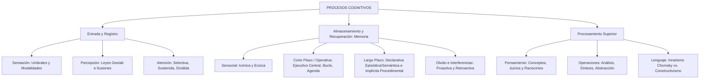

# TEMA 10: PROCESOS PSICOLÓGICOS BÁSICOS Y SUPERIORES

---

## 1. PORTADA Y FICHA TÉCNICA

```
========================================================================================
CURSO: PSICOLOGÍA PREUNIVERSITARIA
EJE: 05 - PERSONA Y FAMILIA
TEMA: 10 - PROCESOS COGNITIVOS (SENSACIÓN, PERCEPCIÓN, ATENCIÓN, MEMORIA, PENSAMIENTO Y LENGUAJE)
NIVEL: PREUNIVERSITARIO AVANZADO (UNSA - UNMSM - UNI)
DURACIÓN ESTIMADA: 5 HORAS ACADÉMICAS
SISTEMA DE EVALUACIÓN: DESTREZAS COGNITIVAS (DECO), LEYES GESTÁLTICAS Y MODELOS MNÉMICOS
========================================================================================
```

---

## 2. MAPA CONCEPTUAL SINTÉTICO (MERMAID)



---

## 3. MARCO TEÓRICO EXHAUSTIVO

### 3.1. Sensación y Umbrales Sensoriales
- **Sensación:** Proceso neurofisiológico inicial de captación, transducción y transmisión de estímulos físicos o químicos desde el medio hacia los centros corticales especializados.
- **Base Anátomo-Fisiológica:**
  1. **Receptor Sensorial:** Célula transductora especializada que transforma energía física en impulsos bioeléctricos (potencial de acción).
  2. **Vía Aferente (Nervio Sensitivo):** Conduce los impulsos hacia el sistema nervioso central.
  3. **Centro Cortical:** Área de la corteza cerebral donde se decodifica e integra la sensación (ej. lóbulo occipital para la visión, lóbulo temporal para la audición).
- **Modalidades Sensoriales:**
  - **Exteroceptivas:** Vista, audición, olfato, gusto y tacto cutáneo (presión, dolor, temperatura).
  - **Propioceptivas o Cinestésicas:** Informan sobre la posición, tensión muscular, movimiento articular y postura del cuerpo (receptores en músculos y tendones).
  - **Visceroceptivas o Cenestésicas:** Informan sobre el estado interno de las vísceras (hambre, sed, fatiga visceral, náuseas).
  - **Laberínticas o Vestibulares:** Informan sobre el equilibrio, orientación espacial y aceleración cefálica (canales semicirculares del oído interno).
- **Umbrales Sensoriales y Psicofísica:**
  - **Umbral Mínimo o Absoluto:** Intensidad mínima de un estímulo requerida para provocar una sensación el $50\%$ de las veces.
  - **Umbral Diferencial o D.A.P. (Diferencia Apenas Perceptible):** Variación mínima de intensidad necesaria para que el sujeto note un cambio en la sensación.
  - **Ley de Weber-Fechner:** La magnitud del umbral diferencial es una fracción constante de la intensidad del estímulo original ($\frac{\Delta I}{I} = k$).

### 3.2. Percepción y Leyes de la Gestalt
- **Percepción:** Proceso cognitivo activo y constructivo mediante el cual el cerebro organiza, interpreta y otorga significado consciente a los datos sensoriales integrándolos con la experiencia previa.
- **Principios de Organización Perceptual (Gestalt):**
  1. **Ley de Figura y Fondo:** La mente separa automáticamente un elemento principal enfocado (figura, contornos nítidos) del campo difuso que lo rodea (fondo).
  2. **Ley de Pregnancia o Buena Forma:** La percepción tiende a organizarse de la manera más simple, simétrica, regular y estable posible.
  3. **Ley de Cierre o Clausura:** La mente completa figuras incompletas percibiendo totalidades cerradas.
  4. **Ley de Proximidad:** Elementos cercanos en el espacio o tiempo tienden a agruparse en una sola unidad perceptiva.
  5. **Ley de Semejanza:** Estímulos de forma, color o tamaño similar tienden a agruparse juntos.
  6. **Ley de Continuidad:** Estímulos orientados en una misma dirección tienden a percibirse como parte de un patrón continuo.
- **Alteraciones de la Percepción:**
  - **Ilusión:** Percepción **deformada o errónea de un objeto real presente**. Puede ser:
    - *Objetiva:* Causada por la disposición física de los estímulos (ej. ilusiones ópticas geométricas de Müller-Lyer o Ponzo; lápiz quebrado en agua).
    - *Subjetiva o Catatímica:* Provocada por un estado emocional o afectivo intenso (ej. ver la silueta de un ladrón en un perchero por miedo en la oscuridad).
  - **Alucinación:** Percepción **falsa sin la presencia de un estímulo u objeto físico real** (*"pseudopercepción"* o percepción sin objeto), originada en cuadros psicóticos, intoxicación por sustancias psicoactivas o delirios.

---

## 4. LEYES, ECUACIONES Y MODELOS MATEMÁTICOS

### 4.1. Atención y Memoria
1. **Tipos de Atención:**
   - **Involuntaria o Refleja:** Desencadenada automáticamente por un estímulo súbito e intenso (reflejo de orientación).
   - **Voluntaria:** Dirigida conscientemente por el sujeto mediante esfuerzo deliberado hacia una tarea específica.
   - **Selectiva (Focalizada):** Discrimina un estímulo relevante ignorando distractores.
   - **Sostenida:** Mantiene la concentración durante periodos prolongados.
   - **Dividida:** Distribuye recursos atencionales entre dos o más tareas simultáneas.

2. **Modelo Multialmacén de la Memoria (Atkinson y Shiffrin, 1968):**

```
[Estímulo Ambiental]
        │
        ▼
┌─────────────────────────┐
│   MEMORIA SENSORIAL     │ (Capacidad ilimitada, duración: milisegundos)
│ (Icónica: visual / Ecoica: auditiva)
└───────────┬─────────────┘
            │  (Atención selectiva)
            ▼
┌─────────────────────────┐
│ MEMORIA A CORTO PLAZO   │ (Capacidad: 7 ± 2 chunks, duración: 15-30 seg)
│  (Memoria de Trabajo)   │ <───> [Ejecutivo Central, Bucle Fonológico, Agenda Visoespacial]
└───────────┬─────────────┘
            │  (Codificación y consolidación)
            ▼
┌─────────────────────────┐
│  MEMORIA A LARGO PLAZO  │ (Capacidad y duración prácticamente ilimitadas)
└─────────────────────────┘
```

3. **Subtipos de Memoria a Largo Plazo (Endel Tulving):**
   - **Memoria Declarativa o Explícita (Consciente y verbalizable):**
     - *Episódica (Biográfica):* Recuerdos de eventos personales vividos en un tiempo y espacio específicos (*"Mi primer día de colegio"*).
     - *Semántica (Enciclopédica):* Conocimiento general del mundo, conceptos, fórmulas y significados sin contexto temporal (*"París es la capital de Francia"*, *$E = mc^2$*).
   - **Memoria No Declarativa o Implícita (Inconsciente y procedimental):**
     - Habilidades motoras, hábitos, destrezas y condicionamientos reflejos (*"Manejar bicicleta"*, *"Nadar"*, *"Escribir en el teclado"*).

4. **Teorías del Olvido e Interferencias:**
   - **Interferencia Proactiva:** La información antigua previamente aprendida interfiere y dificulta el recuerdo de la nueva información aprendida recientemente (*"Memorizar el nuevo número telefónico cuesta porque se viene a la mente el número antiguo"*).
   - **Interferencia Retroactiva:** La nueva información recién aprendida interfiere y borra el recuerdo de la información antigua previa (*"Aprender el nuevo vocabulario en inglés hace olvidar las palabras aprendidas en francés el año pasado"*).

5. **Trastornos de la Memoria:**
   - **Amnesia Anterógrada:** Incapacidad para fijar o consolidar nuevos recuerdos a largo plazo tras una lesión o trauma cerebral (famoso caso H.M., película *Memento*).
   - **Amnesia Retrógrada:** Incapacidad para evocar recuerdos acontecidos antes de la lesión o trauma.
   - **Paramnesias:** Ilusiones del reconocimiento: *Déjà vu* ("ya visto", sensación falsa de haber vivido algo nuevo) y *Jamais vu* ("nunca visto", no reconocer algo que es familiar).

### 4.2. Pensamiento y Lenguaje
1. **Formas del Pensamiento:**
   - **Conceptos:** Representaciones mentales generales de las propiedades esenciales de una clase de objetos.
   - **Juicios:** Afirmaciones o negaciones que relacionan dos conceptos estableciendo una verdad o falsedad.
   - **Raciocinios:** Encadenamiento de juicios para inferir una conclusión:
     - *Deductivo:* De lo general a lo particular.
     - *Inductivo:* De casos particulares a una generalización.
2. **Operaciones del Pensar:**
   - *Análisis:* Descomposición mental de un todo en sus partes.
   - *Síntesis:* Reintegración mental de las partes en un todo articulado.
   - *Comparación:* Determinación de semejanzas y diferencias.
   - *Abstracción:* Aislamiento mental de una cualidad esencial prescindiendo de las accesorias.
   - *Generalización:* Extensión de una cualidad esencial común a todos los elementos de un grupo.
3. **Lenguaje y Teorías de Adquisición:**
   - **Innatismo (Noam Chomsky):** Los humanos nacen con un Dispositivo de Adquisición del Lenguaje (LAD) y una Gramática Universal innata biológicamente determinada.
   - **Sociocultural (Lev Vygotsky):** El pensamiento y el lenguaje tienen raíces genéticas distintas; hacia los 2 años convergen (*pensamiento verbal y lenguaje racional*), donde el lenguaje interiorizado estructura la conciencia.
   - **Cognitivismo Genético (Jean Piaget):** El desarrollo del pensamiento precede y subordina al desarrollo del lenguaje (el lenguaje es una manifestación de la función simbólica).

---

## 5. NEMOTECNIAS PREUNIVERSITARIAS

1. **Regla de las Interferencias:**
   > **"PRO-antigua estorba":** Lo antiguo no deja entrar a lo nuevo (Interferencia **Pro**activa).  
   > **"RETRO-nueva borra":** Lo nuevo borra a lo antiguo (Interferencia **Retro**activa).
2. **Leyes de la Gestalt:**
   > **"PRE-CI-PRO-SE-FI-CON"** $\implies$ **Pre**gnancia, **Ci**erre, **Pro**ximidad, **Se**mejanza, **Fi**gura/Fondo, **Con**tinuidad.
3. **Memoria de Tulving:**
   > **E-S-P** $\implies$ **E**pisódica (vivencias), **S**emántica (conceptos), **P**rocedimental (habilidades motoras).
4. **Alucinación vs. Ilusión:**
   > Ilusión = Hay objeto, pero deformado.  
   > Alucinación = No hay objeto (engendro puro de la mente).

---

## 6. HACKING DE ADMISIÓN Y ERRORES TRAMPA FRECUENTES

- **Trampa 1 (Ilusión Subjetiva vs. Alucinación):** En la pregunta clásica: *"Juan camina por un callejón oscuro y cree ver a un fantasma en una sábana colgada que se mueve con el viento"*. Como **HAY un objeto físico real presente** (la sábana), es una **ILUSIÓN SUBJETIVA CATATÍMICA**, ¡no una alucinación! Para ser alucinación, no debe existir ningún objeto en el entorno físico.
- **Trampa 2 (Amnesia Anterógrada vs. Retrógrada):**
  - Amnesia Anterógrada: No puede formar recuerdos **nuevos hacia adelante** en el tiempo ($t > t_{\text{trauma}}$).
  - Amnesia Retrógrada: Olvida recuerdos **antiguos hacia atrás** ($t < t_{\text{trauma}}$).
- **Trampa 3 (Cinestesia vs. Cenestesia):**
  - **Cinestesia / Propiocepción (con C/K de movimiento):** Músculos, articulaciones, movimiento, equilibrio motor.
  - **Cenestesia / Viscerocepción (con C de cuerpo interno):** Órganos internos, hambre, sed, ardor estomacal, presión de la vejiga.

---

## 7. 5 PROBLEMAS RESUELTOS Y GRADUADOS

### Problema 1: Modalidades Sensoriales (Nivel Básico)
**Enunciado:** Un gimnasta olímpico realiza un salto mortal triple en el aire y aterriza perfectamente de pie sobre la colchoneta sin mirar sus pies. Para coordinar la tensión exacta de sus músculos y tendones en pleno vuelo y calcular la posición de sus extremidades, ¿qué modalidad sensorial empleó prioritariamente?
A) Sensación exteroceptiva visual  
B) Sensación propioceptiva o cinestésica  
C) Sensación cenestésica visceral  
D) Sensación exteroceptiva táctil pura  
E) Percepción ilusoria  

**Solución paso a paso:**
1. La información referida a la posición corporal, tensión muscular, movimiento de articulaciones y postura física en el espacio sin apoyo visual depende de los mecanorreceptores en los husos musculares y órganos tendinosos de Golgi.
2. Esta modalidad sensorial se denomina **Propiocepción o Cinestesia**.

**Respuesta:** B) Sensación propioceptiva o cinestésica.

---

### Problema 2: Principios Gestálticos de Organización (Nivel Intermedio)
**Enunciado:** Al observar una marquesina luminosa de un teatro en el centro de Arequipa, una hilera de focos individuales se enciende y apaga secuencialmente a gran velocidad, generando en los transeúntes la percepción vívida de una flecha de luz que se desplaza fluidamente hacia la entrada. Este fenómeno de movimiento aparente (Fenómeno Phi) se explica mediante el principio perceptual gestáltico de:
A) Ley de cierre  
B) Ley de pregnancia y continuidad  
C) Ley de figura y fondo reversible  
D) Umbral diferencial psicofísico  
E) Ilusión catatímica  

**Solución paso a paso:**
1. Max Wertheimer descubrió la psicología de la Gestalt estudiando precisamente el **Fenómeno Phi** (movimiento estroboscópico aparente).
2. La mente no percibe bombillas estáticas independientes, sino que organiza los destellos continuos en un patrón único y armónico regido por la **Ley de Continuidad y la Ley de Pregnancia (Buena Forma)**.

**Respuesta:** B) Ley de pregnancia y continuidad.

---

### Problema 3: Interferencias de la Memoria en Casos DECO (Nivel Intermedio-Avanzado)
**Enunciado:** Carlos aprendió a conducir un automóvil con transmisión manual (caja de cambios con palanca y embrague) durante cinco años. Recientemente compró un vehículo automático moderno. Sin embargo, en las primeras semanas de manejo, cada vez que frena de imprevisto, su pie izquierdo pisa automáticamente el suelo buscando el embrague inexistente. ¿Qué tipo de interferencia en el aprendizaje y la memoria se evidencia en la conducta motora de Carlos?
A) Interferencia retroactiva  
B) Interferencia proactiva  
C) Amnesia anterógrada episódica  
D) Extinción vicaria  
E) Paramnesia del jamás visto  

**Solución paso a paso:**
1. La información y el hábito motor previamente aprendidos y consolidados (conducir con embrague) interfieren y dificultan la ejecución de la nueva conducta motora aprendida (manejar vehículo automático).
2. Cuando lo **antiguo interfiere sobre lo nuevo**, el fenómeno corresponde a una **Interferencia Proactiva**.

**Respuesta:** B) Interferencia proactiva.

---

### Problema 4: Memoria de Trabajo y Modelo de Baddeley (Nivel Avanzado)
**Enunciado:** Durante una llamada telefónica urgente, una secretaria retiene mentalmente una dirección compuesta por calle, número y referencia visual que le dictan rápidamente. Mientras repite los nombres en voz baja para no olvidarlos, imagina simultáneamente la ruta en el mapa de la ciudad para indicarle al mensajero. En el modelo de memoria de trabajo de Alan Baddeley, la repetición verbal mental y la visualización del mapa operan respectivamente en:
A) El ejecutivo central y la memoria sensorial ecoica.  
B) El bucle fonológico y la agenda visoespacial.  
C) La memoria semántica y la memoria episódica.  
D) El almacén icónico y el reflejo cinestésico.  
E) La memoria procedimental y la memoria biográfica.  

**Solución paso a paso:**
1. El **bucle fonológico (o lazo articulatorio)** retiene la información verbal y acústica mediante la repetición subvocal encubierta.
2. La **agenda visoespacial** manipula y almacena temporalmente imágenes mentales, formas y relaciones espaciales (el mapa mental de la ruta).
3. Ambos subsistemas son coordinados y supervisados por el **ejecutivo central**.

**Respuesta:** B) El bucle fonológico y la agenda visoespacial.

---

### Problema 5: Patología de la Memoria vs. Percepción (Boss Challenge)
**Enunciado:** Analice los siguientes dos casos clínicos neurológicos:
- Paciente 1: Sufrió un traumatismo craneoencefálico en el lóbulo temporal medial; recuerda perfectamente su infancia y vida pasada, pero es incapaz de recordar qué almorzó hace una hora o el nombre del médico que lo atendió hace diez minutos.
- Paciente 2: Durante un episodio febril extremo de 41 °C, asegura con terror que hay arañas venenosas gigantes caminando sobre su sábana blanca, en la cual no existe ningún insecto ni mancha alguna.
Los diagnósticos psicopatológicos exactos para el Paciente 1 y el Paciente 2 son respectivamente:
A) Amnesia retrógrada e ilusión subjetiva.  
B) Amnesia anterógrada y alucinación.  
C) Amnesia anterógrada e ilusión catatímica.  
D) Amnesia retrógrada y alucinación.  
E) Paramnesia de déjà vu y delirio paranoide.  

**Solución paso a paso:**
1. El Paciente 1 recuerda el pasado previo a la lesión, pero es completamente incapaz de consolidar nuevos recuerdos a largo plazo tras el traumatismo $\implies$ **Amnesia Anterógrada**.
2. El Paciente 2 percibe arañas sobre la sábana en ausencia absoluta de cualquier objeto físico real en el ambiente $\implies$ **Alucinación** (percepción sin objeto real).
3. La combinación exacta es: Amnesia anterógrada y alucinación.

**Respuesta:** B) Amnesia anterógrada y alucinación.

---

## 8. 5 PROBLEMAS PROPUESTOS

1. ¿Cómo se denomina el umbral psicofísico que define la cantidad mínima de energía necesaria para provocar una sensación consciente?
   - *Pista:* Umbral de entrada o basal.
   - *Clave:* Umbral absoluto (o mínimo).

2. Un testigo de un asalto en la noche asegura que el delincuente vestía una máscara diabólica con cuernos, pero los videos de seguridad demuestran que era solo una bufanda oscura movida por el viento. ¿Qué fenómeno perceptual experimentó el testigo motivado por el pánico?
   - *Pista:* Deformación de un objeto real por emoción intensa.
   - *Clave:* Ilusión subjetiva (o catatímica).

3. En el modelo de memoria a largo plazo de Endel Tulving, ¿qué sistema almacena los conceptos universales, las reglas gramaticales y los hechos históricos sin ligazón a una fecha personal biográfica?
   - *Pista:* Memoria de significados o enciclopédica.
   - *Clave:* Memoria semántica.

4. ¿Qué operación básica del pensamiento consiste en aislar mentalmente una característica esencial común de un conjunto de objetos prescindiendo de sus rasgos accesorios o materiales?
   - *Pista:* Operación fundamental para formar conceptos.
   - *Clave:* Abstracción.

5. ¿Qué lingüista formuló la teoría del Dispositivo de Adquisición del Lenguaje (LAD) y la Gramática Universal innata en el cerebro humano?
   - *Pista:* Padre de la lingüística generativa moderna.
   - *Clave:* Noam Chomsky.

---

## 9. GLOSARIO TÉCNICO ESPECIALIZADO

1. **Sensación:** Registro neurobiológico de estímulos físicos mediante receptores que transducen energía en potenciales de acción.
2. **Percepción:** Integración, organización e interpretación cognitiva de datos sensoriales que confiere significado a la experiencia.
3. **Pregnancia:** Principio gestáltico según el cual la organización perceptiva tiende hacia la forma más armónica, simple y regular.
4. **Alucinación:** Experiencia perceptiva vívida experimentada en ausencia total de un estímulo físico externo correspondiente.
5. **Memoria Operativa (de Trabajo):** Sistema cognitivo de capacidad limitada que retiene y manipula activamente información en tiempo real para resolver tareas complejas.
6. **Memoria Episódica:** Subsistema declarativo que almacena recuerdos de eventos autobiográficos asociados a un contexto espacio-temporal específico.
7. **Memoria Semántica:** Subsistema declarativo de almacenamiento de conocimientos conceptuales generales, hechos y lenguaje desprovistos de coordenadas biográficas personales.
8. **Interferencia Proactiva:** Fenómeno mnémico donde recuerdos previamente aprendidos entorpecen la fijación o recuperación de nueva información.
9. **Amnesia Anterógrada:** Déficit mnémico caracterizado por la imposibilidad de transferir información de la memoria a corto plazo a la memoria a largo plazo tras una lesión.
10. **Abstracción:** Operación intelectual que aísla mentalmente rasgos comunes y definitorios de los objetos para la elaboración de conceptos.

---

## 10. FLASHCARDS DE REPASO RÁPIDO

- **P: ¿Cuál es la diferencia medular entre una ilusión y una alucinación?**
  *R: En la ilusión hay un objeto físico real cuya percepción se deforma; en la alucinación no existe ningún objeto físico real (percepción sin objeto).*
- **P: ¿Qué es la interferencia proactiva y la interferencia retroactiva?**
  *R: La proactiva es cuando lo aprendido antes interfiere con lo nuevo; la retroactiva es cuando lo recién aprendido borra o distorsiona lo aprendido anteriormente.*
- **P: ¿Qué componentes integran la memoria de trabajo según Alan Baddeley?**
  *R: El Ejecutivo Central, el Bucle Fonológico, la Agenda Visoespacial y el Búfer Episódico.*
- **P: ¿Cuáles son las dos subdivisiones de la memoria declarativa explícita?**
  *R: La memoria episódica (recuerdos biográficos con tiempo y espacio) y la memoria semántica (conceptos y conocimientos generales).*
- **P: ¿Qué postula Noam Chomsky respecto a la adquisición del lenguaje?**
  *R: Que los seres humanos poseen un dispositivo biológico innato (LAD) que posibilita la adquisición espontánea de la gramática universal.*

---

## 11. CONEXIONES INTERDISCIPLINARIAS Y APLICACIÓN REAL

- **Inteligencia Artificial y Visión por Computadora:** Los algoritmos de reconocimiento facial y segmentación de imágenes en redes neuronales convolucionales (CNN) aplican directamente los filtros de contraste y las leyes de agrupamiento de la Gestalt (proximidad, bordes y cierre).
- **Neurología Clínica y Neurocirugía:** La comprensión del hipocampo como consolidador (no reservorio permanente) de la memoria a largo plazo transformó las técnicas quirúrgicas para el tratamiento de epilepsias refractarias, preservando la memoria semántica.
- **Psicología del Testimonio Judicial:** Los estudios de Elizabeth Loftus sobre memorias falsas demuestran que las preguntas inductivas en interrogatorios policiales pueden generar interferencia retroactiva, modificando los recuerdos de los testigos oculares.

---

## 12. BLOQUE DE GAMIFICACIÓN KMP (JSON)

```json
{
  "curso": "Psicologia",
  "tema": "Procesos_Psicologicos_Basicos",
  "xp_recompensa": 230,
  "insignia": "Decodificador_de_la_Mente_y_la_Percepcion",
  "desafios": [
    {
      "id": "COG_01",
      "tipo": "opcion_multiple",
      "pregunta": "¿Qué tipo de memoria permite a una persona recordar con claridad el sabor del pastel y las canciones que sonaron en su fiesta de quince años?",
      "opciones": [
        "Memoria declarativa episódica",
        "Memoria declarativa semántica",
        "Memoria no declarativa procedimental",
        "Memoria sensorial ecoica"
      ],
      "respuesta_correcta": 0,
      "explicacion": "La memoria episódica almacena eventos biográficos personales contextualizados en un tiempo y lugar específicos."
    },
    {
      "id": "COG_02",
      "tipo": "opcion_multiple",
      "pregunta": "Ver una soga enrollada en la oscuridad y gritar creyendo que es una serpiente venenosa constituye un claro ejemplo de:",
      "opciones": [
        "Ilusión subjetiva o catatímica",
        "Alucinación óptica",
        "Paramnesia de jamais vu",
        "Amnesia anterógrada"
      ],
      "respuesta_correcta": 0,
      "explicacion": "Existe un objeto físico real presente (la soga) que es percibido de forma deformada por influjo de una emoción intensa (el miedo), lo que define una ilusión subjetiva."
    },
    {
      "id": "COG_03",
      "tipo": "completar",
      "pregunta": "El lingüista que postuló la existencia innata del Dispositivo de Adquisición del Lenguaje (LAD) es:",
      "respuesta_correcta": "Noam Chomsky",
      "explicacion": "Noam Chomsky revolucionó la psicolingüística con la teoría innatista de la gramática universal."
    }
  ]
}
```
