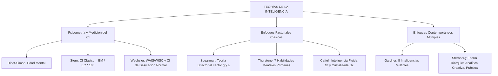

# TEMA 11: INTELIGENCIA Y TEORÍAS CONTEMPORÁNEAS

---

## 1. PORTADA Y FICHA TÉCNICA

```
========================================================================================
CURSO: PSICOLOGÍA PREUNIVERSITARIA
EJE: 05 - PERSONA Y FAMILIA
TEMA: 11 - INTELIGENCIA (MEDICIÓN, PSICOMETRÍA, FACTORIALISMO Y MODELOS MÚLTIPLES)
NIVEL: PREUNIVERSITARIO AVANZADO (UNSA - UNMSM - UNI)
DURACIÓN ESTIMADA: 4 HORAS ACADÉMICAS
SISTEMA DE EVALUACIÓN: DESTREZAS COGNITIVAS (DECO), PSICOMETRÍA Y MODELOS DE GARDNER/STERNBERG
========================================================================================
```

---

## 2. MAPA CONCEPTUAL SINTÉTICO (MERMAID)



---

## 3. MARCO TEÓRICO EXHAUSTIVO

### 3.1. Definición y Evolución Histórica del Concepto
- **Etimología:** Proviene del latín *intelligentia*, derivado de *inter* (entre) y *legere* (escoger, elegir, leer), denotando la capacidad de "saber elegir entre varias opciones la mejor alternativa".
- **Definición Psicológica Contemporánea:** Capacidad cognitiva global y multivariable que permite a un individuo asimilar información, razonar de manera abstracta, resolver problemas novedosos, aprender de la experiencia y adaptarse eficazmente a entornos cambiantes y desafiantes (David Wechsler / APA).
- **El Debate Herencia vs. Ambiente:**
  - Estudios en gemelos idénticos criados en ambientes separados demuestran una heredabilidad genética de entre el $50\%$ y el $70\%$ para el factor general de inteligencia.
  - El ambiente (nutrición en la primera infancia, estimulación cognitiva temprana, educación de calidad y nivel socioeconómico) modula y determina el grado de expresión de ese potencial genético dentro de un "rango de reacción".

---

## 4. LEYES, ECUACIONES Y MODELOS MATEMÁTICOS

### 4.1. Psicometría y Medición del Cociente Intelectual (CI)
1. **Escala Binet-Simon (1905):**
   Primer test científico de inteligencia, desarrollado en Francia para identificar niños con necesidades educativas especiales en escuelas públicas. Introduce el concepto de:
   - **Edad Mental ($EM$):** Nivel de desarrollo cognitivo alcanzado por un individuo en comparación con el promedio de su grupo de edad cronológica.
2. **Cociente Intelectual Clásico de William Stern (1912):**
   Fórmula de razón matemática:
   $$CI = \frac{EM}{EC} \times 100$$
   - $EM$: Edad Mental (puntuación obtenida en el test estandarizado).
   - $EC$: Edad Cronológica real del sujeto.
   - Si $EM = EC \implies CI = 100$ (rendimiento exactamente promedio).
   - Limitación: Útil solo en la niñez; pierde validez en adultos porque la edad cronológica avanza linealmente mientras que el desarrollo mental se estabiliza.
3. **Escalas de David Wechsler (WAIS, WISC, WPPSI) y CI de Desviación:**
   Wechsler reemplaza la fórmula de Stern por la **distribución normal de Gauss**, comparando el rendimiento del sujeto con personas de su mismo grupo de edad:
   - Media estandarizada: $\mu = 100$.
   - Desviación estándar: $\sigma = 15$.

```
                    Curva Normal de Gauss (CI Wechsler)
                                   100 (50%)
                                     │
                             ┌───────┴───────┐
                     85      │               │     115
             ┌───────┴───────┘               └───────┴───────┐
       70    │                                               │    130
  ─────┼─────┼───────────────┼───────────────┼───────────────┼─────┼─────
      -2σ   -1σ              0              +1σ             +2σ   +3σ
```

- **Clasificación Diagnóstica del CI (Wechsler):**
  - $130$ a más: Muy superior / Superdotación intelectual ($2.2\%$).
  - $120 - 129$: Superior.
  - $110 - 119$: Promedio alto (Brillante).
  - $90 - 109$: Promedio / Normal ($50\%$ de la población).
  - $80 - 89$: Promedio bajo (Torpe).
  - $70 - 79$: Limítrofe / Fronterizo (*Borderline*).
  - Menor a $70$: Discapacidad Intelectual (acompañada de fallas en conducta adaptativa).

### 4.2. Teorías Factoriales Clásicas
1. **Teoría Bifactorial de Charles Spearman (1904):**
   El rendimiento en cualquier prueba intelectual depende de dos factores:
   - **Factor General ($g$):** Energía mental innata, biológica y constante presente en todas las actividades intelectuales.
   - **Factores Específicos ($s$):** Habilidades particulares requeridas para tareas concretas (dibujo, cálculo aritmético, motricidad), dependientes del aprendizaje.
2. **Teoría de las Aptitudes Mentales Primarias de Louis Thurstone (1938):**
   Rechaza el factor $g$ único y postula siete factores independientes:
   - Comprensión verbal ($V$).
   - Fluidez verbal ($W$).
   - Aptitud numérica ($N$).
   - Aptitud espacial ($S$).
   - Memoria asociativa ($M$).
   - Velocidad perceptual ($P$).
   - Razonamiento inductivo ($R$).
3. **Teoría de Raymond Cattell (Inteligencia Fluida y Cristalizada):**
   - **Inteligencia Fluida ($Gf$):** Capacidad biológica e innata para resolver problemas abstractos y novedosos sin aprendizaje cultural previo (razonamiento inductivo, matrices lógicas, velocidad mental). Alcanza su pico hacia los 20-25 años y **declina fisiológicamente** en la vejez por envejecimiento neuronal.
   - **Inteligencia Cristalizada ($Gc$):** Conjunto de conocimientos, vocabulario, habilidades y sabiduría acumuladas a través de la educación, la cultura y la experiencia de vida. **Se mantiene estable o continúa creciendo** a lo largo de la adultez y la vejez.

### 4.3. Teorías Contemporáneas
1. **Teoría de las Inteligencias Múltiples de Howard Gardner (1983):**
   Rechaza el reduccionismo academicista del CI tradicional (que solo mide lógica y lenguaje). Define la inteligencia como la capacidad de resolver problemas o crear productos valorados en un contexto cultural, postulando ocho inteligencias independientes con base neurológica:
   - **Lingüística:** Sensibilidad al significado y orden de las palabras (escritores, poetas, oradores).
   - **Lógico-Matemática:** Razonamiento abstracto, cálculo y rigor deductivo (físicos, matemáticos, programadores).
   - **Espacial:** Visualización tridimensional y transformación mental de formas (arquitectos, ajedrecistas, cirujanos, navegantes).
   - **Cinético-Corporal:** Dominio del cuerpo para expresar ideas o manipular herramientas complejas (atletas, bailarines, artesanos, cirujanos).
   - **Musical:** Discriminación de tonos, ritmos, timbres y armonía (compositores, directores de orquesta).
   - **Interpersonal:** Comprensión de las intenciones, emociones y deseos de los demás (psicólogos, docentes, diplomáticos, líderes).
   - **Intrapersonal:** Autoconocimiento profundo, autorregulación y conciencia de las propias fortalezas y límites.
   - **Naturalista (añadida en 1995):** Reconocimiento y clasificación de flora, fauna y patrones del entorno ecológico (biólogos, botánicos, agricultores).

2. **Teoría Triárquica de Robert Sternberg (1985):**
   Define la inteligencia exitosa a través de tres dimensiones interrelacionadas:
   - **Inteligencia Analítica (Componencial):** Habilidad para analizar, evaluar, comparar, juzgar y resolver problemas académicos con una única respuesta correcta (lo que mide el CI tradicional).
   - **Inteligencia Creativa (Experiencial):** Habilidad para generar ideas innovadoras, formular soluciones originales ante situaciones imprevistas y combinar información de manera novedosa.
   - **Inteligencia Práctica (Contextual):** Capacidad de adaptación, moldeamiento o selección del entorno para aplicar los conocimientos en la vida cotidiana ("sentido común" o inteligencia callejera).

---

## 5. NEMOTECNIAS PREUNIVERSITARIAS

1. **Fórmula del CI de William Stern:**
   > **"C-I = E-M / E-C x 100"** $\implies$ *"Mi Edad Mental sobre Mi Edad Cronológica multiplicada por cien"*.
2. **Cattell: Fluida vs. Cristalizada:**
   > **Fluida = Biológica y Juvenil** (como el agua corre rápido pero se seca con la vejez).  
   > **Cristalizada = Cultural y Eterna** (como un cristal que se va formando con los años y no mengua).
3. **Triárquica de Sternberg:**
   > **"A-C-P"** $\implies$ **A**nalítica (examen), **C**reativa (invento), **P**ráctica (calle/cotidiano).

---

## 6. HACKING DE ADMISIÓN Y ERRORES TRAMPA FRECUENTES

- **Trampa 1 (Cálculo del CI Clásico):** Si un niño de 10 años ($EC = 10$) resuelve los problemas de un niño de 12 años ($EM = 12$):
  $$CI = \frac{12}{10} \times 100 = 120 \quad (\text{Categoría Superior})$$
  Si el niño tiene 10 años ($EC = 10$) pero su rendimiento es de 8 años ($EM = 8$):
  $$CI = \frac{8}{10} \times 100 = 80 \quad (\text{Categoría Promedio Bajo})$$
- **Trampa 2 (Inteligencia Fluida vs. Cristalizada en la Vejez):** Un anciano de 75 años suele presentar lentitud para resolver rompecabezas abstractos de velocidad (baja $Gf$), pero posee un vocabulario extraordinario y una alta capacidad para dar consejos éticos sabios basados en su experiencia acumulada (alta $Gc$).
- **Trampa 3 (Gardner y la Independencia Neuronal):** La prueba de que las inteligencias de Gardner son autónomas reside en los casos de *Savants* (personas con daño cerebral severo o autismo profundo que son prodigios en cálculo o música) y en lesiones cerebrales focales (la afasia daña el lenguaje sin afectar la inteligencia espacial o musical).

---

## 7. 5 PROBLEMAS RESUELTOS Y GRADUADOS

### Problema 1: Cálculo Psicométrico de Stern (Nivel Básico)
**Enunciado:** Un psicólogo educativo evalúa a un niño de 8 años de edad cronológica con el test Stanford-Binet. El reporte final indica que el menor resolvió exitosamente todas las pruebas equivalentes a un nivel de desarrollo mental correspondiente a un niño de 10 años. Calcule el Cociente Intelectual (CI) del menor e indique su categoría diagnóstica según la escala clásica.
A) $CI = 80$ (Promedio bajo)  
B) $CI = 100$ (Promedio normal)  
C) $CI = 125$ (Superior)  
D) $CI = 135$ (Muy superior)  
E) $CI = 115$ (Promedio alto)  

**Solución paso a paso:**
1. Identificamos los datos psicométricos:
   - Edad Cronológica ($EC$): $8\text{ años}$.
   - Edad Mental ($EM$): $10\text{ años}$.
2. Aplicamos la fórmula clásica de William Stern:
   $$CI = \frac{EM}{EC} \times 100 = \frac{10}{8} \times 100 = 1.25 \times 100 = 125$$
3. Un CI de 125 se ubica en el rango de $120 - 129$, correspondiente a la categoría **Superior**.

**Respuesta:** C) $CI = 125$ (Superior).

---

### Problema 2: Inteligencia Fluida vs. Cristalizada de Cattell (Nivel Intermedio)
**Enunciado:** Don Aurelio tiene 78 años y es un renombrado historiador arequipeño. Al realizarle una batería neuropsicológica, se observa que en pruebas de memorización rápida de secuencias de dígitos sin sentido y matrices abstractas por tiempo cronometrado su rendimiento ha descendido notablemente en comparación con su juventud. Sin embargo, en pruebas de vocabulario culto, redacción de ensayos históricos y comprensión de textos complejos, obtiene puntuaciones casi perfectas. De acuerdo con la teoría de Raymond Cattell, el perfil cognitivo de Don Aurelio se explica porque:
A) Su inteligencia cristalizada ha disminuido mientras su inteligencia fluida aumentó.  
B) Ambas inteligencias han sufrido una involución biológica irreversible.  
C) Su inteligencia fluida se ha deteriorado por el envejecimiento biológico, mientras que su inteligencia cristalizada se mantiene conservada gracias al aprendizaje acumulado.  
D) Presenta un déficit exclusivo en su inteligencia emocional interpersonal.  
E) Su factor general $g$ ha desaparecido por completo.  

**Solución paso a paso:**
1. La **Inteligencia Fluida ($Gf$)** depende de la integridad neurofisiológica y la velocidad de procesamiento; declina naturalmente a partir de la adultez media.
2. La **Inteligencia Cristalizada ($Gc$)** depende de la cultura, la educación y la experiencia acumulada; no declina con la edad e incluso puede incrementarse en la vejez saludable.

**Respuesta:** C) Su inteligencia fluida se ha deteriorado por el envejecimiento biológico, mientras que su inteligencia cristalizada se mantiene conservada gracias al aprendizaje acumulado.

---

### Problema 3: Teoría de las Inteligencias Múltiples de Gardner (Nivel Intermedio-Avanzado)
**Enunciado:** Relacione a cada uno de los siguientes personajes célebres con la inteligencia predominante de Howard Gardner que fundamentó su genialidad:
1. Gabriel García Márquez (escritor laureado, premio Nobel de Literatura).
2. Lionel Messi (futbolista de extraordinaria coordinación óculo-podálica y regate milimétrico).
3. Charles Darwin (naturalista que clasificó meticulosamente especies en las islas Galápagos).
4. Ludwig van Beethoven (creador de la Novena Sinfonía en estado de sordera total).
a. Inteligencia Musical  
b. Inteligencia Naturalista  
c. Inteligencia Lingüística  
d. Inteligencia Cinético-Corporal  
La relación correcta es:
A) 1c, 2d, 3b, 4a  
B) 1c, 2b, 3d, 4a  
C) 1d, 2c, 3b, 4a  
D) 1a, 2d, 3b, 4c  
E) 1b, 2d, 3c, 4a  

**Solución paso a paso:**
1. García Márquez: maestría estética de la palabra escrita $\implies$ **Lingüística (c)**.
2. Messi: control virtuoso del cuerpo, cálculo cinestésico y destreza motora $\implies$ **Cinético-Corporal (d)**.
3. Darwin: observación, taxonomía de flora y fauna y patrones ecológicos $\implies$ **Naturalista (b)**.
4. Beethoven: oído interno armónico, discriminación de tonos y composición $\implies$ **Musical (a)**.
5. Secuencia ordenada: 1c, 2d, 3b, 4a.

**Respuesta:** A) 1c, 2d, 3b, 4a.

---

### Problema 4: Teoría Triárquica de Robert Sternberg en Casos DECO (Nivel Avanzado)
**Enunciado:** Sandra es una estudiante que en el colegio siempre obtenía el primer puesto gracias a su memoria impecable para resolver exámenes teóricos de opción múltiple con respuestas exactas predefinidas (alta inteligencia analítica). No obstante, al abrir su propio negocio de repostería artesanal, se quedó estancada porque no sabía cómo rediseñar sus postres ante la competencia ni cómo negociar astutamente con proveedores en el mercado informal cuando surgían imprevistos. Según la Teoría Triárquica de Robert Sternberg, ¿qué tipos de inteligencia carece o necesita desarrollar prioritariamente Sandra para alcanzar el éxito integral?
A) Inteligencia intrapersonal y naturalista  
B) Inteligencia creativa y práctica  
C) Inteligencia emocional y fluida  
D) Inteligencia musical y espacial  
E) Inteligencia cristalizada y factor $g$  

**Solución paso a paso:**
1. Sandra posee una destacada **Inteligencia Analítica** (resuelve problemas académicos convencionales).
2. Carece de **Inteligencia Creativa** (para innovar, crear nuevos diseños de postres y adaptarse a la novedad).
3. Carece de **Inteligencia Práctica** (el "sentido común" aplicado al entorno cotidiano, negociación callejera y resolución de contingencias reales del mercado).

**Respuesta:** B) Inteligencia creativa y práctica.

---

### Problema 5: Distribución Normal del CI y Propiedades Psicométricas (Boss Challenge)
**Enunciado:** En una muestra representativa de 10 000 postulantes a una universidad nacional, los resultados de una prueba psicométrica estandarizada de Wechsler ($CI \sim N(100, 15^2)$) arrojan una distribución normal simétrica. Sabiendo que el intervalo $[\mu - 2\sigma, \mu + 2\sigma]$ abarca aproximadamente el $95.4\%$ de la población:
a) ¿Entre qué puntajes exactos de CI se ubica el $95.4\%$ central de los postulantes evaluados?
b) ¿Aproximadamente cuántos postulantes de los 10 000 evaluados obtendrán un puntaje igual o superior a 130 (categoría de superdotación / muy superior)?
A) Entre 85 y 115; aproximadamente 500 postulantes.  
B) Entre 70 y 130; aproximadamente 230 postulantes.  
C) Entre 70 y 130; aproximadamente 460 postulantes.  
D) Entre 55 y 145; aproximadamente 100 postulantes.  
E) Entre 80 y 120; aproximadamente 300 postulantes.  

**Solución paso a paso:**
1. Parámetros de la escala de Wechsler: Media $\mu = 100$, Desviación estándar $\sigma = 15$.
2. Intervalo de $\pm 2\sigma$:
   - Límite inferior: $\mu - 2\sigma = 100 - 2(15) = 100 - 30 = 70$.
   - Límite superior: $\mu + 2\sigma = 100 + 2(15) = 100 + 30 = 130$.
   - El $95.4\%$ central se ubica rigurosamente entre $CI = 70$ y $CI = 130$.
3. Postulantes con $CI \ge 130$:
   - Por fuera de los dos desvíos típicos queda el $100\% - 95.4\% = 4.6\%$ total.
   - Debido a la simetría de la campana de Gauss, la mitad corresponde a la cola inferior ($CI < 70$) y la otra mitad a la cola superior ($CI \ge 130$):
     $$\% (CI \ge 130) = \frac{4.6\%}{2} = 2.3\%$$
   - En una población de $10\ 000$ personas:
     $$\text{Cantidad} = 10\ 000 \times 0.023 = 230\text{ postulantes}$$

**Respuesta:** B) Entre 70 y 130; aproximadamente 230 postulantes.

---

## 8. 5 PROBLEMAS PROPUESTOS

1. ¿Qué psicólogo propuso por primera vez la fórmula del Cociente Intelectual clásico dividiendo la Edad Mental entre la Edad Cronológica?
   - *Pista:* Psicólogo alemán de apellido Stern.
   - *Clave:* William Stern.

2. ¿Cuál es la media y la desviación estándar estandarizadas en la escala de inteligencia para adultos (WAIS) creada por David Wechsler?
   - *Pista:* Media 100 y desvío...
   - *Clave:* Media $\mu = 100$ y desviación estándar $\sigma = 15$.

3. ¿Qué inteligencia según Howard Gardner es propia de cirujanos, escultores, artesanos y deportistas que poseen un refinado control de su cuerpo y herramientas físicas?
   - *Pista:* Inteligencia del movimiento y el cuerpo.
   - *Clave:* Inteligencia cinético-corporal.

4. ¿En qué teoría de la inteligencia se postula que el rendimiento cognitivo descansa en un Factor General biológico e innato ($g$) y en Factores Específicos aprendidos ($s$)?
   - *Pista:* Teoría bifactorial de Charles Spearman.
   - *Clave:* Teoría bifactorial de Spearman.

5. En la teoría triárquica de Robert Sternberg, ¿cómo se denomina la inteligencia responsable de generar ideas originales, innovar y adaptarse con éxito a situaciones novedosas?
   - *Pista:* Inteligencia creativa o experiencial.
   - *Clave:* Inteligencia creativa (o experiencial).

---

## 9. GLOSARIO TÉCNICO ESPECIALIZADO

1. **Inteligencia:** Capacidad cognitiva global de procesar información, aprender de la experiencia, razonar abstractamente y adaptarse a entornos nuevos.
2. **Edad Mental ($EM$):** Puntuación estándar en un test que indica el nivel promedio de desarrollo intelectual alcanzado por un sujeto comparado con su grupo etario.
3. **Cociente Intelectual ($CI$):** Medida cuantitativa estandarizada del rendimiento intelectual individual referida a una media poblacional de 100.
4. **Factor General ($g$):** Núcleo biológico constante y compartido de la energía mental que subyace a todas las operaciones intelectuales (Spearman).
5. **Inteligencia Fluida ($Gf$):** Capacidad biológica no verbal para razonar ante problemas novedosos y abstractos, vulnerable al envejecimiento orgánico.
6. **Inteligencia Cristalizada ($Gc$):** Conjunto de conocimientos, vocabulario y habilidades culturales adquiridas que se mantienen o crecen con la edad.
7. **Inteligencias Múltiples:** Modelo de Howard Gardner que postula ocho formas independientes de procesamiento cognitivo y resolución de problemas.
8. **Teoría Triárquica:** Modelo de Robert Sternberg que integra las inteligencias analítica, creativa y práctica como pilares del éxito vital.
9. **Savantismo (*Síndrome del Sabio*):** Condición neurocognitiva en la que una persona con discapacidad intelectual severa manifiesta una habilidad extraordinaria y deslumbrante en un área restringida (música, cálculo, dibujo).
10. **Curva Normal de Gauss:** Modelo probabilístico simétrico en forma de campana en el cual el $68.2\%$ de la población se concentra a $\pm 1\sigma$ de la media.

---

## 10. FLASHCARDS DE REPASO RÁPIDO

- **P: ¿Cuál es la fórmula clásica del Cociente Intelectual de William Stern?**
  *R: $CI = (EM / EC) \times 100$.*
- **P: ¿En qué se diferencia la inteligencia fluida de la inteligencia cristalizada según Cattell?**
  *R: La fluida es biológica e innata y declina con la edad; la cristalizada es cultural, aprendida y se mantiene o crece a lo largo de la vida.*
- **P: ¿Cuáles son las ocho inteligencias formuladas por Howard Gardner?**
  *R: Lingüística, Lógico-matemática, Espacial, Cinético-corporal, Musical, Interpersonal, Intrapersonal y Naturalista.*
- **P: ¿Cuáles son los tres tipos de inteligencia de la teoría triárquica de Sternberg?**
  *R: Analítica (componencial), Creativa (experiencial) y Práctica (contextual).*
- **P: ¿Qué porcentaje aproximado de la población se encuentra en el rango de CI promedio (entre 85 y 115) según la escala de Wechsler?**
  *R: Aproximadamente el $68.2\%$ (a $\pm 1$ desviación estándar).*

---

## 11. CONEXIONES INTERDISCIPLINARIAS Y APLICACIÓN REAL

- **Educación Inclusiva y Neurodiversidad:** La teoría de las Inteligencias Múltiples transformó el diseño curricular mundial, permitiendo que estudiantes con dificultades en matemáticas tradicionales brillen a través de talentos espaciales, artísticos o de liderazgo comunitario.
- **Inteligencia Artificial General (AGI):** El debate entre modelos factoriales ($g$) y modelos múltiples de Gardner es el centro de la arquitectura de la IA: ¿debe construirse un modelo fundacional unificado monolítico o un ensamble de agentes especializados modulares cooperativos?
- **Medicina Laboral y Ergonomía Cognitiva:** La evaluación de la inteligencia práctica y analítica se emplea en la selección y entrenamiento de controladores de tráfico aéreo, pilotos de combate y cirujanos de alta complejidad.

---

## 12. BLOQUE DE GAMIFICACIÓN KMP (JSON)

```json
{
  "curso": "Psicologia",
  "tema": "Inteligencia_y_Teorias_Contemporaneas",
  "xp_recompensa": 220,
  "insignia": "Maestro_del_CI_y_las_Ocho_Inteligencias",
  "desafios": [
    {
      "id": "INT_01",
      "tipo": "opcion_multiple",
      "pregunta": "¿Qué ocurre con la inteligencia fluida (Gf) y la inteligencia cristalizada (Gc) de Raymond Cattell a medida que una persona envejece normalmente?",
      "opciones": [
        "La inteligencia fluida tiende a declinar mientras que la cristalizada se mantiene o puede crecer",
        "Ambas declinan con la misma intensidad",
        "La inteligencia fluida crece y la cristalizada disminuye a cero",
        "Ninguna de las dos cambia a lo largo de toda la vida"
      ],
      "respuesta_correcta": 0,
      "explicacion": "La inteligencia fluida tiene base biológica y sufre el deterioro neurológico propio de la edad; la cristalizada depende del saber acumulado y la cultura, manteniéndose estable."
    },
    {
      "id": "INT_02",
      "tipo": "opcion_multiple",
      "pregunta": "Un niño de 10 años cronológicos demuestra resolver tareas correspondientes a un niño de 13 años. Su CI según William Stern es:",
      "opciones": [
        "130 (Muy superior)",
        "100 (Promedio)",
        "85 (Promedio bajo)",
        "115 (Promedio alto)"
      ],
      "respuesta_correcta": 0,
      "explicacion": "CI = (EM / EC) * 100 = (13 / 10) * 100 = 130, correspondiente a la categoría Muy Superior."
    },
    {
      "id": "INT_03",
      "tipo": "completar",
      "pregunta": "El autor de la Teoría de las Inteligencias Múltiples que formuló ocho tipos de inteligencia con base biológica e independiente es:",
      "respuesta_correcta": "Howard Gardner",
      "explicacion": "Howard Gardner formuló el modelo en 1983."
    }
  ]
}
```
