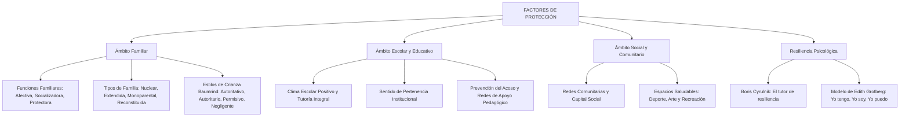

# TEMA 12: FACTORES DE PROTECCIÓN: FAMILIA, ESCUELA Y COMUNIDAD

---

## 1. PORTADA Y FICHA TÉCNICA

```
========================================================================================
CURSO: PSICOLOGÍA PREUNIVERSITARIA
EJE: 05 - PERSONA Y FAMILIA
TEMA: 12 - FACTORES DE PROTECCIÓN (FAMILIA, ESTILOS DE CRIANZA, ESCUELA Y RESILIENCIA)
NIVEL: PREUNIVERSITARIO AVANZADO (UNSA - UNMSM - UNI)
DURACIÓN ESTIMADA: 3 HORAS ACADÉMICAS
SISTEMA DE EVALUACIÓN: DESTREZAS COGNITIVAS (DECO), DINÁMICA FAMILIAR Y FACTORES PROTECTORES
========================================================================================
```

---

## 2. MAPA CONCEPTUAL SINTÉTICO (MERMAID)



---

## 3. MARCO TEÓRICO EXHAUSTIVO

### 3.1. Definición y Enfoque de Factores de Protección
- **Factor de Protección:** Toda condición biológica, psicológica, familiar, escolar o comunitaria que reduce, neutraliza o amortigua la probabilidad de ocurrencia de conductas de riesgo (drogadicción, delincuencia, deserción escolar, suicidio) y potencia el desarrollo saludable, la adaptación psicosocial y la **resiliencia**.
- **La Familia como Núcleo Primario de Protección:**
  - Institución humana y grupo social primario unido por lazos de consanguinidad, afinidad o adopción, fundamental para el desarrollo socioemocional del ser humano.
  - **Funciones de la Familia:**
    1. **Biológica o Reproductora:** Asegura la continuidad biológica de la especie mediante la procreación.
    2. **Afectiva o Emocional:** Brinda amor incondicional, apego seguro, contención psicológica y seguridad emocional básica.
    3. **Socializadora:** Transmite valores, normas éticas, lenguaje, pautas culturales e identidad social inicial.
    4. **Protectora y de Cuidado:** Garantiza resguardo físico, alimentación, salud, vestimenta y amparo ante peligros.
    5. **Económica:** Satisface las necesidades materiales básicas mediante el trabajo cooperativo de sus miembros.
    6. **Recreativa:** Fomenta el descanso, el juego, la distensión compartida y el fortalecimiento de los vínculos afectivos.

### 3.2. Tipología Familiar Contemporánea
1. **Familia Nuclear:** Formada por el padre, la madre y los hijos (biológicos o adoptivos) conviviendo bajo el mismo techo.
2. **Familia Extendida o Amplia:** Integrada por la familia nuclear más otros parientes consanguíneos de diversas generaciones (abuelos, tíos, primos) que comparten la misma vivienda.
3. **Familia Monoparental:** Conformada por uno solo de los progenitores (padre o madre) a cargo exclusivo de los hijos, debido a divorcio, separación, viudez o maternidad soltera.
4. **Familia Reconstituida, Ensamblada o Compuesta:** Formada por una pareja donde uno o ambos miembros tienen hijos de uniones sentimentales anteriores, incorporando a menudo medios hermanos.
5. **Familia Homoparental:** Integrada por una pareja de dos hombres o dos mujeres a cargo de la crianza de hijos.

---

## 4. LEYES, ECUACIONES Y MODELOS MATEMÁTICOS

### 4.1. Estilos de Crianza Parental (Diana Baumrind / Maccoby y Martin)
El modelo clasifica las pautas de crianza cruzando dos dimensiones ortogonales: **Afecto / Comunicación / Apoyo** (calidez afectiva) y **Exigencia / Control / Demandas** (límites normativos):

```
                       EXIGENCIA Y CONTROL
                             (Alto)
                                │
        AUTORITARIO             │          AUTORITATIVO (DEMOCRÁTICO)
   Alto control / Bajo afecto   │         Alto control / Alto afecto
   - Punición, frialdad         │         - Diálogo, límites claros
   - Hijos sumisos o rebeldes   │         - Hijos asertivos y seguros
────────────────────────────────┼──────────────────────────────── AFECTO Y APOYO
                                │                                 (Alto)
        NEGLIGENTE              │          PERMISIVO (INDULGENTE)
   Bajo control / Bajo afecto   │         Bajo control / Alto afecto
   - Abandono, indiferencia     │         - Cero límites, sobreprotección
   - Hijos con fallas morales   │         - Hijos tiranos, baja frustración
                                │
                             (Bajo)
```

| Estilo de Crianza | Control / Exigencia | Afecto / Comunicación | Consecuencias Psicológicas en los Hijos |
| :--- | :---: | :---: | :--- |
| **Autoritativo (Democrático)** | **ALTO** | **ALTO** | Alta autoestima, asertividad, autocontrol, alto rendimiento académico, empatía y resiliencia. |
| **Autoritario** | **ALTO** | **BAJO** | Inseguridad, timidez extrema o rebeldía hostil, baja autoestima, obediencia por miedo a la sanción. |
| **Permisivo (Indulgente)** | **BAJO** | **ALTO** | Egocentrismo, intolerancia a la frustración, conductas caprichosas, dificultad para aceptar la autoridad. |
| **Negligente (Desapegado)** | **BAJO** | **BAJO** | Baja autoestima, impulsividad descontrolada, propensión a adicciones, conductas delictivas y abandono. |

### 4.2. Ámbito Escolar y Comunitario como Escudos Protectores
- **Clima Escolar Positivo:** Ambientes académicos caracterizados por el respeto mutuo, relaciones de confianza con los docentes, tutoría empática y prevención activa del acoso escolar (*bullying*).
- **Capital Social y Redes Comunitarias:** Vecindarios organizados con acceso a polideportivos públicos, bibliotecas, talleres culturales y organizaciones juveniles que canalizan el tiempo libre de los adolescentes alejándolos de pandillas.

### 4.3. Resiliencia Psicológica: El Modelo de Edith Grotberg
La resiliencia es la capacidad humana para enfrentar, sobreponerse, resistir e incluso salir transformado positivamente de situaciones adversas extremas (Boris Cyrulnik). Grotberg organiza las fuentes de la resiliencia en tres pilares verbales:
- **"YO TENGO" (Apoyos externos de confianza):** *"Tengo una familia que me apoya, personas que me quieren incondicionalmente, un colegio seguro y límites claros"*.
- **"YO SOY" (Fortalezas internas del individuo):** *"Soy una persona digna de aprecio, respetuosa, optimista, con valores morales y fe en mis metas"*.
- **"YO PUEDO" (Competencias y habilidades interpersonales):** *"Puedo buscar ayuda cuando la necesito, resolver problemas con calma, dialogar asertivamente y perseverar"*.

---

## 5. NEMOTECNIAS PREUNIVERSITARIAS

1. **Los 4 Estilos de Baumrind:**
   > **"D-A-P-N"** $\implies$ **D**emocrático (el ideal), **A**utoritario (el sargento), **P**ermisivo (el complaciente), **N**egligente (el ausente).
2. **Las 3 Voces de la Resiliencia de Grotberg:**
   > **"TENGO"** (Entorno exterior) $\to$ **"SOY"** (Identidad interior) $\to$ **"PUEDO"** (Capacidad de acción).
3. **El Padre de la Resiliencia:**
   > **Boris Cyrulnik** $\implies$ Sobreviviente del Holocausto y creador del concepto del *tutor de resiliencia*.

---

## 6. HACKING DE ADMISIÓN Y ERRORES TRAMPA FRECUENTES

- **Trampa 1 (Autoritario vs. Autoritativo):** En castellano suenan parecidos, pero son opuestos:
  - **Autoritario:** Es dictatorial, impone castigos severos sin diálogo, bajo en afecto.
  - **Autoritativo (Democrático):** Es el estilo óptimo, combina límites claros y firmes con profundo afecto y diálogo abierto.
- **Trampa 2 (Permisivo vs. Negligente):** El padre permisivo ama a su hijo, lo consiente y es afectuoso, pero no pone límites; el padre negligente no pone límites porque **no le importa su hijo** (abandono físico y emocional).
- **Trampa 3 (Familia Monoparental vs. Reconstituida):** Si una madre soltera vive sola con su hijo $\implies$ Monoparental. Si la madre se vuelve a casar con un nuevo esposo que aporta sus propios hijos $\implies$ Reconstituida (o ensamblada).

---

## 7. 5 PROBLEMAS RESUELTOS Y GRADUADOS

### Problema 1: Identificación de Funciones Familiares (Nivel Básico)
**Enunciado:** Cuando Andrés, de 16 años, llega a su casa angustiado tras haber reprobado un simulacro, su madre se sienta con él en la sala, lo abraza con ternura, escucha sus temores sin juzgarlo, valida su tristeza y le asegura que toda la familia confía en su capacidad para salir adelante. ¿Qué función primordial de la familia se evidencia en la actitud de la madre?
A) Función biológica o reproductora  
B) Función económica  
C) Función afectiva o de contención emocional  
D) Función recreativa  
E) Función jurídica  

**Solución paso a paso:**
1. La madre proporciona contención, comprensión, apoyo incondicional y seguridad psíquica ante una situación de angustia.
2. Esta labor corresponde directamente a la **Función Afectiva o Emocional** de la familia.

**Respuesta:** C) Función afectiva o de contención emocional.

---

### Problema 2: Clasificación de Tipologías Familiares (Nivel Intermedio)
**Enunciado:** Tras su divorcio, Carmen se casó con Roberto, quien es viudo y tiene dos hijos pequeños. Actualmente, viven juntos en una casa en Yanahuara junto con la hija adolescente del primer matrimonio de Carmen y un bebé recién nacido fruto de la nueva unión. ¿A qué tipo de familia corresponde este hogar?
A) Familia nuclear clásica  
B) Familia extendida  
C) Familia reconstituida o ensamblada  
D) Familia monoparental estricta  
E) Familia comunitaria  

**Solución paso a paso:**
1. El hogar está conformado por una nueva pareja que integra a hijos de relaciones afectivas anteriores de ambos, además de hijos en común.
2. Esta estructura define con precisión a la **Familia Reconstituida, Ensamblada o Compuesta**.

**Respuesta:** C) Familia reconstituida o ensamblada.

---

### Problema 3: Estilos de Crianza Parental de Baumrind (Nivel Intermedio-Avanzado)
**Enunciado:** Los padres de Felipe establecen normas y horarios claros para el estudio y el uso de videojuegos en casa. Cuando Felipe desobedece y sale sin permiso, sus padres se sientan con él a dialogar con serenidad, le explican las consecuencias y el riesgo de su falta, le aplican una sanción proporcional previamente acordada (dos días sin consola) y reiteran su confianza y cariño en él, escuchando sus argumentos. De acuerdo con el modelo de Diana Baumrind, ¿qué estilo de crianza ejercen los padres de Felipe?
A) Estilo autoritario  
B) Estilo permisivo  
C) Estilo negligente  
D) Estilo autoritativo (democrático)  
E) Estilo sobreprotector  

**Solución paso a paso:**
1. Los padres combinan una alta exigencia y firmeza normativa (límites claros y consecuencias acordadas) con un alto nivel de afecto, diálogo reflexivo y empatía comunicativa.
2. Esta integración equilibrada define al **Estilo Autoritativo o Democrático**.

**Respuesta:** D) Estilo autoritativo (democrático).

---

### Problema 4: Fuentes de Resiliencia de Edith Grotberg en Casos DECO (Nivel Avanzado)
**Enunciado:** Milagros creció en un asentamiento humano en extrema pobreza con una madre que padecía una enfermedad crónica. A pesar de los obstáculos, logró el primer puesto en su colegio y una beca integral universitaria. Al ser entrevistada, afirma con convicción: *"Pude salir adelante porque tengo profesores maravillosos que creyeron en mí y una abuela que nunca me dejó caer (1); además, soy una persona perseverante, orgullosa de mis raíces y con profunda fe (2); y sé que puedo pedir apoyo cuando no entiendo un tema y esforzarme hasta encontrar soluciones (3)"*. Las expresiones (1), (2) y (3) corresponden en el modelo de resiliencia de Edith Grotberg a:
A) "Yo puedo", "Yo soy", "Yo tengo"  
B) "Yo tengo", "Yo soy", "Yo puedo"  
C) "Yo soy", "Yo tengo", "Yo puedo"  
D) "Yo tengo", "Yo puedo", "Yo soy"  
E) "Yo puedo", "Yo tengo", "Yo soy"  

**Solución paso a paso:**
1. Expresión (1): Hace referencia a las redes de apoyo externas y relaciones de confianza del entorno $\implies$ **"Yo tengo"**.
2. Expresión (2): Hace referencia a los rasgos de identidad interior, valores y fortalezas intrapsíquicas $\implies$ **"Yo soy"**.
3. Expresión (3): Hace referencia a las habilidades interpersonales y capacidades de afrontamiento práctico $\implies$ **"Yo puedo"**.

**Respuesta:** B) "Yo tengo", "Yo soy", "Yo puedo".

---

### Problema 5: Factores de Protección vs. Riesgo y Tutor de Resiliencia (Boss Challenge)
**Enunciado:** Kevin perdió a sus padres a los 13 años a causa de un accidente de tránsito y cayó en un estado de profunda depresión y deserción escolar en un barrio con alta presencia de pandillas. Sin embargo, su profesor de educación física del colegio público notó su sufrimiento, lo invitó a integrarse a la selección de atletismo, se convirtió en una figura de apego seguro incondicional que lo orientaba en sus estudios y le enseñó a canalizar su dolor en la disciplina deportiva. Diez años después, Kevin es licenciado en Educación Física y líder de un programa comunitario juvenil. Desde la teoría de la resiliencia de Boris Cyrulnik, el docente desempeñó el papel de:
A) Agente de condicionamiento operante por moldeamiento motor.  
B) Tutor de resiliencia, actuando como escudo protector que tejió un nuevo apego resiliente.  
C) Instigador de formación reactiva sublimada.  
D) Mediador en la zona de desarrollo real exclusivamente.  
E) Factor de riesgo secundario involuntario.  

**Solución paso a paso:**
1. Boris Cyrulnik (neuropsiquiatra francés) postula el concepto de **"Tutor de Resiliencia"**: una figura significativa (familiar, docente, entrenador o vecino) que brinda una mirada empática incondicional y un vínculo de apego seguro a un niño o adolescente traumatizado.
2. El tutor de resiliencia no borra la herida del trauma, pero permite al sujeto resignificar su dolor y reconstruir un proyecto de vida triunfador sobre la adversidad.

**Respuesta:** B) Tutor de resiliencia, actuando como escudo protector que tejió un nuevo apego resiliente.

---

## 8. 5 PROBLEMAS PROPUESTOS

1. ¿Cómo se denomina el estilo de crianza caracterizado por un alto nivel de exigencia y control punitivo combinado con una casi nula calidez afectiva y ausencia de diálogo?
   - *Pista:* Padre severo e intransigente.
   - *Clave:* Estilo autoritario.

2. ¿Qué función familiar se encarga de la transmisión de la lengua materna, las costumbres, las reglas de convivencia y la escala axiológica de valores a los nuevos miembros?
   - *Pista:* Proceso de integración social.
   - *Clave:* Función socializadora.

3. En el modelo de resiliencia de Edith Grotberg, ¿a qué categoría corresponde la convicción interna de una persona que afirma: *"Soy digno de respeto, responsable y compasivo"*?
   - *Pista:* Cualidad del ser interior.
   - *Clave:* "Yo soy".

4. ¿Qué tipo de familia está constituida cuando un padre viudo vive en el mismo hogar exclusivamente junto a sus dos hijas menores de edad?
   - *Pista:* Presencia de un solo progenitor.
   - *Clave:* Familia monoparental.

5. ¿Qué neuropsiquiatra y autor de *Los patitos feos* desarrolló profundamente el concepto de resiliencia y el papel del "tutor de resiliencia" en el desarrollo infantil?
   - *Pista:* Psiquiatra francés de origen judío.
   - *Clave:* Boris Cyrulnik.

---

## 9. GLOSARIO TÉCNICO ESPECIALIZADO

1. **Factor de Protección:** Recurso individual, relacional o ambiental que neutraliza el impacto negativo de situaciones de estrés o vulnerabilidad biopsicosocial.
2. **Resiliencia:** Capacidad dinámica de un sujeto o comunidad para sobreponerse con éxito a traumas, duelos o adversidades severas.
3. **Estilo Autoritativo (Democrático):** Pauta de crianza que equilibra límites disciplinarios firmes con calidez afectiva, apoyo y comunicación bidireccional.
4. **Familia Monoparental:** Estructura familiar integrada por un solo progenitor a cargo de uno o más hijos dependientes.
5. **Familia Reconstituida:** Hogar formado por una nueva unión de pareja donde al menos uno de los cónyuges convive con hijos de relaciones previas.
6. **Apego Seguro:** Vínculo afectivo primario estable y confiado que brinda seguridad al infante para explorar el mundo y regular sus emociones (John Bowlby).
7. **Tutor de Resiliencia:** Persona significativa que acoge empáticamente al sujeto traumatizado y actúa como punto de apoyo para reconstruir su identidad (Cyrulnik).
8. **Capital Social:** Red de relaciones de confianza, cooperación y reciprocidad comunitaria que fortalece la seguridad y el bienestar de sus integrantes.
9. **Clima Escolar:** Calidad y carácter de la vida institucional en la escuela, basada en la equidad, el respeto y la prevención de la violencia.
10. **Límites Parentales:** Reglas y fronteras normativas claras establecidas por los progenitores que orientan la conducta y brindan estructura psicológica a los hijos.

---

## 10. FLASHCARDS DE REPASO RÁPIDO

- **P: ¿Cuál es el estilo de crianza óptimo según Diana Baumrind y por qué?**
  *R: El estilo Autoritativo (o Democrático), porque combina alta exigencia y límites normativos claros con alta calidez afectiva y comunicación abierta.*
- **P: ¿En qué se diferencia una familia nuclear de una familia extendida?**
  *R: La nuclear solo incluye a padres e hijos; la extendida incluye a otros parientes consanguíneos de varias generaciones (abuelos, tíos, primos) bajo el mismo techo.*
- **P: ¿Qué son los tres pilares de la resiliencia según Edith Grotberg?**
  *R: "Yo tengo" (apoyos del entorno), "Yo soy" (fuerza y valores interiores) y "Yo puedo" (habilidades prácticas de acción).*
- **P: ¿Qué es un "tutor de resiliencia" según Boris Cyrulnik?**
  *R: Una persona del entorno que proporciona un apego seguro y una mirada afectiva incondicional que rescata al sujeto de la desesperanza tras un trauma.*
- **P: ¿Qué caracteriza al estilo de crianza permisivo?**
  *R: Mucho afecto y consentimiento, pero ausencia casi total de control, límites y disciplina.*

---

## 11. CONEXIONES INTERDISCIPLINARIAS Y APLICACIÓN REAL

- **Salud Pública y Prevención:** El modelo de factores de protección guía los programas del Estado (como Barrio Seguro o DEVIDA en Perú) para prevenir el consumo de drogas y el pandillaje mediante polideportivos y talleres artísticos en zonas marginales.
- **Sociología Urbana:** Las investigaciones demuestran que vecindarios con alta cohesión social comunitaria y vigilancia vecinal solidaria registran tasas de criminalidad un $60\%$ menores que zonas con igual nivel de pobreza pero atomizadas e individualistas.
- **Pedagogía Restaurativa:** Las escuelas que implementan mediación pacífica de conflictos y tutoría afectiva logran erradicar el acoso escolar sin recurrir a suspensiones punitivas ineficaces.

---

## 12. BLOQUE DE GAMIFICACIÓN KMP (JSON)

```json
{
  "curso": "Psicologia",
  "tema": "Factores_de_Proteccion",
  "xp_recompensa": 200,
  "insignia": "Escudo_de_la_Familia_y_la_Resiliencia",
  "desafios": [
    {
      "id": "PROT_01",
      "tipo": "opcion_multiple",
      "pregunta": "¿Qué consecuencias conductuales se observan típicamente en hijos criados bajo un estilo PERMISIVO (alto afecto, cero límites)?",
      "opciones": [
        "Baja tolerancia a la frustración, egocentrismo y dificultades para acatar normas",
        "Alta asertividad, empatía y rendimiento académico superior",
        "Extrema timidez, miedo al castigo y obediencia pasiva",
        "Apatía total y desapego afectivo absoluto"
      ],
      "respuesta_correcta": 0,
      "explicacion": "El estilo permisivo consiente sin poner límites, forjando niños que no toleran el 'no' y presentan conductas caprichosas."
    },
    {
      "id": "PROT_02",
      "tipo": "opcion_multiple",
      "pregunta": "Una familia integrada por una madre divorciada y su hijo de diez años que conviven solos conforma una familia de tipo:",
      "opciones": [
        "Monoparental",
        "Extendida",
        "Reconstituida",
        "Nuclear"
      ],
      "respuesta_correcta": 0,
      "explicacion": "La presencia de un solo progenitor a cargo exclusivo de los hijos define a la familia monoparental."
    },
    {
      "id": "PROT_03",
      "tipo": "completar",
      "pregunta": "El autor y neuropsiquiatra que popularizó el concepto del 'tutor de resiliencia' se llama Boris:",
      "respuesta_correcta": "Cyrulnik",
      "explicacion": "Boris Cyrulnik es el referente mundial en resiliencia infantil."
    }
  ]
}
```
