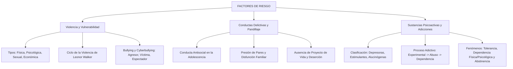

# TEMA 13: FACTORES DE RIESGO: VIOLENCIA, CONDUCTA ANTISOCIAL Y ADICCIONES

---

## 1. PORTADA Y FICHA TÉCNICA

```
========================================================================================
CURSO: PSICOLOGÍA PREUNIVERSITARIA
EJE: 05 - PERSONA Y FAMILIA
TEMA: 13 - FACTORES DE RIESGO (VIOLENCIA, BULLYING, PANDILLAJE Y SUSTANCIAS PSICOACTIVAS)
NIVEL: PREUNIVERSITARIO AVANZADO (UNSA - UNMSM - UNI)
DURACIÓN ESTIMADA: 4 HORAS ACADÉMICAS
SISTEMA DE EVALUACIÓN: DESTREZAS COGNITIVAS (DECO), PSICOPATOLOGÍA SOCIAL Y PREVENCIÓN
========================================================================================
```

---

## 2. MAPA CONCEPTUAL SINTÉTICO (MERMAID)



---

## 3. MARCO TEÓRICO EXHAUSTIVO

### 3.1. Concepto y Enfoque de Riesgo Psicosocial
- **Factor de Riesgo:** Toda variable, circunstancia biológica, psicológica, conductual o ambiental cuya presencia incrementa estadísticamente la probabilidad de que un individuo o grupo sufra un daño físico o psicológico, desarrolle un trastorno mental o incurra en conductas autodestructivas o transgresoras de la ley.
- **Vulnerabilidad vs. Riesgo:** La vulnerabilidad es la susceptibilidad intrínseca del sujeto (baja autoestima, impulsividad, predisposición genética); el factor de riesgo es la condición precipitante del entorno (disponibilidad de drogas, violencia doméstica, exclusión social).

### 3.2. Manifestaciones de la Violencia
Uso intencional de la fuerza o el poder físico, de hecho o como amenaza, contra uno mismo, otra persona o un grupo, que cause o tenga muchas probabilidades de causar lesiones, muerte, daño psicológico, trastornos del desarrollo o privaciones (OMS).
1. **Tipologías de la Violencia:**
   - **Física:** Toda acción deliberada que causa daño, dolor o lesión corporal (golpes, empujones, quemaduras).
   - **Psicológica o Emocional:** Conductas orientadas a denigrar, humillar, intimidar, amenazar, aislar o controlar a una persona mediante insultos, descalificaciones, silencios punitivos o celopatía.
   - **Sexual:** Todo acto o tentativa sexual no consentida, tocamientos indebidos, acoso, explotación o imposición mediante coacción, amenaza o abuso de poder.
   - **Económica o Patrimonial:** Control abusivo o privación intencional de recursos económicos, retención de documentos de identidad, bienes o manutención básica para someter a la víctima.

2. **Ciclo de la Violencia Intrafamiliar (Leonor Walker):**
   Explica por qué las víctimas permanecen atrapadas en relaciones de pareja abusivas:
   - **Fase 1: Acumulación de Tensión:** Crecimiento gradual de hostilidad, irritabilidad, reproches y microagresiones verbales. La víctima intenta calmar al agresor y se culpa a sí misma.
   - **Fase 2: Explosión o Descarga Agresiva:** Pérdida absoluta de control del agresor; ocurre el episodio de violencia física, verbal o sexual grave.
   - **Fase 3: Luna de Miel o Reconciliación:** El agresor pide perdón con aparente arrepentimiento sincero, jura que nunca volverá a ocurrir, hace regalos y muestra gran afecto, reforzando la dependencia emocional de la víctima. El ciclo se repite con intervalos cada vez más cortos y mayor letalidad.

3. **Acoso Escolar (*Bullying*) y Acoso Cibernético (*Cyberbullying*):**
   - Conducta de persecución física o psicológica deliberada y repetida en el tiempo que un estudiante o grupo ejerce contra otro más débil, mediada por un **desequilibrio de poder**.
   - **Triángulo del Bullying:**
     - *Agresor:* Personalidad dominante, baja empatía, necesidad de control, agresividad reactiva.
     - *Víctima:* Vulnerable, tímida, con baja autoestima o con alguna característica diferencial visible.
     - *Espectadores (*Bystanders*):* Quienes presencian el acoso; su silencio, risa o indiferencia legitima y perpetúa la agresión.
   - *Cyberbullying:* Hostigamiento sistemático mediante redes sociales, mensajería instantánea o videojuegos en línea; se caracteriza por su alcance masivo, permanencia digital (huella digital) y la sensación de impunidad por el anonimato virtual.

---

## 4. LEYES, ECUACIONES Y MODELOS MATEMÁTICOS

### 4.1. Conductas Delictivas y Factores Asociados
- **Conducta Antisocial y Delincuencia Juvenil:** Trasgresión deliberada de las normas sociales y las leyes penales vigentes (robos, agresiones armadas, extorsión, homicidios).
- **Determinantes Psicosociales:**
  - Deserción escolar temprana y analfabetismo funcional.
  - Crianza bajo estilos negligentes o violencia parental severa.
  - Ausencia de un proyecto de vida estructurado y vacío existencial.
  - **Presión de Pares en Pandillas:** La pandilla juvenil opera como una "familia sustituta" distorsionada que brinda falso sentido de pertenencia, respeto y protección a cambio de la comisión de delitos.

### 4.2. Sustancias Psicoactivas (Drogas) y Neurobiología de la Adicción
Toda sustancia química de origen natural o sintético que, al ingresar al organismo por cualquier vía, altera el funcionamiento del sistema nervioso central (SNC), modificando la percepción, el estado de ánimo, la cognición y la conducta.

1. **Clasificación Farmacológica según sus Efectos en el SNC:**

| Categoría | Efecto en el Sistema Nervioso Central | Sustancias Principales | Consecuencias Clínicas |
| :--- | :--- | :--- | :--- |
| **Depresoras** | Disminuyen, atenúan o frenan la actividad del encéfalo; inducen relajación, sedación y torpeza motora. | **Alcohol etílico**, benzodiacepinas (ansiolíticos), barbitúricos, opiáceos (morfina, heroína). | Lentitud de reflejos, descoordinación, coma y paro respiratorio por sobredosis. |
| **Estimulantes** | Aceleran y sobreexcitan la actividad neuronal; aumentan el estado de vigilia, la energía y la frecuencia cardíaca. | **Cocaína**, pasta básica de cocaína (PBC), anfetaminas, metanfetamina, **nicotina**, cafeína. | Taquicardia, paranoia, psicosis cocaínica, infarto de miocardio, hipertermia. |
| **Alucinógenas (Perturbadoras)** | Distorsionan profundamente la percepción sensorial, el pensamiento y el sentido del tiempo y espacio; causan alucinaciones. | **LSD**, psilocibina (hongos), mezcalina (San Pedro/peyote), **marihuana (THC a dosis altas)**, éxtasis (MDMA). | Despersonalización, ataques de pánico (*mal viaje*), brotes psicóticos duraderos. |

2. **Fases del Proceso Adictivo:**
   $$\text{Fase Experimental} \longrightarrow \text{Uso Social / Recreativo} \longrightarrow \text{Uso Habitual / Abuso} \longrightarrow \text{Dependencia (Adicción)}$$
3. **Conceptos Clave de la Farmacodependencia:**
   - **Tolerancia Neuroquímica:** Necesidad adaptativa del cerebro de consumir dosis progresivamente mayores de la sustancia para experimentar el mismo efecto psicoactivo inicial (debido a la desensibilización o reducción de receptores en el circuito de recompensa dopaminérgico).
   - **Dependencia Física:** Adaptación fisiológica del organismo a la presencia continua de la droga, de tal modo que su supresión súbita desencadena graves alteraciones corporales.
   - **Dependencia Psicológica:** Compulsión, anhelo obsesivo (*craving*) y necesidad subjetiva irrefrenable de consumir la droga para experimentar placer o aliviar el malestar emocional.
   - **Síndrome de Abstinencia:** Conjunto agudo y doloroso de síntomas físicos y psicológicos angustiantes (temblores, sudoración, vómitos, convulsiones, taquicardia, pánico) que se desata cuando un individuo dependiente interrumpe bruscamente el consumo.

---

## 5. NEMOTECNIAS PREUNIVERSITARIAS

1. **Las 3 Fases del Ciclo de la Violencia:**
   > **"T-E-L"** $\implies$ **T**ensión acumulada $\to$ **E**xplosión agresiva $\to$ **L**una de miel.
2. **Las 3 Familias de Drogas:**
   > **"D-E-A"** $\implies$ **D**epresoras (bajan), **E**stimulantes (suben), **A**lucinógenas (distorsionan).
3. **Alcohol y Tabaco:**
   > El alcohol es el rey de las **depresoras**; el tabaco (nicotina) y la cocaína son **estimulantes**.

---

## 6. HACKING DE ADMISIÓN Y ERRORES TRAMPA FRECUENTES

- **Trampa 1 (¿El alcohol es estimulante o depresor?):** ¡La clásica trampa de admisión! La gente cree vulgarmente que el alcohol es "estimulante" porque al inicio desinhibe y vuelve conversadora a la persona. Científicamente, **el alcohol es un DEPRESOR del SNC**: lo primero que deprime e inhibe es la corteza prefrontal (el centro del autocontrol moral y la vergüenza), liberando conductas impulsivas; a dosis mayores deprime los centros motores y el tronco encefálico.
- **Trampa 2 (Tolerancia vs. Abstinencia):**
  - **Tolerancia:** Necesitar *MÁS* dosis para sentir lo mismo.
  - **Abstinencia:** Sufrir *DOLOR* y pánico cuando falta la dosis.
- **Trampa 3 (El espectador en el Bullying):** En preguntas DECO de acoso escolar, el rol del **espectador indiferente o cómplice pasivo** suele ser la clave: no agredir directamente no exime de responsabilidad, pues el silencio refuerza el poder del agresor.

---

## 7. 5 PROBLEMAS RESUELTOS Y GRADUADOS

### Problema 1: Ciclo de la Violencia de Leonor Walker (Nivel Básico)
**Enunciado:** Tras golpear violentamente a su pareja causándole hematomas en el rostro, Alberto cae de rodillas llorando, le pide perdón desesperadamente, le lleva un ramo de rosas y le jura por sus hijos que *"cambiará para siempre y jamás volverá a tocarla"*. Conmovida por sus palabras y creyendo en su arrepentimiento, la víctima retira la denuncia policial. ¿En qué fase del ciclo de la violencia de Leonor Walker se encuentra esta pareja?
A) Fase de acumulación de tensión  
B) Fase de explosión o agresión  
C) Fase de luna de miel o reconciliación  
D) Fase de resolución asertiva  
E) Fase de violencia vicaria  

**Solución paso a paso:**
1. El agresor manifiesta un arrepentimiento aparente, pide perdón con muestras afectivas exageradas y promete no reincidir para restablecer el vínculo y evitar consecuencias legales.
2. Esta conducta define con absoluta precisión la **Fase de Luna de Miel o Reconciliación**, etapa que precede a un nuevo ciclo de acumulación de tensión.

**Respuesta:** C) Fase de luna de miel o reconciliación.

---

### Problema 2: Clasificación Farmacológica de Sustancias (Nivel Intermedio)
**Enunciado:** Un paciente ingresa a la sala de emergencias de un hospital con pupilas puntiformes (miosis extrema), respiración lenta y superficial (bradipnea severa de 6 respiraciones por minuto), bradicardia e inconsciencia total tras consumir una sustancia ilícita. Por sus efectos de sedación extrema y colapso del sistema respiratorio, la sustancia causante de la intoxicación pertenece a la categoría de:
A) Estimulantes del sistema nervioso  
B) Alucinógenos sintéticos puros  
C) Drogas depresoras del sistema nervioso central (opiáceos)  
D) Fármacos nootrópicos  
E) Vitaminas liposolubles  

**Solución paso a paso:**
1. La sustancia causó depresión profunda de los centros vitales del tronco encefálico (respiración y frecuencia cardíaca lenta, sedación y coma).
2. Estas manifestaciones clínicas corresponden a una intoxicación aguda por **sustancias depresoras**, específicamente sobredosis por **opiáceos** (como morfina o heroína).

**Respuesta:** C) Drogas depresoras del sistema nervioso central (opiáceos).

---

### Problema 3: Neurobiología de la Adicción (Nivel Intermedio-Avanzado)
**Enunciado:** Diego comenzó fumando un cigarrillo al día durante las reuniones sociales. Con el paso de los meses, para experimentar la misma sensación de relajación y placer que sentía al inicio, necesita consumir una cajetilla completa de veinte cigarrillos diarios. Asimismo, si pasa más de cuatro horas sin fumar, experimenta irritabilidad insoportable, temblores en las manos, taquicardia y una intensa ansiedad. En el cuadro de Diego se evidencian claramente los fenómenos farmacológicos de:
A) Sensibilización motora y alucinación refleja.  
B) Tolerancia y síndrome de abstinencia.  
C) Resiliencia física y dependencia cultural.  
D) Intoxicación paradójica y amnesia retrógrada.  
E) Neuroticismo primario y catarsis.  

**Solución paso a paso:**
1. El hecho de requerir una cantidad progresivamente mayor (de 1 a 20 cigarrillos) para sentir el mismo efecto placentero inicial define la **Tolerancia**.
2. El surgimiento de síntomas físicos y psicológicos desagradables (temblor, irritabilidad, taquicardia, angustia) al interrumpir o demorar el consumo define el **Síndrome de Abstinencia**.

**Respuesta:** B) Tolerancia y síndrome de abstinencia.

---

### Problema 4: Dinámica del Bullying y Enfoque DECO (Nivel Avanzado)
**Enunciado:** En un colegio secundario de Arequipa, un grupo de cuatro estudiantes toma fotos a escondidas a un compañero con sobrepeso en los baños, crea una página falsa de Instagram con apodos denigrantes y comparte memes burlones sobre su aspecto físico. Cerca de cuarenta compañeros de clase dan "me gusta" a las publicaciones y comentan con risas, mientras que ninguno se atreve a denunciar la página por temor a convertirse en el nuevo blanco de burlas. Este caso ilustra:
A) Un conflicto motivacional de atracción-atracción.  
B) Un episodio de cyberbullying donde la complicidad activa y el silencio de los espectadores refuerzan y perpetúan el acoso.  
C) Un juego social adaptativo propio de la etapa de moratoria de James Marcia.  
D) Una manifestación de la función socializadora de la familia.  
E) Violencia económica patrimonial sin repercusión psicológica.  

**Solución paso a paso:**
1. Se utiliza la tecnología digital e internet para hostigar, humillar y difamar de manera continua a una víctima vulnerable: **Cyberbullying**.
2. Los compañeros que se ríen, comparten o callan por temor asumen el rol de **espectadores cómplices**, legitimando el poder abusivo de los agresores y desprotegiendo a la víctima.

**Respuesta:** B) Un episodio de cyberbullying donde la complicidad activa y el silencio de los espectadores refuerzan y perpetúan el acoso.

---

### Problema 5: Intervención Multidimensional ante Factores de Riesgo (Boss Challenge)
**Enunciado:** Un programa de prevención de la delincuencia juvenil en zonas periurbanas de alta criminalidad diseña una estrategia comunitaria. En lugar de limitarse a patrullajes policiales punitivos, implementan:
1. Escuelas de padres para capacitar en estilos de crianza democráticos y comunicación asertiva.
2. Talleres de tutoría vocacional y becas para asegurar la culminación de la secundaria.
3. Creación de escuelas deportivas y talleres de música urbana en polideportivos barriales.
Desde la psicología comunitaria y la epidemiología social, la efectividad superior de este programa se debe a que:
A) Sustituye el castigo negativo por el condicionamiento clásico aversivo.  
B) Reduce la vulnerabilidad psicosocial fortaleciendo factores de protección en los tres microentornos fundamentales: la familia, la escuela y la comunidad.  
C) Aplica la introspección experimental de Wundt a nivel masivo.  
D) Elimina la necesidad biológica de pertenencia social en los adolescentes.  
E) Fomenta la difusión de identidad según Erikson.  

**Solución paso a paso:**
1. Los factores de riesgo de la violencia y la delincuencia juvenil no son individuales aislados, sino ecológicos y sistémicos (modelo ecológico de Bronfenbrenner).
2. Intervenir simultáneamente en la **Familia** (crianza democrática), la **Escuela** (retención escolar y proyecto de vida) y la **Comunidad** (deporte, arte y cohesión) crea una red sólida de **factores de protección** que neutralizan el riesgo y activan la resiliencia comunitaria.

**Respuesta:** B) Reduce la vulnerabilidad psicosocial fortaleciendo factores de protección en los tres microentornos fundamentales: la familia, la escuela y la comunidad.

---

## 8. 5 PROBLEMAS PROPUESTOS

1. ¿Qué psicóloga norteamericana formuló la teoría del "Ciclo de la Violencia" compuesta por las fases de tensión, agresión y reconciliación?
   - *Pista:* Autora de *The Battered Woman*.
   - *Clave:* Leonor Walker.

2. ¿Cuál es la categoría farmacológica de drogas a la que pertenecen la cocaína, la pasta básica de cocaína y las anfetaminas, caracterizadas por acelerar el sistema nervioso central?
   - *Pista:* Drogas que activan y sobreexcitan.
   - *Clave:* Estimulantes.

3. ¿Cómo se denomina el fenómeno neurobiológico por el cual un consumidor necesita dosis cada vez mayores de droga para experimentar el mismo efecto psicoactivo inicial?
   - *Pista:* Adaptación celular del organismo.
   - *Clave:* Tolerancia.

4. En el acoso escolar (*bullying*), ¿qué rol asumen aquellos estudiantes que presencian las agresiones y callan o celebran los abusos por miedo o complicidad?
   - *Pista:* Quienes observan sin intervenir.
   - *Clave:* Espectadores (o *bystanders*).

5. ¿Qué tipo de violencia intrafamiliar se manifiesta cuando un progenitor o cónyuge retiene las tarjetas bancarias, prohíbe trabajar a su pareja o destruye intencionalmente sus herramientas de trabajo?
   - *Pista:* Violencia ligada a recursos materiales.
   - *Clave:* Violencia económica (o patrimonial).

---

## 9. GLOSARIO TÉCNICO ESPECIALIZADO

1. **Factor de Riesgo:** Condición o variable biológica, psicológica o social que incrementa la probabilidad de desarrollar problemas conductuales, físicos o de salud mental.
2. **Violencia Psicológica:** Agresión invisible dirigida a deteriorar la autoestima, estabilidad emocional y dignidad de una persona mediante humillaciones, amenazas y control.
3. **Ciclo de la Violencia:** Dinámica circular relacional de maltrato intrafamiliar caracterizada por la alternancia periódica de acumulación de tensión, agresión y luna de miel.
4. **Cyberbullying:** Acoso sistemático, intencional y reiterado realizado a través de plataformas digitales, redes sociales y medios telemáticos.
5. **Drogas Depresoras:** Sustancias químicas que desaceleran el funcionamiento del sistema nervioso central, induciendo sedación y relajación motora.
6. **Drogas Estimulantes:** Sustancias que excitan el sistema nervioso central, elevando el estado de vigilia, la frecuencia cardíaca y la actividad dopaminérgica.
7. **Tolerancia:** Disminución progresiva de la respuesta biológica a una droga que exige elevar la dosis para conseguir el efecto original.
8. **Síndrome de Abstinencia:** Reacción psicofisiológica aversiva y dolorosa desencadenada por la suspensión abrupta del consumo de una sustancia en un organismo farmacodependiente.
9. **Craving (Anhelo Compulsivo):** Deseo imperioso, obsesivo e incontrolable de consumir una sustancia psicoactiva.
10. **Deserción Escolar:** Abandono prematuro del sistema educativo formal, constituyendo uno de los factores de riesgo más graves para la marginalidad y la delincuencia.

---

## 10. FLASHCARDS DE REPASO RÁPIDO

- **P: ¿Cuáles son las tres fases del ciclo de la violencia de Leonor Walker?**
  *R: 1) Fase de acumulación de tensión; 2) Fase de explosión o agresión; 3) Fase de luna de miel o reconciliación.*
- **P: ¿Por qué el alcohol se clasifica científicamente como un depresor y no como un estimulante?**
  *R: Porque frena y deprime la actividad del sistema nervioso central; la desinhibición inicial ocurre porque deprime el área prefrontal encargada del autocontrol moral.*
- **P: ¿Qué es la tolerancia a una sustancia psicoactiva?**
  *R: La adaptación neuroquímica que exige dosis cada vez mayores para alcanzar el mismo efecto que antes se lograba con dosis menores.*
- **P: ¿Qué distingue al cyberbullying del bullying tradicional presencial?**
  *R: El cyberbullying se realiza a través de medios digitales, tiene potencial de difusión masiva viral, permanece en la red y se ampara en el anonimato virtual.*
- **P: ¿Qué es el síndrome de abstinencia?**
  *R: El conjunto de síntomas físicos y psicológicos angustiantes que padece un adicto cuando se interrumpe bruscamente el ingreso de la droga a su organismo.*

---

## 11. CONEXIONES INTERDISCIPLINARIAS Y APLICACIÓN REAL

- **Neurobiología de las Adicciones:** El consumo crónico de drogas secuestra el **circuito de recompensa mesolímbico** (área tegmental ventral $\to$ núcleo accumbens $\to$ corteza prefrontal), destruyendo la densidad de receptores dopaminérgicos $D_2$ y provocando anhedonia (incapacidad de disfrutar los placeres naturales de la vida).
- **Criminología y Políticas Públicas:** El enfoque de justicia restaurativa juvenil en el Perú busca la rehabilitación psicosocial de infractores mediante reparación del daño a la comunidad y deshabituación de drogas, superando el modelo penitenciario puramente carcelario.
- **Medicina Legal y Forense:** El peritaje psicológico forense evalúa el daño psíquico en víctimas de violencia intrafamiliar mediante la detección de estrés postraumático (TEPT), depresión reactiva y síndrome de indefensión aprendida.

---

## 12. BLOQUE DE GAMIFICACIÓN KMP (JSON)

```json
{
  "curso": "Psicologia",
  "tema": "Factores_de_Riesgo",
  "xp_recompensa": 220,
  "insignia": "Guardian_contra_las_Adicciones_y_la_Violencia",
  "desafios": [
    {
      "id": "RIE_01",
      "tipo": "opcion_multiple",
      "pregunta": "¿A qué familia farmacológica pertenece el alcohol etílico según sus efectos en el sistema nervioso central?",
      "opciones": [
        "Depresoras del sistema nervioso central",
        "Estimulantes mayores",
        "Alucinógenos disociativos",
        "Anfetaminas sintéticas"
      ],
      "respuesta_correcta": 0,
      "explicacion": "El alcohol es un potente depresor del sistema nervioso central que desinhibe inicialmente al frenar el control prefrontal y enlentece los reflejos."
    },
    {
      "id": "RIE_02",
      "tipo": "opcion_multiple",
      "pregunta": "La fase del ciclo de la violencia en la que el agresor pide perdón, promete cambiar y se muestra afectuoso se denomina:",
      "opciones": [
        "Luna de miel o reconciliación",
        "Acumulación de tensión",
        "Explosión agresiva",
        "Resolución pacífica"
      ],
      "respuesta_correcta": 0,
      "explicacion": "La fase de luna de miel refuerza el círculo de codependencia emocional de la víctima."
    },
    {
      "id": "RIE_03",
      "tipo": "completar",
      "pregunta": "El síndrome doloroso y angustiante provocado por la interrupción súbita del consumo en una persona adicta se denomina Síndrome de:",
      "respuesta_correcta": "Abstinencia",
      "explicacion": "El síndrome de abstinencia refleja la dependencia física instalada en el organismo."
    }
  ]
}
```
