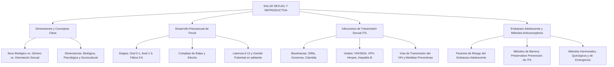

# TEMA 14: SALUD SEXUAL Y REPRODUCTIVA

---

## 1. PORTADA Y FICHA TÉCNICA

```
========================================================================================
CURSO: PSICOLOGÍA PREUNIVERSITARIA
EJE: 05 - PERSONA Y FAMILIA
TEMA: 14 - SALUD SEXUAL Y REPRODUCTIVA (SEXUALIDAD, ETAPAS PSICOSEXUALES, ITS Y PREVENCIÓN)
NIVEL: PREUNIVERSITARIO AVANZADO (UNSA - UNMSM - UNI)
DURACIÓN ESTIMADA: 4 HORAS ACADÉMICAS
SISTEMA DE EVALUACIÓN: DESTREZAS COGNITIVAS (DECO), SALUD INTEGRAL Y PREVENCIÓN DE RIESGOS
========================================================================================
```

---

## 2. MAPA CONCEPTUAL SINTÉTICO (MERMAID)



---

## 3. MARCO TEÓRICO EXHAUSTIVO

### 3.1. Dimensiones y Conceptos Clave de la Sexualidad Humana
La Organización Mundial de la Salud (OMS) define la sexualidad como un aspecto central del ser humano presente a lo largo de toda su vida, que abarca el sexo, las identidades y los papeles de género, el erotismo, el placer, la intimidad, la reproducción y la orientación sexual.
- **Conceptos Fundamentales:**
  1. **Sexo Biológico:** Conjunto de características genéticas (cromosomas $XX$ o $XY$), hormonales (estrógenos o andrógenos), anatómicas y fisiológicas que diferencian a machos, hembras o condiciones intersexuales.
  2. **Género:** Construcción social, histórica y cultural que asigna roles, comportamientos, vestimentas, expectativas y estereotipos asociados a lo "masculino" o lo "femenino" en una sociedad determinada.
  3. **Identidad de Género:** Vivencia interna, profunda e individual del género tal como cada persona la siente íntimamente, la cual puede o no corresponder con el sexo asignado al nacer (cisgénero, transgénero).
  4. **Orientación Sexual:** Atracción emocional, afectiva, romántica y sexual sostenida hacia personas de un género diferente (heterosexualidad), del mismo género (homosexualidad), de más de un género (bisexualidad) o hacia ningún género (asexualidad).
- **Dimensiones de la Sexualidad:**
  - **Biológica:** Anatomía genital, fisiología del placer, reproducción y respuesta sexual humana (Master y Johnson).
  - **Psicológica (Afectiva):** Autoestima corporal, sentimientos de amor, erotismo, apego, fantasías y vínculos de intimidad.
  - **Sociocultural y Ética:** Valores morales, normas jurídicas, religión, educación sexual integral y derechos reproductivos.

---

## 4. LEYES, ECUACIONES Y MODELOS MATEMÁTICOS

### 4.1. Teoría del Desarrollo Psicosexual de Sigmund Freud
Freud postuló que la personalidad se forja a través de cinco etapas donde la energía psicosexual (*líbido*) se concentra en distintas zonas erógenas del cuerpo:

| Etapa | Edad Aproximada | Zona Erógena | Conflicto / Hito Central | Fijación en la Adultez por Frustración o Exceso |
| :--- | :--- | :--- | :--- | :--- |
| **Oral** | $0 - 1.5\text{ años}$ | Boca, labios, lengua | Destete; placer por succión, mordisqueo y alimentación. | Tabaquismo, alcoholismo, comerse las uñas, dependencia pasiva u optimismo ingenuo. |
| **Anal** | $1.5 - 3\text{ años}$ | Ano, esfínteres | Control de esfínteres; placer por retención o expulsión de heces. | - *Retentiva:* Tacañería, obsesión por el orden y terquedad.<br>- *Expulsiva:* Desorden, rebeldía y suciedad. |
| **Fálica** | $3 - 6\text{ años}$ | Genitales externos | Descubrimiento de diferencias anatómicas; **Complejo de Edipo** (hijo hacia la madre) y **Complejo de Electra** (hija hacia el padre); angustia de castración e identificación con el progenitor del mismo sexo. | Problemas de identidad, vanidad narcisista, celos patológicos o timidez ante la autoridad. |
| **Latencia** | $6 - 12\text{ años}$ | Ninguna específica | La energía libidinosa se adormece o sublima en el aprendizaje escolar, deportes, socialización y amistades del mismo sexo. | No genera fijaciones patológicas directas; etapa de consolidación social. |
| **Genital** | Pubertad en adelante | Genitales maduros | Resurgimiento de la pulsión sexual adulta orientada hacia el placer compartido y la intimidad heterosexual u homosexual madura. | Culminación del desarrollo psicosexual maduro; capacidad de amar y trabajar (*Lieben und Arbeiten*). |

### 4.2. Infecciones de Transmisión Sexual (ITS)
Enfermedades infecciosas propagadas predominantemente por contacto sexual vaginal, anal u oral sin protección:
1. **ITS Bacterianas (Curables con antibióticos específicos):**
   - **Sífilis (*Treponema pallidum*):** Tres fases; en la primaria presenta chancro duro indoloro en genitales; en la secundaria erupciones cutáneas palmo-plantares; en la terciaria goma sifilítica, neurosífilis y demencia.
   - **Gonorrea (*Neisseria gonorrhoeae*):** En varones causa uretritis aguda con secreción purulenta amarillenta y dolor al orinar; en mujeres suele ser asintomática pero puede causar enfermedad inflamatoria pélvica (EIP) e infertilidad.
   - **Clamidia (*Chlamydia trachomatis*):** La más frecuente y sigilosa; causa secreción transparente e infertilidad tubárica.
2. **ITS Virales (No curables definitivamente, pero controlables):**
   - **VIH / SIDA (Virus de Inmunodeficiencia Humana):** Retrovirus que ataca y destruye los linfocitos $T\ CD4^+$, colapsando el sistema inmunitario.
     - *Vías comprobadas de transmisión:* Sexual (sin condón), sanguínea (transfusiones no tamizadas, jeringas compartidas) y vertical/perinatal (de madre a hijo en embarazo, parto o lactancia materna).
     - *No se transmite por:* Abrazos, besos, compartir platos, picaduras de mosquitos ni piscinas.
     - *Tratamiento:* Terapia Antirretroviral de Gran Actividad (TARGA) que reduce la carga viral a niveles **indetectables e intransmisibles ($I = I$)**.
   - **Virus del Papiloma Humano (VPH):** Provoca verrugas genitales (condilomas) y los serotipos de alto riesgo (16 y 18) causan el $70\%$ de los casos de **cáncer de cuello uterino** en mujeres. Se previene con la vacuna universal a niños y adolescentes y el Papanicolau periódico.
   - **Herpes Genital (VHS-2):** Vesículas dolorosas recurrentes en la mucosa genital que se ulceran.
   - **Hepatitis B (VHB):** Transmisión sexual y sanguínea; ataca el hígado provocando cirrosis y hepatocarcinoma. Prevenible por vacuna.

### 4.3. Embarazo Adolescente y Métodos Anticonceptivos
- **Riesgos del Embarazo Precoz:** Mayor riesgo de eclampsia, anemia materna, parto prematuro, deserción escolar, truncamiento del proyecto de vida y perpetuación de la pobreza intergeneracional.
- **Clasificación de Métodos Anticonceptivos:**
  1. **De Barrera:**
     - **Preservativo o Condón Masculino y Femenino:** **ÚNICO MÉTODO** que previene simultáneamente el embarazo no planificado y las Infecciones de Transmisión Sexual (incluyendo el VIH).
  2. **Hormonales (Solo previenen embarazo, no ITS):**
     - Píldoras orales combinadas, inyectables mensuales o trimestrales, implantes subdérmicos (Norplant/Jadelle) y parches transdérmicos. Inhiben la ovulación y espesan el moco cervical.
  3. **Dispositivos Intrauterinos (DIU):**
     - DIU de Cobre (espermicida mecánico) o DIU hormonal (Mirena). Alta eficacia a largo plazo ($5 - 10\text{ años}$).
  4. **Quirúrgicos o Definitivos (Irreversibles):**
     - Vasectomía en varones (sección y ligadura de los conductos deferentes; no altera la erección ni la eyaculación, solo elimina los espermatozoides del semen).
     - Ligadura de trompas de Falopio en mujeres (bloqueo de las trompas uterinas).
  5. **De Emergencia:**
     - Píldora del Día Siguiente (Levonorgestrel $1.5\text{ mg}$): Uso excepcional dentro de las primeras 72 horas tras el coito sin protección; retrasa la ovulación. **No es abortiva** ni debe usarse como método anticonceptivo regular.
  6. **Naturales (Baja eficacia, alta tasa de falla, no previenen ITS):**
     - Método del ritmo (Ogino-Knaus), moco cervical (Billings), temperatura basal y coito interrumpido (*coitus interruptus*).

---

## 5. NEMOTECNIAS PREUNIVERSITARIAS

1. **Etapas Psicosexuales de Freud:**
   > **"O-A-F-L-G"** $\implies$ **O**ral, **A**nal, **F**álica, **L**atencia, **G**enital.
2. **Las 3 Vías del VIH:**
   > **"S-S-V"** $\implies$ **S**exual (sin condón), **S**anguínea (agujas), **V**ertical (madre a hijo).
3. **El Único con Doble Escudo:**
   > **"El Condón es el Campeón"** $\implies$ Único que protege de Embarazo + ITS.

---

## 6. HACKING DE ADMISIÓN Y ERRORES TRAMPA FRECUENTES

- **Trampa 1 (¿El condón protege de todo?):** Es el método más seguro, pero no protege de infecciones que se transmiten por contacto de piel a piel en zonas no cubiertas (como el VPH o el herpes en la base del pubis o muslos). No obstante, para efectos de examen de admisión, **es el único método que previene ITS y embarazo a la vez**.
- **Trampa 2 (Vasectomía e Impotencia):** Un mito clásico. La vasectomía corta los conductos deferentes, impidiendo el paso de espermatozoides; el líquido seminal continúa eyaculándose normalmente (producido en próstata y vesículas seminales) y la testosterona viaja por la sangre, por lo que la erección, la libido y el placer son $100\%$ idénticos.
- **Trampa 3 (VIH vs. SIDA):** No es lo mismo:
  - **VIH:** Es el virus (se puede ser portador asintomático seropositivo durante años).
  - **SIDA:** Es la etapa terminal avanzada de la infección cuando las defensas ($CD4^+ < 200/\mu\text{L}$) colapsan y aparecen enfermedades oportunistas (tuberculosis, sarcoma de Kaposi).

---

## 7. 5 PROBLEMAS RESUELTOS Y GRADUADOS

### Problema 1: Etapas Psicosexuales de Freud en Casos Clínicos (Nivel Básico)
**Enunciado:** Un niño de 4 años manifiesta un excesivo apego hacia su madre, se molesta y llora si ve a sus padres abrazarse, y le dice a su papá: *"Cuando sea grande me voy a casar con mi mamá y tú te irás de la casa"*. Según la teoría psicosexual de Sigmund Freud, el niño se encuentra atravesando:
A) La etapa anal expulsiva  
B) La etapa fálica y el Complejo de Edipo  
C) El periodo de latencia escolar  
D) La etapa oral canibalesca  
E) La etapa genital madura  

**Solución paso a paso:**
1. A los 4 años de edad, la zona erógena se ubica en los genitales externos y se experimenta la rivalidad con el progenitor del mismo sexo por el afecto del progenitor del sexo opuesto.
2. Esta dinámica corresponde a la **Etapa Fálica** y al **Complejo de Edipo**.

**Respuesta:** B) La etapa fálica y el Complejo de Edipo.

---

### Problema 2: Diferenciación entre Conceptos de Género y Sexo (Nivel Intermedio)
**Enunciado:** Analice los siguientes enunciados:
1. Las mujeres biológicas poseen dos cromosomas sexuales X y capacidad para gestar.
2. En la sociedad tradicional se consideraba que los varones no deben llorar y que las mujeres deben encargarse exclusivamente de las labores domésticas.
3. Leonardo siente atracción romántica y afectiva exclusivamente hacia personas de su mismo sexo biológico.
Las proposiciones 1, 2 y 3 se refieren respectivamente a:
A) Género, sexo biológico y rol de género.  
B) Sexo biológico, estereotipo de género y orientación sexual.  
C) Identidad de género, orientación sexual y sexo.  
D) Sexo biológico, identidad de género y expresión de género.  
E) Rol de género, sexo biológico y transexualidad.  

**Solución paso a paso:**
1. Proposición 1: Hace referencia a características cromosómicas y anatómicas innatas $\implies$ **Sexo biológico**.
2. Proposición 2: Hace referencia a mandatos socioculturales rígidos asignados a varones y mujeres $\implies$ **Estereotipo o rol de género**.
3. Proposición 3: Hace referencia a la dirección de la atracción afectivo-sexual $\implies$ **Orientación sexual** (homosexualidad).

**Respuesta:** B) Sexo biológico, estereotipo de género y orientación sexual.

---

### Problema 3: Vías de Transmisión del VIH y Bioseguridad (Nivel Intermedio-Avanzado)
**Enunciado:** En un taller de salud escolar, se debate sobre los mitos y realidades del VIH/SIDA. ¿Cuál de las siguientes afirmaciones es científicamente VERDADERA respecto al virus y su prevención?
A) El VIH puede transmitirse a través del agua clorada de las piscinas o picaduras de zancudos infectados.  
B) Una persona con VIH bajo tratamiento antirretroviral (TARGA) con carga viral indetectable durante más de seis meses no transmite el virus por vía sexual ($I = I$).  
C) El uso de píldoras anticonceptivas hormonales previene eficazmente la transmisión del VIH.  
D) Compartir platos, cucharas y abrazar a un paciente con SIDA implica un alto riesgo de contagio.  
E) La donación de sangre en bancos hospitalarios regulados contagia de VIH al donante.  

**Solución paso a paso:**
1. El principio científico internacional avalado por ONUSIDA y la OMS es **Indetectable = Intransmisible ($I = I$)**: cuando la medicación antirretroviral suprime el virus en sangre a niveles indetectables, el riesgo de transmisión sexual es científicamente nulo.
2. Las demás opciones son mitos descartados (el VIH no sobrevive en el agua ni en insectos, no se transmite por cubiertos ni abrazos, y los anticonceptivos hormonales no previenen virus).

**Respuesta:** B) Una persona con VIH bajo tratamiento antirretroviral (TARGA) con carga viral indetectable durante más de seis meses no transmite el virus por vía sexual ($I = I$).

---

### Problema 4: Eficacia y Funcionalidad de Métodos Anticonceptivos (Nivel Avanzado)
**Enunciado:** Una pareja de jóvenes universitarios sexualmente activos acude a la posta médica solicitando orientación para elegir el método anticonceptivo más adecuado para su situación. Manifiestan que no desean tener hijos en los próximos cinco años y desean máxima seguridad frente al riesgo de contraer Infecciones de Transmisión Sexual (ITS) como el VPH y el VIH. ¿Qué recomendación profesional fundamentada debe brindar el especialista?
A) Usar exclusivamente el método del ritmo apoyado en la temperatura basal.  
B) Practicar el coito interrumpido con uso de píldora de emergencia cada semana.  
C) Aplicar la estrategia de "doble protección": un método altamente eficaz para el embarazo (como implante subdérmico o DIU) combinado siempre con el uso correcto del preservativo de barrera para prevenir ITS.  
D) Someterse a una vasectomía inmediata por ser un procedimiento ambulatorio.  
E) Consumir antibióticos profilácticos antes de cada relación sexual.  

**Solución paso a paso:**
1. El preservativo es el **único** método que protege contra las ITS, pero puede tener un margen de falla accidental si se rompe o usa mal (efectividad típica del $85-90\%$ contra embarazo).
2. Los métodos hormonales o DIU tienen una efectividad anticonceptiva superior al $99\%$, pero no protegen de ninguna ITS.
3. La estrategia recomendada por la OMS es la **Doble Protección**: asociar un método hormonal/DIU de alta eficacia contraceptiva con el condón para blindar la salud frente a ITS.

**Respuesta:** C) Aplicar la estrategia de "doble protección": un método altamente eficaz para el embarazo (como implante subdérmico o DIU) combinado siempre con el uso correcto del preservativo de barrera para prevenir ITS.

---

### Problema 5: Prevención del Cáncer de Cuello Uterino y VPH (Boss Challenge)
**Enunciado:** En el Perú, el cáncer de cuello uterino constituye una de las principales causas de muerte por neoplasias en mujeres adultas. La investigación médica ha demostrado que más del $95\%$ de estos casos se originan por la infección persistente de serotipos oncogénicos del Virus del Papiloma Humano (VPH). Desde la salud pública preventiva, ¿cuáles son las dos medidas fundamentales de intervención primaria y secundaria más eficaces para erradicar esta enfermedad?
A) La abstinencia total obligatoria y el consumo de antivirales de por vida.  
B) La vacunación contra el VPH en niños y adolescentes (primaria) y el tamizaje periódico mediante Papanicolau o prueba molecular de ADN-VPH en mujeres en edad fértil (secundaria).  
C) La prohibición de métodos anticonceptivos hormonales y duchas vaginales.  
D) El uso exclusivo de la píldora del día siguiente en la primera relación sexual.  
E) La quimioterapia profiláctica en todas las mujeres mayores de 18 años.  

**Solución paso a paso:**
1. **Prevención Primaria:** La vacuna recombinante contra el VPH aplicada a niñas y niños antes del inicio de su vida sexual evita la colonización de los serotipos 16 y 18 (responsables de la gran mayoría de cánceres cervicales).
2. **Prevención Secundaria:** El tamizaje citológico (Papanicolau / PAP) y la prueba molecular de VPH detectan lesiones premalignas en el cuello uterino años antes de que se desarrolle un cáncer invasivo, permitiendo su curación total con procedimientos ambulatorios menores.

**Respuesta:** B) La vacunación contra el VPH en niños y adolescentes (primaria) y el tamizaje periódico mediante Papanicolau o prueba molecular de ADN-VPH en mujeres en edad fértil (secundaria).

---

## 8. 5 PROBLEMAS PROPUESTOS

1. ¿En qué etapa del desarrollo psicosexual de Sigmund Freud la energía libidinal se adormece y se canaliza prioritariamente hacia el aprendizaje escolar y la socialización entre los 6 y 12 años?
   - *Pista:* Etapa de descanso de la pulsión.
   - *Clave:* Periodo de Latencia.

2. ¿Cuál es el único método anticonceptivo que cumple la doble función de evitar embarazos no planificados y prevenir el contagio del Virus de Inmunodeficiencia Humana (VIH)?
   - *Pista:* Método de barrera por excelencia.
   - *Clave:* Preservativo (o condón).

3. Una mujer de 45 años se realiza un examen preventivo que detecta células cancerígenas en el cuello del útero. ¿Qué agente infeccioso de transmisión sexual está directamente vinculado con esta patología?
   - *Pista:* Virus con serotipos 16 y 18.
   - *Clave:* Virus del Papiloma Humano (VPH).

4. ¿Cómo se denomina el mecanismo por el cual un varón se somete a una cirugía menor ambulatoria que secciona los conductos deferentes para evitar la salida de espermatozoides de forma definitiva?
   - *Pista:* Esterilización masculina.
   - *Clave:* Vasectomía.

5. En la conceptualización de la sexualidad humana, ¿cómo se define la atracción afectiva, erótica y romántica que siente una persona hacia individuos de un sexo diferente al suyo?
   - *Pista:* Orientación mayoritaria tradicional.
   - *Clave:* Heterosexualidad.

---

## 9. GLOSARIO TÉCNICO ESPECIALIZADO

1. **Sexo Biológico:** Características genéticas, hormonales y anatómicas que diferencian a machos, hembras y estados intersexuales.
2. **Género:** Constructo sociocultural de roles, pautas de comportamiento y expectativas asignadas a varones y mujeres.
3. **Identidad de Género:** Vivencia íntima y subjetiva que cada persona tiene de su propio género, que puede o no alinearse con su sexo natal.
4. **Orientación Sexual:** Patrón sostenido de atracción afectiva, erótica y romántica hacia personas de determinado sexo o género.
5. **Complejo de Edipo:** Conflicto inconsciente en la etapa fálica freudiana caracterizado por el deseo hacia el progenitor del sexo opuesto y rivalidad con el del mismo sexo.
6. **VIH (Virus de Inmunodeficiencia Humana):** Retrovirus que ataca a los linfocitos $T\ CD4^+$, destruyendo progresivamente la respuesta inmunológica.
7. **SIDA:** Síndrome de Inmunodeficiencia Adquirida; estadio clínico avanzado de la infección por VIH con presencia de enfermedades oportunistas.
8. **VPH:** Virus del Papiloma Humano; agente de transmisión sexual responsable de condilomas y del cáncer cervicouterino.
9. **Indetectable = Intransmisible ($I = I$):** Principio clínico según el cual una persona con VIH con carga viral indetectable en sangre gracias a antirretrovirales no transmite el virus sexualmente.
10. **Anticoncepción de Emergencia:** Fármaco hormonal de levonorgestrel que retrasa la ovulación tras una relación sexual desprotegida; no es abortivo.

---

## 10. FLASHCARDS DE REPASO RÁPIDO

- **P: ¿Cuáles son las cinco etapas del desarrollo psicosexual según Sigmund Freud?**
  *R: Etapa Oral (0-1.5 años), Anal (1.5-3 años), Fálica (3-6 años), Latencia (6-12 años) y Genital (pubertad en adelante).*
- **P: ¿Qué diferencia existe entre sexo y género?**
  *R: El sexo es biológico, anatómico y cromosómico; el género es una construcción social y cultural de roles y expectativas.*
- **P: ¿Cuáles son las tres vías científicamente demostradas de transmisión del VIH?**
  *R: Vía sexual (sin preservativo), vía sanguínea (sangre o agujas compartidas) y vía vertical (madre a hijo en gestación, parto o lactancia).*
- **P: ¿Afecta la vasectomía la potencia sexual, la erección o el volumen del semen en el varón?**
  *R: No, en absoluto; solo interrumpe el paso de espermatozoides, manteniendo intacta la producción hormonal, la erección y la eyaculación seminal.*
- **P: ¿Cuál es el principal agente etiológico del cáncer de cuello uterino y cómo se previene?**
  *R: El Virus del Papiloma Humano (VPH), prevenible mediante la vacuna en la infancia/adolescencia y chequeos periódicos con Papanicolau.*

---

## 11. CONEXIONES INTERDISCIPLINARIAS Y APLICACIÓN REAL

- **Inmunología y Virología Médica:** El desarrollo de la Terapia Antirretroviral de Gran Actividad (TARGA) convirtió al VIH de una condena de muerte en una enfermedad crónica manejable, permitiendo a personas seropositivas tener una expectativa de vida idéntica a la población general.
- **Oncología Preventiva:** La campaña de vacunación universal contra el VPH en colegios del Perú y el mundo busca erradicar el cáncer de cuello uterino para el año 2030, siguiendo los lineamientos de la OMS.
- **Demografía y Desarrollo Socioeconómico:** El acceso universal a la educación sexual integral y a métodos anticonceptivos reduce la tasa de fecundidad no deseada, permitiendo a las mujeres jóvenes culminar carreras universitarias y cerrar brechas salariales de género.

---

## 12. BLOQUE DE GAMIFICACIÓN KMP (JSON)

```json
{
  "curso": "Psicologia",
  "tema": "Salud_Sexual_y_Reproductiva",
  "xp_recompensa": 220,
  "insignia": "Guardian_de_la_Salud_Sexual_y_la_Vida",
  "desafios": [
    {
      "id": "SEX_01",
      "tipo": "opcion_multiple",
      "pregunta": "¿Cuál de los siguientes métodos anticonceptivos es el ÚNICO que previene simultáneamente embarazos no planeados e Infecciones de Transmisión Sexual (ITS)?",
      "opciones": [
        "El preservativo (condón de látex)",
        "El implante subdérmico",
        "El dispositivo intrauterino (DIU)",
        "Las pastillas anticonceptivas orales"
      ],
      "respuesta_correcta": 0,
      "explicacion": "El preservativo actúa como barrera física impermeable que impide el intercambio de fluidos y microorganismos patógenos."
    },
    {
      "id": "SEX_02",
      "tipo": "opcion_multiple",
      "pregunta": "Según Sigmund Freud, ¿en qué etapa psicosexual surge el Complejo de Edipo asociado a la zona erógena de los genitales externos?",
      "opciones": [
        "Etapa fálica (3 a 6 años)",
        "Etapa oral",
        "Etapa anal",
        "Periodo de latencia"
      ],
      "respuesta_correcta": 0,
      "explicacion": "En la etapa fálica el infante experimenta el conflicto edípico y la identificación con el progenitor del mismo sexo."
    },
    {
      "id": "SEX_03",
      "tipo": "completar",
      "pregunta": "El virus de transmisión sexual responsable de las verrugas genitales y del 70% de los casos de cáncer cervicouterino se abrevia como:",
      "respuesta_correcta": "VPH",
      "explicacion": "Virus del Papiloma Humano (VPH)."
    }
  ]
}
```
