# TEMA 15: DESARROLLO HUMANO Y ETAPAS DEL CICLO VITAL

---

## 1. PORTADA Y FICHA TÉCNICA

```
========================================================================================
CURSO: PSICOLOGÍA PREUNIVERSITARIA
EJE: 05 - PERSONA Y FAMILIA
TEMA: 15 - DESARROLLO HUMANO (FACTORES, ETAPAS DEL CICLO VITAL Y TEORÍAS EVOLUTIVAS)
NIVEL: PREUNIVERSITARIO AVANZADO (UNSA - UNMSM - UNI)
DURACIÓN ESTIMADA: 5 HORAS ACADÉMICAS
SISTEMA DE EVALUACIÓN: DESTREZAS COGNITIVAS (DECO), ESTADIOS DE PIAGET, ERIKSON Y KOHLBERG
========================================================================================
```

---

## 2. MAPA CONCEPTUAL SINTÉTICO (MERMAID)

```mermaid
graph TD
    A[DESARROLLO HUMANO] --> B[Factores y Principios]
    A --> C[Desarrollo Cognitivo: Piaget]
    A --> D[Desarrollo Psicosocial: Erikson]
    A --> E[Desarrollo Moral: Kohlberg]
    A --> F[Etapas del Ciclo Vital]

    B --> B1[Herencia vs. Ambiente vs. Maduración]
    B --> B2[Leyes Motoras: Céfalo-Caudal y Próximo-Distal]

    C --> C1[Sensoriomotor 0-2: Permanencia del objeto]
    C --> C2[Preoperacional 2-7: Egocentrismo, Animismo, Símbolo]
    C --> C3[Operaciones Concretas 7-12: Conservación y Reversibilidad]
    C --> C4[Operaciones Formales 12+: Hipotético-Deductivo]

    D --> D1[Infancia: Confianza, Autonomía, Iniciativa, Laboriosidad]
    D --> D2[Adolescencia: Identidad vs. Confusión]
    D --> D3[Adultez: Intimidad, Generatividad, Integridad]

    E --> E1[Nivel Preconvencional: Castigo e Interés propio]
    E --> E2[Nivel Convencional: Ley y Orden, Aprobación social]
    E --> E3[Nivel Postconvencional: Contrato social y Principios universales]

    F --> F1[Prenatal -> Primera Infancia -> Niñez]
    F --> F2[Adolescencia -> Adultez Temprana -> Intermedia -> Senectud]
```



---

## 3. MARCO TEÓRICO EXHAUSTIVO

### 3.1. Concepto y Principios del Desarrollo Humano
- **Desarrollo Humano:** Proceso continuo, multidimensional (biológico, cognitivo, socioemocional y moral) y acumulativo de cambios y transformaciones que experimenta el ser humano desde la concepción hasta la muerte.
- **Factores Determinantes:**
  1. **Herencia Biológica (Genética):** Carga cromosómica transmitida por los progenitores que fija el potencial biológico, el temperamento básico y los ritmos de maduración.
  2. **Maduración:** Despliegue biológicamente programado de pautas anatómicas y fisiológicas secuenciales (ej. mielinización del encéfalo, dentición, pubertad).
  3. **Ambiente Social y Físico:** Influencias de la familia, escuela, cultura, nutrición, estimulación temprana y nivel socioeconómico.
  4. **Aprendizaje:** Cambios duraderos derivados de la experiencia activa y la práctica.
- **Principios Biológicos del Desarrollo Psicomotor:**
  - **Ley Céfalo-Caudal:** El control y la maduración neuromuscular progresan desde la cabeza hacia los pies (el bebé sostiene primero la cabeza, luego el tronco para sentarse y finalmente las piernas para caminar).
  - **Ley Próximo-Distal:** El control motor progresa desde el eje central del cuerpo hacia las extremidades periféricas (el niño domina primero los hombros y brazos antes de controlar las muñecas y los dedos para la motricidad fina).

---

## 4. LEYES, ECUACIONES Y MODELOS MATEMÁTICOS

### 4.1. Estadios del Desarrollo Cognitivo de Jean Piaget
Piaget concibe la inteligencia como adaptación biológica basada en dos procesos complementarios: **Asimilación** (incorporar nueva información a los esquemas mentales previos) y **Acomodación** (modificar los esquemas mentales ante la resistencia de la realidad), restaurando el **Equilibrio cognitivo**.

| Estadio | Rango de Edad | Logros Cognitivos Centrales | Limitaciones / Características del Pensamiento |
| :--- | :--- | :--- | :--- |
| **Sensoriomotor** | $0 - 2\text{ años}$ | - **Permanencia del objeto** (saber que los objetos existen aunque no se vean, hacia los 8-12 meses).<br>- Inteligencia práctica ligada a reflejos, sentidos y motricidad. | Ausencia de lenguaje formal y función simbólica representacional en sus fases iniciales. |
| **Preoperacional** | $2 - 7\text{ años}$ | - **Función simbólica** (juego simbólico, imitación diferida, lenguaje verbal). | - **Egocentrismo cognitivo** (creer que todos ven el mundo como él).<br>- **Animismo** (atribuir vida a objetos inertes).<br>- **Artificialismo** (creer que las cosas naturales son hechas por el hombre).<br>- **Centración** e **Irreversibilidad** (incapacidad de invertir mentalmente una acción). |
| **Operaciones Concretas** | $7 - 12\text{ años}$ | - **Noción de Conservación** (de cantidad, masa, peso y volumen).<br>- **Reversibilidad** mental ($A + B = C \implies C - B = A$).<br>- Seriación lógica y clasificación jerárquica. | Razona lógicamente pero ligado exclusivamente a **objetos y situaciones concretas y perceptibles**, no hipotéticas. |
| **Operaciones Formales** | $12\text{ años a más}$ | - **Pensamiento Hipotético-Deductivo** (formular y contrastar hipótesis abstractas).<br>- Razonamiento proposicional y combinatorio.<br>- Capacidad de teorizar sobre la moral, el futuro y el infinito. | Egocentrismo adolescente inicial: **audiencia imaginaria** (creerse el centro de atención) y **fábula personal** (sentirse invulnerable e incomprendido). |

### 4.2. Las Ocho Etapas Psicosociales de Erik Erikson
Cada etapa del ciclo vital se articula en torno a una crisis o conflicto psicosocial dialéctico:
1. **Confianza vs. Desconfianza Básica ($0 - 18\text{ meses}$):** Virtud: *Esperanza*. Depende del apego cálido de la madre.
2. **Autonomía vs. Vergüenza y Duda ($18\text{ meses} - 3\text{ años}$):** Virtud: *Voluntad*. Control de esfínteres y primeros pasos independientes.
3. **Iniciativa vs. Culpa ($3 - 6\text{ años}$):** Virtud: *Propósito*. Exploración activa, juegos de rol y preguntas constantes.
4. **Laboriosidad vs. Inferioridad ($6 - 12\text{ años}$):** Virtud: *Competencia*. Dominio de destrezas académicas, sociales y deportivas en la escuela.
5. **Identidad vs. Confusión de Roles ($12 - 20\text{ años}$):** Virtud: *Fidelidad*. Consolidación de la vocación, valores y rol social.
6. **Intimidad vs. Aislamiento ($20 - 40\text{ años}$):** Virtud: *Amor*. Capacidad de entregarse en relaciones de compromiso afectivo y laboral profundo.
7. **Generatividad vs. Estancamiento ($40 - 65\text{ años}$):** Virtud: *Cuidado*. Productividad laboral y guía formativa hacia las nuevas generaciones.
8. **Integridad del Yo vs. Desesperanza ($65\text{ años a más}$):** Virtud: *Sabiduría*. Evaluación retrospectiva de la vida; serenidad frente a la muerte.

### 4.3. Niveles del Desarrollo Moral de Lawrence Kohlberg
1. **Nivel Preconvencional (Enfocado en las consecuencias para uno mismo):**
   - *Estadio 1 (Orientación hacia el castigo y la obediencia):* Las reglas se acatan para evitar el dolor físico o el castigo.
   - *Estadio 2 (Orientación instrumental relativista / Propósito individual):* "Ojo por ojo"; el bien es lo que satisface las propias necesidades (reciprocidad utilitaria).
2. **Nivel Convencional (Enfocado en las normas sociales y el orden del grupo):**
   - *Estadio 3 (Orientación del "buen chico" / Concordancia interpersonal):* Se actúa para complacer a los demás y obtener aprobación social.
   - *Estadio 4 (Orientación hacia la ley y el orden social):* El deber moral consiste en cumplir estrictamente las leyes instituidas para evitar el caos.
3. **Nivel Postconvencional (Enfocado en principios éticos universales abstractos):**
   - *Estadio 5 (Orientación del contrato social y derechos individuales):* Las leyes son acuerdos democráticos modificables si no protegen los derechos humanos fundamentales.
   - *Estadio 6 (Principios éticos universales):* La conciencia moral autónoma se rige por principios de dignidad humana y justicia universal (ej. Gandhi, Martin Luther King, Mandela).

### 4.4. Etapas del Ciclo Vital Humano
1. **Etapa Prenatal:** Fase Germinal/Cigótica ($0 - 2\text{ semanas}$), Fase Embrionaria ($3 - 8\text{ semanas}$, organogénesis acelerada y máxima vulnerabilidad a teratógenos) y Fase Fetal ($9\text{ semanas hasta el parto}$).
2. **Primera Infancia ($0 - 3\text{ años}$):** Reflejos arcaicos del recién nacido (Moro, prensión, succión, búsqueda, Babinski).
3. **Adolescencia:**
   - **Pubertad:** Cambios biológicos hormonales; maduración de caracteres sexuales primarios (gónadas, menarquia a los 11-13 años y espermarquia a los 12-14) y secundarios (vello púbico, cambio de voz, ensanchamiento de caderas/hombros).
4. **Adultez y Senectud:**
   - Adultez Temprana ($20-40$): Plenitud física, pensamiento posformal dialéctico.
   - Adultez Intermedia ($40-65$): Climaterio (menopausia en mujeres, andropausia en varones).
   - Senectud ($65+$): Declive biológico, jubilación.
   - **Etapas del Duelo de Elisabeth Kübler-Ross:** Negación, Ira, Negociación, Depresión y Aceptación.

---

## 5. NEMOTECNIAS PREUNIVERSITARIAS

1. **Los 4 Estadios de Piaget:**
   > **"S-P-O-C-O-F"** $\implies$ **S**ensoriomotor, **P**reoperacional, **O**peraciones **C**oncretas, **O**peraciones **F**ormales.
2. **Las 5 Fases del Duelo de Kübler-Ross:**
   > **"N-I-N-D-A"** $\implies$ **N**egación, **I**ra, **N**egociación, **D**epresión, **A**ceptación.
3. **Kohlberg y sus Tres Niveles:**
   > **Pre** (Miedo al castigo) $\to$ **Con** (Respeto a la ley del grupo) $\to$ **Post** (Principios éticos universales).

---

## 6. HACKING DE ADMISIÓN Y ERRORES TRAMPA FRECUENTES

- **Trampa 1 (Permanencia del Objeto vs. Conservación de la Materia):**
  - **Permanencia del Objeto:** Estadio Sensoriomotor ($0-2$ años). El bebé sabe que la pelota existe aunque se tape con una manta.
  - **Conservación de la Materia:** Estadio de Operaciones Concretas ($7-12$ años). El niño sabe que una bola de plastilina aplastada en forma de salchicha sigue teniendo la misma cantidad de plastilina.
- **Trampa 2 (Egocentrismo Preoperacional vs. Egocentrismo Adolescente):**
  - El niño preoperacional no puede ponerse en la perspectiva visual del otro (prueba de las tres montañas).
  - El adolescente formal cree que todo el mundo está pendiente de él (audiencia imaginaria) y que es único e invulnerable (fábula personal).
- **Trampa 3 (Kohlberg y el dilema de Heinz):** A Kohlberg no le importaba si la persona respondía que Heinz *debía robar la medicina o no*, sino **el argumento o razonamiento ético de fondo** que justificaba la respuesta.

---

## 7. 5 PROBLEMAS RESUELTOS Y GRADUADOS

### Problema 1: Pensamiento Preoperacional en Niños Pequeños (Nivel Básico)
**Enunciado:** Camilita, de 4 años, se golpea la frente contra una silla de madera y rompe en llanto. Acto seguido, mira a la silla, le propina una palmada y le grita: *"¡Silla mala, te voy a pegar para que te duela como me dolió a mí!"*. De acuerdo con la teoría psicogenética de Jean Piaget, la conducta de Camilita ejemplifica el rasgo preoperacional de:
A) Artificialismo  
B) Animismo  
C) Egocentrismo espacial  
D) Conservación de volumen  
E) Reversibilidad del pensamiento  

**Solución paso a paso:**
1. Camilita atribuye vida, intenciones, maldad y capacidad de sentir dolor físico a un objeto inerte de madera.
2. La tendencia infantil a dotar de vida y conciencia a objetos inanimados se denomina estrictamente **Animismo** infantil.

**Respuesta:** B) Animismo.

---

### Problema 2: Operaciones Concretas y Reversibilidad (Nivel Intermedio)
**Enunciado:** En un experimento de psicología evolutiva, a dos niños de distintas edades se les presentan dos vasos idénticos con la misma cantidad de jugo de naranja. Frente a ellos, el experimentador vierte todo el jugo de uno de los vasos en un tubo de ensayo alto y delgado.
- Pedrito (5 años) afirma que en el tubo delgado *"hay más jugo porque el nivel es más alto"*.
- Martín (8 años) responde con seguridad que *"sigue habiendo exactamente la misma cantidad de jugo, porque si lo volvemos a vaciar al vaso original quedará igual que antes"*.
Según Jean Piaget, Martín ha alcanzado el estadio de las:
A) Operaciones formales  
B) Operaciones sensoriomotrices  
C) Operaciones concretas al dominar la conservación y la reversibilidad  
D) Operaciones preconceptuales  
E) Funciones ejecutivas prefrontales puras  

**Solución paso a paso:**
1. Pedrito (5 años) se encuentra en el estadio preoperacional; está centrado solo en la altura del líquido e incapaz de descentrar su atención.
2. Martín (8 años) demuestra haber alcanzado la **Noción de Conservación** mediante la **Reversibilidad mental** (inversión de la acción), hito definitorio del estadio de las **Operaciones Concretas ($7-12$ años)**.

**Respuesta:** C) Operaciones concretas al dominar la conservación y la reversibilidad.

---

### Problema 3: Desarrollo Moral de Lawrence Kohlberg en Casos DECO (Nivel Intermedio-Avanzado)
**Enunciado:** Ante el dilema de devolver una billetera ajena encontrada en la vía pública, tres ciudadanos justifican su decisión:
- Juan: *"La devuelvo porque si me la quedo y la policía me descubre con las cámaras de seguridad, me llevarán preso"* (Nivel Preconvencional - Estadio 1: Evitación del castigo).
- Mario: *"La devuelvo porque las normas del Código Penal y las leyes de tránsito imponen que todo ciudadano honesto debe colaborar con el orden público para evitar la anarquía"* (Nivel Convencional - Estadio 4: Ley y orden).
- Diego: *"La devuelvo porque todo ser humano tiene una dignidad intrínseca innegociable y los recursos que contiene representan el derecho universal a la subsistencia de una persona, valor que está por encima de cualquier beneficio particular"* (Nivel Postconvencional - Estadio 6: Principios éticos universales).
Los razonamientos morales de Juan, Mario y Diego corresponden respectivamente a los niveles:
A) Preconvencional, Convencional y Postconvencional.  
B) Convencional, Postconvencional y Preconvencional.  
C) Postconvencional, Convencional y Preconvencional.  
D) Preconvencional, Postconvencional y Convencional.  
E) Heterónomo, Simbólico y Dialéctico.  

**Solución paso a paso:**
1. Juan actúa por miedo a la sanción externa física y a la cárcel $\implies$ **Nivel Preconvencional**.
2. Mario actúa por fidelidad institucional a las leyes del Estado y al orden social $\implies$ **Nivel Convencional**.
3. Diego fundamenta su juicio en imperativos éticos universales basados en la dignidad humana $\implies$ **Nivel Postconvencional**.

**Respuesta:** A) Preconvencional, Convencional y Postconvencional.

---

### Problema 4: Egocentrismo Adolescente según David Elkind (Nivel Avanzado)
**Enunciado:** Rodrigo, de 15 años, asiste a una fiesta de cumpleaños tras percatarse de que tiene una pequeñísima mancha de salsa en el bolsillo de su camisa. Durante toda la noche, se siente sumamente angustiado, no baila y afirma con desesperación: *"Todos se están burlando de mí, toda la fiesta me está mirando la mancha, mi vida social está destruida"*. Asimismo, suele conducir su motocicleta a 120 km/h sin casco afirmando: *"A mí no me va a pasar nada, los accidentes solo les ocurren a los tontos"*. Los dos fenómenos cognitivos descritos por David Elkind en la conducta de Rodrigo son respectivamente:
A) Animismo y centración.  
B) Audiencia imaginaria y fábula personal (mito de invulnerabilidad).  
C) Conservación de masa e irreversibilidad.  
D) Permanencia de objeto e imitación diferida.  
E) Pensamiento posformal y generatividad.  

**Solución paso a paso:**
1. Creer que todos los presentes están obsesivamente enfocados en observar sus defectos o ropa es la **Audiencia Imaginaria**.
2. La creencia de que uno es una excepción única a las leyes de la naturaleza y que nada malo le puede suceder (invulnerabilidad irreal) es la **Fábula Personal** (o mito de invulnerabilidad).

**Respuesta:** B) Audiencia imaginaria y fábula personal (mito de invulnerabilidad).

---

### Problema 5: Crisis Psicosociales de Erikson en la Adultez (Boss Challenge)
**Enunciado:** Carlos tiene 48 años; es un exitoso ingeniero de minas que dedica gran parte de sus fines de semana a dictar talleres gratuitos de matemática para jóvenes de bajos recursos en su comunidad y a plantar árboles en el parque local. Él afirma: *"En esta etapa de mi vida, lo que más me llena es dejar un legado valioso, guiar a las nuevas generaciones y sentir que soy útil para el futuro de mi país"*. En contraste, su amigo Pablo, de la misma edad, vive aislado, amargado, solo piensa en sus propios lujos y se queja constantemente del paso del tiempo sin comprometerse con nadie. Desde la teoría psicosocial de Erik Erikson, las vivencias de Carlos y Pablo ilustran respectivamente los polos de la crisis de:
A) Intimidad vs. Aislamiento  
B) Generatividad vs. Estancamiento  
C) Integridad del Yo vs. Desesperanza  
D) Identidad vs. Confusión de roles  
E) Laboriosidad vs. Inferioridad  

**Solución paso a paso:**
1. Carlos y Pablo se encuentran en la **Adultez Intermedia o Madura ($40 - 65\text{ años}$)**.
2. La crisis característica de esta etapa es **Generatividad vs. Estancamiento**:
   - Carlos experimenta la *Generatividad*: el deseo de trascender guiando, cuidando y formando a las generaciones futuras.
   - Pablo experimenta el *Estancamiento*: la autorabsorción egocéntrica, la queja estéril y el empobrecimiento personal.

**Respuesta:** B) Generatividad vs. Estancamiento.

---

## 8. 5 PROBLEMAS PROPUESTOS

1. ¿Qué psicólogo suizo formuló la teoría psicogenética estructurada en los estadios Sensoriomotor, Preoperacional, de Operaciones Concretas y de Operaciones Formales?
   - *Pista:* Padre del constructivismo genético.
   - *Clave:* Jean Piaget.

2. En la teoría de Erik Erikson, ¿cuál es la crisis psicosocial que enfrenta el adulto mayor en la senectud cuando evalúa retrospectivamente su vida frente a la proximidad de la muerte?
   - *Pista:* Integridad del Yo versus...
   - *Clave:* Integridad del Yo versus Desesperanza.

3. ¿Cómo se denomina el principio del desarrollo psicomotor por el cual el control neuromuscular avanza desde la cabeza hacia las extremidades inferiores?
   - *Pista:* De cabeza a cola.
   - *Clave:* Ley Céfalo-Caudal.

4. Un niño de 14 años es capaz de plantear hipótesis científicas sobre la densidad de los metales, diseñar un experimento controlado y deducir conclusiones abstractas. ¿En qué estadio de Piaget se encuentra?
   - *Pista:* Pensamiento abstracto y formal.
   - *Clave:* Operaciones Formales.

5. En la teoría del desarrollo moral de Lawrence Kohlberg, ¿en qué nivel se ubica una persona cuyas decisiones éticas se sustentan en principios universales de justicia y derechos humanos, incluso cuando estos contradicen leyes positivas injustas?
   - *Pista:* Nivel supremo de la moral autónoma.
   - *Clave:* Nivel Postconvencional.

---

## 9. GLOSARIO TÉCNICO ESPECIALIZADO

1. **Permanencia del Objeto:** Conciencia cognitiva de que las entidades materiales continúan existiendo en el espacio aun cuando desaparecen del campo perceptivo directo.
2. **Egocentrismo Preoperacional:** Incapacidad del niño pequeño para adoptar el punto de vista o perspectiva espacial y psicológica de otra persona.
3. **Reversibilidad:** Capacidad mental de recorrer una secuencia de transformaciones en sentido inverso para restituir el estado inicial del objeto.
4. **Pensamiento Hipotético-Deductivo:** Habilidad lógica formal de generar hipótesis explicativas teóricas y someterlas a deducción sistemática.
5. **Generatividad:** Impulso psicosocial del adulto maduro de orientar, nutrir, educar y dejar un legado social positivo a las generaciones venideras (Erikson).
6. **Integridad del Yo:** Sensación de paz, coherencia y sentido pleno que experimenta el adulto mayor al aceptar su trayectoria vital sin amargura.
7. **Ley Céfalo-Caudal:** Patrón de maduración biológica donde el control postural se desarrolla de arriba hacia abajo (cabeza $\to$ pies).
8. **Ley Próximo-Distal:** Patrón de maduración donde el control motor avanza desde el eje axial del cuerpo hacia las extremidades distales.
9. **Audiencia Imaginaria:** Creencia egocéntrica del adolescente de que todos los ojos del entorno están pendientes y juzgando sus actos y apariencia.
10. **Fábula Personal:** Convicción adolescente de ser un ser único, especial e invulnerable a los riesgos y peligros que acechan a los demás.

---

## 10. FLASHCARDS DE REPASO RÁPIDO

- **P: ¿Cuáles son los cuatro estadios del desarrollo cognitivo de Jean Piaget?**
  *R: 1) Sensoriomotor (0-2 años); 2) Preoperacional (2-7 años); 3) Operaciones Concretas (7-12 años); 4) Operaciones Formales (12 años en adelante).*
- **P: ¿Qué es la "fábula personal" en la adolescencia según David Elkind?**
  *R: La ilusión egocéntrica de sentirse único, incomprendido e invulnerable ante los peligros ("a mí no me va a pasar nada").*
- **P: ¿Qué crisis psicosocial define a la adultez temprana según Erik Erikson?**
  *R: Intimidad versus Aislamiento (capacidad de establecer relaciones de compromiso amoroso y profesional).*
- **P: ¿Cuáles son las tres leyes o niveles del desarrollo moral según Lawrence Kohlberg?**
  *R: Nivel Preconvencional (evitación de castigo/interés), Nivel Convencional (ley, orden y aprobación) y Nivel Postconvencional (principios éticos universales).*
- **P: ¿Qué hito cognitivo marca el paso del estadio sensoriomotor al preoperacional?**
  *R: La consolidación de la permanencia del objeto y la emergencia de la función simbólica (lenguaje y juego representacional).*

---

## 11. CONEXIONES INTERDISCIPLINARIAS Y APLICACIÓN REAL

- **Pediatría y Neurología del Desarrollo:** La evaluación clínica de los hitos del desarrollo motor (ley céfalo-caudal) y la desaparición de los reflejos arcaicos a los 4-6 meses permite diagnosticar tempranamente parálisis cerebral infantil o retrasos del neurodesarrollo.
- **Gerontología y Envejecimiento Activo:** La comprensión de la crisis de Integridad vs. Desesperanza guía las políticas públicas de centros de día y programas universitarios para la tercera edad, combatiendo la soledad no deseada y el deterioro cognitivo.
- **Derecho Penal Juvenil y Neuroética:** La comprobación científica de que la corteza prefrontal no culmina su maduración y mielinización sino hasta los 25 años sustenta la distinción legal y punitiva entre adolescentes y adultos plenamente imputables.

---

## 12. BLOQUE DE GAMIFICACIÓN KMP (JSON)

```json
{
  "curso": "Psicologia",
  "tema": "Desarrollo_Humano_y_Etapas",
  "xp_recompensa": 230,
  "insignia": "Sabio_del_Ciclo_Vital_y_los_Estadios",
  "desafios": [
    {
      "id": "DES_01",
      "tipo": "opcion_multiple",
      "pregunta": "¿En qué estadio de Jean Piaget un estudiante es capaz de formular hipótesis abstractas y aplicar el método hipotético-deductivo?",
      "opciones": [
        "Estadio de Operaciones Formales",
        "Estadio Preoperacional",
        "Estadio de Operaciones Concretas",
        "Estadio Sensoriomotor"
      ],
      "respuesta_correcta": 0,
      "explicacion": "El estadio de las operaciones formales (desde los 12 años) inaugura el pensamiento abstracto, hipotético-deductivo y combinatorio."
    },
    {
      "id": "DES_02",
      "tipo": "opcion_multiple",
      "pregunta": "Un conductor respeta el límite de velocidad exclusivamente porque observa un patrullero policial y teme que le apliquen una multa onerosa. Según Kohlberg, su moral es:",
      "opciones": [
        "Preconvencional (Estadio 1 de obediencia por castigo)",
        "Convencional (Ley y orden)",
        "Postconvencional (Contrato social)",
        "Operacional concreta"
      ],
      "respuesta_correcta": 0,
      "explicacion": "El nivel preconvencional actúa guiado por el temor al castigo externo o por beneficio inmediato personal."
    },
    {
      "id": "DES_03",
      "tipo": "completar",
      "pregunta": "Según Erik Erikson, la crisis característica de la adultez madura o intermedia (40 a 65 años) es Generatividad versus:",
      "respuesta_correcta": "Estancamiento",
      "explicacion": "Generatividad versus estancamiento es la séptima crisis del desarrollo psicosocial."
    }
  ]
}
```
