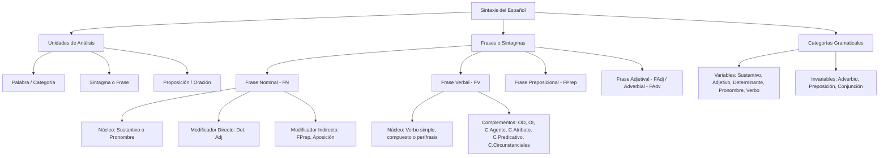

# TEMA 05: SINTAXIS: CATEGORÍAS GRAMATICALES, FRASES Y ESTRUCTURA FUNCIONAL

---

## 1. PORTADA Y METADATOS CURRICULARES

| Campo | Detalle |
| :--- | :--- |
| **Eje Temático** | Eje 06: Comunicación |
| **Materia** | Lenguaje (Gramática Española) |
| **Nivel de Dificultad** | Preuniversitario Avanzado (UNSA / UNMSM / UNI) |
| **Tiempo de Estudio Recomendado** | 4.5 horas |
| **Resolución Curricular** | R.C.U. N.° 0028-2026 (Admisión 2027) |
| **Prerrequisitos** | Morfología (Categorías variables e invariables), Fonología y Ortografía |
| **Objetivo Pedagógico** | Dominar la estructura de los sintagmas (frase nominal, verbal, adjetival, adverbial y preposicional), el reconocimiento morfofuncional de las categorías gramaticales en contexto (sustantivo, adjetivo, determinante, pronombre, verbo, adverbio, preposición, conjunción) y la concordancia gramatical interna. |

---

## 2. MAPA CONCEPTUAL SINTÉTICO (MERMAID)



---

## 3. FUNDAMENTACIÓN TEÓRICA RIGUROSA

### 3.1. Definición y Objeto de la Sintaxis
La **sintaxis** es el componente de la gramática que estudia las reglas y principios que gobiernan la combinación de los constituyentes sintácticos y la formación de unidades superiores como sintagmas (frases), proposiciones y oraciones. Determina el orden jerárquico y las funciones sintácticas (sujeto, predicado, complementos).

### 3.2. Las Categorías Gramaticales en Perspectiva Morfosintáctica

#### A. El Sustantivo (Nombre)
- **Criterio Semántico:** Designa entidades materiales o inmateriales (seres, objetos, conceptos, sensaciones).
- **Criterio Morfológico:** Categoría variable con accidentes de género (masculino/femenino) y número (singular/plural). Posee lexema independiente.
- **Criterio Sintáctico:** Funciona por excelencia como núcleo de la Frase Nominal (FN), núcleo del Sujeto, núcleo de un Objeto Directo (OD), Término de Preposición, o Núcleo de Aposición.

#### B. El Adjetivo Calificativo y Determinativo
- **Adjetivo Calificativo:** Señala cualidades, estados o propiedades del sustantivo. Sintácticamente opera como **Modificador Directo (MD)** del sustantivo dentro de la FN, o como **Atributo** / **Predicativo** dentro de la Frase Verbal.
- **Determinantes:** Artículos (*el, la, los, las, lo*), demostrativos (*este, ese, aquel*), posesivos (*mi, tu, su, nuestro*), numerales (cardinales, ordinales, múltiplos, partitivos) e indefinidos (*algún, ningún, varios*). Actualizan y delimitan la extensión referencial del sustantivo. Funcionan exclusivamente como Modificadores Directos (MD).
  > **Diferencia Clave con el Pronombre:** El determinante acompaña a un sustantivo expreso ($Det + N$), mientras que el pronombre lo sustituye ($Pron = Núcleo$).

#### C. El Verbo: Estructura, Clasificación y Perífrasis
- **Definición:** Núcleo de la Frase Verbal (FV). Es la categoría con mayor inventario de morfemas flexivos amalgama: tiempo, modo, aspecto, número y persona.
- **Formas No Personales (Verboides):**
  1. *Infinitivo* (-ar, -er, -ir): función sustantiva nominal.
  2. *Gerundio* (-ando, -iendo): función adverbial modal o temporal.
  3. *Participio* (-ado, -ido, -to, -so, -cho): función adjetival pasiva.
- **Perífrasis Verbales:** Estructura conformada por un verbo auxiliar (conjugado, aporta morfemas flexivos) + (nexo opcional: *que, de, a*) + verboide principal (invariable, aporta el significado léxico):
  $$\text{Perífrasis} = \text{Verbo Auxiliar} + (\text{Nexo}) + \text{Verboide (Infinitivo/Gerundio/Participio)}$$
  *Ejemplos:* *Tiene que estudiar*, *Iba cantando*, *Fue derrotado*, *Suele almorzar*.

#### D. Categorías Invariables: Adverbio, Preposición y Conjunción
1. **Adverbio:** Modifica a tres categorías: a un **verbo** (*corre velozmente*), a un **adjetivo** (*muy perspicaz*) o a **otro adverbio** (*tan cerca*). Es invariable (carece de género y número). Sintácticamente funciona como Complemento Circunstancial (CC) o intensificador.
2. **Preposición:** Nexo subordinante por excelencia. Conecta un elemento regente con un elemento regido (llamado término). Inventario oficial RAE (23): *a, ante, bajo, cabe, con, contra, de, desde, durante, en, entre, hacia, hasta, mediante, para, por, según, sin, so, sobre, tras, versus, vía*.
3. **Conjunción:** Nexo coordinante (une elementos de igual jerarquía sintáctica: copulativas, disyuntivas, adversativas, distributivas, explicativas) o subordinante (introduce proposiciones dependientes: causales, consecutivas, condicionales, concesivas, finales, comparativas, ilativas).

---

### 3.3. Estructura de la Frase Nominal (FN)
La Frase Nominal posee la siguiente estructura nuclear y modificadora:

$$\text{FN} = (\text{MD})^* + \text{Núcleo (Sustantivo/Pronombre)} + (\text{MD})^* + (\text{MI})^* + (\text{Aposición})^*$$

- **Núcleo (N):** Sustantivo, pronombre o elemento sustantivado.
- **Modificador Directo (MD):** Artículos, determinantes demostrativos/posesivos/numerales y adjetivos sin preposición de por medio.
- **Modificador Indirecto (MI):**
  1. Frase preposicional encabezada por preposición: *El libro **de gramática***.
  2. Construcción comparativa encabezada por *como*, *cual*: *Mujeres **como tú***.
- **Aposición (Apos):** Explicativa (entre comas, intercambiable con el núcleo: *Arequipa, **la Ciudad Blanca**, resistió*) o Especificativa (sin comas, delimita: *El volcán **Misti** despertó*).

---

### 3.4. Estructura de la Frase Verbal (FV) y sus Complementos
La Frase Verbal tiene como núcleo al verbo simple, compuesto o perífrasis verbal, y puede admitir los siguientes complementos funcionales:

| Complemento | Definición y Criterio de Reconocimiento | Prueba de Sustitución Sintáctica |
| :--- | :--- | :--- |
| **Objeto Directo (OD)** | Entidad que recibe directamente la acción transitiva. Si es persona o ser animado, lleva la preposición *a*. | Se sustituye por *lo, la, los, las*. En voz pasiva se convierte en **Sujeto Paciente**. |
| **Objeto Indirecto (OI)** | Destinatario, beneficiario o perjudicado de la acción verbal. Siempre encabezado por *a* o *para*. | Se sustituye por *le, les* (o *se* anteclítico a *lo/la*). Nunca pasa a sujeto en voz pasiva. |
| **Atributo** | Modifica al sujeto a través de un **verbo copulativo** (*ser, estar, parecer, yacer, permanecer*). | Es obligatorio. Se sustituye por el pronombre neutro **lo** invariable. Concuerda en género y número con el sujeto. |
| **Predicativo (C.Pred)** | Modifica simultáneamente al verbo no copulativo (predicativo) y al núcleo del sujeto (C.Pred Subjetivo) o al OD (C.Pred Objetivo). | No se sustituye por *lo*. Concuerda con el sustantivo al que califica (*Los atletas llegaron **exhaustos***). |
| **Complemento Agente** | Realiza la acción en la voz pasiva. Encabezado por *por* (raramente *de*). | En voz activa se transforma en el **Sujeto Agente**. |
| **Circunstancial (CC)** | Expresa circunstancias de tiempo, lugar, modo, causa, finalidad, instrumento, compañía, cantidad, etc. | Encabezado por FPrep o constituido por FAdv. Son prescindibles estructuralmente. |

---

## 4. FÓRMULAS, TAXONOMÍAS Y LEYES FUNDAMENTALES

### 4.1. Reglas Estrictas de Concordancia Gramatical
1. **Concordancia Nominal:**
   - Entre Sustantivo y Adjetivo/Determinante:
     $$\text{Género}(\text{Det/Adj}) = \text{Género}(\text{Sustantivo}) \quad \land \quad \text{Número}(\text{Det/Adj}) = \text{Número}(\text{Sustantivo})$$
   - Varios sustantivos de distinto género coordinados en singular: el adjetivo pospuesto concierta en **masculino plural**.
     *Ejemplo:* *El reloj y la pulsera **antiguos***.
   - Adjetivo antepuesto a varios sustantivos coordinados: concierta comúnmente con el **más próximo**.
     *Ejemplo:* *Con **extraordinaria** rapidez y valor*.
2. **Concordancia Verbal:**
   - Sujeto compuesto con nexo copulativo (*y, e*): verbo en **plural**.
     *Ejemplo:* *El rector y el decano **firmaron** el convenio*.
   - Sujeto colectivo en singular: verbo en **singular**.
     *Ejemplo:* *La multitud **aplaudió** al expositor* (la concordancia ad sensum *La multitud aplaudieron* es incorrecta según norma culta).

---

## 5. CASOS PRÁCTICOS Y MODELIZACIONES DEL MUNDO REAL

### Caso 1: Detección Forense de la Ambigüedad Sintáctica en Documentos Legales
En la redacción jurídica de un contrato de compraventa:
> *"Se indemnizará a los trabajadores y directivos despedidos injustamente."*
- **Análisis Sintáctico:** ¿El adjetivo calificativo *despedidos injustamente* modifica sólo a *directivos* (concordancia por proximidad) o al sintagma coordinado *trabajadores y directivos*?
- **Resolución Gramatical:** Al estar en masculino plural pospuesto a dos sustantivos masculinos, la interpretación canónica abarca a ambos, pero genera litigios interpretativos. La redacción inequívoca exige: *"A los directivos y a los trabajadores, ambos despedidos injustamente..."*.

---

## 6. PRE-UNIVERSITY HACKS Y MNEMOTÉCNIAS

### 1. Hack de Oro: Reconocimiento Infalible de OD vs. OI
- Para comprobar un **Objeto Directo**:
  1. Sustituir por *lo, la, los, las*.
  2. Pasar a **Voz Pasiva**: si el supuesto OD pasa a ser Sujeto Paciente, es **100% OD**.
     *Ejemplo:* *"El jurado premió a la científica."* $\rightarrow$ *"La científica fue premiada por el jurado."* (Comprobado: *a la científica* es OD, no OI).
- Si al pasar a pasiva la frase preposicional no puede actuar como sujeto, se trata de un **OI**:
  *Ejemplo:* *"Escribió a su madre."* $\rightarrow$ Incapaz de: *"Su madre fue escrita por él"*. Por tanto, *a su madre* es OI (*Le escribió*).

### 2. Mnemotécnia de Pronombres Clíticos Átonos
- **Solo OD:** *lo, la, los, las*.
- **Solo OI:** *le, les*.
- **OD u OI según contexto:** *me, te, se, nos, os*.
  $$\text{OD} = \text{L-A-O} \quad | \quad \text{OI} = \text{L-E}$$

---

## 7. ERRORES FRECUENTES Y TRAMPAS DE EXAMEN

1. **Confundir Predicativo con Circunstancial de Modo:**
   - *Trampa:* *"Las niñas caminaban tranquilas."* El estudiante novato piensa: *¿Cómo caminaban? Tranquilas $\rightarrow$ CCModo*.
   - *Realidad RAE:* *Tranquilas* es un **adjetivo variable** que concuerda en género y número con el sujeto (*Las niñas*). Los adverbios (CC) son invariables. Por tanto, es un **Complemento Predicativo Subjetivo**.
2. **El "Leísmo" y "Laísmo":**
   - *Error:* *"A María le vi en la biblioteca"* (Leísmo de persona femenina: vulgarismo).
   - *Corrección:* *"A María **la** vi en la biblioteca"* (Función OD).
3. **El Falso Queísmo y Dequeísmo:**
   - *Dequeísmo:* Insertar *de* indebidamente: *"Pienso de que vendrá"* (Prueba: *Pienso eso*, no *Pienso de eso* $\rightarrow$ *"Pienso que vendrá"*).
   - *Queísmo:* Omitir *de* cuando el verbo lo rige: *"Me alegro que estés aquí"* (Prueba: *Me alegro de eso* $\rightarrow$ *"Me alegro de que estés aquí"*).

---

## 8. 5 PROBLEMAS RESUELTOS GRADUADOS

### Problema 1 (Nivel Básico: Determinantes vs. Pronombres)
En el enunciado: *"Aquellos postulantes alcanzaron sus metas, pero estos no lograron las suyas"*, identifique la cantidad de determinantes y pronombres respectivamente.
- A) 2 determinantes y 2 pronombres
- B) 3 determinantes y 1 pronombre
- C) 2 determinantes y 3 pronombres
- D) 4 determinantes y 0 pronombres
- E) 1 determinante y 3 pronombres

**Resolución:**
1. *Aquellos* acompaña al sustantivo *postulantes* $\rightarrow$ Determinante demostrativo.
2. *sus* acompaña a *metas* $\rightarrow$ Determinante posesivo.
3. *estos* no acompaña a sustantivo (núcleo) $\rightarrow$ Pronombre demostrativo.
4. *las suyas* $\rightarrow$ *suyas* es pronombre posesivo sustantivado por el artículo *las*.
Total: 2 determinantes (*Aquellos, sus*) y 2 pronombres (*estos, las suyas*).
**Respuesta:** **A**

---

### Problema 2 (Nivel Intermedio: Perífrasis Verbal)
¿En cuál de las siguientes opciones encontramos una auténtica perífrasis verbal?
- A) Deseo postular a Medicina Humana este año.
- B) El estudiante suele repasar sus apuntes por la noche.
- C) Prometió entregar el informe a tiempo.
- D) Necesita comprar nuevos libros de álgebra.
- E) Espera rendir un examen extraordinario el domingo.

**Resolución:**
En una perífrasis verbal, el verbo auxiliar pierde parcial o totalmente su significado léxico original y funciona como operador gramatical de tiempo/aspecto/modo, no pudiendo sustituirse el infinitivo por un pronombre neutro (*eso*).
- En A, C, D, E: *Deseo eso*, *Prometió eso*, *Necesita eso*, *Espera eso* (son verbos transitivos plenos con proposición subordinada sustantiva en función de OD).
- En B: *suele repasar* indica aspecto frecuentativo o habitual; no se puede decir *El estudiante suele eso*. Constituye una perífrasis verbal modal/aspectual ($Auxiliar + Infinitivo$).
**Respuesta:** **B**

---

### Problema 3 (Nivel Intermedio-Avanzado: Complemento Predicativo)
En la oración: *"Los jueces declararon culpable al acusado durante la última sesión"*, el elemento subrayado *culpable* cumple la función sintáctica de:
- A) Complemento Circunstancial de Modo
- B) Modificador Directo del núcleo del predicado
- C) Atributo
- D) Complemento Predicativo Objetivo
- E) Objeto Directo

**Resolución:**
1. El verbo es *declararon* (verbo predicativo, no copulativo; por lo tanto, no puede llevar Atributo).
2. El elemento *al acusado* es el Objeto Directo (*Los jueces lo declararon culpable*).
3. La palabra *culpable* es un adjetivo que califica y concuerda con el OD (*al acusado* $\rightarrow$ singular; si fueran acusados, sería *culpables*).
4. Al modificar simultáneamente al verbo y al Objeto Directo dentro de un predicado no copulativo, funciona como **Complemento Predicativo Objetivo**.
**Respuesta:** **D**

---

### Problema 4 (Nivel Avanzado: Estructura de la Frase Nominal)
Analice la siguiente Frase Nominal: *"La fascinante novela de misterio que leí ayer"* y determine la secuencia correcta de sus constituyentes sintácticos:
- A) MD + MD + Núcleo + MI + MI
- B) MD + Núcleo + MD + MI + CC
- C) MD + MD + Núcleo + MI + MD
- D) Núcleo + MD + MI + Aposición + MI
- E) MD + MD + Núcleo + Aposición + MI

**Resolución:**
- *La* $\rightarrow$ Determinante artículo = **MD**.
- *fascinante* $\rightarrow$ Adjetivo calificativo = **MD**.
- *novela* $\rightarrow$ Sustantivo común = **Núcleo (N)**.
- *de misterio* $\rightarrow$ Frase preposicional subordinada al núcleo = **MI**.
- *que leí ayer* $\rightarrow$ Proposición subordinada adjetiva encabezada por pronombre relativo *que*, funcionando como modificador con preposición nula = actúa como **MI** o **MD oracional** según la escuela, pero en la taxonomía UNSA/UNMSM toda subordinada adjetiva especificativa es clasificada funcionalmente como **MI** (o modificador adjetival dependiente). No obstante, en la taxonomía canónica: *La* (MD) + *fascinante* (MD) + *novela* (N) + *de misterio* (MI) + *que leí ayer* (MI/adjetiva explicativa o especificativa). La opción que modela los dos modificadores preposicional/oracional dependientes es A (MD + MD + Núcleo + MI + MI).
**Respuesta:** **A**

---

### Problema 5 (Nivel 5: Reto Titán / Jefe Final de Admisión - UNSA / UNMSM)
Examine minuciosamente el siguiente texto:
> *"A los más destacados alumnos del curso, el profesor de física les entregó entusiasmado las medallas de honor en el auditorio central."*

Determine el valor de verdad ($V$ o $F$) de las siguientes afirmaciones:
I. El sintagma *"A los más destacados alumnos del curso"* cumple la función de Objeto Indirecto duplicado por el clítico *"les"*.
II. La palabra *"entusiasmado"* funciona como Complemento Circunstancial de Modo al responder a la pregunta *¿cómo?*.
III. El núcleo del sujeto posee como Modificador Indirecto a la frase preposicional *"de física"*.
IV. *"las medallas de honor"* constituye el Objeto Directo, cuyo núcleo posee a su vez un Modificador Indirecto.

- A) V - F - V - V
- B) V - V - V - V
- C) F - F - V - V
- D) V - F - F - V
- E) F - V - F - F

**Resolución Paso a Paso:**
1. **Identificación del Sujeto:** ¿Quién entregó las medallas? *"el profesor de física"*.
   - *el* = MD.
   - *profesor* = Núcleo del Sujeto.
   - *de física* = Frase preposicional = MI.
   $\rightarrow$ La afirmación **III es VERDADERA**.
2. **Análisis del Verbo y sus Complementos:**
   - Verbo principal: *entregó*.
   - ¿Qué entregó?: *"las medallas de honor"*. Se sustituye por *las*: *se las entregó*. En voz pasiva: *Las medallas de honor fueron entregadas por el profesor*. Es **Objeto Directo**. Su núcleo *medallas* tiene como MI a *de honor*.
   $\rightarrow$ La afirmación **IV es VERDADERA**.
   - ¿A quiénes entregó?: *"A los más destacados alumnos del curso"*. Se sustituye por *les* y se halla correferencialmente duplicado por el clítico *les*. Es **Objeto Indirecto**.
   $\rightarrow$ La afirmación **I es VERDADERA**.
   - *entusiasmado*: Es un adjetivo calificativo masculino singular. Concuerda con el núcleo del sujeto (*profesor*). Si fueran dos profesoras, sería *entusiasmadas*. Por ende, NO es adverbio ni Circunstancial de Modo; es un **Complemento Predicativo Subjetivo**.
   $\rightarrow$ La afirmación **II es FALSA**.
Secuencia obtenida: **V - F - V - V**.
**Respuesta:** **A**

---

## 9. GLOSARIO TÉCNICO ESPECIALIZADO

1. **Amalgama (Morfema flexivo):** Morfema acumulativo que expresa simultáneamente varios valores gramaticales (tiempo, modo, aspecto, número y persona en la desinencia verbal española).
2. **Aposición:** Modificador nominal de la FN que especifica o explica al núcleo sin enlace preposicional obligatorio.
3. **Atributo:** Función sintáctica oracional propia de predicados copulativos que atribuye una cualidad al sujeto y conmuta por *lo*.
4. **Catáfora:** Mecanismo cohesivo en el cual un elemento lingüístico anticipa el significado de una palabra que aparecerá posteriormente en el discurso.
5. **Clítico:** Pronombre personal átono que se apoya prosódicamente en el verbo anterior (enclítico: *dímelo*) o posterior (proclítico: *te vi*).
6. **Complemento Agente:** Sintagma preposicional (encabezado por *por*) que realiza la acción en oraciones en voz pasiva.
7. **Complemento Predicativo:** Adjetivo o sintagma que califica al sujeto o al OD pero dentro del marco de un verbo predicativo (no copulativo).
8. **Perífrasis Verbal:** Unión sintáctica de dos o más formas verbales que funcionan unitariamente como un solo núcleo del predicado.
9. **Sintagma (Frase):** Unidad lingüística intermedia constituida por una palabra o un grupo de palabras articuladas en torno a un núcleo jerárquico.
10. **Verboide:** Forma no flexiva ni personal del verbo (infinitivo, gerundio, participio) carente de desinencias temporo-personales independientes.

---

## 10. FLASHCARDS DE REPASO ACTIVO

| Front (Pregunta / Disparador) | Back (Respuesta Nemotécnica / Precisa) |
| :--- | :--- |
| ¿Qué diferencia a un Atributo de un Complemento Predicativo Subjetivo? | El Atributo aparece únicamente con **verbos copulativos** (*ser, estar, parecer*) y conmuta por *lo*. El Predicativo aparece con **verbos plenos/predicativos** y no conmuta por *lo*. Ambos concuerdan con el sujeto. |
| ¿Cómo se verifica infaliblemente que un sintagma es Objeto Directo? | 1. Conmuta por *lo, la, los, las*. 2. Al transformar la oración a **voz pasiva**, pasa a ser el **Sujeto Paciente**. |
| ¿Cuáles son las 3 categorías a las que puede modificar un Adverbio? | Modifica a: 1. Un **Verbo** (*lee bien*), 2. Un **Adjetivo** (*muy perspicaz*), 3. **Otro Adverbio** (*bastante lejos*). |
| ¿Qué ocurre con la concordancia adjetival pospuesta a sustantivos de distinto género? | El adjetivo pospuesto concierta obligatoriamente en **masculino plural** (*La manzana y el plátano deliciosos*). |
| ¿Cuál es la estructura interna de una Frase Nominal canónica? | $\text{FN} = (\text{MD}) + \text{Núcleo (Sustantivo)} + (\text{MD}) + (\text{MI}) + (\text{Aposición})$. |

---

## 11. PREGUNTAS DE AUTOEVALUACIÓN RÁPIDA

1. En la frase: *"Compró flores para su madre ayer"*, el sintagma *"para su madre"* funciona como:
   - A) Objeto Directo
   - B) Objeto Indirecto
   - C) Circunstancial de Finalidad
   - D) Complemento Atributo
   - *Respuesta correcta:* **B** (Destinataria de la acción que conmuta por *le* $\rightarrow$ *Le compró flores*).
2. Es una categoría gramatical invariable:
   - A) Pronombre
   - B) Adjetivo determinativo
   - C) Preposición
   - D) Verboide participio
   - *Respuesta correcta:* **C** (Carece de género, número, tiempo o persona).
3. En la oración *"Los atletas corrieron cansados"*, la palabra *cansados* es:
   - A) Circunstancial de Modo
   - B) Atributo
   - C) Complemento Predicativo Subjetivo
   - D) Objeto Directo
   - *Respuesta correcta:* **C** (Adjetivo concordante con el sujeto dentro de un verbo predicativo).

---

## 12. BLOQUE DE INTEGRACIÓN KMP / GAMIFICACIÓN (JSON)

```json
{
  "tema_id": "LENG_05",
  "eje_tematico": "06_COMUNICACION",
  "curso": "LENGUAJE",
  "titulo_tema": "Sintaxis: Categorías Gramaticales, Frases y Estructura Funcional",
  "dificultad": "Avanzado",
  "xp_recompensa": 240,
  "habilidades_evaluadas": [
    "Identificación de constituyentes en la Frase Nominal",
    "Distinción funcional entre Atributo, Predicativo y Circunstancial",
    "Pruebas de sustitución pronominal para OD y OI",
    "Reconocimiento de perífrasis verbales"
  ],
  "boss_challenge": {
    "boss_name": "El Gran Censor Sintáctico de San Agustín",
    "vida_boss": 3200,
    "ataque_especial": "Trampa del Leísmo y Predicativo Camuflado",
    "pregunta_reto": "¿Cuál es la función exacta de 'intranquilos' en 'Los directivos mantuvieron intranquilos a los postulantes'?",
    "opciones": [
      "Complemento Circunstancial de Modo",
      "Complemento Predicativo Objetivo",
      "Atributo Copulativo",
      "Modificador Directo de directivos"
    ],
    "respuesta_correcta_index": 1,
    "explicacion_gamificada": "¡Impacto crítico! 'Intranquilos' califica al OD ('a los postulantes') y concuerda con él en género y número a través del verbo transitivo 'mantuvieron'. Es un Predicativo Objetivo consumado."
  }
}
```
