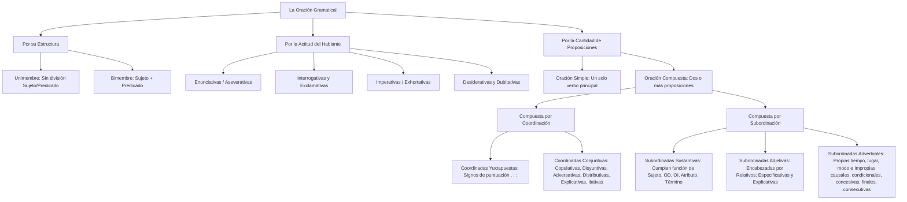

# TEMA 06: LA ORACIÓN GRAMATICAL: SIMPLES Y COMPUESTAS (COORDINADAS Y SUBORDINADAS)

---

## 1. PORTADA Y METADATOS CURRICULARES

| Campo | Detalle |
| :--- | :--- |
| **Eje Temático** | Eje 06: Comunicación |
| **Materia** | Lenguaje (Sintaxis Superior) |
| **Nivel de Dificultad** | Preuniversitario Avanzado (UNSA / UNMSM / UNI) |
| **Tiempo de Estudio Recomendado** | 5.0 horas |
| **Resolución Curricular** | R.C.U. N.° 0028-2026 (Admisión 2027) |
| **Prerrequisitos** | Sintaxis: Frases y Categorías Gramaticales (Tema 05) |
| **Objetivo Pedagógico** | Clasificar y analizar con exactitud oraciones bimembres y unimembres, oraciones según la actitud del hablante y, de modo primordial, desentrañar la arquitectura de las oraciones compuestas por coordinación (yuxtapuestas y conjuntivas) y por subordinación (sustantivas, adjetivas y adverbiales). |

---

## 2. MAPA CONCEPTUAL SINTÉTICO (MERMAID)



---

## 3. FUNDAMENTACIÓN TEÓRICA RIGUROSA

### 3.1. Naturaleza de la Oración Gramatical
La **oración** es la unidad sintáctica mínima con **independencia sintáctica**, **sentido completo** y una **entonación propia delimitada por pausas**. Se distingue de la *frase* (que carece de verbo conjugado y de sentido oracional completo) y de la *proposición* (unidad sintáctica con sentido y estructura oracional, pero dependiente o coordinada dentro de una oración compuesta).

### 3.2. Clasificación Estructural: Bimembre vs. Unimembre
1. **Oración Bimembre:** Estructurada formal o tácitamente en dos constituyentes interdependientes: **Sujeto** y **Predicado**.
   - Con sujeto expreso: *Los científicos arequipeños investigan el volcán.*
   - Con sujeto tácito (elíptico u omitido): *Investigan el volcán.* [Sujeto tácito: *Ellos*]
2. **Oración Unimembre:** No puede dividirse en sujeto y predicado. Carece ontológicamente de sujeto.
   - *Verbales impersonales:*
     - Fenómenos climáticos/meteorológicos: *Llovió torrencialmente en Cayma.*
     - Con verbo *haber* impersonal (tercera persona singular): *Hubo muchas dificultades.* (*muchas dificultades* es OD, jamás sujeto).
     - Con verbo *hacer* o *ser* cronológico o climático: *Hace frío*, *Es muy tarde*.
     - Con *se* impersonal: *Se vive bien aquí.*
   - *No verbales (interjecciones, frases nominales contextuadas):* *¡Auxilio!*, *Buenos días*, *¡Fuego!*.

### 3.3. Clasificación Semántico-Pragmática: Por la Actitud del Hablante
- **Enunciativas o Declarativas:** Transmiten información afirmativa o negativa sobre la realidad susceptible de verdad o falsedad (*El examen será en marzo*).
- **Interrogativas:** Solicitan información.
  - *Directas:* Entre signos de interrogación (*¿Dónde vives?*).
  - *Indirectas:* Sin signos, subordinadas a verbos de dicción o entendimiento (*Dime dónde vives*).
  - *Totales:* Respuesta binaria sí/no (*¿Aprobaste el curso?*).
  - *Parciales:* Preguntan por un elemento específico mediante pronombres enfáticos (*¿Quién resolvió el problema?*).
- **Exclamativas:** Manifiestan estados emocionales intensos (*¡Qué hermosa mañana!*).
- **Exhortativas o Imperativas:** Expresan ruego, mandato, orden, prohibición o consejo (*Presente su documento de identidad*).
- **Desiderativas o Optativas:** Expresan anhelo o deseo del emisor; frecuentemente introducidas por *ojalá*, *quisiera*, *así* (*Ojalá ingreses a la UNSA*).
- **Dubitativas:** Expresan incertidumbre, probabilidad o duda; introducidas por adverbios de duda (*tal vez, quizás, posiblemente*): *Quizá viaje a Mollendo el fin de semana*.

---

### 3.4. Oraciones Compuestas por Coordinación
Las oraciones compuestas coordinadas enlazan proposiciones sintácticamente equivalentes, independientes entre sí, sin relación de subordinación o jerarquía.

```
┌─────────────────────────────────┐
│  Oración Compuesta Coordinada   │
└────────────────┬────────────────┘
                 ├──────────────────────────────┐
                 ▼                              ▼
      ┌─────────────────────┐        ┌─────────────────────┐
      │     Yuxtapuesta     │        │     Conjuntiva      │
      │   (Signos: , ; :)   │        │  (Nexos conectores) │
      └─────────────────────┘        └──────────┬──────────┘
                                                ├─ Copulativa (y, e, ni, que)
                                                ├─ Disyuntiva (o, u, o bien)
                                                ├─ Adversativa (pero, mas, sino, sin embargo)
                                                ├─ Distributiva (ya... ya, bien... bien, ora... ora)
                                                ├─ Explicativa (es decir, o sea, esto es)
                                                └─ Ilativa / Consecutiva coordinada (luego, conque, por ende)
```

1. **Yuxtapuestas ($OCY$):** La articulación proposicional se efectúa mediante signos de puntuación: coma ($,$), punto y coma ($;$) o dos puntos ($:$):
   $$\text{Prop}_1 \ [,] \ \text{Prop}_2 \ [;] \ \text{Prop}_3$$
   *Ejemplo:* *El rector inauguró el año académico; los decanos aplaudieron con entusiasmo.*
2. **Conjuntivas ($OCC$):** Enlazadas por conjunciones coordinantes:
   - **Copulativas:** Adición o acumulación (*y, e, ni, que*). *Estudia con ahínco y trabaja por las tardes.*
   - **Disyuntivas:** Exclusión o alternancia (*o, u, o bien*). *Dices la verdad o asumirás las consecuencias.*
   - **Adversativas:** Oposición o restricción (*pero, mas, sino, sin embargo, no obstante*). *Estudió toda la noche, pero no rindió la prueba.*
   - **Distributivas:** Alternancia correlativa no excluyente (*ya... ya, bien... bien, ora... ora*). *Bien ríen a carcajadas, bien lloran de emoción.*
   - **Explicativas:** La segunda proposición aclara a la primera (*es decir, esto es, o sea*). *El animal es vivíparo, es decir, nace del vientre materno.*
   - **Ilativas:** Consecuencia lógica directa (*luego, conque, así que, por consiguiente*). *Pienso, luego existo.*

---

### 3.5. Oraciones Compuestas por Subordinación
Se caracterizan por la presencia de una **Proposición Principal ($PP$)** y una o más **Proposiciones Subordinadas ($PS$)** dependientes de aquella, que desempeñan una función sintáctica interna.

#### A. Proposiciones Subordinadas Sustantivas (PSS)
Cumplen las funciones propias de un sintagma nominal:
1. **Función de Sujeto:** *Quienes lleguen tarde no ingresarán* [Prueba: *Ellos no ingresarán*]. *Me alegra que hayas vuelto* [Prueba: *Me alegra eso* $\rightarrow$ *Eso me alegra*].
2. **Función de Objeto Directo (OD):** *El profesor dijo que resolviéramos el problema* [Prueba: *El profesor lo dijo*]. *No sé si vendrá* [Prueba: *No lo sé*].
3. **Función de Objeto Indirecto (OI):** *Entregaron víveres a quienes lo perdieron todo* [Prueba: *Les entregaron víveres*].
4. **Función de Atributo:** *Nuestra meta es ingresar a la universidad* [Prueba: *Nuestra meta lo es*].
5. **Función de Término de Preposición:**
   - Modificador del nombre: *Tengo la certeza de que triunfaremos*.
   - Modificador del adjetivo: *Está seguro de que aprobará*.
   - Complemento de Régimen: *Confía en que todo saldrá bien*.
   - Complemento Agente: *Fue ovacionado por cuantos lo escucharon*.

#### B. Proposiciones Subordinadas Adjetivas (PSA)
Modifican a un sustantivo de la proposición principal denominado **antecedente**. Son introducidas por pronombres relativos (*que, quien, el cual, cuyo*):
- **Especificativas:** Delimitan al antecedente sin comas:
  *Los postulantes que repasaron a conciencia obtuvieron altos puntajes.* (Solo aquellos que repasaron).
- **Explicativas:** Agregan una cualidad accesoria entre comas:
  *Los postulantes, que repasaron a conciencia, obtuvieron altos puntajes.* (Todos repasaron).
- **Relativo relativo-posesivo *cuyo*:** Concierta en género y número con el sustantivo consecuente, no con el antecedente:
  *El profesor cuyo libro fue premiado.*

#### C. Proposiciones Subordinadas Adverbiales (PSAdv)
Modifican al verbo principal a modo de complemento circunstancial.
1. **Adverbiales Propias (Circunstanciales canónicas - conmutables por adverbios):**
   - *De Lugar:* *Acamparemos donde nace el río* (allí).
   - *De Tiempo:* *Llegamos cuando caía el ocaso* (entonces).
   - *De Modo:* *Pintó el cuadro como le enseñó el maestro* (así).
2. **Adverbiales Impropias (Lógicas o causales - no conmutables por adverbios simples):**
   - *Causales:* Indican motivo o causa (*porque, puesto que, ya que, dado que*). *No asistió a clases porque estaba enfermo.*
   - *Consecutivas Subordinadas:* Indican consecuencia cuantitativa o intensiva ligada a un intensificador (*tan... que, tanto... que, tal... que*). *Hizo tanto frío que las tuberías colapsaron.*
   - *Condicionales:* Expresan requisito o prótasis (*si, siempre que, con tal de que*). *Si estudias con rigor, alcanzarás la vacante.*
   - *Concesivas:* Expresan obstáculo que no impide la acción (*aunque, a pesar de que, si bien, aun cuando*). *Aunque llueva intensamente, iremos a la universidad.*
   - *Finales:* Indican propósito o meta (*para que, a fin de que, con el objeto de que*). *Madrugó para que alcanzara cupo en la biblioteca.*
   - *Comparativas:* Cotejo de superioridad, inferioridad o igualdad (*más... que, menos... que, tan... como*). *Sabe más que lo que aparenta.*

---

## 4. FÓRMULAS, TAXONOMÍAS Y LEYES FUNDAMENTALES

### 4.1. Algoritmo de Identificación de Proposiciones Subordinadas

$$\text{¿La proposición puede reemplazarse por "ESO" o "ESTO"?} \begin{cases} \text{SÍ} \longrightarrow \mathbf{Subordinada \ Sustantiva} \\ \text{NO} \longrightarrow \begin{cases} \text{¿Modifica a un antecedente sustantivo?} \longrightarrow \mathbf{Subordinada \ Adjetiva} \\ \text{¿Expresa circunstancia o relación lógica con el verbo?} \longrightarrow \mathbf{Subordinada \ Adverbial} \end{cases} \end{cases}$$

### 4.2. Ecuación de la Ilativa vs. Consecutiva Subordinada
- **Ilativa (Coordinada):** No tiene correlato cuantificador en la primera proposición:
  $$\text{Prop}_1 + \text{[luego / conque / por lo tanto]} + \text{Prop}_2$$
- **Consecutiva (Subordinada Impropia):** Exige intensificador obligatorio (*tan / tanto / tal*):
  $$\text{Prop}_1 \ [\text{tan / tanto / tal}] + \text{[que]} + \text{PS Consecutiva}$$

---

## 5. CASOS PRÁCTICOS Y MODELIZACIONES DEL MUNDO REAL

### Caso 1: Detección de Falacias Condicionales en la Argumentación Jurídica
En el análisis del artículo procesal: *"Si el imputado no se presenta a la audiencia judicial, el juez dictará orden de captura internacional"*.
- **Estructura Sintáctica:** Oración Compuesta Subordinada Adverbial Condicional.
  - Prótasis (Subordinada condicional): *Si el imputado no se presenta a la audiencia judicial*.
  - Apódosis (Proposición Principal): *el juez dictará orden de captura internacional*.
- **Importancia:** Sintácticamente, la apódosis está subordinada causal-lógicamente al cumplimiento de la prótasis. Confundir la subordinada condicional con una oración coordinada copulativa alteraría el régimen de causalidad jurídica, interpretando el hecho procesal como dos eventos independientes en lugar de un mandato condicionado.

---

## 6. PRE-UNIVERSITY HACKS Y MNEMOTÉCNIAS

### 1. El Test "ESO" para Proposiciones Sustantivas
Toda Proposición Subordinada Sustantiva (PSS) es conmutable al 100% por el pronombre neutro **ESO** o **ESTO**:
- *Deseo [que triunfes en el examen]* $\rightarrow$ *Deseo [ESO]* $\rightarrow$ OD.
- *Me disgusta [que hables con altanería]* $\rightarrow$ *Me disgusta [ESO]* $\rightarrow$ *[ESO] me disgusta* $\rightarrow$ Sujeto.
- *Tiene miedo de [que lo rechacen]* $\rightarrow$ *Tiene miedo de [ESO]* $\rightarrow$ Término de complemento de nombre.

### 2. Mnemotécnia de Conjunciones Coordinadas Adversativas: "P-M-S"
$$\mathbf{P}\text{ero} \ - \ \mathbf{M}\text{as (sin tilde)} \ - \ \mathbf{S}\text{ino}$$
Si la oración contiene *sin embargo*, *no obstante*, *mas* o *pero*, es **Oración Compuesta Coordinada Adversativa**.

---

## 7. ERRORES FRECUENTES Y TRAMPAS DE EXAMEN

1. **El falso sujeto en oraciones con verbo "haber" impersonal:**
   - *Trampa común:* *"Hubieron muchas quejas de los usuarios."*
   - *Error:* En el español formal, el verbo *haber* cuando indica existencia es estrictamente impersonal (tercera persona del singular). *Muchas quejas* no es sujeto, es **Objeto Directo** (*Las hubo*). Por tanto, la forma correcta es: *"**Hubo** muchas quejas"*.
2. **Confundir Subordinada Adjetiva con Sustantiva de OD:**
   - *Caso A:* *Sé [que vendrás temprano]* $\rightarrow$ *Sé [eso]* $\rightarrow$ PSS de OD.
   - *Caso B:* *El libro [que compraste] es fascinante* $\rightarrow$ *que* tiene antecedente nominal (*El libro*) $\rightarrow$ PSA especificativa.
3. **Confundir la conjunción ilativa *luego* con el adverbio temporal *luego*:**
   - *Ilativa (oración compuesta coordinada):* *Entrenó duramente, **luego** ganará la carrera* (equivale a *por lo tanto*).
   - *Temporal (oración simple con adverbio):* *Almorzamos y **luego** salimos al parque* (equivale a *después*).

---

## 8. 5 PROBLEMAS RESUELTOS GRADUADOS

### Problema 1 (Nivel Básico: Oración Unimembre vs. Bimembre)
Identifique la alternativa que presenta una oración unimembre:
- A) Mañana vendrán todos los delegados de la facultad.
- B) Había un silencio sepulcral en los pasillos universitarios.
- C) Durante el sismo, corrieron despavoridos hacia el patio.
- D) Nosotros resolveremos los ejercicios más complejos.
- E) Los estudiantes leen concentrados en la sala de estudio.

**Resolución:**
- En A: Sujeto expreso (*todos los delegados de la facultad*).
- En C: Sujeto tácito (*Ellos*).
- En D: Sujeto expreso (*Nosotros*).
- En E: Sujeto expreso (*Los estudiantes*).
- En B: El verbo *había* se emplea como forma impersonal de existencia en tercera persona del singular; *un silencio sepulcral* es su Objeto Directo (*Lo había*). La oración carece enteramente de sujeto. Por tanto, es una **oración unimembre verbal**.
**Respuesta:** **B**

---

### Problema 2 (Nivel Intermedio: Oración Compuesta Coordinada)
Señale la oración compuesta coordinada conjuntiva adversativa:
- A) No vino a la conferencia porque se encontraba indispuesto.
- B) El delegado tomó la palabra y expuso los acuerdos del consejo.
- C) No presentó el certificado médico, sino que envió una carta notarial.
- D) Si hubieras repasado los apuntes, habrías obtenido la máxima nota.
- E) Ya ríe con regocijo juvenil, ya llora con amargura infinita.

**Resolución:**
- A: Subordinada adverbial causal (*porque...*).
- B: Coordinada conjuntiva copulativa (*y*).
- C: El conector *sino que* es una conjunción coordinante adversativa exclusiva que contrapone dos proposiciones incompatibles precedidas por negación. Es una **oración compuesta coordinada adversativa**.
- D: Subordinada adverbial condicional (*Si...*).
- E: Coordinada conjuntiva distributiva (*Ya... ya...*).
**Respuesta:** **C**

---

### Problema 3 (Nivel Intermedio-Avanzado: Subordinada Sustantiva en Función de Sujeto)
¿En cuál de los siguientes enunciados la proposición subordinada sustantiva cumple la función sintáctica de sujeto de la oración principal?
- A) El jurado evaluador comprobó que el proyecto era viable.
- B) A los directores les fascina que los alumnos propongan soluciones innovadoras.
- C) El candidato teme que no se alcancen los votos requeridos.
- D) El médico recomendó que guardara reposo absoluto.
- E) Confirmaron que la ceremonia de colación se postergaría.

**Resolución:**
Apliquemos la prueba de sustitución por *ESO*:
- En A: *El jurado lo comprobó* $\rightarrow$ *que el proyecto era viable* = OD.
- En C: *El candidato lo teme* $\rightarrow$ *que no se alcancen los votos* = OD.
- En D: *El médico lo recomendó* $\rightarrow$ *que guardara reposo* = OD.
- En E: *Lo confirmaron* $\rightarrow$ *que la ceremonia se postergaría* = OD.
- En B: *A los directores les fascina [que los alumnos propongan soluciones innovadoras]* $\rightarrow$ *A los directores les fascina [ESO]* $\rightarrow$ Si pluralizamos el elemento subordinado: *A los directores les fascinan [ESAS COSAS]*. Al variar el verbo *fascina/fascinan*, se demuestra inequívocamente que la proposición subordinada es el **Sujeto** del verbo *fascina*.
**Respuesta:** **B**

---

### Problema 4 (Nivel Avanzado: Subordinada Adjetiva Especificativa)
Identifique la alternativa que contiene una proposición subordinada adjetiva especificativa:
- A) La biblioteca, que fue remodelada el año pasado, abrirá sus puertas mañana.
- B) Quienes entreguen el trabajo a destiempo perderán dos puntos.
- C) Los postulantes que obtengan más de ochenta puntos pasarán a la entrevista.
- D) Es indispensable que confirmes tu asistencia a la brevedad posible.
- E) Aunque llegamos con retraso, pudimos escuchar la disertación magistral.

**Resolución:**
- En A: *que fue remodelada el año pasado* va entre comas $\rightarrow$ es subordinada adjetiva **explicativa**.
- En B: *Quienes entreguen el trabajo a destiempo* carece de antecedente expreso; funciona como proposición subordinada sustantiva en función de Sujeto.
- En D: *que confirmes tu asistencia* conmuta por *eso* (*Es indispensable eso* $\rightarrow$ PSS de Sujeto).
- En E: *Aunque llegamos con retraso* es subordinada adverbial concesiva.
- En C: *que obtengan más de ochenta puntos* modifica directamente al antecedente sustantivo *Los postulantes*, sin comas, delimitando su extensión referencial. Por tanto, es una **proposición subordinada adjetiva especificativa**.
**Respuesta:** **C**

---

### Problema 5 (Nivel 5: Reto Titán / Jefe Final de Admisión - UNSA / UNMSM)
Lea atentamente el siguiente período oracional:
> *"Aunque las autoridades universitarias advirtieron oportunamente que el examen sería muy riguroso, los estudiantes que formaron círculos de estudio no se intimidaron; por lo tanto, lograron las vacantes que tanto anhelaban."*

Realice el análisis sintáctico integral del período y determine la proposición que describe con rigor exacto su constitución:
- A) Presenta una coordinación adversativa que une dos proposiciones con subordinadas adverbiales de modo.
- B) Es una oración compuesta que contiene una subordinada adverbial concesiva, una subordinada sustantiva de OD, dos subordinadas adjetivas y una coordinación ilativa.
- C) Contiene dos proposiciones coordinadas copulativas, una subordinada sustantiva de sujeto y una subordinada adverbial condicional.
- D) Presenta una subordinada adverbial causal, dos coordinadas yuxtapuestas y una subordinada adjetiva explicativa.
- E) Contiene únicamente subordinadas adverbiales propias de tiempo y lugar conectadas por yuxtaposición.

**Resolución Paso a Paso:**
1. Desglose de proposiciones y conectores:
   - *"Aunque las autoridades universitarias advirtieron oportunamente..."*: Encabezada por *Aunque*, introduce una **Proposición Subordinada Adverbial Concesiva**.
   - *"...que el examen sería muy riguroso"*: Subordinada al verbo *advirtieron* (*lo advirtieron / advirtieron eso*), cumple la función de **Proposición Subordinada Sustantiva en función de Objeto Directo (OD)**.
   - *"...los estudiantes [que formaron círculos de estudio] no se intimidaron"*: *que formaron círculos de estudio* modifica al antecedente *estudiantes* $\rightarrow$ **1.ª Proposición Subordinada Adjetiva (especificativa)**.
   - *"; por lo tanto, lograron las vacantes..."*: El nexo *; por lo tanto,* introduce una **Coordinación Ilativa** (consecuencia lógica coordinada).
   - *"...[que tanto anhelaban]"*: Modifica al sustantivo antecedente *vacantes* $\rightarrow$ **2.ª Proposición Subordinada Adjetiva (especificativa)**.
2. Síntesis constitutiva:
   - 1 Subordinada Adverbial Concesiva (*Aunque las autoridades advirtieron...*).
   - 1 Subordinada Sustantiva de OD (*que el examen sería muy riguroso*).
   - 2 Subordinadas Adjetivas especificativas (*que formaron círculos de estudio* y *que tanto anhelaban*).
   - 1 Coordinación Ilativa (*; por lo tanto,*).
La descripción exacta coincide con la alternativa **B**.
**Respuesta:** **B**

---

## 9. GLOSARIO TÉCNICO ESPECIALIZADO

1. **Antecedente:** Sustantivo, sintagma nominal o pronombre al cual hace referencia un pronombre o adverbio relativo en una subordinada adjetiva.
2. **Apódosis:** Proposición principal en una estructura condicional que expresa el resultado o consecuencia del cumplimiento de la condición (prótasis).
3. **Conjunción Ilativa:** Conector coordinante que vincula una proposición deducida como consecuencia lógica natural de la proposición previa (*luego, conque, así que*).
4. **Oración Bimembre:** Estructura sintáctica organizada en dos miembros interdependientes: sujeto y predicado.
5. **Oración Unimembre:** Estructura oracional que carece intrínsecamente de bipartición sujeto-predicado (por impersonalidad o naturaleza no verbal).
6. **Proposición:** Estructura oracional interna integrada dentro de un período oracional compuesto, enlazada por coordinación o subordinación.
7. **Prótasis:** Proposición subordinada condicional o concesiva que plantea la hipótesis o premisa.
8. **Relativo Libre:** Pronombre relativo que introduce una proposición subordinada sin antecedente expreso (*Quien madruga coge agua pura*), funcionando como sustantiva.
9. **Subordinación:** Relación de dependencia jerárquica en la que una proposición queda inserta dentro de otra cumpliendo una función sintáctica específica (sujeto, OD, etc.).
10. **Yuxtaposición:** Unión de proposiciones equivalentes sin nexo conjuntivo expreso, articuladas exclusivamente mediante pausas ortográficas gráficas.

---

## 10. FLASHCARDS DE REPASO ACTIVO

| Front (Pregunta / Disparador) | Back (Respuesta Nemotécnica / Precisa) |
| :--- | :--- |
| ¿Cuál es la prueba infalible para reconocer una Proposición Subordinada Sustantiva? | Reemplazarla por el pronombre neutro **ESO**. Si el reemplazo es gramatical, es **Sustantiva** (*Dijo [que vendría] $\rightarrow$ Dijo [eso]*). |
| ¿Qué diferencia a una Subordinada Adjetiva Especificativa de una Explicativa? | La **especificativa** no lleva comas y restringe al antecedente; la **explicativa** va obligatoriamente entre comas y sólo agrega un detalle accesorio. |
| ¿Por qué "Hubieron muchos postulantes" es incorrecto en el lenguaje formal culto? | Porque *haber* en sentido de existencia es **impersonal** (unimembre); *muchos postulantes* es OD (*Los hubo*). Debe escribirse: *"**Hubo** muchos postulantes"*. |
| ¿Qué diferencia a la Ilativa coordinada de la Consecutiva subordinada? | La consecutiva subordinada exige un cuantificador intensificador correlativo previo (*tan / tanto / tal... que*); la ilativa no (*Pienso, luego existo*). |
| ¿Cuáles son las tres conjunciones adversativas canónicas? | *Pero, mas (sin tilde), sino* (Mnemotecnia: **P-M-S**). |

---

## 11. PREGUNTAS DE AUTOEVALUACIÓN RÁPIDA

1. *"Quien canta, sus males espanta"*. La proposición subrayada *"Quien canta"* cumple la función de:
   - A) Sujeto
   - B) Objeto Directo
   - C) Vocativo
   - D) Circunstancial de Modo
   - *Respuesta correcta:* **A** (Sustantiva relativa libre en función de Sujeto: *Él espanta sus males*).
2. Es una oración compuesta coordinada distributiva:
   - A) Trabaja en el día o estudia en la noche.
   - B) Ora lee sus apuntes, ora redacta sus ensayos.
   - C) No presentó el examen, sino que justificó su falta.
   - D) Ya que no viniste, tomamos la decisión sin ti.
   - *Respuesta correcta:* **B** (Usa el nexo distributivo correlativo *ora... ora*).
3. En *"El auto que chocó en la avenida era nuevo"*, la proposición subordinada es:
   - A) Sustantiva de Sujeto
   - B) Sustantiva de OD
   - C) Adjetiva especificativa
   - D) Adverbial de lugar
   - *Respuesta correcta:* **C** (Modifica al antecedente *El auto* sin comas).

---

## 12. BLOQUE DE INTEGRACIÓN KMP / GAMIFICACIÓN (JSON)

```json
{
  "tema_id": "LENG_06",
  "eje_tematico": "06_COMUNICACION",
  "curso": "LENGUAJE",
  "titulo_tema": "La Oración Gramatical: Simples y Compuestas (Coordinadas y Subordinadas)",
  "dificultad": "Avanzado",
  "xp_recompensa": 260,
  "habilidades_evaluadas": [
    "Diferenciación entre oraciones bimembres y unimembres",
    "Identificación de proposiciones coordinadas (adversativas, ilativas)",
    "Reconocimiento funcional de Proposiciones Subordinadas Sustantivas",
    "Análisis de subordinadas adjetivas y adverbiales lógicas"
  ],
  "boss_challenge": {
    "boss_name": "El Leviatán de las Subordinadas Complejas",
    "vida_boss": 3500,
    "ataque_especial": "Ráfaga de Relativos sin Antecedente y Falso Sujeto",
    "pregunta_reto": "¿Qué función sintáctica cumple la proposición subordinada en: 'A los postulantes les disgusta que modifiquen el cronograma a última hora'?",
    "opciones": [
      "Objeto Directo",
      "Sujeto",
      "Complemento Circunstancial de Causa",
      "Complemento Predicativo"
    ],
    "respuesta_correcta_index": 1,
    "explicacion_gamificada": "¡Golpe demoledor! Al aplicar el test pronominal: 'A los postulantes les disgusta ESO' -> 'ESAS COSAS les disgustan'. La concordancia con el verbo en plural comprueba que la PSS funciona como Sujeto de la oración."
  }
}
```
