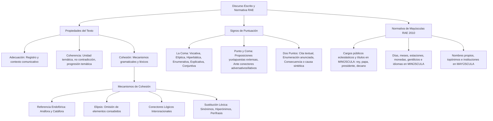

# TEMA 07: DISCURSO ESCRITO Y NORMATIVA: PROPIEDADES TEXTUALES, SIGNOS DE PUNTUACIÓN Y USO DE MAYÚSCULAS Y MINÚSCULAS

---

## 1. PORTADA Y METADATOS CURRICULARES

| Campo | Detalle |
| :--- | :--- |
| **Eje Temático** | Eje 06: Comunicación |
| **Materia** | Lenguaje (Normativa y Lingüística del Texto) |
| **Nivel de Dificultad** | Preuniversitario Avanzado (UNSA / UNMSM / UNI) |
| **Tiempo de Estudio Recomendado** | 4.5 horas |
| **Resolución Curricular** | R.C.U. N.° 0028-2026 (Admisión 2027) |
| **Prerrequisitos** | Fonología y Ortografía (Tema 03), Sintaxis (Temas 05 y 06) |
| **Objetivo Pedagógico** | Dominar los principios de adecuación, coherencia y cohesión textual (mecanismos de referencia endofórica y sustitución léxica), las reglas rigurosas de puntuación (normas de la coma, punto y coma, dos puntos) y la normativa académica actualizada (Ortografía RAE 2010) sobre el empleo de letras mayúsculas y minúsculas. |

---

## 2. MAPA CONCEPTUAL SINTÉTICO (MERMAID)



---

## 3. FUNDAMENTACIÓN TEÓRICA RIGUROSA

### 3.1. Propiedades Fundamentales del Texto
Un texto es una unidad comunicativa máxima emitida por un hablante en una situación concreta con intención comunicativa. Posee tres propiedades constitutivas indispensables:

1. **Adecuación:** Adaptación del texto al contexto comunicativo, al perfil del destinatario y al canal. Exige elegir el registro lingüístico pertinente (formal, académico, coloquial) y respetar las convenciones de género discursivo.
2. **Coherencia:** Dimensión semántica y lógica del texto. Garantiza que el mensaje sea percibido como una unidad con sentido global.
   - *Principio de no contradicción:* Las ideas no deben entrar en colisión lógica.
   - *Principio de relación temática:* Todo enunciado debe guardar relación con el tema central (*tópico*).
   - *Principio de progresión temática:* El texto debe balancear la información conocida (*tema*) con información nueva aportada progresivamente (*rema*).
3. **Cohesión:** Dimensión sintáctica y léxica del texto. Es la red de conexiones explícitas que ligan las oraciones y párrafos entre sí.

---

### 3.2. Mecanismos de Cohesión Textual

#### A. Referencia Endofórica (Anáfora y Catáfora)
- **Anáfora:** Mecanismo en el que un pronombre, adverbio o determinante asume el significado de una palabra mencionada *previamente* en el texto:
  $$\text{Antecedente} \longrightarrow \mathbf{Elemento \ Anaf\acute{o}rico}$$
  *Ejemplo:* *Mario Vargas Llosa escribió La ciudad y los perros; **este** [anáfora] le valió reconocimiento mundial.*
- **Catáfora:** Mecanismo en el que un elemento anticipa a una palabra o frase que será explicada *posteriormente*:
  $$\mathbf{Elemento \ Cataf\acute{o}rico} \longrightarrow \text{Término Consecuente}$$
  *Ejemplo:* *Solo necesitas **tres cosas** para triunfar: disciplina, perseverancia y método.*

#### B. Elipsis y Sustitución Léxica
- **Elipsis:** Supresión intencionada de un elemento verbal o nominal fácilmente recuperable por el contexto para evitar redundancias fatigosas:
  *Mariano Melgar escribió yaravíes; Carlos Augusto Salaverry, poemas románticos.* (Elipsis del verbo *escribió* representada por la coma elíptica).
- **Sustitución Léxica:** Reemplazo de un término por un sinónimo (*médico* por *galeno*), un hiperónimo (*perro* por *animal*), o una perífrasis designativa (*Arequipa* por *la Ciudad Blanca*).

---

### 3.3. Normativa de Signos de Puntuación (Ortografía RAE)

#### A. La Coma ($,$) y sus Clases Canónicas

| Tipo de Coma | Función y Regla Ortográfica | Ejemplo Ilustrativo |
| :--- | :--- | :--- |
| **Coma Enumerativa** | Separa elementos análogos de una serie sintáctica, salvo los precedidos por *y, e, ni, o, u*. | *Compró cuadernos, lápices, borradores y reglas.* |
| **Coma Vocativa** | Aísla al interlocutor (vocativo) al que se dirige el emisor, sin importar su posición (inicio, medio o final). | ***Jóvenes**, luchen por sus sueños.* / *Luchen, **jóvenes**, por sus sueños.* |
| **Coma Elíptica** | Reemplaza a un verbo omitido que ya fue mencionado con anterioridad. | *Ella postula a Medicina; él, a Derecho.* |
| **Coma Explicativa / Incidental** | Encierra aclaraciones, aposiciones explicativas o precisiones accesorias. | *Arequipa, **tierra de volcanes**, fue fundada en 1540.* |
| **Coma Hiperbática** | Marca la alteración del orden lógico oracional cuando el Complemento Circunstancial se antepone al sujeto. | *Con mucho entusiasmo y dedicación, los alumnos repasaron la lección.* |
| **Coma Conjuntiva / Nexo** | Antecede a conjunciones adversativas breves (*pero, mas, sino*) o ilativas (*conque, luego*), o encierra locuciones adverbiales (*sin embargo, es decir, por ende*). | *Estudió con ahínco, **pero** no alcanzó el puntaje.* / *Rindió el examen; **por ende**, esperará los resultados.* |

> **PROHIBICIÓN ABSOLUTA RAE (Coma Criminal):** Está terminantemente prohibido colocar coma entre el **Sujeto** y el **Verbo Principal**, o entre el **Verbo** y su **Objeto Directo**:
> - *Incorrecto:* $\times$ *Los alumnos de la facultad de medicina, salieron temprano.*
> - *Correcto:* $\checkmark$ *Los alumnos de la facultad de medicina salieron temprano.*

#### B. El Punto y Coma ($;$)
1. **Separación de proposiciones yuxtapuestas complejas:** Cuando entre las oraciones ya existen comas internas:
   *Cada grupo presentó su proyecto: el primero, sobre biotecnología; el segundo, sobre física nuclear.*
2. **Ante conectores adversativos, concesivos o ilativos extensos:** Ante conectores como *sin embargo*, *no obstante*, *por consiguiente*, *en consecuencia*, cuando la oración anterior posee cierta extensión:
   *Los postulantes prepararon la prueba durante más de diez meses consecutivos**; sin embargo,** el nivel de exigencia superó toda expectativa previa.*

#### C. Los Dos Puntos ($:$)
1. **Tras anunciar una enumeración:** *Compró tres materiales indispensables: cemento, yeso y arena fina.* (No deben emplearse si la enumeración no tiene elemento anticipador: *Incorrecto:* $\times$ *Compró: cemento, yeso y arena*).
2. **Precediendo a citas textuales literales:** *Sócrates sentenció: «Solo sé que nada sé».*
3. **Causa, efecto o conclusión sintética entre proposiciones:**
   *No entrenó adecuadamente durante las semanas previas: perdió la competencia por amplia ventaja.*

---

### 3.4. Normativa Académica de Letras Mayúsculas y Minúsculas (RAE 2010)

#### A. Minúscula Obligatoria en Casos Comúnmente Erróneos
1. **Cargos públicos, políticos, eclesiásticos o militares:** Van siempre en **minúscula**, vayan o no acompañados del nombre propio:
   *el presidente del Perú*, *el papa Francisco*, *el rey Felipe VI*, *el ministro de Economía*, *el arzobispo de Arequipa*, *el decano de la facultad*.
2. **Gentilicios, idiomas, días de la semana, meses y estaciones del año:**
   *peruano, arequipeño, inglés, castellano, lunes, diciembre, primavera, verano*.
3. **Puntos cardinales cuando designan la dirección o posición:**
   *rumbo al norte*, *viento del sur*, *el este de la ciudad* (Solo en mayúscula si forman parte de un nombre propio o entidad geopolítica: *América del Norte*, *Corea del Sur*).
4. **Tratamientos de cortesía en forma desarrollada:**
   *usted, señor, don, excelencia, reverendo* (En mayúscula solo sus abreviaturas: *Ud., Sr., D., Excma.*).

#### B. Mayúscula Inicial Obligatoria
1. **Nombres propios de personas, animales, topónimos y accidentes geográficos:**
   *Mariano Melgar*, *Arequipa*, *el río Chili* (nótese: *río* en minúscula, *Chili* en mayúscula), *el volcán Misti*, *el océano Pacífico*, *la cordillera de los Andes*.
2. **Nombres de asignaturas y carreras universitarias en contextos formales/académicos:**
   *Ingeniería Civil*, *Derecho Constitucional*, *Química Orgánica*.
3. **Títulos de obras de creación (libros, películas, canciones, pinturas):**
   Solo lleva mayúscula la **primera palabra** y los nombres propios contenidos en el título:
   *Cien años de soledad*, *La ciudad y los perros*, *Crimen y castigo*, *El mundo es ancho y ajeno*. (Salvo publicaciones periódicas: *El Comercio*, *La República*).
4. **Nombres de épocas históricas, movimientos cívico-militares y acontecimientos relevantes:**
   *el Renacimiento*, *la Edad Media*, *la Revolución Francesa*, *la Guerra del Pacífico*.

---

## 4. FÓRMULAS, TAXONOMÍAS Y LEYES FUNDAMENTALES

### 4.1. Regla de Oro del Orden Sintáctico Canónico y la Coma Hiperbática

$$\text{Orden Natural:} \quad \mathbf{Sujeto} + \mathbf{Verbo} + \mathbf{OD/OI} + \mathbf{CC} \quad (\text{Sin Comas})$$

$$\text{Orden Invertido:} \quad \mathbf{CC \ Extenso} \ , \quad \mathbf{Sujeto} + \mathbf{Verbo} + \mathbf{OD/OI} \quad (\mathbf{Coma \ Hiperb\acute{a}tica \ Obligatoria})$$

---

## 5. CASOS PRÁCTICOS Y MODELIZACIONES DEL MUNDO REAL

### Caso 1: La "Coma Asesina" en Veredictos Judiciales
Un juez redactó en su minuta original de sentencia:
> *"Perdón imposible, que cumpla la condena."*
Si por un error de tipeo un secretario judicial hubiera colocado la coma tras la primera palabra:
> *"Perdón, imposible que cumpla la condena."*
- **Análisis Pragmático-Sintáctico:** La primera formulación rechaza el indulto y ordena la prisión inmediata; la segunda concede el indulto y declara imposible la condena carcelaria. Una coma cambia el sentido polar del fallo judicial y la libertad de un ser humano.

---

## 6. PRE-UNIVERSITY HACKS Y MNEMOTÉCNIAS

### 1. El Hack de los Cargos RAE: "Nadie es más que la minúscula"
Sin importar la jerarquía social, política, monárquica o religiosa:
$$\mathbf{p}\text{residente}, \ \mathbf{p}\text{apa}, \ \mathbf{r}\text{ey}, \ \mathbf{a}\text{lcalde}, \ \mathbf{m}\text{inistro} \longrightarrow \mathbf{Siempre \ en \ min\acute{u}scula}$$

### 2. Mnemotécnia de las Comas Clave: "V-E-H-I"
- **V**ocativa: Aísla al oyente (*Atiende, alumno*).
- **E**líptica: Reemplaza al verbo omitido (*Yo estudio; él, duerme*).
- **H**iperbática: Marca el desorden oracional del CC (*Ayer por la tarde, llovió*).
- **I**ncidental / Explicativa: Aclara entre pausas (*Arequipa, cuna de juristas, celebró*).

---

## 7. ERRORES FRECUENTES Y TRAMPAS DE EXAMEN

1. **La Coma Criminal (Sujeto y Verbo):**
   - *Error:* *"Los postulantes con los puntajes más altos del examen de admisión, recibirán becas integrales."*
   - *Explicación RAE:* Jamás se interrumpe la unión de sujeto y verbo con coma simple, por más extenso que sea el sujeto.
2. **Mayúsculas en Títulos de Libros (Influencia Anglosajona):**
   - *Error (Calco del inglés):* $\times$ *La Ciudad Y Los Perros*, $\times$ *Cien Años De Soledad*.
   - *Norma Española RAE:* $\checkmark$ *La ciudad y los perros*, $\checkmark$ *Cien años de soledad* (solo la primera letra en mayúscula).
3. **Puntuación con comillas y puntos:**
   - *Norma Académica del Español:* El punto va siempre **fuera** de las comillas de cierre:
     *El decano exclamó: «Bienvenidos a la universidad».* (Nunca: *«...universidad.»*).

---

## 8. 5 PROBLEMAS RESUELTOS GRADUADOS

### Problema 1 (Nivel Básico: Uso de la Coma Vocativa)
Identifique la oración que presenta un uso correcto de la coma vocativa:
- A) Estimados alumnos, ingresarán al aula puntualmente.
- B) Entreguen inmediatamente, sus exámenes a los profesores.
- C) Por favor, jóvenes, guarden absoluto silencio durante la prueba.
- D) El profesor de química, explicó detalladamente la reacción redox.
- E) Todos los postulantes que vinieron temprano, ocuparon las primeras filas.

**Resolución:**
- En A: *Estimados alumnos* es el sujeto, no vocativo; se ha puesto coma criminal entre sujeto y verbo.
- En B: Se ha colocado coma entre el verbo (*Entreguen*) y su OD (*sus exámenes*).
- En D: Coma criminal entre sujeto y verbo.
- En E: Coma criminal tras proposición adjetiva que conforma el sujeto.
- En C: La palabra *jóvenes* es el vocativo (interlocutor al que se exhorta) y se encuentra correctamente aislada entre dos comas en posición medial.
**Respuesta:** **C**

---

### Problema 2 (Nivel Intermedio: Cohesión y Referencia Endofórica)
En el siguiente fragmento: *"El volcán Misti domina la campiña arequipeña; este coloso andino cautiva a los visitantes, quienes contemplan su silueta al atardecer"*, las palabras subrayadas *este coloso andino* y *su* cumplen respectivamente la función de:
- A) Catáfora y elipsis
- B) Anáfora y anáfora
- C) Catáfora y anáfora
- D) Hiperónimo y catáfora
- E) Elipsis y pleonasmo

**Resolución:**
1. *este coloso andino* retoma y refiere a un término mencionado con anterioridad: *El volcán Misti*. Es una referencia **anafórica** (mediante sustitución sinonímica/perifrástica).
2. El determinante posesivo *su* (en *su silueta*) refiere igualmente al *Misti* ya citado con anterioridad. Por tanto, es también un elemento **anafórico**.
Ambos mecanismos operan como anáforas de cohesión discursiva.
**Respuesta:** **B**

---

### Problema 3 (Nivel Intermedio-Avanzado: Uso de Mayúsculas RAE 2010)
Señale la alternativa que exhibe un empleo estrictamente riguroso de las letras mayúsculas y minúsculas:
- A) El Papa Francisco visitará el Perú el próximo Verano.
- B) En la Facultad de Medicina, el Decano felicitó a los ingresantes.
- C) El presidente de la república promulgó la ley en el Palacio de Gobierno.
- D) El Río Amazonas desemboca con caudal imponente en el Océano Atlántico.
- E) Leí con fascinación la obra Tradiciones Peruanas de Ricardo Palma.

**Resolución:**
- En A: *Papa* y *Verano* deben escribirse con minúscula obligatoria (*el papa Francisco*, *verano*).
- En B: *Decano* es cargo, debe ir en minúscula (*el decano*).
- En D: El sustantivo genérico *río* debe ir en minúscula (*el río Amazonas*).
- En E: En los títulos de libros en español solo lleva mayúscula la primera palabra (*Tradiciones peruanas*).
- En C: *presidente* va en minúscula (cargo), *Palacio de Gobierno* en mayúscula (sede institucional histórica). Está perfectamente redactada según RAE.
**Respuesta:** **C**

---

### Problema 4 (Nivel Avanzado: Puntuación Integral y Dos Puntos)
Determine cuál de los siguientes enunciados presenta un uso ortográficamente intachable de los dos puntos:
- A) Los requisitos solicitados para la matrícula son: certificado de estudios y partida de nacimiento.
- B) Mi padre siempre repetía el célebre adagio: «Al que madruga, Dios lo ayuda».
- C) Todos los postulantes deben traer: lápiz, borrador, tajador y documento de identidad.
- D) Se compraron: cuadernos, carpetas y plumones para la nueva aula.
- E) El conferencista disertó sobre: la historia y evolución de la literatura universal.

**Resolución:**
Según la Ortografía de la RAE (2010), está prohibido colocar dos puntos entre el verbo y sus complementos si no hay un elemento anticipador o sintetizador previo (A, C, D y E cometen este error al romper el nexo directo del verbo con su OD o régimen preposicional).
En cambio, en **B**, los dos puntos introducen una cita textual directa entrecomillada precedida por un verbo de dicción y un sustantivo anunciador (*adagio:*). Su uso es plenamente canónico.
**Respuesta:** **B**

---

### Problema 5 (Nivel 5: Reto Titán / Jefe Final de Admisión - UNSA / UNMSM)
Analice con rigor el siguiente texto y determine el número de errores normativos de puntuación y mayúsculas que contiene:
> *"El Rey de España, y el Presidente francés llegaron a Arequipa, la ciudad blanca; para inaugurar el congreso internacional de la lengua española en Primavera."*

- A) 4 errores
- B) 5 errores
- C) 6 errores
- D) 7 errores
- E) 8 errores

**Resolución Paso a Paso:**
Examinemos minuciosamente cada elemento según la RAE:
1. *"El **Rey**..."* $\rightarrow$ **Error 1:** Los cargos y títulos de nobleza van en minúscula (*el rey*).
2. *"...de España**, y** el..."* $\rightarrow$ **Error 2:** No debe colocarse coma antes de la conjunción copulativa *y* cuando une dos elementos análogos que forman parte del mismo sujeto compuesto.
3. *"...el **Presidente**..."* $\rightarrow$ **Error 3:** Los cargos públicos de estado van en minúscula (*el presidente*).
4. *"...la **ciudad blanca**..."* $\rightarrow$ **Error 4:** Es un antonomástico/epíteto geográfico consagrado de Arequipa; debe escribirse con mayúsculas iniciales: *la Ciudad Blanca*.
5. *"...la Ciudad Blanca**; para** inaugurar..."* $\rightarrow$ **Error 5:** Es impropio el uso del punto y coma para conectar una oración principal con una proposición subordinada adverbial de finalidad; debe ir coma o enlace directo sin puntuación (*la Ciudad Blanca para inaugurar...*).
6. *"...el **congreso internacional de la lengua española**..."* $\rightarrow$ **Error 6:** Al ser el nombre formal de un certamen internacional oficial, los sustantivos y adjetivos que lo componen deben llevar mayúscula inicial: *Congreso Internacional de la Lengua Española*.
7. *"...en **Primavera**."* $\rightarrow$ **Error 7:** Los nombres de las cuatro estaciones del año se escriben preceptivamente con minúscula (*primavera*).
Total exacto de incorrecciones normativas: **7 errores**.
**Respuesta:** **D**

---

## 9. GLOSARIO TÉCNICO ESPECIALIZADO

1. **Adecuación:** Propiedad textual que evalúa la congruencia del enunciado con la situación comunicativa, el canal y el registro social del auditorio.
2. **Anáfora:** Mecanismo cohesivo de referencia endofórica en el cual un elemento lingüístico remite a una unidad expresada con anterioridad en el texto.
3. **Catáfora:** Fenómeno de anticipación semántica en el discurso donde una palabra anuncia a un elemento que se explicitará con posterioridad.
4. **Coherencia:** Cualidad semántica estructural que dota a un texto de sentido unitario, no contradicción y progresión lógica de la información.
5. **Cohesión:** Red formal de mecanismos léxicos y gramaticales (conectores, signos de puntuación, deixis) que entrelazan los constituyentes de un texto.
6. **Coma Criminal:** Incorrección ortográfica consistente en intercalar una coma entre el sujeto y el verbo principal, o entre el verbo y su objeto directo.
7. **Coma Elíptica:** Signo de puntuación que señala gráficamente la omisión voluntaria de un verbo sobreentendido o previamente enunciado.
8. **Coma Hiperbática:** Marca gráfica que señala el desorden del orden sintáctico canónico oracional al anteponerse un complemento circunstancial extenso.
9. **Elipsis:** Supresión elocutiva de una palabra o frase dentro del texto que el receptor puede reconstruir contextualmente sin pérdida de inteligibilidad.
10. **Progresión Temática:** Articulación dinámica de un texto en el cual la información conocida (*tema*) se vincula secuencialmente con aportes de información nueva (*rema*).

---

## 10. FLASHCARDS DE REPASO ACTIVO

| Front (Pregunta / Disparador) | Back (Respuesta Nemotécnica / Precisa) |
| :--- | :--- |
| ¿Cómo deben escribirse los cargos de presidente, rey, papa o ministro según la RAE 2010? | Obligatoriamente en **minúscula**, vayan o no acompañados por el nombre propio. |
| ¿Qué es la "Coma Criminal" y por qué está prohibida? | Es la coma puesta entre **Sujeto y Verbo** o entre **Verbo y Objeto Directo**. Destruye la cohesión sintáctica básica del núcleo oracional. |
| ¿Cómo se puntúan las citas textuales introducidas por dos puntos? | Los dos puntos van antes de abrir comillas y el punto final de la oración se coloca **después** de cerrar las comillas (*Dijo: «Hola».*). |
| ¿Cuál es la diferencia entre Anáfora y Catáfora? | La **anáfora** señala hacia **atrás** (recuerda un antecedente); la **catáfora** apunta hacia **adelante** (anticipa un consecuente). |
| ¿Los nombres de días, meses y estaciones del año llevan mayúscula en español? | **No**, se escriben preceptivamente con **minúscula** (*lunes, marzo, primavera*). |

---

## 11. PREGUNTAS DE AUTOEVALUACIÓN RÁPIDA

1. En la expresión: *"Solo compraré dos cosas: el libro y el cuaderno"*, la palabra subrayada *"dos cosas"* constituye un mecanismo de cohesión denominado:
   - A) Anáfora
   - B) Catáfora
   - C) Elipsis verbal
   - D) Coma hiperbática
   - *Respuesta correcta:* **B** (Anticipa a los elementos consecuentes que serán explicitados tras los dos puntos).
2. ¿Cuál de las siguientes palabras debe escribirse siempre en minúscula según la norma académica?
   - A) Renacimiento
   - B) Revolución Francesa
   - C) Papa (autoridad eclesiástica)
   - D) Arequipa
   - *Respuesta correcta:* **C** (Todos los cargos públicos y religiosos se escriben con minúscula).
3. En la oración *"Ayer, María aprobó el examen"*, la coma empleada es:
   - A) Vocativa
   - B) Elíptica
   - C) Hiperbática
   - D) Apositiva
   - *Respuesta correcta:* **C** (Marca la anteposición del complemento circunstancial de tiempo *Ayer*).

---

## 12. BLOQUE DE INTEGRACIÓN KMP / GAMIFICACIÓN (JSON)

```json
{
  "tema_id": "LENG_07",
  "eje_tematico": "06_COMUNICACION",
  "curso": "LENGUAJE",
  "titulo_tema": "Discurso Escrito y Normativa: Propiedades Textuales, Signos de Puntuación y Mayúsculas/Minúsculas",
  "dificultad": "Avanzado",
  "xp_recompensa": 250,
  "habilidades_evaluadas": [
    "Detección y erradicación de la Coma Criminal",
    "Diferenciación entre anáfora, catáfora y elipsis",
    "Uso de mayúsculas en cargos, gentilicios y obras",
    "Reglas de dos puntos y punto y coma según RAE 2010"
  ],
  "boss_challenge": {
    "boss_name": "El Inquisidor Ortográfico de la Real Academia",
    "vida_boss": 3400,
    "ataque_especial": "Lanza de Comas Asesinas y Trampa de Títulos en Mayúscula",
    "pregunta_reto": "¿Cuál es la opción que cumple a la perfección la normativa RAE sobre mayúsculas y puntuación?",
    "opciones": [
      "El Presidente visitó la ciudad blanca, el pasado Lunes.",
      "El decano de la facultad señaló: «Iniciaremos las clases el próximo mes».",
      "Los estudiantes que obtuvieron las becas, viajarán a España.",
      "Compró: manzanas, uvas y plátanos en el mercado mayorista."
    ],
    "respuesta_correcta_index": 1,
    "explicacion_gamificada": "¡Golpe Maestro! 'El decano...' usa minúscula en el cargo, introduce la cita con dos puntos y ubica el punto final correctamente después de cerrar las comillas. En las otras hay coma criminal, dos puntos sin anticipador o mayúsculas impropias."
  }
}
```
