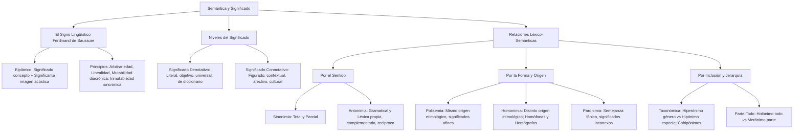

# TEMA 08: SEMÁNTICA Y LEXICOLOGÍA: EL SIGNO LINGÜÍSTICO, DENOTACIÓN/CONNOTACIÓN Y RELACIONES LÉXICO-SEMÁNTICAS

---

## 1. PORTADA Y METADATOS CURRICULARES

| Campo | Detalle |
| :--- | :--- |
| **Eje Temático** | Eje 06: Comunicación |
| **Materia** | Lenguaje (Semántica y Lexicología) |
| **Nivel de Dificultad** | Preuniversitario Avanzado (UNSA / UNMSM / UNI) |
| **Tiempo de Estudio Recomendado** | 4.5 horas |
| **Resolución Curricular** | R.C.U. N.° 0028-2026 (Admisión 2027) |
| **Prerrequisitos** | Morfología (Tema 04), Fonología y Sintaxis (Temas 03, 05 y 06) |
| **Objetivo Pedagógico** | Comprender la naturaleza biplánica y principios del signo lingüístico saussureano; discriminar con precisión quirúrgica el significado denotativo y connotativo; y dominar la taxonomía completa de las relaciones léxico-semánticas: polisemia, homonimia (homografía y homofonía), sinonimia, antonimia (propia, complementaria, recíproca), paronimia, hiperonimia/hiponimia/cohiponimia y holonimia/meronimia. |

---

## 2. MAPA CONCEPTUAL SINTÉTICO (MERMAID)



---

## 3. FUNDAMENTACIÓN TEÓRICA RIGUROSA

### 3.1. Teoría del Signo Lingüístico (Ferdinand de Saussure)
El **signo lingüístico** es una entidad psíquica de dos caras (biplánica) que asocia indisolublemente dos planos en la mente del hablante:
1. **El Significado ($Plano \ del \ Contenido$):** Es el concepto abstracto, la representación mental o la idea asociada al signo.
2. **El Significante ($Plano \ de \ la \ Expresi\acute{o}n$):** Es la imagen acústica, la huella psíquica mental de la cadena de fonemas (no el sonido físico per se, que pertenece al habla).

```
        ┌──────────────────────────────────┐
        │        SIGNO LINGÜÍSTICO         │
        │   ┌──────────────────────────┐   │
        │   │  Significado (Concepto)  │   │
        │   ├──────────────────────────┤   │
        │   │ Significante (Img. Acúst)│   │
        │   └──────────────────────────┘   │
        └──────────────────────────────────┘
```

#### Principios Fundamentales del Signo Lingüístico:
- **Arbitrariedad:** No existe ningún lazo natural, motivado o causal entre el significado y el significante. La unión es fruto de una convención social tácita histórica. Se comprueba por la existencia de diversas lenguas para un mismo concepto (*árbol*, *tree*, *arbre*, *mallki*).
- **Linealidad del Significante:** Al desarrollarse en el tiempo o el espacio fonético, los fonemas del significante se suceden linealmente uno tras otro en una cadena temporal unidimensional; jamás pueden articularse en paralelo simultáneo.
- **Mutabilidad (Diacronía):** A lo largo del tiempo histórico, la lengua cambia; los signos modifican su significante, su significado o ambos (del latín *oculum* al español *ojo*).
- **Inmutabilidad (Sincronía):** En un momento histórico sincrónico dado, ningún hablante individual puede alterar caprichosamente el código lingüístico de su comunidad de habla.
- **Doble Articulación (André Martinet):**
  - *Primera articulación:* Unidades mínimas con significado (**Morfemas**).
  - *Segunda articulación:* Unidades mínimas distintivas sin significado (**Fonemas**).

---

### 3.2. Denotación vs. Connotación
- **Significado Denotativo:** Significado primario, literal, objetivo, institucionalizado en el diccionario y desprovisto de carga afectiva subjetiva. Es común a toda la comunidad hablante al margen de valoraciones personales.
  *Ejemplo:* *"El corazón bombea sangre oxigenada a todo el organismo."*
- **Significado Connotativo:** Significado secundario, figurado, metafórico, subjetivo o cultural que adquiere una palabra según el contexto pragmático y afectivo de los interlocutores.
  *Ejemplo:* *"Ese profesor tiene un corazón de oro al enseñar a sus estudiantes."*

---

### 3.3. Relaciones Léxico-Semánticas Fundamentales

#### A. Polisemia vs. Homonimia (La Distinción Reina de Exámenes de Admisión)
- **Polisemia:** Fenómeno por el cual un **único lexema** posee múltiples significados que guardan un **rasgo sémico común** (afinidad semántica) y comparten una **misma raíz etimológica**.
  *Ejemplos:*
  - *Pico:* 1. Parte córnea de la boca de las aves; 2. Herramienta puntiaguda para cavar; 3. Cúspide puntiaguda de una montaña. (Sema común: *forma puntiaguda o terminada en punta*; misma entrada en el diccionario).
- **Homonimia:** Coincidencia fónica o gráfica accidental entre dos palabras de **orígenes etimológicos totalmente distintos**, sin rasgo sémico común (entradas separadas en el diccionario).
  1. **Homónimas Homógrafas:** Misma escritura y misma pronunciación, pero distinto origen y significado:
     - *Lima* (fruta cítrica, del árabe *laymūn*).
     - *Lima* (herramienta de desbaste, del latín *lima*).
     - *Lima* (capital del Perú, del quechua *Rímac*).
  2. **Homónimas Homófonas:** Misma pronunciación, distinta escritura y significado:
     - *Tubo* (sustantivo: cilindro hueco) vs. *Tuvo* (del verbo tener).
     - *Cima* (cumbre más alta) vs. *Sima* (abismo profundo).
     - *Basto* (tosco, grosero) vs. *Vasto* (amplio, extenso).

#### B. Sinonimia y Antonimia
1. **Sinonimia:** Identidad o proximidad semántica entre dos o más significantes distintos.
   - *Total o Absoluta:* Intercambiables en todos los contextos sin alteración semántica (extremadamente rara: *tubérculo / patata* en botánica; *odontólogo / dentista*).
   - *Parcial o Relativa:* Intercambiables solo en determinados contextos: *comprar / adquirir* (*adquirió conocimientos*, no se suele decir *compró conocimientos*).
2. **Antonimia:** Oposición semántica entre dos palabras.
   - *Gramatical (o Morfológica):* Se genera por prefijos de negación (*lógico/ilógico*, *hacer/deshacer*, *fiel/infiel*).
   - *Léxica Propia (Gradual):* Admite grados intermedios (*blanco/negro* $\rightarrow$ gris; *frío/caliente* $\rightarrow$ tibio).
   - *Léxica Complementaria:* La afirmación de uno implica obligatoriamente la negación absoluta del otro, sin grados intermedios (*vivo/muerto*, *soltero/casado*, *par/impar*).
   - *Léxica Recíproca (Inversa):* La existencia de uno presupone necesariamente la existencia correlativa del otro (*comprador/vendedor*, *padre/hijo*, *dar/recibir*).

#### C. Paronimia
Palabras de significado completamente diferente que presentan semejanza fónica y gráfica (fácilmente confundibles):
- *Aptitud* (capacidad o destreza) vs. *Actitud* (disposición de ánimo).
- *Adoptar* (acoger) vs. *Adaptar* (acomodar).
- *Inocuo* (que no hace daño) vs. *Inicuo* (injusto, perverso).

---

### 3.4. Relaciones de Inclusión y Jerarquía: Taxonomía y Meronimia

```
          ┌────────────────────────────────────────────────────────┐
          │             RELACIONES DE INCLUSIÓN                    │
          └───────────────────────────┬────────────────────────────┘
                         ┌────────────┴────────────┐
                         ▼                         ▼
              ┌─────────────────────┐   ┌─────────────────────┐
              │     Taxonómica      │   │     Parte-Todo      │
              │  (Género - Especie) │   │  (Meronimia/Holon)  │
              └──────────┬──────────┘   └──────────┬──────────┘
                         ├─ Hiperónimo             ├─ Holónimo
                         │  (Flor)                 │  (Bicicleta)
                         ├─ Hipónimo               ├─ Merónimo
                         │  (Rosa, Clavel)         │  (Pedal, Cadena)
                         └─ Cohipónimos            └─ Partes integrantes
                            (Rosa y Clavel)
```

1. **Hiperonimia e Hiponimia (Género - Especie):**
   - **Hiperónimo:** Término de mayor amplitud semántica que engloba a otros (*Árbol*).
   - **Hipónimo:** Término de menor extensión semántica subordinado a un hiperónimo (*Queñua, sauce, eucalipto*).
   - **Cohipónimos:** Relación de equivalencia entre hipónimos del mismo hiperónimo (*La queñua y el sauce son cohipónimos*).
2. **Holonimia y Meronimia (Todo - Parte):**
   - **Holónimo:** Palabra que nombra a un objeto o entidad completa en su totalidad (*Cuerpo humano*, *Automóvil*).
   - **Merónimo:** Palabra que nombra una parte integrante o componente físico del holónimo (*Brazo*, *mano* son merónimos de *cuerpo humano*; *volante*, *motor* son merónimos de *automóvil*).

---

## 4. FÓRMULAS, TAXONOMÍAS Y LEYES FUNDAMENTALES

### 4.1. Cuadro Diferencial de Oposiciones Antónimas

$$\begin{array}{|l|l|l|}
\hline
\textbf{Tipo de Antonimia} & \textbf{Criterio Semántico} & \textbf{Prueba Lógica} \\ \hline
\text{Propia (Gradual)} & \text{Admite términos intermedios} & A \implies \neg B, \ \text{pero} \ \neg A \not\implies B \ (\text{tibio}) \\ \hline
\text{Complementaria} & \text{Exclusión mutua binaria estricta} & A \iff \neg B \ (\text{vivo} \iff \text{no muerto}) \\ \hline
\text{Recíproca (Inversa)} & \text{Direccionalidad correlativa mutua} & A(x, y) \iff B(y, x) \ (\text{X es padre de Y} \iff \text{Y es hijo de X}) \\ \hline
\end{array}$$

---

## 5. CASOS PRÁCTICOS Y MODELIZACIONES DEL MUNDO REAL

### Caso 1: Resolución de Ambigüedades Semánticas en la Propiedad Intelectual
En una patente biotecnológica se describe:
> *"Se utilizó la **planta** para la extracción de alcaloides purificados."*
- **Análisis Lexicológico:** La palabra *planta* es polisémica:
  1. *Planta:* Organismo vivo del reino vegetal (afinidad con tallo, raíz, fotosíntesis).
  2. *Planta:* Fábrica o instalación industrial de procesamiento químico.
- **Riesgo:** Si el contexto no precisa si la extracción ocurrió dentro de las instalaciones industriales (*planta física*) o a partir del espécimen botánico (*planta vegetal*), la patente es jurídicamente nula por ambigüedad léxica grave.

---

## 6. PRE-UNIVERSITY HACKS Y MNEMOTÉCNIAS

### 1. El Hack Definitivo: Polisemia vs. Homonimia
- Si los significados tienen algo en común en la forma, uso o función (rasgo sémico afín) $\rightarrow$ **POLISEMIA** (*ojo de aguja*, *ojo humano*).
- Si los significados no tienen nada que ver conceptualmente y provienen de raíces distintas $\rightarrow$ **HOMONIMIA** (*llama* animal / *llama* de fuego / *llama* del verbo llamar).

### 2. Mnemotécnia de Taxonomía vs. Parte/Todo
$$\mathbf{H}\text{ipónimo / Hiperónimo} \longrightarrow \textbf{ES UN} \quad (\text{El clavel \textbf{es una} flor})$$
$$\mathbf{M}\text{erónimo / Holónimo} \longrightarrow \textbf{FORMA PARTE DE} \quad (\text{El pedal \textbf{forma parte de} la bicicleta})$$

---

## 7. ERRORES FRECUENTES Y TRAMPAS DE EXAMEN

1. **Confundir Meronimia con Hiponimia:**
   - *Pregunta trampa:* *"Dedo es a mano como..."*
   - *Error común:* Pensar que *dedo* es hipónimo de *mano*.
   - *Realidad RAE:* Un dedo NO es una especie de mano; es una **parte anatómica física** de la mano. Por tanto, es una relación de **Meronimia/Holonimia**, no de Hiponimia/Hiperonimia.
2. **Confundir Homónimas Homófonas con Parónimas:**
   - *Cima / Sima:* Suenan exactamente igual $\rightarrow$ **Homófonas** (y a su vez antónimos).
   - *Aptitud / Actitud:* NO suenan igual, sólo parecido $\rightarrow$ **Parónimas**.
3. **Clasificación errónea de Antonimia Complementaria vs. Propia:**
   - *Soltero / Casado:* No existe "medio soltero" en el ámbito del estado civil $\rightarrow$ **Complementaria**.
   - *Gordo / Flaco:* Admite término medio (*de contextura media*) $\rightarrow$ **Propia o gradual**.

---

## 8. 5 PROBLEMAS RESUELTOS GRADUADOS

### Problema 1 (Nivel Básico: Denotación vs. Connotación)
Identifique la alternativa en la que la palabra *estrella* se utiliza con significado estrictamente denotativo:
- A) Aquel actor es la máxima estrella del cine latinoamericano.
- B) En el examen de cálculo, Juan demostró ser una estrella.
- C) El telescopio espacial captó la radiación emitida por una estrella distante.
- D) Ella nació con estrella y por eso todo le resulta favorable.
- E) Los periodistas persiguieron a la nueva estrella del balompié nacional.

**Resolución:**
- En A, B, D y E, la palabra *estrella* se usa metafóricamente para referirse a fama, talento excepcional o buena fortuna (significado connotativo).
- En C, *estrella* refiere al cuerpo celeste astronómico que brilla con luz propia en el universo (significado objetivo, primario y de diccionario). Es significado **denotativo**.
**Respuesta:** **C**

---

### Problema 2 (Nivel Intermedio: Homonimia vs. Polisemia)
Analice las siguientes parejas de palabras en contexto:
1. *El **banco** de crédito abrirá a las nueve* / *Se sentó a descansar en el **banco** del parque.*
2. *Remendó la **bota** de cuero* / *El ciudadano **vota** a conciencia en las elecciones.*
3. *Sintió un dolor agudo en el **pecho*** / *Caminó con el **pecho** erguido por el patio.*

Determine la relación léxico-semántica respectiva de cada pareja:
- A) Polisemia - Paronimia - Homonimia homógrafa
- B) Homonimia homógrafa - Homonimia homófona - Polisemia
- C) Polisemia - Homonimia homófona - Polisemia
- D) Homonimia homófona - Polisemia - Homonimia homógrafa
- E) Homonimia homógrafa - Paronimia - Sinonimia

**Resolución:**
1. *banco* (institución financiera) y *banco* (asiento largo): provienen de raíces etimológicas diferentes (germánico *bank* para asiento, e italiano *banca* para la mesa de cambio financiero) $\rightarrow$ **Homonimia homógrafa**.
2. *bota* (calzado) y *vota* (emitir voto): se pronuncian igual y se escriben diferente $\rightarrow$ **Homonimia homófona**.
3. *pecho* (zona anatómica torácica) y *pecho* (frente del torso como postura corporal): comparten la misma raíz latina *pectus* y rasgos sémicos directos $\rightarrow$ **Polisemia**.
Secuencia: Homonimia homógrafa - Homonimia homófona - Polisemia.
**Respuesta:** **B**

---

### Problema 3 (Nivel Intermedio-Avanzado: Tipos de Antonimia)
En el enunciado: *"El médico forense certificó que el paciente no estaba **vivo**, sino **muerto**"*, la relación de antonimia entre las palabras destacadas se clasifica como:
- A) Léxica propia o gradual
- B) Gramatical o morfológica
- C) Léxica complementaria
- D) Léxica recíproca o inversa
- E) Paronimia semántica

**Resolución:**
Las palabras *vivo* y *muerto* constituyen una oposición binaria excluyente: la negación de uno afirma obligatoriamente al otro sin la existencia de ningún estado biológico intermedio computable. Cumple la condición $A \iff \neg B$. Por consiguiente, es una **antonimia léxica complementaria**.
**Respuesta:** **C**

---

### Problema 4 (Nivel Avanzado: Hiperonimia, Hiponimia y Cohiponimia)
En el fragmento: *"Entre los **cetáceos**, el **delfín** y la **ballena** son considerados los mamíferos acuáticos con mayores habilidades cognitivas"*, los términos subrayados establecen respectivamente las relaciones de:
- A) Hiperónimo, merónimo y holónimo
- B) Holónimo, hipónimo e hiperónimo
- C) Hiperónimo, hipónimo y cohipónimo
- D) Cohipónimo, hiperónimo e hipónimo
- E) Merónimo, holónimo y cohipónimo

**Resolución:**
- *cetáceos* es la categoría zoológica superior o de género $\rightarrow$ **Hiperónimo**.
- *delfín* es una especie perteneciente al orden de los cetáceos $\rightarrow$ **Hipónimo** de cetáceo.
- *ballena* es otra especie del mismo orden $\rightarrow$ Es **cohipónimo** respecto al delfín (e hipónimo de cetáceo).
Por ende, la relación respectiva es Hiperónimo, hipónimo y cohipónimo.
**Respuesta:** **C**

---

### Problema 5 (Nivel 5: Reto Titán / Jefe Final de Admisión - UNSA / UNMSM)
Examine con extremo rigor las siguientes proposiciones referidas a las relaciones léxico-semánticas:
I. Las palabras *árbol* y *raíz* mantienen una relación semántica de hiperonimia e hiponimia respectivamente.
II. *Comprador* y *vendedor* manifiestan una antonimia léxica recíproca, puesto que la existencia conceptual de uno presupone necesariamente la del otro.
III. En el par *tubo* / *tuvo*, se verifica una homonimia homófona y a su vez paradigmática.
IV. Los vocablos *inicuo* (injusto) e *inocuo* (inofensivo) configuran un caso paradigmático de paronimia léxica.

Determine cuáles son rigurosamente **VERDADERAS**:
- A) I y III
- B) II y IV
- C) II, III y IV
- D) I, II y IV
- E) Solo II

**Resolución Paso a Paso:**
- **Proposición I (FALSA):** La raíz no es una *especie* de árbol (no podemos decir "la raíz es un árbol"). La raíz es una parte anatómica del árbol. La relación es de **Meronimia** (*raíz*) y **Holonimia** (*árbol*), no de hiperonimia/hiponimia.
- **Proposición II (VERDADERA):** No puede haber un acto de compra sin un comprador y un vendedor correlativos. Es el ejemplo canónico de **antonimia léxica recíproca o inversa**.
- **Proposición III (FALSA):** *Tubo* (sustantivo) y *tuvo* (verbo) pertenecen a categorías gramaticales distintas; la homonimia es léxica homófona, pero la homonimia paradigmática sólo ocurre dentro de los paradigmas de un mismo verbo (*yo cantaba* vs. *él cantaba*).
- **Proposición IV (VERDADERA):** *Inicuo* e *inocuo* presentan un significante fónicamente muy semejante con significados conceptuales disímiles. Es un caso típico de **paronimia**.
Por lo tanto, las proposiciones rigurosamente verdaderas son **II y IV**.
**Respuesta:** **B**

---

## 9. GLOSARIO TÉCNICO ESPECIALIZADO

1. **Antonimia Complementaria:** Oposición semántica binaria y excluyente donde la afirmación de un término anula forzosamente al otro sin grados intermedios.
2. **Antonimia Recíproca:** Oposición semántica donde dos términos se reclaman mutuamente desde perspectivas inversas (*maestro/alumno*).
3. **Arbitrariedad:** Principio saussureano que señala la falta de motivación o vínculo natural intrínseco entre el significado y el significante.
4. **Cohiponimia:** Relación semántica horizontal que vincula a dos o más hipónimos dependientes del mismo hiperónimo.
5. **Connotación:** Significado secundario, asociativo y cultural que adquiere una palabra por factores expresivos, emocionales o estilísticos.
6. **Denotación:** Significado literal, objetivo y estándar de una palabra, registrado como valor de base en los diccionarios.
7. **Holonimia:** Relación semántica que designa el todo respecto a las partes que lo constituyen (*árbol* respecto a *hoja*).
8. **Homonimia:** Coincidencia fónica o gráfica accidental de dos palabras con orígenes etimológicos y significados enteramente distintos.
9. **Meronimia:** Relación semántica que nombra la parte o componente respecto al todo (*teclado* respecto a *computadora*).
10. **Polisemia:** Propiedad de un signo lingüístico de poseer múltiples significados derivados de una misma raíz etimológica y un sema común.

---

## 10. FLASHCARDS DE REPASO ACTIVO

| Front (Pregunta / Disparador) | Back (Respuesta Nemotécnica / Precisa) |
| :--- | :--- |
| ¿Qué diferencia a la Polisemia de la Homonimia? | La **polisemia** comparte un sema común y el mismo origen etimológico (un solo lexema); la **homonimia** proviene de raíces etimológicas distintas sin relación conceptual. |
| ¿Cuál es la prueba lógica para la relación Merónimo-Holónimo? | Comprobar la fórmula: **"X forma parte de Y"**. (*El volante forma parte del auto* $\rightarrow$ volante = merónimo; auto = holónimo). |
| ¿Cuál es la diferencia entre antonimia propia y complementaria? | La **propia o gradual** admite matices intermedios (*frío / caliente*); la **complementaria** es excluyente sin término medio (*vivo / muerto*). |
| ¿Cuáles son las dos caras inseparables del Signo Lingüístico según Saussure? | El **Significado** (concepto mental) y el **Significante** (imagen acústica psíquica). |
| ¿Qué son palabras Parónimas? | Palabras de semejante pronunciación y escritura, pero significados totalmente disímiles (*aptitud* y *actitud*). |

---

## 11. PREGUNTAS DE AUTOEVALUACIÓN RÁPIDA

1. *"Pagaré la matrícula con la tarjeta del banco"*. En esta frase, la palabra *banco* frente a *banco* (asiento) es un caso de:
   - A) Polisemia
   - B) Homonimia homógrafa
   - C) Homonimia homófona
   - D) Paronimia
   - *Respuesta correcta:* **B** (Misma escritura, significados y orígenes etimológicos enteramente independientes).
2. Es un par de antónimos recíprocos:
   - A) Fiel / Infiel
   - B) Grande / Pequeño
   - C) Tío / Sobrino
   - D) Legal / Ilegal
   - *Respuesta correcta:* **C** (La condición de tío presupone necesariamente la existencia de un sobrino).
3. *"Mesa"* respecto a *"pata"* establece una relación de:
   - A) Hiperónimo a hipónimo
   - B) Holónimo a merónimo
   - C) Cohipónimos
   - D) Antónimos propios
   - *Respuesta correcta:* **B** (*Mesa* es el todo [holónimo] y *pata* es su parte física integrante [merónimo]).

---

## 12. BLOQUE DE INTEGRACIÓN KMP / GAMIFICACIÓN (JSON)

```json
{
  "tema_id": "LENG_08",
  "eje_tematico": "06_COMUNICACION",
  "curso": "LENGUAJE",
  "titulo_tema": "Semántica y Lexicología: Signo Lingüístico, Denotación y Relaciones Léxicas",
  "dificultad": "Avanzado",
  "xp_recompensa": 250,
  "habilidades_evaluadas": [
    "Distinción rigurosa entre polisemia y homonimia",
    "Identificación de tipos de antonimia (propia, complementaria, recíproca)",
    "Diferenciación entre taxonomía (hiponimia) y parte-todo (meronimia)",
    "Reconocimiento de principios saussureanos del signo lingüístico"
  ],
  "boss_challenge": {
    "boss_name": "El Esfinge Semántico de Saussure",
    "vida_boss": 3600,
    "ataque_especial": "Ilusión de Merónimos y Trampa de Homófonos Ocultos",
    "pregunta_reto": "¿Cuál es la relación semántica exacta entre 'hoja' y 'árbol'?",
    "opciones": [
      "Hipónimo a Hiperónimo",
      "Merónimo a Holónimo",
      "Cohipónimos de reino vegetal",
      "Polisemia morfológica"
    ],
    "respuesta_correcta_index": 1,
    "explicacion_gamificada": "¡Victoria impecable! Una hoja no es un tipo o especie de árbol (no es hipónimo), sino un constituyente físico y funcional del árbol (merónimo a holónimo). ¡Has dominado el Eje de Lenguaje!"
  }
}
```
