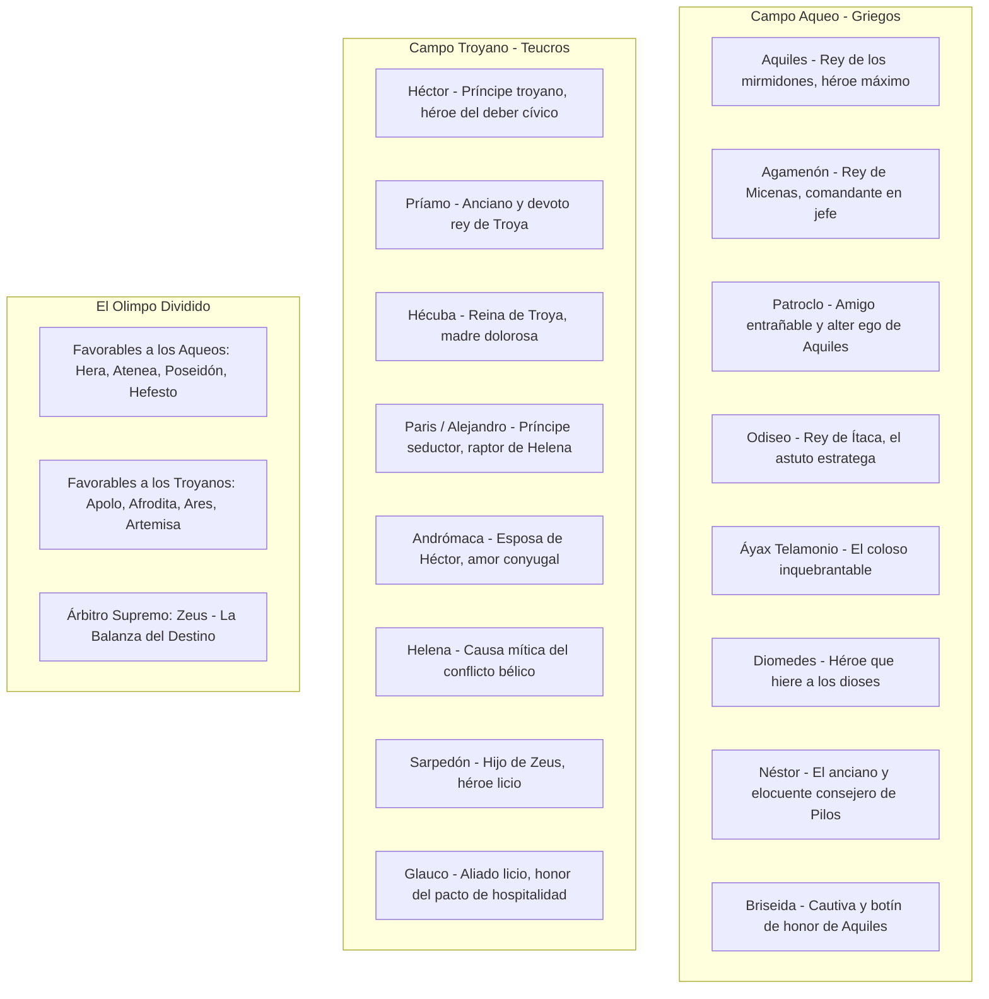

# SUPER-RESUMEN Y ANÁLISIS EXHAUSTIVO: *LA ILÍADA* (HOMERO)

---

## 1. FICHA TÉCNICA Y METADATOS DE LA OBRA

| Parámetro | Detalle Filológico y Curricular |
| :--- | :--- |
| **Título Original** | *Ἰλιάς* (*Iliás*, El poema de Ilión / Troya) |
| **Autor Atribuido** | **Homero** (Aedo ciego de Quíos o Esmirna, siglo VIII a.C.) |
| **Género Literario** | **Épico** (Epopeya clásica heroica) |
| **Estructura Métrica** | **24 Cantos o Rapsodias** (15,693 versos hexámetros dactílicos) |
| **Dialecto Lingüístico** | Griego homérico (Jonio con sustrato eolio y arcaísmos micénicos) |
| **Época y Contexto** | Época Arcaica griega; ambientada en la legendaria Guerra de Troya (Edad de Bronce micénica, ca. siglo XII a.C.) |
| **Narrador y Punto de Vista** | Narrador omnisciente en tercera persona, objetivo, rapsódico, invocador de las musas |
| **Eje Curricular UNSA** | Eje 06: Comunicación - Literatura Universal (Clasicismo Griego) |
| **Núcleo Temático Central** | **La cólera de Aquiles** (*mênis*) y sus devastadoras consecuencias humanas y heroicas |

---

## 2. CONTEXTO DE PRODUCCIÓN Y LA CUESTIÓN HOMÉRICA

### 2.1. El Horizonte Histórico y la Civilización Micénica
La *Ilíada* no fue compuesta de forma escrita inmediata durante la Guerra de Troya, sino transmitida oralmente durante siglos por **aedos** (cantores creadores) y **rapsodas** (recitadores con vara) a lo largo de los «Siglos Oscuros» de Grecia, hasta fijarse por escrito en Atenas bajo el mandato del tirano Pisístrato (siglo VI a.C.).
- **La Cuestión Homérica:** Debate filológico moderno (iniciado por F. A. Wolf en sus *Prolegomena ad Homerum*, 1795) sobre si Homero existió como individuo histórico único o si la *Ilíada* es la refundición colectiva de diversos cantos populares orales transmitidos por tradición comunitaria.
- **El Código Heroico (*Areté* y *Timé*):** En el universo homérico, el valor supremo del guerrero es la **areté** (excelencia combativa y moral) que se traduce en **timé** (honor público y reconocimiento social mediante el botín o *géras*) y culmina en la **kléos áphthiton** (gloria imperecedera que sobrevive a la muerte física).

---

## 3. DRAMATIS PERSONAE / GALERÍA EXHAUSTIVA DE PERSONAJES



### 3.1. Los Campeones Aqueos (Griegos)
1. **Aquiles (*el de los pies ligeros*):** Hijo del mortal Peleo y de la ninfa marina Tetis. Semidiós invulnerable (salvo el talón). Encarna el individualismo trágico, la pasión colérica desbordante y la elección de una vida corta pero inmortal en la memoria frente a una existencia larga y mediocre.
2. **Agamenón (*rey de hombres*):** Soberano de Micenas y líder supremo de la expedición aquea. Soberbio, autoritario e inseguro; su codicia y afrenta a Aquiles precipitan el desastre bélico.
3. **Patroclo:** Compañero entrañable, escudero y hermano espiritual de Aquiles. Su bondad y conmiseración hacia los aqueos heridos lo empujan a vestir la armadura de Aquiles, muriendo a manos de Héctor.
4. **Odiseo (*el fecundo en ardides*):** Rey de Ítaca. Maestro de la elocuencia, diplomacia y pragmatismo táctico; media entre Aquiles y Agamenón.
5. **Áyax Telamonio:** El guerrero más alto y fuerte tras Aquiles. Baluarte defensivo de los aqueos; lucha sin ayuda directa de los dioses.
6. **Diomedes (*domador de caballos*):** Joven rey de Argos. Dotado de furia divina (*aristeia*) por Atenea, llega a herir en batalla a las divinidades Afrodita y Ares.
7. **Néstor:** Anciano rey de Pilos. Representa la sabiduría de las generaciones pasadas, la memoria histórica y la prudencia retórica.

### 3.2. Los Defensores Teucros (Troyanos)
1. **Héctor (*el de tremolante casco*):** Primogénito de Príamo y hermano de Paris. Máximo defensor de Troya. A diferencia de Aquiles (que lucha por gloria personal), Héctor lucha por deber moral, amor a su patria, protección de su esposa Andrómaca, su hijo Astianacte y la subsistencia de su pueblo.
2. **Príamo:** Anciano monarca de Ilión. Padre piadoso de cincuenta hijos. Encarna la majestad venerable quebrada por la tragedia paternal; protagoniza la escena más conmovedora al humillarse ante el asesino de su hijo.
3. **Paris (Alejandro):** Príncipe troyano cuya belleza y juicio en el monte Ida provocaron el rapto de Helena. Es voluble, seductor y combate con arco; rehúye la confrontación directa pero desencadena la catástrofe de su estirpe.
4. **Andrómaca:** Arquetipo de la esposa fiel y madre protectora. Conoce la inminencia de la caída de Troya y suplica a Héctor que no arriesgue su vida en la llanura.
5. **Helena de Esparta:** Mujer de hermosura sobrehumana entregada a Paris por Afrodita. Consciente del horror que su belleza ha causado, vive en la culpa y el autodesprecio dentro de las murallas de Ilión.

### 3.3. Los Dioses Olímpicos como Actores Políticos y Bélicos
- **Bando Pro-Aqueo:** **Hera** y **Atenea** (despechadas por la derrota en el Juicio de Paris); **Poseidón** (antiguo constructor de las murallas de Troya, jamás remunerado); **Hefesto** (forjador de las armas divinas).
- **Bando Pro-Troyano:** **Apolo** (dios arquero de la peste y el orden, protector de Héctor); **Afrodita** (protectora de Paris y Eneas); **Ares** (dios sanguinario de la guerra salvaje); **Artemisa**.
- **Zeus:** Padre de dioses y hombres. Trata de mantener la neutralidad cósmica; pesa en su balanza de oro el destino de aqueos y troyanos (*kerostasía*), inclinando la balanza según las súplicas de Tetis.

---

## 4. RESUMEN ARGUMENTAL EXHAUSTIVO: LOS 24 CANTOS DE LA ILÍADA

La acción de la *Ilíada* abarca únicamente **51 días** transcurridos en el **décimo y último año** de la Guerra de Troya.

```
┌────────────────────────────────────────────────────────────────────────┐
│                   ARCO ESTRUCTURAL DE LA ILÍADA                        │
└───────────────────────────────────┬────────────────────────────────────┘
        ┌───────────────────────────┼───────────────────────────┐
        ▼                           ▼                           ▼
 ┌──────────────┐            ┌──────────────┐            ┌──────────────┐
 │ Cantos I-IX  │            │ Cantos X-XVII│            │Cantos XVIII- │
 │La 1.ª Cólera │            │   La Gran    │            │     XXIV     │
 │ y Retiro de  │            │ Crisis en las│            │La 2.ª Cólera │
 │   Aquiles    │            │    Naves     │            │y Redención   │
 └──────────────┘            └──────────────┘            └──────────────┘
```

### Bloque I: La Afrenta, la Peste y la Primera Cólera de Aquiles (Cantos I al IX)

#### Canto I: La Peste y la Cólera
El sacerdote Crises acude a los bajeles aqueos con ricos rescates para liberar a su hija Criseida, cautiva de Agamenón. Agamenón lo insulta y expulsa con altanería. Crises suplica venganza a Apolo, quien durante nueve días lanza flechas pestilentes sobre el ejército aqueo, diezmando a hombres y bestias. Al décimo día, Aquiles convoca la asamblea general. El adivino Calcante revela que la plaga cesará solo si Criseida es devuelta a su padre sin rescate.
Agamenón accede a regañadientes, pero enfurecido, exige como compensación arrebatarle a Aquiles a su esclava y botín de honor, la doncella **Briseida**. Aquiles está a punto de desenvainar su espada para matar a Agamenón, pero la diosa Atenea desciende del Olimpo (visible solo para él) y lo detiene tomándolo de su rubia cabellera, aconsejándole moderación y prometiéndole que recibirá dones tres veces mayores. Aquiles acata el mandato divino, entrega a Briseida, pero jura solemnemente por su cetro que se retira de la guerra y que los aqueos lamentarán amargamente su ausencia cuando Héctor masacre sus líneas.
Desconsolado en la orilla del mar, Aquiles invoca a su madre, la nereida **Tetis**. Esta sube al Olimpo y se arrodilla ante Zeus, tocando su barba en súplica para que conceda la victoria a los troyanos hasta que los griegos reconozcan y desagravien el honor pisoteado de su hijo. Zeus asiente, haciendo temblar el Olimpo.

#### Cantos II al VII: El Despliegue de los Ejércitos y el Duelo Singular
- **Canto II:** Zeus envía un sueño engañoso a Agamenón haciéndole creer que tomará Troya de inmediato. Agamenón prueba la moral de sus tropas fingiendo ordenar el regreso a Grecia; los soldados corren alborotados a las naves, pero Odiseo detiene la desbandada y castiga con su cetro al insolente y deforme Tersites. Sigue el monumental **Catálogo de las Naves** (lista detallada de contingentes griegos y aliados troyanos).
- **Canto III:** En la llanura troyana, los ejércitos están a punto de chocar. Paris propone un **duelo singular contra Menelao** para decidir la posesión de Helena y poner fin a la guerra. En las murallas de Troya, Helena contempla el campo junto a Príamo y le describe a los caudillos aqueos (**Teicoscopia**). En el duelo, Menelao arrastra a Paris por el casco, pero Afrodita rompe la correa y envuelve a Paris en una nube espesa, transportándolo mágicamente a su lecho en el palacio.
- **Canto IV y V:** Incitados por los dioses (Pándaro hiere a Menelao con una flecha traicionera), se rompe la tregua y estalla el combate general. Destaca la **aristeia de Diomedes** (Canto V): enardecido por Atenea, Diomedes causa estragos, hiere a Eneas, hiere a Afrodita en la muñeca (haciéndola sangrar *icor*, fluido divino) y, asistido por Atenea, clava su pica en el vientre del terrible dios de la guerra, Ares, obligándolo a huir bramando al Olimpo.
- **Canto VI:** Los troyanos retroceden. Héctor regresa a la ciudadela para pedir a las matronas que ofrezcan sacrificios a Atenea. Allí tiene lugar una de las escenas cumbres de la literatura universal: **el coloquio entre Héctor y su esposa Andrómaca junto a las puertas Esceas**. Andrómaca llora profetizando su muerte y la orfandad de su hijo Astianacte. Cuando Héctor se acerca con su yelmo de bronce y penacho de crines de caballo, el niño rompe en llanto aterrorizado por el aspecto marcial de su padre; Héctor y Andrómaca ríen entre lágrimas, Héctor se quita el casco, besa al niño, reza a Zeus por su porvenir y sentencia: *"Ningún hombre me enviará al Hades antes de mi hora fijada; pero al destino, nadie, ni cobarde ni valiente, puede eludirlo una vez nacido"*.
- **Canto VII:** Duelo inconcluso entre Héctor y Áyax Telamonio, quienes se intercambian dones como muestra de caballerosidad heroica al caer la noche.

#### Cantos VIII y IX: El Asedio a las Naves y la Embajada Frustrada
- **Canto VIII:** Zeus prohíbe terminantemente a los dioses intervenir en la lid. Pesa las suertes en su balanza de oro y la jornada favorece a los troyanos. Héctor arremete ferozmente, cerca a los griegos tras su foso defensivo y acampa por primera vez en la llanura cerca de las naves aqueas, encendiendo mil fogatas que alumbran la noche.
- **Canto IX (La Embajada a Aquiles):** Agamenón, desesperado y humillado, convoca consejo. Néstor le recrimina su locura al haber ofendido a Aquiles y le conmina a desagraviarlo. Agamenón ofrece una compensación astronómica: devolver a Briseida intacta, siete trípodes nuevos, diez talentos de oro, siete ciudades prósperas y la mano de una de sus tres hijas sin dote.
Envían una embajada compuesta por **Odiseo**, **Áyax** y el anciano educador de Aquiles, **Fénix**. Llegan a la tienda de Aquiles, quien los recibe con hospitalidad tocando la cítara. Odiseo pronuncia un discurso elocuente enumerando los presentes; Fénix apela a los lazos afectivos paternales; Áyax apela al honor militar y a la lealtad con los compañeros que mueren en la playa. Sin embargo, **Aquiles rechaza rotundamente la oferta**: denuncia que Agamenón es un tirano insaciable, que la muerte alcanza por igual al que combate sin tregua que al que se queda ocioso, y proclama que ninguna riqueza terrenal vale la pérdida de su propia vida (*psijé*).

---

### Bloque II: La Gran Ofensiva Troyana y la Muerte de Patroclo (Cantos X al XVII)

#### Cantos X al XV: La Noche de Espionaje y la Ruptura del Muro Aqueo
- **Canto X (Dolonía):** Operación nocturna de infiltración. Odiseo y Diomedes capturan al espía troyano Dolón, le extraen información militar y luego atacan el campamento de los tracios, matando a su rey Reso y robando sus níveos caballos.
- **Canto XI y XII:** Reanúdase la batalla. Agamenón, Diomedes y Odiseo caen heridos sucesivamente y deben abandonar el frente. Héctor encabeza el asalto general al muro defensivo griego: levanta una roca gigantesca que dos hombres no podrían mover y revienta los portones del campamento aqueo.
- **Canto XIII y XIV:** Poseidón interviene a espaldas de Zeus para animar a los griegos. Hera maquina el **Engaño de Zeus** (*Dios Apate*): se acicala con el ceñidor mágico de Afrodita, seduce a Zeus en la cumbre del monte Ida y, con la complicidad del dios Sueño (*Hipnos*), lo sume en un letargo profundo. Aprovechando el sueño de Zeus, Áyax derriba a Héctor con una enorme piedra y los griegos contraatacan.
- **Canto XV:** Zeus despierta, descubre el ardid de Hera, la amenaza severamente y envía a Apolo a revitalizar a Héctor. Los troyanos irrumpen nuevamente como un torrente, empujan a los aqueos hasta las mismas proas de las naves y Héctor grita pidiendo antorchas para quemar la flota griega.

#### Cantos XVI y XVII: La Tragedia de Patroclo
- **Canto XVI (Patroclea):** Patroclo acude ante Aquiles deshecho en lágrimas al ver las naves ardiendo y a los mejores caudillos malheridos. Reprocha a Aquiles su dureza de corazón y le implora: *"Si rehúsas combatir por algún oráculo, déjame al menos marchar a mí al frente de los mirmidones y vísteme con tus armas gloriosas para que los teucros me confundan contigo y los aqueos respiren"*.
Aquiles accede, pero le impone una **condición estricta e infranqueable**: debe limitarse a rechazar a los troyanos de las naves y **bajo ningún concepto perseguirlos hasta las murallas de Troya**, pues ese honor está reservado a otros y los dioses podrían destruirlo.
Patroclo se viste con la armadura de Aquiles y comanda a los mirmidones. El pánico cunde entre los troyanos, creyendo que el héroe máximo ha regresado. Patroclo apaga el incendio de las naves y abate a numerosos caudillos, entre ellos al príncipe licio **Sarpedón**, hijo amado de Zeus. Ebrio de gloria bélica (*ate*), Patroclo desobedece la orden de Aquiles y persigue a los troyanos hasta los pies mismos de las murallas de Ilión, intentando escalarla cuatro veces.
Allí se sella su destino: el dios **Apolo** se coloca a su espalda envuelto en niebla, le propina un terrible golpe entre los hombros, le arranca el casco de Aquiles (que rueda ensangrentado por el polvo) y le quiebra la lanza. Desarmado y aturdido, el soldado Euforbo lo hiere en la espalda y, finalmente, **Héctor se adelanta y le clava la lanza en el bajo vientre**.
Agonizante, Patroclo profetiza la muerte inmediata de su verdugo: *"Héctor, te jactas hoy, pero poco tiempo te resta de vida: la muerte inexorable y el fiero destino ya están a tu lado, y caerás bajo las manos del irreprochable Aquiles"*.
- **Canto XVII:** Feroz carnicería por el rescate del cadáver de Patroclo. Héctor le despoja de la armadura divina de Aquiles y se la viste vanagloriándose. Tras una lucha desesperada, Menelao y Meríones logran rescatar el cuerpo desnudo de Patroclo y lo transportan hacia las naves mientras los dos Áyax cubren la retirada.

---

### Bloque III: La Segunda Cólera de Aquiles, la Muerte de Héctor y los Funerales (Cantos XVIII al XXIV)

#### Canto XVIII: El Duelo y las Nuevas Armas
Antíloco llega corriendo ante Aquiles y le anuncia la desgarradora noticia: *"¡Patroclo ha muerto! Combaten por su cadáver desnudo y Héctor tiene tus armas"*.
Aquiles cae al suelo derribado por el dolor cósmico: toma ceniza con ambas manos, la derrama sobre su cabeza y ensucia su rostro hermoso; se arranca los cabellos y lanza un aullido tan desgarrador que su madre Tetis lo escucha desde las profundidades del océano y acude con sus hermanas nereidas. Aquiles proclama que su vida carece de sentido si no da muerte a Héctor para vengar a Patroclo, aun sabiendo que el oráculo dicta que tras la muerte de Héctor, su propio fin será inmediato (*"¡Merezca yo la muerte al instante, ya que no pude salvar a mi amigo!"*).
Desprovisto de armadura, Aquiles sale a la trinchera y, coronado por Atenea con una nube de fuego sobre su cabeza, emite un triple grito colosal hacia la llanura. El clamor aterroriza a los caballos y guerreros troyanos hasta el punto de que doce príncipes mueren aplastados por sus propios carros en la confusión; los griegos aprovechan para poner a salvo el cuerpo de Patroclo.
Entre tanto, Tetis viaja al taller de **Hefesto** en el Olimpo. El dios herrero forja en su yunque divino una armadura impenetrable y, de modo particular, el portentoso **Escudo de Aquiles**, en cuya superficie cincela una alegoría completa del cosmos humano y divino: la Tierra, el Cielo, el Mar, el Sol y las Constelaciones; dos ciudades humanas (una en paz con bodas y juicios de justicia civil, y otra en guerra sitiada por ejércitos); escenas de siembra, siega, viñedos, rebaños y una danza festiva de doncellas y jóvenes, rodeado todo por la corriente del gran Río Océano.

#### Cantos XIX al XXII: El Furor de Aquiles y la Muerte de Héctor
- **Canto XIX:** Tetis entrega las armas resplandecientes a Aquiles. Este convoca la asamblea, renuncia formalmente a su rencor contra Agamenón y proclama su retorno al combate. Agamenón devuelve a Briseida y jura ante los dioses no haberla tocado.
- **Cantos XX y XXI:** Zeus levanta la prohibición divina y los dioses bajan a combatir abiertamente según sus bandos. Aquiles desata una matanza sin precedentes en la llanura. Mata a tantos guerreros que **encega el curso del río Escamandro (Janto)** con montones de cadáveres. El río, enfurecido, cobra vida, se desborda y persigue a Aquiles con olas gigantescas amenazando con ahogarlo en lodo. Aquiles lucha contra las aguas hasta que Hera envía a Hefesto, quien desata un fuego abrasador que hierve las aguas del río y obliga al dios fluvial a replegarse.
- **Canto XXII (Muerte de Héctor):** Todos los troyanos huyen despavoridos al interior de las murallas, salvo Héctor, quien permanece solo ante las puertas Esceas, sordo a las desgarradoras súplicas de su padre Príamo y su madre Hécuba, quienes desde la torre le imploran que se resguarde. Héctor reflexiona en soledad: sabe que su vanidad militar al no replegar las tropas la noche anterior provocó la masacre de su ejército; siente vergüenza cívica y decide afrontar a Aquiles.
No obstante, cuando Aquiles se aproxima refulgente como el planeta Marte o el sol naciente, blandiendo su pica de fresno, el pavor sacude a Héctor y **echa a correr**. Dan **tres vueltas completas** a las murallas de Troya, el héroe troyano huyendo y el semidiós griego persiguiéndolo a muerte.
En el Olimpo, Zeus suspende la balanza dorada con los dos destinos mortales: el platillo de Héctor desciende hacia el Hades. Atenea baja a la tierra, adopta la figura de Deífobo (hermano querido de Héctor) y convence a este de detenerse y presentar batalla juntos.
Héctor frena su carrera, encara a Aquiles y le propone un pacto de honor: *"No huiré más ante ti, Aquiles. Si Zeus me concede vencerte, no ultrajaré tu cuerpo; te despojaré de las armas y devolveré tu cadáver a los aqueos. Haz tú lo mismo conmigo"*.
Aquiles le responde con mirada feroz y odio implacable:
> *«¡Héctor, a quien no puedo perdonar! No me hables de pactos. Como no hay alianzas fieles entre los leones y los hombres, ni los lobos y los corderos tienen el mismo corazón, sino que traman males eternamente unos contra otros, así no es posible que tú y yo seamos amigos, ni habrá juramentos entre nosotros hasta que uno de los dos caiga y sacie de sangre a Ares.»*

Comienza el combate. Aquiles arroja su pica y falla, pero Atenea se la devuelve invisiblemente. Héctor lanza su lanza y golpea en el centro del escudo de Hefesto, pero rebota sin penetrar. Héctor se gira para pedir otra lanza a su hermano Deífobo y descubre que está completamente solo: comprende que los dioses lo han engañado y que su hora final ha llegado: *"¡Ay! En verdad los dioses me llaman a la muerte... Mas no caeré sin gloria y sin luchar, sino tras realizar una hazaña que los hombres del porvenir recuerden"*.
Héctor desenvaina su pesada espada y se lanza al ataque. Aquiles, que conocía los puntos vulnerables de la armadura que vestía Héctor (su propia armadura arrebatada a Patroclo), divisa una abertura en la garganta, junto a la clavícula, y le clava la punta de su pica de bronce.
Héctor cae en el polvo. Agonizante, ruega por su alma a Aquiles que acepte el oro de sus padres y entregue su cuerpo para que los troyanos lo quemen en la pira. Aquiles escupe con furia: *"¡Perro! No me supliques por mis rodillas ni por mis padres. ¡Ojalá mi furor me impulsara a despedazar tus carnes y comérmelas crudas por lo que me has hecho!"*.
Héctor expira profetizando: *"Bien te conozco... corazón de hierro tienes en el pecho. Teme que la cólera de los dioses caiga sobre ti el día en que Paris y Febo Apolo te maten en las puertas Esceas"*. El alma de Héctor vuela al Hades llorando su juventud perdida.
Aquiles despoja las armas sangrientas. Los soldados griegos acuden en tropel y clavan sus lanzas en el cadáver indefenso de Héctor exclamando: *"¡Oh! Héctor es ahora mucho más blando de tocar que cuando quemaba nuestras naves"*.
Acto seguido, Aquiles perpetra un ultraje atroz: **perfora los tobillos del cadáver de Héctor, pasa correas de cuero de buey por ellos, lo ata a su carro de combate y espolea a los caballos, arrastrando la cabeza y el cuerpo de Héctor por el polvo** alrededor de las murallas de Troya, a la vista de su padre Príamo, su madre Hécuba y su esposa Andrómaca, cuyos alaridos de dolor resuenan en todo Ilión.

---

#### Cantos XXIII y XXIV: La Humanización Trágica y los Funerales

#### Canto XXIII: Los Juegos Fúnebres en Honor de Patroclo
Aquiles regresa a su tienda con el cadáver profanado de Héctor arrojado boca abajo en el polvo junto al lecho de Patroclo. En sueños se le aparece la sombra de Patroclo pidiéndole que celebre sus exequias fúnebres de inmediato para poder cruzar las puertas del Hades, y le pide que cuando él muera, sus cenizas reposen juntas en la misma urna dorada.
Al día siguiente se erige una gigantesca pira funeraria. Sacrifican rebaños, caballos y doce jóvenes prisioneros troyanos degollados por la mano de Aquiles en expiación de la muerte de su amigo. Queman el cuerpo de Patroclo y celebran solemnes juegos atléticos con ricos premios ofrecidos por Aquiles (carrera de carros, pugilato, lucha libre, tiro con arco y lanzamiento de jabalina).

#### Canto XXIV: La Redención del Héroe y los Funerales de Héctor
Durante once días sucesivos, Aquiles despierta antes del alba, ata de nuevo el cadáver de Héctor a su carro y lo arrastra tres veces alrededor del túmulo de Patroclo. Sin embargo, el dios Apolo cubre piadosamente el cuerpo con su égida de oro para evitar que la piel se desgarre o se pudra.
En el Olimpo, la mayoría de los dioses sienten compasión e indignación ante la desmesura de Aquiles (*hibris*). Zeus envía a Iris a llamar a Tetis para que transmita a su hijo que los dioses están airados con su crueldad y que debe entregar el cuerpo de Héctor a cambio de un rescate.
Simultáneamente, Zeus envía a Iris al palacio de Troya para ordenar al anciano rey Príamo que marche solo y desarmado hacia el campamento aqueo en medio de la noche, llevando un carro con suntuosos presentes.
Príamo parte guiado invisiblemente por el dios **Hermes**, quien adormece a los centinelas griegos y abre los portones del campamento aqueo.
Príamo ingresa inadvertido a la tienda de Aquiles. Ante el asombro del héroe y sus acompañantes, el anciano rey se arrodilla a los pies de Aquiles, le toma las rodillas y **besa aquellas manos terribles y homicidas que habían arrebatado la vida a tantos de sus hijos**.
Príamo pronuncia la súplica más conmovedora de la literatura épica:
> *«Acuérdate de tu padre, ¡oh Aquiles semejante a los dioses!, que tiene mi misma edad y está en el funesto umbral de la vejez. Quizá los vecinos lo acosan y no hay nadie que aparte de él la guerra y la ruina; pero al menos él, sabiendo que tú vives, se alegra en su corazón y espera cada día ver regresar a su hijo querido de Troya.*  
> *Mas yo soy desventurado sin remedio: engendré a los mejores hijos en la ancha Troya y ya ninguno me queda... El único que me quedaba, el que defendía nuestra ciudad y a nosotros mismos, lo mataste tú hace pocos días mientras peleaba por su patria: ¡a Héctor! Por él vengo ahora a las naves aqueas... Teme a los dioses, Aquiles, y apiádate de mí, acordándote de tu propio padre; que yo soy más digno de compasión que él, pues he tenido el valor de hacer lo que ningún otro mortal sobre la tierra ha hecho jamás: ¡acercar a mi boca la mano del hombre que ha matado a mis hijos!»*

El recuerdo de su anciano padre Peleo y la contemplación de aquel monarca quebrado tocan las fibras más profundas del alma de Aquiles. **La fiera cólera de Aquiles se disuelve en llanto**.
Aquiles toma a Príamo de la mano, lo levanta con piedad y lloran juntos: Aquiles gime por su padre lejano al que nunca volverá a ver con vida y por su querido Patroclo; Príamo llora postrado a sus pies por Héctor matador de hombres.
Aquiles ordena a las esclavas lavar y ungir en secreto el cuerpo de Héctor y envolverlo en hermosas túnicas para que el padre no se desespere si lo ve maltrecho. Luego, él mismo levanta en brazos el cadáver de Héctor y lo coloca en el carro de Príamo.
Aquiles invita al anciano a cenar cordero asado y vino, y le pregunta con delicadeza cuántos días requiere para tributar las exequias fúnebres a su hijo. Príamo pide once días: nueve para el duelo y llanto, el décimo para quemarlo y celebrar el banquete fúnebre, y el undécimo para erigir el túmulo sobre sus cenizas. Aquiles le toma la mano derecha por la muñeca para disipar todo temor y le concede formalmente **doce días de tregua militar absoluta**.
Príamo regresa de noche a Troya con el cuerpo de su hijo. La ciudad estalla en lamentos fúnebres entonados sucesivamente por Andrómaca, Hécuba y Helena, quien recuerda la infinita bondad y dulzura con que Héctor siempre la trató a pesar del desprecio de los demás.
Levantan la gigantesca pira funeraria de Héctor, encienden el fuego y, al amanecer, apagan las brasas con vino tinto; sus hermanos y compañeros recogen los huesos blancos de Héctor, los depositan en una urna de oro envuelta en velos de púrpura, la sepultan en una fosa profunda y erigen un túmulo de piedras antes de congregarse en el glorioso banquete funerario en el palacio del rey Príamo.
La *Ilíada* concluye con el verso solemne y sereno:
> *«Así celebraron las exequias fúnebres de Héctor, domador de caballos.»*

---

## 5. EJES TEMÁTICOS Y ANÁLISIS FILOSÓFICO-SIMBÓLICO

### 5.1. El Tema Central: La Cólera (*Mênis*) y su Humanización
La primera palabra del texto original griego es **μῆνιν** (*mênin*, cólera divina o furor destructivo). La obra no es la crónica completa de la Guerra de Troya; es la disección psicológica y moral de la cólera de un semidiós:
- **Fase 1 (La cólera contra el orgullo herido):** Aquiles se retira por la afrenta de Agamenón; su orgullo egoísta sacrifica la vida de sus propios camaradas.
- **Fase 2 (La cólera desatada por el dolor):** La muerte de Patroclo transforma su resentimiento en furia asesina, salvaje y desmesurada (*hibris*) contra Héctor y los troyanos, degradándolo a una bestia sanguinaria que rechaza comer, arrastra cadáveres y desafía a los ríos.
- **Fase 3 (La redención y catarsis por la compasión):** El encuentro nocturno con el rey Príamo representa la culminación espiritual del poema. Aquiles descubre la universalidad del sufrimiento humano; comprende que la mortalidad, la vejez y el duelo unen a vencedores y vencidos por igual bajo la fragilidad de la condición humana.

### 5.2. El Destino (*Fatum / Moira*) frente a los Dioses
En el universo homérico, el destino es una ley cósmica trascendente e ineludible. Ni siquiera Zeus puede violar el hado: cuando su hijo predilecto Sarpedón está a punto de morir, Zeus llora lágrimas de sangre pero no lo salva, porque alterar el orden cósmico rompería el equilibrio del universo. Los héroes son plenamente conscientes de su muerte cercana, pero encuentran su grandeza en afrontarla con valentía serena.

### 5.3. El Escudo de Aquiles como Microcosmos Universal
El escudo forjado por Hefesto (Canto XVIII) simboliza **la totalidad del mundo humano y natural**. En medio de un poema bélico sangriento, Homero sitúa en el escudo escenas de campesinos labrando la tierra, niños cosechando uvas y jueces impartiendo justicia civil en una plaza pacífica. El mensaje es demoledor: la guerra destruye, pero el trabajo, la justicia, la música y el amor civil cotidiano constituyen la auténtica belleza permanente de la vida humana.

---

## 6. TÉCNICAS NARRATIVAS, ESTILO Y EPÍTETOS HOMÉRICOS

1. **Epítetos Homéricos:** Fórmulas mnemotécnicas fijas utilizadas por los aedos para caracterizar a dioses y héroes según la métrica del hexámetro:
   - *Aquiles:* «El de los pies ligeros», «Semejante a los dioses», «Pelida».
   - *Héctor:* «El de tremolante casco», «Domador de caballos».
   - *Agamenón:* «Rey de hombres», «Pastor de pueblos».
   - *Atenea:* «La de ojos de lechuza», «Pálada».
   - *Hera:* «La de níveos brazos», «La de ojos de novilla».
   - *Apolo:* «El que hiere de lejos», «Febo».
   - *Zeus:* «El que amontona las nubes», «Crónida».
2. **Símiles Homéricos Prolongados:** Comparaciones extensas y minuciosas que vinculan las acciones bélicas brutales con fenómenos de la naturaleza salvaje (leones cazando venados, torrentes invernales rompiendo diques, vientos sacudiendo robles).
3. **In Media Res:** La narración no empieza con el origen del conflicto (el rapto de Helena o el huevo de Leda), sino directamente en el décimo año, en el momento en que estalla la peste en el campamento aqueo.

---

## 7. FRAGMENTOS CUMBRES COMENTADOS

### Fragmento 1: La Elección Trágica de Aquiles (Canto IX)
> *«Mi madre, la diosa Tetis de níveos pies, me dice que dos diversos hados me pueden conducir al fin de la muerte: si me quedo aquí a combatir en torno a la ciudad de los troyanos, perecerá mi regreso, pero mi gloria será imperecedera (kléos áphthiton); en cambio, si regreso a mi amada patria, perecerá mi excelsa gloria, mas larga será mi vida y el fin de la muerte no me alcanzará tan pronto.»*
- **Comentario Filológico:** Aquí se resume el dilema existencial del héroe clásico: la gloria eterna lograda a través de una muerte joven y trágica en el campo de batalla versus la comodidad de una larga vida anónima y pacífica. Aquiles elige la inmortalidad del canto poético.

### Fragmento 2: La Súplica de Príamo (Canto XXIV)
> *«Acuérdate de tu padre, Aquiles... Teme a los dioses y apiádate de mí... que yo he tenido el valor de hacer lo que ningún otro mortal sobre la tierra: ¡acercar a mi boca la mano del hombre que ha matado a mis hijos!»*
- **Comentario Crítico:** Este pasaje constituye el clímax emocional de la obra. El quiebre del orgullo aristocrático del rey más rico de Asia Menor, arrodillado besando las manos homicidas del verdugo de su estirpe, conmueve a Aquiles y lo devuelve a su condición de ser humano sensible, clausurando la cólera con la piedad.

---

## 8. GUÍA DE EXAMEN DE ADMISIÓN: PREGUNTAS FRECUENTES Y TRAMPAS CLÁSICAS

### Las 5 Trampas Letales de Admisión sobre la Ilíada:
1. **¿Cómo termina la Ilíada?:**
   - *Trampa:* Muchos postulantes marcan que termina con la muerte de Aquiles, la entrada del caballo de madera o el incendio de Troya.
   - *Realidad Oficial:* Termina con los **funerales solemnes de Héctor** (*«Así celebraron las exequias fúnebres de Héctor, domador de caballos»*). Troya no cae en la *Ilíada*.
2. **¿Quién mató a Patroclo?:**
   - *Trampa:* Decir que solo Héctor lo mató en combate leal mano a mano.
   - *Realidad:* Fue herido primero y desarmado por el dios **Apolo**, luego lanceado por el soldado **Euforbo**, y finalmente rematado por **Héctor**.
3. **¿Quién entrega el cuerpo de Héctor a Príamo?:**
   - No es por orden de Agamenón ni por una victoria militar troyana; es **Aquiles mismo** quien, conmovido por el llanto y la mención de su padre Peleo, accede a la súplica de Príamo y concede 12 días de tregua.
4. **¿Por qué se retiró Aquiles de la batalla?:**
   - Por la afrenta moral de **Agamenón**, quien le arrebató a su esclava y botín de guerra **Briseida** tras verse obligado a devolver a Criseida a su padre el sacerdote Crises.
5. **¿Qué dios defiende qué bando?:**
   - Apolo y Afrodita defienden a los **troyanos**.
   - Hera y Atenea defienden con encono a los **griegos (aqueos)**.

---

## 9. 3 PREGUNTAS TIPO TEST RESUELTAS CON MÁXIMO RIGOR

### Pregunta 1
En la estructura narrativa de la *Ilíada*, el detonante dramático que precipita la reconciliación entre Aquiles y Agamenón, poniendo fin a la primera cólera del héroe mirmidón, es:
- A) La devolución incondicional de Criseida a su padre el sacerdote Crises.
- B) La destrucción total de la flota griega por el fuego desatado por Héctor.
- C) La muerte de Patroclo a manos de Héctor y el despojo de su armadura.
- D) El decreto de Zeus ordenando el regreso inmediato de los aqueos a sus patrias.
- E) La caída de las murallas de Ilión tras el embate de Diomedes.

**Resolución:**
Aquiles se mantuvo inflexible ante la embajada de Odiseo, Áyax y Fénix y los cuantiosos dones ofrecidos por Agamenón. Únicamente la trágica muerte de su entrañable amigo y alter ego Patroclo logra quebrar su terquedad y orgullo, transformando su cólera contra Agamenón en un incontenible deseo de venganza y muerte contra el príncipe troyano Héctor.
**Respuesta:** **C**

---

### Pregunta 2
En el Canto XXIV de la *Ilíada*, el rey troyano Príamo acude encubierto a la tienda de Aquiles para rescatar el cuerpo de su primogénito Héctor. El argumento decisivo que conmueve profundamente el corazón del héroe aqueo y desata su llanto es:
- A) El ofrecimiento de la mano de su hija Políxena y la mitad de los tesoros de Ilión.
- B) La evocación lírica y dolorosa de su propio padre, el anciano Peleo, sumido en la soledad de su vejez en Ftía.
- C) La amenaza de que el dios Apolo descargaría una peste incurable sobre los mirmidones.
- D) El anuncio de que los troyanos estaban dispuestos a rendir la ciudad sin condiciones.
- E) La revelación de que Helena deseaba regresar voluntariamente con Menelao.

**Resolución:**
Príamo apela a la fibra humana más íntima de Aquiles diciéndole: *«Acuérdate de tu padre, ¡oh Aquiles semejante a los dioses!, que tiene mi misma edad...»*. Aquiles comprende que su padre Peleo jamás lo volverá a ver con vida en su patria, reconociendo el sufrimiento universal compartido de la vejez y la orfandad paternal en la figura de su regio enemigo.
**Respuesta:** **B**

---

### Pregunta 3
Respecto al Escudo de Aquiles, magistralmente descrito en el Canto XVIII de la *Ilíada*, la crítica literaria y filológica coincide en señalar que representa:
- A) Un mapa cartográfico secreto para ingresar a las murallas de Troya.
- B) Una alegoría cósmica integral de la vida humana, donde conviven en armonía la paz social, el trabajo productivo y la guerra destructiva.
- C) Una profecía genealógica de los futuros emperadores del Imperio Romano.
- D) Un inventario de los sacrificios humanos requeridos para aplacar a los dioses olímpicos.
- E) La manifestación exclusiva del triunfo militar definitivo de los reinos aqueos sobre Asia Menor.

**Resolución:**
El escudo forjado por Hefesto no contiene monstruos ni escenas bélicas aisladas, sino un fresco completo del universo: astros celestes, el océano cósmico y dos ciudades humanas (una pacífica regida por bodas y asambleas judiciales justas, y otra asediada por la violencia bélica), simbolizando que la guerra es solo una faceta transitoria dentro de la vasta y fecunda totalidad de la existencia humana.
**Respuesta:** **B**
