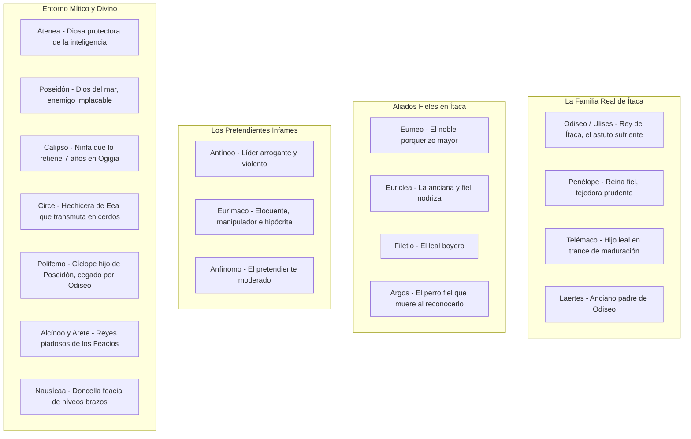

# SUPER-RESUMEN Y ANÁLISIS EXHAUSTIVO: *LA ODISEA* (HOMERO)

---

## 1. FICHA TÉCNICA Y METADATOS DE LA OBRA

| Parámetro | Detalle Filológico y Curricular |
| :--- | :--- |
| **Título Original** | *Ὀδύσσεια* (*Odýsseia*, El poema de Odiseo) |
| **Autor Atribuido** | **Homero** (siglo VIII a.C.) |
| **Género Literario** | **Épico** (Epopeya clásica de aventuras y navegación marítima) |
| **Estructura Métrica** | **24 Cantos o Rapsodias** (12,110 versos hexámetros dactílicos) |
| **Tiempo de la Acción Narrativa** | **40 días** en tiempo cronológico directo del presente narrativo, aunque abarca los **10 años** del retorno tras los 10 años de la Guerra de Troya (20 años de ausencia total) |
| **Estructura Arquitectónica** | Tripartita: 1. La Telemaquia; 2. El Retorno / Aventuras (Relato en primera persona); 3. La Venganza en Ítaca |
| **Eje Curricular UNSA** | Eje 06: Comunicación - Literatura Universal (Clasicismo Griego) |
| **Núcleo Temático Central** | **El nostos** (retorno anhelado al hogar) y la recuperación de la identidad, el honor y el reino mediante la astucia (*mêtis*) y la fidelidad conyugal |

---

## 2. CONTEXTO, GÉNESIS Y FILOSOFÍA DE LA OBRA

### 2.1. De la Fuerza Bruta (*Bíe*) a la Inteligencia Astuta (*Mêtis*)
Si la *Ilíada* es el poema de la guerra trágica, la fuerza destructiva (*bíe*) y la gloria bélica personificada en Aquiles, la *Odisea* es el poema de la paz, la reconstrucción civil, los viajes geográficos, la resistencia tenaz del espíritu humano ante las adversidades y la primacía de la inteligencia estratégica (*mêtis*), encarnada por **Odiseo**.
- **La Ley Sagrada de la Hospitalidad (*Xenía*):** En el mundo homérico arcaico, acoger al forastero, alimentarlo y protegerlo antes de inquirir su nombre es un mandato cósmico tutelado por **Zeus Xenios**. La transgresión de la hospitalidad (cometida salvajemente por los pretendientes en el palacio de Ítaca y por el cíclope Polifemo) acarrea la retribución y el castigo divino inexorable (*némesis*).

---

## 3. DRAMATIS PERSONAE / GALERÍA EXHAUSTIVA DE PERSONAJES



### 3.1. Los Protagonistas
1. **Odiseo (Ulises):** Rey de Ítaca. Héroe poliédrico caracterizado por su inventiva inagotable (*polýtropos*), elocuencia persuasiva, paciencia heroica ante el sufrimiento y amor inquebrantable a su patria pedregosa y a su hogar conyugal.
2. **Penélope (*la prudente*):** Esposa de Odiseo y reina de Ítaca. Arquetipo helénico de la fidelidad conyugal insobornable y la agudeza mental defensiva: elude las presiones carnales y políticas de más de un centenar de pretendientes durante tres años valiéndose del célebre ardid del sudario.
3. **Telémaco:** Hijo de Odiseo. Al inicio de la obra es un joven impotente y abrumado ante la soberbia de los pretendientes que devoran su hacienda. Guiado por Atenea, emprende un viaje de iniciación (*Bildung*) a Pilos y Esparta, madurando como hombre y guerrero para luchar codo a codo junto a su padre.

### 3.2. Servidores Leales vs. Pretendientes Despiadados
- **Eumeo:** El porquerizo mayor. De origen noble pero esclavizado, preserva una lealtad heroica hacia su amo y encarna la pureza moral de la hospitalidad pastoral.
- **Euriclea:** Anciana nodriza que amamantó a Odiseo en su infancia; guardiana de los secretos del palacio.
- **Argos:** El leal perro de cacería de Odiseo; aguarda durante veinte años el regreso de su amo tirado en un estercolero y, al reconocer su voz a pesar de su disfraz de mendigo, mueve las orejas, menea la cola y muere en paz.
- **Antínoo y Eurímaco:** Caudillos de los pretendientes. Malgastan los rebaños y bodegas de Ítaca, traman asesinar a Telémaco en una emboscada y humillan con violencia al mendigo forastero.

---

## 4. RESUMEN ARGUMENTAL EXHAUSTIVO EN TRES BLOQUES

```
┌────────────────────────────────────────────────────────────────────────┐
│                   ARQUITECTURA DE LA ODISEA                            │
└───────────────────────────────────┬────────────────────────────────────┘
        ┌───────────────────────────┼───────────────────────────┐
        ▼                           ▼                           ▼
 ┌──────────────┐            ┌──────────────┐            ┌──────────────┐
 │ Cantos I-IV  │            │ Cantos V-XII │            │Cantos XIII-  │
 │La Telemaquia │            │El Nostos y   │            │     XXIV     │
 │  Viaje de    │            │las Aventuras │            │La Venganza en│
 │  Iniciación  │            │  Fabulosas   │            │    Ítaca     │
 └──────────────┘            └──────────────┘            └──────────────┘
```

### Bloque I: La Telemaquia (Cantos I al IV)
La obra no comienza con Odiseo, sino con la crisis doméstica y política de Ítaca y la angustia de su hijo.

#### Canto I: El Concilio de los Dioses y la Exhortación a Telémaco
Tras diez años de la caída de Troya, todos los caudillos griegos que sobrevivieron han regresado a sus hogares o han muerto, salvo Odiseo, a quien la ninfa Calipso retiene cautivo en la isla de Ogigia deseando hacerlo su esposo inmortal. Aprovechando que Poseidón (quien odia a Odiseo) se halla de viaje en Etiopía, la diosa **Atenea** intercede ante Zeus en el Olimpo: recuerda los píos sacrificios de Odiseo y pide su liberación. Zeus accede y envía a **Hermes** a Ogigia para ordenar a Calipso la partida del héroe.
Atenea desciende a Ítaca disfrazada del noble Mentes, rey de los tafios. Encuentra el palacio real infestado por **108 nobles pretendientes** procedentes de Ítaca, Duliquio, Same y Zante, quienes masacran los bueyes, beben el vino añejo y presionan insolentemente a la reina Penélope para que elija a uno de ellos por esposo, dando por muerto a Odiseo. Atenea infunde valor en el corazón de Telémaco y le aconseja convocar al pueblo a una asamblea pública y viajar luego a Pilos y Esparta en busca de noticias sobre el paradero de su padre.

#### Cantos II al IV: El Viaje de Telémaco
- **Canto II:** Telémaco convoca la asamblea general de Ítaca (la primera en veinte años). Denuncia ante los ancianos el ultraje a su casa. El pretendiente Antínoo toma la palabra y culpa a Penélope: revela el ardid del **sudario fúnebre del anciano Laertes**, el cual Penélope prometió terminar antes de contraer nuevo matrimonio, pero que **tejía de día a la vista de todos y destejía de noche a la luz de las antorchas** durante más de tres años, hasta que una esclava traidora descubrió el engaño. Zeus envía dos águilas que vuelan sobre la asamblea desgarrándose el cuello, augurio de una sangrienta carnicería para los pretendientes, pero estos se mofan de las señales. Asistido por Atenea en la figura de su tutor **Mentor**, Telémaco equipa en secreto una nave con veinte remeros y zarpa de noche.
- **Canto III:** Llega a **Pilos**, donde el anciano rey Néstor celebra sacrificios a Poseidón en la playa. Néstor relata el regreso trágico de los aqueos (el asesinato de Agamenón a manos de Egisto y Clitemnestra, y la venganza de Orestes), pero ignora la suerte de Odiseo. Envía a su hijo Pisístrato para escoltar a Telémaco en carro hacia Esparta.
- **Canto IV:** Llegan al palacio dorado de **Menelao y Helena** en Lacedemonia. Menelao narra sus penalidades en Egipto, donde capturó al dios marino cambiante **Proteo** (*el viejo del mar*); Proteo le reveló que Odiseo continuaba con vida, retenido llorando en la remota isla de Ogigia por la ninfa Calipso. Entre tanto, en Ítaca, los pretendientes descubren la partida de Telémaco y preparan una nave para tenderle una emboscada homicida en el estrecho de Asteris a su regreso. Penélope se entera de la partida de su hijo y llora desconsolada en su cámara.

---

### Bloque II: El Regreso y el Gran Relato de las Aventuras (Cantos V al XII)

#### Cantos V al VIII: De Ogigia al País de los Feacios
- **Canto V:** Hermes vuela sobre las aguas con sus sandalias aladas hasta la gruta aromática de **Calipso** en la isla de Ogigia. Le comunica la orden terminante de Zeus. Calipso se queja con amargura de los celos de los dioses hacia las diosas que se unen a mortales, pero acata el mandato. Encuentra a Odiseo sentado en un promontorio de la playa, llorando con los ojos fijos en el horizonte del mar bravío, añorando su hogar y rechazando la promesa de inmortalidad y eterna juventud que le ofrece la ninfa. Calipso le proporciona herramientas; Odiseo tala veinte árboles de aliso y pino, y en cuatro días construye una sólida balsa de madera. Zarpa al mar, pero al decimoctavo día, Poseidón regresa de Etiopía, divisa la balsa y, enfurecido, desata una tempestad colosal con su tridente que despedaza la embarcación. La diosa marina Ino (Leucótea) le entrega un velo inmortal para atarlo a su pecho; tras dos días de nado agónico entre las olas, Odiseo arriba exhausto y con la piel desgarrada a la costa de **Esqueria**, el país de los feacios, y cae dormido bajo un matorral de olivos silvestres.
- **Canto VI:** Atenea envía un sueño a la princesa **Nausícaa**, hija del rey Alcínoo, sugiriéndole ir a lavar la ropa al río. Tras cumplir la faena, Nausícaa y sus doncellas juegan a la pelota; un grito despierta a Odiseo, quien sale del follaje desnudo y cubierto de salmuera marina, cubriéndose con una rama. Las doncellas huyen aterrorizadas, pero Nausícaa permanece inmóvil guiada por Atenea. Odiseo le dirige un discurso lleno de tacto y elocuencia comparando su belleza con un tallo de palmera en Delos. Nausícaa le proporciona mantos, aceite para ungirse y le indica cómo llegar al palacio de sus padres.
- **Canto VII y VIII:** Envuelto en una niebla protectora por Atenea, Odiseo ingresa al palacio de bronce del rey **Alcínoo** y la reina **Arete**. Se arroja a los pies de la reina como suplicante y es acogido con generosa hospitalidad. Al día siguiente se celebran juegos atléticos y un banquete donde el aedo ciego **Demódoco** canta la disputa entre Aquiles y Odiseo y, más tarde, el ardid del **Caballo de Madera** en la destrucción de Troya. Al escuchar la evocación de sus hazañas y de sus compañeros muertos, Odiseo no puede contener el llanto y se cubre el rostro con su manto de púrpura. El rey Alcínoo suspende el canto y le pregunta formalmente: *"Extranjero, ¿quién eres tú? ¿Cómo te llamas y cuáles son las penas que te hacen llorar?"*.

---

#### Cantos IX al XII: El Relato de Odiseo (Narración Retrospectiva)
Odiseo toma la palabra e inicia la inmortal confesión de sus aventuras desde la partida de Troya:

- **Canto IX: Los Cicones, los Lotófagos y el Cíclope Polifemo:**
  - *Los Cicones:* Saquean la ciudad de Ísmaro, pero la indisciplina de los hombres permite un contraataque enemigo donde mueren seis guerreros por nave.
  - *Los Lotófagos:* Llegan al país de los comedores de loto. Quien prueba la flor mágica del loto olvida para siempre a su patria y su familia, y solo desea quedarse comiendo la planta. Odiseo arrastra a la fuerza a sus marineros llorosos y los ata bajo los bancos de la nave para reanudar el viaje.
  - *El Cíclope Polifemo:* Desembarcan en la tierra de los cíclopes, gigantes salvajes de un solo ojo que no conocen leyes ni agricultura. Odiseo penetra con doce hombres en la caverna de Polifemo, hijo de Poseidón. Al regresar con su rebaño, el gigante tapa la entrada con una peña gigantesca que veintidós carros no moverían. Descubre a los griegos y, despreciando a Zeus y las leyes de la hospitalidad, aplasta a dos marineros contra el suelo como cachorros y se los come crudos. A la mañana siguiente devora a otros dos.
  Odiseo trama una estratagema: afila la punta de una estaca de olivo verde y la endurece al fuego. Por la noche, ofrece a Polifemo tres copas de vino tinto puro de Marón. El gigante, embriagado, le pregunta su nombre prometiéndole un regalo de hospitalidad. Odiseo responde con suprema astucia:
  > *«¡Cíclope! Me preguntas mi nombre ilustre y te lo diré: **Nadie** (Oûtis) es mi nombre; Nadie me llaman mi madre, mi padre y todos mis camaradas.»*
  Polifemo ríe ferozmente: *"A Nadie me lo comeré al último; ese será mi regalo de hospitalidad"*. El gigante cae dormido de espaldas, vomitando vino y trozos de carne humana. Odiseo y cuatro hombres calientan la estaca al rojo vivo en las brasas y **se la clavan en el único ojo, haciéndola girar como un barrena de carpintero**. El ojo hierve y las raíces chisporrotean.
  Polifemo lanza aullidos descomunales. Los demás cíclopes acuden al exterior de la cueva cerrada y le gritan: *«¿Quién te mata por engaño o por fuerza, Polifemo?»*. El gigante responde desde dentro:
  > *«¡Amigos! **Nadie** me mata por engaño y no por fuerza.»*
  Los cíclopes responden: *"Pues si nadie te hace violencia y estás solo, una enfermedad enviada por Zeus padeces; reza a tu padre Poseidón"*, y se marchan.
  A la mañana siguiente, Polifemo palpa el lomo de sus ovejas mientras salen a pastar para impedir que los griegos escapen. Odiseo ata a sus hombres de tres en tres bajo el vientre lanudo de los carneros, y él mismo se agarra con las manos al vellón del vientre del carnero padre de la manada. Logran salir al mar y abordan sus naves.
  Sin embargo, una vez en el agua, la soberbia heroica (*hibris*) vence la prudencia de Odiseo: grita insultando a Polifemo y le revela su verdadera identidad:
  > *«¡Cíclope! Si algún mortal te pregunta quién te privó torpemente de tu ojo, dile que fue **Odiseo, el asolador de ciudades, hijo de Laertes, que tiene su casa en Ítaca**.»*
  Polifemo recuerda un antiguo oráculo y lanza inmensas peñas marinas que casi hunden la nave. Luego, extiende los brazos al cielo y reza la maldición a su padre Poseidón:
  > *«¡Óyeme, Poseidón de cerúlea cabellera! Haz que Odiseo jamás regrese a su casa; o si su hado es volver a Ítaca, que sea tarde y con deshonor, habiendo perdido a todos sus compañeros, en nave ajena, y que encuentre la desgracia en su hogar.»* (Esta plegaria sella el destino trágico de la epopeya).

- **Canto X: Eolo, los Lestrigones y la Magia de Circe:**
  - *La Isla de Eolia:* El dios de los vientos, **Eolo**, entrega a Odiseo una bolsa de cuero de buey donde ha encerrado todos los vientos tempestuosos, dejando libre solo el Céfiro suave para empujar la flota a Ítaca. Nueve días navegan y divisan las hogueras de su patria. Odiseo, rendido de fatiga, se queda dormido. Los marineros, creyendo que la bolsa contiene oro y plata ocultos, la abren por codicia: los vientos escapan en torbellino furioso y arrastran las naves de regreso a Eolia. Eolo los expulsa con desprecio calificándolos de malditos por los dioses.
  - *Los Lestrigones:* En el puerto de Telépilo, gigantes antropófagos despedazan a los hombres y arrojan enormes rocas que hunden **once de las doce naves griegas**. Solo la nave de Odiseo logra cortar amarras y escapar de la masacre.
  - *La Isla de Eea (Circe):* Llegan a la morada de la hechicera Circe, hija del Sol. La mitad de la tripulación, liderada por Euríloco, explora el palacio rodeado de lobos y leones mansos. Circe los invita a una fiesta, les ofrece una pócima y, tocándolos con su varita mágica, **los transforma en cerdos**, encerrándolos en pocilgas. Euríloco escapa y avisa a Odiseo. Odiseo acude solo al rescate; en el camino, el dios Hermes se le aparece y le entrega una hierba mágica de raíz negra y flor blanca llamada **moly**, que neutraliza los encantamientos. Odiseo bebe el brebaje de Circe sin sufrir efecto alguno, desenvaina su espada y amenaza de muerte a la diosa; esta cae de rodillas asombrada, le devuelve la forma humana a sus compañeros y se convierte en su amante y protectora durante un año completo.

- **Canto XI: La Bajada al Hades (La Nekuia):**
  - Siguiendo las instrucciones de Circe para saber cómo regresar a Ítaca, Odiseo viaja al confín occidental del Océano, a la tierra de los Cimerios envuelta en nieblas eternas. Cava una fosa, vierte libaciones de miel, leche, vino y agua, y degüella un carnero negro para alimentar a las sombras de los muertos con sangre fresca.
  - El alma del adivino ciego **Tiresias** bebe la sangre y le revela el porvenir: le advierte que la cólera de Poseidón lo perseguirá, pero que se salvarán si, al llegar a la isla de Trinacia, **respetan y no tocan las vacas sagradas del Sol (Helios)**. Le profetiza la matanza de los pretendientes en su palacio y un último viaje hacia tierras donde los hombres no conozcan la sal.
  - Odiseo dialoga con la sombra de su madre **Anticlea**, quien le revela que murió de pura pena y nostalgia esperando su regreso (Odiseo intenta abrazarla tres veces, pero la sombra se desvanece como el viento entre sus brazos).
  - Habla con **Agamenón**, quien le relata la traición mortal de su esposa Clitemnestra y le aconseja no fiarse ciegamente de ninguna mujer al volver a casa.
  - Encuentra a **Aquiles**, quien pronuncia su célebre sentencia existencial sobre la muerte:
    > *«No pretendas consolarme de la muerte, noble Odiseo: preferiría ser un labrador humilde y servir como siervo a un hombre pobre en la tierra, antes que reinar sobre todos los muertos en el Hades.»*

- **Canto XII: Las Sirenas, Escila, Caribdis y las Vacas del Sol:**
  - *Las Sirenas:* Criaturas monstruosas que hechizan con su canto irresistible a los marineros para hacerlos naufragar y devorar sus carnes entre montañas de huesos. Siguiendo a Circe, Odiseo tapa con cera ablandada los oídos de sus hombres; pero, deseando escuchar el canto divino, **ordena que lo aten fuertemente al mástil de la nave** con la orden terminante de amarrarlo más fuerte si suplica ser desatado. Al escuchar la voz melódica de las sirenas prometiéndole el conocimiento de todas las cosas del mundo, Odiseo hace señas con la cabeza para que lo liberen, pero Perimedes y Euríloco lo atan con nudos más apretados hasta dejar atrás la isla.
  - *Escila y Caribdis:* Atraviesan el estrecho marino entre dos peñascos mortales. Por un lado, el remolino gigante de **Caribdis**, que traga y escupe tres veces al día las aguas negras del mar; por el otro, el monstruo de seis cabezas y doce garras **Escila**, oculta en una cueva. Para evitar que Caribdis hunda la nave entera, Odiseo se acerca a la peña de Escila: el monstruo asoma sus seis cabezas serpentinas y arrebata a seis de sus mejores compañeros de la cubierta, devorándolos vivos mientras gritan el nombre de Odiseo.
  - *La Isla de Trinacia (Las Vacas de Helios):* El viento adverso los retiene durante un mes. Agotados los víveres, mientras Odiseo duerme retirado orando a los dioses, Euríloco incita a la tripulación hambrienta a matar y asar las mejores **vacas sagradas del dios Sol (Helios)**. Cuando despiertan, las carnes gimen en los asadores como vacas vivas, augurio funesto. Al zarpar, Helios exige venganza amenazando a Zeus con bajar a brillar en el Hades si no son castigados. Zeus desata un huracán colosal y parte la nave de Odiseo con un rayo incandescente: **todos los marineros mueren ahogados en el mar**. Odiseo sobrevive atando la quilla al mástil con una correa, flota durante nueve días a merced de las corrientes y arriba solo y desnudo a la isla de Ogigia, morada de Calipso.

---

### Bloque III: La Venganza en Ítaca y la Restauración del Orden (Cantos XIII al XXIV)

#### Cantos XIII al XVI: El Arribo Encubierto y la Alianza con Telémaco
- **Canto XIII:** Concluido el relato de Odiseo, el rey Alcínoo y los nobles feacios le colman de riquezas en bronce, oro y mantos que superan el botín de Troya. Los remeros feacios lo transportan dormido en una nave mágica hasta una caleta de Ítaca (el puerto de Forcis), dejándolo en la arena con sus tesoros. (En represalia, Poseidón convierte la nave feacia en piedra a su regreso).
Odiseo despierta y no reconoce su patria debido a una espesa niebla. La diosa Atenea se le aparece disfrazada de pastor y luego adopta su figura divina. Tras un diálogo de mutuo elogio a la astucia, Atenea le revela que está en Ítaca, le ayuda a ocultar los tesoros en la cueva de las Náyades y **lo transforma mediante su vara mágica en un mendigo decrépito, calvo, arrugado, cubierto con un harapo sucio y apoyado en un bastón**, para que nadie lo reconozca antes de consumar la venganza.
- **Canto XIV y XV:** Odiseo se dirige a la choza campestre del porquerizo mayor **Eumeo**, quien lo recibe con impecable hospitalidad, sacrificando lechones y compartiendo su fuego sin saber quién es el mendigo. Odiseo inventa una autobiografía falsa afirmando ser un desterrado de Creta que luchó en Troya. Entre tanto, Atenea despierta a Telémaco en Esparta y le ordena regresar eludiendo la emboscada de los pretendientes por otra ruta.
- **Canto XVI:** Telémaco llega a la choza de Eumeo. El mendigo se levanta respetuoso para cederle el asiento, pero Telémaco lo trata con bondad. Eumeo marcha al palacio a avisar en secreto a Penélope. Estando solos, Atenea toca a Odiseo con su vara de oro devolviéndole su estatura majestuosa y sus ropajes limpios. Telémaco, atónito y asustado, cree estar ante un dios; Odiseo le dice entre lágrimas: *"¡No soy un dios! Soy tu padre, por quien gimes y sufres tantas aflicciones"*. Padre e hijo se funden en un llanto incontenible comparado con el graznido de águilas a las que les han robado sus polluelos. Juntos planifican minuciosamente la matanza de los pretendientes.

#### Cantos XVII al XX: Las Afrentas en el Palacio
- **Canto XVII:** Odiseo regresa a su palacio disfrazado de mendigo. En el camino, el cabrero traidor Melantio lo insulta y le propina una patada en la cadera; Odiseo domina su cólera. Al llegar al umbral del patio, **el viejo perro Argos, ciego y cubierto de garrapatas sobre el estiércol, mueve la cola y baja las orejas reconociendo a su amo después de veinte años**, y expira al instante.
Odiseo entra al megaron pidiendo limosna a los pretendientes; el insolente Antínoo lo insulta y **le arroja un escabel de madera golpeándole la espalda**. Odiseo permanece firme como una roca sin tambalearse.
- **Canto XVIII:** El mendigo oficial del palacio, Iro, desafía a Odiseo a una pelea a puño limpio animado por los pretendientes. Odiseo se arremanga los harapos mostrando unos muslos y hombros hercúleos: de un solo golpe en la mandíbula quiebra los huesos de Iro y lo arrastra desangrado al patio.
- **Canto XIX (La Cicatriz de Euriclea):** De noche, tras esconder las armas del palacio con Telémaco, Odiseo conversa a solas con Penélope. Esta le confiesa su desesperación y su ardid destejido. La reina ordena a la anciana nodriza **Euriclea** lavar los pies del forastero. Mientras lava sus piernas, Euriclea palpa una **cicatriz sobre la rodilla**, herida causada en la juventud de Odiseo por el colmillo de un jabalí blanco en el monte Parnaso. La anciana deja caer la jofaina de bronce con estrépito y exclama: *"¡Tú eres Odiseo, hijo mío querido!"*. Odiseo la toma rápidamente de la garganta con su mano callosa y le susurra que guarde silencio absoluto para no frustrar la venganza divina. Penélope anuncia al mendigo que al día siguiente convocará la prueba decisiva del arco para elegir esposo.

---

#### Cantos XXI al XXIV: La Prueba del Arco, la Venganza y la Paz

#### Canto XXI: El Certamen del Arco
Penélope desciende a la cámara del tesoro y toma el formidable **arco de Odiseo** (regalo de Ífito) y doce hachas de hierro con orificio central. Comunica a los pretendientes las condiciones del certamen:
> *«Aquel que con mayor facilidad tense este arco con sus manos y haga pasar una flecha a través de los doce anillos de las hachas puestas en hilera, a ese seguiré, abandonando esta casa a la que vine de doncella.»*

Uno tras otro, los pretendientes untan el arco con grasa y lo calientan al fuego para ablandarlo, pero ninguno posee la fuerza biológica para doblar la madera y tensar la cuerda. Entre tanto, Odiseo sale al patio, revela su identidad a **Eumeo** y al boyero **Filetio** mostrándoles la cicatriz, y les ordena atrancar las puertas del salón y encerrar a las esclavas en sus aposentos.
Antínoo propone suspender la prueba hasta el día siguiente. Entonces, el mendigo pide que le permitan probar el arco para ver si le queda algo de la fuerza de su juventud. Los pretendientes lo insultan temiendo la vergüenza, pero Penélope y Telémaco imponen su voluntad y Eumeo entrega el arco a Odiseo.
Odiseo sopesa el arco en sus manos, examinándolo de un lado a otro como un músico experimentado que afina una lira; **tensa la cuerda sin esfuerzo alguno en un solo movimiento y la pulsa: la cuerda emite un zumbido agudo y límpido semejante al trino de una golondrina**. En el cielo, Zeus envía un trueno formidable como presagio divino.
Sin levantarse de su asiento, Odiseo toma una flecha desnuda de la mesa, tensa la cuerda hasta el pecho y dispara: **la flecha atraviesa limpiamente los doce orificios de las hachas sin rozar ninguno**.
Odiseo mira a su hijo y le dice: *"Telémaco, el huésped sentado en tu palacio no te avergüenza"*. Telémaco se ciñe la espada y se coloca a su lado empuñando su pica de bronce.

#### Canto XXII: La Matanza de los Pretendientes (Mnesterofonía)
Odiseo se despoja de sus harapos, salta sobre el ancho umbral de piedra con el carcaj lleno de saetas y grita:
> *«¡Este certamen fatal está concluido! Ahora apuntaré a otro blanco al que ningún hombre ha disparado jamás.»*

Dispara su primera saeta al tirano **Antínoo**, atravesándole la garganta de lado a lado en el instante mismo en que este levantaba una copa de oro para beber vino; la copa cae y un chorro espeso de sangre brota de sus narices mientras se desploma pateando la mesa.
Los pretendientes gritan aterrados buscando armas en las paredes, pero las paredes están desiertas. Odiseo les revela su voz con furia cósmica:
> *«¡Perros! Creíais que jamás regresaría de Troya a mi hogar, pues devastabais mi casa, forzabais a mis siervas y cortejabais a mi esposa estando yo vivo, sin temer a los dioses que habitan el ancho cielo ni el juicio futuro de los hombres. ¡Ahora la ruina y la muerte inexorable han caído sobre todos vosotros!»*

Eurímaco intenta suplicar culpando de todo al muerto Antínoo y ofreciendo pagar tributos descomunales; Odiseo replica que ni con todo el oro del mundo se detendrán sus manos homicidas. Eurímaco desenvaina su espada y se lanza al ataque, pero una flecha de Odiseo le atraviesa el pecho clavándose en el hígado. Telémaco corre a la armería secreta y trae cascos, escudos y lanzas para su padre, para sí mismo, para Eumeo y Filetio.
El cabrero traidor Melantio trepa por un conducto a la armería para abastecer a los pretendientes, pero Eumeo y Filetio lo sorprenden, le atan las manos y pies a la espalda y lo cuelgan de una viga hasta el techo.
Atenea desciende en la figura de Mentor y luego, tomando la forma de una golondrina en lo alto de una viga, agita su **égida dorada**: el pánico enloquece a los pretendientes, quienes corren en círculos como vacas espantadas por tábanos mientras los cuatro héroes arremeten como buitres de corvas garras, abatiéndolos sin piedad hasta que el suelo del palacio se inunda de sangre humeante. Solo perdona la vida al aedo Femio y al heraldo Medonte, quienes fueron forzados a actuar por coacción.
Terminada la carnicería, hacen llamar a las doce esclavas traidoras que se habían amancebado con los pretendientes; las obligan a lavar la sangre de las mesas y cargar los cadáveres al patio y, luego, Telémaco las ahorca a todas juntas de una soga en el patio. Al traidor Melantio le mutilan la nariz, las orejas, los genitales para alimentar a los perros, y las extremidades. Luego purifican el palacio quemando azufre aromático.

#### Canto XXIII: El Reconocimiento Definitivo de Penélope
Euriclea sube corriendo a la cámara de Penélope anunciando que Odiseo ha regresado y ha matado a los pretendientes. Penélope baja al megaron dominando su corazón; se sienta frente a Odiseo en silencio, mirándolo fijamente sin decidirse a reconocerlo tras verlo cubierto de sangre y harapos.
Telémaco le reprocha su dureza de corazón llamándola madre cruel. Odiseo sonríe y le dice a su hijo que la deje a prueba, pues ambos poseen señales secretas que solo ellos dos conocen.
Odiseo se baña, se unge con aceite y Atenea derrama sobre él belleza, juventud y cabellos rizados como flores de jacinto. Regresa ante Penélope y le dice: *"Mujer extraña, corazón de piedra te han dado los dioses... Nodriza, prepárame un lecho para dormir solo"*.
Entonces, Penélope tiende la **trampa psicológica definitiva**: dice a la nodriza:
> *«Euriclea, saca fuera de la cámara conyugal el lecho labrado que él mismo construyó y poned en él blandas pieles y mantas.»*

Al escuchar esto, Odiseo se enfurece y exclama con emoción:
> *«¡Mujer! En verdad esa palabra me ha herido el corazón. ¿Quién ha podido mover mi lecho de su sitio? Sería dificilísimo aun para el más diestro, a menos que un dios viniera en persona... Pues una gran señal hay en la estructura de ese lecho que yo mismo fabriqué con nadie más: dentro del patio crecía un olivo de espesas hojas, grueso y robusto como una columna; alrededor de él edifiqué mi cámara nupcial con piedras labradas y le puse un sólido techo. Luego, corté la copa del olivo, pulí su tronco desde la raíz, lo enderecé con la plomada y **tallé en el mismo tronco el lecho de madera**, perforándolo con la barrena y adornándolo con oro, plata y marfil. Esa es la señal que te digo, ¡y no sé si mi lecho sigue firme o alguien ha cortado el tronco del olivo para moverlo a otra parte!»*

Al escuchar los pormenores del secreto que ningún mortal conocía salvo ellos dos y la sierva Áctoris, a Penélope se le aflojan las rodillas y el corazón: rompe en llanto, corre con los brazos abiertos, le echa los brazos al cuello y besa la cabeza de su esposo implorándole perdón por su desconfianza. Lloran abrazados toda la noche, mientras la diosa Atenea detiene el curso del sol para prolongar la aurora de su reencuentro conyugal.

#### Canto XXIV: La Paz Final en Ítaca
El dios Hermes conduce las almas de los 108 pretendientes al Hades; allí, Aquiles y Agamenón contemplan el cortejo y Agamenón alaba la virtud inmortal de la prudente Penélope.
Odiseo marcha al campo a visitar a su anciano padre **Laertes**, quien vive sumido en la miseria labrando la tierra consumido por el dolor. Tras probarlo, Odiseo le muestra la cicatriz y le enumera los trece perales y cuarenta higueras que le regaló de niño. Se abrazan llorando.
Entre tanto, los familiares de los pretendientes asesinados, liderados por Eupeites (padre de Antínoo), toman las armas y marchan a vengar a sus muertos. Se inicia el combate en el campo y Laertes mata a Eupeites con su lanza. Sin embargo, en el momento en que Odiseo arremete con furor heroico, **Atenea desciende del cielo y Zeus lanza un rayo ardiente a sus pies**. Atenea ordena con voz potente poner fin a la guerra civil fratricida:
> *«¡Odiseo de noble cuna, detén la lucha! Cese la guerra perjudicial, no sea que el Crónida Zeus se enoje contigo.»*

Odiseo acata con júbilo la orden divina, y la diosa Atenea establece **pactos eternos de paz, concordia y prosperidad** entre el rey Odiseo y su pueblo de Ítaca.

---

## 5. EJES TEMÁTICOS Y ANÁLISIS FILOSÓFICO-SIMBÓLICO

### 5.1. El Nostos (Retorno) y la Identidad Humana
El viaje de Odiseo es una odisea existencial por recuperar su nombre y su reino. Al negarse a ser inmortal junto a Calipso, Odiseo afirma la **dignidad de la condición mortal**: prefiere envejecer junto a Penélope y sufrir las vicisitudes humanas antes que vegetar en un paraíso eterno de olvido sin patria ni memoria.

### 5.2. El Ardid de "Nadie" y la Desconstrucción del Nombre
En el episodio del Cíclope, Odiseo usa el juego homofónico en griego: **Oûtis** (*Nadie*) frente a **Mêtis** (*astucia/inteligencia*). Al borrar temporalmente su identidad heroica (*yo soy Nadie*), vence al gigante bárbaro mediante la mente pura. La tragedia sobreviene cuando su orgullo aristocrático lo obliga a gritar su verdadero nombre, atrayendo la maldición de Poseidón.

### 5.3. Los Tres Símbolos Mayores de la Fidelidad y la Verdad
1. **El Telar de Penélope:** Símbolo de la resistencia temporal inteligente, la paciencia femenina y la dilatación estratégica frente a la violencia invasora.
2. **El Gran Arco:** Símbolo de la legitimidad política y la virilidad soberana de la realeza: solo el verdadero rey posee la templanza y fuerza cósmica para tensarlo.
3. **El Lecho de Olivo:** Símbolo del matrimonio indisoluble, la estabilidad civil y el arraigo en la tierra nutricia: el hogar no se puede mover porque está enraizado en la naturaleza viva.

---

## 6. EPÍTETOS HOMÉRICOS Y COMPARACIÓN ILÍADA VS. ODISEA

$$\begin{array}{|l|l|l|}
\hline
\textbf{Categoría} & \textbf{La Ilíada} & \textbf{La Odisea} \\ \hline
\text{Héroe Paradigmático} & \text{Aquiles: Fuerza pasional (\textit{Bíe}), vida corta} & \text{Odiseo: Inteligencia astuta (\textit{Mêtis}), supervivencia} \\ \hline
\text{Escenario} & \text{Llanura bélica de Troya, campamento naval} & \text{Mar Mediterráneo fantástico, palacios, el hogar} \\ \hline
\text{Visión del Destino} & \text{Tragedia ineludible y muerte en combate} & \text{Justicia divina, reconstrucción y triunfo moral} \\ \hline
\text{Técnica Narrativa} & \text{Lineal y cronológica directa (\textit{In media res})} & \text{Estructura retrospectiva compleja (relato en 1.ª persona)} \\ \hline
\end{array}$$

- **Epítetos Clave en la Odisea:**
  - *Odiseo:* «El fecundo en ardides», «El de multiforme ingenio» (*polytropos*), «El paciente y divino».
  - *Penélope:* «La prudente», «Circunspecta», «La discreta reina».
  - *Telémaco:* «El discreto joven», «Peculiar en sabiduría».
  - *Atenea:* «La de ojos de lechuza», «La de ojos brillantes».

---

## 7. FRAGMENTOS CUMBRES COMENTADOS

### Fragmento 1: La Elección de la Mortalidad (Canto V)
> *«Diosa venerada, no te enojes conmigo por esto. Sé muy bien que la prudente Penélope es inferior a ti en belleza y estatura, pues ella es mortal y tú inmortal y siempre joven; aun así, deseo y anhelo cada día regresar a mi casa y ver el día de mi retorno. Y si algún dios me estrella de nuevo en el vinoso ponto, sufriré en mi pecho con corazón paciente, que muchas penas he soportado ya en las olas y en la guerra.»*
- **Comentario:** Odiseo define el humanismo griego: la belleza divina perfecta e intemporal es estéril frente a la belleza cálida, frágil e imperfecta del amor conyugal humano arraigado en la tierra.

### Fragmento 2: El Reencuentro con el Lecho de Olivo (Canto XXIII)
> *«...dentro del patio crecía un olivo de espesas hojas, grueso y robusto como una columna; alrededor de él edifiqué mi cámara nupcial... tallé en el mismo tronco el lecho de madera. Esa es la señal secreta...»*
- **Comentario:** El reconocimiento no se basa en amuletos mágicos ni en la apariencia física mudable, sino en la memoria compartida del trabajo arquitectónico y el amor consagrado sobre la naturaleza viva.

---

## 8. GUÍA DE ADMISIÓN: PREGUNTAS FRECUENTES Y TRAMPAS

1. **¿Quién reconoce primero a Odiseo en Ítaca?:**
   - El perro **Argos** (lo reconoce por la voz y el olor antes que cualquier humano), seguido por la nodriza **Euriclea** (por la cicatriz del jabalí).
2. **¿Quién cuenta las aventuras fantásticas (Polifemo, Sirenas, Circe)?:**
   - No las cuenta el narrador omnisciente; las relata **Odiseo mismo en primera persona** como un largo *flashback* ante la corte del rey Alcínoo en el país de los feacios.
3. **¿Cómo se prueba la identidad de Odiseo ante Penélope?:**
   - No mediante el arco (el arco vence a los pretendientes); la prueba íntima con Penélope es el **secreto de la construcción del lecho conyugal tallado en el tronco del olivo**.
4. **¿Por qué Poseidón odia a Odiseo?:**
   - Porque Odiseo dejó ciego con una estaca de olivo a su hijo, el cíclope **Polifemo**.
5. **¿Qué estructura tiene la Telemaquia?:**
   - Comprende los **Cantos I al IV**, dedicados a la búsqueda que emprende Telémaco en Pilos y Esparta.

---

## 9. 3 PREGUNTAS TIPO TEST RESUELTAS CON MÁXIMO RIGOR

### Pregunta 1
En la epopeya homérica la *Odisea*, el héroe protagonista Odiseo logra eludir la maldición mortal que sufrían los navegantes al escuchar el canto de las Sirenas gracias a:
- A) La invocación de plegarias a Poseidón para que desatara una niebla espesa.
- B) Haber tapado los oídos de su tripulación con cera y haberse hecho atar firmemente al mástil de la nave.
- C) La ingestión de la planta mágica *moly* proporcionada por el dios Hermes.
- D) El descenso a las profundidades marinas utilizando el velo salvador de Leucótea.
- E) La entonación de un canto fúnebre superior ejecutado por el aedo Femio.

**Resolución:**
Siguiendo las instrucciones de la hechicera Circe, Odiseo protegió a sus marineros tapándoles los oídos con cera de abejas para que remaran sin distraerse, pero él, guiado por su sed inextinguible de conocimiento, se hizo amarrar con fuertes cuerdas al mástil de la nave, pudiendo deleitarse con el canto y sobrevivir a su mortífera seducción.
**Respuesta:** **B**

---

### Pregunta 2
En el Canto XIX de la *Odisea*, la anciana nodriza Euriclea descubre la verdadera identidad de Odiseo, quien se hallaba disfrazado de mendigo, a través de:
- A) El reconocimiento de su mirada y el tono autoritario de su voz al impartir órdenes.
- B) Una cicatriz sobre la rodilla provocada en su juventud por la embestida de un jabalí en el monte Parnaso.
- C) El hallazgo del sello de oro real de Ítaca oculto entre sus harapos.
- D) La confesión espontánea que el héroe le hace a la luz de las antorchas.
- E) La revelación que la diosa Atenea le transmite a la anciana en sueños.

**Resolución:**
Mientras lavaba las piernas del mendigo forastero por orden de Penélope, las manos de Euriclea palpan la profunda cicatriz que Odiseo tenía desde su juventud, cuando cazaba en el monte Parnaso junto a su abuelo Autólico y un jabalí blanco le desgarró el muslo con el colmillo. La evidencia física irrebatible revela la identidad del rey.
**Respuesta:** **B**

---

### Pregunta 3
La prueba definitiva mediante la cual la prudente Penélope comprueba que el hombre que abatió a los pretendientes es verdaderamente su legítimo esposo Odiseo y no un dios disfrazado consiste en:
- A) Exigirle que recite los juramentos sagrados que pronunciaron ante los sacerdotes de Apolo.
- B) Ordenar a la servidumbre que traslade el lecho nupcial fuera de la cámara, provocando la indignada explicación de Odiseo sobre cómo talló dicho lecho en el tronco vivo de un olivo enraizado en la tierra.
- C) Obligarlo a tensar el arco de Ífito en presencia de los ancianos consejeros de la asamblea.
- D) Cotejar la huella de sus pies con las pisadas preservadas en la arcilla del palacio.
- E) Pedirle que nombre a las doce esclavas traidoras ejecutadas en el patio interior.

**Resolución:**
Penélope finge ordenar a Euriclea sacar el lecho conyugal fuera de la habitación; esta aparente imposibilidad enfurece a Odiseo, quien revela el secreto fundacional de su matrimonio: él mismo labró la cama sobre el tronco vivo e inamovible de un olivo que formaba el cimiento de la alcoba. Al escuchar el detalle íntimo que solo ellos conocían, Penélope rompe a llorar y se entrega a sus brazos.
**Respuesta:** **B**
