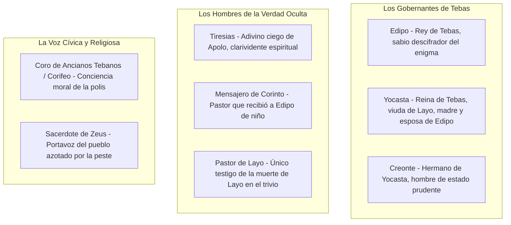

# SUPER-RESUMEN Y ANÁLISIS EXHAUSTIVO: *EDIPO REY* (SÓFOCLES)

---

## 1. FICHA TÉCNICA Y METADATOS DE LA OBRA

| Parámetro | Detalle Filológico y Curricular |
| :--- | :--- |
| **Título Original** | *Oἰδίπους Τύραννος* (*Oidípous Týrannos*, Edipo Tirano / Rey) |
| **Autor** | **Sófocles** (Colono, ca. 496 a.C. - Atenas, 406 a.C.) |
| **Género Literario** | **Dramático** |
| **Especie Literaria** | **Tragedia clásica griega** (en un solo acto ininterrumpido con coro) |
| **Época y Contexto** | Siglo de Oro ateniense (Siglo de Pericles, ca. 429 a.C.); estrenada en las Grandes Dionisias |
| **Estructura Dramática** | Prólogo, Párodos, 4 Episodios con sus respectivos Estásimos corales, y Éxodo |
| **Unidades Aristotélicas** | Cumple rigurosamente las **Tres Unidades**: 1. Tiempo (menos de 24 horas); 2. Lugar (fachada del palacio de Tebas); 3. Acción (un solo conflicto central) |
| **Eje Curricular UNSA** | Eje 06: Comunicación - Literatura Universal (Clasicismo Griego) |
| **Núcleo Temático Central** | **La fatalidad inexorable del destino (*fatum*)**, la ceguera del orgullo humano (*hibris*), la búsqueda implacable de la verdad y la autoculpabilidad trágica |

---

## 2. CONTEXTO DE PRODUCCIÓN Y TEORÍA ARISTOTÉLICA

### 2.1. El Modelo Trágico por Excelencia de la *Poética*
En su *Poética*, **Aristóteles** consagra a *Edipo Rey* como la cumbre insuperable del teatro trágico universal. La obra encarna la perfección formal de los tres mecanismos catárticos primordiales:
1. **Hamartia (El error trágico):** El protagonista no es un ser perverso ni un santo intachable, sino un hombre noble que incurre en un error de juicio involuntario guiado por el desconocimiento de sus orígenes.
2. **Peripeteia (Peripecia):** Inversión súbita de la fortuna del héroe: la acción emprendida para lograr la salvación o felicidad produce exactamente el resultado opuesto (el mensajero que llega a liberar a Edipo del temor a sus padres termina revelando que cometió parricidio e incesto).
3. **Anagnórisis (Reconocimiento):** Paso estremecedor de la ignorancia absoluta a la luz del conocimiento de la verdad oculta sobre la propia identidad.
4. **Kátharsis (Catarsis):** Purificación psicológica y moral de los espectadores al experimentar **compasión** (*éleos*) y **temor reverencial** (*phobos*) ante la desdicha desmesurada del héroe.

---

## 3. DRAMATIS PERSONAE / GALERÍA DE PERSONAJES



### 3.1. Caracterización Psicológica y Funcional
1. **Edipo (*el de los pies hinchados*):** Soberano de Tebas. Héroe intelectual que salvó a la polis al descifrar el enigma de la Esfinge. Es un rey justiciero, impetuoso, valiente y apasionado por la verdad, pero soberbio (*hibris*): confía ciegamente en su razón y desprecia la sabiduría oracular divina hasta verse destruido por la realidad.
2. **Yocasta:** Reina madre y consorte. Racionalista y escéptica; intenta mitigar los temores de Edipo desacreditando la infalibilidad de los oráculos. Su tragedia culmina en el horror al comprender la verdad antes que Edipo.
3. **Creonte:** Hermano de Yocasta. Representa el equilibrio político, la prudencia legalista y la serenidad de ánimo. Acusado injustamente de traición por Edipo, asume con compasión el gobierno final de Tebas.
4. **Tiresias:** Adivino ciego consagrado a Apolo. Encarna la paradoja trágica del saber: **el ciego físico que ve con plenitud la verdad espiritual**, frente a Edipo, **el vidente físico que vive en la más absoluta ceguera moral**.
5. **El Mensajero de Corinto y el Pastor de Layo:** Dos ancianos de baja condición social que actúan como bisagras del destino; sus testimonios fragmentarios completan el rompecabezas del parricidio y el incesto.

---

## 4. RESUMEN ARGUMENTAL EXHAUSTIVO ESCENA POR ESCENA

```
┌────────────────────────────────────────────────────────────────────────┐
│                   ESTRUCTURA DE EDIPO REY                              │
└───────────────────────────────────┬────────────────────────────────────┘
        ┌───────────────────────────┼───────────────────────────┐
        ▼                           ▼                           ▼
 ┌──────────────┐            ┌──────────────┐            ┌──────────────┐
 │ Prólogo y    │            │Episodios 2-4 │            │    Éxodo     │
 │ Episodio 1   │            │Dudas, Pistas │            │Catástrofe,   │
 │La Peste y la │            │y Anagnórisis │            │Ceguera y     │
 │ Maldición    │            │    Total     │            │  Destierro   │
 └──────────────┘            └──────────────┘            └──────────────┘
```

### Prólogo: La Peste sobre Tebas y el Oráculo Délfico
La acción dramática se abre ante las puertas del palacio real de Tebas. Una multitud de sacerdotes, ancianos y niños sostienen ramas de olivo coronadas de lana en actitud de súplica fúnebre. Una **peste devastadora y misteriosa** asola la ciudad: los campos se esterilizan, los rebaños perecen en los pastos, las mujeres abortan y los cadáveres insepultos envenenan el aire de Tebas.
El rey **Edipo** sale a escena. Conmovido paternalmente por el dolor de su pueblo, les recuerda que él no es un dios, pero que ya demostró su sabiduría al salvarlos años atrás liberándolos del tributo sangriento que exigía la monstruosa Esfinge al descifrar su enigma. Les informa que no se ha quedado de brazos cruzados: envió a su cuñado **Creonte** ante el oráculo del dios Apolo en Delfos para averiguar cómo sanar la ciudad.
En ese instante arriba Creonte coronado con laurel de buen augurio. Delante de todo el pueblo reunido, transmite la respuesta oracular tajante de Apolo:
> *«El dios ordena purificar la tierra de Tebas extirpando un miasma (contaminación sacrílega) que nutre esta comarca y no dejarlo crecer hasta hacerlo incurable: desterrando al hombre culpable o expiando con muerte la sangre derramada del rey Layo, nuestro antiguo soberano asesinado.»*

Edipo indaga los pormenores del regicidio. Creonte le relata que Layo viajaba en una comitiva modesta hacia Delfos cuando cayó muerto en una encrucijada; solo sobrevivió un siervo que huyó aterrorizado diciendo que una banda de bandoleros armados los asaltó. El crimen quedó impune porque entonces la Esfinge tenía a Tebas bajo asedio.
Edipo asume con solemnidad y firmeza moral la investigación judicial del caso: promete desentrañar el misterio, expulsar al culpable y vengar a Layo como si fuera su propio padre, ignorando que cava su propia tumba.

---

### Párodos: El Canto Coral de la Angustia
El coro de ancianos tebanos ingresa en la orquesta. En un cántico lírico sublime y acongojado, invoca a la tríada protectora (Atenea, Ártemis y Febo Apolo), describiendo con desgarradora plasticidad la agonía de la ciudad donde la muerte arrebata vidas que vuelan al ocaso como veloces pájaros, e imploran a Dioniso que fulmine al dios de la peste con sus teas encendidas.

---

### Episodio 1: El Bando de Edipo y la Furia de Tiresias
Edipo toma la palabra y proclama un **edicto solemne** ante todo el pueblo de Tebas:
- Ordena a quien conozca al asesino de Layo que lo denuncie de inmediato, prometiéndole que no sufrirá más daño que el destierro.
- Decreta una **maldición implacable contra el asesino desconocido**: que nadie en Tebas le dé cobijo en su casa, ni le hable, ni comparta con él oraciones o sacrificios, sino que sea repudiado por todos como una abominación viva y consuma su miserable existencia en el desamparo más atroz.
- Y añade una cláusula lapidaria:
  > *«Y pido que si el culpable llega a compartir mi propio hogar y habitar bajo mi techo con mi conocimiento, caigan sobre mí las mismas maldiciones que acabo de fulminar.»*

Siguiendo el consejo del coro, Edipo hace comparecer al anciano adivino ciego **Tiresias**, conducido por un niño. Edipo le suplica que utilice sus artes proféticas para salvar a la ciudad. Sin embargo, Tiresias se niega a hablar, lamentando amargamente haber acudido: *"¡Ay, ay! ¡Qué terrible es saber cuando el saber no reporta provecho al sabio! Dejadme marchar a mi casa; tú soportarás tu destino y yo el mío con mayor sosiego si me obedeces"*.
Edipo se enfurece ante su negativa, lo acusa de traidor insensible a la ruina de Tebas y llega a sostener que el propio Tiresias debió planificar y ejecutar el asesinato de Layo con sus propias manos.
Provocado hasta el límite de la paciencia, Tiresias rompe el silencio y lanza la sentencia que sacude las columnas del palacio:
> *«¿Conque esas tenemos? Te ordeno acatar tu propio edicto y, a partir de este día, ¡no dirigir la palabra a mí ni a ninguno de estos ciudadanos, porque **tú eres el asesino maldito que contamina esta tierra**!»*

Edipo, cegado por la soberbia intelectual, se niega a creerlo. Asume que se trata de un complot político urdido por su cuñado **Creonte** para derrocarlo del trono, utilizando a un falso y codicioso hechicero ciego. Insulta a Tiresias recordándole que cuando la Esfinge asolaba Tebas, el adivino no supo descifrar nada con el vuelo de las aves, mientras que él, Edipo, *«el que nada sabía»*, la aniquiló valiéndose únicamente de su inteligencia natural.
Tiresias le replica con sobrecogedora majestad profética:
> *«Puesto que me has echado en cara que soy ciego, te digo: **tú tienes ojos, y no ves en qué abismo de desgracia estás sumido**, ni dónde habitas, ni con quién compartes tu techo. ¿Sabes acaso de quién eres hijo? Eres, sin saberlo, el enemigo de los tuyos bajo tierra y sobre ella. La maldición de doble filo de tu padre y de tu madre, con paso aterrador, te expulsará un día de esta tierra, ¡y tú, que ahora ves la luz, solo verás tinieblas!... Ese hombre que buscas con amenazas y edictos por la muerte de Layo está aquí: se le tiene por extranjero avecindado, pero pronto se descubrirá que es tebano por su linaje; y no se alegrará de este hallazgo: **ciego en lugar de vidente, mendigo en lugar de rey**, tanteando el suelo con un bastón, marchará a tierras extrañas. Y se comprobará que **él es a la vez hermano y padre de sus propios hijos; hijo y esposo de la mujer de quien nació; y sembrador del mismo lecho y asesino de su propio padre**. Entra en tu palacio y reflexiona sobre esto; y si me descubres en mentira, di entonces que carezco de juicio profético.»*

---

### Episodio 2: El Choque con Creonte y la Revelación Involuntaria de Yocasta
Creonte se entera de las gravísimas acusaciones de conspiración y llega indignado ante el palacio. Edipo lo encara duramente, tachándolo de traidor hipócrita y exigiendo su condena a muerte. Creonte razona con serenidad: le demuestra que él ya goza de todos los privilegios del poder monárquico (es consultado en todo y tratado como igual) sin tener que soportar las zozobras, desvelos y peligros del trono soberano, por lo que sería insensato ambicionar la corona.
El coro suplica moderación y, en ese instante, las puertas se abren y sale la reina **Yocasta**.
Yocasta reprende a ambos hombres por ventilar rencillas personales mientras la ciudad muere de peste. Logra que Edipo perdone la vida a Creonte y pregunta a su esposo cuál es el motivo de su congoja.
Edipo le relata que Creonte ha utilizado a un adivino que lo acusa de ser el asesino del rey Layo.
Yocasta, queriendo tranquilizarlo y demostrarle que ningún mortal posee el don de la profecía oracular, comete el error fatal: le ofrece como prueba irrevocable la historia del destino de su primer esposo:
> *«Escúchame y convéncete de que ningún ser humano tiene parte en el arte adivinatoria. A Layo le llegó una vez un oráculo —no diré de Febo mismo, sino de sus ministros— anunciándole que su destino era morir a manos del hijo que nacería de él y de mí.*  
> *Sin embargo, a Layo lo mataron bandoleros extranjeros en una **encrucijada de tres caminos**. Y en cuanto a aquel niño, no tenía tres días de nacido cuando Layo le perforó los tobillos atándolos con un broche de hierro y lo entregó a criados para que lo arrojaran en un monte desierto e inaccesible. De suerte que ni Apolo cumplió la profecía de que el hijo matara a su padre, ni Layo sufrió la muerte a manos de su vástago. Así que no te angusties por oráculos; lo que el dios necesita, él mismo lo descubre con facilidad.»*

Lejos de tranquilizarlo, las palabras de Yocasta desatan un pánico glacial en el alma de Edipo. El rey palidece y pregunta temblando:
—*«¡Mujer, qué turbación se ha apoderado de mi espíritu al oírte!... Dime, ¿en qué lugar exacto ocurrió la muerte de Layo?»*  
—*«En la tierra llamada Fócida, donde se bifurca el camino que viene de Delfos y el que viene de Daulia.»*  
—*«¿Y cuánto tiempo hace de este suceso?»*  
—*«La noticia se divulgó poco antes de que tú asumieras el poder en Tebas.»*  
—*«¡Oh Zeus! ¿Qué has dispuesto hacer conmigo?... ¿Y qué aspecto físico tenía Layo? ¿Cuál era su edad?»*  
—*«Era alto, con los cabellos canosos ya plateados en las sienes, y su figura no difería mucho de la tuya.»*  
—*«¡Desgraciado de mí! ¡Temo haberme lanzado a mí mismo una maldición espantosa sin saberlo!»*

Edipo hace una última pregunta crucial: ¿viajaba Layo con gran escolta o con pocos hombres? Yocasta responde que viajaba con cinco hombres en total, incluido un heraldo, en un solo carro. Edipo llora desolado y pide con urgencia que traigan al único siervo que sobrevivió. Yocasta le explica que aquel siervo, al regresar a Tebas y ver a Edipo entronizado en lugar de Layo, le suplicó de rodillas que lo enviara a los campos remotos a pastorear rebaños lejos de la ciudad.
Edipo le revela entonces a Yocasta **el oscuro secreto de su juventud en Corinto**:
Creció creyéndose hijo legítimo del rey Pólibo y de la reina Mérope de Corinto. Pero en un banquete, un comensal ebrio le gritó en la cara que él era un hijo falso o adoptado. Herido en su orgullo, interrogó a sus padres, quienes se indignaron con el difamador, pero la duda continuó carcomiéndole. Sin avisar a nadie, viajó a Delfos a consultar al dios. Apolo no respondió a su pregunta sobre su filiación, pero le profetizó horrores espeluznantes: **que su destino era yacer carnalmente con su propia madre, engendrar una estirpe maldita insoportable a la vista humana, y ser el asesino de su propio padre generador**.
Aterrado por el oráculo, huyó para siempre de Corinto guiándose por las estrellas para no volver a ver jamás a sus supuestos padres. En su errancia solitaria, al llegar precisamente al **trivio de Fócida** (la encrucijada de tres caminos), se topó con un carro guiado por un heraldo y un anciano de cabellos blancos idéntico a la descripción de Layo. El heraldo y el anciano intentaron expulsar a Edipo del camino con violencia brutal; el conductor lo empujó y el anciano, al pasar Edipo al lado de la rueda, le descargó en la cabeza un doble golpe con su látigo de púas.
Ciego de furia, Edipo respondió con su bastón: derribó al anciano de espaldas fuera del carro y **los mató a todos**.
Edipo tiembla: si aquel forastero muerto en la encrucijada tenía algún lazo de parentesco con Layo, él es el hombre más maldito sobre la tierra. Solo le queda una tenue esperanza: el pastor que sobrevivió dijo que fueron «varios bandoleros» los que atacaron a la comitiva. Si el pastor mantiene que fueron varios, Edipo es inocente (pues él iba completamente solo); pero si afirma que fue un caminante solitario, la balanza de la culpa caerá enteramente sobre su cabeza.

---

### Episodio 3: El Mensajero de Corinto y la Huida Trágica de Yocasta
Yocasta sale al altar con incienso suplicando a los dioses serenidad para el rey. En ese momento llega un anciano extranjero: es el **Mensajero de Corinto**. Trae albricias: anuncia que el anciano rey Pólibo ha fallecido pacíficamente en su lecho a causa de la vejez y de una enfermedad natural, y que el pueblo de Corinto desea proclamar a Edipo como su nuevo rey.
Yocasta estalla en júbilo y manda llamar a Edipo exclamando:
> *«¡Oráculos de los dioses, ved en qué habéis quedado! Edipo huyó despavorido por temor a matar a su padre Pólibo, ¡y he aquí que el anciano ha muerto por designio natural del destino y no bajo el hierro de mi esposo!»*

Edipo se llena de alivio ante la noticia de la muerte de Pólibo: el parricidio parece definitivamente conjurado. Sin embargo, confiesa que todavía vive aterrorizado por la segunda parte del oráculo: el temor de cometer incesto con su madre Mérope, quien sigue con vida en Corinto, razón por la cual jamás regresará a esa ciudad.
El mensajero de Corinto, creyendo hacerle un favor inestimable para liberarlo de todo miedo y convencerlo de regresar a asumir la corona, le revela la verdad más destructiva:
—*«¡Hijo mío! ¿No sabes que tus temores son completamente infundados?... **Pólibo no tenía ningún lazo de sangre contigo; tú no eras hijo de su simiente**.»*  
—*«¿Cómo dices, anciano? ¿Acaso Pólibo no era mi padre engendrador?»*  
—*«En nada más que yo era tu padre; te consideraba su hijo porque **yo mismo te entregué en sus manos como un regalo hace muchos años**.»*  
—*«¿Y de dónde me recogiste? ¿Cómo caí en tus manos?»*  
—*«Te hallé en las hondonadas boscosas del **monte Citerón**, mientras pastoreaba los rebaños de Corinto.»*  
—*«¿Y en qué estado me encontraste?»*  
—*«**Tenías los tobillos atravesados y cosidos con un clavo de hierro**. Yo te desaté las ataduras de los pies; por eso llevas desde tu cuna ese nombre que recuerda tu desgracia: **Edipo** (*el de los pies hinchados*).»*  
—*«¡Por los dioses! ¿Quién me hizo tal atrocidad: mi padre o mi madre?»*  
—*«No lo sé; quien te entregó a mí lo sabe mejor que yo. No fui yo quien te halló en la maleza; **me te entregó otro pastor que cuidaba los rebaños de Layo**.»*

Al escuchar estas palabras, Yocasta comprende en un relámpago atroz toda la magnitud del horror: el niño que entregó con los pies perforados es aquel mismo Edipo con quien ha engendrado cuatro hijos y compartido el lecho nupcial.
Edipo, obsesionado por averiguar el secreto de su estirpe, ordena traer de inmediato a aquel pastor de Layo.
Yocasta, con el rostro desencajado y la voz rota, se abalanza sobre Edipo y le suplica desesperadamente:
> *«¡Por los dioses te lo ruego! Si en algo estimas tu propia vida, ¡no sigas investigando esto! ¡Básteme a mí con estar agonizando de dolor!... ¡Desdichado! ¡Quiera el cielo que jamás llegues a saber quién eres!»*

Edipo, creyendo erróneamente que Yocasta siente vergüenza aristocrática de que él resulte ser hijo de siervos o pastores humildes, rechaza sus súplicas con desdén proclamando: *"¡Que se hunda todo! Yo quiero conocer mi origen, por humilde que sea; nada me detendrá"*.
Yocasta lanza un alarido de agonía suprema y corre hacia el interior del palacio gritando sus últimas palabras:
> *«¡Ay, ay, desdichado! ¡Ese es el único nombre con que puedo llamarte; ya nunca más te llamaré con ningún otro!»*, y desaparece tras las puertas de bronce.

---

### Episodio 4: El Pastor de Layo y la Anagnórisis Total
Llega conducido por soldados el anciano **Pastor de Layo**. Tiembla al ver a Edipo y al mensajero de Corinto.
El mensajero de Corinto lo encara: *"Dime, anciano, ¿recuerdas que hace años me entregaste en el monte Citerón a un niño de pocos días para que lo criara como hijo adoptivo? ¡He aquí ante ti a aquel pequeñuelo convertido en rey!"*.
El pastor de Layo palidece de terror y le grita: *"¡Maldito seas! ¿No te callarás la boca?"*.
Edipo interviene con furia regia. Ordena a los guardias atar las manos del anciano a la espalda y amenaza con aplicarle tormentos de tortura si no responde con la verdad absoluta:
—*«¿Le diste a este hombre el niño por el que te pregunta?»*  
—*«Se lo di... ¡Ojalá hubiera muerto yo aquel mismo día!»*  
—*«Morirás hoy mismo si no dices la verdad. ¿De dónde era ese niño? ¿Era de tu casa o de algún otro tebano?»*  
—*«¡Por los dioses, señor, no me interrogues más!»*  
—*«¡Habla o eres hombre muerto!»*  
—*«Era... **un niño nacido en el palacio del rey Layo**.»*  
—*«¿Era un esclavo o un hijo de su propia estirpe?»*  
—*«¡Ay de mí! ¡Estoy al borde mismo de decir lo más terrible!»*  
—*«¡Y yo de escucharlo; pero es forzoso oírlo!»*  
—*«Se decía que era su propio hijo... **Tu propia esposa que está dentro del palacio es quien mejor podría decirte la verdad de todo esto**.»*  
—*«¿Ella te lo entregó?»*  
—*«Sí, mi rey.»*  
—*«¿Para qué fin?»*  
—*«Para que lo matara... Los oráculos funestos decían que **él mataría a sus padres**.»*  
—*«¿Y por qué se lo diste a este anciano de Corinto?»*  
—*«Por piedad, señor... Creí que se lo llevaría a tierras extrañas y salvaría su vida. ¡Pero te salvó para la mayor de las desdichas! Porque si eres el hombre que este dice, has de saber: **¡naciste con el más infausto de los destinos!**»*

En ese instante supremo, la verdad cae como un rayo sobre la conciencia de Edipo. Se consuma la **anagnórisis total**:
> *«¡Ay, ay, ay! ¡Todo se ha cumplido con espantosa claridad!  
> ¡Oh luz del sol, ojalá te contemple hoy por última vez!  
> ¡Yo, que he resultado nacido de quienes no debí haber nacido;  
> que he cohabitado carnalmente con quien me estaba prohibido,  
> y que he matado al hombre a quien jamás debí haber dado muerte!»*

Edipo lanza un alarido sobrehumano y se precipita enloquecido hacia el interior del palacio.

---

### Éxodo: La Catástrofe, la Ceguera y el Destierro
El coro entona un lamento estremecedor sobre la fragilidad e ilusión de la felicidad humana (*«¡Generaciones de mortales, cómo vuestra vida me parece igual a la nada!... ¿Quién alcanzó jamás mayor dicha que la de parecer feliz y, tras la ilusión, declinar en el abismo?»*).
Se abren las puertas y sale un **Mensajero del Palacio** deshecho en lágrimas para relatar la catástrofe que acaba de consumarse en el lecho conyugal:
Yocasta, enloquecida de horror, corrió directamente a la cámara nupcial mesándose los cabellos con ambas manos; atrancó los cerrojos por dentro invocando al difunto Layo, llorando sobre el lecho incestuoso donde engendró un esposo de su esposo y unos hijos de su propio hijo, y **se ahorcó con un lazo trenzado suspendido de las vigas del techo**.
Poco después, Edipo derribó los portones con bramidos bestiales pidiendo una espada para atravesar las entrañas de aquella mujer. Al entrar y ver a su madre y esposa colgando del lazo, desató la cuerda con gemidos de piedad; dejó caer el cuerpo en tierra y, en un acto de expiación feroz:
> *«Desprendió de los vestidos de Yocasta los **broches dorados de oro cincelado** que adornaban su manto, los levantó en alto y **se los clavó repetidamente en los globos oculares**, gritando que sus ojos ya no verían las abominaciones que había cometido ni los dolores que había padecido, sino que en adelante permanecerían en tinieblas para no contemplar a quienes jamás debió ver ni reconocer a quienes tanto deseaba. Y no una sola vez, sino alzando los brazos, se golpeaba los ojos una y otra vez; y la sangre brotaba empapándole la barba, no en gotas lentas, sino en un chorro negro de granizo y lodo purpúreo.»*

Se abren de par en par los portones del palacio y aparece **Edipo con las cuencas de los ojos ensangrentadas y vacías**, apoyándose tambaleante en los muros. El coro se cubre el rostro con horror incapaz de soportar la visión.
Edipo gime con voz desgarrada. Maldice al pastor que le salvó la vida en el monte Citerón; maldice la encrucijada de tres caminos que bebió con avidez la sangre de su padre; maldice el matrimonio incestuoso.
Llega **Creonte**, a quien el coro reconoce como el nuevo regente de Tebas. Edipo, avergonzado y humillado hasta el polvo, le ruega que lo expulse de inmediato de la patria para no seguir contaminándola con su presencia inmunda, y le pide que entierre a Yocasta como convenga a su rango.
Edipo hace una última súplica desgarradora: pide que le permitan tocar por última vez a sus dos pequeñas hijas, **Antígona e Ismene** (a sus hijos varones, Eteocles y Polinices, no los nombra, pues son hombres y sabrán valerse).
Traen a las niñas llorando. Edipo extiende sus manos ciegas y ensangrentadas, las abraza contra su pecho y derrama lágrimas ardientes sobre sus cabezas, compadeciéndose del futuro que les aguarda: sabe que nadie querrá casarse con ellas por el estigma del linaje maldito, que serán marginadas en las fiestas y condenadas a morir estériles y solitarias.
Creonte pone fin al dolor separando a las niñas de su padre y recordándole a Edipo con sobriedad: *"No quieras dominar en todo; el poder que un día alcanzaste no te ha acompañado hasta el final de tu vida"*.
Edipo es conducido al interior para aguardar el destierro definitivo al monte Citerón, asumiendo su autocastigo en tinieblas.
El Corifeo avanza hacia el público y recita los versos finales que sintetizan la moral trágica de la civilización griega:
> *«¡Habitantes de Tebas, nuestra patria! ¡Mirad a Edipo, el que descifró los enigmas famosos y fue hombre poderosísimo, a cuya fortuna ningún ciudadano dejaba de envidiar! ¡Mirad en qué abismo de terrible desgracia ha caído!  
> Por tanto, siendo mortales, tengamos siempre los ojos fijos en el último día de nuestra existencia, y **a ningún hombre llamemos feliz antes de que haya traspasado el término final de su vida sin haber padecido dolor alguno**.»*

---

## 5. EJES TEMÁTICOS Y ANÁLISIS FILOSÓFICO-SIMBÓLICO

### 5.1. El Destino (*Fatum / Moira*) frente al Libre Albedrío
La tragedia de Edipo demuestra la futilidad del esfuerzo humano por eludir el mandato oracular de los dioses:
- Layo intentó matar a su hijo perforándole los tobillos $\rightarrow$ provocó que el niño fuera rescatado y criado como extranjero.
- Edipo huyó de Corinto para no matar a Pólibo ni acostarse con Mérope $\rightarrow$ su huida lo condujo directamente al trivio de Fócida y al lecho de Tebas.
- **La paradoja trágica:** Los actos ejecutados voluntariamente por los personajes para burlar al oráculo son exactamente los vehículos causales que hacen que el oráculo se cumpla con matemática exactitud.

### 5.2. El Saber Intelectual frente a la Clarividencia Moral
Edipo es el hombre de la razón analítica (*el que resuelve enigmas*). Sin embargo, su saber es exterior y superficial: resolvió el enigma de la Esfinge (el hombre en sus tres edades), pero **era incapaz de responder a la pregunta fundamental: ¿Quién soy yo?**.
La dialéctica entre **Tiresias y Edipo** expone la fractura del racionalismo humano:
$$\text{Tiresias: Ciego Físico} \iff \text{Vidente Moral de la Verdad Espiritual}$$
$$\text{Edipo en el Trono: Vidente Físico} \iff \text{Ciego Absoluto ante su Propia Existencia}$$

### 5.3. El Significado Catártico de la Ceguera Autoinfligida
¿Por qué Edipo no se suicida como Yocasta? Porque el suicidio habría sido una evasión cobarde. Edipo se arranca los ojos con los broches de oro para **asumir plenamente la responsabilidad moral de su culpa**: no quiere ver a su padre ni a su madre cuando descienda al Hades, no quiere ver el reproche en los rostros de sus hijas ni contemplar la luz del sol que profanó. Al cegarse físicamente, Edipo adquiere la verdadera visión interior: se convierte en un héroe trágico purificado por el dolor.

---

## 6. TÉCNICAS DRAMÁTICAS Y LA IRONÍA TRÁGICA

1. **La Ironía Trágica (Ironía Sofoclea):** Mecanismo dramatúrgico en el que las palabras pronunciadas por un personaje poseen un doble significado: uno inocente para el personaje que habla y otro terrible, profético y revelador para el espectador que conoce la verdad del mito.
   - Cuando Edipo dice: *«Lucharé por él (Layo) como si fuera mi propio padre»*, el público se estremece, pues sabe que Layo **es** efectivamente su padre.
   - Cuando Edipo maldice al asesino ordenando que nadie lo reciba bajo su techo, se está maldiciendo a sí mismo.
2. **Estructura Forense / Investigación Policíaca:** *Edipo Rey* es el primer drama de investigación criminal de la historia: el rey asume el rol de **fiscal, juez y detective**, interrogando testigos y acumulando pruebas, hasta descubrir con horror que el criminal buscado es **él mismo**.

---

## 7. FRAGMENTOS CUMBRES COMENTADOS

### Fragmento 1: La Maldición Involuntaria de Edipo (Episodio 1)
> *«Ruego a los dioses que el criminal que ha cometido esto en la sombra, sea uno solo o con cómplices, consuma su infame vida en la peor de las miserias. Y pido más: que si llegare a habitar en mi propio palacio con mi conocimiento, caiga sobre mí todo el rigor de la maldición que acabo de fulminar.»*
- **Comentario:** Ejemplo supremo de ironía trágica. Edipo firma su propia sentencia judicial; el rigor ético del héroe es tan implacable que no dudará en ejecutar su propia condena cuando la verdad salga a la luz.

### Fragmento 2: El Desgarro de la Revelación (Episodio 4)
> *«¡Ay, ay, ay! ¡Todo se ha cumplido con espantosa claridad! ¡Oh luz del sol, que te vea hoy por última vez!...»*
- **Comentario:** Momento exacto de la *anagnórisis*. El lenguaje se quiebra en interjecciones de dolor puro; la luz del sol se convierte en un tormento intolerable para quien ha profanado el orden moral del cosmos.

---

## 8. GUÍA DE ADMISIÓN: PREGUNTAS FRECUENTES Y TRAMPAS

1. **¿Quién mata a Layo en la obra?:**
   - **Edipo**, en una encrucijada de tres caminos (el trivio de Fócida), tras una disputa de tránsito donde Layo lo golpeó primero con su látigo.
2. **¿Por qué Edipo huyó de Corinto?:**
   - No porque supiera la verdad, sino porque el oráculo de Delfos le profetizó que mataría a su padre y se casaría con su madre, y él **creía erróneamente que sus padres eran los reyes de Corinto, Pólibo y Mérope**.
3. **¿Cómo muere Yocasta?:**
   - **Se ahorca con sus propias trenzas** en su cámara nupcial (no la mata Edipo ni muere de peste).
4. **¿Por qué Edipo se arranca los ojos?:**
   - Con los **broches dorados del vestido de Yocasta**, para no ver en el Hades a los padres que ultrajó ni en Tebas a los hijos del incesto.
5. **¿Qué enigma resolvió Edipo a la Esfinge?:**
   - El enigma del ser que anda en cuatro patas al alba, en dos al mediodía y en tres al atardecer: **El Hombre** (niñez, adultez y vejez con bastón).

---

## 9. 3 PREGUNTAS TIPO TEST RESUELTAS CON MÁXIMO RIGOR

### Pregunta 1
En la tragedia *Edipo Rey* de Sófocles, la peste que devora la ciudad de Tebas constituye, en el orden mítico-religioso griego, una manifestación de:
- A) El enojo del dios Poseidón por la destrucción de las murallas de Troya.
- B) Un miasma o contaminación sacrílega provocada por la impunidad del asesinato del rey Layo.
- C) La venganza de la Esfinge por haber sido precipitada al abismo por Edipo.
- D) El castigo de Ares por las guerras fratricidas entre Eteocles y Polinices.
- E) La cólera de Dioniso por la falta de sacrificios en las Grandes Panateneas.

**Resolución:**
El oráculo délfico comunicado por Creonte al inicio de la obra dictamina que la peste es un castigo enviado por Febo Apolo debido a la presencia en Tebas del asesino de Layo, cuya sangre impune actúa como un *miasma* (mancha cósmica sacrílega) que pudre la tierra y solo cesará con el destierro o muerte del homicida.
**Respuesta:** **B**

---

### Pregunta 2
En la trama dramática de *Edipo Rey*, la figura de Yocasta intenta tranquilizar los temores de su esposo argumentando que los oráculos divinos carecen de infalibilidad. La prueba fáctica que ella expone para demostrar su tesis es:
- A) Que el rey Pólibo de Corinto falleció pacíficamente de vejez sin ser asesinado por su hijo.
- B) Que Layo murió a manos de bandoleros extranjeros en una encrucijada y que el hijo nacido de ambos fue abandonado para morir en el monte Citerón.
- C) Que el adivino Tiresias había sido sobornado por las tropas invasoras de Argos.
- D) Que la Esfinge fue derrotada por la razón humana sin intervención de ningún sacerdote.
- E) Que el dios Apolo prometió perdonar a los gobernantes de Tebas tras la celebración de sacrificios.

**Resolución:**
Para desacreditar a los oráculos, Yocasta relata la muerte de Layo: afirma que el oráculo predijo que Layo moriría a manos de su hijo, pero que el niño fue arrojado al monte Citerón a los tres días de nacido con los pies atados y Layo murió a manos de salteadores en un trivio. Esta supuesta prueba tranquilizadora es precisamente la pista fatal que inicia el colapso psicológico de Edipo al recordar su propio combate en la encrucijada.
**Respuesta:** **B**

---

### Pregunta 3
Al consumarse la anagnórisis y confirmarse su condición de parricida e incestuoso, la decisión de Edipo de no suicidarse, sino arrancarse los ojos con los broches del vestido de Yocasta, responde al propósito ético-trágico de:
- A) Evitar comparecer ante la asamblea de ciudadanos de Corinto.
- B) Cumplir la profecía de Tiresias y asumir con plena lucidez moral la expiación de su destino impuro en las tinieblas del destierro.
- C) Desafiar abiertamente el poder de Apolo en el santuario de Delfos.
- D) Provocar la compasión militar de Creonte para no perder la administración de Tebas.
- E) Preparar una sublevación armada junto a sus hijos Eteocles y Polinices.

**Resolución:**
Edipo rechaza el suicidio porque la muerte representaría una evasión rápida e indigna de su castigo. Al destruirse la vista con los broches de su madre/esposa, asume voluntariamente el horror de su culpa: no es digno de contemplar a sus padres en el Hades, ni a sus hijos, ni la luz del sol; se transforma conscientemente en el mendigo ciego que Tiresias profetizó, expiando con sufrimiento físico y destierro el restablecimiento del orden moral cósmico.
**Respuesta:** **B**
