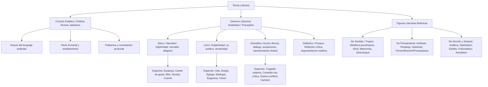

# TEMA 01: CONCEPTOS FUNDAMENTALES DE LA LITERATURA: FUNCIÓN ESTÉTICA, GÉNEROS LITERARIOS Y FIGURAS RETÓRICAS

---

## 1. PORTADA Y METADATOS CURRICULARES

| Campo | Detalle |
| :--- | :--- |
| **Eje Temático** | Eje 06: Comunicación |
| **Materia** | Literatura (Teoría Literaria y Preceptiva) |
| **Nivel de Dificultad** | Preuniversitario Avanzado (UNSA / UNMSM / UNI) |
| **Tiempo de Estudio Recomendado** | 4.0 horas |
| **Resolución Curricular** | R.C.U. N.° 0028-2026 (Admisión 2027) |
| **Prerrequisitos** | Lenguaje: Semántica, Denotación y Connotación (Tema 08) |
| **Objetivo Pedagógico** | Comprender la naturaleza estética y ficcional del fenómeno literario; dominar la clasificación clásica y moderna de los géneros y especies literarias (épico-narrativo, lírico, dramático, ensayo); e identificar con precisión rigurosa las figuras literarias fonéticas, sintácticas y semánticas en textos poéticos y narrativos. |

---

## 2. MAPA CONCEPTUAL SINTÉTICO (MERMAID)



---

## 3. FUNDAMENTACIÓN TEÓRICA RIGUROSA

### 3.1. La Literatura y la Función Poética
La **literatura** es un arte cuyo instrumento fundamental es la palabra oral o escrita. En el marco de la teoría lingüística de Roman Jakobson, en el hecho literario predomina la **función poética o estética**, donde el foco del acto comunicativo recae sobre la propia **forma del mensaje**.
- **La Literalidad (*Literariedad* de los formalistas rusos):** Conjunto de propiedades que transforman un discurso verbal común en una obra de arte, mediante el **extrañamiento** (*ostranenie* según Viktor Shklovski), desautomatizando la percepción cotidiana.
- **Pacto Ficcional:** Convención tácita entre autor y lector donde este último suspende temporalmente su incredulidad para aceptar como verosímil el universo representado, aun cuando carezca de correlato empírico directo.

---

### 3.2. Taxonomía de los Géneros Literarios

La división tripartita canónica se remonta a la *Poética* de Aristóteles:

| Género Literario | Perspectiva Predominante | Rasgos Definitorios | Especies Representativas |
| :--- | :--- | :--- | :--- |
| **Épico (Clásico) / Narrativo (Moderno)** | **Objetiva:** El autor contempla y relata acontecimientos externos reales o ficticios ocurridos en el pasado. | Presencia de un narrador; estructura cronotópica (tiempo y espacio); personajes y diégesis. La épica clásica se escribe en verso; la narrativa moderna, en prosa. | - **Epopeya:** Hazañas heroicas y deidades antiguas (*Ilíada*, *Odisea*).<br>- **Cantar de gesta:** Hazañas de caballeros medievales (*Cantar de Mio Cid*).<br>- **Novela:** Relato extenso, complejo y pluridimensional (*El Quijote*).<br>- **Cuento:** Relato breve, condensado, con tensión única (*El gato negro*). |
| **Lírico** | **Subjetiva:** Expresión del mundo interior, afectos, estados anímicos e impresiones del emisor. | Presencia de un **yo poético** o hablante lírico; ritmo, musicalidad, brevedad y alta densidad connotativa. Escrito predominantemente en verso. | - **Oda:** Poema de alabanza, entusiasmo o admiración.<br>- **Elegía:** Expresión de dolor ante la muerte o pérdida irreparable (*Coplas* de Manrique).<br>- **Égloga:** Poema pastoril idealizado en marco campestre bucólico (*Garcilaso*).<br>- **Madrigal:** Poema breve de amor no correspondido o galanteo.<br>- **Epigrama:** Poema breve satírico, mordaz o punzante.<br>- **Yaraví:** Composición lírica mestiza de origen quechua (harawi) sobre el desamor (Mariano Melgar). |
| **Dramático** | **Acción Directa y Dialógica:** No hay un narrador intermediario que relate los hechos; los personajes encarnan la historia. | Concebido para su **representación escénica** ante un público; uso de diálogos, monólogos y acotaciones teatrales (didascalias). | - **Tragedia:** Protagonistas nobles enfrentados a un destino inexorable (fatum); culmina en catástrofe y busca la purificación espiritual (**catarsis**). (*Edipo Rey*).<br>- **Comedia:** Enfoque cómico o satírico de la vida cotidiana; personajes vulgares; final feliz (*El avaro*, *Ña Catita*).<br>- **Drama (Tragicomedia):** Combina elementos trágicos y cómicos; refleja la condición humana real (*La vida es sueño*, *Fuenteovejuna*). |
| **Didáctico / Ensayo** | **Reflexiva y Argumentativa:** Exposición subjetiva y rigurosa de una tesis o juicio crítico. | Prosa argumentativa con voluntad de estilo artístico sin pretensión de exhaustividad técnica absoluta. Creado por Michel de Montaigne. | - **Ensayo:** *Pájinas libres* de Manuel González Prada.<br>- **Fábula:** Narración alegórica con moraleja explícita. |

---

### 3.3. Figuras Literarias (Figuras Retóricas)

#### A. Figuras de Sentido o Tropos (Cambio de Significado)
1. **Metáfora:** Traslación del sentido recto de un vocablo a otro figurado mediante una relación de semejanza o analogía implícita:
   - *Metáfora Impura (A es B):* *"Nuestras vidas **son los ríos** que van a dar a la mar..."* (Jorge Manrique).
   - *Metáfora Pura (solo B en lugar de A):* *"La **luna de plata** surcaba el cielo"* (por la luna radiante).
2. **Símil (Comparación explícita):** Cotejo directo entre dos planos mediante nexos comparativos (*como, cual, tal, parece*):
   *"Tus ojos son **como** dos luceros en la noche oscura."*
3. **Metonimia:** Sustitución de un término por otro basada en relaciones de contigüidad espacial, causal o material:
   - Causa por efecto: *Vive de su sudor* (de su trabajo).
   - Autor por obra: *Compró un Picasso* (un cuadro de Picasso).
   - Continente por contenido: *Bebió una copa* (el líquido de la copa).
4. **Sinécdoque:** Variedad metonímica de inclusión cuantitativa (la parte por el todo o el todo por la parte):
   - *Ganarse el pan diario* (por el alimento).
   - *El estadio rugió* (los espectadores del estadio).

#### B. Figuras de Pensamiento (Contraste e Intensificación)
1. **Antítesis:** Contraposición dialéctica de dos ideas o palabras con significados opuestos:
   *"Es tan corto el amor y es tan largo el olvido."* (Pablo Neruda).
2. **Paradoja:** Unión aparente de dos conceptos irreconciliables que encierran una verdad poética profunda:
   *"Vivo sin vivir en mí, y tan alta vida espero, que muero porque no muero."* (Santa Teresa de Jesús).
3. **Hipérbole:** Exageración desmesurada de rasgos, dimensiones o acciones para impresionar la imaginación del lector:
   *"Érase un hombre a una nariz pegado..."* (Francisco de Quevedo).
   *"Tanto dolor se agrupa en mi costado, que por doler me duele hasta el aliento."* (Miguel Hernández).
4. **Prosopopeya (Personificación):** Atribución de facultades humanas o vitales a seres inanimados, conceptos abstractos o animales:
   *"La luna reía burlonamente tras las nubes de la cordillera."*

#### C. Figuras de Dicción y Sintaxis (Forma y Posición)
1. **Anáfora:** Reiteración rítmica de una o varias palabras al **comienzo** de versos o frases consecutivas:
   *"Temprano levantó la muerte el vuelo,*
   *temprano madrugó la madrugada,*
   *temprano estás rodando por el suelo."* (Miguel Hernández).
2. **Hipérbaton:** Alteración intencionada del orden sintáctico canónico de la oración ($Sujeto + Verbo + Complementos$):
   *"Volverán las oscuras golondrinas en tu balcón sus nidos a colgar."* (Gustavo Adolfo Bécquer).
   (Orden regular: *Las oscuras golondrinas volverán a colgar sus nidos en tu balcón*).
3. **Epíteto:** Adjetivo calificativo explicativo que destaca una cualidad intrínseca o consustancial del sustantivo:
   *"Por ti la **verde hierba**, el **fresco viento**, el **blanco lirio** y **colorada rosa**..."* (Garcilaso de la Vega).
4. **Polisíndeton vs. Asíndeton:**
   - *Polisíndeton:* Repetición deliberada de conjunciones coordinantes (*y, o, ni*) para dotar de solemnidad o lentitud al ritmo: *"Y sueña, y ama, y lucha, y vence"*.
   - *Asíndeton:* Omisión sistemática de conjunciones para dar dinamismo, velocidad o vértigo: *"Llegué, vi, vencí"* (*Veni, vidi, vici*).

---

## 4. FÓRMULAS, TAXONOMÍAS Y LEYES FUNDAMENTALES

### 4.1. Algoritmo de Identificación de Figuras Retóricas

$$\text{¿Existe nexo comparativo explícito (como, cual)?} \begin{cases} \text{SÍ} \longrightarrow \mathbf{S\acute{i}mil} \\ \text{NO} \longrightarrow \begin{cases} \text{¿Sustituye un término por semejanza conceptual?} \longrightarrow \mathbf{Met\acute{a}fora} \\ \text{¿Opone dos términos opuestos?} \longrightarrow \mathbf{Ant\acute{i}tesis} \\ \text{¿Altera el orden gramatical regular?} \longrightarrow \mathbf{Hip\acute{e}rbaton} \\ \text{¿Exagera una realidad desmesuradamente?} \longrightarrow \mathbf{Hip\acute{e}rbole} \end{cases} \end{cases}$$

---

## 5. CASOS PRÁCTICOS Y MODELIZACIONES DEL MUNDO REAL

### Caso 1: Análisis del Discurso Poético de Mariano Melgar
En el *Yaraví IV* de Mariano Melgar leemos:
> *"Vuelve, que ya no puedo*
> *vivir sin tus cariños:*
> *vuelve mi palomita,*
> *vuelve a tu dulce nido."*

- **Género Literario:** Lírico (expresión de congoja y desgarro íntimo ante el desdén de Silvia).
- **Especie:** Yaraví (mestizaje entre la elegía hispánica y el *harawi* quechua prehispánico).
- **Figuras Retóricas Operativas:**
  1. *Anáfora:* Repetición imperativa y desesperada del verbo *"vuelve"* al inicio de los versos 1, 3 y 4.
  2. *Metáfora:* Identificación lírica de la amada Silvia con la *"palomita"* (símbolo andino del amor puro y esquivo: la *urpi*) y del hogar amoroso con el *"dulce nido"*.
  3. *Apóstrofe lírico:* Convocación angustiada a la interlocutora ausente.

---

## 6. PRE-UNIVERSITY HACKS Y MNEMOTÉCNIAS

### 1. Mnemotécnia de los Tres Géneros Aristotélicos: "E-L-D"
- **É**pico $\longrightarrow$ **E**xterior / **E**ventos externos (Objetivo, narrador).
- **L**írico $\longrightarrow$ **I**nterior / **I**ntimidad afectiva (Subjetivo, yo poético).
- **D**ramático $\longrightarrow$ **D**iálogo / **D**irecto sobre tablas (Representación teatral).

### 2. Hack de Oro: Símil vs. Metáfora
$$\text{Plano Real} + \mathbf{Nexo \ (como, \ cual, \ parece)} + \text{Plano Evocado} = \mathbf{S\acute{i}mil}$$
$$\text{Plano Real} + \mathbf{Verbo \ Ser \ o \ Nexo \ Nulo} + \text{Plano Evocado} = \mathbf{Met\acute{a}fora}$$

---

## 7. ERRORES FRECUENTES Y TRAMPAS DE EXAMEN

1. **Confundir Épica con Género Dramático:**
   - *Trampa:* Decir que la *Ilíada* pertenece al género dramático porque hay diálogos entre Aquiles y Agamenón.
   - *Realidad Preuniversitaria:* La *Ilíada* es una **Epopeya** (Género Épico), porque los acontecimientos son narrados por un rapsoda u aedo épico omnisciente en verso hexámetro, no representados en un escenario teatral.
2. **Confundir Antítesis con Paradoja:**
   - *Antítesis:* Oposición lógica clara sin contradicción existencial (*El día es claro y la noche es oscura*).
   - *Paradoja:* Contradicción aparente que encierra una verdad conceptual profunda imposible de resolver formalmente (*Muero porque no muero*).
3. **Confundir la Tragedia con el Drama:**
   - La **Tragedia** está regida por la fatalidad del destino (*fatum*) y concluye invariablemente en aniquilación o castigo inevitable; el **Drama** permite el libre albedrío humano y yuxtapone lo risible con lo doloroso.

---

## 8. 5 PROBLEMAS RESUELTOS GRADUADOS

### Problema 1 (Nivel Básico: Identificación de Especies Líricas)
La composición poética que expresa lamento acongojado y dolor profundo por el fallecimiento de un ser querido se denomina:
- A) Oda
- B) Égloga
- C) Elegía
- D) Epigrama
- E) Madrigal

**Resolución:**
- La oda es un canto de exaltación o alabanza.
- La égloga es una composición bucólica de ambiente pastoril.
- El epigrama es un poema breve satírico.
- El madrigal es un poema de exaltación amorosa y galante.
- La **elegía** es la especie lírica destinada específicamente a manifestar el luto, la melancolía y el dolor por la muerte de un ser amado o una desgracia colectiva (*Coplas a la muerte de su padre* de Jorge Manrique).
**Respuesta:** **C**

---

### Problema 2 (Nivel Intermedio: Identificación de Figura Sintáctica)
En los versos de Góngora: *"Del salón en el ángulo oscuro, / de su dueña tal vez olvidada, / silenciosa y cubierta de polvo, / veíase el arpa"*, la figura retórica preponderante que afecta el orden sintáctico se denomina:
- A) Anáfora
- B) Hipérbaton
- C) Epíteto
- D) Metonimia
- E) Paradoja

**Resolución:**
El orden lógico habitual de la oración sería: *El arpa veíase silenciosa y cubierta de polvo en el ángulo oscuro del salón, tal vez olvidada de su dueña*. El poeta ha transpuesto y alterado deliberadamente la sintaxis ordinaria para generar tensión métrica y musicalidad. Dicha figura de construcción sintáctica es el **hipérbaton**.
**Respuesta:** **B**

---

### Problema 3 (Nivel Intermedio-Avanzado: Teoría Dramática Aristotélica)
En la preceptiva aristotélica sobre la tragedia clásica griega, el concepto de **catarsis** se define formalmente como:
- A) La transgresión de las leyes divinas por parte del héroe trágico.
- B) La intervención de los dioses para resolver un conflicto irresoluble.
- C) La purificación espiritual de las pasiones en el espectador mediante el terror y la compasión.
- D) El cambio súbito de la fortuna del protagonista de la felicidad a la desdicha.
- E) El enfrentamiento dialéctico entre el coro y los actores trágicos.

**Resolución:**
En la *Poética*, Aristóteles sostiene que la tragedia imita acciones graves y completas que, al suscitar en el público **compasión** (*éleos*) y **temor reverencial** (*phobos*), provocan la liberación, purga o purificación de los afectos y desgarros íntimos: la **catarsis** (*kátharsis*).
**Respuesta:** **C**

---

### Problema 4 (Nivel Avanzado: Figuras de Sentido y Tropos Complejos)
En la expresión poética: *"El Perú entero lloró la partida de su más insigne poeta"*, encontramos un caso emblemático de:
- A) Hipérbaton
- B) Metáfora pura
- C) Sinécdoque
- D) Antítesis
- E) Anáfora

**Resolución:**
La frase utiliza *"El Perú entero"* para designar a los habitantes o ciudadanos peruanos. Es la designación del **todo por la parte** (o el continente geográfico por los seres que lo pueblan). Dicha relación cuantitativa de inclusión es propia de la **sinécdoque** (tropo conexo a la metonimia).
**Respuesta:** **C**

---

### Problema 5 (Nivel 5: Reto Titán / Jefe Final de Admisión - UNSA / UNMSM)
Lea con agudeza crítica la siguiente estrofa del poeta vanguardista César Vallejo:
> *"Hay golpes en la vida, tan fuertes... ¡Yo no sé!*
> *Golpes como del odio de Dios; como si ante ellos,*
> *la resaca de todo lo sufrido*
> *se empozara en el alma... ¡Yo no sé!"*

Determine la veracidad ($V$) o falsedad ($F$) de las siguientes afirmaciones teóricas:
I. Pertenece al género lírico y se evidencia la presencia de un hablante lírico desgarrado por el dolor existencial.
II. El verso *"Golpes como del odio de Dios"* estructura un símil que dimensiona metafísicamente la intensidad del sufrimiento.
III. Los versos 1 y 4 configuran una estructura de anáfora vertical continua estricta.
IV. La expresión *"la resaca de todo lo sufrido / se empozara en el alma"* constituye una poderosa metáfora que traslada una imagen física marina al ámbito psicológico espiritual.

- A) V - V - F - V
- B) V - V - V - V
- C) F - V - F - V
- D) V - F - V - F
- E) F - F - V - V

**Resolución Paso a Paso:**
- **Afirmación I (VERDADERA):** El poema *Los heraldos negros* pertenece al género lírico; el hablante lírico comunica en primera persona su desamparo existencial radical.
- **Afirmación II (VERDADERA):** La presencia del nexo comparativo explícito *"como"* une el dolor humano concreto con una magnitud teológica descomunal (*el odio de Dios*), constituyendo un **símil** de escala cósmica.
- **Afirmación III (FALSA):** La anáfora estricta exige la reiteración de una o varias palabras al **comienzo** de versos consecutivos inmediatos. La frase *¡Yo no sé!* se halla al **final** del verso 1 y al **final** del verso 4; se trata de una epífora o estribillo enmarcador, no de una anáfora canónica.
- **Afirmación IV (VERDADERA):** La "resaca" (sedimento y reflujo marino amargo) se proyecta sobre el "alma" como un depósito de dolor acumulado, configurando una **metáfora** de elevadísima densidad poética.
Secuencia correcta: **V - V - F - V**.
**Respuesta:** **A**

---

## 9. GLOSARIO TÉCNICO ESPECIALIZADO

1. **Acotación (Didascalia):** Indicación técnica que el dramaturgo inserta en el texto teatral entre paréntesis o cursivas para orientar la escenografía, gestos o movimientos de los actores.
2. **Antítesis:** Figura retórica que consiste en la yuxtaposición de dos ideas, palabras o frases de significados opuestos para realzar su vigor expresivo.
3. **Catarsis:** Purificación o sublimación moral y emocional del espectador provocada por el terror y la piedad tras contemplar la tragedia.
4. **Diégesis:** El universo ficticio, la trama o la historia en la que se desarrollan los acontecimientos relatados por un narrador.
5. **Égloga:** Subgénero lírico caracterizado por el diálogo idealizado de pastores sobre sus amores en un marco natural idílico (*locus amoenus*).
6. **Epíteto:** Adjetivo ornamental que resalta una característica propia, prototípica o consustancial del sustantivo al que acompaña.
7. **Hablante Lírico:** Voz ficticia o ente enunciativo que asume la expresión de los sentimientos y vivencias íntimas en el poema.
8. **Hipérbaton:** Figura sintáctica consistente en la alteración del orden gramatical natural y lógico de los elementos de la oración.
9. **Metáfora:** Tropo fundamental que traslada el significado de un término a otro mediante una analogía o cotejo implícito desprovisto de nexo conjuntivo.
10. **Símil:** Figura retórica que compara expresamente dos elementos diferentes valiéndose de un enlace comparativo explícito (*como, tal cual, parece*).

---

## 10. FLASHCARDS DE REPASO ACTIVO

| Front (Pregunta / Disparador) | Back (Respuesta Nemotécnica / Precisa) |
| :--- | :--- |
| ¿Qué diferencia a la Epopeya del Cantar de Gesta? | La **epopeya** es de la Antigüedad clásica con intervención activa de dioses y mitos (*Ilíada*); el **cantar de gesta** es medieval, de carácter realista y con héroes caballerescos feudales (*Mio Cid*). |
| ¿Qué define al Género Dramático frente a la Épica? | En el género dramático **no hay narrador intermediario**; la historia se desarrolla a través de la acción dialógica y directa de los personajes en escena. |
| ¿Cuál es la diferencia formal entre Símil y Metáfora? | El **símil** lleva siempre un nexo comparativo explícito (*como, cual*); la **metáfora** establece una identificación analógica directa sin nexo comparativo. |
| ¿En qué consiste la Catarsis trágica según Aristóteles? | En la purificación y liberación de las pasiones del alma mediante la **compasión** (*éleos*) y el **terror** (*phobos*). |
| ¿Qué es un Hipérbaton? | La alteración deliberada del orden sintáctico habitual de la oración para lograr musicalidad y extrañamiento poético. |

---

## 11. PREGUNTAS DE AUTOEVALUACIÓN RÁPIDA

1. *"El dulce néctar de tus labios encendió mi alma"*. La expresión *"dulce néctar"* constituye un ejemplo de:
   - A) Hipérbaton
   - B) Epíteto
   - C) Anáfora
   - D) Paradoja
   - *Respuesta correcta:* **B** (Adjetivo intrínseco ornamental que resalta una cualidad inherente).
2. Es la especie dramática que combina armónicamente elementos dolorosos y festivos de la vida humana:
   - A) Tragedia
   - B) Auto sacramental
   - C) Drama o tragicomedia
   - D) Comedia aristofánica
   - *Respuesta correcta:* **C** (Reflejo mestizo de la condición humana).
3. La obra de Jorge Manrique, *Coplas a la muerte de su padre*, pertenece a la especie lírica denominada:
   - A) Oda
   - B) Égloga
   - C) Elegía
   - D) Yaraví
   - *Respuesta correcta:* **C** (Lamento lírico fúnebre y meditativo).

---

## 12. BLOQUE DE INTEGRACIÓN KMP / GAMIFICACIÓN (JSON)

```json
{
  "tema_id": "LIT_01",
  "eje_tematico": "06_COMUNICACION",
  "curso": "LITERATURA",
  "titulo_tema": "Conceptos Fundamentales de la Literatura: Función Estética, Géneros y Figuras",
  "dificultad": "Avanzado",
  "xp_recompensa": 240,
  "habilidades_evaluadas": [
    "Diferenciación entre géneros épico, lírico y dramático",
    "Identificación de figuras de sentido (metáfora, metonimia, sinécdoque)",
    "Reconocimiento de figuras de posición (hipérbaton, anáfora)",
    "Concepto aristotélico de catarsis trágica"
  ],
  "boss_challenge": {
    "boss_name": "El Aedo Ciego del Monte Olimpo",
    "vida_boss": 3200,
    "ataque_especial": "Metáfora Espejada e Hipérbaton Laberíntico",
    "pregunta_reto": "¿Cuál es la figura retórica dominante en el verso de Quevedo: 'Érase un hombre a una nariz pegado'?",
    "opciones": [
      "Metáfora pura",
      "Hipérbole descomunal",
      "Símil burlesco",
      "Asíndeton severo"
    ],
    "respuesta_correcta_index": 1,
    "explicacion_gamificada": "¡Ataque crítico legendario! La desmesurada inversión caricaturesca de que el hombre está pegado a una nariz gigantesca constituye la hipérbole satírica más célebre del Siglo de Oro."
  }
}
```
