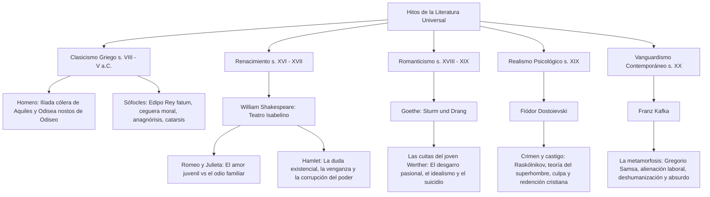

# TEMA 02: LITERATURA UNIVERSAL: CLASICISMO GRIEGO, RENACIMIENTO, ROMANTICISMO, REALISMO Y VANGUARDISMO

---

## 1. PORTADA Y METADATOS CURRICULARES

| Campo | Detalle |
| :--- | :--- |
| **Eje Temático** | Eje 06: Comunicación |
| **Materia** | Literatura Universal |
| **Nivel de Dificultad** | Preuniversitario Avanzado (UNSA / UNMSM / UNI) |
| **Tiempo de Estudio Recomendado** | 5.0 horas |
| **Resolución Curricular** | R.C.U. N.° 0028-2026 (Admisión 2027) |
| **Prerrequisitos** | Conceptos Fundamentales, Géneros y Figuras Retóricas (Tema 01) |
| **Objetivo Pedagógico** | Analizar e interpretar los hitos cumbres de la literatura universal: la épica y la tragedia clásica griega (*Ilíada*, *Odisea*, *Edipo Rey*); el drama renacentista isabelino (*Romeo y Julieta*, *Hamlet*); el romanticismo alemán (*Las cuitas del joven Werther*); el realismo psicológico ruso (*Crimen y castigo*); y la narrativa vanguardista del absurdo y la alienación (*La metamorfosis* de Kafka). |

---

## 2. MAPA CONCEPTUAL SINTÉTICO (MERMAID)



---

## 3. FUNDAMENTACIÓN TEÓRICA RIGUROSA

### 3.1. El Clasicismo Griego
El clasicismo helénico sentó las bases estéticas de Occidente bajo los ideales de **armonía**, **proporción**, **equilibrio formal** y una visión antropocéntrica fatalista subordinada al destino inexorable impuesta por los dioses (*fatum* o *moira*).

#### A. Homero y la Épica Heroica
- **La Ilíada:**
  - *Género:* Épico. *Especie:* Epopeya heroica en 24 cantos (versos hexámetros dactílicos).
  - *Tema Central:* **La cólera de Aquiles** (*el de los pies ligeros*) y sus funestas consecuencias para el ejército aqueo en el décimo año de la Guerra de Troya.
  - *Estructura Argumental:* Se inicia con la afrenta de Agamenón al arrebatarle a Briseida a Aquiles; el retiro de este provoca derrotas aqueas; la muerte de Patroclo a manos del troyano Héctor desata la segunda cólera de Aquiles; Aquiles mata a Héctor, ultraja su cadáver y finalmente, conmovido por las súplicas del anciano rey Príamo, entrega el cuerpo para sus funerales.
  - *Arquetipos:* Héctor (el patriotismo y deber cívico), Aquiles (la pasión heroica desmedida y la gloria eterna), Príamo (la piedad paternal).
- **La Odisea:**
  - *Género:* Épico. *Especie:* Epopeya de aventuras y navegación en 24 cantos.
  - *Tema Central:* **El retorno (*nostos*) de Odiseo** (Ulises), rey de Ítaca, tras diez años de errancia marina, y la reconquista de su hogar y reino.
  - *Estructura Tripartita:* 1. La Telemaquia (búsqueda de Telémaco); 2. El regreso de Odiseo (aventuras fabulosas: Polifemo, Circe, las Sirenas, Calipso); 3. La venganza en Ítaca (aniquilación de los pretendientes de Penélope con ayuda de Telémaco y el porquerizo Eumeo).

#### B. Sófocles y la Tragedia Ática: *Edipo Rey*
- *Género:* Dramático. *Especie:* Tragedia en un solo acto ininterrumpido con coro.
- *Tema Central:* **La inexorabilidad del destino fatal (*fatum*)** y la búsqueda implacable de la propia verdad y culpabilidad.
- *Desarrollo Trágico:* Tebas sufre una peste enviada por Apolo debido al asesinato impune del rey Layo. Edipo jura descubrir y desterrar al culpable. Las revelaciones del adivino Tiresias y el testimonio de los pastores conducen a la **anagnórisis** (reconocimiento): Edipo mató a su padre Layo en una encrucijada y se casó con su propia madre Yocasta, cumpliendo con exactitud matemática el oráculo délfico que intentó evitar. Yocasta se ahorca con sus trenzas y Edipo se arranca los ojos con los broches de oro de su túnica, asumiendo su autocastigo en el destierro ciego.

---

### 3.2. El Renacimiento y William Shakespeare
El humanismo renacentista sitúa las contradicciones morales y pasiones del hombre en el centro del drama. Shakespeare domina el **teatro isabelino** mezclando verso y prosa, quebrando las tres unidades aristotélicas y forjando arquetipos universales.

| Obra de Shakespeare | Género / Especie | Tema Fundamental | Arquetipo Universal Encarnado |
| :--- | :--- | :--- | :--- |
| ***Romeo y Julieta*** | Dramático / Tragedia | El amor pasional juvenil aplastado por el odio atávico entre las familias rivales (Montesco y Capuleto) en Verona. | **El amor juvenil absoluto** que desafía convenciones y desemboca en sacrificio. |
| ***Hamlet*** | Dramático / Tragedia | La duda metafísica ante el dilema de la venganza moral (*«Ser o no ser, esa es la cuestión»*) y la podredumbre política de la corte de Elsinor. | **La duda existencial y la parálisis de la acción** reflexiva ante la injusticia del mundo. |
| ***Otelo*** | Tragedia | Las intrigas del alférez Yago desatan los celos ciegos del moro general. | **Los celos patológicos y la manipulación perversa**. |
| ***Macbeth*** | Tragedia | El regicidio impulsado por la profecía de las brujas y la ambición desmedida instigada por Lady Macbeth. | **La ambición ciega por el poder tiránico**. |

---

### 3.3. El Romanticismo: Goethe y *Las cuitas del joven Werther*
El Romanticismo se subleva contra el racionalismo frío de la Ilustración, proclamando la primacía de la **sensibilidad extrema**, el **individualismo rebelde** y el culto al dolor existencial.
- **Contexto:** Movimiento alemán *Sturm und Drang* (Tormenta e Ímpetu).
- **Estructura:** Novela epistolar (cartas dirigidas principalmente a su amigo Wilhelm).
- **Tema:** El amor imposible y destructivo de Werther por Lotte (Carlota), prometida y luego esposa del burgués racional y honorable Albert.
- **Desenlace Trágico:** Incapaz de conciliar sus pasiones desaforadas con las convenciones morales del orden social burgués, Werther pide prestadas las pistolas de Albert y se suicida pegándose un tiro en la sien. Desató una ola de fervor y suicidios colectivos en Europa (*efecto Werther*).

---

### 3.4. El Realismo Psicológico: Fiódor Dostoievski y *Crimen y castigo*
El Realismo surge como reacción al subjetivismo romántico, radiografiando la realidad social, las miserias urbanas y los abismos psicológicos del ser humano.
- **Obra Cumbre:** *Crimen y castigo* (1866). Novela psicológica y filosófica.
- **Protagonista:** Rodión Románovich Raskólnikov, un joven estudiante de derecho empobrecido en San Petersburgo.
- **Núcleo Filosófico: La teoría del Hombre Extraordinario:** Raskólnikov concibe que la humanidad se divide en dos clases:
  1. *Los hombres ordinarios:* Masa sumisa y conservadora obligada a obedecer la ley moral.
  2. *Los hombres extraordinarios:* Genios excepcionales (como Napoleón) que tienen el derecho moral de violar las leyes y derramar sangre para instaurar un bien superior a la humanidad.
- **El Crimen:** Para comprobar si él es un "hombre extraordinario", asesina con un hacha a la vieja usurera Aliona Ivánovna (a quien considera un "piojo social inútil"), pero en el acto mata también accidentalmente a la inocente hermana de esta, Lizaveta.
- **El Castigo y la Redención:** El verdadero castigo no es la policía del sagaz juez Porfiri Petróvich, sino el infierno psicológico de la culpa, la paranoia y el aislamiento moral. Solo gracias al amor abnegado y compasivo de **Sonia Marmeládova** (prostituta por amor a su familia hambrienta, símbolo de la fe cristiana pura), Raskólnikov se entrega a la justicia y marcha a cumplir su condena a Siberia, iniciando su dolorosa expiación y resurrección espiritual.

---

### 3.5. El Vanguardismo: Franz Kafka y *La metamorfosis*
La literatura del siglo XX refleja las crisis de entreguerras, la mecanización deshumanizante, el existencialismo y la alienación del individuo en la sociedad moderna burocrática.
- **La Metamorfosis (*Die Verwandlung*, 1915):** Relato largo o novela corta expresionista y existencial.
- **Premisa:** Gregorio Samsa, un viajante de comercio que sostiene económicamente a sus padres y a su hermana Grete, despierta una mañana transformado en un monstruoso insecto (*Ungeziefer*).
- **Ejes Temáticos Fundamentales:**
  1. **La Alienación Laboral:** Gregorio no lamenta su pérdida de figura humana; su primera angustia neurótica es haber perdido el tren para llegar al trabajo y la represalia de su jefe.
  2. **La Deshumanización y la Inutilidad Social:** Al dejar de ser el sostén productivo de la familia, pasa progresivamente de ser objeto de lástima a motivo de vergüenza, asco y odio.
  3. **El Conflicto Paternal:** El padre lo agrede violentamente incrustándole una manzana podrida en el caparazón dorsal, que se infecta.
  4. **El Absurdo y la Muerte:** La propia hermana Grete, a quien Gregorio amaba profundamente (quería pagarle el conservatorio), proclama que deben "deshacerse de ese monstruo". Gregorio muere solo y desnutrido en su habitación; tras su muerte, la familia experimenta un alivio egoísta y planifica el porvenir casando a la hija.

---

## 4. FÓRMULAS, TAXONOMÍAS Y LEYES FUNDAMENTALES

### 4.1. Cuadro Sinóptico de Arquetipos y Filosofías Universales

$$\begin{array}{|l|l|l|l|}
\hline
\textbf{Autor y Época} & \textbf{Obra} & \textbf{Problema Filosófico} & \textbf{Categoría Estética} \\ \hline
\text{Homero (Clasicismo)} & \textit{La Ilíada} & \text{Destino, gloria y honor heroico} & \text{Épica heroica} \\ \hline
\text{Sófocles (Clasicismo)} & \textit{Edipo Rey} & \text{Predestinación vs. Libre albedrío} & \text{Catarsis trágica} \\ \hline
\text{Shakespeare (Renacimiento)} & \textit{Hamlet} & \text{Duda existencial y corrupción del ser} & \text{Teatro isabelino} \\ \hline
\text{Goethe (Romanticismo)} & \textit{Werther} & \text{Pasión subjetiva vs. Orden burgués} & \text{Sturm und Drang} \\ \hline
\text{Dostoievski (Realismo)} & \textit{Crimen y castigo} & \text{Superhombre, culpa moral y fe cristiana} & \text{Novela psicológica} \\ \hline
\text{Kafka (Vanguardismo)} & \textit{La metamorfosis} & \text{Alienación, absurdo y deshumanización} & \text{Expresionismo / Existencial} \\ \hline
\end{array}$$

---

## 5. CASOS PRÁCTICOS Y MODELIZACIONES DEL MUNDO REAL

### Caso 1: La Alienación Tecnológica Contemporánea a la Luz de Kafka
- En el mundo corporativo contemporáneo hiperconectado, trabajadores de plataformas digitales o fábricas automatizadas son reducidos a un mero engranaje algorítmico de producción (*burnout* extremo).
- **Paralelo Kafkiano:** La transformación de Gregorio Samsa en insecto es la metáfora definitiva de la cosificación humana: si un individuo no rinde económicamente o se enferma, el sistema productivo y la propia estructura social lo desechan como un parásito inservible.

---

## 6. PRE-UNIVERSITY HACKS Y MNEMOTÉCNIAS

### 1. El Hack de la Ilíada: "La Cólera Doble de Aquiles"
- **1.ª Cólera:** Contra Agamenón por quitarle a **Briseida** $\rightarrow$ Trae derrota a los griegos.
- **2.ª Cólera:** Contra Héctor por asesinar a **Patroclo** $\rightarrow$ Trae la muerte de Héctor y el fin del poema con sus funerales.
> *Cuidado:* En la *Ilíada* **NO** se narra el Caballo de Troya ni la muerte de Aquiles (estos hechos se relatan en la *Eneida* de Virgilio y en la *Odisea*).

### 2. Mnemotécnia de Personajes de Crimen y Castigo
- **R**askólnikov: **R**azona el asesinato (El falso superhombre).
- **A**liona: La usurera (El "piojo").
- **S**onia: **S**alvación y redención espiritual por el amor.
- **P**orfiri Petróvich: **P**olicía psicológico implacable.

---

## 7. ERRORES FRECUENTES Y TRAMPAS DE EXAMEN

1. **Creer que la Ilíada concluye con la caída de Troya:**
   - *Trampa:* Muchas preguntas afirman que la *Ilíada* termina con el incendio de Troya y el caballo de madera.
   - *Realidad:* La *Ilíada* termina con los **funerales y exequias de Héctor**, príncipe troyano. Troya aún no ha caído.
2. **Confundir quién asesina a Layo en Edipo Rey:**
   - Edipo no sabía que Layo era su padre cuando lo mató en una encrucijada de tres caminos (*el trivio*), pues creía que sus verdaderos padres eran Pólibo y Mérope, reyes de Corinto que lo adoptaron.
3. **El verdadero final de La metamorfosis:**
   - La obra no termina con la muerte solitaria de Gregorio, sino con el paseo campestre en tranvía de la familia Samsa, aliviada, planeando el ventajoso matrimonio de su hija Grete.

---

## 8. 5 PROBLEMAS RESUELTOS GRADUADOS

### Problema 1 (Nivel Básico: Épica Homérica)
¿Cuál es el acontecimiento que desencadena la reconciliación temporal entre griegos y troyanos al finalizar la *Ilíada* de Homero?
- A) El pacto de amistad jurado entre Menelao y Paris.
- B) La muerte heroica de Aquiles por una flecha en el talón.
- C) La súplica del anciano rey Príamo a Aquiles para rescatar el cuerpo de su hijo Héctor y celebrar sus funerales.
- D) El ingreso del caballo de madera a las murallas de Troya.
- E) La huida de Eneas llevando a su padre en hombros.

**Resolución:**
En el canto XXIV de la *Ilíada*, el anciano rey Príamo ingresa encubierto al campamento aqueo, besa las manos homicidas de Aquiles y le suplica el rescate del cadáver de su primogénito Héctor. Conmovido por el recuerdo de su propio padre Peleo, Aquiles aplaca su cólera, devuelve el cuerpo y concede doce días de tregua para celebrar los solemnes funerales de Héctor, con lo cual se cierra la epopeya.
**Respuesta:** **C**

---

### Problema 2 (Nivel Intermedio: Tragedia Griega - Edipo Rey)
En la tragedia *Edipo Rey* de Sófocles, el momento dramático culminante en el que Edipo descubre con horror que él mismo es el asesino de su padre y el esposo de su madre se denomina en la preceptiva teatral:
- A) Hibris
- B) Catarsis
- C) Anagnórisis
- D) Hamartia
- E) Parodos

**Resolución:**
La **anagnórisis** (*reconocimiento*) es el paso súbito de la ignorancia al conocimiento cabal de una identidad o hecho oculto que redefine la posición trágica del héroe. En *Edipo Rey*, coincide con la indagación a los dos viejos pastores de Layo y Corinto.
**Respuesta:** **C**

---

### Problema 3 (Nivel Intermedio-Avanzado: Realismo Psicológico de Dostoievski)
En *Crimen y castigo*, la justificación intelectual que elabora Rodión Raskólnikov para cometer el asesinato de la usurera Aliona Ivánovna se sustenta en:
- A) El resentimiento social por su expulsión inmediata de la academia militar zarista.
- B) La teoría de que los hombres extraordinarios tienen el derecho moral de transgredir la ley en beneficio de fines superiores.
- C) La necesidad imperiosa de pagar la fianza carcelaria de su amigo íntimo Razumijin.
- D) Las amenazas directas del corrupto funcionario Svidrigáilov contra su hermana Dunia.
- E) La influencia de las doctrinas socialistas revolucionarias que propugnaban la lucha armada.

**Resolución:**
Raskólnikov publicó un artículo titulado *Sobre el crimen*, donde postula que la humanidad está dividida en hombres ordinarios (obedientes y pasivos) y hombres extraordinarios (como Napoleón), quienes poseen el derecho intrínseco de violar las normas morales ordinarias e incluso matar si ello abre camino a sus propósitos históricos trascendentes.
**Respuesta:** **B**

---

### Problema 4 (Nivel Avanzado: Narrativa de Vanguardia - Kafka)
En *La metamorfosis* de Franz Kafka, la actitud de Gregorio Samsa ante su repentina transformación física en insecto evidencia:
- A) Una rebelión heroica contra la tiranía del sistema hospitalario de Praga.
- B) El terror exacerbado ante la muerte inminente y la degradación biológica.
- C) La alienación extrema, al preocuparse más por no perder el tren hacia el trabajo que por su propia deshumanización.
- D) El odio desmedido hacia su hermana Grete por descuidar la limpieza de su habitación.
- E) La satisfacción absoluta por haberse liberado definitivamente de sus deudas financieras.

**Resolución:**
Lo profundamente kafkiano y desconcertante de la obra radica en que Gregorio no se asombra metafísicamente de ser un insecto monstruoso; su primera angustia obsesiva es pragmática y laboral: mira el reloj, teme perder el tren de las cinco, teme el despido del principal y se reprocha su falta de puntualidad. Esto tipifica la alienación y cosificación del hombre moderno.
**Respuesta:** **C**

---

### Problema 5 (Nivel 5: Reto Titán / Jefe Final de Admisión - UNSA / UNMSM)
Analice con rigor crítico la correlación entre autor, obra, personaje y núcleo temático en la siguiente matriz de literatura universal:
1. Sófocles - *Edipo Rey* - Yocasta - Fatalismo ciego y automutilación como expiación del fatum.
2. Shakespeare - *Hamlet* - Horacio - Parálisis reflexiva ante la sospecha del regicidio y traición.
3. Goethe - *Las cuitas del joven Werther* - Albert - Racionalismo burgués en tensión con la pasión desmedida.
4. Fiódor Dostoievski - *Crimen y castigo* - Sonia Marmeládova - Redención moral por la vía de la abnegación cristiana y la asunción de la culpa.
5. Franz Kafka - *La metamorfosis* - Grete Samsa - Transición de la piedad fraternal inicial al rechazo utilitarista absoluto.

Son enunciados conceptualmente **IMPECABLES Y VERDADEROS**:
- A) Solo 1, 3 y 4
- B) 1, 2, 3, 4 y 5
- C) Solo 2, 4 y 5
- D) Solo 1, 4 y 5
- E) Solo 3 y 4

**Resolución Paso a Paso:**
- **1:** En *Edipo Rey*, Yocasta se suicida ahorcándose y Edipo se arranca los ojos, cumpliendo el trágico fatum oracular. (Verdadero).
- **2:** En *Hamlet*, el príncipe Hamlet (con su fiel amigo Horacio como testigo moral) encarna la parálisis trágica de la reflexión frente a la orden vengadora del espectro paterno. (Verdadero).
- **3:** Albert representa la sensatez, el orden civil y la frialdad burguesa frente al desborde volcánico y trágico de Werther. (Verdadero).
- **4:** Sonia, a pesar de su degradación forzada, es el canal de gracia y salvación moral que guía a Raskólnikov a la Biblia y a la confesión. (Verdadero).
- **5:** Grete es quien al principio cuida con compasión a Gregorio llevándole comida y tocando el violín, pero termina sentenciando: «Tenemos que quitarnos de encima a ese bicho». (Verdadero).
Las 5 afirmaciones son rigurosamente verídicas e intachables.
**Respuesta:** **B**

---

## 9. GLOSARIO TÉCNICO ESPECIALIZADO

1. **Alienación:** Proceso socio-psicológico por el cual el ser humano se despoja de su esencia propia y es transformado en objeto, herramienta productiva o mercancía ajena a sí mismo.
2. **Anagnórisis:** Momento de la tragedia clásica en que el personaje principal realiza un descubrimiento crucial sobre su identidad, parentesco o destino oculto.
3. **Catarsis:** Liberación y sublimación purificadora de las emociones de terror y compasión experimentadas por los espectadores de la tragedia griega.
4. **Epopeya:** Poema narrativo heroico en verso de la Antigüedad que canta las gestas fundacionales de un pueblo con activa intervención de dioses y héroes.
5. **Expresionismo:** Vanguardia artística que distorsiona la realidad exterior para proyectar los estados patológicos, angustias y desgarros del alma humana.
6. **Fatum (Moira):** Fuerza ciega, trascendente y suprema del destino que se impone de modo inevitable a hombres y dioses por igual en el pensamiento clásico.
7. **Hamartia:** Error fatal o juicio trágico equivocado cometido por el héroe que desencadena su propia ruina inevitable.
8. **Novela Psicológica:** Narración realista volcada al buceo analítico de los monólogos interiores, neurosis, traumas morales y motivaciones subconscientes de los personajes.
9. **Sturm und Drang:** Movimiento literario prerromántico alemán caracterizado por la rebeldía del genio creador, la exaltación de la naturaleza y el imperio volcánico de las pasiones.
10. **Teatro Isabelino:** Producción dramática renacentista inglesa (época de Isabel I) que rompió las unidades aristotélicas y fusionó lo trágico con lo cómico y lo poético con lo vulgar.

---

## 10. FLASHCARDS DE REPASO ACTIVO

| Front (Pregunta / Disparador) | Back (Respuesta Nemotécnica / Precisa) |
| :--- | :--- |
| ¿Cuál es el tema central de la *Ilíada* de Homero? | **La cólera de Aquiles** y sus trágicas consecuencias durante el décimo año de la Guerra de Troya. |
| ¿Qué profetizó el oráculo de Delfos a Layo sobre su hijo Edipo? | Que Edipo **mataría a su padre** y se **casaría con su propia madre**, engendrando una estirpe maldita. |
| ¿Cuál es la teoría filosófica de Raskólnikov en *Crimen y castigo*? | La del **Hombre Extraordinario**: ciertos seres superiores tienen el derecho moral de violar las leyes en pro del progreso de la humanidad. |
| ¿Cómo muere Gregorio Samsa en *La metamorfosis*? | Muere desnutrido, exhausto y herido por la manzana podrida incrustada en su lomo, tras ser rechazado y sentenciado por su propia familia. |
| ¿Qué conflicto plantea Goethe en *Las cuitas del joven Werther*? | El choque insoluble entre el **idealismo pasional absoluto** del artista romántico y la rigidez moral del orden burgués contemporáneo. |

---

## 11. PREGUNTAS DE AUTOEVALUACIÓN RÁPIDA

1. En la *Odisea*, la esposa fiel que espera a Odiseo durante veinte años tejiendo y destejiendo un sudario es:
   - A) Nausícaa
   - B) Circe
   - C) Penélope
   - D) Calipso
   - *Respuesta correcta:* **C** (Símbolo de la fidelidad conyugal helénica).
2. Es el arquetipo shakesperiano de la duda existencial y la venganza:
   - A) Otelo
   - B) Hamlet
   - C) Macbeth
   - D) Romeo
   - *Respuesta correcta:* **B** (*«Ser o no ser»* en el drama de Elsinor).
3. ¿Quién acompaña espiritualmente a Raskólnikov en su condena a Siberia en *Crimen y castigo*?
   - A) Aliona Ivánovna
   - B) Sonia Marmeládova
   - C) Dunia Raskólnikova
   - D) Catalina Ivánovna
   - *Respuesta correcta:* **B** (Símbolo de la redención cristiana y del amor evangélico puro).

---

## 12. BLOQUE DE INTEGRACIÓN KMP / GAMIFICACIÓN (JSON)

```json
{
  "tema_id": "LIT_02",
  "eje_tematico": "06_COMUNICACION",
  "curso": "LITERATURA",
  "titulo_tema": "Literatura Universal: Clasicismo Griego, Renacimiento, Romanticismo, Realismo y Vanguardismo",
  "dificultad": "Avanzado",
  "xp_recompensa": 260,
  "habilidades_evaluadas": [
    "Análisis estructural de la Ilíada y Edipo Rey",
    "Dominio de arquetipos shakesperianos",
    "Crítica a la teoría del superhombre en Crimen y castigo",
    "Comprensión de la alienación en Kafka"
  ],
  "boss_challenge": {
    "boss_name": "La Esfinge Tebana del Destino Inexorable",
    "vida_boss": 3500,
    "ataque_especial": "Enigma del Trivio y Flecha de la Desesperación de Werther",
    "pregunta_reto": "¿Cuál es la causa por la que Gregorio Samsa es progresivamente repudiado por su familia hasta su muerte?",
    "opciones": [
      "Porque destruyó las posesiones materiales de la casa",
      "Porque al perder su forma humana dejó de ser el sustento económico productivo",
      "Porque intentó atacar físicamente al padre con furia asesina",
      "Porque la justicia de Praga amenazó con embargar los bienes familiares"
    ],
    "respuesta_correcta_index": 1,
    "explicacion_gamificada": "¡Acierto magistral! En la crítica kafkiana, la pérdida de utilidad económica en la sociedad capitalista cosificadora convierte al individuo en un estorbo intolerable, incluso en el seno íntimo del hogar."
  }
}
```
