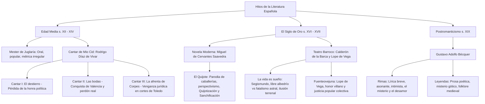

# TEMA 03: LITERATURA ESPAÑOLA: MEDIEVO (MIO CID), SIGLO DE ORO (EL QUIJOTE, LA VIDA ES SUEÑO) Y POSTROMANTICISMO (BÉCQUER)

---

## 1. PORTADA Y METADATOS CURRICULARES

| Campo | Detalle |
| :--- | :--- |
| **Eje Temático** | Eje 06: Comunicación |
| **Materia** | Literatura Española |
| **Nivel de Dificultad** | Preuniversitario Avanzado (UNSA / UNMSM / UNI) |
| **Tiempo de Estudio Recomendado** | 5.0 horas |
| **Resolución Curricular** | R.C.U. N.° 0028-2026 (Admisión 2027) |
| **Prerrequisitos** | Géneros Literarios y Figuras Retóricas (Tema 01) |
| **Objetivo Pedagógico** | Analizar e interpretar los monumentos capitales de las letras hispánicas: el cantar de gesta medieval y la restitución del honor en el *Cantar de Mio Cid*; la novela moderna polifónica y el perspectivismo cervantino en *Don Quijote de la Mancha*; el drama filosófico barroco sobre el libre albedrío en *La vida es sueño*; y el lirismo intimista y leyendas de Gustavo Adolfo Bécquer. |

---

## 2. MAPA CONCEPTUAL SINTÉTICO (MERMAID)



---

## 3. FUNDAMENTACIÓN TEÓRICA RIGUROSA

### 3.1. La Épica Medieval Española: El *Cantar de Mio Cid*
Compuesto hacia 1195 o 1207 (copiado por el clérigo **Per Abbat** en 1307), es el cantar de gesta anónimo más antiguo conservado de la literatura hispánica. Pertenece al **Mester de Juglaría** (oficio de juglares populares de difusión oral).

#### Características Formales y Temáticas:
- **Métrica Irregular (Amascolada):** Versos de arte mayor fluctuantes (entre 14 y 16 sílabas) divididos en dos hemistiquios por una marcada censura central, con rima asonante monorrítmica agrupada en tiradas o series.
- **Realismo y Sobriedad Histórica:** A diferencia de la épica francesa o germana plagada de dragones y magia desmedida, el *Mio Cid* posee un riguroso anclaje geográfico e histórico castellano verosímil.
- **Eje Temático Vertebrador:** **La doble pérdida y la doble recuperación del honor** (honra política y honra social/familiar) de don Rodrigo Díaz de Vivar, el *Campeador*.

#### Estructura en Tres Cantares:
1. **Cantar del Destierro:**
   - Don Rodrigo es injustamente desterrado de Castilla por el rey Alfonso VI a causa de calumnias cortesanas urdidas por nobles envidiosos (como García Ordóñez).
   - Abandona a su esposa doña Jimena y a sus hijas doña Sol y doña Elvira en el monasterio de San Pedro de Cardeña.
   - Con su fiel vasallo Álvar Fáñez de Minaya, inicia campañas bélicas contra los moros, enviando generosos botines de guerra al rey para demostrar su inquebrantable lealtad vasallática.
2. **Cantar de las Bodas de las Hijas del Cid:**
   - El Cid conquista la rica e inexpugnable ciudad de **Valencia** tras vencer al rey moro de Sevilla.
   - El rey Alfonso VI le concede el perdón solemne a orillas del río Tajo y acuerda, como muestra de gratitud y estatus, el matrimonio de las hijas del Cid con los aristócratas **infantes de Carrión** (don Fernando y don Diego).
3. **Cantar de la Afrenta de Corpes:**
   - Los infantes de Carrión evidencian su vileza y cobardía ante el escape de un león en el palacio de Valencia y en la batalla contra el rey Búcar.
   - En venganza por las burlas de los vasallos del Cid, fingen regresar a Carrión, pero en el espeso **robledal de Corpes** azotan bárbaramente y dejan atadas y desangradas a las hijas del héroe.
   - El Cid no toma la justicia por mano propia; exige cortes solemnes en **Toledo**.
   - Los campeones del Cid (Pedro Bermúdez y Martín Antolínez) derrotan a los infantes en duelo judicial; las hijas son desposadas con los infantes de Navarra y Aragón, alcanzando el Cid la máxima cumbre de honra nobiliaria emparentada con la realeza.

---

### 3.2. La Cumbre de la Prosa Universal: *Don Quijote de la Mancha*
Publicada por **Miguel de Cervantes Saavedra** en dos partes (1605 y 1615), es la primera novela moderna de la historia y una de las cimas de la literatura universal.

#### Innovaciones Narrativas y Formales:
- **El Propósito Explícito:** Demoler y parodiar el género inverosímil y disparatado de los **libros de caballerías**.
- **El Perspectivismo:** La realidad no es absoluta sino poliédrica y dependiente del prisma con que se contempla (el célebre conflicto del *baciyelmo*: ¿es la bacía de afeitar de un barbero o el yelmo de oro de Mambrino?).
- **Metaficción y Polifonía:** Cervantes introduce falsos narradores (Cide Hamete Benengeli, historiador arábigo) y en la Segunda Parte (1615), los personajes discuten sobre la Primera Parte (1605) y denuncian el *Quijote apócrifo* de Alonso Fernández de Avellaneda.

#### Ejes Temáticos y Dualismo Simbólico:
- **Don Quijote (Alonso Quijano):** Encarna el **idealismo heroico desmedido**, la justicia desinteresada, el amor platónico por Dulcinea del Toboso (la campesina Aldonza Lorenzo transfigurada) y la locura lúcida.
- **Sancho Panza:** Encarna el **realismo pragmático**, el sentido común terrenal, el apego a la materia y a los refranes populares.
- **La Dialéctica Psicológica:**
  - **Sanchificación de don Quijote:** A lo largo del viaje, el caballero absorbe parte del pragmatismo y dudas de su escudero.
  - **Quijotización de Sancho:** Sancho asimila los ideales nobles de la caballería, hasta el punto de que en el lecho de muerte de Alonso Quijano (quien recobra la cordura y muere en paz), es Sancho quien entre lágrimas le implora vestirse de pastores y salir nuevamente a desfacer entuertos por los campos.

---

### 3.3. El Drama Barroco: Calderón de la Barca y *La vida es sueño*
Pedro Calderón de la Barca culmina el teatro del Siglo de Oro con un arte conceptual, reflexivo, filosófico y de estricta perfección constructiva.

- **Género:** Dramático. *Especie:* Drama filosófico en tres jornadas (en verso octosílabo polymétrico).
- **Argumento:**
  - El rey Basilio de Polonia, astrólogo erudito, encierra a su recién nacido hijo **Segismundo** en una torre oculta en las montañas, custodiado por Clotaldo, porque los horóscopos predijeron que sería un tirano cruel que pisotearía las canas de su padre.
  - Años después, Basilio decide poner a prueba el oráculo: seda a Segismundo con narcóticos y lo despierta en el palacio real investido como príncipe. Al verse libre, Segismundo actúa de forma brutal e impulsiva (lanza a un criado por la ventana e intenta forzar a Rosaura).
  - Confirmado aparentemente el vaticinio, el príncipe es narcotizado de nuevo y devuelto a su torre, donde Clotaldo le convence de que su estancia palaciega fue solo un sueño efímero. Aquí pronuncia su inmortal soliloquio:
    > *«¿Qué es la vida? Un frenesí.*
    > *¿Qué es la vida? Una ilusión,*
    > *una sombra, una ficción,*
    > *y el mayor bien es pequeño;*
    > *que toda la vida es sueño,*
    > *y los sueños, sueños son.»*
  - El pueblo se subleva para evitar que herede el trono el duque Astolfo de Moscovia y libera a Segismundo. En la batalla decisiva, el príncipe vence a su padre, pero lejos de tiranizarlo, se postra a sus pies, perdonándolo con sabiduría moral.
- **Significado Filosófico:** **El triunfo del libre albedrío sobre la predestinación astrológica.** El hombre no está inexorablemente condenado por los astros; mediante la razón y la virtud moral puede dominar sus pasiones brutales (*«obrar bien, que ni aun en sueños se pierde el hacer bien»*).

---

### 3.4. El Postromanticismo Íntimo: Gustavo Adolfo Bécquer
Frente al romanticismo retórico y ampuloso de la primera mitad del siglo XIX (Espronceda, Zorrilla), Bécquer encarna junto a Rosalía de Castro un **romanticismo tardío, íntimo, depurado, musical y subjetivo**.

- **Rimas (1871):** Colección de breves poemas asonantes, aéreos y despojados de oropel retórico:
  - *Serie I (Rimas I-XI):* La creación poética y la poesía inefable (*«Poesía eres tú»*).
  - *Serie II (Rimas XII-XXIX):* El amor ilusionado, juvenil y luminoso.
  - *Serie III (Rimas XXX-LI):* El desengaño amoroso, la traición, el dolor y la amargura de la ruptura.
  - *Serie IV (Rimas LII-LXXVI):* La soledad existencial, la angustia del vacío, el olvido y la muerte (*Rima LIII: «Volverán las oscuras golondrinas...»*).
- **Leyendas:** Relatos en prosa lírica impregnados de misterio, atmósfera medieval gótica, ruinas encantadas y transgresión sacrílega del protagonista guiado por una belleza ideal inalcanzable (*El rayo de luna*, *Los ojos verdes*, *El monte de las ánimas*, *Maese Pérez el organista*).

---

## 4. FÓRMULAS, TAXONOMÍAS Y LEYES FUNDAMENTALES

### 4.1. Cuadro de las Dos Vertientes Teatrales del Siglo de Oro

$$\begin{array}{|l|l|l|}
\hline
\textbf{Rasgo Comparativo} & \textbf{Lope de Vega (Fénix de los Ingenios)} & \textbf{Calderón de la Barca} \\ \hline
\text{Estilo} & \text{Espontáneo, popular, fresco, vital} & \text{Reflexivo, filosófico, solemne, conceptual} \\ \hline
\text{Temática Central} & \text{El honor villano, amor patrio, costumbres} & \text{El libre albedrío, la culpa, el honor trágico} \\ \hline
\text{Personajes} & \text{Dinámicos, múltiples, colectivos (\textit{Fuenteovejuna})} & \text{Concentrados en un protagonista denso (\textit{Segismundo})} \\ \hline
\text{Escenografía} & \text{Sencilla en corrales de comedias} & \text{Espectacular y escenográfica en palacio} \\ \hline
\end{array}$$

---

## 5. CASOS PRÁCTICOS Y MODELIZACIONES DEL MUNDO REAL

### Caso 1: La Defensa Jurídica de Segismundo y el Estado de Derecho
- Cuando Segismundo despierta en el palacio y actúa violentamente, la causa psicológica es su crianza en privación sensorial y tortura en una mazmorra desde su nacimiento sin debido proceso legal.
- **Lección Institucional:** Calderón demuestra que un soberano déspota que priva de libertad a sus ciudadanos basándose en meras predicciones y prejuicios arbitrarios termina generando la misma violencia destructiva que pretendía evitar. La reconciliación política final funda el Estado moderno basado en el perdón, la racionalidad y el pacto de gobernabilidad.

---

## 6. PRE-UNIVERSITY HACKS Y MNEMOTÉCNIAS

### 1. El Honor en el Cantar de Mio Cid
$$\text{Honor Perdido 1: Político} \xrightarrow{\text{Conquista Valencia}} \text{Honor Recuperado 1}$$
$$\text{Honor Perdido 2: Familiar (Afrenta Corpes)} \xrightarrow{\text{Cortes de Toledo}} \text{Honor Recuperado 2 (Reyes)}$$

### 2. Mnemotécnia de las Dos Espadas del Cid
$$\mathbf{C}\text{olada (ganada a Berenguer Ramón)} \quad \text{y} \quad \mathbf{T}\text{izona (ganada a Búcar)}$$
Ambas espadas fueron arrebatadas a los cobardes infantes de Carrión en las Cortes de Toledo.

---

## 7. ERRORES FRECUENTES Y TRAMPAS DE EXAMEN

1. **Creer que el Cid asesina con sus manos a los infantes de Carrión:**
   - *Error:* Afirmar que el Cid mató a los infantes de Carrión en venganza de sangre.
   - *Verdad:* El Cid acude a la ley institucional y a las **Cortes de Toledo** convocadas por el rey; son sus campeones (**Pedro Bermúdez** y **Martín Antolínez**) quienes los vencen en duelo judicial y los declaran traidores deshonrados.
2. **Confundir Dulcinea del Toboso con Aldonza Lorenzo:**
   - Aldonza Lorenzo es la campesina tosca y vigorosa del mundo real; Dulcinea del Toboso es la dama celestial imaginada y transfigurada poéticamente por el Quijote.
3. **El desenlace de Segismundo:**
   - Segismundo no se casa con Rosaura (ella se casa con Astolfo para lavar su honra con la bendición del príncipe); Segismundo se desposa por conveniencia y deber moral con la infanta **Estrella**.

---

## 8. 5 PROBLEMAS RESUELTOS GRADUADOS

### Problema 1 (Nivel Básico: Cantar de Mio Cid)
¿Cuál fue el motivo histórico-social por el cual el rey Alfonso VI desterró a Rodrigo Díaz de Vivar de las tierras de Castilla?
- A) El intento de rebelión armada encabezado por Álvar Fáñez en Burgos.
- B) Las intrigas y calumnias cortesanas de nobles envidiosos sobre la recaudación de tributos en Sevilla.
- C) La negativa del Cid a entregar la ciudad conquistada de Valencia a la corona.
- D) El desacato militar cometido por los vasallos del Cid en el monasterio de Cardeña.
- E) La alianza secreta forjada entre el Campeador y los reinos moros de Granada.

**Resolución:**
El destierro del Cid se produjo debido a las falsas acusaciones de nobles cortesanos envidiosos (encabezados por el conde García Ordóñez), quienes acusaron falsamente a Rodrigo de haber retenido indebidamente parte de las parias o tributos cobrados al rey moro de Sevilla para el monarca castellano Alfonso VI.
**Respuesta:** **B**

---

### Problema 2 (Nivel Intermedio: La Novela Moderna - Cervantes)
En *Don Quijote de la Mancha*, el fenómeno psicológico y temático por el cual Sancho Panza asimila gradualmente la nobleza de ideales, el lenguaje refinado y el anhelo caballeresco de su señor se denomina:
- A) Desdoblamiento metaficcional
- B) Sanchificación del Quijote
- C) Quijotización de Sancho
- D) Perspectivismo renacentista
- E) Parodia caballeresca

**Resolución:**
A través de los incesantes diálogos a lo largo del camino, Sancho Panza sufre un proceso de transformación interior denominado **quijotización**: adopta el afán de gloria moral, la dignidad de la justicia y la defensa de los desvalidos, llegando a suplicar la continuación de las aventuras en el lecho mortal de Alonso Quijano.
**Respuesta:** **C**

---

### Problema 3 (Nivel Intermedio-Avanzado: Teatro Barroco - La vida es sueño)
En la culminación de *La vida es sueño*, la decisión trascendental de Segismundo de perdonar a su padre Basilio en lugar de ejecutar la sangrienta tiranía profetizada por los horóscopos demuestra:
- A) La sumisión resignada del héroe ante la fatalidad astrológica ineludible.
- B) La victoria indiscutible del libre albedrío y la razón moral sobre la predestinación ciega.
- C) La cobardía moral del príncipe frente a las tropas reales coaligadas de Polonia.
- D) La debilidad del poder real frente a la aristocracia moscovita encarnada en Astolfo.
- E) La disolución de la fe religiosa frente a las corrientes racionalistas de la época.

**Resolución:**
El núcleo doctrinal católico contrarreformista de la obra postula que el hombre no está encadenado al determinismo astrológico ni al destino ciego; gracias a la gracia y a su **libre albedrío**, puede dominar sus instintos e inclinaciones mediante la virtud moral («vencerse a sí mismo»).
**Respuesta:** **B**

---

### Problema 4 (Nivel Avanzado: Lírica Bécqueriana)
En la célebre *Rima LIII* de Bécquer:
> *"Volverán las oscuras golondrinas / en tu balcón sus nidos a colgar, / y otra vez con el ala a sus cristales / jugando llamarán.*
> *Pero aquellas que el vuelo refrenaban / tu hermosura y mi dicha a contemplar, / aquellas que aprendieron nuestros nombres... / ¡esas... no volverán!"*

La contraposición lírica entre los ciclos reiterativos de la naturaleza y la imposibilidad de revivir el amor pretérito estructura un contraste fundamentado en:
- A) La resignación festiva ante la llegada de la primavera.
- B) La amarga certeza de que el tiempo humano y el amor singular son irreversibles y fugaces frente al ciclo eterno de la naturaleza.
- C) La crítica satírica a la infidelidad de la mujer amada.
- D) La afirmación panteísta de la inmortalidad del alma a través de las aves.
- E) La exaltación heroica del paisaje toledano medieval.

**Resolución:**
Bécquer contrapone el orden natural cósmico que se renueva eternamente (las golondrinas genéricas volverán cada primavera) con la desgarradora finitud del amor humano subjetivo (aquellas golondrinas específicas que fueron testigos del idilio jamás retornarán). Es la expresión conmovedora de la pérdida irreparable e irreversible del tiempo y del sentimiento amoroso.
**Respuesta:** **B**

---

### Problema 5 (Nivel 5: Reto Titán / Jefe Final de Admisión - UNSA / UNMSM)
Evalúe exhaustivamente las siguientes proposiciones sobre las obras maestras de la literatura española:
I. En el *Cantar de Mio Cid*, el honor de las hijas del Cid es plenamente restituido ante la ley en las Cortes de Toledo, culminando la obra con sus nuevos matrimonios con los infantes de Navarra y Aragón.
II. En la Segunda Parte de *El Quijote* (1615), el protagonista visita una imprenta en Barcelona donde descubre con indignación la publicación de la apócrifa continuación de Alonso Fernández de Avellaneda.
III. En *La vida es sueño*, Segismundo se casa al final con Rosaura para reparar públicamente el agravio a su honor mancillado por el duque Astolfo.
IV. Las *Leyendas* de Bécquer están escritas en verso endecasílabo puro y abordan temáticas científicas y positivistas del siglo XIX.

Son **ESTRICTAMENTE CORRECTAS**:
- A) I y II
- B) II y III
- C) I, II y IV
- D) Solo I
- E) I, II y III

**Resolución Paso a Paso:**
- **Proposición I (VERDADERA):** El Cid exige justicia legal en las Cortes de Toledo; sus vasallos vencen a los infantes de Carrión y las hijas celebran bodas de rango regio con los infantes de Navarra y Aragón.
- **Proposición II (VERDADERA):** En el capítulo LXII de la Segunda Parte, Don Quijote visita una imprenta barcelonesa, observa cómo imprimen el falso Quijote de Avellaneda y manifiesta su desdén metaficcional, modificando su ruta a Zaragoza para desmentir al usurpador.
- **Proposición III (FALSA):** Segismundo NO se casa con Rosaura; permite que Rosaura se case con Astolfo para lavar la honra de ella, y él mismo toma por esposa a la infanta **Estrella**.
- **Proposición IV (FALSA):** Las *Leyendas* están escritas en **prosa poética**, son de tono fantástico gótico-medieval y rechazan explícitamente el materialismo positivista de la época.
Por consiguiente, son rigurosamente correctas únicamente **I y II**.
**Respuesta:** **A**

---

## 9. GLOSARIO TÉCNICO ESPECIALIZADO

1. **Asonancia:** Rima imperfecta en la que solo coinciden los sonidos vocálicos a partir de la última vocal acentuada de cada verso.
2. **Cesarismo / Hemistiquio:** División métrica de un verso largo en dos mitades autónomas separadas por una pausa fónica obligatoria (*cesura*).
3. **Libre Albedrío:** Doctrina teológica y filosófica según la cual el ser humano posee la potestad intrínseca de elegir sus actos morales sin imposición fatalista.
4. **Mester de Clerecía:** Oficio poético erudito medieval cultivado por clérigos con estrofa regular de cuatro versos alejandrinos monorrimos (*cuaderna vía*).
5. **Mester de Juglaría:** Manifestación lírico-épica popular medieval transmitida oralmente por juglares con métrica irregular asonante.
6. **Novela Polifónica:** Relato de múltiples voces y conciencias independientes con igual jerarquía axiológica, fundado por Cervantes en *El Quijote*.
7. **Parias:** Tributos periódicos de sumisión que los reinos de taifas moros pagaban a los reyes y señores feudales cristianos para evitar la guerra.
8. **Perspectivismo:** Enfoque epistemológico y literario donde la realidad es apreciada desde múltiples puntos de vista subjetivos igualmente legítimos.
9. **Quijotización:** Proceso gradual de asimilación de ideales éticos nobles, platónicos y desinteresados experimentado por Sancho Panza.
10. **Tirada:** Conjunto indeterminado de versos con la misma rima asonante monorrítmica característico de los cantares de gesta medievales.

---

## 10. FLASHCARDS DE REPASO ACTIVO

| Front (Pregunta / Disparador) | Back (Respuesta Nemotécnica / Precisa) |
| :--- | :--- |
| ¿Cuál es el tema central del *Cantar de Mio Cid*? | La **doble pérdida y recuperación del honor** (político y familiar) de Rodrigo Díaz de Vivar. |
| ¿Qué son las Cortes de Toledo en el *Mio Cid*? | El juicio formal convocado por el rey Alfonso VI donde el Cid exige la devolución de sus espadas (*Colada* y *Tizona*) y justicia por la afrenta de Corpes. |
| ¿Qué simboliza el debate del "Baciyelmo" en *El Quijote*? | El **perspectivismo**: la realidad se transforma según la mente y óptica de quien la contempla (palangana de barbero vs. yelmo de oro caballeresco). |
| ¿Cuál es la conclusión moral de Segismundo en *La vida es sueño*? | Que aun en los sueños debe **obrarse con rectitud**, porque el libre albedrío y la virtud moral vencen al destino ciego. |
| ¿Qué caracteriza a las *Rimas* de Bécquer frente al primer romanticismo? | Su tono **intimista**, musical, aéreo, depurado de artificios retóricos y con predominio de rima asonante. |

---

## 11. PREGUNTAS DE AUTOEVALUACIÓN RÁPIDA

1. ¿Quién cuidó a la esposa e hijas del Cid durante su primer destierro?
   - A) El rey moro de Valencia
   - B) El abad don Sancho en el monasterio de San Pedro de Cardeña
   - C) Los infantes de Carrión
   - D) El conde García Ordóñez
   - *Respuesta correcta:* **B** (Allí se despidió con profundo desgarro).
2. Es el falso autor arábigo a quien Cervantes atribuye la crónica original del Quijote:
   - A) Alonso Fernández de Avellaneda
   - B) Cide Hamete Benengeli
   - C) Maese Pedro
   - D) Ginés de Pasamonte
   - *Respuesta correcta:* **B** (Recurso metaficcional del manuscrito encontrado).
3. En *La vida es sueño*, ¿quién es el tutor que cría a Segismundo en la torre oculta?
   - A) Astolfo
   - B) Clotaldo
   - C) Clarín
   - D) Basilio
   - *Respuesta correcta:* **B** (Noble leal y carcelero del príncipe).

---

## 12. BLOQUE DE INTEGRACIÓN KMP / GAMIFICACIÓN (JSON)

```json
{
  "tema_id": "LIT_03",
  "eje_tematico": "06_COMUNICACION",
  "curso": "LITERATURA",
  "titulo_tema": "Literatura Española: Medievo, Siglo de Oro y Postromanticismo",
  "dificultad": "Avanzado",
  "xp_recompensa": 260,
  "habilidades_evaluadas": [
    "Estructura del honor en el Cantar de Mio Cid",
    "Perspectivismo y metaficción en El Quijote",
    "Filosofía del libre albedrío en La vida es sueño",
    "Evolución lírica e intimismo en Bécquer"
  ],
  "boss_challenge": {
    "boss_name": "Segismundo, el Príncipe Desencadenado de la Torre",
    "vida_boss": 3600,
    "ataque_especial": "Soliloquio de la Ilusión y Juicio de las Cortes de Toledo",
    "pregunta_reto": "¿Cuál es la razón fundamental por la que el Quijote recobra la cordura antes de morir?",
    "opciones": [
      "Porque Sancho Panza le confesó que Dulcinea era Aldonza Lorenzo",
      "Porque tras ser derrotado en las playas de Barcelona por el Caballero de la Blanca Luna (Sansón Carrasco) abandona las armas y asume su lucidez final",
      "Porque el cura y el barbero quemaron su biblioteca completa",
      "Porque perdió la herencia familiar a manos de su sobrina Antonia"
    ],
    "respuesta_correcta_index": 1,
    "explicacion_gamificada": "¡Victoria de honor caballeresco! El bachiller Sansón Carrasco, disfrazado del Caballero de la Blanca Luna, vence al Quijote obligándolo bajo palabra de honor a deponer las armas por un año, lo que apaga su delirio heroico y precipita su retorno lúcido a Alonso Quijano el Bueno."
  }
}
```
