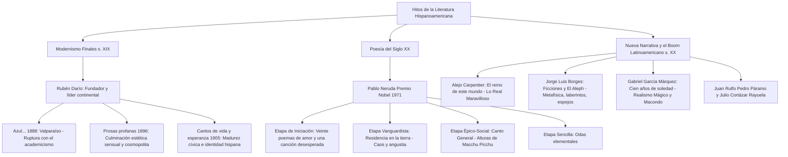

# TEMA 04: LITERATURA HISPANOAMERICANA: MODERNISMO (RUBÉN DARÍO), POESÍA DEL SIGLO XX (NERUDA) Y EL BOOM LATINOAMERICANO (BORGES, CARPENTIER, GARCÍA MÁRQUEZ)

---

## 1. PORTADA Y METADATOS CURRICULARES

| Campo | Detalle |
| :--- | :--- |
| **Eje Temático** | Eje 06: Comunicación |
| **Materia** | Literatura Hispanoamericana |
| **Nivel de Dificultad** | Preuniversitario Avanzado (UNSA / UNMSM / UNI) |
| **Tiempo de Estudio Recomendado** | 5.0 horas |
| **Resolución Curricular** | R.C.U. N.° 0028-2026 (Admisión 2027) |
| **Prerrequisitos** | Géneros Literarios, Clasicismo y Siglo de Oro (Temas 01 al 03) |
| **Objetivo Pedagógico** | Analizar e interpretar los procesos revolucionarios de la literatura continental: el Modernismo como primera corriente literaria originada en América (*Azul...* de Rubén Darío); la evolución poética de Pablo Neruda; las raíces del Real Maravilloso en Alejo Carpentier; el universo laberíntico de Jorge Luis Borges; y la apoteosis narrativa del Boom y el Realismo Mágico en *Cien años de soledad* de Gabriel García Márquez. |

---

## 2. MAPA CONCEPTUAL SINTÉTICO (MERMAID)



---

## 3. FUNDAMENTACIÓN TEÓRICA RIGUROSA

### 3.1. El Modernismo Hispanoamericano
Surgido a finales del siglo XIX, es el **primer movimiento estético y literario nacido en Hispanoamérica que ejerció influencia directa e inversión de magisterio sobre España**.
- **Fuentes Nutricias Europeas:**
  1. *Parnasianismo:* Búsqueda de la perfección formal, frialdad escultórica, el «arte por el arte».
  2. *Simbolismo:* Búsqueda de la musicalidad interior del verso, la sinestesia y las correspondencias sensoriales.
- **Rasgos Clave:** Cosmopolitismo, exotismo (evocación de Versalles, Grecia antigua, Oriente), cromatismo pictórico, renovación métrica (resurrección del verso alejandrino de 14 sílabas) y el empleo de símbolos aristocráticos (**el cisne**, la torre de marfil, el fauno).

#### La Trilogía Fundamental de Rubén Darío (Félix Rubén García Sarmiento):
1. ***Azul...* (Valparaíso, Chile, 1888):** Obra fundacional. Combina relatos en prosa lírica (*El rey burgués*, *El sátiro sordo*, *La ninfa*) y poemas de métrica renovada (*Caupolicán*, soneto heroico alejandrino). Representa el rechazo del artista a la mercantilización burguesa del arte.
2. ***Prosas profanas* (Buenos Aires, 1896):** Apogeo y consagración estética del modernismo. Exotismo aristocrático, galantería dieciochesca francesa, sensualidad carnal y musicalidad consumada (*Sonatina: «La princesa está triste... ¿qué tendrá la princesa?»*).
3. ***Cantos de vida y esperanza* (Madrid, 1905):** Obra de madurez reflexiva, cívica y trascendente. Darío asume la defensa de la identidad hispanoamericana frente al expansionismo imperialista de Estados Unidos (*Oda a Roosevelt*) e indaga con congoja existencial el enigma de la muerte (*Lo fatal: «Dichoso el árbol, que es apenas sensitivo...»*).

---

### 3.2. La Evolución Poética de Pablo Neruda (Ricardo Eliécer Neftalí Reyes Basoalto)
Premio Nobel de Literatura 1971, su trayectoria lírica atraviesa cuatro etapas magistrales:

1. **Etapa de Iniciación / Neorromántica (1924):**
   - *Veinte poemas de amor y una canción desesperada:* Poesía lírica juvenil donde la mujer amada se funde melancólicamente con los paisajes marinos y australes de Chile. Se divide en dos ciclos inspirados en dos musas: Marisol (Teresa Vázquez) y Marisombra (Albertina Azócar).
   - *Verso canónico:* *"Puedo escribir los versos más tristes esta noche..."* (Poema 20).
2. **Etapa de Residencia / Vanguardista (1935):**
   - *Residencia en la tierra:* Escrita durante su estancia diplomática en Oriente. Visión caótica, angustiosa, hermética y desolada del universo. Uso de metáforas oníricas surrealistas, versolibrismo y acumulación caótica.
3. **Etapa Épico-Social / Política (1950):**
   - *Canto General:* Magno poema épico que narra la historia de los pueblos de América Latina desde sus orígenes geológicos prehispánicos hasta las luchas proletarias modernas. Destaca la sección cumbre: *Alturas de Macchu Picchu*, donde el poeta invita a los antiguos constructores andinos sacrificados a hablar a través de su propia voz (*«Sube a nacer conmigo, hermano»*).
4. **Etapa Elemental (1954):**
   - *Odas elementales:* Giro hacia la sencillez expresiva y el amor a los objetos humildes y cotidianos: la cebolla, el aire, el tomate, los zapatos.

---

### 3.3. Hitos de la Nueva Narrativa: Carpentier y Borges

#### A. Alejo Carpentier y *Lo Real Maravilloso*
- En el célebre prólogo a su novela ***El reino de este mundo* (1949)**, el autor cubano formula la teoría de **lo real maravilloso americano**: a diferencia del surrealismo europeo artificioso que necesita trucos mecánicos para evocar lo insólito, en América Latina lo insólito y extraordinario brota de manera natural de su historia convulsa, sus sincretismos religiosos y su naturaleza grandiosa.
- Narra la revolución independentista de Haití liderada por esclavos como Mackandal (brujo que domina el vudú y la licantropía metamórfica) y la tiranía trágica del rey Henri Christophe en la fortaleza de La Ferrière, contemplados por el esclavo Ti Noel.

#### B. Jorge Luis Borges y la Narrativa Intelectual
- Obras cumbres: ***Ficciones* (1944)** y ***El Aleph* (1949)**.
- Transforma el relato corto en un juego metafísico, filosófico e intertextual.
- **Topoi Borgianos:** Los laberintos infinitos, las bibliotecas cósmicas (*La biblioteca de Babel*), los espejos que duplican la realidad ilusoria, los libros apócrifos y el tiempo circular bifurcado (*El jardín de senderos que se bifurcan*).
- *El Aleph:* Espacio microscópico ubicado en el sótano de una vieja casa en Buenos Aires donde confluyen simultáneamente, sin superponerse, todos los puntos y acontecimientos del universo desde todos los ángulos imaginables.

---

### 3.4. El Boom Latinoamericano y *Cien años de soledad*
Fenómeno literario y editorial ocurrido en la década de 1960, donde un grupo de jóvenes novelistas latinoamericanos deslumbró al mundo entero con una técnica narrativa vanguardista (monólogo interior, perspectivismo múltiple, ruptura cronológica) unida a la rica identidad mitológica del continente.

#### Gabriel García Márquez y el *Realismo Mágico*:
- **Cien años de soledad (1967):**
  - *Espacio Mítico:* **Macondo**, aldea fundada en la selva caribeña colombiana por José Arcadio Buendía y Úrsula Iguarán.
  - *Eje Argumental:* La saga de siete generaciones de la familia **Buendía**, atrapada en una maldición originaria: el temor al incesto y al nacimiento de un hijo con **cola de cerdo** (castigo mítico que se cumple inexorablemente en la última generación con el vástago de Aureliano Babilonia y su tía Amaranta Úrsula).
  - *El Tiempo Cíclico:* Los nombres se repiten (los *Arcadios* son impulsivos, gigantescos y trágicos; los *Aurelianos* son taciturnos, clarividentes, solitarios y encerrados en el taller de orfebrería haciendo pescaditos de oro).
  - *Acontecimientos Fundamentales:*
    - Las 32 guerras civiles promovidas y perdidas por el **coronel Aureliano Buendía**.
    - La fiebre del insomnio y la peste del olvido combatida con letreros nominativos.
    - La ascensión virginal en cuerpo y alma de **Remedios la bella** al cielo entre sábanas de bramante.
    - La llegada de la compañía bananera norteamericana y la masacre de 3400 huelguistas en la estación del tren, silenciada históricamente por el poder oficial.
    - El diluvio que asuela a Macondo durante cuatro años, once meses y dos días.
    - El desciframiento final de los **pergaminos en sánscrito del gitano Melquíades** por Aureliano Babilonia en el instante mismo en que un ciclón bíblico borra para siempre a Macondo de la faz de la tierra, *«porque las estirpes condenadas a cien años de soledad no tenían una segunda oportunidad sobre la tierra»*.

---

## 4. FÓRMULAS, TAXONOMÍAS Y LEYES FUNDAMENTALES

### 4.1. Cuadro de las Cuatro Figuras Cumbres del Boom Latinoamericano

$$\begin{array}{|l|l|l|l|}
\hline
\textbf{Autor y País} & \textbf{Obra Insigne} & \textbf{Técnica Innovadora} & \textbf{Atmósfera Estética} \\ \hline
\text{Gabriel García Márquez (Colombia)} & \textit{Cien años de soledad} (1967) & \text{Tiempo mítico circular y narrador omnisciente naturalizador} & \text{Realismo Mágico} \\ \hline
\text{Mario Vargas Llosa (Perú)} & \textit{La ciudad y los perros} (1963) & \text{Vasos comunicantes, monólogo interior, dato escondido} & \text{Realismo social total} \\ \hline
\text{Julio Cortázar (Argentina)} & \textit{Rayuela} (1963) & \text{Contranovela con tablero de dirección lúdico} & \text{Existencialismo lúdico} \\ \hline
\text{Carlos Fuentes (México)} & \textit{La muerte de Artemio Cruz} (1962) & \text{Narración en tres personas (Yo, Tú, Él) alternadas} & \text{Crítica posrevolucionaria} \\ \hline
\end{array}$$

---

## 5. CASOS PRÁCTICOS Y MODELIZACIONES DEL MUNDO REAL

### Caso 1: La Desmemoria Histórica y la Masacre de las Bananeras
- En *Cien años de soledad*, José Arcadio Segundo despierta en un tren nocturno cargado de miles de cadáveres de obreros fusilados por el ejército tras la huelga bananera, que son arrojados al mar. Al regresar a Macondo, la versión oficial del gobierno decreta: *"Aquí no ha pasado nada, ni está pasando ni pasará nunca. Este es un pueblo feliz"*.
- **Modelización Socio-Literaria:** García Márquez radiografía el mecanismo autoritario de la posverdad latinoamericana: la imposición forzosa de la amnesia colectiva a través de los aparatos de propaganda estatal, convirtiendo el genocidio histórico en una "fábula indemostrable" que solo el arte literario preserva del olvido.

---

## 6. PRE-UNIVERSITY HACKS Y MNEMOTÉCNIAS

### 1. El Hito de Rubén Darío: "A-P-C"
$$\mathbf{A}\text{zul... (1888, Inicio)} \longrightarrow \mathbf{P}\text{rosas profanas (1896, Apogeo)} \longrightarrow \mathbf{C}\text{antos de vida y esperanza (1905, Madurez)}$$

### 2. Hack de Oro: Realismo Mágico vs. Fantástico
- **En Borges o Cortázar (Fantástico):** Lo insólito irrumpe y **asombra o aterroriza** al personaje y al lector porque viola las leyes naturales lógicas.
- **En García Márquez (Realismo Mágico):** Lo insólito ocurre con **absoluta naturalidad cotidiana**: la abuela ve a Remedios la bella levitar hacia el cielo y lo único que lamenta es que se llevó sus sábanas limpias.

---

## 7. ERRORES FRECUENTES Y TRAMPAS DE EXAMEN

1. **Creer que el Modernismo nació en España:**
   - *Error:* Afirmar que el Modernismo fue importado de Europa hacia América.
   - *Verdad Histórica:* El Modernismo es el **primer movimiento autóctono de Hispanoamérica**, liderado por el nicaragüense Rubén Darío, que luego influyó decisivamente en poetas españoles como Juan Ramón Jiménez, Antonio Machado y Valle-Inclán.
2. **Confundir Realismo Mágico con Fantasía:**
   - En Macondo lo milagroso no es un cuento de hadas; está anclado en la geografía, el calor tropical, las guerras civiles y las tragedias sociopolíticas de América Latina.
3. **El final de Macondo:**
   - Macondo no sucumbe por una guerra militar; desaparece arrasada por un **ciclón bíblico voraz** en el momento exacto en que Aureliano Babilonia termina de descifrar la última página de los pergaminos de Melquíades.

---

## 8. 5 PROBLEMAS RESUELTOS GRADUADOS

### Problema 1 (Nivel Básico: Origen del Modernismo)
El acontecimiento literario que marca formalmente el punto de partida y partida de nacimiento del Modernismo hispanoamericano es la publicación en Valparaíso (1888) de la obra:
- A) *Prosas profanas* de Rubén Darío
- B) *Versos libres* de José Martí
- C) *Azul...* de Rubén Darío
- D) *La amada inmóvil* de Amado Nervo
- E) *Cantos de vida y esperanza* de Rubén Darío

**Resolución:**
En 1888, en Valparaíso (Chile), Rubén Darío publicó ***Azul...***, un libro misceláneo de relatos en prosa lírica y poemas donde sintetiza las corrientes parnasiana y simbolista francesas, quebrando el corsé decimonónico del castellano y fundando oficialmente el Modernismo.
**Respuesta:** **C**

---

### Problema 2 (Nivel Intermedio: Poética de Pablo Neruda)
En *Canto General* de Pablo Neruda, la célebre sección lírica *Alturas de Macchu Picchu* se caracteriza fundamentalmente por:
- A) La expresión elegíaca del desencanto amoroso juvenil de los paisajes sureños chilenos.
- B) El compromiso épico y la solidaridad moral con los trabajadores anónimos indígenas que edificaron la ciudadela incaica.
- C) La adopción de fórmulas herméticas de corte surrealista y angustia metafísica absoluta.
- D) El canto jovial a los objetos cotidianos y humildes de la despensa popular.
- E) La celebración festiva de la diplomacia internacional latinoamericana.

**Resolución:**
Al ascender a las ruinas de Macchu Picchu, Neruda experimenta una revelación: no contempla solo la piedra monumental, sino las vidas anónimas y sacrificadas de los campesinos y canteros incas sepultados por la historia. El poeta asume la misión de ser su voz y conciencia histórica: *«Hablad por mis palabras y por mi sangre»*.
**Respuesta:** **B**

---

### Problema 3 (Nivel Intermedio-Avanzado: La Teoría de lo Real Maravilloso)
En el prólogo de la novela *El reino de este mundo* (1949), Alejo Carpentier sostiene que *lo real maravilloso* se diferencia radicalmente del surrealismo europeo en que:
- A) Se fundamenta exclusivamente en la experimentación formal con el monólogo interior.
- B) Es un fenómeno auténtico que brota naturalmente de la historia, fe sincrética y geografía de América, y no de un artificio fabricado mecánicamente en laboratorios literarios.
- C) Niega rotundamente la existencia de deidades o creencias míticas en las sublevaciones antillanas.
- D) Se reduce a un pastiche costumbrista de las danzas y leyendas aborígenes.
- E) Rechaza cualquier dimensión política en el devenir social del Caribe.

**Resolución:**
Carpentier afirma que mientras los surrealistas europeos fabricaban lo maravilloso mediante trucos literarios e imágenes forzadas sin creérselo, en América Latina lo insólito y grandioso (el vudú de Mackandal, la metamorfosis, la naturaleza telúrica) forma parte de la fe viva y de la historia real cotidiana del continente.
**Respuesta:** **B**

---

### Problema 4 (Nivel Avanzado: Estructura Mítica en Cien años de soledad)
En la arquitectura narrativa de *Cien años de soledad*, el enigma central de la familia Buendía que sintetiza toda su historia desde la fundación hasta el apocalipsis final se halla resuelto en:
- A) Las cartas confidenciales que envió el coronel Aureliano Buendía a sus 17 hijos.
- B) El diario personal de viaje conservado por Pietro Crespi.
- C) Los pergaminos cifrados en sánscrito redactados proféticamente por el gitano Melquíades.
- D) Los manifiestos políticos del partido liberal suscritos en Neerlandia.
- E) El testamento legal dictado por Úrsula Iguarán en su lecho de muerte.

**Resolución:**
Melquíades escribió la historia de la familia con cien años de anticipación en clave sánscrita; la profecía encerraba la advertencia de que la estirpe culminaría con el nacimiento del niño con cola de cerdo devorado por las hormigas y el cataclismo de Macondo al completarse la lectura de los pergaminos por Aureliano Babilonia.
**Respuesta:** **C**

---

### Problema 5 (Nivel 5: Reto Titán / Jefe Final de Admisión - UNSA / UNMSM)
Analice con detenimiento las siguientes afirmaciones sobre los autores y obras del Boom y la literatura hispanoamericana:
I. En *Azul...* de Rubén Darío, el cuento *El rey burgués* denuncia alegóricamente la soledad y muerte del poeta en una sociedad dominada por el consumo materialista y el desprecio hacia la belleza espiritual.
II. *El Aleph* de Jorge Luis Borges describe un punto esférico en el espacio donde es posible observar de manera simultánea el pasado, presente y futuro de todo el cosmos.
III. En *Cien años de soledad*, el coronel Aureliano Buendía muere fusilado frente al pelotón de ejecución militar en el muro del cementerio de Macondo.
IV. *Pedro Páramo* de Juan Rulfo presenta una estructura fragmentaria donde el narrador Juan Preciado llega a Comala para descubrir que todos los habitantes del pueblo, incluido él mismo, son espectros y murmullos del más allá.

Son rigurosamente **VERDADERAS**:
- A) I, II y IV
- B) I, II y III
- C) Solo II y IV
- D) I, II, III y IV
- E) Solo I y IV

**Resolución Paso a Paso:**
- **Afirmación I (VERDADERA):** En *El rey burgués*, el monarca confina al poeta lírico a dar vueltas a una caja de música en el jardín helado para ganarse el pan, muriendo congelado como alegoría de la cosificación mercantil del arte.
- **Afirmación II (VERDADERA):** El Aleph es conceptualizado por Borges como el objeto milagroso que contiene el infinito espacial simultáneo sin distorsión ni perspectiva sucesiva.
- **Afirmación III (FALSA):** Es la trampa capital de admisión: la célebre primera línea dice: *"Muchos años después, frente al pelotón de fusilamiento, el coronel Aureliano Buendía había de recordar..."*, pero en la novela el coronel **nunca es fusilado** (fue salvado en el último instante por su hermano José Arcadio); muere de anciano, orinando apoyado contra el tronco de un castaño en el patio de su casa.
- **Afirmación IV (VERDADERA):** Comala es un purgatorio poblado por ánimas en pena; Preciado muere a mitad del libro a causa de los murmullos y continúa dialogando desde su fosa con Dorotea la cuentera.
Son plenamente verdaderas: **I, II y IV**.
**Respuesta:** **A**

---

## 9. GLOSARIO TÉCNICO ESPECIALIZADO

1. **Boom Latinoamericano:** Fenómeno estético, narrativo y editorial de los años sesenta del siglo XX que consagró internacionalmente a narradores hispanoamericanos con innovadoras técnicas vanguardistas.
2. **Cosmopolitismo:** Actitud estética y vital modernista que asimila las influencias artísticas de las grandes capitales culturales del mundo sin prejuicios regionalistas.
3. **El Aleph:** En la mística cabalística y la ficción borgiana, el punto primordial que condensa la totalidad del universo infinito en un instante simultáneo.
4. **Lo Real Maravilloso:** Categoría conceptual forjada por Alejo Carpentier para describir la presencia natural de lo prodigioso y mágico inmanente a la realidad mestiza americana.
5. **Modernismo:** Movimiento literario renovador encabezado por Rubén Darío que transformó la métrica, el lenguaje y la sensibilidad de la lengua española a finales del siglo XIX.
6. **Polifonía Narrativa:** Concurrencia de múltiples voces, puntos de vista y registros lingüísticos disímiles dentro de una misma novela sin subordinación a una voz omnisciente única.
7. **Parnasianismo:** Escuela poética francesa del siglo XIX caracterizada por el culto a la forma impecable, la plasticidad visual y el lema del «arte por el arte».
8. **Realismo Mágico:** Modalidad narrativa en la que sucesos inverosímiles, míticos o sobrenaturales son narrados con absoluta normalidad y verosimilitud cotidiana.
9. **Simbolismo:** Movimiento lírico de origen francés que privilegia la sugerencia velada, la musicalidad oculta y las correspondencias sinestésicas por encima de la descripción explícita.
10. **Tiempo Cíclico:** Concepción mítica y circular de la temporalidad donde los acontecimientos, destinos y errores históricos se reiteran periódicamente de generación en generación.

---

## 10. FLASHCARDS DE REPASO ACTIVO

| Front (Pregunta / Disparador) | Back (Respuesta Nemotécnica / Precisa) |
| :--- | :--- |
| ¿Qué obra dio inicio formal al Modernismo y en qué año se publicó? | ***Azul...*** de Rubén Darío, publicada en **1888** en Valparaíso (Chile). |
| ¿En qué consiste la teoría de "Lo Real Maravilloso" de Carpentier? | En que lo maravilloso y prodigioso no requiere trucos de ficción; **emana naturalmente** de la historia, mestizaje y naturaleza de América. |
| ¿Cómo muere el coronel Aureliano Buendía en *Cien años de soledad*? | **No muere fusilado**; muere de viejo mientras orina recostado en el árbol de castaño de su casa en Macondo. |
| ¿Qué representa la sección *Alturas de Macchu Picchu* en *Canto General* de Neruda? | El compromiso ético y la identificación de la voz del poeta con los **antiguos constructores y trabajadores anónimos oprimidos** de la civilización inca. |
| ¿Qué simboliza el laberinto en la obra de Jorge Luis Borges? | La perplejidad metafísica humana ante un **universo incomprensible, caótico e infinito** construido como un juego de espejos. |

---

## 11. PREGUNTAS DE AUTOEVALUACIÓN RÁPIDA

1. Obra cumbre de Rubén Darío caracterizada por el exotismo palaciego, los cisnes y la aristocracia dieciochesca:
   - A) *Azul...*
   - B) *Prosas profanas*
   - C) *Cantos de vida y esperanza*
   - D) *Canto errante*
   - *Respuesta correcta:* **B** (Apogeo de la estética sensual modernista).
2. Es la novela de la Revolución Haití donde Alejo Carpentier aplica la teoría de lo real maravilloso:
   - A) *El siglo de las luces*
   - B) *Los pasos perdidos*
   - C) *El reino de este mundo*
   - D) *El recurso del método*
   - *Respuesta correcta:* **C** (La gesta mágica de Mackandal y Henri Christophe).
3. ¿Quién fue la matriarca que vivió más de cien años y sostuvo el orden doméstico de Macondo?
   - A) Amaranta
   - B) Remedios la bella
   - C) Úrsula Iguarán
   - D) Rebeca
   - *Respuesta correcta:* **C** (Pilar central y testigo de las generaciones de los Buendía).

---

## 12. BLOQUE DE INTEGRACIÓN KMP / GAMIFICACIÓN (JSON)

```json
{
  "tema_id": "LIT_04",
  "eje_tematico": "06_COMUNICACION",
  "curso": "LITERATURA",
  "titulo_tema": "Literatura Hispanoamericana: Modernismo, Poesía del Siglo XX y el Boom",
  "dificultad": "Avanzado",
  "xp_recompensa": 270,
  "habilidades_evaluadas": [
    "Evolución estética de Rubén Darío (Azul, Prosas profanas, Cantos)",
    "Fases líricas de Pablo Neruda",
    "Teoría de lo real maravilloso frente al realismo mágico",
    "Análisis de Macondo y los Buendía en Cien años de soledad"
  ],
  "boss_challenge": {
    "boss_name": "Melquíades el Gitano Universal",
    "vida_boss": 3800,
    "ataque_especial": "Ciclón Bíblico y Paradoja del Laberinto de Borges",
    "pregunta_reto": "¿Qué condena final sella el destino apocalíptico de Macondo en los pergaminos de Melquíades?",
    "opciones": [
      "La invasión armada definitiva de los soldados gubernamentales",
      "El desborde incontrolable de la ciénaga grande",
      "Que las estirpes condenadas a cien años de soledad no tenían una segunda oportunidad sobre la tierra",
      "La ruina financiera tras la partida de la compañía bananera"
    ],
    "respuesta_correcta_index": 2,
    "explicacion_gamificada": "¡Impacto legendario indiscutible! Las célebres palabras finales descifradas por Aureliano Babilonia dictan la sentencia mítica que hace desaparecer a Macondo para siempre de la memoria de los hombres."
  }
}
```
