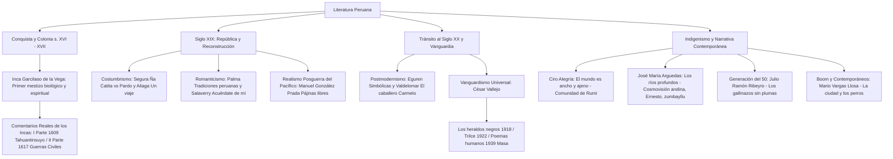

# TEMA 05: LITERATURA PERUANA: DEL VIRREINATO (GARCILASO) AL SIGLO XX (GONZÁLEZ PRADA, VALLEJO, ARGUEDAS, RIBEYRO Y VARGAS LLOSA)

---

## 1. PORTADA Y METADATOS CURRICULARES

| Campo | Detalle |
| :--- | :--- |
| **Eje Temático** | Eje 06: Comunicación |
| **Materia** | Literatura Peruana |
| **Nivel de Dificultad** | Preuniversitario Avanzado (UNSA / UNMSM / UNI) |
| **Tiempo de Estudio Recomendado** | 5.5 horas |
| **Resolución Curricular** | R.C.U. N.° 0028-2026 (Admisión 2027) |
| **Prerrequisitos** | Literatura Hispanoamericana (Tema 04), Historia del Perú |
| **Objetivo Pedagógico** | Analizar e interpretar los hitos fundacionales y cumbres de la literatura peruana: las crónicas mestizas del Inca Garcilaso de la Vega; el Costumbrismo criollo e ilustrado; el Realismo radical de González Prada; la vanguardia radical de César Vallejo (*Trilce*, *Poemas humanos*); el Indigenismo de Ciro Alegría y José María Arguedas; y la narrativa urbana de Julio Ramón Ribeyro y Mario Vargas Llosa. |

---

## 2. MAPA CONCEPTUAL SINTÉTICO (MERMAID)



---

## 3. FUNDAMENTACIÓN TEÓRICA RIGUROSA

### 3.1. Literatura de la Conquista y Virreinato: El Inca Garcilaso de la Vega
Gómez Suárez de Figueroa (1539-1616), hijo del capitán español Sebastián Garcilaso de la Vega y de la princesa incaica Isabel Chimpu Ocllo (nieta de Túpac Yupanqui), encarna el **primer mestizo biológico y espiritual de América**.

#### *Comentarios Reales de los Incas:*
1. **Primera Parte (Lisboa, 1609):**
   - *Contenido:* Origen mítico (Manco Cápac y Mama Ocllo), dinastías reales, administración imperial, religión solar, leyes agrarias y costumbres del Tahuantinsuyo.
   - *Tesis Historiográfica:* Presenta al Imperio Incaico como una **utopía civilizatoria providencial** análoga al Imperio Romano, cuya misión fue unificar y pacificar a los pueblos andinos primitivos para prepararlos para la evangelización cristiana.
   - *Fuentes:* Los relatos orales quechuas escuchados en su niñez de boca de sus tíos nobles en el Cusco, cotejados con el manuscrito del jesuita Blas Valera.
2. **Segunda Parte (*Historia General del Perú*, Córdoba, 1617):**
   - *Contenido:* Conquista del Perú, las sangrientas guerras civiles entre pizarristas y almagristas, la rebelión de Gonzalo Pizarro y la captura y ejecución del último inca de Vilcabamba, Túpac Amaru I.
   - *Defensa Paternal:* Busca vindicar la honra y lealtad militar de su padre ante la Corona española.

---

### 3.2. El Siglo XIX: Costumbrismo, Romanticismo y Realismo

#### A. El Costumbrismo Republicano
- **Vertiente Criollista / Popular:** **Manuel Ascencio Segura**. Teatro de comedia de tipos populares limeños, gracia criolla y lenguaje coloquial. Obra cumbre: ***Ña Catita* (1856)**: comedia que parodia las intrigas de una vieja alcahueta y chismosa limeña (Ña Catita) que intenta casar a la joven Juliana con el viejo y fatuo don Alejo por imposición de la madre doña Rufina, contra la voluntad de la muchacha que ama a don Manuel.
- **Vertiente Anticriollista / Aristocrática:** **Felipe Pardo y Aliaga**. Sátira moralizadora, estricto purismo castellano y desdén hacia el desorden de las instituciones republicanas. Obra: ***Un viaje* (1840)**: cuadro de costumbres sobre el engreído y pusilánime «niño Goyito», quien a sus cincuenta y dos años tarda tres años con toda la parentela limeña para preparar un viaje marítimo a Chile.

#### B. El Romanticismo Peruano
- **Ricardo Palma y las *Tradiciones Peruanas*:** Creador del género híbrido de la **tradición** (fusión armónica de historia verídica, leyenda popular, anécdota costumbrista y humor criollo festivo con refranes). Destacan: *Al rincón! Quita calzón!*, *Don Dimas de la Tijereta*, *Los incas ajedrecistas*.
- **Carlos Augusto Salaverry:** La cumbre lírica del romanticismo nacional. Su poemario ***Cartas a un ángel* (1871)** contiene la inmortal elegía de la soledad y la ausencia: *«¡Acuérdate de mí!»*.

#### C. El Realismo Radical: Manuel González Prada (1844-1918)
Surge tras la catástrofe bélica de la Guerra del Pacífico (1879-1883) como un movimiento iconoclasta, nacionalista, antirreligioso, antihispano y proindigenista.
- **Obras Cumbres:** *Pájinas libres* (1894) y *Horas de lucha* (1908).
- **El «Discurso en el Politeama» (1888):**
  - Denuncia que la derrota ante Chile no se debió a la superioridad militar del enemigo, sino a nuestra propia ignorancia, servilismo cortesano y desunión nacional:
    > *«No forman el verdadero Perú las agrupaciones de criollos y extranjeros que habitan la faja de tierra situada entre el Pacífico y los Andes; la nación está formada por las muchedumbres de indios diseminadas en la banda oriental de la cordillera.»*
  - Consigna generacional revolucionaria: *«¡Los viejos a la tumba, los jóvenes a la obra!»*.

---

### 3.3. Vanguardismo Universal: César Vallejo (1892-1938)
Nacido en Santiago de Chuco (La Libertad), es considerado uno de los más grandes renovadores poéticos de la literatura mundial.

| Obra Poética | Año y Lugar | Rasgos Estéticos y Contenido | Poemas / Versos Fundamentales |
| :--- | :--- | :--- | :--- |
| ***Los heraldos negros*** | 1918 (Lima) | Modernismo en crisis y superación. Presencia del hogar andino provinciano, la muerte del hermano Miguel y la duda existencial ante el sufrimiento humano. | *«Hay golpes en la vida, tan fuertes... ¡Yo no sé!»*<br>*«A mi hermano Miguel»* |
| ***Trilce*** | 1922 (Lima) | **Cumbre de la vanguardia poética en castellano.** Ruptura radical de la sintaxis, creación de neologismos, supresión de puntuación, desarticulación ortográfica. Fruto de su encierro injusto en la cárcel de Trujillo y el luto por la muerte de su madre. | Poemas I (*«Quién hace tanta bulla...»*), II (*«Tiempo Tiempo...»*), LXXVII. |
| ***Poemas humanos*** | 1939 (Póstumo, París) | Poesía del dolor físico, la solidaridad universal con el cuerpo sufriente del obrero y la miseria humana. Fusión de política marxista y conmiseración cristiana. | *«Piedra negra sobre una piedra blanca»* (*«Me moriré en París con aguacero...»*).<br>*«Los nueve monstruos»* |
| ***España, aparta de mí este cáliz*** | 1939 (Póstumo) | Canto épico-doloroso a la Guerra Civil Española y al heroísmo del combatiente republicano. | *«Masa»* (*«Al fin de la batalla, / y muerto el combatiente... / ¡Entonces todos los hombres de la tierra le rodearon; / les vio el cadáver triste, emocionado; / incorporóse lentamente, / abrazó al primer hombre; echóse a andar...»*). |

---

### 3.4. El Indigenismo Peruano: Alegría y Arguedas

```
┌─────────────────────────────────────────────────────────┐
│                 EL INDIGENISMO PERUANO                  │
└────────────────────────────┬────────────────────────────┘
               ┌─────────────┴─────────────┐
               ▼                           ▼
    ┌──────────────────────┐    ┌──────────────────────┐
    │     Ciro Alegría     │    │ José María Arguedas  │
    │   (Vertiente Norte)  │    │   (Vertiente Sur)    │
    └──────────┬───────────┘    └──────────┬───────────┘
               ├─ Comunitario / Épico      ├─ Antropológico / Íntimo
               ├─ Problema de la tierra    ├─ Lengua mestiza quechua-español
               ├─ Comunidad de Rumi        ├─ Ernesto y el internado de Abancay
               └─ "El mundo es ancho       └─ "Los ríos profundos" (1958)
                  y ajeno" (1941)             "Todas las sangres" (1964)
```

1. **Ciro Alegría (*El mundo es ancho y ajeno*, 1941):**
   - Relata la destrucción de la **comunidad indígena de Rumi** por la codicia desmedida del gamonal terrateniente don Álvaro Amenábar de la choza de Umay, quien soborna jueces y abogados venales.
   - Sucesión de líderes comunales: el anciano y sabio **Rosendo Maqui** (defiende pacíficamente la ley comunal y muere golpeado en la cárcel); y **Benito Castro**, indio aculturado que regresa del ejército para liderar la resistencia armada popular donde la comunidad es finalmente masacrada con ametralladoras.
2. **José María Arguedas (*Los ríos profundos*, 1958):**
   - Novela de formación (*Bildungsroman*) autobiográfica. El protagonista **Ernesto**, un niño blanco criado amorosamente entre comunidades indígenas quechuas, es internado por su padre en un hostil colegio religioso de Abancay regentado por el padre Linares.
   - Símbolos centrales: el trompo mágico (**zumbayllu**), el río Pachachaca como ente cósmico purificador, los muros pétreos del Cusco colonial, la sublevación de las chicheras por el reparto de la sal liderada por doña Felipa y la epidemia de tifus que hace huir a la servidumbre andina hacia sus comunidades ancestrales.

---

### 3.5. La Generación del 50 y Mario Vargas Llosa

#### A. Julio Ramón Ribeyro y *La palabra del mudo*
- Maestro del cuento hispanoamericano urbano. Da voz a los seres marginados de la modernización limeña que viven en la precariedad, la frustración y el silencio.
- ***Los gallinazos sin plumas* (1955):** Los niños hermanos Efraín y Enrique son explotados por su cruel abuelo lisiado don Santos, quien los obliga a rebuscar basura descompuesta en los muladares para alimentar a su insaciable cerdo Pascual. Al enfermar los niños, el abuelo arroja al cerdo al perrito Pedro (amigo de los niños). En venganza, Enrique empuja al anciano al chiquero del cerdo y huye con su hermano herido hacia los acantilados de Lima.

#### B. Mario Vargas Llosa (Premio Nobel 2010): *La ciudad y los perros* (1963)
- Novela cumbre que inició el Boom Latinoamericano (Premio Biblioteca Breve).
- **Espacio:** El internado del **Colegio Militar Leoncio Prado** de Lima, microcosmos de las tensiones raciales, sociales y clasistas del Perú entero.
- **Trama:** Los cadetes de cuarto año forman el sindicato clandestino «El Círculo» liderado por el violento **Jaguar**. Durante el robo de un examen de química, el cadete Cava es sorprendido. **El Esclavo** (Ricardo Arana), humillado y desesperado por salir de prisión, lo delata ante las autoridades. Durante unas maniobras de tiro, el Esclavo es asesinado de un disparo por la espalda. Alberto Fernández (**el Poeta**) denuncia el asesinato acusando al Jaguar ante el teniente Gamboa, pero las autoridades militares silencian el crimen para salvaguardar el prestigio del colegio militar.

---

## 4. FÓRMULAS, TAXONOMÍAS Y LEYES FUNDAMENTALES

### 4.1. Cuadro Cronológico Comparativo de la Literatura Peruana

$$\begin{array}{|l|l|l|l|}
\hline
\textbf{Período / Movimiento} & \textbf{Autor Insigne} & \textbf{Obra Emblemática} & \textbf{Aporte Estético / Temático} \\ \hline
\text{Conquista y Virreinato} & \text{Inca Garcilaso de la Vega} & \textit{Comentarios Reales} & \text{Visión utópica y dignificación incaica} \\ \hline
\text{Costumbrismo Republicano} & \text{Manuel Ascencio Segura} & \textit{Ña Catita} & \text{Criollismo teatral limeño popular} \\ \hline
\text{Realismo Posguerra} & \text{Manuel González Prada} & \textit{Pájinas libres} & \text{Crítica social y reivindicación indígena} \\ \hline
\text{Vanguardismo Universal} & \text{César Vallejo} & \textit{Trilce} & \text{Ruptura total de la lógica verbal} \\ \hline
\text{Indigenismo Sur Andino} & \text{José María Arguedas} & \textit{Los ríos profundos} & \text{Mestizaje cultural y animismo andino} \\ \hline
\text{Generación del 50 (Cuento)} & \text{Julio Ramón Ribeyro} & \textit{Los gallinazos sin plumas} & \text{Realismo urbano y marginalidad social} \\ \hline
\text{Boom Latinoamericano} & \text{Mario Vargas Llosa} & \textit{La ciudad y los perros} & \text{Polifonía y radiografía del autoritarismo} \\ \hline
\end{array}$$

---

## 5. CASOS PRÁCTICOS Y MODELIZACIONES DEL MUNDO REAL

### Caso 1: La Desarticulación Lingüística en *Trilce* y la Reinvención del Lenguaje
En el *Poema II* de *Trilce*, Vallejo escribe:
> *"Tiempo Tiempo. Mediodía estancado entre relentes.*
> *Bomba aburrida del cuartel achica*
> *tiempo tiempo tiempo tiempo.*
> *Era Era."*
- **Análisis Semiótico:** Vallejo no busca la elegancia retórica académica; destruye la gramática convencional para reproducir el tedio, el confinamiento y la asfixia moral del prisionero. Al inventar palabras como *trilce* (cruce entre *triste* y *dulce* o el número *tres*), la literatura peruana demuestra que el lenguaje humano puede fracturarse para expresar dolores que la sintaxis clásica no alcanza a nombrar.

---

## 6. PRE-UNIVERSITY HACKS Y MNEMOTÉCNIAS

### 1. El Hack de Vallejo: Las Cuatro Cumbres
$$\mathbf{L}\text{os heraldos negros (1918)} \longrightarrow \mathbf{T}\text{rilce (1922)} \longrightarrow \mathbf{P}\text{oemas humanos (1939)} \longrightarrow \mathbf{E}\text{spaña, aparta de mí... (1939)}$$
- **Mnemotécnia:** **L-T-P-E** (*La Tierra Produce Esperanza*).

### 2. Mnemotécnia de los Tres Líderes de la Novela Indigenista
- **R**osendo Maqui $\longrightarrow$ **R**umi tradicional, sabiduría y paz.
- **B**enito Castro $\longrightarrow$ **B**atalla armada y fusil revolucionario.
- **Á**lvaro Amenábar $\longrightarrow$ **A**mbición gamonal que despoja la tierra.

---

## 7. ERRORES FRECUENTES Y TRAMPAS DE EXAMEN

1. **Creer que el Jaguar confesó haber matado al Esclavo ante Gamboa:**
   - *Error:* Afirmar que el Jaguar fue condenado judicialmente por el homicidio.
   - *Verdad:* El Jaguar admite implícitamente su culpa moral en una conversación íntima posterior con Gamboa, pero la jerarquía militar archiva el caso calificándolo de «accidente fortuito» para evitar un escándalo público.
2. **Confundir la 1.ª y 2.ª parte de los Comentarios Reales:**
   - *1.ª Parte (1609):* Trata exclusivamente sobre los **Incas** (mitología, leyes, gobierno, religión).
   - *2.ª Parte o Historia General del Perú (1617):* Trata sobre la **Conquista y las guerras civiles entre españoles**.
3. **El final de don Santos en Los gallinazos sin plumas:**
   - Don Santos no muere pacíficamente en una cama; al perder su pata de palo, cae indefenso dentro del corralón de basura y queda a merced del hambriento cerdo Pascual.

---

## 8. 5 PROBLEMAS RESUELTOS GRADUADOS

### Problema 1 (Nivel Básico: Teatro Costumbrista)
En la comedia *Ña Catita* de Manuel Ascencio Segura, el personaje que simboliza la hipocresía, el chisme y el entremetimiento social limeño decimonónico es:
- A) Doña Rufina
- B) Juliana
- C) Ña Catita
- D) Don Alejo
- E) Don Jesús

**Resolución:**
Ña Catita es una anciana criolla alcahueta que, valiéndose de beatas apariencias religiosas y falsas lisonjas, manipula los conflictos domésticos para obtener beneficios económicos propios intentando forzar el casamiento de Juliana con el presuntuoso don Alejo.
**Respuesta:** **C**

---

### Problema 2 (Nivel Intermedio: Realismo de González Prada)
En el célebre *Discurso en el Politeama* de Manuel González Prada, la célebre afirmación: *«¡Los viejos a la tumba, los jóvenes a la obra!»* encierra una exhortación ética que postula:
- A) El exterminio físico de las generaciones adultas por mandato judicial.
- B) La renovación generacional moral indispensable para reconstruir la patria derrotada y superar la cobardía, ignorancia y vicios de las clases gobernantes tradicionales.
- C) La necesidad de clausurar todas las escuelas y academias militares del país.
- D) La rendición incondicional del Estado ante los tratados comerciales extranjeros.
- E) El retorno irrestricto a los cánones monárquicos coloniales hispánicos.

**Resolución:**
González Prada responsabiliza a la generación decadente de militares y políticos corruptos tradicionales por la debacle de la Guerra del Pacífico y convoca a la juventud peruana a forjar una patria moderna basada en la ciencia, el trabajo digno y la integración del indio.
**Respuesta:** **B**

---

### Problema 3 (Nivel Intermedio-Avanzado: Vanguardia Poética de Trilce)
La importancia revolucionaria del poemario *Trilce* (1922) de César Vallejo en la historia de la lírica de lengua castellana radica fundamentalmente en:
- A) Su rigurosa sujeción a las formas métricas del soneto alejandrino parnasiano.
- B) La destrucción deliberada de las estructuras sintácticas, ortográficas y lógicas tradicionales para fundar una nueva expresión estética de la soledad y el sufrimiento humano.
- C) El rescate arqueológico exclusivo de los cantares de gesta medievales castellanos.
- D) La imitación mecánica de los manifiestos futuristas italianos de Marinetti.
- E) Su tono de exaltación festiva y triunfalista ante la modernización industrial.

**Resolución:**
*Trilce* supuso una ruptura absoluta con el modernismo y el canon académico tradicional: el poeta desarticula las palabras, altera la ortografía, inventa neologismos y subvierte la sintaxis para reflejar el absurdo de la existencia carcelaria y la orfandad filial más desgarradora.
**Respuesta:** **B**

---

### Problema 4 (Nivel Avanzado: Cosmovisión Andina en Los ríos profundos)
En la novela *Los ríos profundos* de José María Arguedas, el objeto mágico que adquiere una dimensión lúdica, pacificadora y de comunión espiritual entre los alumnos del internado de Abancay es:
- A) El escapulario bendecido por el padre Linares
- B) La espada de plata del hacendado
- C) El zumbayllu (trompo mágico)
- D) La campana María Angola
- E) El látigo de castigo del prefecto

**Resolución:**
El **zumbayllu** es un trompo que emite un zumbido hipnótico que Ernesto asocia con las fuerzas sonoras sagradas de la naturaleza andina (el río, los insectos, la música quechua). Logra pacificar la hostilidad brutal de los alumnos del colegio y sirve de puente espiritual entre el mundo íntimo de Ernesto y la realidad exterior.
**Respuesta:** **C**

---

### Problema 5 (Nivel 5: Reto Titán / Jefe Final de Admisión - UNSA / UNMSM)
Analice con rigurosidad crítica el siguiente grupo de proposiciones sobre las obras consagradas de la literatura peruana:
I. En la Primera Parte de los *Comentarios Reales de los Incas*, el Inca Garcilaso de la Vega armoniza la mitología cusqueña con la teología providencialista católica.
II. En *El mundo es ancho y ajeno*, el líder comunal Rosendo Maqui promueve desde el inicio una insurrección armada sanguinaria que destruye la hacienda de Umay.
III. En el cuento *Los gallinazos sin plumas* de Ribeyro, la atmósfera opresiva del corralón limeño concluye con el abandono del abuelo don Santos dentro del chiquero por parte de los niños que huyen.
IV. En *La ciudad y los perros* de Vargas Llosa, el cadete Cava es expulsado del colegio tras ser delatado por el Esclavo, quien buscaba obtener un pase de salida para ver a Teresa.

Determine la alternativa que contiene **ÚNICAMENTE AFIRMACIONES VERDADERAS**:
- A) I, II y III
- B) I, III y IV
- C) II, III y IV
- D) Solo I y III
- E) I, II, III y IV

**Resolución Paso a Paso:**
- **Afirmación I (VERDADERA):** Garcilaso presenta a los Incas como un imperio sabio que preparó el terreno providencial para la llegada del monoteísmo católico.
- **Afirmación II (FALSA):** Rosendo Maqui es un líder prudente, pacífico y profundamente respetuoso del orden legal; cree en los papeles y en los jueces, y rechaza la violencia armada. Quien lidera la resistencia con armas es **Benito Castro** al final de la novela.
- **Afirmación III (VERDADERA):** Tras matar el abuelo al perro Pedro, Enrique golpea al abuelo, quien cae al chiquero; Enrique y Efraín escapan mientras se escucha la pelea mortal entre el cerdo Pascual y el anciano inválido.
- **Afirmación IV (VERDADERA):** El Esclavo Ricardo Arana confesó el robo cometido por el serrano Cava ante el teniente Gamboa con el único propósito de levantar su arresto y salir a visitar a su amada Teresa.
Son plenamente verdaderas: **I, III y IV**.
**Respuesta:** **B**

---

## 9. GLOSARIO TÉCNICO ESPECIALIZADO

1. **Aculturación:** Proceso de asimilación o imposición cultural que experimenta un individuo o comunidad indígena al integrarse a una cultura hegemónica exterior.
2. **Bildungsroman:** Novela de aprendizaje, formación y maduración psicológica que narra el tránsito de la infancia o adolescencia a la juventud madura (*Los ríos profundos*).
3. **Colónida:** Movimiento literario renovador encabezado por Abraham Valdelomar en 1916 que combatió el academicismo conservador y reivindicó la sensibilidad provinciana.
4. **Comentarios Reales:** Crónica histórica fundamental del Inca Garcilaso que reivindica el pasado civilizatorio incaico desde una perspectiva mestiza humanista.
5. **Indigenismo:** Corriente literaria, cultural y sociopolítica del siglo XX orientada a denunciar la explotación del campesinado andino y reivindicar su identidad cultural.
6. **Mestizaje Cultural:** Fusión simbiótica y conflictiva de cosmovisiones, lenguas y tradiciones hispanas y quechuas que configura la identidad peruana.
7. **Pasadismo:** Nostalgia melancólica por el pasado colonial virreinal y sus prestigios aristocráticos, reprochada a Ricardo Palma por González Prada.
8. **Tradición:** Especie narrativa creada por Ricardo Palma caracterizada por la síntesis festiva de relato histórico, anécdota popular y estilo criollo ameno.
9. **Vanguardismo Vallejiano:** Expresión poética única caracterizada por la desarticulación del código gramatical burgués para vehicular el dolor ontológico humano.
10. **Zumbayllu:** Trompo andino consagrado por José María Arguedas como objeto mágico capaz de emitir cantos telúricos y conectar universos fracturados.

---

## 10. FLASHCARDS DE REPASO ACTIVO

| Front (Pregunta / Disparador) | Back (Respuesta Nemotécnica / Precisa) |
| :--- | :--- |
| ¿Qué diferencia a la 1.ª Parte de la 2.ª Parte de los *Comentarios Reales*? | La **1.ª Parte (1609)** aborda la historia, leyes y cultura de los **Incas**; la **2.ª Parte (1617)** relata la **Conquista y las sangrientas guerras civiles** entre españoles. |
| ¿Cuál es la célebre máxima del *Discurso en el Politeama* de González Prada? | *«¡Los viejos a la tumba, los jóvenes a la obra!»*, proclamando la refundación moral del Perú tras la Guerra con Chile. |
| ¿Cuál es la obra cumbre de la vanguardia poética vallejiana publicada en 1922? | ***Trilce***, monumento de ruptura sintáctica, neologismos y dolor carcelario y materno. |
| ¿Quiénes son los dos líderes comunales de Rumi en *El mundo es ancho y ajeno*? | **Rosendo Maqui** (defensa legal pacífica tradicional) y **Benito Castro** (resistencia armada popular final). |
| ¿Qué representa el zumbayllu en *Los ríos profundos* de Arguedas? | Es el **trompo mágico** que simboliza la música andina, la purificación espiritual y la hermandad entre los alumnos del internado. |

---

## 11. PREGUNTAS DE AUTOEVALUACIÓN RÁPIDA

1. Es la comedia costumbrista de Manuel Ascencio Segura sobre las intrigas matrimoniales de una alcahueta limeña:
   - A) *El sargento Canuto*
   - B) *Ña Catita*
   - C) *Las tres viudas*
   - D) *La saya y el manto*
   - *Respuesta correcta:* **B** (Clásico del criollismo teatral peruano).
2. Poema póstumo de César Vallejo que culmina con la resurrección colectiva de un soldado por el amor solidario de toda la humanidad:
   - A) *Los heraldos negros*
   - B) *Piedra negra sobre una piedra blanca*
   - C) *Masa*
   - D) *Trilce I*
   - *Respuesta correcta:* **C** (*«¡Entonces todos los hombres de la tierra le rodearon; ... y echóse a andar!»*).
3. En *La ciudad y los perros*, ¿quién asesinó al cadete Ricardo Arana, conocido como el Esclavo?
   - A) Alberto el Poeta
   - B) El Jaguar
   - C) El serrano Cava
   - D) El Rulos
   - *Respuesta correcta:* **B** (Venganza por la delación del robo del examen de química).

---

## 12. BLOQUE DE INTEGRACIÓN KMP / GAMIFICACIÓN (JSON)

```json
{
  "tema_id": "LIT_05",
  "eje_tematico": "06_COMUNICACION",
  "curso": "LITERATURA",
  "titulo_tema": "Literatura Peruana: Del Virreinato al Siglo XX",
  "dificultad": "Avanzado",
  "xp_recompensa": 280,
  "habilidades_evaluadas": [
    "Distingo de las dos partes de Comentarios Reales de Garcilaso",
    "Crítica ideológica de Manuel González Prada en el Politeama",
    "Fases poéticas de César Vallejo (Trilce, Poemas humanos)",
    "Indigenismo comparado: Ciro Alegría vs José María Arguedas"
  ],
  "boss_challenge": {
    "boss_name": "El Supay de las Cumbres y los Tres Mundos",
    "vida_boss": 3900,
    "ataque_especial": "Ruptura Sintáctica de Trilce y Torrente del Pachachaca",
    "pregunta_reto": "¿Cuál es la tragedia final de la comunidad de Rumi en 'El mundo es ancho y ajeno' tras la muerte de Rosendo Maqui?",
    "opciones": [
      "La comunidad se enriquece gracias al hallazgo de una mina de oro",
      "Benito Castro organiza la resistencia armada, pero los comuneros son masacrados por la fuerza pública contratada por el gamonal",
      "El hacendado Álvaro Amenábar devuelve las tierras tras arrepentirse en su vejez",
      "Los comuneros huyen pacíficamente hacia la selva central sin derramar sangre"
    ],
    "respuesta_correcta_index": 1,
    "explicacion_gamificada": "¡Impacto legendario absoluto! Benito Castro lidera el combate con fusiles antiguos al grito de '¡Comuneros, a defender Rumi!', pero el ejército al servicio del gamonal barre la aldea con armas modernas, simbolizando que el mundo es ancho pero ajeno para el indio desposeído."
  }
}
```
