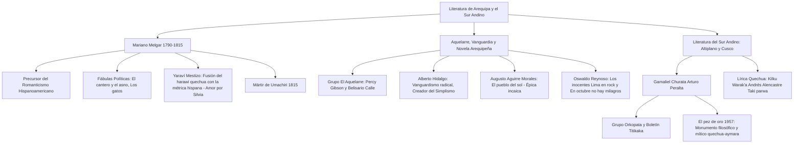

# TEMA 06: LITERATURA REGIONAL: SUR ANDINO Y AREQUIPA (MARIANO MELGAR, AGUIRRE MORALES, CHURATA, REYNOSO Y POÉTICAS ANDINAS)

---

## 1. PORTADA Y METADATOS CURRICULARES

| Campo | Detalle |
| :--- | :--- |
| **Eje Temático** | Eje 06: Comunicación |
| **Materia** | Literatura Regional y del Sur Andino |
| **Nivel de Dificultad** | Preuniversitario Avanzado (UNSA / Admisión Regional) |
| **Tiempo de Estudio Recomendado** | 4.5 horas |
| **Resolución Curricular** | R.C.U. N.° 0028-2026 (Admisión 2027) |
| **Prerrequisitos** | Literatura Peruana (Tema 05), Teoría de Géneros y Figuras (Tema 01) |
| **Objetivo Pedagógico** | Dominar con rigor académico los hitos esenciales de las letras arequipeñas y del sur andino: la trascendencia lírica y patriótica de Mariano Melgar y la génesis del yaraví mestizo; la narrativa histórica de Augusto Aguirre Morales; la vanguardia y estética contestataria de Alberto Hidalgo y Oswaldo Reynoso; y la cosmovisión filosófico-mítica del Grupo Orkopata y Gamaliel Churata en *El pez de oro*. |

---

## 2. MAPA CONCEPTUAL SINTÉTICO (MERMAID)



---

## 3. FUNDAMENTACIÓN TEÓRICA RIGUROSA

### 3.1. Mariano Melgar y Valdivieso (Arequipa, 1790 - Umachiri, 1815)
Poeta, traductor erudito, teólogo, músico y prócer patriota fusilado a los 24 años por las fuerzas realistas de Juan Ramírez tras la batalla de Umachiri (Rebelión de Mateo Pumacahua). Es reconocido por José Carlos Mariátegui y Aurelio Miró Quesada como el **precursor del Romanticismo en el Perú y América Latina**, al anticipar con su vida apasionada y trágica los postulados románticos antes de su llegada formal desde Europa.

#### Facetas Literarias Fundamentales:
1. **La Vertiente Humanística y Clásica:**
   - Dominio precoz del latín. Tradujo las *Geórgicas* de Virgilio y el *Arte de olvidar* (*Remedia Amoris*) de Ovidio.
   - Cultivo de la lírica clásica en odas cívicas (*A la libertad*, *Al conde de Vista Florida*), sonetos (*A Silvia*, *La mujer*) y elegías.
2. **Las Fábulas Cívico-Políticas:**
   - Instrumentos de propaganda patriótica clandestina contra el absolutismo colonial:
     - *El cantero y el asno:* Denuncia que el indio no es servil por naturaleza, sino porque la opresión virreinal lo reduce a la condición de bestia de carga.
     - *Los gatos:* Advertencia alegórica a los patriotas divididos que, al pelear entre sí por comida, son devorados por el perro común.
3. **La Creación del Yaraví Mestizo:**
   - Melgar consuma la **fusión simbiótica perfecta** entre el **harawi quechua prehispánico** (canto melancólico de amor doliente y despedida) y la **métrica lírica castellana** (versos octosílabos, heptasílabos y de pie quebrado con rima asonante o consonante).
   - **El Mito de Silvia:** Encarnación del amor absoluto, esquivo e imposible (María de los Santos Corrales y Salazar). El yaraví melgariano es el llanto desgarrado del amante abandonado que prefiere la muerte antes que la traición a su fe sentimental:
     > *«¿Por qué, a verte volví, Silvia querida?*
     > *¡Ay triste! ¿Para qué? ¡Para trocarse*
     > *mi dolor en más triste despedida!»* (Yaraví I).

---

### 3.2. De la Bohemia del Aquelarre a la Vanguardia Arequipeña

#### A. El Grupo "El Aquelarre" (1916)
Grupo de renovación lírica bohemia en Arequipa contemporáneo del movimiento Colónida de Lima. Integrado por **Percy Gibson**, Belisario Calle, César Atahualpa Rodríguez y Renato Morales de Rivera. Exaltaron la campiña del Misti, la rebelión contra el academicismo y el lirismo de tono modernista depurado.
- **Percy Gibson (1885-1960):** Poeta del paisaje arequipeño, la emoción del trabajo rural y la fuerza volcánica (*Jornada heroica*, *Quince sonetos de la campiña*).

#### B. Alberto Hidalgo (Arequipa, 1897 - Buenos Aires, 1967)
Figura emblemática de la **vanguardia poética iconoclasta y contestataria** hispanoamericana.
- Fundador del **Simplismo**: movimiento poético que proponía suprimir toda retórica inútil, adjetivos convencionales y rima decorativa, valiéndose del verso libre puro, pausas espaciales y la metáfora matemática.
- Obras cumbres: *Panoplia lírica* (1917), *Las voces de colores* (1918), *Química del espíritu* (1923), *Carta al Perú*. Se caracterizó por un individualismo provocador, polémico y megalómano sin claudicaciones.

---

### 3.3. La Gran Novela Histórica: Augusto Aguirre Morales (1888-1957)
Abogado, periodista y novelista arequipeño integrante de la bohemia del Aquelarre y del grupo Colónida.
- ***El pueblo del sol* (1924):** Monumental novela histórica ambientada en el apogeo y descomposición del Imperio de los Incas durante el reinado de Huayna Cápac.
- A diferencia de la visión idílica y edulcorada del Inca Garcilaso de la Vega, Aguirre Morales presenta un Tahuantinsuyo **hierático, trágico, despótico y humano**, marcado por sangrientas conspiraciones cortesanas, el peso asfixiante de la casta sacerdotal y el choque de pasiones imperiales violentas.

---

### 3.4. La Narrativa Urbana y Marginal: Oswaldo Reynoso (Arequipa, 1931 - Lima, 2016)
Escritor arequipeño fundamental de la Generación del 50 y de la narrativa urbana latinoamericana.
- ***Los inocentes* (1961, reeditado como *Lima en rock*):**
  - Colección de cuentos que escandalizó a la crítica burguesa tradicional por su franqueza lingüística y temática.
  - Retrata la vida de la «collera» juvenil del barrio limeño marginal (Cara de Ángel, el Príncipe, Colorete, el Choro, Carambola): adolescentes atrapados entre el despertar sexual, la incomunicación familiar, el billar, el desamparo afectivo y la delincuencia menor.
  - **Aporte Estético:** Introduce por primera vez con maestría técnica la jerga callejera barrial fusionada con una prosa lírica y tierna de deslumbrante belleza formal.
- ***En octubre no hay milagros* (1965):**
  - Novela polifónica y coral estructurada en torno a la multitudinaria procesión del **Señor de los Milagros** en Lima. Radiografía implacable de la corrupción moral, la hipocresía religiosa y la fractura social entre las distintas clases del Perú.

---

### 3.5. Literatura del Sur Andino: Gamaliel Churata y el Grupo Orkopata

#### A. Gamaliel Churata (Arturo Peralta Miranda, Arequipa 1897 - Lima 1969)
Nacido en Arequipa y radicado en Puno, es la cumbre intelectual del **vanguardismo andino e indigenismo cósmico**.
- Líder del **Grupo Orkopata** y director del legendario ***Boletín Titikaka* (1926-1930)**, revista de proyección continental que unió la vanguardia estética universal con la reivindicación de las naciones quechua y aymara.
- ***El pez de oro* (La Paz, Bolivia, 1957):**
  - Subtitulado *Retablos del Laykhakuy*. Considerada una de las obras más colosales, complejas y herméticas de la literatura en lengua española.
  - **Fusión Genérica y Estilística:** Mezcla de novela filosófica, ensayo cosmovisionario, mito andino, diálogo platónico y prosa poética.
  - **Aporte Lingüístico:** Churata dinamita la sintaxis académica colonial para forjar un **castellano andinizado**, con estructura mental quechua-aymara, reivindicando al dios Khori-Challwa (el Pez de Oro que nada en las profundidades míticas del lago Titicaca) como símbolo de la resurrección espiritual del hombre cósmico andino.

#### B. La Poética Quechua: Kilku Warak'a (Andrés Alencastre Gutiérrez, Cusco 1909-1984)
Considerado el más grande poeta en lengua quechua del siglo XX.
- Obras cumbres: ***Taki parwa* (1952)** y ***Yawar para* (1972)**.
- Dignificó el quechua imperial y popular a cotas de excelsitud lírica moderna, cantando al dolor de la servidumbre campesina, la majestad de los apus y la belleza telúrica de los Andes.

---

## 4. FÓRMULAS, TAXONOMÍAS Y LEYES FUNDAMENTALES

### 4.1. Cuadro de las Tres Cumbres Literarias de Arequipa y el Sur Andino

$$\begin{array}{|l|l|l|l|}
\hline
\textbf{Autor y Origen} & \textbf{Obra Capital} & \textbf{Género / Corriente} & \textbf{Eje Temático Vertebrador} \\ \hline
\text{Mariano Melgar (Arequipa)} & \textit{Yaravíes} & \text{Lírico / Prerromanticismo} & \text{Amor doliente mestizo, ausencia y Silvia} \\ \hline
\text{Augusto Aguirre Morales (Arequipa)} & \textit{El pueblo del sol} & \text{Narrativo / Novela histórica} & \text{Desmitificación trágica del Incanato} \\ \hline
\text{Gamaliel Churata (Puno / Arequipa)} & \textit{El pez de oro} & \text{Mítico-Filosófico / Vanguardia andina} & \text{Cosmovisión quechua-aymara y lengua híbrida} \\ \hline
\text{Oswaldo Reynoso (Arequipa)} & \textit{Los inocentes} & \text{Narrativo / Generación del 50} & \text{Marginalidad urbana y collera juvenil} \\ \hline
\end{array}$$

---

## 5. CASOS PRÁCTICOS Y MODELIZACIONES DEL MUNDO REAL

### Caso 1: La Transgresión del Idioma en *El pez de oro* como Resistencia Cultural
- En la lingüística tradicional hispánica, la mezcla de categorías sintácticas del quechua en el español era catalogada peyorativamente como "mote" o incorrección bárbara.
- **La Subversión de Churata:** En *El pez de oro*, Churata no escribe "mal" por ignorancia; transgrede conscientemente la gramática imperial española para demostrar que el pensamiento andino posee una ontología propia y superior basada en el animismo, la reciprocidad y la dialéctica cíclica de la naturaleza, obligando al español a someterse a la melodía profunda del Altiplano.

---

## 6. PRE-UNIVERSITY HACKS Y MNEMOTÉCNIAS

### 1. El Yaraví de Melgar en una Ecuación
$$\mathbf{H}\text{arawi (sentimiento quechua doloroso)} + \mathbf{M}\text{étrica Española (octosílabo / lira)} = \mathbf{Y}\text{araví Mestizo}$$

### 2. Mnemotécnia de las Obras de Melgar
$$\mathbf{F}\text{ábulas (Políticas)} \quad | \quad \mathbf{O}\text{das (Cívicas)} \quad | \quad \mathbf{Y}\text{aravíes (Silvia)}$$
- *Mnemotécnia:* **FOY** de Arequipa.

---

## 7. ERRORES FRECUENTES Y TRAMPAS DE EXAMEN

1. **Creer que el Yaraví existía exactamente así en el Incanato:**
   - *Error:* Afirmar que los incas cantaban *yaravíes*.
   - *Verdad:* Los incas cantaban el ***harawi*** puramente en runasimi; el **yaraví** es una **creación mestiza posterior** formalizada literariamente en castellano por Mariano Melgar.
2. **Confundir a Silvia con Melissa en la vida de Melgar:**
   - *Melissa:* Manuelita Paredes (amor adolescente inicial, previo).
   - *Silvia:* **María de los Santos Corrales** (la musa suprema y desgarradora de su juventud madura, causante de sus más célebres yaravíes).
3. **Pensar que Oswaldo Reynoso solo escribió sobre el campo:**
   - Oswaldo Reynoso es uno de los padres del **realismo urbano marginal limeño** (*Los inocentes*, *En octubre no hay milagros*); su universo literario aborda la urbe moderna y la juventud desencantada.

---

## 8. 5 PROBLEMAS RESUELTOS GRADUADOS

### Problema 1 (Nivel Básico: Mariano Melgar y el Yaraví)
La trascendencia literaria de Mariano Melgar en el marco del proceso emancipador e identitario del Perú radica fundamentalmente en:
- A) Haber sido el primer dramaturgo en estrenar tragedias griegas en el teatro de Lima.
- B) Fundar el yaraví mestizo articulando el sentimiento elegíaco del harawi quechua con las formas métricas hispánicas.
- C) Redactar las actas fundacionales de la Real Academia de la Lengua en Arequipa.
- D) Reivindicar el culteranismo barroco de Luis de Góngora en la poesía virreinal tardía.
- E) Haber liderado la resistencia militar durante la Guerra del Pacífico en el sur del país.

**Resolución:**
Mariano Melgar es considerado el iniciador de la poesía genuinamente nacional y precursor del romanticismo hispanoamericano al asimilar el *harawi* quechua prehispánico y conferirle carta de ciudadanía lírica castellana a través del yaraví mestizo.
**Respuesta:** **B**

---

### Problema 2 (Nivel Intermedio: Fábula Política Melgariana)
En la fábula *El cantero y el asno* de Mariano Melgar, la queja amarga del asno maltratado encierra una aguda crítica sociopolítica dirigida contra:
- A) La corrupción eclesiástica de los sacerdotes doctrineros del Altiplano.
- B) El prejuicio colonial de considerar al indio un ser indolente y servil por naturaleza, demostrando que su postración es fruto de la brutal opresión virreinal.
- C) Las leyes comerciales impuestas por la Corona británica en los puertos peruanos.
- D) Las sublevaciones violentas de los caciques indígenas del Alto Perú.
- E) La falta de vías de comunicación modernas en la sierra sur.

**Resolución:**
Cuando el cantero azota al asno llamándolo flojo y vil animal, el asno replica: *«¿Con qué pagar pretenden / mi fatiga y cuidado? / Con un golpe en el lomo, / con un palo doblado... / y luego dicen que soy zoncito por naturaleza»*. Es la alegoría de la opresión colonial española sobre la masa indígena explotada en las minas y campos.
**Respuesta:** **B**

---

### Problema 3 (Nivel Intermedio-Avanzado: Novela Histórica - Augusto Aguirre Morales)
En la monumental novela histórica *El pueblo del sol* (1924) de Augusto Aguirre Morales, la visión del Imperio de los Incas se aparta radicalmente de la tradición garcilasista al:
- A) Afirmar que el Tahuantinsuyo fue fundado por navegantes fenicios y vikingos.
- B) Desmitificar la supuesta armonía edénica incaica, retratándola como una teocracia despótica, sangrienta y asfixiada por luchas intestinas de poder.
- C) Negar la existencia histórica de Huayna Cápac y Atahualpa.
- D) Exaltar el papel de la caballería española durante la captura de Cajamarca.
- E) Reducir los relatos andinos a una mera comedia de costumbres campestres.

**Resolución:**
Augusto Aguirre Morales acomete una reinterpretación moderna y trágica del Incanato: frente a la utopía armónica y pacífica trazada por el Inca Garcilaso en los *Comentarios Reales*, *El pueblo del sol* presenta un imperio regido por la crueldad teocrática, conspiraciones cortesanas y el dolor aplastante de los súbditos bajo la omnipotencia divina del Sapa Inca.
**Respuesta:** **B**

---

### Problema 4 (Nivel Avanzado: Vanguardia Andina - Gamaliel Churata)
En *El pez de oro* (1957) de Gamaliel Churata, el dios Khori-Challwa y la estructura verbal de la obra encarnan:
- A) Una apología de la monarquía española ilustrada en América del Sur.
- B) La refundación filosófica y cósmica del pensamiento quechua-aymara a través de un castellano andinizado que subvierte la gramática colonial.
- C) La adopción pasiva del realismo socialista soviético en el folklore puneño.
- D) Un tratado botánico descriptivo sobre las especies ictiológicas del lago Titicaca.
- E) Un poema épico escrito en estricto verso alejandrino modernista.

**Resolución:**
Gamaliel Churata estructura en *El pez de oro* una de las obras más ambiciosas y revolucionarias del continente: reivindica la matriz cósmica quechua-aymara utilizando un lenguaje híbrido y telúrico que desmantela el canon formal del español académico, erigiendo una mitología de salvación cultural para los pueblos del Altiplano.
**Respuesta:** **B**

---

### Problema 5 (Nivel 5: Reto Titán / Jefe Final de Admisión - UNSA / UNMSM)
Analice con detenimiento el siguiente conjunto de juicios críticos sobre la literatura regional de Arequipa y el Sur Andino:
I. Mariano Melgar fue fusilado en Umachiri tras actuar como auditor de guerra del ejército patriota liderado por Mateo Pumacahua y Vicente Angulo.
II. Alberto Hidalgo fundó la corriente de vanguardia denominada *Simplismo*, cuya premisa estética exigía la eliminación de la retórica superflua y el uso funcional de la metáfora desnuda.
III. El libro de cuentos *Los inocentes* de Oswaldo Reynoso introdujo por primera vez en la narrativa urbana peruana la jerga de la collera juvenil marginal combinada con una prosa de hondo vuelo lírico.
IV. El *Boletín Titikaka*, órgano de difusión del Grupo Orkopata liderado por Gamaliel Churata, defendió el purismo hispánico clásico frente a las corrientes indigenistas andinas.

Son rigurosamente **VERDADERAS**:
- A) I, II y III
- B) II, III y IV
- C) Solo I y III
- D) I, II, III y IV
- E) Solo II y IV

**Resolución Paso a Paso:**
- **Juicio I (VERDADERO):** Melgar se enroló como auditor de guerra en la rebelión patriota de Pumacahua; tras la derrota en Umachiri fue capturado y fusilado el 12 de marzo de 1815.
- **Juicio II (VERDADERO):** En Argentina, Alberto Hidalgo postuló el *Simplismo*, manifiesto de simplificación radical del poema mediante espacios en blanco y economía expresiva.
- **Juicio III (VERDADERO):** *Los inocentes* (1961) de Oswaldo Reynoso revolucionó la literatura de la Generación del 50 al dotar de espesor lírico y dignidad estética a la jerga y vivencias de los jóvenes de los barrios populares limeños.
- **Juicio IV (FALSO):** El *Boletín Titikaka* (1926-1930) fue exactamente lo opuesto: la trinchera más combativa y radical del indigenismo de vanguardia y la revalorización de la cultura andina frente al academicismo hispanófilo tradicional.
Por consiguiente, son verdaderas **I, II y III**.
**Respuesta:** **A**

---

## 9. GLOSARIO TÉCNICO ESPECIALIZADO

1. **Aquelarre (Grupo):** Colectivo de poetas y escritores arequipeños de inicios del siglo XX (Percy Gibson, César Atahualpa Rodríguez) caracterizado por la bohemia campestre y la renovación lírica.
2. **Boletín Titikaka:** Histórica publicación periódica del Grupo Orkopata de Puno dirigida por Gamaliel Churata que articuló la vanguardia internacional con el indigenismo andino.
3. **Collera:** Grupo o pandilla barrial de amigos adolescentes unida por códigos de lealtad, iniciación y defensa compartida en el universo narrativo de Oswaldo Reynoso.
4. **Harawi:** Canto lírico tradicional quechua prehispánico de naturaleza melancólica, nostálgica o elegíaca centrado en la separación y el sufrimiento amoroso.
5. **Khori-Challwa:** El Pez de Oro en la mitología lacustre del lago Titicaca, deidad cósmica que simboliza la regeneración espiritual de los pueblos andinos.
6. **Orkopata (Grupo):** Movimiento intelectual y cultural fundado en Puno por los hermanos Arturo y Alejandro Peralta (Gamaliel Churata) dedicado a la reivindicación de las raíces quechuas y aymaras.
7. **Prerromanticismo:** Movimiento estético de transición donde emergen la subjetividad pasional, el culto a la libertad y el dolor existencial antes de la consolidación oficial del Romanticismo (encarnado en Mariano Melgar).
8. **Simplismo:** Escuela de vanguardia creada por el poeta arequipeño Alberto Hidalgo que propugnaba la supresión de elementos ornamentales y el uso geométrico del verso libre.
9. **Yaraví:** Género lírico y musical mestizo nacido en Arequipa de la fusión del harawi quechua con la poesía estrófica castellana, consagrado por Mariano Melgar.
10. **Umachiri:** Localidad del Altiplano donde se libró la batalla patriota decisiva en 1815 y en cuyo campo fue fusilado heroicamente Mariano Melgar.

---

## 10. FLASHCARDS DE REPASO ACTIVO

| Front (Pregunta / Disparador) | Back (Respuesta Nemotécnica / Precisa) |
| :--- | :--- |
| ¿Por qué Mariano Melgar es considerado Precursor del Romanticismo? | Porque expresó con **pasión sincera, dolor íntimo y sacrificio patriótico** los ideales románticos antes de que esta corriente llegara formalmente a América. |
| ¿Quién fue la musa que inspiró los más desgarradores yaravíes de Melgar? | **María de los Santos Corrales y Salazar**, inmortalizada poéticamente bajo el nombre de **Silvia**. |
| ¿Qué propone Alberto Hidalgo con el "Simplismo"? | Eliminar adornos retóricos, métrica fija y rimas innecesarias, usando el **verso libre y la metáfora matemática**. |
| ¿Qué obra monumental escribió Gamaliel Churata y cuál es su núcleo temático? | ***El pez de oro* (1957)**: cumbre del vanguardismo andino que fusiona mito, filosofía y una lengua mestiza quechua-aymara-española. |
| ¿De qué trata el libro de cuentos *Los inocentes* de Oswaldo Reynoso? | Relata las vivencias, angustias y despertar afectivo de una **collera de jóvenes marginales** en la Lima de los años sesenta con lenguaje coloquial urbano. |

---

## 11. PREGUNTAS DE AUTOEVALUACIÓN RÁPIDA

1. Fábula de Mariano Melgar donde se denuncia la injusticia colonial comparando el destino del siervo con el de un animal de carga:
   - A) *Las abejas*
   - B) *El cantero y el asno*
   - C) *Los gatos*
   - D) *El murciélago*
   - *Respuesta correcta:* **B** (Alegoría de la explotación del indígena).
2. Monumental novela histórica del arequipeño Augusto Aguirre Morales que desmitifica la visión idílica del Incanato:
   - A) *La medusa*
   - B) *El pueblo del sol*
   - C) *Jornada heroica*
   - D) *Flor de ensueño*
   - *Respuesta correcta:* **B** (Publicada en 1924, ambientada en tiempos de Huayna Cápac).
3. Revista de vanguardia e indigenismo continental dirigida en Puno por Gamaliel Churata:
   - A) *Amauta*
   - B) *Colónida*
   - C) *Boletín Titikaka*
   - D) *El Aquelarre*
   - *Respuesta correcta:* **C** (Trinchera cultural del Grupo Orkopata).

---

## 12. BLOQUE DE INTEGRACIÓN KMP / GAMIFICACIÓN (JSON)

```json
{
  "tema_id": "LIT_06",
  "eje_tematico": "06_COMUNICACION",
  "curso": "LITERATURA",
  "titulo_tema": "Literatura Regional: Sur Andino y Arequipa",
  "dificultad": "Avanzado",
  "xp_recompensa": 280,
  "habilidades_evaluadas": [
    "Identificación de la génesis del yaraví mestizo en Mariano Melgar",
    "Análisis de las fábulas cívicas de Melgar",
    "Comprensión de la vanguardia de Alberto Hidalgo y Gamaliel Churata",
    "Crítica social en la narrativa de Augusto Aguirre Morales y Oswaldo Reynoso"
  ],
  "boss_challenge": {
    "boss_name": "El Khori-Challwa de las Profundidades del Titikaka",
    "vida_boss": 4000,
    "ataque_especial": "Yaraví de Umachiri y Fulgor Mítico de El Pez de Oro",
    "pregunta_reto": "¿Cuál es la razón fundamental por la que el yaraví melgariano inaugura la auténtica literatura peruana según Mariátegui?",
    "opciones": [
      "Porque copió fielmente las estrofas del Siglo de Oro español",
      "Porque fue el primer momento en que el dolor indígena (harawi) y el idioma castellano se fundieron en una voz mestiza genuina y conmovedora",
      "Porque fue compuesto exclusivamente para auditorios aristocráticos virreinales",
      "Porque prescindió de cualquier emoción personal y se limitó a describir paisajes"
    ],
    "respuesta_correcta_index": 1,
    "explicacion_gamificada": "¡Victoria colosal! José Carlos Mariátegui sentencia en sus 7 Ensayos que con Mariano Melgar nace el primer momento de peruanidad lírica: el yaraví es el puente donde el alma quechua doliente fecunda la lengua hispana. ¡Has conquistado el Eje de Comunicación al 100%!"
  }
}
```
