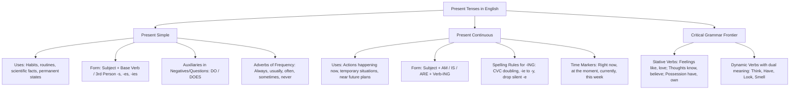

# TEMA 01: GRAMÁTICA INGLESA: TIEMPOS VERBALES DE PRESENTE (PRESENT SIMPLE VS. PRESENT CONTINUOUS) Y STATIVE VERBS

---

## 1. PORTADA Y METADATOS CURRICULARES

| Campo | Detalle |
| :--- | :--- |
| **Eje Temático** | Eje 07: Idioma Extranjero (Inglés) |
| **Materia** | Gramática y Sintaxis Inglesa (A2 - B1 CEFR) |
| **Nivel de Dificultad** | Preuniversitario Avanzado (UNSA / CEPRUNSA) |
| **Tiempo de Estudio Recomendado** | 4.5 horas |
| **Resolución Curricular** | R.C.U. N.° 0028-2026 (Admisión 2027) |
| **Prerrequisitos** | Pronombres personales, vocabulario verbal elemental |
| **Objetivo Pedagógico** | Dominar con exactitud la morfología, sintaxis y contraste pragmático entre el **Present Simple** (rutinas, hechos científicos, estados permanentes) y el **Present Continuous** (acciones en progreso, situaciones temporales y planes cercanos); aplicar las reglas de adición de *-s/-es/-ies* e *-ing*; y reconocer los **Stative Verbs** no susceptibles de aspecto continuo. |

---

## 2. MAPA CONCEPTUAL SINTÉTICO (MERMAID)



---

## 3. FUNDAMENTACIÓN TEÓRICA RIGUROSA

### 3.1. The Present Simple Tense
El **Present Simple** se utiliza para expresar acciones habituales, rutinas cotidianas, leyes científicas universales, verdades absolutas y estados permanentes en el tiempo.

#### A. Morfología y Reglas Ortográficas de la Tercera Persona Singular (*He, She, It*)
En oraciones afirmativas, los sujetos singulares de tercera persona exigen la modificación del verbo base:

| Terminación del Verbo Base | Regla de Modificación | Ejemplos Ilustrativos |
| :--- | :--- | :--- |
| **Regla General (Mayoría)** | Añadir **-s** | *read $\rightarrow$ reads*, *work $\rightarrow$ works*, *eat $\rightarrow$ eats* |
| **Terminados en -s, -ss, -sh, -ch, -x, -z, -o** | Añadir **-es** | *pass $\rightarrow$ passes*, *wash $\rightarrow$ washes*, *watch $\rightarrow$ watches*, *fix $\rightarrow$ fixes*, *go $\rightarrow$ goes*, *do $\rightarrow$ does* |
| **Consonante + 'y'** | Cambiar 'y' por **-ies** | *study $\rightarrow$ studies*, *cry $\rightarrow$ cries*, *fly $\rightarrow$ flies* |
| **Vocal + 'y'** | Solo añadir **-s** | *play $\rightarrow$ plays*, *enjoy $\rightarrow$ enjoys*, *buy $\rightarrow$ buys* |
| **Irregular: Verbo *Have*** | Forma propia supletiva | *have $\rightarrow$ has* |

#### B. Estructura Sintáctica y Auxiliares (*Do / Does*)
- **Afirmativa:** $\text{Subject} + \text{Verb (base / -s)} + \text{Complement}$
  *She works at the university laboratory.*
- **Negativa:** $\text{Subject} + \mathbf{do \ not \ (don't) \ / \ does \ not \ (doesn't)} + \mathbf{Base \ Verb} + \text{Complement}$
  *She **doesn't work** at the hospital.* (Nótese: el verbo pierde la *-s* al estar presente el auxiliar *does*).
- **Interrogativa:** $\mathbf{Do \ / \ Does} + \text{Subject} + \mathbf{Base \ Verb} + \text{Complement} + ?$
  ***Does** he **study** civil engineering? $\rightarrow$ Yes, he does. / No, he doesn't.*

#### C. Adverbios de Frecuencia y Posición Sintáctica
Indican con qué periodicidad se realiza una acción (*always 100%, usually 80%, often 60%, sometimes 40%, hardly ever 10%, never 0%*).
- **Regla de Posición 1:** Se colocan **antes del verbo principal**:
  $$\text{Subject} + \mathbf{Adverb \ of \ Frequency} + \text{Main Verb} + \text{Complement}$$
  *Carlos **always arrives** on time for lectures.*
- **Regla de Posición 2:** Se colocan **después del verbo *To Be***:
  $$\text{Subject} + \mathbf{To \ Be \ (am/is/are)} + \mathbf{Adverb \ of \ Frequency} + \text{Complement}$$
  *They **are often** busy with lab experiments.*

---

### 3.2. The Present Continuous Tense
El **Present Continuous** (o Progresivo) se utiliza para:
1. Acciones que ocurren exactamente en el **momento de hablar** (*happening right now*).
2. Situaciones **temporales** que no son la norma permanente (*I am living with my aunt this semester*).
3. Tendencias de cambio o evolución (*Global temperatures are rising*).
4. Planes personales confirmados para el **futuro cercano** (*We are taking the exam tomorrow morning*).

#### A. Estructura Sintáctica
$$\text{Subject} + \mathbf{am \ / \ is \ / \ are} + (\text{not}) + \mathbf{Verb\text{-}ING} + \text{Complement}$$
- *Afirmativa:* *The students **are conducting** an experiment right now.*
- *Negativa:* *She **is not (isn't) paying** attention to the instructor.*
- *Interrogativa:* ***Are** you **preparing** for the UNSA admission test?*

#### B. Reglas de Sufijación del Gerundio (*-ING*)
1. **Regla General:** Añadir *-ing* al verbo base (*read $\rightarrow$ reading*, *study $\rightarrow$ studying*).
2. **Terminados en 'e' muda:** Se elimina la 'e' y se añade *-ing* (*write $\rightarrow$ writing*, *make $\rightarrow$ making*, *dance $\rightarrow$ dancing*). (Excepción: terminados en *-ee*: *see $\rightarrow$ seeing*).
3. **Monosílabos Consonante-Vocal-Consonante (CVC):** Se duplica la consonante final (*run $\rightarrow$ running*, *swim $\rightarrow$ swimming*, *stop $\rightarrow$ stopping*). (Excepción: no se duplican terminaciones en *-w, -x, -y*: *play $\rightarrow$ playing*, *snow $\rightarrow$ snowing*).
4. **Verbos de dos sílabas CVC con acento en la última sílaba:** Se duplica la consonante final (*begin $\rightarrow$ beginning*, *prefer $\rightarrow$ preferring*). Si el acento va en la primera sílaba, no se duplica (*visit $\rightarrow$ visiting*, *listen $\rightarrow$ listening*).
5. **Terminados en '-ie':** Cambian *-ie* por *-y* + *-ing* (*die $\rightarrow$ dying*, *lie $\rightarrow$ lying*).

---

### 3.3. Stative Verbs (Verbos de Estado)
Los **Stative Verbs** describen estados emocionales, procesos mentales, posesión o percepciones sensoriales estables, NO acciones dinámicas. **Por norma gramatical general, NO se conjugan en tiempos continuos (*-ing*)**.

| Categoría de Estado | Verbos Clave | Forma Correcta vs. Incorrecta |
| :--- | :--- | :--- |
| **Emociones y Sentimientos** | *like, love, hate, prefer, desire, want* | $\checkmark$ *I want a glass of water.*<br>$\times$ *I am wanting a glass of water.* |
| **Pensamiento y Creencia** | *know, believe, understand, remember, forget, mean* | $\checkmark$ *She understands the problem.*<br>$\times$ *She is understanding the problem.* |
| **Posesión** | *have, belong to, own, possess* | $\checkmark$ *They own three houses.*<br>$\times$ *They are owning three houses.* |
| **Sentidos y Percepción** | *seem, appear, smell, taste, sound, hear* | $\checkmark$ *The food smells delicious.*<br>$\times$ *The food is smelling delicious.* |

#### Verbos Mixtos (Stative vs. Dynamic según Significado):
- **Have:**
  - *Estado (Posesión):* *I **have** a laptop.* (No admite continuo).
  - *Dinámico (Acción: comer, beber, ducharse):* *I **am having** lunch right now.* (Correcto).
- **Think:**
  - *Estado (Opinión):* *I **think** that university is excellent.* (Opino eso).
  - *Dinámico (Proceso mental activo deliberado):* *Shh, I **am thinking** about the solution.* (Estoy reflexionando).

---

## 4. FÓRMULAS, TAXONOMÍAS Y LEYES FUNDAMENTALES

### 4.1. Cuadro de Discriminación Pragmática y Marcadores Temporales

$$\begin{array}{|l|l|l|}
\hline
\textbf{Criterio} & \textbf{Present Simple} & \textbf{Present Continuous} \\ \hline
\text{Naturaleza} & \text{Permanente, habitual, cíclica} & \text{Temporal, puntual, en curso ahora} \\ \hline
\text{Estructura} & S + V(\text{base}/-s) \ / \ S + do(es)n't + V & S + am/is/are + V\text{-ing} \\ \hline
\text{Marcadores} & \textit{always, every day, on Mondays, rarely} & \textit{now, right now, at the moment, currently} \\ \hline
\text{Pregunta Clave} & \textit{What do you do?} (\text{¿A qué te dedicas?}) & \textit{What are you doing?} (\text{¿Qué haces ahora?}) \\ \hline
\end{array}$$

---

## 5. CASOS PRÁCTICOS Y MODELIZACIONES DEL MUNDO REAL

### Caso 1: Resolución de Ambigüedades en Entrevistas de Admisión
En una entrevista en inglés, el examinador pregunta:
> *"What do you do?"*
- **Análisis Sintáctico:** Uso de Present Simple con el auxiliar *do*. Pregunta por la **actividad u ocupación habitual permanente**.
  - *Respuesta correcta:* *"I am a pre-university student and I prepare for the engineering entrance exam."*
- Si el examinador hubiera preguntado:
> *"What are you doing?"*
- **Análisis Sintáctico:** Uso de Present Continuous con auxiliar *are* y gerundio *doing*. Pregunta por la **acción inmediata en el presente momento**.
  - *Respuesta correcta:* *"I am taking an oral English assessment in front of you."*
Confundir ambos tiempos verbales en exámenes internacionales o de admisión invalida la coherencia de la respuesta.

---

## 6. PRE-UNIVERSITY HACKS Y MNEMOTÉCNIAS

### 1. El Hack de la "-s" en Tercera Persona: "El Auxiliar se Roba la -s"
Cuando aparecen los auxiliares **DOES** o **DOESN'T**, estos ya contienen la marca de la tercera persona singular. Por tanto, el verbo principal **NUNCA** lleva *-s*:
$$\mathbf{Does} + \text{he} + \mathbf{study} \quad (\text{NO:} \ \times \text{Does he studies?})$$
$$\text{He} + \mathbf{doesn't} + \mathbf{play} \quad (\text{NO:} \ \times \text{He doesn't plays})$$

### 2. Mnemotécnia de la Posición del Adverbio de Frecuencia: "Antes del Verbo, pero Después del Be"
$$\mathbf{AV} \ (\text{\textbf{A}ntes del \textbf{V}erbo}) \quad \longleftrightarrow \quad \mathbf{DB} \ (\text{\textbf{D}espués del \textbf{B}e})$$
- *He **always plays**.* (Antes del verbo *play*).
- *He **is always** late.* (Después del verbo *is*).

---

## 7. ERRORES FRECUENTES Y TRAMPAS DE EXAMEN

1. **Olvidar la "-s" en afirmaciones con pronombres indefinidos:**
   - *Everyone, everybody, someone, nobody* son formalmente **singulares** de tercera persona (*he/she/it*):
     - *Incorrecto:* $\times$ *Everyone know the answer.*
     - *Correcto:* $\checkmark$ *Everyone **knows** the answer.*
2. **Usar Stative Verbs en gerundio por influencia del español:**
   - En español decimos: *"Te estoy entendiendo"*.
   - En inglés estándar es un error gramatical decir: $\times$ *I am understanding you*. Debe decirse: $\checkmark$ *I **understand** you*.
3. **Duplicación indebida de consonantes en gerundio:**
   - *Visit $\rightarrow$ Visiting* (NO: $\times$ *visitting*, porque la fuerza de voz recae en la primera sílaba: *VI-sit*).
   - *Begin $\rightarrow$ Beginning* (SÍ se duplica porque la fuerza recae en la última sílaba: *be-GIN*).

---

## 8. 5 PROBLEMAS RESUELTOS GRADUADOS

### Problema 1 (Nivel Básico: Present Simple Third Person)
Complete the sentence correctly:
*"My sister is an environmental engineer and she _______ water pollution levels in local rivers every month."*
- A) monitor
- B) monitors
- C) is monitoring
- D) are monitoring
- E) monitoring

**Resolución:**
1. El sujeto es *My sister* (tercera persona singular femenina: *she*).
2. La expresión de tiempo *every month* denota una rutina habitual periódica, lo que exige el uso del **Present Simple**.
3. De acuerdo a las reglas morfológicas, al verbo regular *monitor* se le agrega la desinencia **-s**: *monitors*.
**Respuesta:** **B**

---

### Problema 2 (Nivel Intermedio: Adverb of Frequency Position)
Choose the sentence that displays the grammatically correct word order:
- A) She is arriving always late to the biology laboratory.
- B) She arrives always late to the biology laboratory.
- C) She always is late to the biology laboratory.
- D) She is always late to the biology laboratory.
- E) Always she is arriving late to the biology laboratory.

**Resolución:**
La regla de oro para la sintaxis de los adverbios de frecuencia establece que se colocan **después del verbo to be** (*am, is, are*) y **antes de los demás verbos**. En la oración se utiliza el verbo *is*; por consiguiente, el adverbio *always* debe posicionarse inmediatamente después de *is*: *She is always late...*.
**Respuesta:** **D**

---

### Problema 3 (Nivel Intermedio-Avanzado: Present Continuous vs. Present Simple Contrast)
Fill in the blanks with the most appropriate verb forms:
*"Listen! The professor _______ the instructions for the final project, but nobody _______ what he means."*
- A) explains - understands
- B) is explaining - is understanding
- C) is explaining - understands
- D) explains - is understanding
- E) is explain - understand

**Resolución:**
1. La exclamación inicial *"Listen!"* actúa como marcador pragmático que señala que la acción se está desarrollando en el momento mismo del habla; por lo tanto, el primer verbo requiere **Present Continuous**: *is explaining*.
2. El segundo verbo es *understand* (Proceso cognitivo mental), el cual es un **Stative Verb** que rechaza las formas continuas; por lo tanto, debe conjugarse en **Present Simple**: *nobody understands* (recordando que *nobody* rige verbo en singular con *-s*).
Combinación correcta: *is explaining - understands*.
**Respuesta:** **C**

---

### Problema 4 (Nivel Avanzado: Dynamic vs. Stative Meaning of "Have")
Select the sentence where the verb **"have"** is used INCORRECTLY:
- A) We are having dinner at an Arequipenian restaurant tonight.
- B) Mark has a complete collection of organic chemistry textbooks.
- C) The university is having a financial conference next Friday.
- D) Dr. Harrison is having three advanced degrees in physics.
- E) I am having a terrible headache right now.

**Resolución:**
- En A: *having dinner* = cenar (acción dinámica, uso continuo válido).
- En B: *has* = poseer libros (posesión en Present Simple, correcto).
- En C: *is having a conference* = celebrar un evento (acción dinámica planificada, válido).
- En E: *having a headache* es una expresión idiomática aceptable para experimentar un dolor físico en progreso.
- En D: El verbo *have* se utiliza en sentido estricto de **posesión de credenciales o títulos académicos permanentes**. Los títulos no son una acción momentánea que se está "ejecutando"; son un estado de posesión (*Dr. Harrison **has** three advanced degrees*). Su uso en continuo (*is having*) es una incorrección gramatical flagrante.
**Respuesta:** **D**

---

### Problema 5 (Nivel 5: Reto Titán / Jefe Final de Admisión - UNSA / UNMSM)
Analyze the following five sentences and identify how many of them are **GRAMMATICALLY ACCURATE**:
1. *Every student in this classroom knows where the main library is located.*
2. *Water is boiling at 100 degrees Celsius under standard atmospheric pressure.*
3. *Why does she not study with her classmates on Saturdays?*
4. *Look at that man over there; he is smelling the roses in the botanical garden.*
5. *Currently, my brother stays at a youth hostel until he finds an apartment.*

- A) 1 sentence
- B) 2 sentences
- C) 3 sentences
- D) 4 sentences
- E) 5 sentences

**Resolución Paso a Paso:**
- **Oración 1 (CORRECTA):** *Every student* es singular y concierta con *knows* (Present Simple, stative verb); la cláusula indirecta *where the library is located* mantiene el orden canónico.
- **Oración 2 (INCORRECTA):** Expresa una verdad o ley científica universal de la física. Las leyes naturales inmutables se expresan obligatoriamente en **Present Simple**: *Water **boils** at 100 degrees Celsius* (no en continuo).
- **Oración 3 (CORRECTA):** Interrogativa negativa formal en Present Simple: auxiliar *does* + sujeto *she* + negación *not* + verbo base *study*.
- **Oración 4 (CORRECTA):** El marcador *Look at that man* indica acción en progreso. El verbo *smell* aquí funciona de modo **dinámico** (el acto voluntario y físico de acercar la nariz para oler las rosas), por lo que admite legítimamente la forma continua *is smelling*.
- **Oración 5 (INCORRECTA):** El marcador *Currently* y la subordinada *until he finds an apartment* denotan una **situación temporal transitoria**; por lo tanto, exige **Present Continuous**: *Currently, my brother **is staying** at a youth hostel...*.
Por lo tanto, exactamente **3 oraciones** (1, 3 y 4) son gramaticalmente impecables.
**Respuesta:** **C**

---

## 9. GLOSARIO TÉCNICO ESPECIALIZADO

1. **Auxiliary Verb:** Verbo de soporte sintáctico (*do, does, am, is, are*) que carece de significado léxico pleno y se utiliza para estructurar negaciones, preguntas o aspectos temporales.
2. **Bare Infinitive:** Forma básica del verbo sin la partícula *to* (*go, study, write*), requerida tras auxiliares como *do/does*.
3. **Dynamic Verb:** Verbo que describe una acción física perceptible o deliberada que posee inicio, desarrollo y final (*run, build, write*).
4. **Gerund (-ING form):** Forma no personal del verbo obtenida mediante el sufijo *-ing*, utilizada para construir aspectos progresivos o funciones sustantivas.
5. **Habitual Aspect:** Matiz temporal que indica que una acción se repite periódica o regularmente en el tiempo como costumbre (propio del Present Simple).
6. **Permanent State:** Condición existencial estable y duradera que no está sujeta a una duración temporal transitoria.
7. **Stative Verb:** Verbo que denota estados internos, pensamientos, emociones, relaciones de posesión o sensaciones que no implican acción dinámica física.
8. **Third Person Singular:** Sujetos gramaticales correspondientes a *he, she, it* o sustantivos singulares equivalentes que exigen el sufijo *-s/-es* en Present Simple.
9. **Universal Truth:** Proposición fáctica, científica o lógica que mantiene validez constante en todo tiempo y lugar (*The Earth revolves around the Sun*).
10. **Zero Adverb (Never):** Adverbio de frecuencia con valor semántico negativo absoluto (0% de ocurrencia) que se combina con verbos en forma afirmativa para evitar doble negación.

---

## 10. FLASHCARDS DE REPASO ACTIVO

| Front (Pregunta / Disparador) | Back (Respuesta Nemotécnica / Precisa) |
| :--- | :--- |
| When do you add *-es* instead of *-s* in Present Simple third person? | When the base verb ends in **-s, -ss, -sh, -ch, -x, -z**, or **-o** (*passes, washes, watches, fixes, goes*). |
| What happens to the verb *-s* when *does* or *doesn't* is used? | The verb **loses the -s** and returns to its **base infinitive form** (*Does he know? He doesn't know*). |
| Where do you place adverbs of frequency in a sentence with *To Be*? | Adverbs of frequency are placed **AFTER the verb To Be** (*He is always on time*). |
| Why is *"I am knowing the answer"* incorrect? | Because *know* is a **Stative Verb** (mental process) and does NOT accept continuous (*-ing*) tenses. Use: *I know the answer*. |
| What spelling rule applies to one-syllable CVC verbs in gerund? | Double the final consonant before adding *-ing* (*run $\rightarrow$ running, swim $\rightarrow$ swimming*), except verbs ending in -w, -x, -y. |

---

## 11. PREGUNTAS DE AUTOEVALUACIÓN RÁPIDA

1. Which sentence is grammatically correct?
   - A) The sun is rising in the east every morning.
   - B) The sun rises in the east every morning.
   - C) The sun rise in the east every morning.
   - D) The sun does rises in the east every morning.
   - *Respuesta correcta:* **B** (Verdad científica y hecho natural permanente en Present Simple con 3.ª persona *-s*).
2. *"They _______ computer science this semester because their professor is on sabbatical."*
   - A) don't study
   - B) aren't studying
   - C) not studying
   - D) doesn't study
   - *Respuesta correcta:* **B** (Situación temporal transitoria delimitada por *this semester* en Present Continuous).
3. Choose the correct third-person form of the verb *"study"*:
   - A) studys
   - B) studies
   - C) studyes
   - D) studying
   - *Respuesta correcta:* **B** (Consonante + 'y' cambia a *-ies*).

---

## 12. BLOQUE DE INTEGRACIÓN KMP / GAMIFICACIÓN (JSON)

```json
{
  "tema_id": "ING_GRA_01",
  "eje_tematico": "07_IDIOMA_EXTRANJERO",
  "curso": "INGLES_GRAMATICA",
  "titulo_tema": "Tiempos Verbales de Presente: Present Simple vs. Present Continuous y Stative Verbs",
  "dificultad": "Avanzado",
  "xp_recompensa": 250,
  "habilidades_evaluadas": [
    "Conjugación morfológica de tercera persona singular (-s, -es, -ies)",
    "Uso riguroso de auxiliares do / does / don't / doesn't",
    "Posición sintáctica de adverbios de frecuencia frente a To Be",
    "Discriminación de Stative Verbs frente a verbos dinámicos"
  ],
  "boss_challenge": {
    "boss_name": "The Grammar Titan of Greenwich",
    "vida_boss": 3400,
    "ataque_especial": "Double Negation Trap & Stative Illusion",
    "pregunta_reto": "Which of the following sentences correctly expresses a present scientific fact?",
    "opciones": [
      "Light is traveling faster than sound in all mediums.",
      "Light travels faster than sound in a vacuum.",
      "Light travel faster than sound.",
      "Light does travels faster than sound."
    ],
    "respuesta_correcta_index": 1,
    "explicacion_gamificada": "¡Masterful strike! Las leyes universales de la física se expresan obligatoriamente en Present Simple (travels con -s por ser sustantivo incontable singular: light). El aspecto continuo está vedado para hechos permanentes."
  }
}
```
