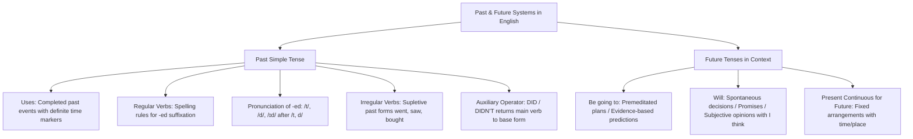

# TEMA 02: GRAMÁTICA INGLESA: PASADO SIMPLE (REGULARES E IRREGULARES) Y FORMAS DE FUTURO (BE GOING TO VS. WILL)

---

## 1. PORTADA Y METADATOS CURRICULARES

| Campo | Detalle |
| :--- | :--- |
| **Eje Temático** | Eje 07: Idioma Extranjero (Inglés) |
| **Materia** | Gramática y Sintaxis Inglesa (A2 - B1 CEFR) |
| **Nivel de Dificultad** | Preuniversitario Avanzado (UNSA / CEPRUNSA) |
| **Tiempo de Estudio Recomendado** | 4.5 horas |
| **Resolución Curricular** | R.C.U. N.° 0028-2026 (Admisión 2027) |
| **Prerrequisitos** | Tiempos de Presente y Auxiliares Básicos (Tema 01) |
| **Objetivo Pedagógico** | Dominar la flexión y sintaxis del **Past Simple** (reglas ortográficas de verbos regulares *-ed*, fonología de desinencias /t/, /d/, /ɪd/, catálogo de verbos irregulares clave y uso del auxiliar *did/didn't*); discriminar con precisión quirúrgica las formas de futuro: **Be going to** (planes premeditados y evidencia empírica presente) frente a **Will** (decisiones espontáneas, promesas y predicciones subjetivas). |

---

## 2. MAPA CONCEPTUAL SINTÉTICO (MERMAID)



---

## 3. FUNDAMENTACIÓN TEÓRICA RIGUROSA

### 3.1. The Past Simple Tense (Pasado Simple)
Se utiliza para expresar acciones, hechos o estados que **comenzaron y concluyeron definitivamente en el pasado**, acompañados o delimitados por marcadores temporales específicos (*yesterday, last night, two days ago, in 2020, when I was a child*).

#### A. Verbos Regulares: Reglas de Sufijación del Morfema *-ed*
1. **Regla General:** Añadir *-ed* a la forma base (*clean $\rightarrow$ cleaned*, *work $\rightarrow$ worked*, *open $\rightarrow$ opened*).
2. **Terminados en 'e' muda:** Añadir únicamente *-d* (*live $\rightarrow$ lived*, *arrive $\rightarrow$ arrived*, *decide $\rightarrow$ decided*).
3. **Consonante + 'y':** Cambiar la 'y' por **-ied** (*study $\rightarrow$ studied*, *carry $\rightarrow$ carried*, *try $\rightarrow$ tried*).
4. **Vocal + 'y':** Solo añadir *-ed* (*play $\rightarrow$ played*, *enjoy $\rightarrow$ enjoyed*, *stay $\rightarrow$ stayed*).
5. **Monosílabos CVC (Consonante-Vocal-Consonante):** Se duplica la consonante final (*stop $\rightarrow$ stopped*, *plan $\rightarrow$ planned*, *rob $\rightarrow$ robbed*). (No aplica a terminaciones en *-w, -x*: *snow $\rightarrow$ snowed*, *fix $\rightarrow$ fixed*).
6. **Polisílabos con acento en la última sílaba:** Se duplica la consonante (*admit $\rightarrow$ admitted*, *prefer $\rightarrow$ preferred*). Si el acento va en la primera sílaba, no se duplica (*visit $\rightarrow$ visited*, *listen $\rightarrow$ listened*).

#### B. Fonología de la Terminación *-ed* (Reglas de Pronunciación)
En los exámenes de admisión y pruebas de suficiencia, la pronunciación de *-ed* responde a tres reglas fonéticas inviolables:

| Sonido Final del Verbo Base | Realización Fonética de *-ed* | Ejemplos |
| :--- | :--- | :--- |
| **Sonido /t/ o /d/** | **/ɪd/** (Añade una sílaba extra) | *wanted* (/ˈwɒntɪd/), *decided* (/dɪˈsaɪdɪd/), *started* |
| **Consonante Sorda (Voiceless):** /p, k, f, s, ʃ, tʃ, θ/ | **/t/** (Sin sílaba extra) | *worked* (/wɜːkt/), *watched* (/wɒtʃt/), *stopped* (/stɒpt/), *laughed* |
| **Consonante Sonora (Voiced) o Vocal:** /b, g, v, z, m, n, l, r/ y vocales | **/d/** (Sin sílaba extra) | *cleaned* (/kliːnd/), *lived* (/lɪvd/), *played* (/pleɪd/), *called* |

#### C. Catálogo de Verbos Irregulares Clave en Admisión
Los verbos irregulares no añaden *-ed*; modifican su raíz o adoptan formas supletivas:

$$\begin{array}{|l|l|l||l|l|l|}
\hline
\textbf{Base Form} & \textbf{Past Simple} & \textbf{Significado} & \textbf{Base Form} & \textbf{Past Simple} & \textbf{Significado} \\ \hline
\text{be} & \text{was / were} & \text{ser / estar} & \text{give} & \text{gave} & \text{dar} \\ \hline
\text{begin} & \text{began} & \text{empezar} & \text{go} & \text{went} & \text{ir} \\ \hline
\text{break} & \text{broke} & \text{romper} & \text{have} & \text{had} & \text{tener / haber} \\ \hline
\text{bring} & \text{brought} & \text{traer} & \text{know} & \text{knew} & \text{saber / conocer} \\ \hline
\text{buy} & \text{bought} & \text{comprar} & \text{make} & \text{made} & \text{hacer / fabricar} \\ \hline
\text{choose} & \text{chose} & \text{elegir} & \text{read} & \text{read (/red/)} & \text{leer} \\ \hline
\text{do} & \text{did} & \text{hacer} & \text{see} & \text{saw} & \text{ver} \\ \hline
\text{drive} & \text{drove} & \text{conducir} & \text{speak} & \text{spoke} & \text{hablar} \\ \hline
\text{eat} & \text{ate} & \text{comer} & \text{take} & \text{took} & \text{tomar / llevar} \\ \hline
\text{find} & \text{found} & \text{encontrar} & \text{write} & \text{wrote} & \text{escribir} \\ \hline
\end{array}$$

#### D. Sintaxis del Pasado Simple con el Operador Auxiliar *DID*
- **Afirmativa:** $\text{Subject} + \mathbf{Past \ Verb \ (-ed \ / \ irregular)} + \text{Complement}$
  *Alexander Fleming **discovered** penicillin in 1928.*
- **Negativa:** $\text{Subject} + \mathbf{did \ not \ (didn't)} + \mathbf{Base \ Verb} + \text{Complement}$
  *The students **didn't understand** the mathematical theorem.*
- **Interrogativa:** $\mathbf{Did} + \text{Subject} + \mathbf{Base \ Verb} + \text{Complement} + ?$
  ***Did** you **finish** the laboratory report yesterday? $\rightarrow$ Yes, I did. / No, I didn't.*
> **LECCIÓN DE ORO:** Tras el auxiliar *did* o *didn't*, el verbo principal **SIEMPRE VUELVE A SU FORMA BASE**. Está terminantemente prohibido duplicar el pasado: $\times$ *Did you went?* $\rightarrow$ $\checkmark$ *Did you go?*.

---

### 3.2. Formas de Futuro en Inglés: *Be Going To* vs. *Will*

#### A. *Be Going To* (Futuro Intencional y Evidencial)
$$\text{Subject} + \mathbf{am \ / \ is \ / \ are \ + \ going \ to} + \mathbf{Base \ Verb} + \text{Complement}$$
Se utiliza preceptivamente en dos contextos semánticos:
1. **Planes, Intenciones y Decisiones Premeditadas:** Decisiones tomadas **antes** del momento de hablar (*prior plans*).
   *I **am going to study** Medicine at UNSA next year.* (Ya lo decidí, es mi plan firme).
2. **Predicciones basadas en Evidencia Presente Observable:** Hay señales físicas visibles en el entorno que garantizan el desenlace.
   *Look at those dark, heavy clouds over the Misti! It **is going to rain**.*

#### B. *Will* (Futuro Espontáneo, Volitivo y Especulativo)
$$\text{Subject} + \mathbf{will \ / \ won't} + \mathbf{Base \ Verb} + \text{Complement}$$
Se utiliza preceptivamente en:
1. **Decisiones Espontáneas e Improvisadas:** Tomadas en el **mismo instante** de la conversación (*on-the-spot decisions*).
   *— The telephone is ringing. — Don't worry, I **will answer** it.*
2. **Promesas, Ofertas, Amenazas y Rechazos:**
   *I **will always support** you.* / *I **will help** you with that heavy box.*
3. **Predicciones basadas en Creencias Subjetivas u Opiniones:** Introducidas comúnmente por *I think, I believe, I doubt, perhaps, probably*:
   *I think technology **will transform** higher education by 2030.*

---

## 4. FÓRMULAS, TAXONOMÍAS Y LEYES FUNDAMENTALES

### 4.1. Algoritmo de Decisión: ¿*Will* o *Be Going To*?

$$\text{¿Existe un plan previo o una evidencia física visible ahora?} \begin{cases} \text{SÍ} \longrightarrow \mathbf{BE \ GOING \ TO} \quad (\text{Plan previo o evidencia presente}) \\ \text{NO} \longrightarrow \begin{cases} \text{¿Decisión espontánea en el momento?} \longrightarrow \mathbf{WILL} \\ \text{¿Promesa u oferta de ayuda?} \longrightarrow \mathbf{WILL} \\ \text{¿Opinión personal subjetiva (I think)?} \longrightarrow \mathbf{WILL} \end{cases} \end{cases}$$

---

## 5. CASOS PRÁCTICOS Y MODELIZACIONES DEL MUNDO REAL

### Caso 1: El Diálogo en la Cafetería Universitaria
- **Situación:** Dos postulantes conversan en la cafetería.
  - *Applicant A:* *"I didn't bring my wallet; I can't pay for the coffee."*
  - *Applicant B:* *"Don't worry, I **will lend** you some money."*
- **Análisis Gramatical:** El postulante B no tenía planeado desde su casa prestarle dinero; la decisión surge como una reacción espontánea y solidaria en el momento exacto del habla. El uso de *I am going to lend you* sería incorrecto en este contexto pragmático.
- Si luego el postulante B le cuenta a un tercero:
  - *"I **am going to buy** tickets for the science fair this afternoon; I already saved the money."*
  - **Uso Correcto:** *Be going to*, pues la compra es un plan premeditado previo con dinero apartado deliberadamente.

---

## 6. PRE-UNIVERSITY HACKS Y MNEMOTÉCNIAS

### 1. El Hack de la Pronunciación de *-ed*: "La Regla de la T y la D"
Únicamente si el verbo base termina en sonido **/t/** o **/d/**, la terminación *-ed* se pronuncia como una sílaba completa **/ɪd/**:
$$\text{Termina en T o D} \longrightarrow \mathbf{/ɪd/} \quad (\text{Wan\textbf{t}ed, Nee\textbf{d}ed, Star\textbf{t}ed, Deci\textbf{d}ed})$$
En todos los demás casos, NO se pronuncia la 'e'; se pega directamente como /t/ o /d/ monosilábico.

### 2. Mnemotécnia de las Tres P de "Will"
$$\mathbf{P}\text{romise} \quad | \quad \mathbf{P}\text{robably (I think)} \quad | \quad \mathbf{P}\text{rompt decision (Espontánea)}$$

---

## 7. ERRORES FRECUENTES Y TRAMPAS DE EXAMEN

1. **La Doble Marca de Pasado (Double Past Trap):**
   - *Error fatal de examen:* $\times$ *She didn't ate lunch.* / $\times$ *Did you went home?*
   - *Regla inviolable:* El auxiliar *didn't / did* absorbe el tiempo pretérito; el verbo acompañante va obligatoriamente en **forma base infinitiva**: $\checkmark$ *She didn't **eat** lunch* / $\checkmark$ *Did you **go** home?*.
2. **Confundir Predicción con Evidencia vs. Predicción Subjetiva:**
   - *Caso con evidencia visual:* *"The boy is running towards the cliff. He is going to fall!"* (Usar *will fall* aquí es error de admisión, pues hay evidencia empírica inminente).
3. **El Pasado del Verbo To Be (Was vs. Were):**
   - *I, He, She, It* $\longrightarrow$ **WAS / WASN'T**
   - *You, We, They* $\longrightarrow$ **WERE / WEREN'T**
   - (¡Cuidado con sustantivos colectivos o plurales irregulares!: *The children **were** playing*, no *was*).

---

## 8. 5 PROBLEMAS RESUELTOS GRADUADOS

### Problema 1 (Nivel Básico: Past Simple Regular and Irregular Forms)
Choose the correct past form of the verbs in parentheses to complete the historical statement:
*"In 1911, the American explorer Hiram Bingham _______ (travel) to the Peruvian Andes and _______ (bring) international attention to the citadel of Machu Picchu."*
- A) traveled - bringed
- B) travelled - brought
- C) travel - brought
- D) was traveling - brought
- E) travelled - brang

**Resolución:**
1. El primer verbo es *travel* (regular): al añadir *-ed*, en inglés británico se duplica la 'l' (*travelled*) y en americano se admite *traveled*.
2. El segundo verbo es *bring* (irregular): su pasado simple es una forma supletiva irregular indiscutible: **brought** (nunca *bringed* ni *brang*).
La combinación formalmente válida es *travelled - brought*.
**Respuesta:** **B**

---

### Problema 2 (Nivel Intermedio: Phonology of -ED Endings)
In which of the following verbs is the past ending **"-ed"** pronounced as the distinct additional syllable **/ɪd/**?
- A) Played
- B) Worked
- C) Decided
- D) Cleaned
- E) Watched

**Resolución:**
La desinencia *-ed* solo se pronuncia como sílaba plena **/ɪd/** cuando el verbo base finaliza en los fonemas alveolares **/t/** o **/d/**:
- *Play* termina en vocal $\rightarrow$ /d/
- *Work* termina en /k/ sorda $\rightarrow$ /t/
- *Clean* termina en /n/ sonora $\rightarrow$ /d/
- *Watch* termina en /tʃ/ sorda $\rightarrow$ /t/
- *Decide* termina en el sonido **/d/** (/dɪˈsaɪd/) $\rightarrow$ **decided** (/dɪˈsaɪdɪd/ = **/ɪd/**).
**Respuesta:** **C**

---

### Problema 3 (Nivel Intermedio-Avanzado: Auxiliary Operator "Did" in Negative/Question)
Identify the sentence that contains a **GRAMMATICAL ERROR**:
- A) Did you attend the university seminar on renewable energy last week?
- B) They didn't find any relevant sources for their history essay.
- C) Why did the professor postponed the laboratory examination?
- D) She didn't have enough time to complete the geometry test.
- E) What time did the train arrive at the station yesterday?

**Resolución:**
En la alternativa **C**, la oración formula una pregunta en Past Simple utilizando el auxiliar *did*: *"Why did the professor postponed..."*. La presencia del operador *did* exige que el verbo principal se mantenga en su **forma base**. Emplear *postponed* incurre en la trampa de la doble marca de pasado. La forma correcta es: *"Why did the professor **postpone** the laboratory examination?"*.
**Respuesta:** **C**

---

### Problema 4 (Nivel Avanzado: Future Decision - Will vs. Be Going To)
Analyze the contextual dialogue:
*Laura: "Have you decided what to do with your research grant?"*  
*David: "Yes, I _______ purchase specialized software for chemical simulations. I've already filled out the purchase requisition."*

The most grammatically and pragmatically accurate option is:
- A) will
- B) am going to
- C) am to
- D) would
- E) will be

**Resolución:**
David responde afirmativamente (*"Yes..."*) e indica que ya llenó la orden de compra (*"I've already filled out the purchase requisition"*). Esto demuestra irrefutablemente que la decisión fue meditada con anterioridad y constituye un plan previo firme (*premeditated plan*). La estructura canónica para planes previos es **be going to**: *I am going to purchase*.
**Respuesta:** **B**

---

### Problema 5 (Nivel 5: Reto Titán / Jefe Final de Admisión - UNSA / UNMSM)
Read the text and fill in the three numbered blanks with the most precise sequence of grammatical forms:
> *"Last night, while we were at the campus library, our team leader announced that we __(1)__ (submit) our engineering project earlier than expected. Just as we left the building, the driver noticed smoke coming from under the bus hood and exclaimed: 'Stop everyone! The engine __(2)__ (overheat)!'. Fortunately, a skilled mechanic arrived and said: 'Don't worry, I __(3)__ (fix) it in ten minutes'."*

- A) (1) will submit - (2) will overheat - (3) am going to fix
- B) (1) are going to submit - (2) is going to overheat - (3) will fix
- C) (1) submitted - (2) overheats - (3) am fixing
- D) (1) were going to submit - (2) will overheat - (3) will fix
- E) (1) are submitting - (2) will be overheating - (3) going to fix

**Resolución Paso a Paso:**
1. **Espacio (1):** En estilo directo o reporte de planes futuros acordados: *we are going to submit* expresa el plan previo anunciado por el líder.
2. **Espacio (2):** El conductor observa humo saliendo del motor (evidencia física presente observable directa); por tanto, la predicción de que el motor va a recalentarse/fallar se construye con **be going to**: *The engine is going to overheat!*.
3. **Espacio (3):** El mecánico ofrece su ayuda voluntaria inmediata y espontánea tras llegar al lugar (*"Don't worry..."*); las ofertas y decisiones de socorro en el acto se construyen preceptivamente con **will**: *I will fix it*.
La combinación armónica y exacta es la alternativa **B**.
**Respuesta:** **B**

---

## 9. GLOSARIO TÉCNICO ESPECIALIZADO

1. **Bare Infinitive:** Forma básica del verbo sin tocas desinencias flexivas ni partícula *to*, requerida tras *did, didn't, will, won't*.
2. **Be Going To:** Estructura perifrástica de futuro utilizada para planes previos deliberados y predicciones con evidencia física patente.
3. **Evidence-based Prediction:** Deducción anticipada sobre el futuro basada en indicios físicos observables en el entorno inmediato (*dark clouds $\rightarrow$ it's going to rain*).
4. **Irregular Verb:** Verbo cuya flexión pretérita no sigue el patrón productivo de sufijación *-ed*, recurriendo a alternancias vocálicas o supleción léxica.
5. **On-the-spot Decision:** Decisión espontánea e improvisada que el emisor adopta en el instante mismo en que se produce la comunicación.
6. **Past Simple:** Tiempo verbal empleado para hechos completados y clausurados en una coordenada temporal pretérita definida.
7. **Regular Verb:** Verbo que forma su pasado simple y participio mediante la adición predecible del morfema *-ed* o *-d*.
8. **Time Marker:** Sintagma adverbial que ubica temporalmente la acción en una época específica (*yesterday, last month, in 1999*).
9. **Voiced Sound (Sonoro):** Sonido consonántico o vocálico cuya articulación implica la vibración física de las cuerdas vocales (determina el sonido /d/ en *-ed*).
10. **Voiceless Sound (Sordo):** Sonido consonántico articulado sin vibración de las cuerdas vocales (determina el sonido /t/ en *-ed*).

---

## 10. FLASHCARDS DE REPASO ACTIVO

| Front (Pregunta / Disparador) | Back (Respuesta Nemotécnica / Precisa) |
| :--- | :--- |
| How do you pronounce *-ed* when the base verb ends in /t/ or /d/? | As a separate extra syllable pronounced **/ɪd/** (*e.g., wanted, needed*). |
| What happens to the past verb when *didn't* is used? | The verb **loses its past form** and returns to the **base infinitive** (*She didn't write, NOT: didn't wrote*). |
| When MUST you use *Be going to* instead of *Will*? | 1. For **premeditated plans / intentions** made before speaking. 2. For predictions with **visible physical evidence** right now. |
| When MUST you use *Will* instead of *Be going to*? | 1. For **spontaneous decisions** made at the moment of speaking. 2. For **promises, offers, and subjective opinions** (*I think...*). |
| What are the past simple forms of *be*? | ***Was*** (for *I, he, she, it*) and ***Were*** (for *you, we, they*). |

---

## 11. PREGUNTAS DE AUTOEVALUACIÓN RÁPIDA

1. *"I _______ (see) a documentary about astronomy on television last night."*
   - A) seed
   - B) saw
   - C) am seeing
   - D) have saw
   - *Respuesta correcta:* **B** (Pasado simple irregular de *see*).
2. Look at that glass on the edge of the desk! It _______ fall!
   - A) will
   - B) is going to
   - C) did
   - D) would
   - *Respuesta correcta:* **B** (Evidencia física inminente observable).
3. *"Why _______ you call the emergency services after the car crash?"*
   - A) did
   - B) was
   - C) were
   - D) did you
   - *Respuesta correcta:* **A** (Auxiliar de pregunta en pasado simple: *Why did you call...*).

---

## 12. BLOQUE DE INTEGRACIÓN KMP / GAMIFICACIÓN (JSON)

```json
{
  "tema_id": "ING_GRA_02",
  "eje_tematico": "07_IDIOMA_EXTRANJERO",
  "curso": "INGLES_GRAMATICA",
  "titulo_tema": "Pasado Simple y Formas de Futuro: Be Going To vs. Will",
  "dificultad": "Avanzado",
  "xp_recompensa": 250,
  "habilidades_evaluadas": [
    "Flexión y ortografía de verbos regulares e irregulares en Past Simple",
    "Reglas fonéticas de pronunciación del sufijo -ed (/t/, /d/, /ɪd/)",
    "Erradicación del error de doble pasado con el auxiliar did / didn't",
    "Distinción pragmática entre Be going to y Will"
  ],
  "boss_challenge": {
    "boss_name": "The Time Lord of Stonehenge",
    "vida_boss": 3500,
    "ataque_especial": "Double Past Trap & Evidence Mirage",
    "pregunta_reto": "Which of the following sentences correctly displays the spontaneous decision rule?",
    "opciones": [
      "I am going to help you with that bag because I planned it yesterday.",
      "The phone is ringing; I will get it.",
      "Look at the dark sky! It will rain immediately.",
      "Did she went to the library this morning?"
    ],
    "respuesta_correcta_index": 1,
    "explicacion_gamificada": "¡Flawless victory! Responder al teléfono que suena inesperadamente es el caso arquetípico de decisión espontánea tomada en el momento mismo de hablar, lo que exige preceptivamente el uso de WILL."
  }
}
```
