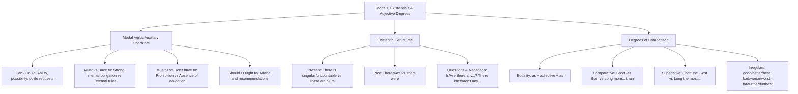

# TEMA 03: GRAMÁTICA INGLESA: VERBOS MODALES (CAN, MUST, SHOULD), ESTRUCTURAS EXISTENCIALES (THERE IS/ARE) Y GRADOS DEL ADJETIVO (COMPARATIVOS Y SUPERLATIVOS)

---

## 1. PORTADA Y METADATOS CURRICULARES

| Campo | Detalle |
| :--- | :--- |
| **Eje Temático** | Eje 07: Idioma Extranjero (Inglés) |
| **Materia** | Gramática y Sintaxis Inglesa (A2 - B1 CEFR) |
| **Nivel de Dificultad** | Preuniversitario Avanzado (UNSA / CEPRUNSA) |
| **Tiempo de Estudio Recomendado** | 4.5 horas |
| **Resolución Curricular** | R.C.U. N.° 0028-2026 (Admisión 2027) |
| **Prerrequisitos** | Tiempos Verbales Presente y Pasado (Temas 01 y 02) |
| **Objetivo Pedagógico** | Dominar el valor funcional de los verbos modales (*can/could* para habilidad y permiso, *must/have to* para obligación y prohibición *mustn't*, *should* para consejo); aplicar con precisión rigurosa las estructuras existenciales (*there is/are, there was/were*) con sustantivos contables e incontables; y estructurar adjetivos en grado comparativo y superlativo regular e irregular. |

---

## 2. MAPA CONCEPTUAL SINTÉTICO (MERMAID)



---

## 3. FUNDAMENTACIÓN TEÓRICA RIGUROSA

### 3.1. Modal Auxiliary Verbs (Verbos Modales)
Los verbos modales son operadores que modifican el significado del verbo principal para expresar nociones de habilidad, deber, prohibición, permiso o recomendación.
- **Reglas Sintácticas Universales de los Modales Puros:**
  1. Van seguidos invariablemente de un **Bare Infinitive** (verbo base sin *to*):
     $$\text{Subject} + \mathbf{Modal} + \mathbf{Base \ Verb} + \text{Complement}$$
  2. **No añaden '-s'** en la tercera persona singular (*He can, She must*, NUNCA *He cans*).
  3. No utilizan los auxiliares *do/does/did* para negar o preguntar (*Can you...?*, *You must not...*).

#### A. Can / Could
- **Habilidad o Capacidad:**
  - *Presente:* *She **can speak** three languages fluently.*
  - *Pasado:* *When I was five, I **could swim** very well.*
- **Permiso y Solicitudes:**
  - Informal: *Can I borrow your pencil?*
  - Formal / Cortés: *Could you explain this exercise again, professor?*

#### B. Must vs. Have To (Obligación)
- **Must:** Expresa una **obligación interna, personal o moral** que emana del propio emisor:
  *I **must study** harder if I want to pass the admission test.*
- **Have to:** Expresa una **obligación externa objetiva**, impuesta por leyes, reglamentos institucionales o autoridades:
  *Students **have to wear** an identification badge on campus.* (Reglamento universitario).
  *(Tercera persona: He **has to** submit the form).*

#### C. Mustn't vs. Don't Have To (La Gran Distinción de Examen)
- **Mustn't (Prohibición Absoluta):** Está terminantemente vedado; es ilegal o contra las reglas:
  *You **mustn't use** mobile phones during the entrance exam.* (Prohibición estricta).
- **Don't / Doesn't have to (Falta de Obligación / Opcionalidad):** No es necesario, pero si el sujeto lo desea, puede hacerlo:
  *Tomorrow is Sunday; we **don't have to get up** early.* (No hay obligación).

#### D. Should (Consejo o Sugerencia)
Se utiliza para dar o pedir consejos, recomendaciones médicas o juicios de conveniencia moral:
- *You have a severe cough; you **should see** a doctor.*
- *Applicants **should read** the instructions carefully before answering.*

---

### 3.2. Existential Structures: *There is / There are*
Expresan la existencia o presencia de entidades físicas o conceptuales en un lugar determinado (equivalente al español impersonal *«hay»*).

| Estructura Existencial | Tipo de Sustantivo Acompañante | Ejemplos Canónicos |
| :--- | :--- | :--- |
| **There is / There's** | Sustantivo **singular contable** o **incontable** | *There is a microscope on the desk.*<br>*There is some water in the flask.* |
| **There are** | Sustantivo **plural contable** | *There are thirty candidates in the auditorium.* |
| **There was** | Pasado de singular o incontable (*«hubo/había»*) | *There was a power outage yesterday evening.* |
| **There were** | Pasado de plural contable (*«hubo/habían»*) | *There were many difficult questions in the test.* |

- **Negación e Interrogación:**
  - *Is there any milk in the fridge? $\rightarrow$ No, there isn't any.*
  - *Are there any vacant seats in row four? $\rightarrow$ Yes, there are.*

---

### 3.3. Degrees of Adjectives: Comparatives and Superlatives

#### A. Comparativos de Igualdad e Inferioridad
- **Igualdad:** $\mathbf{as} + \text{Adjective (base)} + \mathbf{as}$
  *Arequipa is **as beautiful as** Cusco.*
- **Inferioridad:** $\mathbf{not \ as} + \text{Adjective} + \mathbf{as} \quad / \quad \mathbf{less} + \text{Adjective} + \mathbf{than}$
  *This tablet is **not as expensive as** that laptop.*

#### B. Morfología de Comparativos y Superlativos de Superioridad

$$\begin{array}{|l|l|l|l|}
\hline
\textbf{Tipo de Adjetivo} & \textbf{Forma Positiva} & \textbf{Grado Comparativo} & \textbf{Grado Superlativo} \\ \hline
\text{1 sílaba regular} & \text{tall, clean} & \text{taller than} & \text{the tallest} \\ \hline
\text{1 sílaba CVC (duplica)} & \text{big, hot} & \text{bigger than, hotter than} & \text{the biggest, the hottest} \\ \hline
\text{2 sílabas en '-y'} & \text{happy, easy} & \text{happier than, easier than} & \text{the happiest, the easiest} \\ \hline
\text{2 o más sílabas (largos)} & \text{difficult, modern} & \text{more difficult than} & \text{the most difficult} \\ \hline
\end{array}$$

#### C. Formas Irregulares Esenciales en Admisión
Los adjetivos irregulares cambian su raíz morfológica por completo:

$$\begin{array}{|l|l|l|}
\hline
\textbf{Forma Base} & \textbf{Comparativo (+ than)} & \textbf{Superlativo (the + ...)} \\ \hline
\text{good (bueno)} & \text{better} & \text{the best} \\ \hline
\text{bad (malo)} & \text{worse} & \text{the worst} \\ \hline
\text{far (lejos)} & \text{further / farther} & \text{the furthest / farthest} \\ \hline
\text{little (poco)} & \text{less} & \text{the least} \\ \hline
\text{many / much (mucho)} & \text{more} & \text{the most} \\ \hline
\end{array}$$

---

## 4. FÓRMULAS, TAXONOMÍAS Y LEYES FUNDAMENTALES

### 4.1. Ecuación de Doble Grado Prohibida
Está terminantemente prohibido utilizar el adverbio *more* junto con el sufijo *-er*, o *most* con *-est*:
$$\times \ \text{more taller than} \quad \implies \quad \checkmark \ \mathbf{taller \ than}$$
$$\times \ \text{the most easiest} \quad \implies \quad \checkmark \ \mathbf{the \ easiest}$$

### 4.2. Ecuación Prohibición vs. No Obligación

$$\mathbf{MUSTN'T} = \text{Prohibición Legal/Estricta} \ (0\% \ \text{permitido})$$
$$\mathbf{DON'T \ HAVE \ TO} = \text{Falta de Necesidad} \ (\text{Voluntario / Opcional})$$

---

## 5. CASOS PRÁCTICOS Y MODELIZACIONES DEL MUNDO REAL

### Caso 1: Seguridad en el Laboratorio de Ingeniería Química
En el manual de seguridad de la UNSA leemos:
> *"1. Students **must wear** safety goggles at all times inside the laboratory."*  
> *"2. You **mustn't ingest** any chemical substance or remove equipment without authorization."*  
> *"3. You **don't have to bring** your own microscope; the university provides them."*

- **Análisis Semántico-Pragmático:**
  - En la regla 1: *Must* expresa un mandato de seguridad perentorio obligatorio.
  - En la regla 2: *Mustn't* prohíbe taxativamente comer químicos o robar instrumental (peligro de muerte o expulsión).
  - En la regla 3: *Don't have to* indica ausencia de obligación: el estudiante no está forzado a gastar en un microscopio propio, pues el laboratorio los provee gratis.

---

## 6. PRE-UNIVERSITY HACKS Y MNEMOTÉCNIAS

### 1. El Hack de "Mustn't vs. Don't have to": "La Señal de Tránsito"
- **Mustn't:** Semáforo en rojo o señal de "Prohibido el paso" (¡Si lo haces, cometes delito o sanción grave!).
- **Don't have to:** Entrada libre o peaje gratuito (¡No tienes que pagar, pero puedes pasar si quieres!).

### 2. Mnemotécnia de Irregulares: "B-W-F"
$$\mathbf{B}\text{etter / Best (Good)} \quad | \quad \mathbf{W}\text{orse / Worst (Bad)} \quad | \quad \mathbf{F}\text{urther / Furthest (Far)}$$

---

## 7. ERRORES FRECUENTES Y TRAMPAS DE EXAMEN

1. **Colocar 'to' después de un modal puro:**
   - *Error:* $\times$ *She can to speak English.* / $\times$ *You must to go.*
   - *Norma:* Los modales puros rigen **bare infinitive** (sin *to*): $\checkmark$ *She can speak* / $\checkmark$ *You must go*. (Solo *have to* y *ought to* llevan *to* incorporado).
2. **Confundir *There is* con sustantivos incontables:**
   - *Error:* $\times$ *There are a lot of information.*
   - *Norma:* La palabra *information* en inglés es **incontable**; requiere el verbo en singular: $\checkmark$ *There **is** a lot of information*.
3. **Confundir *Worse* con *Worst*:**
   - *Worse* es comparativo para **dos** elementos (*This test is worse than the last one*).
   - *Worst* es superlativo absoluto precedido de *the* (*This is the worst test of the year*).

---

## 8. 5 PROBLEMAS RESUELTOS GRADUADOS

### Problema 1 (Nivel Básico: Modal of Advice)
Choose the correct modal verb to complete the dialogue:
*Doctor: "Your cholesterol levels are quite high. You _______ reduce your intake of saturated fats and exercise daily."*
*Patient: "Thank you, doctor. I will follow your advice."*
- A) can
- B) should
- C) couldn't
- D) shouldn't
- E) must to

**Resolución:**
El contexto describe a un médico brindando una recomendación o consejo de salud (*"I will follow your advice"*). El verbo modal por excelencia para aconsejar o sugerir un curso de acción beneficioso es **should** (+ bare infinitive *reduce*).
**Respuesta:** **B**

---

### Problema 2 (Nivel Intermedio: Mustn't vs. Don't Have To)
In a public museum, which sentence correctly expresses a strict prohibition?
- A) Visitors don't have to pay with cash; credit cards are accepted.
- B) Visitors must to take photos of all paintings.
- C) Visitors mustn't touch the historical sculptures on display.
- D) Visitors should to touch the fragile ceramic exhibits.
- E) Visitors haven't to leave before closing time.

**Resolución:**
- En A: *don't have to* expresa falta de obligación, no prohibición.
- En B y D: el uso de *must to* o *should to* es agramatical (los modales no llevan *to*).
- En E: *haven't to* es incorrecto (debe ser *don't have to*).
- En C: *mustn't touch* expresa con rigurosa exactitud normativa una **prohibición categórica** (*You are not allowed to touch*).
**Respuesta:** **C**

---

### Problema 3 (Nivel Intermedio-Avanzado: Existential Structure with Uncountable Noun)
Complete the scientific sentence correctly:
*"In the remote areas of the desert, _______ very little rainfall throughout the year, which makes agriculture nearly impossible."*
- A) there are
- B) there is
- C) are there
- D) is there
- E) there were

**Resolución:**
El sustantivo nuclear es *rainfall* (precipitación pluvial), el cual es un sustantivo **incontable** (acompañado por el cuantificador *very little*). Los sustantivos incontables concuerdan preceptivamente con la forma existencial singular en presente: **there is**.
**Respuesta:** **B**

---

### Problema 4 (Nivel Avanzado: Irregular Comparative and Superlative)
Select the sentence that is **GRAMMATICALLY ACCURATE**:
- A) Mount Everest is more higher than any other mountain on Earth.
- B) This year's economic crisis is far more worse than the previous one.
- C) Renewable solar energy is considered one of the most efficient alternatives today.
- D) That was the baddest performance the orchestra has ever delivered.
- E) Platinum is expensiver than silver and bronze.

**Resolución:**
- En A: *more higher* es un doble comparativo prohibido (*higher than*).
- En B: *more worse* es un error gravísimo (*worse* ya es comparativo; debe decirse *far worse*).
- En D: *baddest* no existe en inglés estándar; la forma irregular es *the worst*.
- En E: *expensive* es adjetivo largo de tres sílabas; su comparativo es *more expensive than*, nunca *expensiver*.
- En C: *the most efficient* es el superlativo regular intachable de un adjetivo largo (*efficient*).
**Respuesta:** **C**

---

### Problema 5 (Nivel 5: Reto Titán / Jefe Final de Admisión - UNSA / UNMSM)
Evaluate the following five sentences and identify the option that correctly states which ones are **FREE OF GRAMMATICAL ERRORS**:
1. *You don't have to show your passport on domestic flights within Peru; a national ID card is sufficient.*
2. *Last year, there was several international workshops held at the engineering faculty.*
3. *She is much better at solving advanced calculus integrals than her older brother.*
4. *Passengers must not to carry flammable liquids in their hand luggage.*
5. *The library is as quiet as a sanctuary during exam week.*

- A) Sentences 1, 3 and 5
- B) Sentences 1, 2 and 4
- C) Sentences 3, 4 and 5
- D) Sentences 2 and 5
- E) Sentences 1 and 4

**Resolución Paso a Paso:**
- **Oración 1 (CORRECTA):** *Don't have to* expresa correctamente ausencia de obligación (no es obligatorio llevar pasaporte en vuelos nacionales).
- **Oración 2 (INCORRECTA):** El sujeto es plural (*several international workshops*); por tanto, la forma existencial en pasado debió ser en plural: *there **were** several workshops*, no *was*.
- **Oración 3 (CORRECTA):** Utiliza el comparativo irregular de *good* $\rightarrow$ *better than*, intensificado legítimamente por el adverbio de grado *much* (*much better at solving...*).
- **Oración 4 (INCORRECTA):** El modal *must not* no puede ir seguido de *to* (*must not to carry* es un error fatal; debe ser *must not carry*).
- **Oración 5 (CORRECTA):** Estructura canónica impecable del comparativo de igualdad: *as quiet as* (adjetivo base entre *as... as*).
Por consiguiente, las oraciones estrictamente correctas son la **1, la 3 y la 5**.
**Respuesta:** **A**

---

## 9. GLOSARIO TÉCNICO ESPECIALIZADO

1. **Bare Infinitive:** Forma de infinitivo despojada de la preposición *to* que acompaña obligatoriamente a los verbos modales puros (*can, must, should*).
2. **Comparative Degree:** Grado del adjetivo utilizado para cotejar una cualidad entre dos entidades diferenciadas (*taller than, more useful than*).
3. **Don't have to:** Perífrasis modal que denota ausencia de obligación o necesidad (opcionalidad).
4. **Existential Structure:** Construcción gramatical encabezada por *there + be* que asevera la existencia objetiva de una entidad en un espacio o tiempo.
5. **Modal Verb:** Categoría de verbos auxiliares que expresan modalidad deóntica o epistémica (permiso, deber, capacidad, probabilidad).
6. **Mustn't:** Forma contracta de *must not* que codifica una prohibición categórica legal o moral.
7. **Superlative Degree:** Grado del adjetivo que denota el extremo superior o inferior de una cualidad en una entidad respecto a un conjunto de tres o más elementos (*the highest*).
8. **Uncountable Noun:** Sustantivo que designa materias continuas, conceptos abstractos o sustancias que no se pueden fraccionar en unidades discretas numéricas (*water, information, sugar*).
9. **Irregular Comparative:** Forma comparativa que altera la raíz léxica del adjetivo en lugar de añadir los morfemas *-er* o *more* (*better, worse, further*).
10. **As... As:** Estructura correlativa de comparación que establece paridad cuantitativa o cualitativa de igualdad entre dos términos.

---

## 10. FLASHCARDS DE REPASO ACTIVO

| Front (Pregunta / Disparador) | Back (Respuesta Nemotécnica / Precisa) |
| :--- | :--- |
| What is the fundamental difference between *Mustn't* and *Don't have to*? | ***Mustn't*** means **PROHIBITION** (it is forbidden / illegal). ***Don't have to*** means **NO OBLIGATION** (it is optional / not necessary). |
| Do modal verbs like *can, must, should* take *-s* in third person? | **NO**, modal verbs never take *-s* and never take *to* (*He can speak, NOT: He cans to speak*). |
| When do you use *There is* vs. *There are*? | Use ***There is*** for singular countable nouns and **uncountable nouns**; use ***There are*** for plural countable nouns. |
| What are the comparative and superlative of the adjective *Bad*? | Comparative: ***worse than***. Superlative: ***the worst***. |
| How do you form the comparative of a short one-syllable CVC adjective like *Hot*? | Double the final consonant and add *-er*: ***hotter than*** (Superlative: ***the hottest***). |

---

## 11. PREGUNTAS DE AUTOEVALUACIÓN RÁPIDA

1. *"You _______ smoke inside the petrol station. It is extremely dangerous!"*
   - A) don't have to
   - B) shouldn't to
   - C) mustn't
   - D) can to
   - *Respuesta correcta:* **C** (Prohibición estricta de seguridad vital).
2. *"Yesterday, _______ many applicants waiting outside the admission office."*
   - A) there was
   - B) there were
   - C) there is
   - D) there are
   - *Respuesta correcta:* **B** (Estructura existencial en pasado para sustantivo plural contable *applicants*).
3. The comparative form of the adjective *"far"* is:
   - A) farer
   - B) more far
   - C) further / farther
   - D) the furthest
   - *Respuesta correcta:* **C** (Forma comparativa irregular).

---

## 12. BLOQUE DE INTEGRACIÓN KMP / GAMIFICACIÓN (JSON)

```json
{
  "tema_id": "ING_GRA_03",
  "eje_tematico": "07_IDIOMA_EXTRANJERO",
  "curso": "INGLES_GRAMATICA",
  "titulo_tema": "Verbos Modales (Can, Must, Should), Estructuras Existenciales y Grados del Adjetivo",
  "dificultad": "Avanzado",
  "xp_recompensa": 260,
  "habilidades_evaluadas": [
    "Diferenciación estricta entre Mustn't (prohibición) y Don't have to (opcionalidad)",
    "Uso de There is / There was con sustantivos incontables",
    "Dominio de comparativos y superlativos irregulares (good, bad, far)",
    "Erradicación del doble grado (more taller) y del to tras modales"
  ],
  "boss_challenge": {
    "boss_name": "The Sphinx of Westminster Abbey",
    "vida_boss": 3600,
    "ataque_especial": "Double Comparative Curse & Modal Particle Illusion",
    "pregunta_reto": "Which sentence contains an irreparable grammatical violation?",
    "opciones": [
      "You don't have to attend the lecture if you feel sick.",
      "The Pacific Ocean is deeper than the Atlantic Ocean.",
      "Candidates must to submit their credentials before noon.",
      "There was very little evidence presented during the trial."
    ],
    "respuesta_correcta_index": 2,
    "explicacion_gamificada": "¡Impacto certero! 'Must to submit' es un error gramatical insalvable: los verbos modales puros nunca van seguidos de la partícula 'to', sino de bare infinitive ('must submit')."
  }
}
```
