# TEMA 04: GRAMÁTICA INGLESA: FUNCIONES COMUNICATIVAS (GUSTOS, PREFERENCIAS, SOLICITUDES) Y CONECTORES LÓGICOS DISCURSIVOS

---

## 1. PORTADA Y METADATOS CURRICULARES

| Campo | Detalle |
| :--- | :--- |
| **Eje Temático** | Eje 07: Idioma Extranjero (Inglés) |
| **Materia** | Gramática y Funciones Comunicativas (A2 - B1 CEFR) |
| **Nivel de Dificultad** | Preuniversitario Avanzado (UNSA / CEPRUNSA) |
| **Tiempo de Estudio Recomendado** | 4.0 horas |
| **Resolución Curricular** | R.C.U. N.° 0028-2026 (Admisión 2027) |
| **Prerrequisitos** | Tiempos de Presente, Pasado y Verbos Modales (Temas 01 al 03) |
| **Objetivo Pedagógico** | Expresar gustos y preferencias (*like, love, enjoy, prefer, hate + gerund / would like to + infinitive*); formular solicitudes, permisos e invitaciones formales e informales (*Could you, Would you mind, May I, How about*); ordenar procesos con secuencias temporales (*First, Then, Finally, before/after + -ing*); y articular párrafos con conectores lógicos de adición, contraste, causa, consecuencia y finalidad. |

---

## 2. MAPA CONCEPTUAL SINTÉTICO (MERMAID)

```mermaid
graph TD
    A[Communicative Functions & Connectors] --> B[Likes, Dislikes & Preferences]
    B --> B1[Verbs of feeling: like, love, enjoy, hate + Gerund -ING]
    B --> B2[Hypothetical preference: would like / would prefer + to-Infinitive]
    B --> B3[Prefer X to Y: Gerund to Gerund / Noun to Noun]

    A --> C[Social Formulae & Pragmatic Interactions]
    C --> C1[Polite Requests: Could you please...? Would you mind + -ING...?]
    C --> C2[Permissions: May I...? Can I...? Is it okay if...?]
    C --> C3[Suggestions & Invites: Why don't we...? How about + -ING...? Let's...]

    A --> D[Time Sequence & Process Markers]
    D --> D1[Chrono-markers: First, Secondly, Next, After that, Finally]
    D --> D2[Prepositional time clauses: Before + -ING, After + -ING, While...]

    A --> E[Logical Connectors Linking Words]
    E --> E1[Addition: and, furthermore, moreover, in addition]
    E --> E2[Contrast: but, however, although/even though, despite + noun]
    E --> E3[Cause & Effect: because vs because of, so, therefore, consequently]
    E --> E4[Purpose: to, in order to, so that + clause]
```



---

## 3. FUNDAMENTACIÓN TEÓRICA RIGUROSA

### 3.1. Expresión de Gustos, Preferencias y Aversiones

#### A. Verbos de Sentimiento General + Gerundio (*-ING*)
Cuando expresamos aficiones, hábitos placenteros o aversiones generales permanentes, verbos como *like, love, enjoy, fancy, don't mind, dislike, hate, can't stand* van seguidos preceptivamente de un **sustantivo** o de un **gerundio (-ING)**:
- *She **enjoys reading** scientific articles on biophysics.* (NUNCA: $\times$ *enjoys to read*).
- *They **hate waiting** in long queues under the sun.*
- *I **don't mind helping** you with your mathematics assignment.*

#### B. *Would like / Would prefer* + *To-Infinitive*
Cuando se expresa un **deseo puntual, específico o hipotético en el presente o futuro**, se utiliza la estructura modal condicional *would like / would love / would prefer*, la cual exige **To-Infinitive**:
$$\text{Subject} + \mathbf{would \ like \ / \ 'd \ like} + \mathbf{to \ + \ Base \ Verb} + \text{Complement}$$
- *I **like swimming**.* $\rightarrow$ Me gusta nadar como deporte o afición habitual.
- *I **would like to swim** this afternoon.* $\rightarrow$ Deseo nadar hoy puntualmente.

#### C. Estructura de Preferencia: *Prefer A to B*
Para comparar dos actividades o entidades preferidas:
$$\mathbf{prefer} + \text{Noun / Gerund A} + \mathbf{to} + \text{Noun / Gerund B}$$
- *She **prefers studying** in the library **to working** at home.* (NUNCA: $\times$ *than working*).

---

### 3.2. Solicitudes, Permisos, Sugerencias e Invitaciones

| Función Pragmática | Estructura Canónica | Grado de Cortesía | Ejemplo Ilustrativo |
| :--- | :--- | :--- | :--- |
| **Petición Cortés (Polite Request)** | $\mathbf{Could \ you \ (please)} + \text{Base Verb...?}$ | Formal | *Could you please lend me your calculator?* |
| **Petición con "Mind"** | $\mathbf{Would \ you \ mind} + \mathbf{Verb\text{-}ING...?}$ | Muy formal | *Would you mind **opening** the window?* (Respuesta afirmativa cortés: *No, not at all*). |
| **Petición Informal** | $\mathbf{Can \ you} + \text{Base Verb...?}$ | Coloquial / Amigos | *Can you pass the salt, please?* |
| **Permiso Formal** | $\mathbf{May \ I} + \text{Base Verb...?}$ | Muy formal e institucional | *May I ask a question, Professor?* |
| **Sugerencia / Invitación 1** | $\mathbf{Why \ don't \ we} + \text{Base Verb...?}$ | Neutro | *Why don't we study together for the test?* |
| **Sugerencia / Invitación 2** | $\mathbf{How \ about \ / \ What \ about} + \mathbf{Verb\text{-}ING...?}$ | Informal | *How about **having** lunch at the campus canteen?* |
| **Mandato Exhortativo** | $\mathbf{Let's} + \text{Base Verb}$ | Inclusivo | *Let's review the biology notes now.* |

---

### 3.3. Secuencias Temporales y Marcadores de Proceso
Para describir instrucciones de laboratorio, recetas, algoritmos o itinerarios cronológicos:
1. **Marcadores de Orden:**
   - *First / Firstly:* Introduce el punto de partida (*First, wash the test tubes*).
   - *Next / Then / After that:* Describen los pasos intermedios (*Next, add 5 ml of acid. Then, stir gently*).
   - *Finally / Lastly:* Concluye el proceso (*Finally, record the temperature*).
2. **Preposiciones de Tiempo con Gerundio:**
   Cuando las preposiciones *before* y *after* van seguidas de un verbo sin sujeto explícito, este adopta obligatoriamente la forma de **gerundio (-ING)**:
   - $\mathbf{Before} + \mathbf{Verb\text{-}ING}$: *Turn off the computer **before leaving** the room.*
   - $\mathbf{After} + \mathbf{Verb\text{-}ING}$: ***After finishing** the exam, submit your test sheet.*

---

### 3.4. Conectores Lógicos de Cohesión (Linking Words)

```
┌─────────────────────────────────────────────────────────────────┐
│                    LOGICAL LINKING CONNECTORS                   │
└────────────────────────────────┬────────────────────────────────┘
        ┌────────────────────────┼────────────────────────┐
        ▼                        ▼                        ▼
 ┌─────────────┐          ┌─────────────┐          ┌─────────────┐
 │  Contrast   │          │Cause & Eff. │          │   Purpose   │
 └──────┬──────┘          └──────┬──────┘          └──────┬──────┘
        ├─ But (coordinante)     ├─ Because (oración)     ├─ To + verb
        ├─ However (; however,)  ├─ Because of (+ sust)   ├─ In order to
        ├─ Although (+ oración)  ├─ So (consecuencia)     └─ So that (+ orac)
        └─ Despite (+ sustantivo)└─ Therefore / As a result
```

#### A. Conectores de Contraste: *Although* vs. *Despite / In spite of*
- **Although / Even though + Cláusula (Sujeto + Verbo):**
  *He passed the entrance examination **although he was** very nervous.*
- **Despite / In spite of + Sintagma Nominal o Gerundio (-ING):**
  *He passed the entrance examination **despite his nervousness**.*
  *He passed the entrance examination **in spite of being** very nervous.* (NUNCA: $\times$ *despite of*).

#### B. Conectores de Causa: *Because* vs. *Because of*
- **Because + Cláusula completa ($S + V$):**
  *The university cancelled classes **because the heavy rain flooded** the campus.*
- **Because of + Sintagma Nominal ($Noun \ Phrase$):**
  *The university cancelled classes **because of the heavy rain**.*

#### C. Conectores de Consecuencia: *So* vs. *Therefore*
- **So (Coordinante informal):** *She studied day and night, **so** she obtained the highest score.*
- **Therefore / Consequently (Formal con punto y coma):** *She studied day and night**; therefore,** she obtained the highest score.*

#### D. Conectores de Finalidad (Purpose)
- $\mathbf{To \ / \ In \ order \ to} + \mathbf{Base \ Verb}$: *He woke up early **in order to arrive** on time.*
- $\mathbf{So \ that} + \mathbf{Subject} + \mathbf{can \ / \ could \ / \ will} + \mathbf{Verb}$: *He woke up early **so that he could catch** the bus.*

---

## 4. FÓRMULAS, TAXONOMÍAS Y LEYES FUNDAMENTALES

### 4.1. Ecuaciones Sintácticas de Selección Conectiva

$$\begin{array}{|l|l|}
\hline
\textbf{Estructura Gramatical Conectiva} & \textbf{Patrón Sintáctico Exigido} \\ \hline
\text{Although / Even though} & \mathbf{+ \ \text{Subject} + \text{Verb}} \ (\text{Cláusula completa}) \\ \hline
\text{Despite / In spite of} & \mathbf{+ \ \text{Noun Phrase \ / \ Verb-ING}} \ (\text{Sin verbo conjugado}) \\ \hline
\text{Because} & \mathbf{+ \ \text{Subject} + \text{Verb}} \\ \hline
\text{Because of / Due to} & \mathbf{+ \ \text{Noun Phrase \ / \ Pronoun}} \\ \hline
\text{In order to / So as to} & \mathbf{+ \ \text{Base Verb}} \\ \hline
\text{So that} & \mathbf{+ \ \text{Subject} + \text{Modal (can/could)} + \text{Verb}} \\ \hline
\end{array}$$

---

## 5. CASOS PRÁCTICOS Y MODELIZACIONES DEL MUNDO REAL

### Caso 1: Redacción de Ensayos Académicos Universitarios
En un párrafo expositivo sobre cambio climático:
> *"Global temperatures continue to rise rapidly; **furthermore**, sea levels are threatening coastal cities. **Although** governments have signed international climate treaties, carbon emissions remain alarmingly high. **Because of** severe industrial pollution, urgent policies are required **so that** future generations can survive."*

- **Análisis de Cohesión:**
  - *Furthermore:* Conector de adición formal que suma un segundo impacto ecológico.
  - *Although:* Introduce una cláusula subordinada concesiva ($S+V$: *governments have signed*).
  - *Because of:* Introduce la causa mediante un sintagma nominal (*severe industrial pollution*).
  - *So that:* Conecta con la finalidad del propósito introduciendo un sujeto y modal (*future generations can survive*).

---

## 6. PRE-UNIVERSITY HACKS Y MNEMOTÉCNIAS

### 1. El Hack de "Would you mind": Siempre pide -ING
$$\mathbf{Would \ you \ mind} + \mathbf{VERB\text{-}ING} \quad (\text{NO:} \ \times \text{Would you mind open the door?})$$
- *Correcto:* $\checkmark$ *Would you mind **opening** the door?*
- *Dato clave:* Si respondes cortésmente que NO te molesta abrir la puerta, debes decir: **"No, not at all"** o **"Of course not"**. (Decir "Yes" significa que SÍ te molesta).

### 2. Mnemotécnia de Contraste: "A-C" vs. "D-S"
- **A**lthough $\longrightarrow$ **C**láusula ($Sujeto + Verbo$).
- **D**espite $\longrightarrow$ **S**ustantivo / **S**intagma nominal.

---

## 7. ERRORES FRECUENTES Y TRAMPAS DE EXAMEN

1. **La Trampa de "Despite of":**
   - *Error común:* Escribir $\times$ *despite of the rain*.
   - *Regla inviolable:* O se usa **despite** solo, o se usa **in spite of**:
     - $\checkmark$ *despite the rain*
     - $\checkmark$ *in spite of the rain*
     - $\times$ *despite of the rain* (¡Inexistente en inglés culto!).
2. **Confundir "Enjoy to do" con "Enjoy doing":**
   - El verbo *enjoy* exige **gerundio (-ING)** en el 100% de los casos: $\checkmark$ *I enjoy studying*, NUNCA $\times$ *I enjoy to study*.
3. **Usar "prefer than" en lugar de "prefer to":**
   - *Error:* $\times$ *I prefer tea than coffee.*
   - *Correcto:* $\checkmark$ *I prefer tea **to** coffee.*

---

## 8. 5 PROBLEMAS RESUELTOS GRADUADOS

### Problema 1 (Nivel Básico: Likes and Gerunds)
Complete the sentence correctly:
*"My father is an architect and he really enjoys _______ sustainable urban buildings."*
- A) design
- B) to design
- C) designing
- D) designed
- E) designs

**Resolución:**
El verbo *enjoy* (disfrutar) pertenece a la clase de verbos de sentimiento que rigen obligatoriamente un complemento en forma de **gerundio (-ING)**. Por lo tanto, la forma requerida es *designing*.
**Respuesta:** **C**

---

### Problema 2 (Nivel Intermedio: Polite Request with "Mind")
Choose the grammatically correct option to fill in the blank:
*"Excuse me, Professor Edwards, would you mind _______ that complex calculus theorem one more time?"*
- A) explain
- B) to explain
- C) explaining
- D) explained
- E) for explaining

**Resolución:**
La fórmula de cortesía epistémica *Would you mind...?* exige preceptivamente que el verbo que le sigue adopte la terminación de gerundio **-ING**: *Would you mind explaining...?*.
**Respuesta:** **C**

---

### Problema 3 (Nivel Intermedio-Avanzado: Contrast Connectors - Although vs. Despite)
Select the option that correctly completes the sentence:
*"_______ the severe storm warnings issued by the meteorology center, the mountaineers decided to continue their expedition to Chachani."*
- A) Although
- B) In spite
- C) Even though
- D) Despite
- E) Because

**Resolución:**
El elemento que sigue al conector es un sintagma nominal sin verbo conjugado: *"the severe storm warnings issued by the meteorology center"*.
- *Although* y *Even though* requieren una cláusula con sujeto y verbo conjugado ($S+V$).
- *In spite* carece de la preposición obligatoria *of*.
- *Because* denota causa, lo cual contradice el sentido adversativo de la oración.
- **Despite** va seguido de un sintagma nominal para expresar concesión o contraste.
**Respuesta:** **D**

---

### Problema 4 (Nivel Avanzado: Purpose Connector - In Order To vs. So That)
Which of the following sentences correctly expresses **PURPOSE**?
- A) She registered early in order that she avoid long lines.
- B) She registered early so that to avoid long lines.
- C) She registered early in order to avoid long lines.
- D) She registered early because of avoiding long lines.
- E) She registered early so as avoiding long lines.

**Resolución:**
- En A: *in order that* exige un modal (*in order that she might avoid*).
- En B: *so that to* es una mezcla agramatical.
- En D: *because of* indica causa, no finalidad.
- En E: *so as* exige infinitivo con *to* (*so as to avoid*), no gerundio.
- En C: **in order to** seguido de la forma base del verbo (*avoid*) es la estructura canónica y formal de finalidad.
**Respuesta:** **C**

---

### Problema 5 (Nivel 5: Reto Titán / Jefe Final de Admisión - UNSA / UNMSM)
Analyze the following paragraph and determine the exact sequence of connectors that correctly fills blanks (1), (2), and (3):
> *"Carlos arrived thirty minutes late to the university laboratory __(1)__ the massive traffic congestion on the main bridge. __(2)__ he had missed the introductory explanation, he managed to conduct the chemical experiment successfully __(3)__ he had thoroughly studied the laboratory manual the night before."*

- A) (1) because - (2) Despite - (3) so
- B) (1) because of - (2) Although - (3) because
- C) (1) due to - (2) In spite of - (3) therefore
- D) (1) because of - (2) Even though - (3) so that
- E) (1) owing to - (2) However - (3) since

**Resolución Paso a Paso:**
1. **Espacio (1):** Va seguido del sintagma nominal *"the massive traffic congestion on the main bridge"* (sin verbo conjugado). Requiere un conector preposicional de causa: **because of** (o *due to*).
2. **Espacio (2):** Va seguido de una cláusula completa con sujeto y verbo (*he had missed the introductory explanation*), expresando contraste u obstáculo superado. Requiere una conjunción subordinante concesiva: **Although** (o *Even though*).
3. **Espacio (3):** Introduce la razón o causa explicativa con cláusula completa ($S+V$: *he had thoroughly studied the manual*): requiere **because** (o *since*).
La terna armónica que cumple todas las restricciones sintácticas es: **because of - Although - because** (Alternativa B).
**Respuesta:** **B**

---

## 9. GLOSARIO TÉCNICO ESPECIALIZADO

1. **Adversative Connector:** Conector discursivo que introduce una oposición, restricción o contraste entre dos ideas (*however, although, but*).
2. **Causal Connector:** Conector que explicita el motivo, fundamento o causa biológica/lógica de un hecho (*because, because of, since*).
3. **Cláusula Subordinada:** Estructura oracional con sujeto y verbo conjugado que depende sintácticamente de una proposición principal.
4. **Gerund Complement:** Verbo no flexivo con sufijo *-ing* que actúa como objeto directo requerido tras ciertos verbos de afección (*enjoy, avoid, mind*).
5. **In Order To:** Locución conjuntiva de finalidad equivalente a «para» o «con el propósito de», seguida obligatoriamente de verbo base.
6. **Linking Word (Conector):** Elemento léxico que establece nexos lógicos, semánticos y cohesivos entre oraciones y párrafos.
7. **Noun Phrase (Sintagma Nominal):** Grupo de palabras articuladas en torno a un sustantivo o pronombre que carece de verbo en forma personal.
8. **Polite Request:** Acto de habla mediante el cual se solicita una acción a un interlocutor empleando fórmulas de cortesía mitigadoras (*Could you, Would you mind*).
9. **Purpose Connector:** Conector que señala el objetivo, meta o intención perseguida por una acción previa (*so that, in order to*).
10. **Would you mind:** Estructura de alta formalidad que sondea si una acción genera molestia o incomodidad en el receptor, regida siempre por gerundio.

---

## 10. FLASHCARDS DE REPASO ACTIVO

| Front (Pregunta / Disparador) | Back (Respuesta Nemotécnica / Precisa) |
| :--- | :--- |
| What form of the verb follows *"enjoy"*, *"hate"*, and *"don't mind"*? | The **Gerund (-ING form)**: *She enjoys studying; I don't mind helping*. |
| What is the syntactic difference between *Although* and *Despite*? | ***Although*** is followed by a **Clause (Subject + Verb)**; ***Despite*** is followed by a **Noun Phrase or Gerund** (*Despite the rain*). |
| What verb form MUST follow *"Would you mind...?"*? | The **Gerund (-ING)**: *Would you mind **closing** the door?*. |
| Why is *"despite of the difficulty"* a fatal grammar error? | Because *despite* **never takes 'of'**. Use either ***despite the difficulty*** or ***in spite of the difficulty***. |
| What is the difference between *Because* and *Because of*? | ***Because*** + **Subject + Verb** (*because it was raining*); ***Because of*** + **Noun Phrase** (*because of the rain*). |

---

## 11. PREGUNTAS DE AUTOEVALUACIÓN RÁPIDA

1. *"Would you like _______ to the cinema with us tonight?"*
   - A) go
   - B) going
   - C) to go
   - D) for going
   - *Respuesta correcta:* **C** (*Would like* exige *to-infinitive*: *to go*).
2. *"I prefer drinking green tea _______ drinking black coffee."*
   - A) than
   - B) to
   - C) from
   - D) over than
   - *Respuesta correcta:* **B** (La estructura fija de preferencia es *prefer X to Y*).
3. *"They installed solar panels on the roof _______ reduce their electricity bill."*
   - A) in order to
   - B) so that
   - C) because of
   - D) despite
   - *Respuesta correcta:* **A** (Finalidad seguida de verbo base *reduce*).

---

## 12. BLOQUE DE INTEGRACIÓN KMP / GAMIFICACIÓN (JSON)

```json
{
  "tema_id": "ING_GRA_04",
  "eje_tematico": "07_IDIOMA_EXTRANJERO",
  "curso": "INGLES_GRAMATICA",
  "titulo_tema": "Funciones Comunicativas (Gustos, Preferencias, Solicitudes) y Conectores Lógicos",
  "dificultad": "Avanzado",
  "xp_recompensa": 240,
  "habilidades_evaluadas": [
    "Uso de gerundios tras verbos de preferencia (enjoy, like, mind)",
    "Diferenciación estructural entre Although y Despite",
    "Uso de conectores de causa (because vs because of)",
    "Manejo de conectores de propósito (in order to vs so that)"
  ],
  "boss_challenge": {
    "boss_name": "The Discourse Master of Edinburgh",
    "vida_boss": 3300,
    "ataque_especial": "Despite-Of Fallacy & Purpose Inversion",
    "pregunta_reto": "Which of the following sentences is written with 100% grammatical correctness?",
    "opciones": [
      "In spite of he was exhausted, he completed the marathon.",
      "She enjoys to paint portraits in her leisure time.",
      "Despite the intense heat, the workers finished the roof repair on schedule.",
      "He left early so that catch the train."
    ],
    "respuesta_correcta_index": 2,
    "explicacion_gamificada": "¡Flawless strike! 'Despite the intense heat...' une perfectamente el conector concesivo despite con un sintagma nominal. En las otras: 'in spite of' lleva cláusula indebida, 'enjoy' exige gerundio, y 'so that' exige sujeto + modal."
  }
}
```
