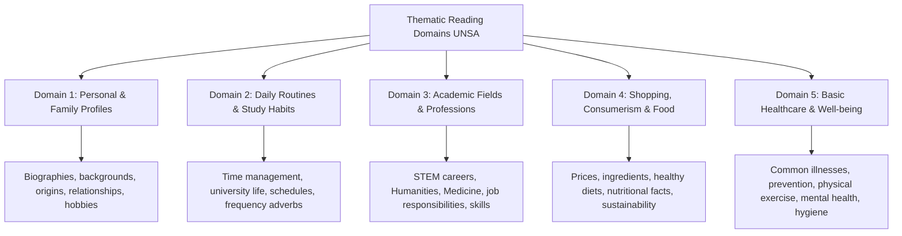

# TEMA 02: LECTURA TEMÁTICA: INFORMACIÓN PERSONAL, RUTINAS DIARIAS, ESTUDIOS UNIVERSITARIOS, COMPRAS, NUTRICIÓN Y SALUD

---

## 1. PORTADA Y METADATOS CURRICULARES

| Campo | Detalle |
| :--- | :--- |
| **Eje Temático** | Eje 07: Idioma Extranjero (Inglés) |
| **Materia** | Lectura y Comprensión Temática (A2 - B1 CEFR) |
| **Nivel de Dificultad** | Preuniversitario Avanzado (UNSA / CEPRUNSA) |
| **Tiempo de Estudio Recomendado** | 4.0 horas |
| **Resolución Curricular** | R.C.U. N.° 0028-2026 (Admisión 2027) |
| **Prerrequisitos** | Estrategias de Lectura: Skimming & Scanning (Tema 01) |
| **Objetivo Pedagógico** | Interpretar textos informativos, descriptivos y expositivos breves centrados en los 5 ejes temáticos obligatorios del prospecto de admisión UNSA: datos personales y perfiles familiares, rutinas de vida y hábitos de estudio, carreras y profesiones universitarias, compras y alimentos balanceados, y prevención en salud básica y bienestar físico. |

---

## 2. MAPA CONCEPTUAL SINTÉTICO (MERMAID)



---

## 3. FUNDAMENTACIÓN TEÓRICA RIGUROSA

### 3.1. Ejes Temáticos del Prospecto UNSA y su Vocabulario Clave

#### Eje 1: Personal & Family Information (Perfiles Personales y Familiares)
- **Campos Léxicos:** *Origin, nationality, marital status, siblings, relatives, upbringing, personal background, leisure activities, personality traits (reliable, ambitious, easy-going, conscientious).*
- **Estructuras Textuales Típicas:** Textos autobiográficos breves, perfiles de postulantes a becas internacionales, entrevistas de presentación.

#### Eje 2: Daily Routines and Academic Life (Rutinas y Vida Universitaria)
- **Campos Léxicos:** *Schedule, commute, attend lectures, submit assignments, revise notes, cram for exams, library resources, campus facilities, extracurricular activities.*
- **Phrasal Verbs Clave:**
  - *Wake up / Get up:* Despertar / Levantarse de la cama.
  - *Head to:* Dirigirse hacia (*He heads to campus at 7:00 AM*).
  - *Catch up on:* Ponerse al día con los estudios (*catching up on readings*).
  - *Drop out:* Abandonar los estudios (*drop out of university*).
  - *Hand in / Turn in:* Entregar trabajos académicos (*hand in the lab report*).

#### Eje 3: Studies, University Careers and Occupations (Carreras y Profesiones)
- **Campos Léxicos:** *Undergraduate degree, syllabus, major, internship, tuition fees, faculty, career prospects, vocational training, engineering, biomedical sciences, law.*
- **Collocations Académicas:**
  - *Pursue a degree:* Cursar una carrera universitaria.
  - *Conduct research:* Realizar investigaciones científicas.
  - *Gain hands-on experience:* Adquirir experiencia práctica real.
  - *Meet requirements:* Cumplir con los requisitos exigidos.

#### Eje 4: Shopping, Food and Nutrition (Compras, Alimentos y Nutrición)
- **Campos Léxicos:** *Budget, discount, receipt, afford, wholesome food, organic produce, nutrients, carbohydrates, proteins, balanced diet, processed food, eating habits.*
- **Términos de Consumo:** *Bargain (ganga/oferta), Refund (reembolso), Cash/Credit card, Expiry date (fecha de vencimiento).*

#### Eje 5: Basic Health and Healthy Lifestyles (Salud Básica y Bienestar)
- **Campos Léxicos:** *Symptoms (fever, headache, fatigue, sore throat), diagnosis, prescription, over-the-counter medicine, immune system, mental well-being, sedentary lifestyle, physical fitness.*
- **Expresiones Médicas Cotidianas:**
  - *Come down with:* Contraer una enfermedad leve (*come down with the flu*).
  - *Work out:* Hacer ejercicio físico en el gimnasio.
  - *Cut down on:* Reducir el consumo de algo (*cut down on sugar and fats*).
  - *Recover from:* Recuperarse de una afección.

---

## 4. FÓRMULAS, TAXONOMÍAS Y LEYES FUNDAMENTALES

### 4.1. Cuadro de Conectores Discursivos en Textos Temáticos

$$\begin{array}{|l|l|l|}
\hline
\textbf{Función Textual} & \textbf{Conectores en Inglés} & \textbf{Significado y Uso} \\ \hline
\text{Adición} & \textit{Furthermore, In addition, Moreover, Besides} & \text{Agregar un argumento o dato suplementario} \\ \hline
\text{Contraste} & \textit{However, Nevertheless, On the other hand, Whereas} & \text{Introducir una objeción o contraposición} \\ \hline
\text{Causa y Razón} & \textit{Due to, Because of, Owing to, Since, As} & \text{Explicar el origen o motivo de un fenómeno} \\ \hline
\text{Consecuencia} & \textit{Therefore, Consequently, As a result, Thus} & \text{Señalar el efecto lógico o desenlace} \\ \hline
\end{array}$$

---

## 5. CASOS PRÁCTICOS Y MODELIZACIONES DEL MUNDO REAL

### Caso 1: Lectura Comprensiva de Salud Pública Universitaria
> **TEXT:**
> *A recent survey conducted at San Agustín National University revealed that more than 65% of first-year engineering students experience high levels of sleep deprivation. Due to demanding course loads and extensive laboratory reports, many undergraduates sleep fewer than five hours per night. Nutritionists at the University Health Center warn that chronic lack of rest, combined with the excessive intake of energy drinks and instant noodles, severely impairs cognitive performance, memory consolidation, and immune defense. The health board recommends that students establish regular sleep schedules, engage in at least 30 minutes of aerobic exercise daily, and substitute sugary snacks with fresh fruit and nuts to enhance academic productivity.*

- **Eje Temático:** Salud y Vida Académica Universitaria.
- **Análisis de Comprensión:**
  - *What is the root cause of students' sleep deprivation?* $\rightarrow$ The demanding academic workload and laboratory assignments.
  - *What are the physiological consequences mentioned?* $\rightarrow$ Impaired memory, lower cognitive performance, and weakened immunity.
  - *What is the medical recommendation?* $\rightarrow$ Regular sleep schedules, daily aerobic exercise, and a wholesome diet.

---

## 6. PRE-UNIVERSITY HACKS Y MNEMOTÉCNIAS

### 1. El Hack de los Prefijos Negativos en Inglés
Muchas preguntas de vocabulario se resuelven deduciendo el significado a través de sus prefijos morfológicos:
- **un- / in- / im- / il- / ir- = Negación o privación:**
  - *Healthy* $\rightarrow$ *Unhealthy* (no saludable).
  - *Sufficient* $\rightarrow$ *Insufficient* (insuficiente).
  - *Balanced* $\rightarrow$ *Imbalanced* (desequilibrado).
  - *Literate* $\rightarrow$ *Illiterate* (analfabeto).
  - *Regular* $\rightarrow$ *Irregular* (anormal).

### 2. Mnemotécnia de Phrasal Verbs de Salud: "C-W-C"
- **C**ome down with $\longrightarrow$ Caer enfermo / contraer un resfriado.
- **W**ork out $\longrightarrow$ Entrenar / hacer ejercicio.
- **C**ut down on $\longrightarrow$ Cortar / reducir el consumo (e.g., sal, azúcar).

---

## 7. ERRORES FRECUENTES Y TRAMPAS DE EXAMEN

1. **Confundir "Diet" con "Régimen para adelgazar":**
   - En inglés, *diet* se refiere primariamente al **conjunto habitual de alimentos que consume un ser vivo** (*a Mediterranean diet*, *a healthy diet*), no exclusivamente a un régimen restrictivo para bajar de peso.
2. **Confundir "Career" con "University Degree":**
   - *Career:* Trayectoria profesional a lo largo de la vida laboral (*He had a successful career in banking*).
   - *Degree / Major:* La carrera universitaria académica que se estudia (*She is studying for an Engineering degree*).
3. **Mala interpretación de "Prevent" frente a "Avoid":**
   - *To prevent:* Prevenir o evitar que un mal o enfermedad suceda (*prevent disease*).
   - *To avoid:* Esquivar o eludir una situación (*avoid junk food*).

---

## 8. 5 PROBLEMAS RESUELTOS GRADUADOS

### Read the passage carefully and answer Questions 1 to 5:

> **TEXT:**
> **THE RISE OF PLANT-BASED NUTRITION AMONG YOUNG PROFESSIONALS**
> In recent years, dietary choices have undergone a profound transformation, particularly among university students and young graduates. Plant-based diets—which emphasize vegetables, legumes, whole grains, nuts, and seeds while minimizing or completely eliminating animal products—are no longer considered a fringe trend; they have entered mainstream lifestyle culture.
> 
> According to clinical research published by international health organizations, adopting a well-planned vegetarian or vegan diet offers numerous physiological benefits. It is associated with a significantly reduced risk of cardiovascular disease, lower blood pressure, and better management of type 2 diabetes. Furthermore, plant foods are naturally rich in dietary fiber and essential antioxidants, which help reduce cellular inflammation and promote gut health.
> 
> However, medical professionals emphasize that eliminating animal protein requires careful nutritional planning. Without proper supplementation or balanced food pairing, individuals may develop deficiencies in micronutrients such as vitamin B12, iron, zinc, and omega-3 fatty acids. Vitamin B12, which is essential for red blood cell formation and neurological function, is virtually absent in unfortified plant foods. Consequently, doctors strongly advise that young adults transitioning to plant-based eating consult a certified nutritionist to ensure they obtain all essential nutrients while maintaining an active lifestyle.

---

### Problema 1 (Nivel Básico: Main Idea)
What is the primary topic of the passage?
- A) The economic cost of organic agriculture in developing nations.
- B) The growing popularity of plant-based diets, their health benefits, and the need for nutritional balance.
- C) How to treat severe cases of type 2 diabetes through surgical interventions.
- D) The daily laboratory routine of medical students in university hospitals.
- E) The history of animal domestication in ancient civilizations.

**Resolución:**
El texto aborda cómo las dietas basadas en plantas se han popularizado entre jóvenes, enumera sus beneficios clínicos comprobados (menor riesgo cardiovascular, fibra, antioxidantes) y advierte sobre los cuidados necesarios para evitar deficiencias (vitamina B12). La opción que sintetiza cabalmente todo el texto es la **B**.
**Respuesta:** **B**

---

### Problema 2 (Nivel Intermedio: Detailed Scanning)
According to paragraph 2, which of the following is a proven benefit of plant-based diets?
- A) Permanent immunity against viral infections.
- B) A lower likelihood of suffering from cardiovascular diseases and high blood pressure.
- C) Instant weight loss without any physical exercise.
- D) Higher levels of animal protein in the bloodstream.
- E) Total eradication of genetic disorders.

**Resolución:**
Localizando en el párrafo 2: *"It is associated with a significantly reduced risk of cardiovascular disease, lower blood pressure, and better management of type 2 diabetes"*. Esto coincide textualmente con la opción B.
**Respuesta:** **B**

---

### Problema 3 (Nivel Intermedio-Avanzado: Vocabulary in Context)
In paragraph 1, the word **"fringe"** in the phrase *"are no longer considered a fringe trend; they have entered mainstream lifestyle culture"* is closest in meaning to:
- A) Marginal or non-traditional
- B) Very expensive
- C) Ancient and forgotten
- D) Mandatory for all citizens
- E) Strictly scientific

**Resolución:**
El autor contrasta *fringe trend* con *mainstream culture* (cultura mayoritaria y aceptada). *Fringe* alude a algo secundario, periférico, marginal o que solo sigue un grupo muy reducido de personas. La palabra equivalente es *Marginal or non-traditional*.
**Respuesta:** **A**

---

### Problema 4 (Nivel Avanzado: In-depth Academic Inference)
Based on paragraph 3, what can be inferred about vitamin B12?
- A) It is produced in large quantities by green leafy vegetables like spinach.
- B) Strict vegans must consume fortified foods or dietary supplements to avoid deficiency.
- C) It is completely unnecessary for neurological health and cognitive performance.
- D) It can be easily synthesized by human cells exposed to sunlight.
- E) It is exclusively required by elderly patients suffering from diabetes.

**Resolución:**
El párrafo 3 afirma: *"Vitamin B12... is virtually absent in unfortified plant foods. Consequently, doctors strongly advise... proper supplementation"*. Si los alimentos vegetales no la contienen de forma natural, una persona con dieta estrictamente vegetal debe necesariamente recurrir a alimentos fortificados o suplementos para no enfermar.
**Respuesta:** **B**

---

### Problema 5 (Nivel 5: Reto Titán / Jefe Final de Admisión - UNSA / UNMSM)
Evaluate the following statements based on the entire reading passage:
I. Plant-based diets completely prohibit the consumption of seeds, nuts, and whole grains.
II. Antioxidants and dietary fiber present in plant foods contribute to reducing cellular inflammation.
III. Transitioning to a vegan diet guarantees perfect health without any need for medical or nutritional guidance.
IV. Iron, zinc, and vitamin B12 are micronutrients that require monitoring to avoid nutritional deficiencies in plant-based eaters.

Which statements are **ACCURATE AND TRUE** according to the text?
- A) I and III
- B) II and IV
- C) I, II and IV
- D) II, III and IV
- E) Only II

**Resolución Paso a Paso:**
- **I (Falsa):** El texto dice exactamente lo opuesto: *"emphasize vegetables, legumes, whole grains, nuts, and seeds"*.
- **II (Verdadera):** Párrafo 2: *"rich in dietary fiber and essential antioxidants, which help reduce cellular inflammation"*.
- **III (Falsa):** El texto advierte que sin planificación puede haber carencias graves y aconseja consultar a un nutricionista certificado.
- **IV (Verdadera):** Párrafo 3: *"individuals may develop deficiencies in micronutrients such as vitamin B12, iron, zinc, and omega-3"*.
Las proposiciones rigurosamente ciertas son **II y IV**.
**Respuesta:** **B**

---

## 9. GLOSARIO TÉCNICO ESPECIALIZADO

1. **Balanced Diet:** Régimen alimenticio que suministra los nutrientes esenciales en las proporciones biológicas adecuadas para el organismo.
2. **Cardiovascular Disease:** Término que engloba a los trastornos que afectan al corazón y los vasos sanguíneos (hipertensión, infarto, arritmias).
3. **Chronic:** Padecimiento o afección de salud de larga duración y desarrollo progresivo continuado.
4. **Deficiency:** Estado patológico provocado por la carencia o insuficiencia de un nutriente, vitamina o mineral indispensable en la dieta.
5. **Dietary Fiber:** Componente vegetal no digerible que favorece el tránsito intestinal y la regulación de la glucosa en sangre.
6. **Fortified Foods:** Alimentos procesados a los que se les han añadido vitaminas o minerales que no poseen naturalmente (e.g., leche vegetal enriquecida con B12).
7. **Inflammation:** Respuesta biológica del sistema inmunitario a estímulos nocivos, infecciones o daño celular.
8. **Legumes:** Legumbres (lentejas, garbanzos, frijoles) caracterizadas por su alto contenido de proteínas vegetales y carbohidratos complejos.
9. **Sedentary Lifestyle:** Estilo de vida inactivo caracterizado por la falta casi total de actividad física regular.
10. **Supplementation:** Administración de nutrientes concentrados en cápsulas o gotas para compensar vacíos dietéticos.

---

## 10. FLASHCARDS DE REPASO ACTIVO

| Front (Pregunta / Disparador) | Back (Respuesta Nemotécnica / Precisa) |
| :--- | :--- |
| What does the phrasal verb *"cut down on"* mean? | It means to **reduce the quantity or consumption** of something (*e.g., cut down on sugar*). |
| What is the difference between *"career"* and *"degree"* in English? | A **degree** is the university qualification/major you study; a **career** is your entire professional working life. |
| Why is vitamin B12 critical in plant-based diets? | Because it is **essential for red blood cells and nerve function**, but naturally absent in unfortified plant foods. |
| What does the prefix *"un-"* do to words like *"healthy"* or *"planned"*? | It adds a **negative or opposite meaning** (*unhealthy = not healthy; unplanned = without planning*). |
| What does the transition word *"Consequently"* indicate? | It indicates a **logical result, consequence, or effect** (*therefore, as a result*). |

---

## 11. PREGUNTAS DE AUTOEVALUACIÓN RÁPIDA

1. If a doctor tells a patient to *"work out three times a week"*, the doctor is recommending:
   - A) To study longer hours in the library
   - B) To engage in physical exercise
   - C) To take extra sleeping pills
   - D) To stop eating vegetables
   - *Respuesta correcta:* **B** (*Work out* = ejercitarse físicamente).
2. The word *"afford"* in *"Students cannot afford expensive meals"* means:
   - A) To have enough money to pay for something
   - B) To cook fresh ingredients
   - C) To dislike certain tastes
   - D) To forget where a restaurant is
   - *Respuesta correcta:* **A** (Tener capacidad económica para costear algo).
3. Which of the following is considered an undergraduate degree?
   - A) A primary school diploma
   - B) A Bachelor's degree in Civil Engineering
   - C) A certificate of attendance at a workshop
   - D) A receipt for university tuition fees
   - *Respuesta correcta:* **B** (Título universitario de pregrado).

---

## 12. BLOQUE DE INTEGRACIÓN KMP / GAMIFICACIÓN (JSON)

```json
{
  "tema_id": "ING_LEC_02",
  "eje_tematico": "07_IDIOMA_EXTRANJERO",
  "curso": "INGLES_LECTURA",
  "titulo_tema": "Lectura Temática: Información Personal, Rutinas, Estudios, Compras y Salud",
  "dificultad": "Avanzado",
  "xp_recompensa": 240,
  "habilidades_evaluadas": [
    "Comprensión de textos sobre nutrición y salud universitaria",
    "Manejo de vocabulario académico (degrees, research, tuition)",
    "Identificación de phrasal verbs cotidianos (work out, cut down on)",
    "Inferencia de advertencias médicas y dietéticas"
  ],
  "boss_challenge": {
    "boss_name": "Dr. Chronos, the Chief Nutritionist of Cambridge",
    "vida_boss": 3200,
    "ataque_especial": "Micronutrient Paradox & Academic Burnout",
    "pregunta_reto": "According to scientific reading passages, why should undergraduates avoid excessive energy drinks?",
    "opciones": [
      "Because they permanently improve long-term memory",
      "Because they can cause sleep deprivation, anxiety, and impair cognitive performance",
      "Because they are strictly illegal in all university campuses",
      "Because they contain too much vitamin B12"
    ],
    "respuesta_correcta_index": 1,
    "explicacion_gamificada": "¡Critical hit! El texto resalta que el exceso de cafeína y bebidas energéticas altera los ciclos de sueño, eleva la fatiga y daña la consolidación de la memoria en estudiantes universitarios."
  }
}
```
